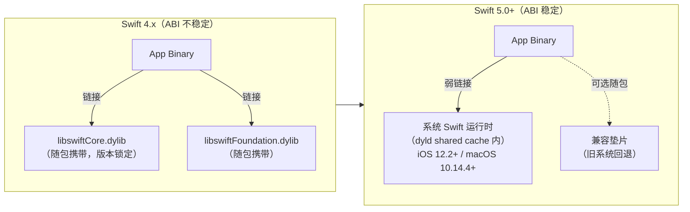
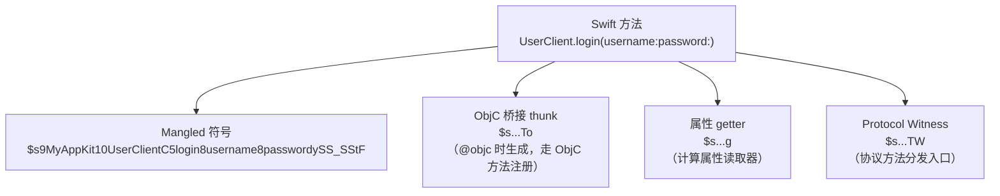
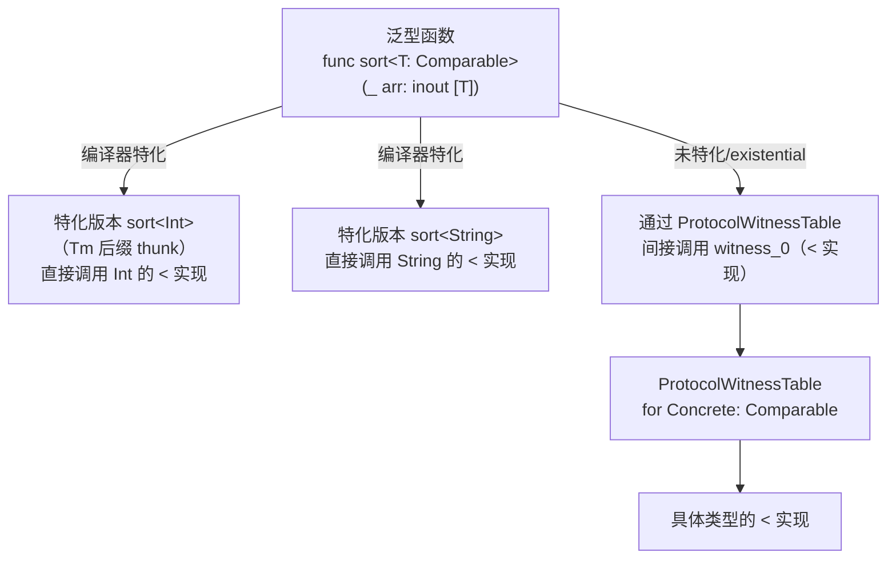
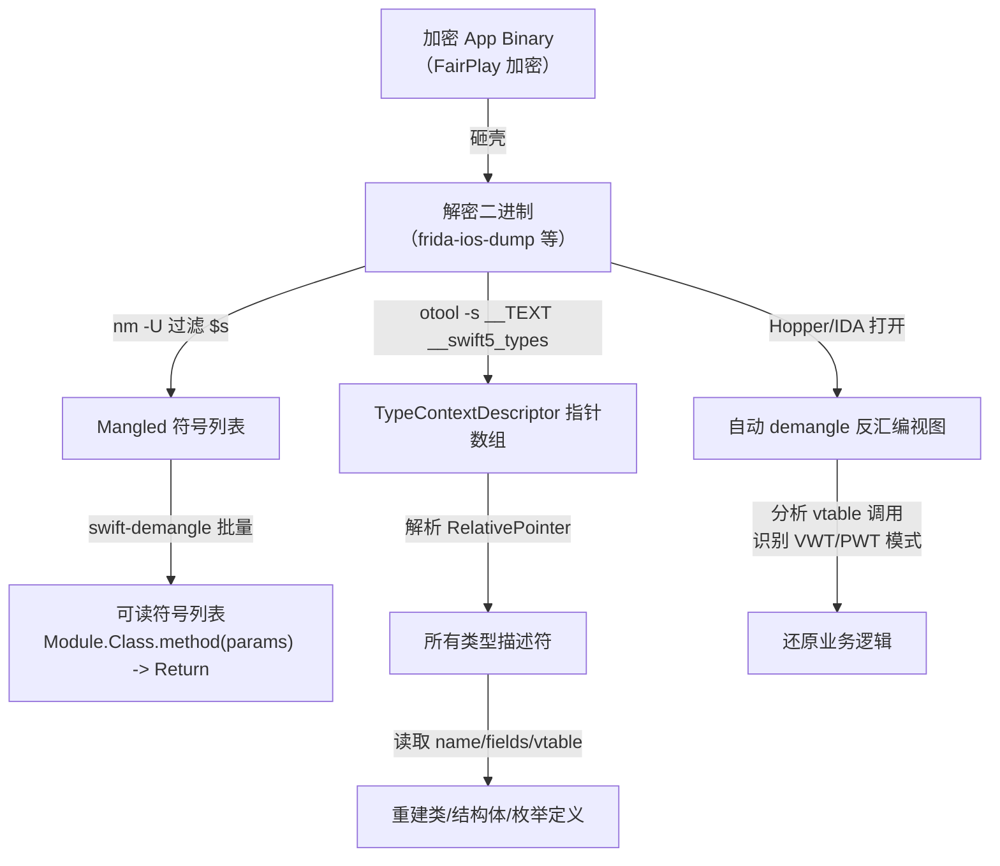

# Swift ABI 与 Name Mangling 深入

> [!abstract] TL;DR
> Swift 5.0（Xcode 10.2，2019 年）宣告 ABI 稳定，系统框架可内嵌单份 Swift 运行时，App 不再需要随包携带自己的副本。ABI 稳定的核心支撑是一套精确定义的二进制接口：name mangling 规则、type metadata 布局、value witness table 协议、protocol witness table 协议。逆向 Swift 二进制必须掌握 `$s` 前缀的 mangling 编码规则（才能解读 `swift-demangle` 输出）、type metadata 结构（才能重建类型）、value/protocol witness table（才能理解泛型与协议分发机制）。本篇对这套 ABI 做完整的原理级拆解，并给出逆向中的定位与还原技巧。

---

## 概述与定位

Swift 的 ABI（Application Binary Interface）稳定是整个 Swift 生态演进的里程碑事件。在 Swift 5.0 之前，每一个 App 都必须在 `Frameworks/` 目录下随包携带 `libswiftCore.dylib`、`libswiftFoundation.dylib` 等一整套 Swift 标准库，形成"臃肿包"问题。Swift 5.0 宣告 **ABI 稳定**后，iOS 12.2+/macOS 10.14.4+ 系统镜像中已内嵌正式的 Swift 运行时，App 无需再附带标准库，包体积可大幅缩减。

ABI 稳定意味着：

1. **二进制兼容**：用 Swift 5 编译器生成的代码，可以在任何支持 Swift 5 ABI 的系统上运行，无需重新编译。
2. **接口固化**：调用约定、内存布局、metadata 格式、mangling 规则全部锁定，编译器不得随意更改（演进须经过 ABI 演进提案流程）。
3. **模块稳定性**（Module Stability，Swift 5.1+）：`.swiftinterface` 文件允许以二进制形式分发框架，消费者用更新版编译器仍可调用。

本篇是系列第 15 篇，衔接 [[14.Swift运行时简介]] 中介绍的四种派发模型与 metadata 概念，向下深入 ABI 细节：mangling 完整编码规则、type metadata 二进制布局、value witness table 与 protocol witness table 的结构与作用，以及跨模块 ABI 稳定与 ObjC 互操作时的 mangling 特殊处理。

---

## 原理与机制

### ABI 稳定前后的对比



ABI 稳定后，系统 Swift 运行时进入 [[16.dyld_shared_cache与系统框架逆向]] 描述的 dyld shared cache，与 UIKit/Foundation 等框架合并在一起，启动时一次性映射，无需重复加载。

### 符号前缀：`_$s` 与 `$s` 的来历

Swift 的 name mangling 经历了几代演变：

| 时代 | 前缀 | 说明 |
|---|---|---|
| Swift 1–2 | `_TF`/`_TT` 等 | 早期 mangling，现已废弃 |
| Swift 3–4 | `_T0` | 过渡方案 |
| Swift 5+ (ABI 稳定后) | `$s`（目标文件中为 `_$s`，因 macOS/iOS 平台 C 符号约定加 `_` 前缀） | 当前稳定方案 |

在目标文件（`.o`）和最终二进制中，符号实际以 `_$s` 存储（C 符号规范前缀），但 `swift-demangle` 工具接受带或不带 `_` 前缀的输入。

### Name Mangling 的设计目标

Name mangling 必须将以下所有信息无歧义地编码进一个 ASCII 字符串：

- **模块名**：防止跨模块名冲突
- **类型限定**：类/结构体/枚举/扩展/协议 各自的命名空间
- **函数名与参数标签**：Swift 支持同名不同标签的重载
- **参数类型与返回类型**：支持参数类型重载
- **泛型参数**：泛型函数与泛型类型的特化或非特化形式
- **访问修饰符语境**：private/internal 的文件私有性
- **特殊 thunk/witness**：协议 conformance witness、泛型特化 thunk、ObjC 桥接 thunk 等

---

## 结构/算法/伪代码详解

### Mangling 编码语法

Swift 的 mangling 遵循一套固定的语法（详见 Swift 源码 `lib/Demangling/Demangler.cpp`），核心规则如下：

#### 长度前缀编码（Length-prefixed identifiers）

任意标识符以其 **字节长度（十进制 ASCII）** 为前缀：

```
9MyAppKit    →  9 个字符的 "MyAppKit"
10UserClient →  10 个字符的 "UserClient"
```

私有（`fileprivate`/`private`）成员还会携带文件名哈希，格式为 `0<length><file_hash><name_length><name>`，防止不同文件中同名私有符号碰撞。

#### 类型上下文限定符

| 字符 | 含义 |
|---|---|
| `C` | class |
| `V` | struct |
| `O` | enum |
| `P` | protocol |
| `E` | extension（后接被扩展类型） |
| `I` | protocol conformance（内部 thunk） |

完整类型路径从外到内逐层展开：

```
$s9MyAppKit10UserClientC5loginySS_SStF
  ↑                ↑       ↑  ↑   ↑ ↑
  │                │       │  │   │ └─ F = 函数/方法
  │                │       │  │   └─── ySS_SSt = 参数类型 (String, String) -> ()
  │                │       │  └─────── 5login = 方法名（5个字符）
  │                │       └────────── C = class（UserClient 是 class）
  │                └────────────────── 10UserClient = 类名（10个字符）
  └─────────────────────────────────── 9MyAppKit = 模块名（9个字符）
```

#### 类型编码速查

| 编码 | Swift 类型 |
|---|---|
| `Si` | `Swift.Int` |
| `Ss` | `Swift.String` |
| `Sb` | `Swift.Bool` |
| `SD` | `Swift.Dictionary` |
| `SA` | `Swift.Array` |
| `So` | ObjC 类（类前缀，后接类名） |
| `SS` | `Swift.String`（旧格式） |
| `yt` | `Void`（空元组 `()`） |
| `Sq` | Optional（泛型包装，后接基础类型） |
| `SQ` | Implicitly Unwrapped Optional |

#### 泛型参数编码

泛型参数按字母序用 `q_`、`q0_`、`q1_` ... 表示（或 `x`/`q`，视版本）：

```
// func identity<T>(_ x: T) -> T
$ss8identityxxlF
             ↑↑↑
             x = 泛型参数 T
             x = 返回类型 T（同一个 T）
             l = where 约束列表（此处为空约束标记）
             F = 函数
```

协议约束附加 `_p` 后缀或内联 conformance 描述：

```
// func describe<T: CustomStringConvertible>(_ x: T)
// 编码中会携带 T 对 CustomStringConvertible 的约束引用
```

#### 特殊节点：访问器、thunk、witness

| 符号模式 | 含义 |
|---|---|
| `...g` 结尾 | getter |
| `...s` 结尾 | setter |
| `...m` 结尾 | modify accessor |
| `...W` | Protocol Witness Table（协议证人表） |
| `...Wl` | lazy protocol witness accessor |
| `...TW` | protocol witness thunk |
| `...Tm` | generic specialization thunk |
| `...To` | ObjC 方法兼容 thunk（Swift → ObjC 桥接） |
| `...TO` | ObjC → Swift 桥接 thunk（反向） |



### swift-demangle 工具使用详解

```bash
# 1. 直接 demangle 单个符号
swift-demangle '$s9MyAppKit10UserClientC5login8username8passwordySS_SStF'
# 输出：MyAppKit.UserClient.login(username: Swift.String, password: Swift.String) -> ()

# 2. xcrun 包装（Xcode 工具链路径）
xcrun swift-demangle '$s9MyAppKit10UserClientC5login8username8passwordySS_SStF'

# 3. 批量：从 nm 符号表中过滤并 demangle
nm -U MyApp.decrypted | awk '{print $3}' | grep '^\$s' | swift-demangle

# 4. 从二进制中提取所有 Swift 符号并 demangle
nm -U MyApp | grep '^\$s' | while read addr type sym; do
    echo "$addr $type $(swift-demangle $sym)"
done

# 5. 反向：将可读符号名 mangle 回来（调试用）
swift-demangle --mangle 'MyAppKit.UserClient.login(username: Swift.String, password: Swift.String) -> ()'
```

> [!warning] 以上输出均为示意，实际符号因编译器版本与代码细节而异。

### Type Metadata 二进制布局

每个 Swift 类型在运行时对应一块 **Type Metadata**，由编译器静态生成并落入 `__TEXT` 段（只读），运行时按需从 metadata 中读取 vtable、VWT 指针等信息。

#### ClassMetadata 布局（class 类型）

```
offset  field
──────  ─────────────────────────────────────────────────────
-2*ptr  superclass metadata 指针（若无则为 nil 或 NSObject metadata）
-1*ptr  ObjC cache（objc_class.cache 字段，兼容 ObjC ABI）
 0      kind / isa（对 ObjC 可见时，指向 ObjC metaclass；
                   纯 Swift 时，kind = -(堆对象标志)）
+1*ptr  value witness table 指针（VWT）
+2*ptr  TypeContextDescriptor 指针（nominal type descriptor）
+3*ptr  parent metadata 指针（嵌套类型用）
        [泛型参数 metadata 指针，若类有泛型参数则依次追加]
        vtable 槽 0（第一个虚方法的函数指针）
        vtable 槽 1
        ...
        vtable 槽 N-1
```

> 单位 `ptr` = 8 字节（arm64 / x86_64）。

#### StructMetadata / EnumMetadata 布局

struct 和 enum 的 metadata 比 class 精简，无 vtable：

```
offset  field
──────  ──────────────────────────────────
 0      kind（正整数，MetadataKind::Struct = 0x200 / Enum = 0x201）
+1*ptr  value witness table 指针（VWT）
+2*ptr  TypeContextDescriptor 指针
        [泛型参数 metadata 指针，若有]
```

#### TypeContextDescriptor（名义类型描述符）

`TypeContextDescriptor` 是每个类型的"档案"，编译期生成、只读，落在 `__TEXT,__swift5_types` 节（通过指针数组索引）：

```c
// 伪代码，实际为 C++ 模板展开
struct TypeContextDescriptor {
    ContextDescriptorFlags  flags;          // 类型种类（class/struct/enum）、访问级别等
    RelativePointer<TypeContextDescriptor> parent;  // 外层类型或模块
    RelativePointer<char>  name;            // 类型名（mangled，null-terminated）
    RelativePointer<...>   accessFunction;  // 获取 metadata 的函数（泛型类型用）
    RelativePointer<FieldDescriptor> fields; // 字段描述符

    // class 专属：
    RelativePointer<TypeContextDescriptor> superclassType; // 父类类型
    uint32_t  numImmediateMembers;  // vtable 槽数量
    uint32_t  numFields;
    uint32_t  fieldOffsetVectorOffset; // 字段偏移向量在 metadata 中的偏移
    VTableDescriptor vtable;       // vtable 描述（槽偏移与大小）
    OverrideTableHeader overrides; // override 信息（子类 override 父类方法）
};
```

**相对指针（RelativePointer）**：Swift 的元数据大量使用 32-bit 相对偏移而非绝对指针，节省空间并利于 ASLR（PIE）场景下的 section 映射，读取时需加上字段本身地址计算绝对目标：

```
target_addr = field_addr + int32_value
```

### Value Witness Table（VWT）

Value Witness Table 是 Swift **值语义**的运行时核心，描述如何对一个类型的值进行基本操作：

```c
// 伪代码布局
struct ValueWitnessTable {
    // 操作函数指针（按固定顺序）
    void* (*initializeBufferWithCopyOfBuffer)(ValueBuffer* dest,
                                              ValueBuffer* src,
                                              Metadata* self);
    void  (*destroy)(OpaqueValue* object, Metadata* self);
    void* (*initializeWithCopy)(OpaqueValue* dest,
                                OpaqueValue* src,
                                Metadata* self);
    void* (*assignWithCopy)(OpaqueValue* dest,
                            OpaqueValue* src,
                            Metadata* self);
    void* (*initializeWithTake)(OpaqueValue* dest,
                                OpaqueValue* src,
                                Metadata* self);
    void* (*assignWithTake)(OpaqueValue* dest,
                            OpaqueValue* src,
                            Metadata* self);
    // …（getEnumTag / destructiveProjectEnumData 等 enum 专属函数）

    // 值属性（flags + 尺寸信息）
    ValueWitnessFlags flags;       // isPOD / isValueInline / hasSpareBits 等
    size_t            size;        // sizeof(T)
    size_t            stride;      // 相邻数组元素间距（含 padding）
    size_t            extraInhabitantCount; // 用于 Optional<T> 等场景的额外值数量
};
```

**为什么逆向时关注 VWT？**

- 泛型函数的实现对每个类型操作都间接通过 VWT，Hopper/IDA 显示大量 `[x0 + 0x10]`/`[x0 + 0x18]` 风格的间接调用，正是在查 VWT 的 `initializeWithCopy`/`destroy` 等槽。
- VWT 的 `size`/`stride` 字段可直接还原类型的内存大小，辅助判断 struct 布局。
- `flags.isPOD`（是否平凡拷贝/析构）可判断该类型是否含引用计数资源，辅助逆向时区分轻量值类型与含 ARC 引用的类型。

### Protocol Witness Table（PWT）

Protocol Witness Table 对应 Swift 的协议派发机制（[[14.Swift运行时简介]] 中的 witness table 派发），结构如下：

```c
// 伪代码
struct ProtocolWitnessTable {
    const ProtocolConformanceDescriptor* conformance; // 指向 conformance 描述符（在 __swift5_proto 节）

    // 后续是该类型对协议每个要求的实现函数指针，顺序与 ProtocolDescriptor 中要求顺序一致：
    void* witness_0;  // 协议要求 0 的实现（具体类型）
    void* witness_1;  // 协议要求 1 的实现
    // ...
};
```

`ProtocolConformanceDescriptor` 落在 `__TEXT,__swift5_proto` 节，内容：

```c
struct ProtocolConformanceDescriptor {
    RelativePointer<ProtocolDescriptor>  protocol;   // 指向协议描述符
    union {                                          // 被 conform 的类型
        RelativePointer<TypeContextDescriptor>  typeDescriptor;
        RelativePointer<ObjCClassType>          objcClass;
    };
    RelativePointer<ProtocolWitnessTable>       witnessTable; // 预生成的 PWT（非泛型）
    ConformanceFlags                            flags;
};
```

**泛型特化与 witness**：当泛型函数 `func foo<T: Protocol>(_ x: T)` 被特化为具体类型时，编译器生成一个 **specialized thunk**（mangled 符号带 `Tm` 或 `Tq` 后缀），其中内嵌对应 VWT 和 PWT 的直接引用，避免运行时查找开销（这是 Swift 泛型零成本抽象的实现基础）。



### 跨模块 ABI 稳定：swiftinterface 文件

Swift 5.1 引入 **module stability**，用 `.swiftinterface` 文件（类似头文件）描述框架的公开 API，格式为 Swift 源码语法子集（只含声明，无实现），由编译器生成：

```swift
// Example.swiftinterface（示意）
// swift-interface-format-version: 1.0
// swift-compiler-version: Apple Swift version 5.9
// swift-module-flags: -module-name Example
import Foundation
public class UserClient {
    public func login(username: Swift.String, password: Swift.String)
    @objc deinit
}
```

框架分发者提供 `.swiftinterface` + `.swiftmodule`（旧格式，可选），消费者用任意 Swift 5+ 编译器即可调用，无需源码，且不受 swiftmodule 格式版本锁定的限制。

### 与 ObjC 互操作时的 Mangling 特殊处理

当 Swift 方法带有 `@objc` 属性时，编译器同时生成两个符号：

1. **Swift mangled 符号**（正常 `$s...F`）：Swift 侧直接/vtable 派发入口。
2. **ObjC 桥接 thunk**（`$s...To` 后缀）：注册为 ObjC 方法的 IMP，内部做调用约定转换后跳转到 Swift 实现。

```bash
# 示例：一个 @objc func login() 会生成两个符号
nm MyApp | grep login
_$s9MyAppKit10UserClientC5loginyyF      # Swift 直接入口
_$s9MyAppKit10UserClientC5loginyyFTo    # ObjC thunk（To 后缀）
```

在 Mach-O 的 `__objc_classlist` 元数据中，该方法的 IMP 字段指向 `...To` thunk，而非 Swift 实现本身。逆向时在 class-dump 输出中看到的方法，实际执行的第一条指令是 thunk，需继续跟踪才能进入 Swift 函数体。

---

## 工具视角与实战

### 逆向 Swift 符号的完整工作流



### 关键 otool 命令

```bash
# 查看所有 Swift 专属节
otool -l MyApp.decrypted | grep -A8 'swift5'

# 读取 __swift5_types 节原始字节（相对指针数组）
otool -s __TEXT __swift5_types MyApp.decrypted | head -40

# 读取 __swift5_reflstr（字段名字符串，直接可读）
otool -s __TEXT __swift5_reflstr MyApp.decrypted | strings

# 读取 __swift5_fieldmd（字段描述符）
otool -s __TEXT __swift5_fieldmd MyApp.decrypted

# 读取 __swift5_proto（协议 conformance）
otool -s __TEXT __swift5_proto MyApp.decrypted
```

### Frida 中定位并 hook 纯 Swift 方法

```js
// 1. 枚举所有以 $s 开头的导出符号
Process.enumerateExports('MyApp').forEach(function(exp) {
    if (exp.name.startsWith('$s')) {
        var demangled = Swift.demangle(exp.name); // Frida-Swift 插件
        if (demangled.includes('UserClient') && demangled.includes('login')) {
            console.log('Found:', demangled, 'at', exp.address);
        }
    }
});

// 2. 直接用 mangled 名查找并 hook
var sym = Module.findExportByName(null, '_$s9MyAppKit10UserClientC5login8username8passwordySS_SStF');
if (sym) {
    Interceptor.attach(sym, {
        onEnter: function(args) {
            // arm64 Swift 调用约定：
            // x0 = self（class 实例），x1 = 第一个 String（data ptr），x2 = 第一个 String（length）
            // x3 = 第二个 String（data ptr），x4 = 第二个 String（length）
            var usernamePtr  = args[1];
            var usernameLen  = args[2].toUInt32();
            var username     = usernamePtr.readUtf8String(usernameLen);
            console.log('username:', username);
        }
    });
}
```

> [!warning] 示例输出为示意，具体寄存器布局需参考 Swift ABI 规范与实际反汇编确认。

### IDA/Hopper 分析 VWT 调用

在 IDA 中，泛型函数体内通常有如下模式（arm64）：

```asm
; 读取 type metadata 指针（第一个泛型参数的 metadata 通常在最后几个寄存器）
LDR  X8, [X20]          ; X20 = type metadata 指针
                         ; X8  = value witness table 指针（metadata 偏移 -1 * ptr 处）
LDR  X9, [X8, #0x10]    ; VWT.initializeWithCopy（偏移 0x10 是第三个函数指针）
BLR  X9                 ; 调用 initializeWithCopy
```

识别 VWT 调用的规律：
- 从 metadata 指针的 **负偏移**（如 `[x0, #-8]`）读 VWT 指针。
- 从 VWT 的**固定正偏移**读函数指针（每个函数 8 字节，按固定顺序）。

对照上文 VWT 布局表中的偏移，可以准确判断这是在调用哪个值操作（destroy、copy、take 等）。

---

## 安全性与正确使用

### Mangling 不是混淆

许多开发者误以为 mangled 符号的可读性差等于"混淆"。事实上：

- `swift-demangle` 是公开工具，一条命令还原全部符号。
- `__swift5_reflstr` 节直接存放未 mangle 的字段名字符串，逆向者无需任何工具即可阅读。
- `__swift5_fieldmd` 通过 `FieldDescriptor` 可重建所有 struct/class 的字段名与类型。

**结论**：Swift 二进制对逆向者的信息暴露面与 ObjC 相当，不应依赖 mangling 做安全遮挡。

### 真正有效的符号保护：swiftshield 与编译期混淆

[swiftshield](https://github.com/rockbruno/swiftshield) 在编译前对 Swift 源码中的类名、方法名、属性名做随机替换，使 mangled 符号中的语义名变为无意义字符串（如 `a1b2c3`），有效提升逆向难度。配合以下措施形成纵深防御：

| 措施 | 效果 |
|---|---|
| `swiftshield` 混淆 | mangled 符号中的名称变为随机字符串 |
| Strip Debug Symbols | 删除 `.dSYM` 符号表，逆向者无法用 DSYM 还原崩溃调用栈 |
| Strip Swift Symbols（Xcode Build Settings） | 删除 `__swift5_reflstr` 等 reflection 节，减少字段名泄露 |
| 安全逻辑用 `struct` + `final` | 走直接派发，排除消息 hook |

### 泛型特化的 ABI 影响

过度依赖泛型且禁止特化（`@_specialize` 未使用、模块边界阻止内联）会导致关键函数走 PWT 间接调用路径，每次调用多一次内存读取。对性能敏感的热路径，可用 `@_specialize(where T == SomeType)` 提示编译器生成特化版本：

```swift
@_specialize(where T == Int)
@_specialize(where T == String)
func processItems<T: Processable>(_ items: [T]) {
    // 编译器为 Int 和 String 生成特化版本，走直接调用
}
```

### 跨模块 ABI 稳定的陷阱

`@inlinable` 函数的函数体会被内嵌到框架的 `.swiftinterface` 中，消费者编译时会把它直接内联到自己的模块，导致该函数的实现细节成为公开 ABI 的一部分——修改 `@inlinable` 函数的实现会破坏 ABI 兼容性，需谨慎使用：

```swift
// ❌ 危险：改变实现等于破坏 ABI
@inlinable
public func computeHash(_ input: String) -> Int {
    // 这段实现细节已固化为 ABI
    return input.unicodeScalars.reduce(0) { $0 ^ Int($1.value) }
}

// ✓ 安全：实现在框架内，外部只看到声明
public func computeHash(_ input: String) -> Int {
    return _computeHashImpl(input)
}
```

---

## 小结

- Swift 5.0 的 **ABI 稳定**固化了 mangling 规则、metadata 布局、VWT/PWT 结构，使系统内嵌单份运行时成为可能。
- **Name mangling** 以 `$s`/`_$s` 为前缀，用长度前缀标识符 + 类型限定符 + 参数类型编码构成，`swift-demangle` 可完整还原；`To`/`TW`/`Tm` 等后缀标识 thunk 类型，是逆向的关键区分点。
- **Type Metadata**（ClassMetadata/StructMetadata）嵌入 vtable、VWT 指针和 TypeContextDescriptor，落在 `__swift5_types` 节，是重建类型结构的切入口。
- **Value Witness Table** 描述类型的拷贝/析构/大小语义，泛型函数间接通过它操作任意类型的值；逆向中识别 VWT 调用模式是理解泛型代码的关键。
- **Protocol Witness Table** 实现协议派发，`ProtocolConformanceDescriptor` 落在 `__swift5_proto`，描述每个 conformance 的 witness 函数指针。
- **ObjC 互操作**时，`@objc` 方法生成 `...To` thunk 注册为 ObjC IMP；逆向时需从 thunk 继续跟踪才能进入 Swift 函数体。
- **Mangling 不是安全保护**，`__swift5_reflstr` 直接暴露字段名；真正的混淆需借助 swiftshield 等工具在编译前替换语义名。

---

## 相关阅读

- [[14.Swift运行时简介]]——四种派发模型与 Swift metadata 概览
- [[16.dyld_shared_cache与系统框架逆向]]——Swift 运行时在 dyld shared cache 中的位置
- [[11.Mach-O中的ObjC元数据]]——ObjC 元数据节体系，与 `__swift5_*` 平行
- [[12.iOS逆向工具]]——Hopper/IDA/Frida 工具链在 Swift 二进制分析中的应用
- [[13.iOS安全与砸壳]]——砸壳前置步骤
- [[04.objc_msgSend消息发送]]——ObjC 消息派发，`@objc dynamic` 方法的底层路径
- Swift ABI 规范（官方）：[https://github.com/apple/swift/blob/main/docs/ABI/](https://github.com/apple/swift/blob/main/docs/ABI/)
- swift-demangle 源码：`lib/Demangling/` in the Swift open source repo

---

[[00.Objective-C与iOS运行时总览|⬆ 系列总览]] | [[14.Swift运行时简介|← 上一章]] | [[16.dyld_shared_cache与系统框架逆向|→ 下一章]]
