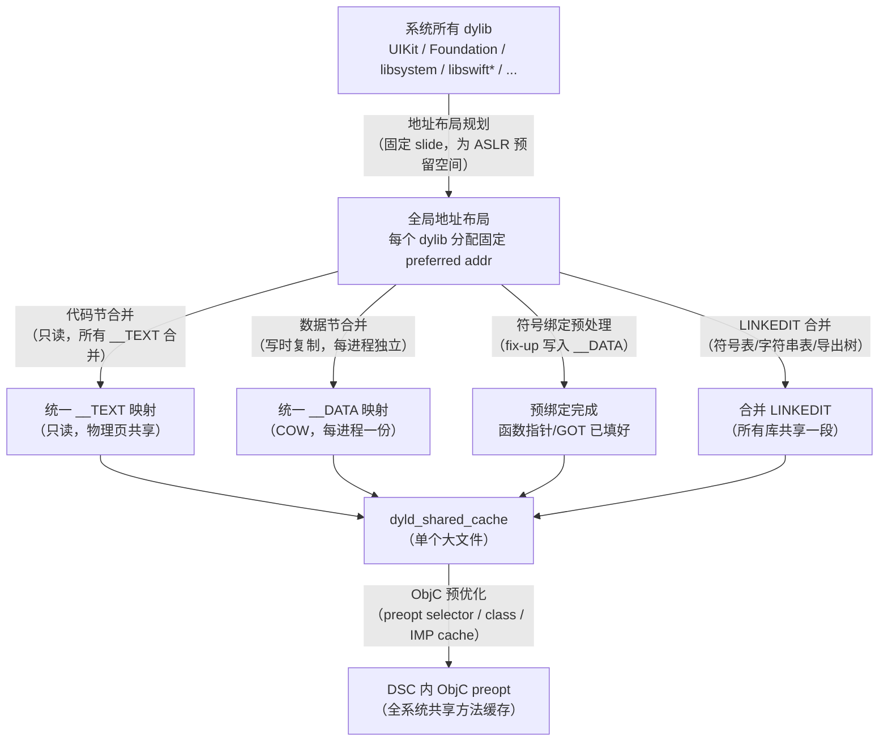
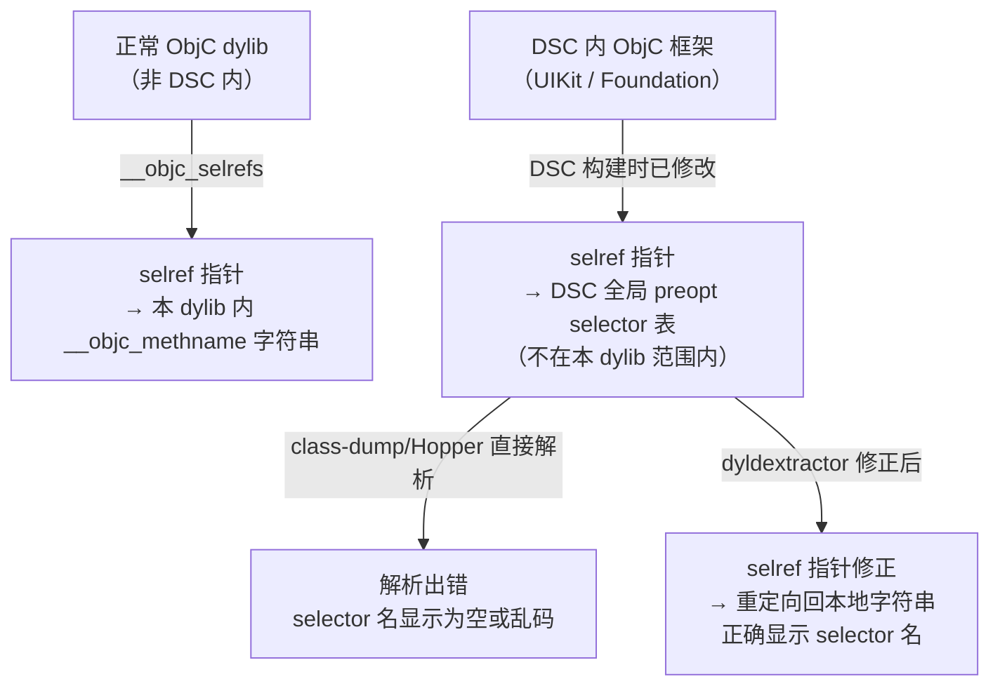

# dyld Shared Cache 与系统框架逆向

> [!abstract] TL;DR
> iOS 和 macOS 将系统所有框架（UIKit、Foundation、libsystem、Swift 运行时……）预先链接合并为一个巨型文件——**dyld shared cache（DSC）**，启动时以只读内存映射方式共享于所有进程，大幅降低系统启动时间与内存占用。逆向系统框架必须先从 DSC 中提取目标 dylib；工具链涵盖 Apple 官方 `dsc_extractor`、社区 `dyldextractor`、IDA/Ghidra 的 DSC loader 插件。理解 DSC 的 header/mappings/images/LINKEDIT 合并结构，是正确提取并分析系统框架的前提；ObjC preopt cache 的存在使方法查找在 DSC 中得到额外优化，逆向时需识别相关结构差异。

---

## 概述与定位

### 为什么需要 dyld Shared Cache

iOS/macOS App 数量巨大，几乎每个 App 都链接了 `UIKit`、`Foundation`、`libsystem_c`、`libdispatch`、`libswiftCore` 等系统库。如果每个进程启动时各自独立加载这些 dylib，会带来：

1. **重复磁盘 I/O**：每个 dylib 要独立读取、解析 Mach-O 头、解析符号表。
2. **重复内存占用**：相同代码段在每个进程各有一份物理页，无法共享。
3. **重复符号绑定**：每个进程启动时 dyld 要独立为这些库做符号绑定（fix-up），开销线性增长。

dyld shared cache（DSC）通过**预链接**解决上述问题：在系统安装或 OTA 更新时，`update_dyld_shared_cache`（macOS）或 OS 镜像构建工具（iOS）将所有系统 dylib 合并为一个大文件，预先完成符号绑定和地址布局，运行时通过 `mmap` 只读共享映射到所有进程的虚拟地址空间。

### DSC 在系统中的位置

| 平台 | DSC 文件路径 |
|---|---|
| iOS 设备（越狱可访问） | `/System/Library/Caches/com.apple.dyld/dyld_shared_cache_arm64`<br/>`dyld_shared_cache_arm64e`（arm64e 设备） |
| macOS（Apple Silicon） | `/System/Volumes/Preboot/Cryptexes/OS/System/Library/dyld/dyld_shared_cache_arm64e` |
| macOS（Intel） | `/private/var/db/dyld/dyld_shared_cache_x86_64` |
| iOS Simulator | `$(DEVELOPER_DIR)/../Platforms/iPhoneSimulator.platform/...` |
| Xcode 附带（用于分析） | Xcode.app 内的 Symbols 目录（`.dSYM` 符号及 DSC 子集） |

从 iOS 16 / macOS 13（Ventura）开始，Apple 进一步将 DSC 拆分为多个子文件（`dyld_shared_cache_arm64e.01`、`.02` 等），以应对文件体积超过文件系统限制的问题。

本篇衔接 [[15.Swift_ABI与name_mangling深入]]（Swift 运行时在 DSC 中以普通系统框架形式存在）和 [[17.arm64e_PAC指针认证专题]]（arm64e DSC 中的符号指针经 PAC 签名），为逆向系统框架打下基础。

---

## 原理与机制

### DSC 构建流程



### DSC 文件结构

DSC 文件以 `dyld_cache_header` 开头，后接多个分区描述表：

```c
// 伪代码，参考 Apple 开源 dyld 仓库（dyld/include/mach-o/dyld_cache_format.h）
struct dyld_cache_header {
    char     magic[16];              // "dyld_v1   arm64e\0" 等魔数
    uint32_t mappingOffset;          // mappingInfo 数组的文件偏移
    uint32_t mappingCount;           // mapping 数量（通常 3：TEXT/DATA/LINKEDIT）
    uint32_t imagesOffset;           // imageInfo 数组的文件偏移
    uint32_t imagesCount;            // 嵌入的 dylib 数量（通常 1000+）
    uint64_t dyldBaseAddress;        // dyld 期望加载的基地址
    uint64_t codeSignatureOffset;    // 代码签名偏移
    uint64_t codeSignatureSize;
    uint64_t slideInfoOffset;        // ASLR slide 重定位信息
    uint64_t slideInfoSize;
    uint64_t localSymbolsOffset;     // 本地符号表（strip 后的符号，debugger 用）
    uint64_t localSymbolsSize;
    uint8_t  uuid[16];               // cache UUID
    uint64_t cacheType;              // 0=development, 1=production
    uint32_t branchPoolsOffset;
    uint32_t branchPoolsCount;
    // ... 更多字段（不同版本有扩展）
};

// 每个 mapping（文件区域 → 虚拟地址映射）
struct dyld_cache_mapping_info {
    uint64_t address;    // 虚拟地址起始（运行时）
    uint64_t size;       // 映射大小
    uint64_t fileOffset; // 文件内偏移
    uint32_t maxProt;    // vm_prot（rwx 标志）
    uint32_t initProt;
};

// 每个嵌入的 dylib 描述
struct dyld_cache_image_info {
    uint64_t address;        // 运行时虚拟地址（Mach-O header 所在地址）
    uint64_t modTime;        // 文件修改时间（构建时记录）
    uint64_t inode;
    uint32_t pathFileOffset; // DSC 文件内，指向该 dylib 路径字符串的偏移
    uint32_t pad;
};
```

典型的 mapping 布局（以 arm64e 为例）：

| mapping | 权限 | 内容 |
|---|---|---|
| mapping 0 | `r-x`（只读可执行） | 所有 dylib 的 `__TEXT` 节（代码、只读数据、Swift/ObjC metadata） |
| mapping 1 | `rw-`（读写） | 所有 dylib 的 `__DATA`/`__DATA_CONST`（GOT、引用计数表、指针等） |
| mapping 2 | `r--`（只读） | 合并的 `LINKEDIT`（符号表、字符串表、导出树、代码签名） |

> [!note] arm64e DSC（iOS 14+）实际有更多 mapping（如 `__AUTH_CONST`、`__AUTH` 等用于 PAC 相关数据），参见 [[17.arm64e_PAC指针认证专题]]。

### 为什么合并 LINKEDIT

LINKEDIT 段包含调试信息（符号表/字符串表）、导出树和代码签名。合并的好处：

- **省空间**：字符串表去重（多个库共用同一个符号字符串）。
- **省 I/O**：dyld 只需映射一段 LINKEDIT，即可查询所有库的符号，避免逐库加载。
- **快速符号查找**：dyld 构建全局符号哈希表（位于 DSC header 的 `localSymbolsOffset` 区域），`dlsym()` 可在 O(1) 内找到任意系统库符号。

### ObjC preopt cache（Selector / Class / IMP cache）

这是 DSC 中最影响逆向分析的结构之一。

正常的 ObjC 运行时在第一次调用某个 selector 时才把结果写入 `class_rw_t.cache`（[[04.objc_msgSend消息发送]] 详述）。但系统框架的方法调用在所有 App 中几乎是固定的，dyld/ObjC 运行时可以在 DSC 构建时**预计算**这些缓存，结果写入 DSC 文件本身：

```c
// DSC 内 ObjC 预优化结构（参考 objc4 源码 objc-runtime-new.h）
struct objc_opt_t {
    uint32_t version;
    int32_t  selopt_offset;    // selector string hash 表偏移（全系统共享）
    int32_t  headeropt_offset; // 已优化的 ObjC header 列表偏移
    int32_t  clsopt_offset;    // class name → metadata 哈希表偏移
    int32_t  protocolopt_offset; // protocol hash 表偏移
    int32_t  clsopt_offset2;
    // ...
};
```

**preopt selector 表**：DSC 构建时收集所有系统框架的所有 selector 字符串，写入一个全局哈希表，地址固定（不随 ASLR slide 变化，因为 __TEXT 整体 slide）。系统框架的 `__objc_selrefs` 节中的 selector 指针，在 DSC 构建时已绑定到该全局表中的对应字符串，运行时无需再修正 selref。

**preopt class 表**：类名 → `class_ro_t` 的哈希表，使 `objc_lookUpClass("UIViewController")` 可直接查表而不遍历所有 image 的 `__objc_classlist`。

**preopt IMP cache（stub IMP）**：iOS 15+ 引入 `prebuilt_selector_optimizations`，为系统类预计算 IMP，甚至直接把 IMP 写入 DSC 内的特殊区域（`__objc_opt_presel_data`），使 `objc_msgSend` 可跳过常规查找链直接命中。

> [!note] 逆向含义：分析从 DSC 提取的 dylib 时，若 `__objc_selrefs` 中的指针值异常（指向 DSC 基地址区域而非本 dylib 内），是因为这些指针在 DSC 构建时被重写为全局 preopt selector 表地址。提取工具必须修正这些引用，否则 class-dump / Hopper 解析会出错。

---

## 结构/算法/伪代码详解

### DSC 地址 → 文件偏移转换

DSC 中每个地址的解析需要两步：

1. 找到该地址落在哪个 mapping。
2. 计算文件偏移：`file_offset = address - mapping.address + mapping.fileOffset`。

```python
# 伪代码：DSC 地址解析
def addr_to_file_offset(dsc_header, address):
    for mapping in dsc_header.mappings:
        if mapping.address <= address < mapping.address + mapping.size:
            return address - mapping.address + mapping.fileOffset
    raise ValueError(f"Address {address:#x} not in any mapping")

# 提取某 dylib 的 Mach-O header
def extract_dylib_header(dsc_file, image_info):
    offset = addr_to_file_offset(dsc_header, image_info.address)
    dsc_file.seek(offset)
    return dsc_file.read(MachOHeader.SIZE)
```

### 单个 dylib 在 DSC 中的"碎片化"

各 dylib 的节（section）在 DSC 中并非连续存储——同类型节被合并：所有 `__TEXT` 节合并到 mapping 0，所有 `__DATA` 节合并到 mapping 1。因此，提取某个 dylib（如 `UIKit`）不能简单地把 Mach-O header 之后的字节复制出来，而必须：

1. 解析该 dylib 的 Mach-O load commands（特别是 `LC_SEGMENT_64`）。
2. 对每个 segment，从 DSC 中计算其文件偏移并复制出对应字节。
3. 重建完整的 Mach-O 文件（调整 `fileOffset` 字段使各节连续）。
4. 修正 fix-up（指针绑定、selref 等已被 DSC 预处理的引用）。

这正是 `dsc_extractor` 和 `dyldextractor` 做的事。

### ASLR slide 与 fix-up

DSC 整体加载时会被 dyld 施加一个随机 **slide**（ASLR），所有虚拟地址加上这个 slide。DSC 内的 fix-up（指针值）已在构建时写好了"无 slide"的值，dyld 加载时通过 `slideInfoOffset` 描述的重定位信息，批量对 `__DATA` 中的指针加上 slide。

提取 dylib 时，需要选择：

- **以 preferred 地址提取**（不加 slide）：指针值是构建时的 preferred 地址，可直接分析，但与 IDA 分析的"rebase"地址相符。
- **以运行时地址提取**（加当前 slide）：仅在越狱设备上通过内存转储获得，指针已含 slide，更接近真实运行状态，但每次重启 slide 不同。

---

## 工具视角与实战

### 工具一：dsc_extractor（Apple 官方）

Apple 在 `dyld` 开源仓库中提供 `dsc_extractor`，可从 DSC 批量提取所有嵌入的 dylib：

```bash
# 编译 dsc_extractor（需要下载 Apple dyld 开源仓库）
# 或使用 Xcode 自带版本（路径因版本而异）

# 从 macOS DSC 提取所有 dylib 到目录
/usr/bin/dsc_extractor \
    /System/Volumes/Preboot/Cryptexes/OS/System/Library/dyld/dyld_shared_cache_arm64e \
    /tmp/dsc_extracted/

# 提取后目录结构与系统框架路径一致：
# /tmp/dsc_extracted/usr/lib/libSystem.B.dylib
# /tmp/dsc_extracted/System/Library/Frameworks/UIKit.framework/UIKit
# ...
```

> [!warning] dsc_extractor 提取的 dylib 是"逻辑完整"的，但部分 selref/classref 可能未完全修正，在分析 ObjC 结构时需注意。

### 工具二：dyldextractor（社区，更好的 ObjC 修正）

[dyldextractor](https://github.com/arandomdev/DyldExtractor) 是专为逆向分析优化的提取工具，对 ObjC preopt cache 修正更完整，输出的 dylib 在 Hopper/IDA 中解析更准确：

```bash
# 安装
pip install dyldextractor

# 提取单个 framework
dyldex -e \
    /System/Library/Frameworks/UIKit.framework/UIKit \
    /System/Library/Caches/com.apple.dyld/dyld_shared_cache_arm64e \
    /tmp/UIKit.dylib

# 提取所有 framework（耗时较长）
dyldex_all \
    /System/Library/Caches/com.apple.dyld/dyld_shared_cache_arm64e \
    /tmp/extracted/
```

### 工具三：IDA Pro DSC Loader

IDA Pro 7.5+ 内置 DSC loader，可直接打开 DSC 文件，选择要分析的 image（如 `UIKit`），IDA 会自动解析相关节并完成初步 fix-up，无需手动提取：

```
File → Open → 选择 dyld_shared_cache_arm64e
→ 弹出 image 选择对话框
→ 选择 "/System/Library/Frameworks/UIKit.framework/UIKit"
→ IDA 加载该 image，相关依赖库同时加载为辅助（辅助库仅供符号解析，不完整反汇编）
```

优点：不用预提取，直接在 DSC 原始布局中分析，地址与运行时一致。
缺点：大型 DSC 加载极慢（UIKit 完整分析可能需数小时）；需要 IDA Pro 授权。

### 工具四：Ghidra DSC 支持

Ghidra 从 10.2 版本开始内置 DSC 解析支持：

```
File → Import File → 选择 dyld_shared_cache_*
→ Ghidra 自动识别为 DyldCacheProgram 格式
→ 在 Program Tree 中展开，选择目标 dylib（如 Foundation）
→ 右键 → Import As New Program → 分析该 dylib
```

Ghidra 的 DSC 支持在 macOS Silicon 上效果更好，Intel 版本偶有 LINKEDIT 修正问题。

### 在越狱设备上直接读取 DSC

越狱设备（如 palera1n / unc0ver 越狱后）可直接访问 `/System/Library/Caches/com.apple.dyld/`，可用 `scp`/`iproxy` 将 DSC 文件传回 macOS 分析：

```bash
# 在 Mac 上通过 iproxy 转发端口
iproxy 2222 22 &

# scp 传回 DSC（文件较大，arm64e 版本约 2-4 GB）
scp -P 2222 root@127.0.0.1:/System/Library/Caches/com.apple.dyld/dyld_shared_cache_arm64e \
    ~/Desktop/dyld_shared_cache_arm64e

# 验证完整性
shasum -a 256 ~/Desktop/dyld_shared_cache_arm64e
```

### class-dump 与 DSC 提取结合：还原 UIKit 头文件

```bash
# 1. 用 dyldextractor 提取 UIKit
dyldex -e UIKit /path/to/dyld_shared_cache_arm64e /tmp/UIKit.dylib

# 2. class-dump 生成头文件（-H 输出单独头文件，-o 指定输出目录）
class-dump -H /tmp/UIKit.dylib -o /tmp/UIKit_headers/

# 3. 在头文件中搜索感兴趣的私有 API
grep -r "viewWillTransition" /tmp/UIKit_headers/
grep -r "_sendDestroyNotification" /tmp/UIKit_headers/
```

### 分析 ObjC preopt 对方法列表的影响



**实际影响**：用 `dsc_extractor` 提取后直接 class-dump 有时会丢失某些方法名；用 `dyldextractor` 提取后结果更完整。若遇到方法名显示异常，优先改用 `dyldextractor`。

### DSC 版本差异与 iOS 历史演进

| iOS 版本 | DSC 特性 |
|---|---|
| iOS 3.1 | 首次引入 dyld shared cache |
| iOS 9 | ObjC preopt selector/class 哈希表写入 DSC |
| iOS 13 | LINKEDIT 进一步合并，`dyld_cache_accelerator_info` 加速 image 查找 |
| iOS 14 | arm64e DSC 引入 `__AUTH_CONST` 等 PAC 相关 mapping |
| iOS 15 | prebuilt_selector_optimizations / prebuilt IMP cache 写入 DSC |
| iOS 16 | DSC 拆分为多文件（`.01`/`.02` …） |
| iOS 17 | DSC 进一步优化，`dyld_cache_slide_info` 版本升至 v5 |

> iOS 16 以后 DSC 多文件拆分需要提取工具支持，使用旧版 `dsc_extractor` 或旧版 `dyldextractor` 会解析失败，需要更新工具版本。

---

## 安全性与正确使用

### 法律与授权边界

DSC 内包含 Apple 私有 API 和专有实现代码。提取和分析 DSC 内容：

- **合法场景**：安全研究（漏洞挖掘/披露）、逆向兼容性研究（私有 API 调用分析）、自有 App 调试（分析自己的 App 与系统框架的交互）。
- **禁止场景**：将提取的私有 API 集成到 App Store 提交的 App（违反 Apple 开发者协议）；将 Apple 专有代码用于商业产品（违反版权法）。

### 私有 API 检测与 App Store 审核

Apple 的 App Store 静态扫描会检测二进制中是否调用了私有 API（通过符号名与 DSC 内 dylib 导出符号对比）。即使通过字符串拼接或 `dlsym` 动态调用，也可能被扫描到。逆向 DSC 仅用于了解系统行为，不应将私有 API 用于生产 App。

### 对逆向分析者的安全含义

DSC 的存在意味着：

- 所有系统框架的完整代码（未加密）在越狱设备上均可访问。
- Apple 的安全机制（如私有 API 的隐蔽性）依赖于开发者协议约束，而非二进制不可及。
- 安全研究者可完整分析 UIKit/Foundation/Security.framework 等的内部实现，这是 iOS 漏洞研究的基础。

### DSC 提取研究的正确姿势

在自有测试设备（越狱 iPhone，非生产设备）上：

```bash
# 只读提取，不修改系统文件
# 分析结果仅用于安全研究 / 自有 App 调试
# 不将提取结果分发给第三方（版权）
```

---

## 小结

- **dyld shared cache** 将所有系统 dylib 预链接为一个大文件，以只读内存映射方式在所有进程间共享，大幅优化启动速度与内存占用。
- DSC 结构由 `dyld_cache_header`、`mappingInfo`（TEXT/DATA/LINKEDIT 三段）、`imageInfo`（每个 dylib 的地址与路径）组成；iOS 16+ 拆分为多子文件。
- **ObjC preopt cache**（selector/class/IMP 哈希表）在 DSC 构建时预计算并写入文件，使 `__objc_selrefs` 指针指向全局共享表而非本 dylib，是提取时需要修正的关键差异。
- 提取工具：`dsc_extractor`（Apple 官方，简单快速）、`dyldextractor`（ObjC 修正更完整，推荐逆向分析用）、IDA Pro/Ghidra DSC Loader（无需预提取，直接在 IDE 中分析）。
- 提取后配合 `class-dump` 还原私有 API 头文件，配合 Hopper/IDA 分析系统框架实现，是 iOS 逆向与漏洞研究的标准流程。
- iOS 16+ 的多文件 DSC 需要工具支持，务必使用最新版本的提取工具。

---

## 相关阅读

- [[15.Swift_ABI与name_mangling深入]]——Swift 运行时在 DSC 中以普通框架形式存在
- [[17.arm64e_PAC指针认证专题]]——arm64e DSC 中指针的 PAC 签名处理
- [[11.Mach-O中的ObjC元数据]]——ObjC 元数据节体系（DSC 内 dylib 也遵循此结构）
- [[12.iOS逆向工具]]——Hopper/IDA/class-dump 在 DSC 提取后的使用
- [[13.iOS安全与砸壳]]——App 加密与 DSC 的区别（App FairPlay vs DSC 未加密）
- [[04.objc_msgSend消息发送]]——preopt IMP cache 对 msgSend 的影响
- dyld 开源仓库：[https://github.com/apple-oss-distributions/dyld](https://github.com/apple-oss-distributions/dyld)
- dyldextractor：[https://github.com/arandomdev/DyldExtractor](https://github.com/arandomdev/DyldExtractor)

---

[[00.Objective-C与iOS运行时总览|⬆ 系列总览]] | [[15.Swift_ABI与name_mangling深入|← 上一章]] | [[17.arm64e_PAC指针认证专题|→ 下一章]]
