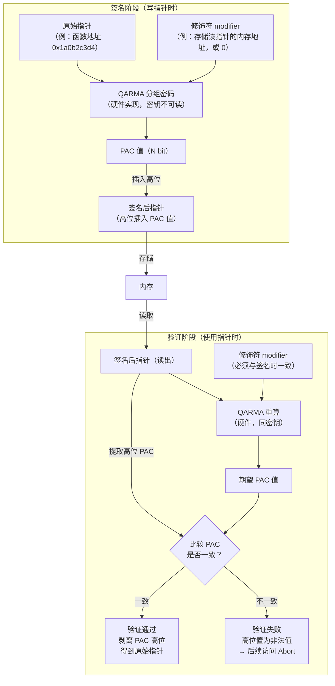
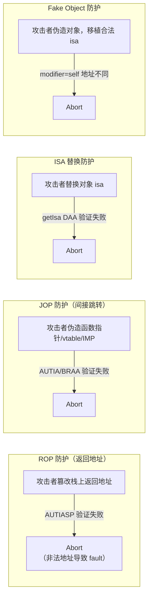

# arm64e PAC 指针认证专题

> [!abstract] TL;DR
> Pointer Authentication Code（PAC）是 ARMv8.3-A 引入的硬件级安全特性，苹果在 arm64e 架构（A12 芯片起）全面启用。PAC 通过五组密钥（IA/IB/DA/DB/GA）对关键指针（返回地址、函数指针、ObjC isa、vtable 等）进行签名，验证失败则触发故障，从根本上阻断 ROP/JOP 等控制流劫持攻击。逆向 arm64e 设备时，`PACIA`/`AUTIA`/`PACIASP`/`AUTIASP` 等指令随处可见，必须理解 PAC 签名/验证流程才能正确分析控制流；Frida 提供了 `ptrauth_strip` 接口；真正的绕过研究仅适用于授权安全评估场景。

---

## 概述与定位

### arm64e 是什么

`arm64e` 是苹果在 ARMv8.3-A 指令集扩展基础上定义的 ABI 变体，从 iPhone XS（A12 Bionic，2018 年）开始用于真机系统框架与内核，Xcode 11 起 App 也可选择以 arm64e 编译。

区别于普通 `arm64`（ARMv8-A）：

| 特性 | arm64 | arm64e |
|---|---|---|
| 指针宽度 | 64-bit，高位实际用于 TBI（Top-Byte Ignore）| 64-bit，高位用于存放 PAC 签名 |
| 返回地址保护 | 无 | `PACIASP`/`AUTIASP` 硬件签名/验证 |
| 函数指针保护 | 无 | `PACIA`/`AUTIA` 等签名/验证 |
| ObjC isa 保护 | non-pointer isa（低位 tag） | non-pointer isa + PAC 签名 |
| ROP/JOP 防护 | 无 | PAC 签名链，劫持即验证失败 |
| Mach-O 标识 | `cpu_subtype = ARM_ALL` | `cpu_subtype = ARM_V8_AARCH64_E` |

本篇是系列第 17 篇，是逆向技术层面的深入专题，衔接 [[16.dyld_shared_cache与系统框架逆向]]（arm64e DSC 的 PAC 相关 mapping）和后续越狱专题 [[18.越狱原理与TrollStore]]（越狱必须绕过 PAC 等防护）。

> [!caution]
> 本篇"绕过研究"部分仅从**防御视角**阐述攻击原理，所有具体绕过技术仅适用于**授权安全评估或自有设备研究**。在他人设备或生产系统上实施未授权的 PAC 绕过，违反计算机犯罪相关法律，严重后果请自行承担。

---

## 原理与机制

### PAC 的核心思想

PAC 利用 arm64 指针的**高位空闲比特**（虚拟地址通常只用低 40-48 位，高位为符号扩展）存放一个**密码学签名（PAC 值）**。签名由硬件密钥和上下文（modifier）通过 QARMA 分组密码计算得出。

```
┌──────────────────────────────────────────────────────────┐
│  arm64e 64-bit 指针                                       │
│  [63:56]  PAC 签名高 8 位（部分密钥比特数量因架构而异）   │
│  [55:49]  可能含 PAC 低位（具体比特分配见实现）            │
│  [48:0]   实际虚拟地址（低 49 位，含 TBI 扩展）           │
└──────────────────────────────────────────────────────────┘
```

**核心不变式**：指针在签名时被绑定到特定上下文（modifier），在验证时若指针值被篡改（地址改变或 PAC 比特改变），验证失败，CPU 将地址高位设置为非法值，导致后续内存访问或执行触发 `EXC_BAD_ACCESS`（内核层面是 Instruction Abort / Data Abort）。

### 五组密钥

ARM 规范定义了五类 PAC 密钥，每个进程（严格说是 EL1/EL0 上下文）有独立的硬件密钥寄存器：

| 密钥 | 用途 | 对应指令前缀 |
|---|---|---|
| IA（Instruction A） | 指令地址（函数指针），密钥 A | `PACIA`、`AUTIA`、`BLRAAZ`、`BRAAZ` |
| IB（Instruction B） | 指令地址（函数指针），密钥 B | `PACIB`、`AUTIB`、`BLRABZ`、`BRABZ` |
| DA（Data A）        | 数据地址（数据指针），密钥 A | `PACDA`、`AUTDA` |
| DB（Data B）        | 数据地址（数据指针），密钥 B | `PACDB`、`AUTDB` |
| GA（Generic A）     | 通用（不与指针绑定），产生 64-bit PAC 值存于通用寄存器 | `PACGA` |

苹果平台的实际使用分工：

- **IA 密钥**：函数指针（C 函数指针、ObjC IMP、Swift vtable 槽）签名。
- **IB 密钥**：返回地址签名（`PACIASP`/`AUTIASP` 用 IA 密钥的 SP 变体，实际使用 IA）。
- **DA 密钥**：数据指针（ObjC isa 指针、某些结构体指针）签名。
- **DB 密钥**：苹果保留，极少公开使用。
- **GA 密钥**：内核用于生成通用认证标签。

> [!note] 密钥的生命周期：密钥在进程创建时由内核随机生成并写入硬件寄存器，用户态代码无法读取密钥值（只能执行 PAC 指令让硬件使用密钥）。这是 PAC 安全性的硬件根基。

### 签名与验证流程



**modifier 的选择**原则：modifier 将签名与"存放该指针的位置"绑定，使攻击者即使得到一个合法签名指针，也无法把它搬移到另一个内存位置使用（因为 modifier 不同，验证会失败）。

### 关键 PAC 指令速查

| 指令 | 操作 | 密钥 | modifier |
|---|---|---|---|
| `PACIA Xn, Xm` | 对 Xn（指令地址）用 IA 密钥和 Xm 作 modifier 签名 | IA | Xm |
| `PACIA Xn, SP` / `PACIASP` | 对 Xn 用 IA 密钥和 SP 作 modifier 签名（函数入口保护返回地址） | IA | SP |
| `PACIB Xn, Xm` | 同 PACIA，但用 IB 密钥 | IB | Xm |
| `PACDA Xn, Xm` | 对 Xn（数据地址）用 DA 密钥和 Xm 签名 | DA | Xm |
| `AUTIA Xn, Xm` | 验证并剥离 Xn 中的 PAC（IA 密钥，modifier=Xm） | IA | Xm |
| `AUTIASP` | 验证并剥离 LR 中的 PAC（IA 密钥，modifier=SP，函数返回前） | IA | SP |
| `AUTDA Xn, Xm` | 验证并剥离 Xn 中的 PAC（DA 密钥，modifier=Xm） | DA | Xm |
| `BRAA Xn, Xm` | 验证 Xn（IA 密钥，modifier=Xm）后跳转 | IA | Xm |
| `BLRAA Xn, Xm` | 验证 Xn（IA 密钥，modifier=Xm）后调用（带 link） | IA | Xm |
| `XPACD Xn` | 无条件剥离 Xn 的 PAC（数据指针，不验证） | — | — |
| `XPACI Xn` | 无条件剥离 Xn 的 PAC（指令指针，不验证） | — | — |
| `XPACLRI` | 剥离 LR 的 PAC（等价 XPACI LR） | — | — |

---

## 结构/算法/伪代码详解

### 返回地址保护：PACIASP / AUTIASP 模式

这是 PAC 最普遍的用途，几乎在 arm64e 系统框架的每个函数中都能看到：

```asm
; arm64e 函数标准开场（保护返回地址）
_some_function:
    PACIASP            ; 对 LR（返回地址）用 IA 密钥 + SP 签名，结果写回 LR
    STP  X29, LR, [SP, #-16]!  ; 压栈（此时 LR 已含 PAC 签名）
    ...
    ; 函数体
    ...
    LDP  X29, LR, [SP], #16    ; 弹栈（恢复含 PAC 签名的 LR）
    AUTIASP            ; 验证 LR（IA 密钥 + 当前 SP），若篡改则 Abort
    RET                ; 跳转到（已验证的）返回地址
```

攻击者即使通过栈溢出篡改了压栈的 LR 值，`AUTIASP` 会重算 PAC 与高位比较，发现不匹配，将 LR 高位置为非法地址，`RET` 跳转到非法地址触发内核 Abort，而非跳转到攻击者指定的 ROP gadget。

**SP 作为 modifier 的意义**：不同栈帧的 SP 值不同，即使攻击者拿到了另一个栈帧的合法签名返回地址，移植到当前帧（SP 不同）也会验证失败。

### ObjC isa 保护

[[02.对象模型与isa]] 中介绍了 non-pointer isa（低位 tag 存储 retain count 等信息）。arm64e 在此基础上加入 PAC 签名：

```c
// 伪代码：arm64e ObjC 对象的 isa 读取（objc4 源码 objc-object.h）
inline Class
objc_object::getIsa() {
#if __has_feature(ptrauth_calls)
    // isa 中高位含 PAC 签名，需用 ptrauth_auth_data 验证并剥离
    uintptr_t raw_isa = isa.bits;
    // 使用 DA 密钥，modifier = self（对象地址，防止 isa 被搬移）
    return ptrauth_auth_and_strip(raw_isa, ptrauth_key_process_independent_data,
                                  ptrauth_blend_discriminator(self, ISA_SIGNING_DISCRIMINANT));
#else
    return (Class)((isa.bits & ISA_MASK));
#endif
}
```

关键设计：modifier 包含**对象自身地址**（`self`）。这意味着即使攻击者把一个合法的 isa 指针（含 PAC）从 objA 复制到 objB，在 objB 上调用 `getIsa()` 时，用 objB 地址作 modifier 重算 PAC，与 isa 中存储的 PAC（用 objA 地址签名）不一致，验证失败——有效防止 isa 替换攻击（Fake Object 攻击的核心操作）。

### objc_msgSend 的 bucket 与 IMP 保护

[[04.objc_msgSend消息发送]] 中的 `cache_t` 存储 `bucket_t`，每个 bucket 含 `sel` 和 `imp`。在 arm64e 中，`imp` 字段被 PAC 签名：

```c
// 伪代码：arm64e bucket_t IMP 读取（objc4 源码 objc-cache.mm）
IMP bucket_t::imp(bucket_t *base, Class cls) const {
#if __has_feature(ptrauth_calls)
    // IMP 在存入时用 IA 密钥、modifier = &this->_imp（指针存储地址）签名
    // 读取时需验证
    return (IMP)ptrauth_auth_function(_imp.load(std::memory_order_relaxed),
                                      ptrauth_key_function_pointer,
                                      ptrauth_blend_discriminator(this, 0));
#else
    return _imp.load(std::memory_order_relaxed);
#endif
}
```

若攻击者篡改了 bucket 中的 IMP（例如通过 isa 替换伪造一个 class 并插入恶意 IMP），在调用时 `AUTIA` 验证失败，阻断 JOP（Jump-Oriented Programming）攻击通过伪造 IMP 劫持控制流。

### Swift vtable 保护

[[14.Swift运行时简介]] 中的 Swift class vtable（虚表槽）在 arm64e 上同样被 PAC 签名：

```asm
; arm64e Swift vtable 方法调用（示意）
LDR  X8, [X0]           ; 读取 type metadata 指针（含 PAC，会被 AUTDA 验证）
AUTDA X8, X0            ; 验证 metadata 指针（DA 密钥，modifier = self 地址）
LDR  X9, [X8, #OFFSET]  ; 读取 vtable 槽（含 PAC）
BLRAA X9, X8            ; 验证并调用（IA 密钥，modifier = metadata 地址）
```

每个 vtable 槽用**该槽在 vtable 中的地址**作 modifier，防止跨槽复用攻击（把 vtable 槽 A 的签名移植到槽 B）。

### 防 ROP/JOP 的系统性保护



PAC 的保护覆盖了几乎所有现代漏洞利用技术的核心操作：控制流劫持（ROP/JOP）、isa 替换、函数指针篡改。这使得在 arm64e 设备上，传统的内存破坏漏洞即使被发现，利用难度也大幅提升。

---

## 工具视角与实战

### 在反汇编中识别 PAC 指令

在 IDA/Hopper 分析 arm64e 二进制时，PAC 指令频繁出现，需正确理解才能追踪控制流：

```asm
; 典型 arm64e 函数开场
_UIApplicationMain:
    PACIASP                          ; 签名返回地址 LR
    STP   X29, LR, [SP, #-32]!
    STP   X20, X19, [SP, #16]
    MOV   X29, SP

    ; 调用 ObjC 方法（通过 msgSend，IMP 带 PAC）
    ADRP  X8, #_OBJC_CLASS_$_UIApplication@PAGE
    LDR   X0, [X8, #_OBJC_CLASS_$_UIApplication@PAGEOFF]
    ADRP  X1, #sel_sharedApplication@PAGE
    LDR   X1, [X1, #sel_sharedApplication@PAGEOFF]
    BL    _objc_msgSend              ; msgSend 内部会做 IMP AUTIA

    ; 通过函数指针调用
    LDR   X8, [X19, #0x38]          ; 读取函数指针（含 PAC）
    BLRAA X8, X19                   ; 验证（IA，modifier=X19）并调用

    ; 返回
    LDP   X20, X19, [SP, #16]
    LDP   X29, LR, [SP], #32
    AUTIASP                          ; 验证返回地址
    RET
```

**逆向技巧**：
- `PACIASP`/`AUTIASP` 成对出现，标志函数的入口与出口。
- `BLRAA Xn, Xm` 中的 Xm 是 modifier，通常是持有函数指针的对象/结构体地址，可以追踪 Xm 寄存器值来理解调用上下文。
- `AUTIA`/`AUTDA` 之后的指令使用的寄存器是已验证的原始地址（PAC 高位已剥离）。

### ptrauth_strip：调试时剥离 PAC

苹果在 `<ptrauth.h>` 中提供了一个**仅用于调试/工具**的宏，可以在不验证的情况下剥离 PAC：

```c
#include <ptrauth.h>

// 剥离函数指针的 PAC（IA 密钥，modifier=0 的情况）
void* stripped = ptrauth_strip(some_func_ptr, ptrauth_key_asia);

// 剥离数据指针的 PAC（DA 密钥）
void* data_stripped = ptrauth_strip(some_data_ptr, ptrauth_key_asda);
```

等价汇编（直接用 `XPACI`/`XPACD` 指令）：

```asm
XPACI X8   ; 剥离 X8 中的 PAC（指令指针，不验证，直接清高位）
XPACD X9   ; 剥离 X9 中的 PAC（数据指针，不验证，直接清高位）
```

> [!note] `XPACI`/`XPACD` 不验证签名，只是把高位清零还原原始地址。在调试工具中用于读取实际指针值；攻击者也可用此指令预处理签名指针，但随后的 `AUTIA` 验证仍会失败（因为 `XPACI` 后高位为 0，与密钥计算的 PAC 不符）。

### Frida 中处理 arm64e PAC

Frida 针对 arm64e 设备提供了 PAC 感知的 API：

```js
// Frida ptrauth strip：读取真实指针值（去除 PAC 高位）
var raw_ptr = ptr('0x80001234abcd5678'); // 含 PAC 的指针
var stripped = raw_ptr.strip('ia');      // 剥离 IA 签名的 PAC，得到实际地址

// Interceptor.attach 在 arm64e 上自动处理 PAC
// Frida 内部会在 hook 点正确处理签名，用户透明
Interceptor.attach(ptr('0x1a0b2c3d'), {
    onEnter: function(args) {
        // 在此处 args 已经过 PAC 处理，可直接读取
    }
});

// 读取带 PAC 的 ObjC 对象 isa（需先 strip）
var obj_addr = ptr('0x280001234abc');
var isa_raw  = obj_addr.readPointer();   // 读出含 PAC 的 isa 值
var isa_real = isa_raw.strip('da');      // 用 DA 密钥剥离（ObjC isa 用 DA）
console.log('Real class:', isa_real);
```

> [!warning] 示例输出为示意，Frida API 细节随版本更新，需参考最新文档。

### LLDB 调试 arm64e 进程

LLDB 对 arm64e 有原生支持，`$__auth_ptr` 寄存器格式可显示原始与 stripped 地址：

```
(lldb) register read x8
      x8 = 0x0016001234abcd5e   # 含 PAC 的函数指针

# LLDB 的 ptrauth 命令（macOS/iOS 调试）
(lldb) memory read -f "x64" 0x1234abcd   # 含 PAC 的内存
(lldb) expression -- (void*)ptrauth_strip($x8, ptrauth_key_asia)
# → 0x001234abcd5e  （剥离后的实际地址）
```

---

## 安全性与正确使用

### PAC 对日常开发的影响

对普通 App 开发者，arm64e PAC 是透明的——编译器和链接器自动插入 `PACIA`/`AUTIA` 指令，开发者无需手动处理。但有几个注意点：

1. **函数指针类型转换**：`(void*)(uintptr_t)func_ptr` 会剥离 PAC 高位，但不验证，后续若当作 arm64e 函数指针使用会签名不匹配，应避免 C 风格的函数指针类型擦除。
2. **`dlopen`/`dlsym` 返回的指针**：在 arm64e 上，`dlsym` 返回的函数指针已预签名（用 IA 密钥，modifier=0），可以直接调用，无需手动签名。
3. **isa 直接操作**：ObjC 运行时已处理 arm64e isa 签名，通过 `object_getClass()`/`[obj class]` 等 API 访问安全；直接读取 `isa` 字段的原始值会得到含 PAC 的值，需用 `ptrauth_strip`/`XPACD` 处理。

### PAC 的局限性

PAC 并非无懈可击，研究人员已识别出若干类别的局限：

1. **密钥泄露风险**：理论上若内核被攻破，密钥寄存器内容可被读取（JTAG/物理访问）。
2. **PAC 比特位数有限**：在 arm64e 上，PAC 通常占指针高 8-11 位，蛮力枚举理论上可行（但实际因验证失败即 Abort，枚举会频繁触发崩溃，难以自动化）。
3. **Gadget 复用攻击**：若攻击者能控制 modifier 值，可能找到"签名环境可被预测"的场景，使用合法指针在合法 modifier 下通过验证，绕过 PAC。
4. **信息泄露**：若攻击者能读取含 PAC 的指针值，并知道原始地址，理论上可以离线分析 PAC 比特（但密钥在硬件寄存器中，仍无法重构）。

> [!caution]
> 以上局限性仅为**防御分析视角**，帮助安全工程师理解 PAC 的边界条件，以便正确评估防护强度、配置纵深防御。在以下场景之外，**不应尝试实现或使用 PAC 绕过**：
> - 经正式授权的 iOS 安全评估（Pentest，需书面授权）
> - 自有设备上的安全研究（明确所有权，不影响他人）
> - Apple 安全漏洞赏金计划（Apple Security Research Device Program）下的研究
>
> 未经授权在他人设备或生产系统上实施 PAC 绕过，可能触犯《计算机欺诈与滥用法》（CFAA）等法律。

### 逆向 arm64e 二进制的实际障碍

与普通 arm64 二进制相比，arm64e 逆向的主要障碍：

| 障碍 | 具体表现 | 应对方法 |
|---|---|---|
| PAC 指令干扰 | 大量 `AUTIA`/`PACDA` 等指令混入控制流，IDA 有时误判为数据访问 | 识别 PAC 指令模式，手动标注；IDA arm64e 插件辅助 |
| 含 PAC 的指针值 | 内存 dump 中的指针高位含 PAC，直接解析得到非法地址 | 用 `XPACI`/`XPACD` 或 Frida `strip()` 先剥离 |
| ObjC isa 含 PAC | class-dump / Frida ObjC 解析 isa 出错 | 使用 arm64e 感知版本的工具（Frida 14+ 原生支持） |
| vtable 槽含 PAC | Swift vtable 分析时函数地址含 PAC，无法直接查符号 | 剥离 PAC 后再查符号表 |
| 动态分析受限 | arm64e 系统不允许未签名的 `PACIA` gadget 执行（Kernel Integrity Protection） | 需越狱且安装相应内核补丁才能动态注入 |

---

## 小结

- **PAC（Pointer Authentication Code）** 是 ARMv8.3-A 的硬件安全扩展，苹果在 arm64e（A12+）全面启用，通过 QARMA 密码对关键指针（返回地址、函数指针、ObjC isa、Swift vtable 槽）签名，验证失败立即触发 Abort。
- **五组密钥**（IA/IB/DA/DB/GA）分别保护不同类型的指针；进程密钥在内核生成，用户态不可读，是硬件安全根基。
- **PACIASP/AUTIASP** 是最普遍的用法，保护每个函数的返回地址；**PACIA/AUTIA** 保护函数指针；**PACDA/AUTDA** 保护数据指针（含 ObjC isa）。
- **modifier 设计**（通常为指针的存储地址或对象自身地址）将签名与上下文绑定，防止合法签名指针被搬移复用。
- **防护覆盖面**：ROP（返回地址篡改）、JOP（函数指针/vtable/IMP 篡改）、isa 替换（Fake Object 攻击）。
- **逆向工具适配**：Frida 14+ 原生支持 arm64e PAC（自动 strip/sign）；`ptrauth_strip` / `XPACI`/`XPACD` 可剥离 PAC 用于调试；IDA arm64e 插件处理 PAC 指令语义。
- **PAC 不是银弹**：Gadget 复用攻击、密钥侧信道等理论攻击面存在；真正的安全需要 PAC 与 Kernel Integrity Protection、PPL 等纵深防御配合。

---

## 相关阅读

- [[16.dyld_shared_cache与系统框架逆向]]——arm64e DSC 的 PAC 相关 mapping 结构
- [[18.越狱原理与TrollStore]]——越狱需要绕过 PAC 等内核防护的全景
- [[04.objc_msgSend消息发送]]——arm64e 下 cache bucket IMP 的 PAC 签名
- [[02.对象模型与isa]]——ObjC isa 的 non-pointer 结构，arm64e 扩展为 PAC isa
- [[14.Swift运行时简介]]——Swift vtable 在 arm64e 下的 PAC 保护
- [[12.iOS逆向工具]]——Frida/LLDB 对 arm64e 的适配与使用
- ARMv8.3-A Pointer Authentication 规范（ARM 官方）：[https://developer.arm.com/documentation/ddi0487/](https://developer.arm.com/documentation/ddi0487/)
- Apple Platform Security Guide（PAC 章节）：[https://support.apple.com/guide/security/](https://support.apple.com/guide/security/)
- `<ptrauth.h>` Apple SDK 头文件（Xcode 内）：`$(SDKROOT)/usr/include/ptrauth.h`

---

[[00.Objective-C与iOS运行时总览|⬆ 系列总览]] | [[16.dyld_shared_cache与系统框架逆向|← 上一章]] | [[18.越狱原理与TrollStore|→ 下一章]]
