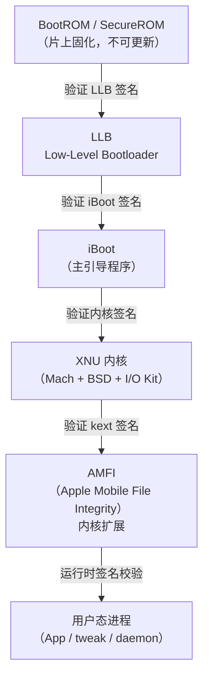
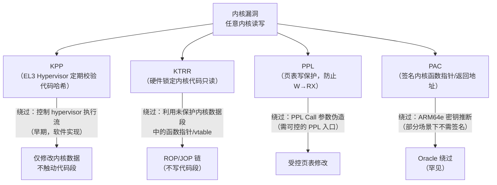
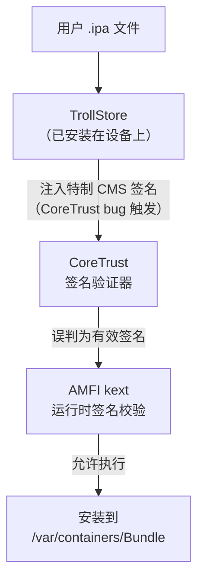

# ObjC运行时（18）· 越狱原理与TrollStore

> [!abstract] TL;DR
> iOS 越狱的本质是利用内核漏洞获取 `root` 权限并持久化内核 patch，从而绕过代码签名（AMFI）、沙箱（Sandbox.kext）等系统防护。现代越狱分 **rootful**（完整根文件系统写权限）与 **rootless**（仅 `/var/jb` 可写，保持 SSV 完整性）两类。硬件级漏洞 **checkm8**（BootROM）使 A5–A11 设备永久可越狱。**KPP/KTRR/PPL/PAC** 是苹果持续加固内核的屏障，现代越狱必须绕过或适配它们。**TrollStore** 利用 CoreTrust bug 在不越狱的设备上永久安装任意 App，为逆向研究开辟了独立路径。本篇从**防御与研究视角**穷尽越狱技术体系，所有技术操作**仅限自有设备及授权研究**。

> [!caution] 法律与合规声明
> 本篇描述的越狱技术、越狱绕过、漏洞利用链**仅供安全研究与教育目的**。在自有设备上越狱在大多数司法管辖区是合法的，但利用越狱漏洞对他人设备实施攻击、对他人应用进行未授权的逆向分析，可能违反《计算机欺诈与滥用法》（CFAA）、中国《计算机信息系统安全保护条例》及相关版权法律。**所有实验仅在自有设备或明确授权的测试设备上进行。**

---

## 概述与定位

iOS 越狱（Jailbreak）指通过软件或硬件漏洞突破苹果对 iOS 系统的完整性防护，使用户获得 `root` 级别的文件系统访问权限，并能够安装未经 App Store 审核的第三方应用与系统扩展（tweak）。

越狱不只是"刷机"，它是一条完整的漏洞利用链，涉及：

- **BootROM / SecureROM 漏洞**（bootchain 最底层，不可修复）
- **内核漏洞利用**（提权，获取 `kernel_task` port）
- **内核完整性保护绕过**（KPP/KTRR/PPL，使内核 patch 持久化）
- **AMFI/CoreTrust 绕过**（允许任意代码签名）
- **持久化与工具链部署**（Substrate/ElleKit/dpkg/apt）

本篇在系列中属于"对抗/应用"层，直接建立在以下基础之上：

- **[[17.arm64e_PAC指针认证专题]]**：PAC 对越狱控制流劫持的影响
- **[[13.iOS安全与砸壳]]**：越狱与砸壳的关系
- **[[12.iOS逆向工具]]**：越狱后的逆向环境
- **[[34.现代二进制防护机制/11.macOS与iOS防护.md]]**：KPP/KTRR/PPL 机制完整详解

---

## 原理与机制

### iOS 信任链（Boot Chain）

iOS 设备启动是一条严格的信任链，每一级只执行经过前一级签名验证的代码：



越狱必须在这条链上打洞——要么从最底部（BootROM 漏洞）破坏信任根，要么从用户态通过内核漏洞提权后绕过上层机制。

### 越狱漏洞利用层次

#### BootROM 漏洞

BootROM（SecureROM）固化在芯片上，**苹果无法通过 OTA 修复**。一旦 BootROM 存在漏洞，该芯片的所有 iOS 版本永久可越狱。

典型案例：**checkm8**（CVE-2019-8900），由 axi0mX 于 2019 年披露，影响 A5–A11（iPhone 5S–iPhone X）的 SecureROM，利用 USB DFU 模式中的 USB 栈堆溢出漏洞。由于 BootROM 只读，苹果永远无法通过软件更新修复——受影响的设备可通过 checkra1n/palera1n 工具在 DFU 模式下触发漏洞，植入修改后的 iBoot。

#### 内核漏洞（Kernel LPE）

大多数软件越狱利用 XNU 内核漏洞进行本地权限提升（Local Privilege Escalation）。目标是：

1. 获取内核任务端口（`kernel_task port`）
2. 通过 `mach_vm_read`/`mach_vm_write` 读写任意内核内存
3. 修改内核数据结构（进程凭证、端口权限）

常见漏洞类型：
- **UAF（Use-After-Free）**：Mach port、IOKit 对象的生命周期漏洞
- **类型混淆**：IOKit 驱动的 C++ 对象类型混淆，误用 vtable 指针
- **整数溢出**：内核内存分配器（zone allocator）中的尺寸计算错误
- **竞争条件（Race Condition）**：并发访问内核对象时的 TOCTOU 漏洞

### KPP / KTRR / PPL：内核完整性的盾牌

苹果从 iOS 9（A9 芯片）开始陆续引入一系列内核完整性保护机制，使简单的内核内存写入无法持久化。

#### KPP（Kernel Patch Protection）—— A9/A9X

KPP 是运行在 EL3（ARM TrustZone 安全世界）的 hypervisor 组件（`com.apple.kpp`），在正常系统运行期间定期检查内核代码页的哈希，若检测到篡改则强制重启（panic）。

早期 KPP 由 Ian Beer 等研究者绕过（通过控制 KPP hypervisor 本身的执行流），促使苹果在硬件层面引入 KTRR。

#### KTRR（Kernel Text Read-only Region）—— A10+

KTRR 是**硬件实现**的内核只读保护，由 SoC 上专用的内存控制器寄存器配置。内核代码段和只读数据段的页表项设置为不可写（PXN/UXN 不相关，这里是页表级别的写保护），且**这些寄存器在 iBoot 初始化后被锁定，内核自身也无法修改**。

- KTRR 保护范围：`__TEXT`、`__RODATA`、`__PLK_TEXT_EXEC` 等内核只读段
- **绕过难度极高**：需要找到在 KTRR 初始化之前（iBoot 阶段）或通过未受保护的内核内存（`__DATA` 中的函数指针）间接劫持执行流

#### PPL（Page Protection Layer）—— A12+ / iOS 12+

PPL 专门保护页表数据结构（page tables）本身，防止攻击者通过修改页表将不可执行内存标记为可执行（JIT 式代码注入）。PPL 以独立的 EL1 特权域运行，内核需通过严格受控的"门"（PPL call）请求页表修改。

- PPL 防御：将任意 `W^X` 破坏型攻击（把 RW 页改为 RX）变得极其困难
- 现代越狱（如 palera1n 的 arm64e 支持、Dopamine）需专门处理 PPL 的信任区域

#### PAC（Pointer Authentication）—— A12+ / arm64e

PAC 对内核中的函数指针、返回地址签名，使攻击者即使能写内核内存，也无法伪造合法的带签名指针来劫持控制流。PAC 密钥存储于系统寄存器（EL1 不可读），签名验证在 CPU 指令级完成。

详细机制见 **[[17.arm64e_PAC指针认证专题]]**。



### rootful vs rootless 越狱

这是现代越狱最重要的架构分野：

| 维度 | rootful 越狱 | rootless 越狱 |
|---|---|---|
| 根文件系统 | 重新挂载为可写（bypass SSV/APFS） | 保持只读，`/var/jb` 符号链接 |
| 工具安装路径 | `/usr/bin`、`/usr/lib`、`/Library` | `/var/jb/usr/bin` 等虚拟路径 |
| SSV 完整性 | 破坏（APFS 快照不再验证） | 保持（设备可通过 Apple 完整性验证） |
| 代表工具 | checkra1n（arm64 模式）、unc0ver | palera1n（arm64e 默认）、Dopamine |
| 兼容性 | 旧 tweak 通常直接可用 | 旧 tweak 需适配（路径、entitlement） |
| 稳定性 | 需 remount 操作，有一定风险 | 更接近"正常"状态，更稳定 |

**SSV（Signed System Volume）**：iOS 15+ 引入，对系统分区的每个文件计算哈希并以 Merkle 树存储于 iBoot，系统分区挂载时验证完整性。rootful 越狱必须绕过或禁用 SSV 校验，rootless 越狱通过将工具安装到数据分区（`/var/jb`）完全回避这一问题。

---

## 结构/算法/伪代码详解

### 典型越狱漏洞利用流程

以一个通用的 iOS 内核 UAF + KPP/KTRR 绕过场景为例，阐明完整利用链：

```
阶段一：用户态漏洞触发（获取初始内核读写原语）
─────────────────────────────────────────────
1. 触发内核 UAF / 类型混淆漏洞
2. 利用内核 zone allocator（Heap Spray）
   将 fake 对象布局到已释放内存地址
3. 通过 fake 对象的方法调用获得：
   a. 泄露内核基地址（KASLR 绕过）
   b. 任意地址读：kernel_vm_read primitive
   c. 任意地址写：kernel_vm_write primitive

阶段二：提权（修改进程凭证）
─────────────────────────────────────────────
4. 通过内核读原语枚举进程链表
   找到当前进程的 proc 结构
5. 修改 proc->p_ucred（POSIX 凭证）中的 uid/gid 为 0
6. 获取 task port（kernel_task）：
   修改 proc->task->itk_self（Mach task port）
   替换为内核 task port 的 send right

阶段三：AMFI/代码签名绕过
─────────────────────────────────────────────
7. 修改 AMFI 内核变量 / 路径：
   a. Patch amfi_get_out_of_my_way（全局 flag）
   b. 或修改 cs_enforcement_disable
   c. 或修改 proc->p_csflags 为有效标志

阶段四：KPP/KTRR 适配（不触碰只读代码段）
─────────────────────────────────────────────
8. 所有 patch 目标为 __DATA 段（可写）中的：
   - 函数指针（ObjC vtable、C 函数指针表）
   - 全局变量（flag 类的开关变量）
   而非 __TEXT（KTRR 保护的只读代码页）

阶段五：持久化（Userspace Reboot / 补丁注入）
─────────────────────────────────────────────
9. 用 launchd 重启（jailbreakd 模式）
   或直接在内存中部署 Cydia Substrate
10. 安装 dpkg/apt，配置 Cydia/Sileo 软件源
```

### checkm8 BootROM 漏洞利用原理

checkm8 利用 Apple USB DFU（Device Firmware Upgrade）模式中的**堆溢出**漏洞：

```
DFU 模式 USB 栈数据接收流程（简化）：

1. 主机发送 DFU_DNLOAD 请求（bRequest=0x01）
2. 设备分配静态缓冲区接收固件数据
3. 主机可在数据传输中途发送 USB RESET
   → 设备释放 I/O 请求（io_request）到堆
   → 但同一缓冲区仍在被 USB stall 回调引用

4. 攻击者：
   a. 发送精心构造的 DFU 请求序列
   b. 触发 stall + RESET，造成 UAF
   c. 在窗口期重新分配该内存，注入 fake callback
   d. fake callback 在 USB 异常恢复时被调用
   → 执行攻击者代码（此时在 EL1，iBoot 特权级）

5. 从 iBoot 执行：
   - 加载修改后的 iBoot（禁用签名验证）
   - 加载修改后的内核（带 KPP bypass、AMFI patch）
   - 进入正常启动流程，但所有安全约束已被绕过
```

checkm8 是**不可持久化**的（每次重启后需重新触发），因此 checkra1n 越狱需要每次开机后连接计算机"注入"（Semi-Tethered 变体通过安装的 bootkit 改进为 Semi-Untethered）。

### CoreTrust Bug 与 TrollStore 原理

**CoreTrust** 是 iOS 15.2 之前（及少数后续版本）存在的签名验证逻辑 bug，与越狱无关，是一个**纯用户态层面的代码签名绕过**。

#### 代码签名验证链

正常 iOS 上，App 安装与执行需通过两层验证：

```
AppStore 安装路径：
  APSD（AppStore daemon）→ MobileInstallation → AMFI 验证

sideload 路径（开发者/企业证书）：
  Xcode / AltStore → MobileInstallation → AMFICheck → CoreTrust

CoreTrust 职责：
  验证二进制的 CMS 签名（X.509 证书链）是否由受信任的 CA 签发
  → Apple Root CA → WWDR Intermediate CA → 开发者/企业证书
```

#### CoreTrust Bug（CVE-2022-26766 及系列）

CoreTrust 对**特定格式的 CMS 签名结构**存在解析漏洞：当 CMS `SignedData` 中包含特定构造的证书链时，CoreTrust 错误地认为签名有效，而实际上签名并未由任何真实 Apple CA 验证。

更具体地，**opa334 和 Misaka** 发现了一个 CoreTrust 在处理**多重签名（multiple SignerInfo）**时的逻辑缺陷：CoreTrust 对其中一个 SignerInfo 验证通过即视为整体有效，但开发者分发证书签名的那个 SignerInfo 恰好可以被绕过，使得第二个未签名的 SignerInfo"搭便车"通过验证。

#### TrollStore 安装机制

TrollStore 利用上述 CoreTrust bug 实现"永久签名"App 安装：



TrollStore 安装的 App 具有以下特性：
- **无需 7 天过期**：不受开发者证书 7 天限制（开发者免费证书）
- **可持有任意 entitlement**：包括系统私有 entitlement（如 `com.apple.private.security.no-container`）
- **设备重启后仍有效**：CoreTrust bug 触发在安装时，安装后签名已被系统信任，重启不影响
- **不需要越狱**：设备内核完整，只是安装时的签名验证被绕过

TrollStore 支持范围（受 CoreTrust bug 影响的 iOS 版本）：
- iOS 14.0–16.x 的部分版本（具体取决于苹果修复进度）
- A9–A15 设备（漏洞不依赖硬件，是软件逻辑 bug）

TrollStore 本身通过系统 App（如 Tips.app）的 JBINIT 或 installd hook 安装，不同版本有不同的 bootstrap 方式（TrollInstallerX 等）。

---

## 工具视角与实战

### 主流越狱工具对比

| 工具 | 内核漏洞来源 | 支持设备/iOS | 类型 | rootless 支持 |
|---|---|---|---|---|
| **checkra1n** | checkm8 BootROM | A5–A11 / iOS 12–14 | Semi-Tethered | 否（rootful） |
| **unc0ver** | 多个内核 CVE | A9–A14 / iOS 11–14.8 | Untethered/Semi-Untethered | 否（rootful） |
| **palera1n** | checkm8 + iOS 15/16 适配 | A9–A11 / iOS 15–17 | Semi-Tethered | 是（默认） |
| **Dopamine** | 内核 CVE（iOS 15–16） | A9–A15 / iOS 15–16 | Untethered | 是 |
| **Fugu15 Max** | iOS 15 内核漏洞 | A12–A15 / iOS 15.x | Untethered | 是 |

#### checkra1n / palera1n 工作流

```bash
# palera1n 使用（macOS 终端，需越狱设备进入 DFU 模式）
# 安装
brew install palera1n

# 运行 rootless 越狱（默认）
palera1n

# 运行 rootful 越狱（旧 tweak 兼容）
palera1n --rootful

# 关键：palera1n 会将 SSH、dpkg、apt、Sileo 等基础工具
# 安装到 /var/jb/（rootless）或 /（rootful）
```

#### unc0ver 部署后的环境

unc0ver 部署后，设备获得：
- `/usr/bin`、`/usr/sbin`、`/usr/lib` 可写（rootful）
- `Cydia` 或 `Sileo` 包管理器
- `MobileSubstrate`（Cydia Substrate）或 `libhooker` hook 框架
- SSH（`dropbear`/`openssh`）服务

### 越狱后逆向环境搭建

越狱后建立完整逆向研究环境的标准流程：

```bash
# 1. 配置 SSH（越狱设备 → macOS）
# 默认密码：alpine（必须立即修改！）
ssh root@<device-ip>
passwd  # 修改 root 密码
passwd mobile  # 修改 mobile 用户密码

# 2. 安装逆向工具（Sileo/Cydia 中搜索，或命令行）
apt install -y \
    com.ericasadun.utilities \   # 调试工具
    com.nito.nmtui \            # 终端界面
    openssh \
    lldb \
    debugserver \
    frida \                     # Frida agent
    cycript \                   # 历史工具（较新 iOS 不支持）
    class-dump \
    dumpdecrypted

# 3. 配置 lldb + debugserver（设备端）
# 在越狱设备上启动 debugserver：
debugserver *:1234 -a <process-name>

# macOS 端连接：
lldb
(lldb) platform select remote-ios
(lldb) process connect connect://<device-ip>:1234

# 4. Frida 验证
# macOS 端：
frida-ps -Ua  # 列出设备上所有运行的 App
frida -U -n SpringBoard  # attach SpringBoard
```

### 越狱检测与绕过（研究视角）

越狱检测是 App 防御的第一层，常见检测手段与对应绕过方法：

| 检测手段 | 检测逻辑 | 越狱绕过方式 |
|---|---|---|
| 文件路径检测 | 检查 `/Applications/Cydia.app` 等 | 文件系统 hook（`shadowFileManager`/Shadow tweak） |
| 写沙箱外 | `open("/private/test", O_WRONLY)` | Syscall hook（`libhooker`/Substitute hook `open`） |
| `dyld` 镜像检测 | `_dyld_get_image_name` 枚举注入的 dylib | rootless 下 dylib 路径改为 `/var/jb/...` 绕过简单路径匹配 |
| `fork` 测试 | 沙箱内 fork 失败→非越狱 | hook `fork` 返回 -1 |
| `sysctl` 调试标志 | `P_TRACED` 位检测调试器 | hook `sysctl`，清除 `P_TRACED` |
| 完整性 hash | 对 App 自身代码段计算 hash | hook `CC_SHA256`/`mmap`，返回预期值 |
| OTA 更新检测 | 越狱设备无法正常 OTA | 无法绕过（需要重启关闭越狱） |
| Secure Enclave 挑战 | 硬件密钥操作验证设备完整性 | 目前无有效绕过（设计安全） |

绕过工具：**Liberty Lite**、**A-Bypass**、**Shadow**（rootless 适配版本）。这些 tweak 本身是越狱环境下的 App，它们 hook 文件系统、进程信息等系统调用，向目标 App 呈现"未越狱"的环境。

---

## 安全性与正确使用

> [!caution] 越狱与安全研究的边界
> 越狱是一把双刃剑。本节的所有内容**仅限以下场景**：
>
> 1. **自有设备**：你合法购买并拥有的 iPhone/iPad，对其进行越狱以研究系统机制、安装自定义工具、评估应用安全性
> 2. **授权研究**：在明确书面授权下，对组织拥有的设备进行安全评估
> 3. **学术 / CTF 研究**：在隔离的实验室环境下研究漏洞利用技术
>
> **以下行为是违法的或违反服务条款的：**
> - 利用越狱漏洞攻击他人设备（未授权访问）
> - 利用 TrollStore 安装修改他人付费 App 的破解版（版权违反 + DMCA）
> - 将越狱漏洞用于制造恶意软件、间谍软件（多国刑事犯罪）
> - 在公开服务器/CDN 上分发未授权的脱壳 App
>
> **越狱设备本身的安全风险：**
> - AMFI 禁用后，任何 dylib 都可注入任意进程→恶意 tweak 可以完全劫持 App
> - SSH 默认密码 `alpine` 是已知公开的—— Alpine 密码已被蠕虫（如 ikee）利用过
> - Cydia 源（Repository）中不乏恶意 deb 包，安装前必须核实来源
> - 建议使用**专用研究设备**，不要在越狱设备上登录个人 Apple ID、银行 App、企业 MDM

### 防御方：针对越狱的对策建议

对于需要抵御越狱环境的应用（金融、医疗、企业 MDM）：

1. **多维越狱检测**：文件检测 + fork 测试 + `sysctl` P_TRACED + ObjC `respondsToSelector` 异常检测，组合使用，任一绕过难以同时覆盖全部
2. **Native C 层实现检测逻辑**：ObjC 方法可被 Swizzle，C 函数指针也可被 hook，但在 native 层混淆后的检测代码逆向成本显著更高
3. **服务端验证**：Attestation（设备证明）是最终信任锚——利用 Apple DeviceCheck API 或 App Attest，服务端验证设备/App 完整性，不依赖客户端自检
4. **App Attest（iOS 14+）**：苹果官方提供的设备完整性证明 API，由 Secure Enclave 签名，无法伪造（越狱设备 App Attest 会失败）

---

## 小结

1. **iOS 越狱是完整漏洞利用链**：BootROM/内核漏洞 → 提权 → 内核完整性绕过（KPP/KTRR/PPL） → AMFI 绕过 → 工具链部署，每一步都有对应的防御机制和研究历史。
2. **checkm8 是不可修复的 BootROM 漏洞**：影响 A5–A11 设备，无 OTA 修复可能，构成 palera1n/checkra1n 的硬件基础。
3. **rootless 越狱是现代主流**：通过将工具安装到 `/var/jb` 保持 SSV 完整性，与 palera1n/Dopamine 对应。rootful 越狱破坏 SSV，兼容性更好但改动更大。
4. **KPP/KTRR/PPL/PAC 是现代越狱的核心障碍**：越狱必须在不触碰只读代码段（KTRR）的前提下，通过修改数据段中的函数指针和标志位实现功能。
5. **TrollStore 是无需越狱的签名绕过**：利用 CoreTrust 的 CMS 解析逻辑漏洞，在支持的 iOS 版本上实现永久安装任意 entitlement 的 App，为逆向研究提供了不依赖越狱的独立路径。
6. **越狱检测是多层博弈**：单一检测手段均可被 hook，需多维组合 + Native 层实现 + 服务端 App Attest 作为最终屏障。
7. **合规边界是硬约束**：自有设备 + 授权研究是合法边界，未授权攻击和软件破解在多数司法管辖区构成刑事犯罪。

---

## 相关阅读

- **PAC 指针认证详解（arm64e 越狱的核心障碍）**：[[17.arm64e_PAC指针认证专题]]
- **iOS 平台安全机制（KPP/KTRR/PPL/沙盒/AMFI 完整介绍）**：[[34.现代二进制防护机制/11.macOS与iOS防护.md]]
- **砸壳原理（越狱的重要应用）**：[[13.iOS安全与砸壳]]
- **iOS 逆向工具链（越狱后环境）**：[[12.iOS逆向工具]]
- **Theos/Frida tweak 开发（越狱后开发实践）**：[[19.Theos与Frida_iOS插件开发]]
- **iOS 沙盒与 entitlements（TrollStore 高权限 App 的原理基础）**：[[20.iOS沙箱与entitlements]]
- **Android 越狱（Root）对比**：[[35.Android逆向与运行时/00.Android逆向与运行时总览.md]]

---

[[00.Objective-C与iOS运行时总览|⬆ 系列总览]] | [[17.arm64e_PAC指针认证专题|← 上一章]] | [[19.Theos与Frida_iOS插件开发|→ 下一章]]
