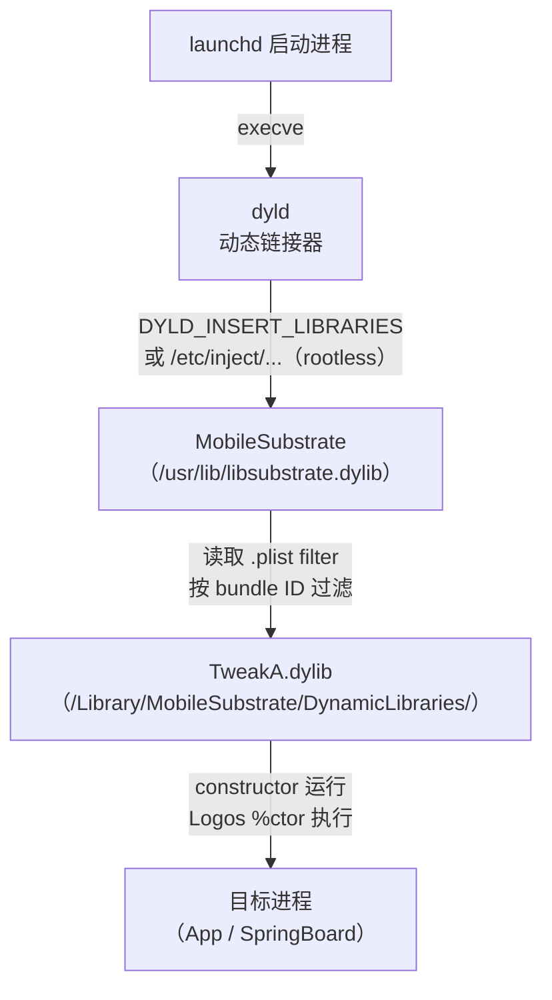
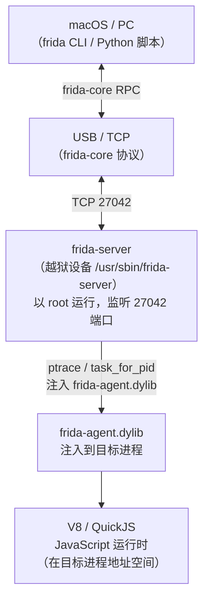

# ObjC运行时（19）· Theos与Frida iOS插件开发

> [!abstract] TL;DR
> iOS 越狱后的插件开发有两条主线：**Theos（静态注入框架）** 和 **Frida（动态插桩框架）**。Theos 以 **Logos 宏语言**（`%hook`/`%orig`/`%new`/`%ctor`）声明式地 hook ObjC 方法，通过 **MobileSubstrate/ElleKit** 在进程启动时将编译好的 `.dylib` 注入目标进程；Frida 则以 **JavaScript/Python API** 在运行时动态注入 Gadget 或远程 spawn，实现方法拦截、内存读写、函数追踪。两者互补：Theos 适合持久化 tweak 部署（每次启动自动生效），Frida 适合快速动态分析与脚本探索。本篇穷尽两套体系的工程结构、核心原理、Logos 语法细节、Frida API 实战及调试工作流，并与 Android Xposed 框架对比。

---

## 概述与定位

iOS 越狱开发生态围绕两个核心工具链展开：

**Theos** 是由 DHowett 创建、社区维护的跨平台 iOS/macOS 开发框架，其 **Logos** 预处理器将类 ObjC 的声明式 hook 语法编译为标准 C/ObjC 代码，再经 Clang 编译为可被 MobileSubstrate 加载的 `.dylib`（tweak）。Theos 覆盖了 tweak 从代码编写、编译、打包（`.deb`）到远程安装部署的完整工作流。

**Frida** 是 Ole André V. Ravnås 创建的动态插桩框架，支持 iOS/Android/macOS/Windows/Linux。在 iOS 上，Frida 以 `frida-server`（越狱设备后台守护进程）或 `FridaGadget.dylib`（注入目标 App）的形式工作，提供 JavaScript（V8/Duktape）运行时，可在运行时拦截 ObjC 方法、C 函数、修改内存、追踪函数调用。

本篇在系列中的位置：
- 前提：**[[18.越狱原理与TrollStore]]**（越狱环境的建立）
- 运行时基础：**[[04.objc_msgSend消息发送]]**、**[[08.Method Swizzling]]**（hook 的理论根基）
- 工具概述：**[[12.iOS逆向工具]]**
- 后续：**[[20.iOS沙箱与entitlements]]**（tweak 需要的 entitlement）

---

## 原理与机制

### MobileSubstrate / Cydia Substrate / ElleKit

MobileSubstrate（Cydia Substrate，由 Saurik 开发）是 iOS tweak 生态的基础 hook 框架，其后继者 **ElleKit** 和 **libhooker** 在 rootless 越狱中得到广泛应用。

#### 注入原理

MobileSubstrate 通过修改 **dyld 的动态链接过程**实现 tweak 注入：



MobileSubstrate 在 `dyld` 加载过程中（`__attribute__((constructor))` 阶段）运行，读取 `/Library/MobileSubstrate/DynamicLibraries/` 下每个 `.plist` 文件中的 `Filter` 字典，判断当前进程的 bundle ID 是否匹配，仅向匹配进程注入对应 `.dylib`。

#### Hook 底层实现（MSHookMessageEx）

MobileSubstrate 的核心 API 是 `MSHookMessageEx`，用于 hook ObjC 方法：

```c
// MSHookMessageEx 底层等价逻辑（简化）
void MSHookMessageEx(Class cls, SEL sel,
                     IMP newImp, IMP *oldImp) {
    Method method = class_getInstanceMethod(cls, sel);
    // 1. 保存原始 IMP
    *oldImp = method_getImplementation(method);
    // 2. 在原始函数头部写入跳转指令（arm64 B 指令或 BL+trampoline）
    //    arm64: B <offset>  — 4 字节相对跳转到 newImp
    //    超出范围时使用 trampoline（LDR PC, [PC, #8] + 绝对地址）
    // 3. 将 method 的 imp 字段指向 newImp
    method_setImplementation(method, newImp);
    // oldImp 保存的是跳过头部跳转后的 trampoline 地址
    // 调用 oldImp() 等于调用原始方法
}
```

对于 C 函数，MobileSubstrate 提供 `MSHookFunction`，在目标函数头部写入跳转指令（inline hook），细节与 **[[32.hooks/00.总览.md]]** 中的 inline hook 原理一致。

ElleKit（rootless 时代的替代品）使用相同的 ObjC 运行时 API，但适配了 rootless 的路径结构（`/var/jb/usr/lib/ellekit.dylib`）和 arm64e 的 PAC 处理。

### dyld 注入与 Filter 机制

每个 Theos tweak 编译后产生两个文件：

```
TweakName.dylib     — 实际的 hook 代码
TweakName.plist     — 进程过滤条件
```

`.plist` 格式（XML PropertyList）：

```xml
<?xml version="1.0" encoding="UTF-8"?>
<!DOCTYPE plist PUBLIC "-//Apple//DTD PLIST 1.0//EN"
  "http://www.apple.com/DTDs/PropertyList-1.0.dtd">
<plist version="1.0">
<dict>
    <key>Filter</key>
    <dict>
        <!-- 方式一：按 Bundle ID 过滤（只注入特定 App） -->
        <key>Bundles</key>
        <array>
            <string>com.apple.springboard</string>
        </array>

        <!-- 方式二：按可执行文件名过滤 -->
        <key>Executables</key>
        <array>
            <string>MusicApp</string>
        </array>

        <!-- 方式三：按 Mode 过滤（注入所有 App） -->
        <!-- <key>Mode</key> <string>Any</string> -->
    </dict>
</dict>
</plist>
```

MobileSubstrate 在每个进程启动时检查所有已安装的 `.plist`，仅注入匹配当前进程的 tweak，避免全局注入造成的稳定性问题。

---

## 结构/算法/伪代码详解

### Theos 工程结构

一个标准的 Theos tweak 工程目录：

```
MyTweak/
├── Makefile            — 构建配置（目标、Substrate 依赖、ARCHS）
├── control             — deb 包元数据（名称、作者、依赖）
├── Tweak.x             — Logos 语法源文件（主要 hook 代码）
├── Tweak.xm            — 可选：混合 ObjC++ 语法的 Logos 文件
├── MyTweak.plist       — 进程过滤配置
├── Resources/          — 静态资源（图片、配置文件等）
└── layout/             — 安装时复制到设备文件系统的额外文件
    └── Library/
        └── PreferenceLoader/
            └── Preferences/
                └── MyTweak.plist  — 设置面板配置
```

#### Makefile 详解

```makefile
# 指定 Theos 安装路径（通常由环境变量 $THEOS 定义）
include $(THEOS)/makefiles/common.mk

# tweak 名称（产生 MyTweak.dylib 和 MyTweak.deb）
TWEAK_NAME = MyTweak

# 源文件（.x / .xm / .m / .mm / .c / .cpp）
MyTweak_FILES = Tweak.x

# 目标架构（arm64 + arm64e 覆盖 A7-A16）
MyTweak_ARCHS = arm64 arm64e

# 链接 MobileSubstrate 框架
MyTweak_FRAMEWORKS = UIKit Foundation
MyTweak_PRIVATE_FRAMEWORKS = SpringBoardServices
MyTweak_LIBRARIES = substrate

# 编译标志
MyTweak_CFLAGS = -fobjc-arc

# 目标 iOS 最低版本
IPHONE_DEPLOYMENT_TARGET = 14.0

# SSH 部署目标（make install 时使用）
THEOS_DEVICE_IP = 192.168.1.100
THEOS_DEVICE_PORT = 22

include $(THEOS)/makefiles/tweak.mk
```

#### control 文件

```
Package: com.yourname.mytweak
Name: MyTweak
Version: 1.0.0
Architecture: iphoneos-arm64
Description: Hook UIViewController to log presentations
Maintainer: Your Name <you@example.com>
Author: Your Name <you@example.com>
Section: Tweaks
Depends: mobilesubstrate (>= 0.9.7000), firmware (>= 14.0)
```

### Logos 语法完整参考

Logos 是 Theos 的预处理器语言（由 `.x`/`.xm` 扩展名触发），提供声明式的 ObjC hook 语法。Logos 文件在编译前由 `logos.pl` 脚本展开为标准 ObjC/C 代码。

#### 核心指令

**`%hook ClassName` / `%end`**

声明一个对指定类的 hook 块，块内定义需要替换的方法：

```objc
// Tweak.x
%hook UIViewController

// hook 实例方法 viewDidAppear:
- (void)viewDidAppear:(BOOL)animated {
    // %orig 调用原始实现（等价于 MSHookMessageEx 保存的 oldImp）
    %orig;
    NSLog(@"[MyTweak] %@ appeared", NSStringFromClass([self class]));
}

// hook 类方法
+ (UIViewController *)instantiateViewController {
    UIViewController *result = %orig;
    NSLog(@"[MyTweak] instantiated: %@", result);
    return result;
}

%end
```

Logos 展开后大致等价于：

```objc
// logos.pl 展开后的等价代码（简化）
static void (*_logos_orig$UIViewController$viewDidAppear$)(UIViewController*, SEL, BOOL);
static void _logos_hook$UIViewController$viewDidAppear$(UIViewController* self, SEL _cmd, BOOL animated) {
    _logos_orig$UIViewController$viewDidAppear$(self, _cmd, animated);
    NSLog(@"[MyTweak] %@ appeared", NSStringFromClass([self class]));
}

static __attribute__((constructor)) void _logos_constructor(void) {
    MSHookMessageEx(
        objc_getClass("UIViewController"),
        @selector(viewDidAppear:),
        (IMP)_logos_hook$UIViewController$viewDidAppear$,
        (IMP*)&_logos_orig$UIViewController$viewDidAppear$
    );
}
```

**`%new` — 向类添加新方法**

```objc
%hook UIView

// 为 UIView 添加一个原本不存在的方法
%new
- (void)myTweak_highlight {
    self.backgroundColor = [UIColor yellowColor];
}

%end
```

`%new` 展开为 `class_addMethod`，不替换已有方法，而是向类的方法列表追加。

**`%orig` — 调用原始实现**

```objc
%hook NSString

- (NSUInteger)length {
    NSUInteger result = %orig;  // 调用 NSString 原始 length 实现
    NSLog(@"length called: %lu", (unsigned long)result);
    return result;
}

// 带参数转发
- (BOOL)hasPrefix:(NSString *)prefix {
    BOOL result = %orig(prefix);  // 显式传参
    return result;
}

%end
```

若不调用 `%orig`，原始方法实现被完全替代（注意：对于系统类这可能导致崩溃）。

**`%ctor` / `%dtor` — 构造器与析构器**

```objc
// %ctor 在 dylib 注入时执行（__attribute__((constructor))）
%ctor {
    NSLog(@"[MyTweak] Tweak loaded in process: %@",
          [[NSProcessInfo processInfo] processName]);
    // 可在此动态决定是否启用 hook
    // 例：只在特定版本下 hook
    if (@available(iOS 15, *)) {
        %init;  // 初始化本文件中所有 %hook 块
    }
}

// %dtor 在 dylib 卸载时执行（罕见，通常不需要）
%dtor {
    NSLog(@"[MyTweak] Tweak unloaded");
}
```

**`%group` — 条件分组**

```objc
// 定义两个 hook 组，按条件选择激活哪组
%group iOS15Hook

%hook SomeClass
- (void)someMethod { %orig; NSLog(@"iOS15"); }
%end

%end  // group iOS15Hook

%group iOS16Hook

%hook AnotherClass
- (void)anotherMethod { %orig; NSLog(@"iOS16"); }
%end

%end  // group iOS16Hook

%ctor {
    if (@available(iOS 16, *)) {
        %init(iOS16Hook);
    } else {
        %init(iOS15Hook);
    }
}
```

**`%init` — 初始化 hook 组**

```objc
%ctor {
    // %init 不带参数：初始化所有未指定组名的 %hook（默认组）
    %init;

    // %init(GroupName)：初始化指定组
    %init(iOS16Hook);

    // %init 可传参数动态指定类名（用于私有类/运行时才知道类名的场景）
    %init(
        _ungrouped,
        SomePrivateClass = objc_getClass("_UIPrivateClass")
    );
}
```

**`%hookf` — hook C 函数**

```objc
// hook C 函数（底层调用 MSHookFunction）
static int (*orig_open)(const char *path, int flags, ...);
%hookf(int, open, const char *path, int flags) {
    NSLog(@"[MyTweak] open: %s", path);
    return orig_open(path, flags);
}
```

#### Logos 语法速查表

| 指令 | 作用 | 等价底层操作 |
|---|---|---|
| `%hook Class` | 开始 hook 一个 ObjC 类 | `MSHookMessageEx` |
| `%end` | 结束当前 `%hook` 或 `%group` 块 | — |
| `%orig` | 调用被 hook 方法的原始实现 | 保存的原始 IMP |
| `%new` | 向类添加新方法 | `class_addMethod` |
| `%ctor` | dylib 注入时执行的初始化代码 | `__attribute__((constructor))` |
| `%dtor` | dylib 卸载时执行 | `__attribute__((destructor))` |
| `%group Name` | 定义条件激活的 hook 分组 | 逻辑分组 |
| `%init` | 激活（安装）hook 组 | 实际执行 MSHookMessageEx |
| `%hookf(ret, func, args)` | hook C 函数 | `MSHookFunction` |
| `%c(ClassName)` | 动态获取类（用于私有类） | `objc_getClass()` |
| `%subclass` | 动态创建 ObjC 子类 | `objc_allocateClassPair` |

### 编译、打包与部署

```bash
# 安装 Theos（macOS）
bash -c "$(curl -fsSL https://raw.githubusercontent.com/theos/theos/master/bin/install-theos)"

# 创建新 tweak 工程（交互式向导）
$THEOS/bin/nic.pl
# 选择 11（iOS Tweak）
# 填写：Project Name, Package Name, Author, MobileSubstrate Bundle filter

# 编译
make

# 编译 + 打包为 .deb（用于 Cydia/Sileo 分发）
make package

# 编译 + 安装到连接的 iPhone（需 SSH 可达）
make package install

# 清理
make clean
```

编译产物：
```
.theos/
└── obj/
    └── MyTweak.dylib       — arm64+arm64e FAT 二进制
packages/
└── com.yourname.mytweak_1.0.0-1_iphoneos-arm64.deb
```

---

## 工具视角与实战

### Frida-iOS 完整工作流

Frida 架构在 iOS 上分为三层：



#### frida-server 部署

```bash
# 从 https://github.com/frida/frida/releases 下载对应 iOS 版本的 frida-server
# 上传到设备（通过 SSH/SCP）
scp frida-server root@<device-ip>:/usr/sbin/frida-server
ssh root@<device-ip> "chmod +x /usr/sbin/frida-server && frida-server &"

# 或通过 Cydia/Sileo 安装 frida（推荐，自动配置 launchd）
# 添加源：https://build.frida.re
```

#### 基础 Frida CLI 操作

```bash
# 列出设备（USB 连接）
frida-ps -Ua           # 列出所有运行的 App（-U = USB, -a = 应用）
frida-ps -Uai          # 同上，显示 bundle ID

# 追踪 ObjC 方法调用（frida-trace）
# 追踪 UIViewController 的所有以 view 开头的方法
frida-trace -U -n SpringBoard -m "-[UIViewController view*]"

# 追踪 C 函数
frida-trace -U -n Maps -i "CC_SHA256"

# attach 进程并进入 REPL
frida -U -n SpringBoard

# spawn（启动）App 并立即注入
frida -U -f com.apple.Maps --no-pause

# 执行脚本文件
frida -U -n SpringBoard -l my_hook.js
```

#### Frida JavaScript API：ObjC hook

```javascript
// my_hook.js — Frida JavaScript 脚本

// 1. ObjC API 入口
if (ObjC.available) {

    // hook UIViewController -viewDidAppear:
    const UIViewController = ObjC.classes.UIViewController;
    const viewDidAppear = UIViewController['- viewDidAppear:'];

    Interceptor.attach(viewDidAppear.implementation, {
        onEnter(args) {
            // args[0] = self, args[1] = _cmd, args[2] = animated (BOOL)
            const self = new ObjC.Object(args[0]);
            const className = self.$className;
            const animated = args[2].toInt32();
            console.log(`[+] viewDidAppear: ${className}, animated=${animated}`);
        },
        onLeave(retval) {
            // retval 是返回值（viewDidAppear 为 void，通常忽略）
        }
    });

    // 2. 动态查找私有类并 hook
    const SpringBoard = ObjC.classes.SpringBoard;
    if (SpringBoard) {
        const lockDevice = SpringBoard['- _simulateLockButtonPress'];
        if (lockDevice) {
            Interceptor.attach(lockDevice.implementation, {
                onEnter(args) {
                    console.log('[+] Lock button pressed');
                }
            });
        }
    }

    // 3. hook ObjC 方法并修改返回值
    const NSString = ObjC.classes.NSString;
    Interceptor.attach(
        NSString['- length'].implementation,
        {
            onLeave(retval) {
                // 拦截返回值，强制返回 42
                retval.replace(ptr('0x2a'));
            }
        }
    );

    // 4. 调用 ObjC 方法（主动调用）
    const NSBundle = ObjC.classes.NSBundle;
    const mainBundle = NSBundle.mainBundle();
    console.log('Bundle ID:', mainBundle.bundleIdentifier().toString());

} else {
    console.log('ObjC runtime not available');
}
```

#### Frida JavaScript API：C 函数 hook

```javascript
// hook C 函数 open()
const openPtr = Module.getExportByName(null, 'open');
Interceptor.attach(openPtr, {
    onEnter(args) {
        // args[0] = const char* path, args[1] = int flags
        const path = args[0].readUtf8String();
        console.log(`open("${path}")`);
        this.path = path;  // 保存到 this 供 onLeave 使用
    },
    onLeave(retval) {
        console.log(`  → fd=${retval.toInt32()}, path=${this.path}`);
    }
});

// hook 并修改参数
Interceptor.attach(openPtr, {
    onEnter(args) {
        const path = args[0].readUtf8String();
        if (path && path.includes('/etc/fstab')) {
            // 重定向路径
            const newPath = Memory.allocUtf8String('/dev/null');
            args[0] = newPath;
            console.log('Redirected /etc/fstab → /dev/null');
        }
    }
});
```

#### Frida Python API（自动化脚本）

```python
#!/usr/bin/env python3
# frida_hook.py — Python 端控制脚本

import frida
import sys

# JS hook 脚本
JS_HOOK = """
'use strict';

// hook isJailbroken 方法，强制返回 NO
if (ObjC.available) {
    const detector = ObjC.classes.JailbreakDetector;
    if (detector) {
        const method = detector['- isJailbroken'];
        Interceptor.attach(method.implementation, {
            onLeave(retval) {
                retval.replace(ptr('0x0'));  // NO
                console.log('[bypass] isJailbroken → NO');
            }
        });
    }
}
"""

def on_message(message, data):
    if message['type'] == 'send':
        print(f"[frida] {message['payload']}")
    elif message['type'] == 'error':
        print(f"[error] {message['stack']}", file=sys.stderr)

# USB 连接设备
device = frida.get_usb_device()

# spawn 方式：启动 App 并立即注入（在代码执行前 attach）
pid = device.spawn(["com.example.targetapp"])
session = device.attach(pid)
script = session.create_script(JS_HOOK)
script.on('message', on_message)
script.load()
device.resume(pid)

# 保持脚本运行
input()
session.detach()
```

#### frida-trace 高级用法

```bash
# 追踪 UIKit 中所有以 _UI 开头的私有方法
frida-trace -U -n SpringBoard \
    -m "-[_UI* *]" \
    -m "+[_UI* *]"

# 追踪特定类的所有方法，输出到文件
frida-trace -U -n Maps \
    -m "-[MKMapView *]" \
    -o trace_output.log

# 生成追踪 handler 模板（-O 选项）
# frida-trace 会在 __handlers__/ 目录生成 JS 模板，可编辑
frida-trace -U -n SpringBoard -m "-[UIViewController viewDidAppear:]"
# 生成 __handlers__/UIViewController/viewDidAppear_.js
# 编辑该文件可自定义 onEnter/onLeave 逻辑
```

### objection — 自动化渗透测试框架

objection 基于 Frida，提供命令行交互式的 iOS/Android 应用分析环境：

```bash
# 安装
pip install objection

# attach 到运行中的 App
objection -g "com.example.app" explore

# objection 交互式命令（REPL 内）
# 列出所有已加载的类
ios hooking list classes

# 搜索类名包含 "payment" 的类（不区分大小写）
ios hooking search classes payment

# 列出 PaymentViewController 的所有方法
ios hooking list methods "PaymentViewController"

# hook 类的所有方法（输出调用日志）
ios hooking watch class "PaymentViewController"

# hook 单个方法，dump 参数和返回值
ios hooking watch method "-[PaymentViewController processPayment:]" \
    --dump-args --dump-return

# bypass SSL Pinning（内置脚本）
ios sslpinning disable

# bypass 越狱检测（内置脚本）
ios jailbreak disable

# 列出应用的 entitlements
ios plist cat /path/to/embedded.mobileprovision

# dump Keychain
ios keychain dump
```

### Cycript 历史背景

Cycript 是 Saurik 早期开发的 iOS 探索工具，允许在运行时通过 JavaScript/ObjC 混合语法与进程交互。由于 LLVM/Clang 版本兼容性问题，Cycript 在 iOS 12 后基本停止维护，**Frida REPL 已完全取代 Cycript 的功能**。

历史语法参考（已过时，不建议在新项目使用）：
```javascript
// Cycript 历史语法示例（了解即可）
cy# UIApp.keyWindow.recursiveDescription()
cy# [UIApplication sharedApplication].delegate
cy# choose(UIViewController)  // 查找堆上所有 UIViewController 实例
```

### Theos vs Frida vs Xposed 对比

| 维度 | Theos/Logos | Frida | Android Xposed |
|---|---|---|---|
| 平台 | iOS（主）、macOS | iOS/Android/macOS/Linux/Windows | Android（仅） |
| 注入时机 | 进程启动时（dylib 注入） | 任意时刻（attach/spawn） | 进程启动时（ART hook） |
| 语言 | ObjC/C（Logos 预处理） | JavaScript/Python/C | Java（Xposed 模块） |
| 持久化 | 是（随进程启动自动注入） | 否（脚本运行时临时生效） | 是（随进程启动自动注入） |
| 部署 | 编译 + 打包 `.deb`，Sileo/Cydia 安装 | 运行 frida-server，连接脚本 | 编译 APK，Xposed Installer |
| 使用场景 | 持久化 tweak（系统扩展、UI 修改） | 快速动态分析、自动化测试 | 持久化 Java 层 hook |
| hook 层次 | ObjC 运行时（MSHookMessageEx） + C inline hook | ObjC/ART/C（Interceptor） | ART 方法替换 |
| rootless 适配 | ElleKit/libhooker（palera1n 时代） | frida-server 适配 rootless 路径 | Magisk（类比） |
| 调试体验 | Xcode + LLDB + SSH 日志 | 交互式 REPL + 实时输出 | Android Studio + logcat |

---

## 安全性与正确使用

Theos/Frida 工具链用于逆向分析和 tweak 开发，在研究与防御两端都有重要价值：

**研究/攻击视角的合规边界：**

- 所有 hook 和注入操作**仅在自有设备**上进行
- 对他人 App 进行未授权的运行时 hook 属于未授权访问，违反 CFAA 等法律
- 在 Bug Bounty 范围内分析目标 App 时，遵守授权范围（通常要求使用自有账号、不触及他人数据）

**防御视角——检测 Frida/Theos 注入：**

```objc
// 检测 Frida 注入的常见手段

// 1. 检测 frida-agent 相关字符串（简单，可被绕过）
BOOL detectFridaByName(void) {
    uint32_t count = _dyld_image_count();
    for (uint32_t i = 0; i < count; i++) {
        const char *name = _dyld_get_image_name(i);
        if (name && strstr(name, "frida")) return YES;
        if (name && strstr(name, "FridaGadget")) return YES;
    }
    return NO;
}

// 2. 检测 frida-server 的 TCP 端口（27042）
// 尝试 connect 127.0.0.1:27042，成功则说明 frida-server 运行
BOOL detectFridaServer(void) {
    struct sockaddr_in addr = {0};
    addr.sin_family = AF_INET;
    addr.sin_port = htons(27042);
    inet_pton(AF_INET, "127.0.0.1", &addr.sin_addr);
    int sock = socket(AF_INET, SOCK_STREAM, 0);
    int ret = connect(sock, (struct sockaddr*)&addr, sizeof(addr));
    close(sock);
    return ret == 0;  // 0 表示连接成功 → frida-server 存在
}

// 3. 检测 MobileSubstrate 注入的 dylib
BOOL detectSubstrate(void) {
    uint32_t count = _dyld_image_count();
    for (uint32_t i = 0; i < count; i++) {
        const char *name = _dyld_get_image_name(i);
        if (name && strstr(name, "MobileSubstrate")) return YES;
        if (name && strstr(name, "ellekit")) return YES;
        if (name && strstr(name, "libhooker")) return YES;
    }
    return NO;
}
```

> [!warning] 检测的局限性
> 上述检测均可被 Frida/Substrate 的高级 hook 绕过（hook `_dyld_get_image_name`、`connect` 等）。金融/安全应用应结合 App Attest（iOS 14+ 的 Secure Enclave 设备证明），使服务端在 Frida 注入状态下无法获得有效 Attestation 而拒绝请求——这是目前最难绕过的防线。

---

## 小结

1. **MobileSubstrate 是 iOS tweak 的运行时基础**：通过 dyld 注入机制在进程启动时加载 tweak `.dylib`，`MSHookMessageEx` 修改 ObjC 方法的 IMP，ElleKit/libhooker 是其 rootless 时代的继承者。
2. **Logos 宏语言是 Theos 的核心**：`%hook`/`%orig`/`%new`/`%ctor`/`%group`/`%init` 等指令在预处理阶段展开为标准 ObjC/C 代码，最终编译为可被 Substrate 加载的 FAT dylib。
3. **Theos 覆盖完整开发周期**：从 `nic.pl` 创建工程、`Makefile`/`control` 配置，到 `make package install` 远程部署，是 iOS tweak 持久化开发的标准工具链。
4. **Frida 以动态性见长**：`frida-server`（设备端）+ `frida-trace`/Python 脚本（主机端）的组合，实现无需重编译的实时方法拦截、参数修改、内存读写，适合快速探索与自动化测试。
5. **objection 封装了 Frida 的常用安全测试场景**：SSL Pinning bypass、越狱检测 bypass、Keychain dump、方法追踪，一行命令完成，显著提升渗透测试效率。
6. **Cycript 已成历史**：iOS 12 后不再实用，Frida REPL 和 objection 已完全替代其功能。
7. **与 Android Xposed 的核心差异**：Xposed 工作在 Java/ART 层（无需 C hook），Theos 工作在 ObjC 运行时层（native hook），两者都是平台专属的动态 hook 框架，Frida 是唯一跨平台的通用工具。

---

## 相关阅读

- **越狱环境（Theos/Frida 的前提）**：[[18.越狱原理与TrollStore]]
- **ObjC Method Swizzling（hook 的理论基础）**：[[08.Method Swizzling]]
- **iOS 沙盒与 entitlements（tweak 需要的权限声明）**：[[20.iOS沙箱与entitlements]]
- **iOS 逆向工具链总览**：[[12.iOS逆向工具]]
- **Hook 技术原理（inline hook / GOT hook）**：[[32.hooks/00.总览.md]]
- **砸壳（tweak 开发前常需先解密目标 App）**：[[13.iOS安全与砸壳]]
- **PAC 对 arm64e hook 的影响**：[[17.arm64e_PAC指针认证专题]]
- **Android Xposed 框架对比**：[[35.Android逆向与运行时/00.Android逆向与运行时总览.md]]

---

[[00.Objective-C与iOS运行时总览|⬆ 系列总览]] | [[18.越狱原理与TrollStore|← 上一章]] | [[20.iOS沙箱与entitlements|→ 下一章]]
