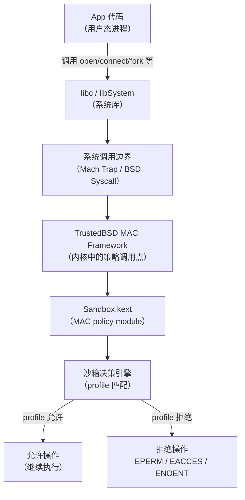
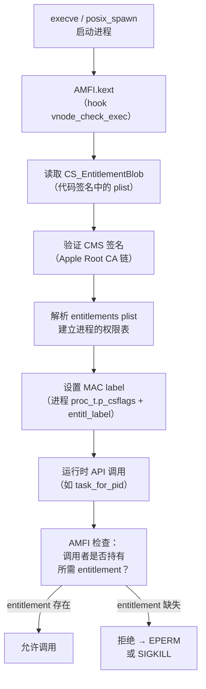

# ObjC运行时（20）· iOS沙箱与entitlements

> [!abstract] TL;DR
> iOS 沙箱（Sandbox）是强制访问控制（MAC）的实现，以 **Seatbelt** 框架（内核扩展 `Sandbox.kext`）在系统调用级别拦截并过滤进程的所有资源访问。每个 App 运行在独立的沙箱容器（`/var/mobile/Containers/Data/Application/<UUID>/`）中，无法访问其他 App 的数据。**Entitlements（权限声明）** 是二进制代码签名中嵌入的 XML plist，声明进程被允许持有的能力（网络、相机、调试、私有 API 访问等），由 AMFI 内核扩展在运行时强制执行。**TCC（Transparency, Consent and Control）** 管理隐私敏感权限（位置、麦克风、相片库等）的用户授权状态。越狱后沙箱可被逃逸，但理解沙箱的精确边界是逆向分析、tweak 开发和安全评估的重要基础。

---

## 概述与定位

iOS 的应用隔离体系是移动操作系统安全架构的典范，由三层互补机制构成：

1. **沙箱（Sandbox / Seatbelt）**：内核强制访问控制，在系统调用边界过滤文件/网络/进程/IPC 操作
2. **Entitlements**：代码签名中声明的能力白名单，AMFI 在运行时检查
3. **TCC（隐私权限框架）**：用户对隐私资源的明确授权，由守护进程 `tccd` 管理，数据存于 `/var/db/TCC/TCC.db`

三者共同构建了"最小权限原则"（Principle of Least Privilege）的实践：App 只能访问它明确声明（entitlements）且用户授权（TCC）的资源，沙箱则在内核层保证这一约束不可绕过（非越狱设备上）。

本篇在系列中的位置：
- **[[13.iOS安全与砸壳]]**：代码签名的整体架构
- **[[18.越狱原理与TrollStore]]**：沙箱逃逸的前提（越狱）
- **[[19.Theos与Frida_iOS插件开发]]**：tweak 需要特殊 entitlement 才能访问系统私有功能
- **[[34.现代二进制防护机制/11.macOS与iOS防护.md]]**：iOS 安全机制的整体体系

---

## 原理与机制

### Seatbelt 框架与 sandbox profile

iOS 沙箱基于 **TrustedBSD MAC（Mandatory Access Control）** 框架，其内核实现是 `Sandbox.kext`（系统术语为 "Seatbelt"，源自 macOS）。

#### 沙箱的工作层次



`Sandbox.kext` 注册为 MAC 策略模块，拦截 `mpo_file_check_mmap`、`mpo_socket_check_connect`、`mpo_process_check_fork` 等数十个 MAC 钩子点，在每次相关系统调用时执行 profile 匹配决策。

#### sandbox profile 语言

iOS 沙箱 profile 是一种基于 Scheme 的领域专用语言（DSL），编译后以二进制格式嵌入系统。第三方 App 使用的 profile 在沙箱 profile 数据库中预定义，不暴露给开发者直接编写（macOS 上支持自定义 profile，iOS 不支持）。

理解 profile 语法有助于逆向分析系统的沙箱限制。下面以可读形式展示 iOS App 沙箱 profile 的核心结构：

```scheme
; 标准 App 沙箱 profile（反编译/简化形式，用于理解原理）
(version 1)

; 默认拒绝所有
(deny default)

; 允许读取自身 bundle（App 安装目录）
(allow file-read*
    (subpath (param "APPLICATION_BUNDLE")))

; 允许读写自身沙箱容器
(allow file-read* file-write*
    (subpath (param "HOME")))

; 允许网络（出站）
(allow network-outbound
    (literal "/private/var/run/mDNSResponder")
    (remote tcp))

; 允许 IPC 到特定系统服务
(allow mach-lookup
    (global-name "com.apple.SpringBoard.PushService")
    (global-name "com.apple.UserNotifications.service"))

; 拒绝 fork（无子进程）
(deny process-fork)

; 拒绝读写其他 App 的容器
(deny file-read* file-write*
    (subpath "/var/mobile/Containers/Data/Application"))
```

关键设计原则：**白名单制**（deny default）——默认拒绝所有，profile 中明确列出的操作才被允许。这与 Linux 的文件权限模型（default allow，DAC）形成本质区别。

#### sandboxd 守护进程

`sandboxd`（`/usr/libexec/sandboxd`）是配合 `Sandbox.kext` 工作的用户态守护进程，负责：
- 在内核无法独立判定的复杂 profile 规则中提供决策
- 记录沙箱违规日志（`EPERM` 系统调用日志，可通过 Console.app 查看）
- 管理 App 容器目录的创建与 UUID 分配

### 容器目录结构

iOS App 的沙箱"家园"由两个独立的 UUID 标识的目录构成：

```
/var/mobile/Containers/
├── Bundle/Application/
│   └── <BundleUUID>/           ← App Bundle（.app 目录，只读）
│       ├── MyApp.app/
│       │   ├── MyApp            ← 可执行文件（Mach-O）
│       │   ├── Info.plist
│       │   ├── embedded.mobileprovision
│       │   └── _CodeSignature/
│       │       └── CodeResources
│       └── ...
│
└── Data/Application/
    └── <DataUUID>/             ← 沙箱数据容器（可读写）
        ├── Documents/          ← 用户可见文件（iTunes/Files App 可访问）
        ├── Library/
        │   ├── Application Support/   ← App 数据（备份）
        │   ├── Caches/               ← 可重建的缓存（不备份）
        │   ├── Preferences/          ← NSUserDefaults plist 文件
        │   └── Cookies/              ← WKWebView cookie
        ├── SystemData/         ← 系统使用（iOS 14+）
        └── tmp/                ← 临时文件（App 终止后可能删除）
```

`BundleUUID` 与 `DataUUID` 是不同的 UUID，它们的对应关系由 `MobileInstallation` 管理，存储在 `/var/mobile/Library/MobileInstallation/` 的数据库中。

**获取 App 容器路径（开发时）：**

```objc
// 在 App 代码中获取各目录路径
NSString *documentsPath = [NSSearchPathForDirectoriesInDomains(
    NSDocumentDirectory, NSUserDomainMask, YES) firstObject];
NSString *cachesPath = [NSSearchPathForDirectoriesInDomains(
    NSCachesDirectory, NSUserDomainMask, YES) firstObject];
NSString *tempPath = NSTemporaryDirectory();
NSString *bundlePath = [[NSBundle mainBundle] bundlePath];

NSLog(@"Documents: %@", documentsPath);
// → /var/mobile/Containers/Data/Application/<UUID>/Documents
NSLog(@"Bundle: %@", bundlePath);
// → /var/containers/Bundle/Application/<UUID>/MyApp.app
```

**逆向视角——定位 App 容器：**

```bash
# SSH 连接越狱设备后
# 方法一：通过 Bundle ID 查找
find /var/mobile/Containers/Bundle/Application/ \
    -name "*.app" | xargs grep -l "com.example.targetapp" 2>/dev/null

# 方法二：使用 ideviceinstaller（macOS，通过 USB）
ideviceinstaller -l  # 列出所有安装的 App

# 方法三：在越狱设备上直接执行（通过 SSH）
# 安装 applist：apt install -y net.angelxwind.applist
# 或直接查看 MobileInstallation 数据库

# 找到 BundleID 对应的数据容器
ls /var/mobile/Containers/Data/Application/
# 每个 UUID 目录内含 .com.apple.mobile_container_manager.metadata.plist
# 查看 MCMMetadataIdentifier 字段即可确认对应 App
for dir in /var/mobile/Containers/Data/Application/*/; do
    plist="$dir/.com.apple.mobile_container_manager.metadata.plist"
    if plutil -p "$plist" 2>/dev/null | grep -q "com.example.targetapp"; then
        echo "Data container: $dir"
    fi
done
```

---

## 结构/算法/伪代码详解

### Entitlements 完整机制

Entitlements 是 iOS 权限系统的核心声明文档，以 XML plist 格式嵌入代码签名（`CS_EntitlementBlob`），在 App 运行时由 AMFI 强制执行。

#### Entitlements 在代码签名中的位置

```
Mach-O 文件结构
└── __LINKEDIT 段
    └── LC_CODE_SIGNATURE 加载命令
        └── 指向 Code Signature 数据（CS_SuperBlob）
            ├── CS_CodeDirectory    ← 页哈希 + 签名元数据
            ├── CS_EntitlementBlob  ← XML plist（Base64 DER）
            └── CS_CmsBlob          ← Apple 签署的 CMS 签名
```

#### 提取 Entitlements（三种方式）

```bash
# 方式一：codesign（macOS 工具）
codesign -d --entitlements - /path/to/MyApp.app/MyApp
# 输出 XML plist 到 stdout

# 方式二：ldid（越狱开发常用工具）
# 在越狱设备上：apt install -y ldid
ldid -e /path/to/binary    # 提取 entitlements
ldid -S /path/to/binary    # 去除并重新签名（伪签名，越狱环境）
ldid -S entitlements.plist /path/to/binary   # 注入 entitlements

# 方式三：jtool2 / jtool（逆向工具）
jtool2 --ent /path/to/binary

# 方式四：从 iOS 设备上在线提取（frida）
# frida -U -n SpringBoard 然后：
# ObjC.classes.NSProcessInfo.processInfo().environment()['DYLD_INSERT_LIBRARIES']
```

#### 典型 Entitlements 条目详解

一个完整的 App entitlements plist：

```xml
<?xml version="1.0" encoding="UTF-8"?>
<!DOCTYPE plist PUBLIC "-//Apple//DTD PLIST 1.0//EN"
  "http://www.apple.com/DTDs/PropertyList-1.0.dtd">
<plist version="1.0">
<dict>
    <!-- ========== 基础标识 ========== -->
    <!-- App ID（Team ID.Bundle ID） -->
    <key>application-identifier</key>
    <string>TEAM1234.com.example.myapp</string>

    <!-- 开发者 Team ID -->
    <key>com.apple.developer.team-identifier</key>
    <string>TEAM1234</string>

    <!-- ========== 调试与安全 ========== -->
    <!-- 允许调试器附加（开发版有，发布版必须去掉） -->
    <key>get-task-allow</key>
    <true/>

    <!-- Hardened Runtime：允许 JIT（通常用于 JS 引擎） -->
    <key>com.apple.security.cs.allow-jit</key>
    <true/>

    <!-- ========== 应用能力 ========== -->
    <!-- iCloud Key-Value 存储 -->
    <key>com.apple.developer.ubiquity-kvstore-identifier</key>
    <string>TEAM1234.com.example.myapp</string>

    <!-- App Groups（跨 App/Extension 共享容器） -->
    <key>com.apple.security.application-groups</key>
    <array>
        <string>group.com.example.shared</string>
    </array>

    <!-- 推送通知 -->
    <key>aps-environment</key>
    <string>production</string>  <!-- 或 development -->

    <!-- 钥匙串共享 -->
    <key>keychain-access-groups</key>
    <array>
        <string>TEAM1234.com.example.shared-keychain</string>
    </array>

    <!-- ========== 硬件能力 ========== -->
    <!-- NFC 标签读写 -->
    <key>com.apple.developer.nfc.readersession.formats</key>
    <array>
        <string>TAG</string>
    </array>

    <!-- 健康数据 -->
    <key>com.apple.developer.healthkit</key>
    <true/>

    <!-- ========== 私有/系统 entitlements（App Store 不允许，需越狱/TrollStore）========== -->
    <!-- 完全禁用沙箱（平台二进制专属） -->
    <!-- <key>com.apple.private.security.no-sandbox</key><true/> -->

    <!-- 跳过签名验证（system daemon 用） -->
    <!-- <key>com.apple.private.security.no-container</key><true/> -->

    <!-- 调试任意进程（需 SpringBoard 级别权限） -->
    <!-- <key>com.apple.springboard.debugapplications</key><true/> -->

    <!-- 获取任意进程 task port（越狱工具用） -->
    <!-- <key>com.apple.security.cs.debugger</key><true/> -->
</dict>
</plist>
```

#### AMFI 的 Entitlement 验证流程



AMFI 在 `execve` 时将 entitlements 解析为进程的 MAC label，后续每次特权 API 调用（`task_for_pid`、特定 Mach 消息、私有框架接口）都会查询该 label，判断是否持有所需 entitlement。

### Platform Binary 特权

**Platform binary** 是苹果签名的系统二进制（`/usr/bin/`、`/sbin/`、`/System/Library/Frameworks/` 下的框架等），持有特殊的 `CS_PLATFORM_BINARY` 代码签名标志，享有以下特权：

1. **不受 App 沙箱约束**：可访问整个文件系统（在其 entitlements 允许的范围内）
2. **可持有私有 entitlement**：如 `com.apple.private.security.no-sandbox`、`com.apple.springboard.*` 等
3. **不需要 `get-task-allow`** 即可被 LLDB 调试（通过 `com.apple.private.security.cs.debugger` entitlement 的进程可附加）
4. **绕过部分 TCC 检查**：系统二进制如 `tccd` 本身、`locationd` 等在 TCC 框架之外运行

逆向视角：
- 分析系统 daemon 的 entitlements 可以发现哪些私有 API 可通过特定 entitlement 解锁
- TrollStore 的核心价值之一就是允许安装带有私有 entitlement 的 App，模拟 platform binary 的部分能力

```bash
# 查看系统关键进程的 entitlements
ldid -e /usr/libexec/locationd   # 查看位置服务守护进程的权限
ldid -e /usr/sbin/BTServer       # 蓝牙守护进程
ldid -e /System/Library/CoreServices/SpringBoard.app/SpringBoard
```

### TCC（Transparency, Consent and Control）

TCC 管理 iOS 上隐私敏感资源的用户授权，运行在 AMFI 和沙箱的"上层"（应用层）：

| TCC 保护的资源 | Info.plist Usage Description Key | tccd 服务名 |
|---|---|---|
| 位置（Always） | `NSLocationAlwaysAndWhenInUseUsageDescription` | `kTCCServiceLocation` |
| 位置（使用时） | `NSLocationWhenInUseUsageDescription` | `kTCCServiceLocation` |
| 麦克风 | `NSMicrophoneUsageDescription` | `kTCCServiceMicrophone` |
| 摄像头 | `NSCameraUsageDescription` | `kTCCServiceCamera` |
| 相片库 | `NSPhotoLibraryUsageDescription` | `kTCCServiceMediaLibrary` |
| 通讯录 | `NSContactsUsageDescription` | `kTCCServiceAddressBook` |
| 日历 | `NSCalendarsUsageDescription` | `kTCCServiceCalendar` |
| 健康数据 | `NSHealthShareUsageDescription` | `kTCCServiceHealth` |
| 追踪（ATT） | `NSUserTrackingUsageDescription` | `kTCCServiceUserTracking` |
| 蓝牙 | `NSBluetoothAlwaysUsageDescription` | `kTCCServiceBluetooth` |
| 本地网络 | `NSLocalNetworkUsageDescription` | `kTCCServiceLocalNetwork` |
| 剪贴板（iOS 16+）| — | `kTCCServicePasteboard` |

#### TCC 数据库结构

TCC 授权状态持久化在 SQLite 数据库中：
- 系统级 TCC DB：`/var/db/TCC/TCC.db`（需 root 权限）
- App 级 TCC DB：`/var/mobile/Library/TCC/TCC.db`（越狱后可读）

```sql
-- TCC.db 核心表结构（简化）
CREATE TABLE access (
    service        TEXT NOT NULL,   -- TCC 服务名（如 kTCCServiceCamera）
    client         TEXT NOT NULL,   -- Bundle ID（如 com.example.myapp）
    client_type    INTEGER NOT NULL,-- 0=bundle，1=absolute path
    auth_value     INTEGER NOT NULL,-- 0=deny, 2=allow, 3=limited
    auth_reason    INTEGER NOT NULL,-- 授权原因
    auth_version   INTEGER NOT NULL,-- 版本
    csreq          BLOB,            -- 代码签名要求（防止 bundle ID 伪造）
    policy_id      INTEGER,         -- 关联的策略
    indirect_object_identifier TEXT,
    indirect_object_identifier_type INTEGER,
    indirect_object_code_identity BLOB,
    flags          INTEGER,
    last_modified  INTEGER NOT NULL DEFAULT (CAST(strftime('%s','now') AS INTEGER))
);

-- 查看所有已授权的摄像头访问（越狱设备 SSH 后）
sqlite3 /var/mobile/Library/TCC/TCC.db \
    "SELECT client, auth_value FROM access WHERE service='kTCCServiceCamera';"
```

逆向/越狱视角：
- 越狱后可直接修改 TCC.db，**绕过用户弹窗授权**
- `tccd` 进程监视 TCC.db 的变化（通过 SQLite WAL 机制），直接写数据库可能需要重启 `tccd`：`killall tccd`
- 部分越狱 tweak（如 `tsprotector`、`TweakSettings`）利用 TCC.db 直接修改为研究/测试服务

---

## 工具视角与实战

### 沙箱分析工具链

#### 查看沙箱违规日志

```bash
# macOS Console.app 或命令行（连接 iPhone 时）
# 过滤沙箱拒绝日志
log stream --device --predicate 'eventMessage contains "deny"' \
           --info --debug | grep -i sandbox

# 越狱设备 SSH 后直接查看
# syslog 过滤（旧方式）
syslog -C | grep -i "sandbox.*deny"

# iOS 14+ 使用 OSLog
# 在 App 中捕获沙箱违规：
# SANDBOX_EXTENSION_CONSUME 和 EPERM 错误会出现在 Console.app
```

#### 分析沙箱 Profile（逆向）

iOS 系统内置的沙箱 profile 编译为二进制格式，位于：
- `/usr/share/sandbox/`（部分系统 profile）
- `Sandbox.kext` 内嵌（核心 App profile）

可用 **[sandbox-dumper](https://github.com/stek29/sandbox-dumper)** 等工具提取并反编译：

```bash
# 越狱设备上提取 App 的沙箱 profile（编译后的字节码）
# sandbox-dumper 工具（越狱设备）
sandbox-dumper com.example.myapp > myapp.sb.bin
# 使用 sbdis 反编译
sbdis myapp.sb.bin > myapp.sb.txt
```

#### 使用 Entitlement gating 的私有 API

iOS 系统框架中大量私有 API 通过 entitlement 门控：

```objc
// 示例：SpringBoard 私有 API（需要 com.apple.springboard.debugapplications entitlement）
// 仅在持有相应 entitlement 的进程中可调用，否则 AMFI 拒绝

// SpringBoardServices.framework 私有 API（springboardservices entitlement）
extern void SBSDisplayIdentifiersForApplication(CFStringRef bundleID,
                                                 CFArrayRef *identifiers);

// CoreTelephony 私有功能（com.apple.coretelephony.Identity.get）
// MobilePhone.framework 私有 entitlement 才能访问 IMEI 等

// 在逆向分析时，通过查看 dylib 的 AMFI 检查点
// 可以发现哪些 entitlement 解锁哪些私有 API
```

**系统性地寻找 entitlement-gated API：**

```bash
# 在 iOS 内核或框架中搜索 entitlement 检查模式
# 通过 Hopper / IDA 查找调用 AMFICheckSignatureAndEntitlements 的函数
# 或搜索字符串 "com.apple.private"

# Frida 脚本：在运行时检测 entitlement 检查失败
frida -U -n SpringBoard -e '
const amfi = Module.findBaseAddress("AMFI");
// 寻找 amfi_check_exceptions 等函数
'

# 使用 class-dump + grep 搜索私有 entitlement 字符串
strings /System/Library/Frameworks/UIKit.framework/UIKit \
    | grep "com.apple.private"
```

### ldid 操作实战

**ldid** 是越狱开发中用于伪签名（fake signing）和 entitlement 操作的必备工具：

```bash
# 安装（macOS，来自 Homebrew）
brew install ldid

# 安装（越狱设备）
apt install -y ldid

# 提取二进制的 entitlements 到文件
ldid -e /usr/bin/SpringBoard > springboard_ents.plist

# 为二进制注入（替换）entitlements 并伪签名
ldid -Sentitlements.plist /path/to/binary

# 完全伪签名（不修改 entitlements，仅更新签名）
ldid -S /path/to/binary

# 查看代码签名信息
ldid -v /path/to/binary

# 注意：ldid 伪签名仅在越狱（AMFI 禁用/绕过）的设备上有效
# 在非越狱设备上需要使用 Apple 颁发的真实证书
```

### codesign 操作实战

```bash
# macOS 上分析 App 的代码签名
# 显示签名信息（-v = verbose）
codesign -dv --verbose=4 /path/to/MyApp.app

# 显示 entitlements（- 表示输出到 stdout）
codesign -d --entitlements - /path/to/MyApp.app/MyApp

# 验证签名是否有效
codesign --verify --deep --strict /path/to/MyApp.app
echo $?  # 0 = 有效，非0 = 无效

# 查看代码签名哈希（CodeDirectory）
codesign -d --verbose=5 /path/to/MyApp.app 2>&1 | grep "CDHash"
```

### 沙箱逃逸分析（越狱后）

越狱通过内核漏洞突破沙箱的核心机制：

```mermaid
graph TD
    NORMAL["正常 App 进程<br/>（沙箱 label 已设置）"]
    KERNEL_WRITE["内核任意写原语<br/>（越狱漏洞）"]
    SANDBOX_LABEL["修改 proc->p_lctx<br/>或 sandbox MAC label<br/>（指向"无限制"profile）"]
    CREDENTIAL["修改 proc->p_ucred<br/>uid=0（root）"]
    AMFI_BYPASS["修改 AMFI 全局 flag<br/>或 p_csflags<br/>（允许任意代码签名）"]
    ESCAPED["沙箱逃逸后的进程<br/>（root + 无沙箱 + 任意代码）"]

    NORMAL --> KERNEL_WRITE
    KERNEL_WRITE --> SANDBOX_LABEL
    KERNEL_WRITE --> CREDENTIAL
    KERNEL_WRITE --> AMFI_BYPASS
    SANDBOX_LABEL --> ESCAPED
    CREDENTIAL --> ESCAPED
    AMFI_BYPASS --> ESCAPED
```

沙箱逃逸的核心是内核层面的操作——沙箱约束存储在 `proc_t` 结构的 MAC label 中，而内核任意写原语允许直接修改这个 label，将进程的沙箱 profile 替换为无限制版本。这就是为什么**没有内核漏洞就无法真正逃逸沙箱**（用户态 API 如 `chroot` 受到沙箱本身的过滤）。

### 私有 API 与 Entitlement Gating 逆向

许多 iOS 私有 API 仅当调用者持有特定 entitlement 时才可访问。逆向工程师通过以下步骤发现这些门控：

```bash
# 步骤一：找到感兴趣的系统框架
# 例：分析 MobilePhoneNumbers.framework

# 步骤二：class-dump 还原头文件
class-dump /System/Library/PrivateFrameworks/MobilePhoneNumbers.framework \
    -H -o /tmp/MobilePhoneNumbers_headers/

# 步骤三：在头文件中寻找感兴趣的方法
grep -r "IMEI\|serial\|udid" /tmp/MobilePhoneNumbers_headers/

# 步骤四：Hopper/IDA 分析对应方法实现
# 查找调用 AMFICheckSignature 或直接 entitlement 字符串比较的代码路径

# 步骤五：提取所需 entitlement 字符串
strings /System/Library/PrivateFrameworks/MobilePhoneNumbers.framework/MobilePhoneNumbers \
    | grep "com.apple.private"
# → com.apple.private.MobilePhoneNumbers.access

# 步骤六：在 TrollStore / 越狱 App 中添加该 entitlement
# 即可在非 App Store 的环境下调用该私有 API
```

---

## 安全性与正确使用

### 开发者视角：正确使用沙箱与 entitlements

**最小权限原则：**

```xml
<!-- 反例：申请过多权限 -->
<key>com.apple.developer.healthkit</key><true/>
<key>com.apple.developer.homekit</key><true/>
<!-- 实际上 App 根本不使用 HomeKit -->

<!-- 正例：只申请实际使用的权限 -->
<key>com.apple.developer.healthkit</key><true/>
<!-- 没有 HomeKit，不申请 -->
```

多余的 entitlement 不仅被苹果审核拒绝，还扩大了 App 被攻击时的爆炸半径。

**正确处理沙箱 EPERM 错误：**

```objc
// 不要忽略文件操作错误
NSError *error;
BOOL success = [data writeToURL:fileURL options:0 error:&error];
if (!success) {
    // 沙箱违规会表现为 EPERM 或 EACCES
    if (error.code == NSFileWriteNoPermissionError ||
        error.code == NSFileWriteOutOfSpaceError) {
        // 检查是否在沙箱内操作，路径是否合法
        NSLog(@"File write error: %@, URL: %@", error, fileURL);
    }
}
```

**App Groups 与 Extension 共享容器：**

```objc
// App Group 共享容器（需在两个 App/Extension 的 entitlements 中都声明）
// entitlement: com.apple.security.application-groups = ["group.com.example.shared"]

NSURL *sharedContainerURL = [[NSFileManager defaultManager]
    containerURLForSecurityApplicationGroupIdentifier:@"group.com.example.shared"];
// → /var/mobile/Containers/Shared/AppGroup/<GroupUUID>/
```

### 逆向视角：沙箱对分析的影响

```objc
// Frida 脚本：检测当前进程的沙箱状态
const sandbox_check = new NativeFunction(
    Module.getExportByName(null, 'sandbox_check'),
    'int', ['int', 'pointer', 'int', '...']
);

// 检查当前进程是否被沙箱限制（文件读）
const path = Memory.allocUtf8String('/etc/passwd');
const SANDBOX_FILTER_PATH = 1;
const SANDBOX_CHECK_NO_REPORT = 0x20000000;
const result = sandbox_check(
    Process.id, // pid
    Memory.allocUtf8String('file-read-data'),
    SANDBOX_FILTER_PATH,
    path
);
// result: 0 = 允许, 非0 = 沙箱拒绝
console.log(`Sandbox check for /etc/passwd: ${result === 0 ? 'ALLOW' : 'DENY'}`);
```

### App Attest：最终信任锚

iOS 14 引入的 App Attest（`DCAppAttestService`）是目前最难绕过的服务端完整性验证机制：

```objc
// App Attest 使用示例（概念层）
#import <DeviceCheck/DeviceCheck.h>

DCAppAttestService *service = [DCAppAttestService sharedService];

// 1. 生成密钥（Secure Enclave 硬件生成，不可导出）
[service generateKeyWithCompletionHandler:^(NSString *keyId, NSError *error) {
    // keyId 是 Secure Enclave 中私钥的引用 ID
    // 将 keyId 上报服务端

    // 2. Attest key（让 Apple 服务器验证密钥来自真实设备/App）
    NSData *clientDataHash = ...; // SHA-256 of a server challenge
    [service attestKey:keyId
        clientDataHash:clientDataHash
     completionHandler:^(NSData *attestationObject, NSError *error) {
        // attestationObject 是 Apple 签署的 CBOR 证明
        // 发给自己的服务端验证
    }];
}];

// 越狱设备上 App Attest 会失败，因为：
// - Secure Enclave 检测到系统完整性已损坏
// - Apple 服务器拒绝来自越狱设备的 attestation 请求
```

App Attest 的安全属性：
- 密钥在 Secure Enclave 内生成，从不离开硬件
- Apple 服务器记录密钥的设备信息，越狱/有风险的设备标记为不可信
- **无法在软件层面伪造**（不同于文件检测、TCC 数据库修改等可 hook 的检测）

---

## 小结

1. **iOS 沙箱是内核强制执行的白名单 MAC 策略**：`Sandbox.kext` 基于 TrustedBSD MAC 框架，在每次系统调用时按 profile（`deny default` + 白名单规则）决策，沙箱容器将 App 数据严格隔离在 `Documents/`、`Library/`、`tmp/` 等目录下。
2. **容器目录由两个 UUID 组成**：Bundle UUID（只读 App 包）和 Data UUID（可读写数据容器），UUID 对应关系由 MobileInstallation 管理，逆向时可通过 `.metadata.plist` 文件查找。
3. **Entitlements 是声明式权限白名单**：以 XML plist 嵌入代码签名（`CS_EntitlementBlob`），由 AMFI.kext 在 `execve` 时解析为进程 MAC label，后续特权 API 调用时实时检查；`ldid`/`codesign` 是提取和修改 entitlements 的主要工具。
4. **TCC 管理隐私资源的用户授权**：摄像头、麦克风、位置等敏感权限由 `tccd` 守护进程管理，状态持久化在 SQLite TCC.db 中，越狱设备可直接修改数据库绕过用户弹窗。
5. **Platform binary 持有系统私有 entitlement**：系统守护进程持有 `CS_PLATFORM_BINARY` 标志，可声明 `com.apple.private.*` 类私有 entitlement 访问未对第三方开放的 API；TrollStore 利用 CoreTrust bug 使非官方 App 也能持有这些权限。
6. **沙箱逃逸需要内核级操作**：越狱通过内核任意写修改 `proc_t` 的 MAC label，将沙箱 profile 替换为无限制版本；纯用户态无法逃逸沙箱（用户态攻击被沙箱本身过滤）。
7. **App Attest 是最难绕过的完整性验证**：Secure Enclave 硬件保证 + Apple 服务端验证，越狱/修改过的设备无法生成有效 attestation，是金融/企业级 App 的最终信任锚。

---

## 相关阅读

- **iOS 安全机制整体体系（AMFI/KPP/代码签名/SIP）**：[[34.现代二进制防护机制/11.macOS与iOS防护.md]]
- **越狱原理（沙箱逃逸的技术前提）**：[[18.越狱原理与TrollStore]]
- **Theos/Frida（tweak 需要的 entitlement 和沙箱豁免）**：[[19.Theos与Frida_iOS插件开发]]
- **iOS 代码签名与砸壳（CS_EntitlementBlob 在签名中的位置）**：[[13.iOS安全与砸壳]]
- **Mach-O 中的 ObjC 元数据（与 entitlements 在同一 Mach-O 中共存）**：[[11.Mach-O中的ObjC元数据]]
- **PAC 指针认证（arm64e entitlement 验证的硬件层）**：[[17.arm64e_PAC指针认证专题]]
- **Android 权限模型对比（Manifest 权限 vs iOS entitlements）**：[[35.Android逆向与运行时/00.Android逆向与运行时总览.md]]
- **密码学基础（TCC/Keychain/Attestation 的密码学支撑）**：[[37.密码学/00.密码学总览.md]]

---

[[00.Objective-C与iOS运行时总览|⬆ 系列总览]] | [[19.Theos与Frida_iOS插件开发|← 上一章]]
