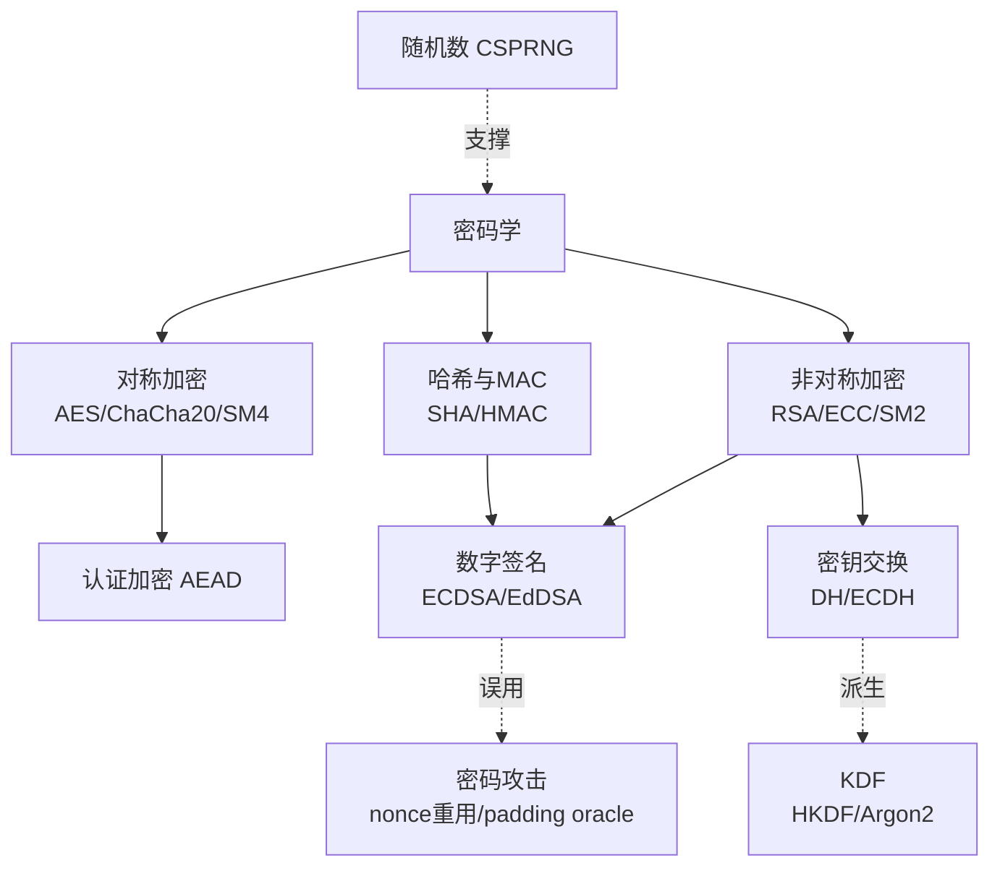

# 密码学 · 系列总览

> 作者原创系列，共 **62** 篇。系统、详尽地覆盖现代密码学——**每个算法/方法单独成篇详细介绍**：对称（分组/模式/AEAD/流）、非对称（RSA/DH/ECC/签名）、哈希、MAC、KDF、随机数、国密 SM、后量子，以及密码攻击与工程实践。与 [[71.详解网络协议/15.TLS协议|TLS]]、[[71.详解网络协议/14.SSL协议|SSL]]、[[34.现代二进制防护机制/00.现代二进制防护机制总览|二进制防护]]、[[13.PE文件详解/12-详解PE文件(十二)：证书表|代码签名/证书]] 互补——密码学是它们共同的数学地基。

## 一、基础

| # | 章节 | 说明 |
| --- | --- | --- |
| 01 | [[01.密码学全景与基本概念]] | 机密性/完整性/认证、Kerckhoffs、攻击模型、古典密码与分析 |

## 二、对称加密总论

| # | 章节 | 说明 |
| --- | --- | --- |
| 02 | [[02.对称加密总论]] | 分组 vs 流、混淆与扩散、Feistel/SPN 结构、密钥管理 |

## 三、分组密码（逐个算法）

| # | 章节 | 说明 |
| --- | --- | --- |
| 03 | [[03.DES与3DES]] | Feistel、S 盒、56 位之殇、3DES 过渡 |
| 04 | [[04.AES详解]] | Rijndael 四步变换、密钥扩展、GF(2^8)、AES-NI |
| 05 | [[05.Blowfish]] | Feistel、可变密钥、慢密钥调度（bcrypt 之源） |
| 06 | [[06.Twofish]] | AES 决赛入围、密钥相关 S 盒 |
| 07 | [[07.Camellia]] | 日/NTT，TLS 支持，与 AES 同级 |
| 08 | [[08.IDEA]] | 混合三种群运算，PGP 早期 |
| 09 | [[09.RC5与RC6]] | 数据依赖循环移位、参数化 |

## 四、分组密码工作模式

| # | 章节 | 说明 |
| --- | --- | --- |
| 10 | [[10.分组密码工作模式总论]] | IV/nonce、填充、错误传播、并行性、选型 |
| 11 | [[11.ECB模式]] | 电子密码本、为何泄露模式（企鹅图） |
| 12 | [[12.CBC模式]] | 密文分组链接、IV、padding |
| 13 | [[13.CTR模式]] | 计数器、并行、流化 |
| 14 | [[14.CFB与OFB模式]] | 密文/输出反馈，自同步与流化 |

## 五、认证加密 AEAD

| # | 章节 | 说明 |
| --- | --- | --- |
| 15 | [[15.AEAD原理与GCM]] | 加密+认证一体、GCM/GHASH |
| 16 | [[16.ChaCha20-Poly1305]] | 软件友好的 AEAD |
| 17 | [[17.CCM与OCB与XTS]] | CCM/EAX/OCB、XTS 磁盘加密 |

## 六、流密码

| # | 章节 | 说明 |
| --- | --- | --- |
| 18 | [[18.流密码总论]] | 密钥流、同步/自同步、与一次性密码本 |
| 19 | [[19.RC4]] | KSA/PRGA、偏置弱点、WEP/TLS 之殇 |
| 20 | [[20.ChaCha20与Salsa20]] | ARX 设计、quarter-round |

## 七、非对称加密

| # | 章节 | 说明 |
| --- | --- | --- |
| 21 | [[21.非对称加密总论]] | 公钥思想、单向陷门、数论基础（模幂/欧拉/费马） |
| 22 | [[22.RSA详解]] | 密钥生成、加解密、签名、CRT、PKCS#1/OAEP/PSS |
| 23 | [[23.Diffie-Hellman密钥交换]] | 离散对数、MITM、参数 |
| 24 | [[24.ElGamal加密与签名]] | 基于 DLP 的加密与签名 |
| 25 | [[25.椭圆曲线密码学基础]] | 曲线、点加/标量乘、参数（secp256k1/P-256/Curve25519） |
| 26 | [[26.ECDH密钥交换]] | 椭圆曲线 DH |
| 27 | [[27.ECDSA签名]] | 椭圆曲线签名、nonce 的关键性 |
| 28 | [[28.EdDSA与Ed25519]] | 确定性签名、安全优势 |

## 八、哈希函数（逐个算法）

| # | 章节 | 说明 |
| --- | --- | --- |
| 29 | [[29.哈希函数原理]] | 性质、Merkle-Damgård、海绵、生日攻击 |
| 30 | [[30.MD5]] | 结构、碰撞、已破 |
| 31 | [[31.SHA-1]] | 结构、SHAttered 碰撞 |
| 32 | [[32.SHA-2]] | SHA-224/256/384/512 家族 |
| 33 | [[33.SHA-3与Keccak]] | 海绵结构、与 SHA-2 并存 |
| 34 | [[34.BLAKE2与BLAKE3]] | 高速、并行树哈希 |

## 九、MAC

| # | 章节 | 说明 |
| --- | --- | --- |
| 35 | [[35.CBC-MAC与CMAC]] | 分组密码构造 MAC |
| 36 | [[36.HMAC]] | 基于哈希的 MAC、嵌套结构 |
| 37 | [[37.Poly1305与GMAC]] | 一次性多项式 MAC |

## 十、KDF 与随机数（逐个）

| # | 章节 | 说明 |
| --- | --- | --- |
| 38 | [[38.HKDF]] | 提取-扩展 KDF |
| 39 | [[39.PBKDF2]] | 口令派生、迭代 |
| 40 | [[40.bcrypt]] | 基于 Blowfish 的口令哈希 |
| 41 | [[41.scrypt]] | 内存硬 KDF |
| 42 | [[42.Argon2]] | 现代口令哈希冠军 |
| 43 | [[43.随机数与熵]] | TRNG/PRNG/CSPRNG、Fortuna、弱随机危害 |

## 十一、国密 SM（逐个）

| # | 章节 | 说明 |
| --- | --- | --- |
| 44 | [[44.国密SM体系概览]] | 国密标准全景与合规 |
| 45 | [[45.SM4分组密码]] | 32 轮、与 AES 对比 |
| 46 | [[46.SM3哈希]] | 256 位、与 SHA-256 对比 |
| 47 | [[47.SM2公钥密码]] | 基于 ECC 的加密/签名/密钥交换 |
| 48 | [[48.ZUC流密码]] | 祖冲之、4G/5G 加密 |

## 十二、后量子密码

| # | 章节 | 说明 |
| --- | --- | --- |
| 49 | [[49.后量子密码概览]] | 量子威胁、Shor/Grover、NIST 标准化 |
| 50 | [[50.格密码基础]] | 格、LWE/Ring-LWE、SVP/CVP |
| 51 | [[51.Kyber-ML-KEM]] | 格基 KEM（FIPS 203） |
| 52 | [[52.Dilithium-ML-DSA]] | 格基签名（FIPS 204） |

## 十三、攻击与工程

| # | 章节 | 说明 |
| --- | --- | --- |
| 53 | [[53.密码学攻击概览]] | 攻击模型、侧信道、实现攻击全景 |
| 54 | [[54.ECDSA-nonce攻击]] | nonce 重用/偏置 lattice 恢复私钥（防御视角） |
| 55 | [[55.RSA攻击概览]] | 因式分解、Fermat、Pollard、攻击面 |
| 56 | [[56.RSA共模与小公钥指数攻击]] | common modulus、low-e、Håstad 广播 |
| 57 | [[57.RSA-Wiener与小私钥攻击]] | 连分数、Boneh-Durfee |
| 58 | [[58.RSA-Bleichenbacher与padding-oracle]] | PKCS#1 v1.5 oracle、ROBOT |
| 59 | [[59.RSA-Coppersmith攻击]] | 已知部分位、格、partial key exposure |
| 60 | [[60.对称密码攻击]] | padding oracle、IV 重用、ECB、长度扩展 |
| 61 | [[61.侧信道攻击]] | 时序/功耗/缓存、故障注入、防护 |
| 62 | [[62.协议误用与密码工程]] | 弱随机/降级、库选型、密钥管理 KMS/HSM |

## 密码学知识地图

> 一句话：对称加密快、适合大数据；非对称解决密钥分发与签名；哈希保完整性；三者协同构成 TLS、签名、加密存储等一切安全协议——而**正确的参数与随机数**是它们不被攻破的前提。
