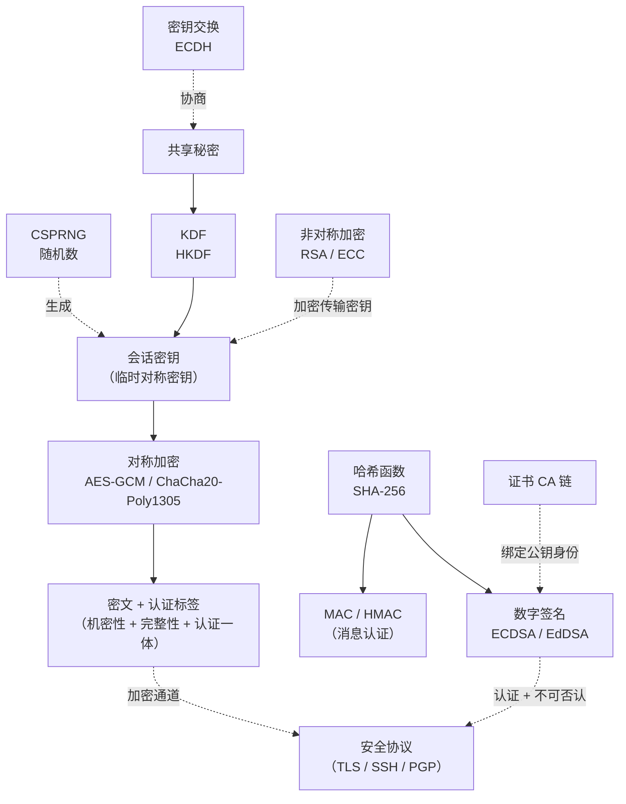

# 密码学（1）· 密码学全景与基本概念

> [!abstract] TL;DR
> - 密码学的四大目标：**机密性**（别人看不懂）、**完整性**（别人改不了）、**认证**（知道是谁发的）、**不可否认**（发了就赖不掉）。
> - **Kerckhoffs 原则**：安全性必须只依赖密钥，而不依赖算法保密。算法公开、密钥保密——这是现代密码学的基石。
> - 密码学原语各司其职：对称加密管速度、非对称解决密钥分发与签名、哈希保完整性、MAC 提供消息认证、KDF 派生密钥、CSPRNG 提供熵——TLS 是它们协同的典型范例。
> - 攻击模型从弱到强：COA → KPA → CPA → CCA，现代密码方案至少要在 CPA 下安全（IND-CPA），实用方案要达到 IND-CCA2。
> - 古典密码（凯撒/维吉尼亚/单表替换）死于频率分析；Shannon 的完美保密理论告诉我们只有一次性密码本（OTP）可以达到理论完美安全，但它不实用。**不要自己造密码，用标准库。**

---

## 概述与定位

密码学（Cryptography）研究如何在不安全信道上安全地通信与存储信息。它不只是加密——任何涉及**信息安全四大目标**的数学与工程方法都属于密码学范畴。

本篇是系列的**全景入门篇**，任务有三：

1. 建立"密码学要解决什么问题"的完整认知框架（四大目标 + Kerckhoffs 原则）；
2. 给出所有密码学原语的全景鸟瞰（原语是什么、彼此如何协同）；
3. 从古典密码的失败出发，引出现代密码学的安全定义。

后续各篇（[[02.对称加密总论]]、AES、RSA、ECC 等）都是对本篇原语的深入展开；本篇也是理解 [[71.详解网络协议/15.TLS协议.md]] 的必要前置——TLS 握手本质上是对本篇所有原语的一次综合调度。

---

## 密码学的四大目标

现代密码学用四个相互独立又相互配合的安全目标描述"安全通信"的完整含义。

### 机密性（Confidentiality）

信息只能被授权方读取，窃听者即便截获密文也无法还原明文。

经典手段：对称加密（AES-GCM 等）、非对称加密（RSA-OAEP、ECIES 等）。

### 完整性（Integrity）

信息在传输或存储过程中，任何篡改都能被**检测**出来。注意：完整性保护不等于保密——一段明文摘要可以公开挂在消息旁边，任何人都能验证有没有被改动。

经典手段：密码学哈希（SHA-256 等）、MAC（HMAC 等）、数字签名。

### 认证（Authentication）

证明消息确实来自声称的发送方，而非冒充者。认证又分两层：

- **消息认证**：这条消息确实由持有特定密钥的一方发出（MAC / 签名）。
- **身份认证**：这个通信方确实是他声称的那个实体（证书 + 签名链、Challenge-Response 等）。

### 不可否认（Non-repudiation）

发送方事后无法否认自己发送过某条消息。这是认证的加强版：MAC 只能向知道共享密钥的对方证明，签名可以向任何第三方证明。

不可否认必须依赖**非对称签名**——只有私钥持有者才能生成签名，公钥持有者（包括法院/第三方审计方）都能验证。

> [!note] 四目标的覆盖关系
> 仅用对称加密（AES-CBC）只能提供机密性，完整性和认证都不在其中——这正是"加密 ≠ 安全通信"的根源，也是为什么实践中要用 AEAD（Authenticated Encryption with Associated Data）而不是裸 AES。

---

## Kerckhoffs 原则

Auguste Kerckhoffs 于 1883 年在《军事密码学》中提出了六条原则，其中第二条演变为今天所说的 **Kerckhoffs 原则**：

> **一个密码系统即使在算法被敌方完全知晓的情况下，也应该是安全的。安全性必须只依赖于密钥的保密性，而不依赖于算法的保密性。**

### 为什么算法必须公开

- **可审计**：算法公开才能被学术界和安全社区广泛分析，历史反复证明"秘密算法"往往暗藏严重缺陷（安全依赖混淆，而非数学强度）。
- **可互操作**：算法标准化后，不同厂商、不同平台的实现可以互通。
- **密钥更容易保护**：相比保密算法（算法一旦泄露系统全军覆没），保护一个秘密密钥在工程上更可行——密钥可以随时轮换，算法不能。

### 推论：不要自己造密码

Kerckhoffs 原则的逆向推论同样重要：任何依赖"算法不为人知"的安全方案都是**默默无闻式安全（Security through obscurity）**，是反模式。现代密码方案（AES、RSA、Curve25519、SHA-3……）都是公开发布后经历多年公开分析才被广泛部署的。**自行设计加密算法几乎必然存在缺陷，使用标准库才是正确实践。**

---

## 密码学原语全景

"原语"（Primitive）是密码学中功能最单一、设计最底层的构件。更复杂的协议（TLS、PGP、SSH）都是由这些原语拼装而成。

### 原语一览

| 原语 | 典型算法 | 解决的核心问题 |
|------|----------|----------------|
| 对称加密 | AES-GCM、ChaCha20-Poly1305、SM4 | 机密性（快，适合大数据） |
| 非对称加密 | RSA-OAEP、ECIES、SM2 | 无共享密钥的机密性 / 密钥封装 |
| 密钥交换（KEX） | DH、ECDH、X25519 | 不安全信道上协商共享密钥 |
| 哈希函数 | SHA-256/3、BLAKE3、SM3 | 数据完整性指纹（单向压缩） |
| MAC | HMAC、CMAC、Poly1305、GMAC | 消息认证（需共享密钥） |
| 数字签名 | RSA-PSS、ECDSA、EdDSA/Ed25519、SM2 | 认证 + 不可否认（非对称） |
| KDF | HKDF、PBKDF2、Argon2、bcrypt | 从弱密码或共享密钥派生强密钥 |
| 随机数 | OS 熵源（`/dev/urandom`、Windows CNG）、CSPRNG | 为一切密码操作提供不可预测性 |

### 原语之间如何协同

单独使用任何一个原语通常不够安全或不够实用，实际方案是多个原语的组合：



### TLS 1.3 的原语调度（典型案例）

[[71.详解网络协议/15.TLS协议.md]] 的握手过程是上述原语协同的教科书范例：

1. **ClientHello / ServerHello**：双方协商密码套件、交换 ECDH 公钥（`X25519` 密钥交换）。
2. **共享秘密 → KDF**：双方各自用 ECDH 计算共享秘密，再经 HKDF 派生出握手密钥和应用层密钥。
3. **证书验证**：服务端证书链 + ECDSA/RSA 签名，客户端验证服务端身份（认证 + 不可否认）。
4. **Finished 消息**：HMAC 确认握手消息完整性（完整性 + 认证）。
5. **应用数据**：全部用 AES-128-GCM 或 ChaCha20-Poly1305 加密传输（机密性 + 完整性 + 认证三合一，AEAD）。

整个握手链接触了 KEX、KDF、签名、哈希、AEAD 六类原语，CSPRNG 在整个过程中提供随机性支撑，没有任何一环可以单独完成任务。

---

## 攻击模型分级

安全定义必须明确"攻击者能做什么"。密码学用攻击模型（Attack Model）描述攻击者的能力，模型越强，安全证明越有意义。

### 分级体系

| 模型 | 缩写 | 攻击者能做什么 | 典型场景 |
|------|------|----------------|----------|
| 唯密文攻击 | **COA** | 只能看到若干密文 | 被动窃听，信息最少 |
| 已知明文攻击 | **KPA** | 掌握若干"明文-密文"对 | 已知部分通信内容（如协议头固定字段） |
| 选择明文攻击 | **CPA** | 可以让加密机加密任意明文，得到密文 | 攻击者能影响部分被加密的数据 |
| 选择密文攻击 | **CCA** | 可以让解密机解密任意密文（目标密文除外），看明文 | 攻击者能访问解密 Oracle（Padding Oracle 等） |
| 自适应选择密文攻击 | **CCA2** | CCA + 每次查询可依据之前结果调整，无次数限制 | 最强的黑盒攻击模型，实践中用于证明"实用安全" |

> **安全强度方向**：COA < KPA < CPA < CCA < CCA2。

### 各模型的直觉

- **COA**：最古典的攻击场景。凯撒密码、单表替换在 COA 下都直接被频率分析攻破。
- **KPA**：二战期间盟军利用纳粹 Enigma 机的固定报头（"Heil Hitler" 结尾等）成功实施 KPA，加速破译。
- **CPA**：网络攻击中攻击者往往能控制部分被加密的数据（如让服务器加密含攻击者内容的报文）。AES-ECB 在 CPA 下不安全（重复明文块产生重复密文）。
- **CCA/CCA2**：Padding Oracle 攻击是 CCA 的现实案例——攻击者提交修改后的密文，通过解密失败/成功的侧信道信息逐字节恢复明文。

### 安全性定义直觉

密码学用**不可区分性（Indistinguishability，IND）**形式化"密文不泄露明文信息"这个目标：

**IND 游戏框架**：

```
攻击者选择两段等长明文 m0、m1，给挑战者；
挑战者随机选 b ∈ {0,1}，加密 mb 得到密文 c，返回给攻击者；
攻击者猜测 b'，如果成功概率不显著超过 1/2（即不比瞎猜强），则方案是 IND 安全的。
```

- **IND-CPA**：在 CPA 攻击者（可查询加密 Oracle）面前，密文不可区分。AES-CBC（正确使用随机 IV）、AES-CTR 满足 IND-CPA。AES-ECB 不满足——攻击者可以通过比较密文块直接区分。
- **IND-CCA2**：在 CCA2 攻击者（可查询解密 Oracle，目标密文除外）面前仍不可区分。这是"语义安全"的实用最高标准，AES-GCM、RSA-OAEP 设计目标是 IND-CCA2。

> **语义安全（Semantic Security）**直觉：给你密文 c，你无法获得关于对应明文的任何信息——哪怕是"第一个字节是不是 0x41"这种部分信息。IND-CPA 与语义安全在标准密码学模型下等价。

---

## 古典密码与频率分析

古典密码是现代密码学的反例教材——它们告诉我们"直觉上看起来安全的加密"有多脆弱。

### 凯撒密码（Caesar Cipher）

最简单的移位密码：把每个字母向后移 k 位（k 为密钥，0-25）。

```
明文：HELLO
k=3 → 密文：KHOOR
解密：密文每个字母向前移 3 位
```

**攻击**：密钥空间仅 26，暴力穷举 26 次试遍即破，连 COA 都无法抵抗。

### 单表替换密码（Monoalphabetic Substitution）

凯撒是特殊情况，更一般的是用一张随机字母表替换：A→Q、B→X、C→K……密钥空间 26! ≈ 4×10²⁶，暴力穷举不可行。

**但它被频率分析轻松破解**——这正是古典密码的死穴。

#### 频率分析（Frequency Analysis）

英语文本中字母出现频率极不均匀：

| 字母 | 频率（约） |
|------|-----------|
| E | 12.7% |
| T | 9.1% |
| A | 8.2% |
| O | 7.5% |
| … | … |
| Z | 0.07% |

单表替换保留了字母频率——如果密文中某个符号出现最频繁，它大概率是 E 的替换；两字母组合（bigram）"TH"、"HE" 频繁，三字母 "THE"、"AND" 更明显。给定足够长的密文（几百字母），统计频率几乎必然破译。

**根本原因**：单表替换在每个位置使用相同的映射，不同位置的相同字母产生相同密文，**统计规律没有被消灭，只是被"翻译"了一遍**。

### 维吉尼亚密码（Vigenère Cipher）

维吉尼亚密码用一个长度为 n 的关键词循环替换，相当于 n 个交织的凯撒密码：

```
明文：  ATTACKATDAWN
关键词：LEMON → LEMONLEMONLE
密文：  LXFOPVEFRNHR  （每位按各自偏移量移位）
```

密钥长度 n 个字母，密钥空间 26ⁿ，看起来更强。但 19 世纪 Charles Babbage 和 Friedrich Kasiski 分别独立发现了**Kasiski 检验**：

- 密文中相同的字母段（如 "LXF" 反复出现）往往对应相同明文与相同密钥位对齐，间距是密钥长度的倍数。
- 统计多个密文段间距的最大公因数，可以估计密钥长度 n。
- 确定 n 后，将密文按位置模 n 分成 n 组，每组变回单表替换，频率分析各自破解。

维吉尼亚的改进只是让"密钥更长"，但没有消除统计规律，KPA 下轻松破解。

### 古典密码失败的本质

频率分析揭示了古典密码的根本缺陷：**它们没有充分混淆明文的统计结构**。无论凯撒还是维吉尼亚，明文语言的统计分布都以不同形式泄露到密文中。

这引出了现代密码学的核心要求（Shannon 1949 年提出）：

- **混淆（Confusion）**：密文与密钥之间的关系应该尽可能复杂（S 盒实现）。
- **扩散（Diffusion）**：明文每一位的改变应该尽可能多地影响密文位（AES 的 MixColumns、ShiftRows 实现）。

AES 通过每一轮 SubBytes（混淆）+ ShiftRows/MixColumns（扩散）联合消灭了统计规律，频率分析完全失效。

---

## Shannon 完美保密与一次性密码本

Claude Shannon 在 1949 年的论文《保密系统的通信理论》中为密码学奠定了信息论基础，并给出了**完美保密（Perfect Secrecy）**的严格数学定义。

### 完美保密的定义

**定义**：给定密文 c，攻击者对明文 m 的后验分布与先验分布完全相同——密文没有向攻击者泄露任何关于明文的信息。

用条件概率表示：

```
完美保密条件：

Pr[M = m | C = c] = Pr[M = m]

对所有可能的明文 m 和密文 c 均成立。
```

等价表述：对任意两段等长明文 m0、m1，使用相同密钥分布加密后，密文分布完全相同（IND 不可区分性的信息论版本）。

### Shannon 定理

Shannon 证明了一个重要下界：

> **完美保密的必要条件**：密钥空间的大小必须**不小于**消息空间的大小，即密钥长度 ≥ 消息长度。

这意味着"密钥比消息短就能完美保密"在信息论层面是不可能的——凯撒密码、维吉尼亚密码的密钥都比明文短（或可重用），理论上就注定无法达到完美保密。

### 一次性密码本（One-Time Pad，OTP）

OTP 是**唯一**达到完美保密的实用密码体制，由 Gilbert Vernam 于 1917 年发明：

```
条件：密钥 k 是与明文等长的真随机比特串，且每个密钥只用一次
加密：c = m XOR k
解密：m = c XOR k
```

**为什么完美安全**：对任意密文 c，存在唯一的 k 使 c = m₀ XOR k，也存在唯一的 k' 使 c = m₁ XOR k'。由于 k 完全随机，攻击者看到 c 后，每个明文 m 都是等可能的，密文完全不泄露明文信息。

**为什么不实用**：

| 问题 | 说明 |
|------|------|
| 密钥长度等于明文长度 | 发送一条 1GB 的消息需要 1GB 的密钥 |
| 密钥必须安全分发 | 密钥传输本身就需要安全信道——转了一圈，原问题没解决 |
| 密钥绝对不能重用 | 若 c1 = m1 XOR k，c2 = m2 XOR k，则 c1 XOR c2 = m1 XOR m2，统计攻击立即奏效 |
| 密钥必须真随机 | 伪随机生成的"OTP"退化为流密码，不再完美安全 |

> **历史教训**：苏联在冷战早期曾重用一次性密码本密钥，美国 Venona 计划正是利用这一错误解读了大量苏联外交情报。

### 从完美保密到计算安全

OTP 的不实用性推动了密码学范式的转变：放弃信息论层面的完美安全，转而追求**计算安全**——

> 对于计算资源有限的攻击者（多项式时间）来说，在可接受的时间内破解密码在计算上不可行（破解所需时间远超宇宙年龄，或所需资源超过宇宙中所有原子数量）。

现代密码学的安全证明基于**计算困难假设**（大整数分解难、离散对数难、椭圆曲线离散对数难……），在这些假设成立的前提下，AES、RSA、ECDH 等方案被证明是计算安全的。

---

## 安全性与正确使用

密码学原语设计得再好，误用同样会导致灾难性的安全漏洞。以下是使用密码学时最核心的工程原则：

### 黄金法则：不要自己造密码

自行实现或设计密码算法是最危险的行为：

- 时序攻击（Time Attack）：自己写的字节比较往往不是常数时间，泄露密钥信息。
- Padding 错误：自实现的 CBC Padding 几乎必然引入 Padding Oracle。
- 随机数误用：用 `rand()` 生成密钥是灾难性的。

**推荐做法**：使用 `libsodium`、Python `cryptography`（调 OpenSSL/BoringSSL 后端）、Java `javax.crypto`、Go `crypto/cipher` 等经过充分审计的标准库。

### 参数选择原则（2026 年参考）

| 类型 | 推荐 | 避免 |
|------|------|------|
| 对称加密 | AES-256-GCM、ChaCha20-Poly1305 | AES-ECB、RC4、DES/3DES |
| 哈希 | SHA-256、SHA-3/256、BLAKE3 | MD5、SHA-1（已破） |
| 非对称 | RSA-2048（最低）或 RSA-3072+、P-256 / X25519 | RSA-512/768、DSA-1024 |
| MAC | HMAC-SHA256、Poly1305 | CRC32（非密码学）、自定义 |
| 密码存储 | Argon2id（首选）、bcrypt（work factor ≥ 12） | 明文、MD5(password)、SHA1(password) |

### 常见误用与后果

| 误用 | 后果 |
|------|------|
| AES-ECB 替代 CBC/GCM | 相同明文块产生相同密文，图像/结构化数据直接泄露（企鹅加密图像） |
| CBC 无随机 IV 或 IV 重用 | 明文前缀相同导致密文前缀相同，可能触发 KPA |
| ECDSA nonce 重用 | 两次用同一 nonce 签名即可解出私钥（见 [[27.ECDSA签名]]） |
| Padding Oracle（CBC 解密） | 逐字节恢复明文，Padding Oracle 攻击的标准路径 |
| 弱随机数（`rand()`/`Math.random()`） | 密钥可预测，等同于无加密 |
| 未验证 MAC/签名就处理数据 | "先解密再验证"漏洞，Padding Oracle 的根因 |

> 更多工程误用与防御见系列后续篇章 [[62.协议误用与密码工程]] 以及 [[34.现代二进制防护机制/00.现代二进制防护机制总览.md]]（代码签名、CFI 等防护机制与密码学的交汇点）。

---

## 小结

| 要点 | 一句话 |
|------|--------|
| 四大目标 | 机密性、完整性、认证、不可否认——缺一不可 |
| Kerckhoffs 原则 | 算法公开，安全只依赖密钥；不靠"算法保密" |
| 原语协同 | 对称快、非对称解决密钥分发、哈希保完整性、MAC 认证、KDF 派生、CSPRNG 提供熵 |
| TLS 的本质 | 六类密码学原语的一次综合调度 |
| 攻击模型 | COA → KPA → CPA → CCA2，越强的模型下的安全证明越有价值 |
| IND-CPA/CCA2 | 语义安全的标准化描述，现代方案至少要求 IND-CPA |
| 古典密码的死因 | 频率分析——统计规律没有被消灭，只是被"翻译"了 |
| Shannon 完美保密 | OTP 是唯一完美安全的方案，密钥长度不能短于消息，实际不可用 |
| 计算安全 | 现代密码学的目标：对多项式时间攻击者计算上不可破 |
| 工程实践 | 不要自造密码；用标准库；选推荐参数；先验证 MAC 再解密 |

---

## 相关阅读

- **下一篇（对称加密展开）**：[[02.对称加密总论]]
- **TLS 实际调度这些原语**：[[71.详解网络协议/15.TLS协议.md]]
- **代码签名与签名验证**：[[34.现代二进制防护机制/00.现代二进制防护机制总览.md]]
- **ECDSA 与 nonce 攻击**：[[27.ECDSA签名]]
- **Padding Oracle、长度扩展等攻击**：[[60.对称密码攻击]]
- **工程误用汇总**：[[62.协议误用与密码工程]]
- **系列总览与导航**：[[00.密码学总览]]

---

⬅️ 上一篇 [[00.密码学总览]] ｜ 🏠 [[00.密码学总览]] ｜ 下一篇 [[02.对称加密总论]] ➡️
