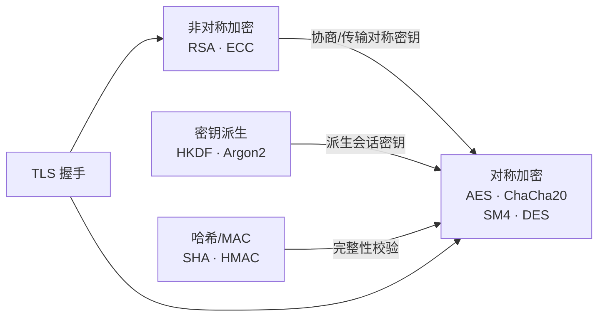
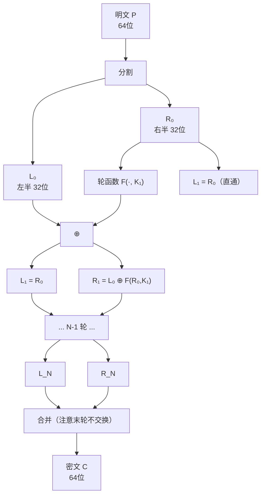
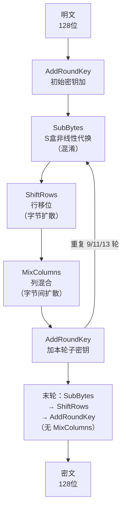
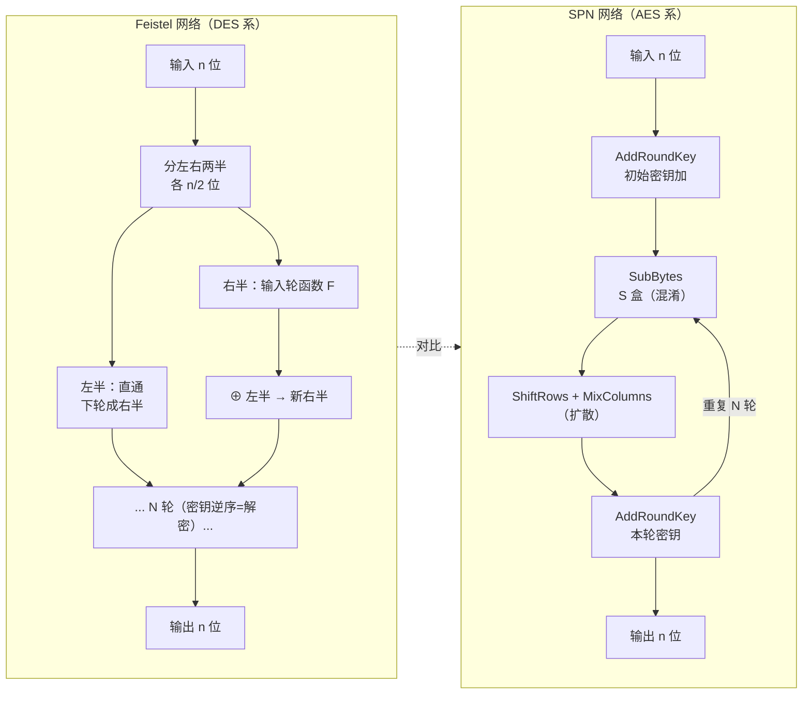

# 密码学（2）· 对称加密总论

> [!abstract] TL;DR
> - **对称加密**：加解密使用**同一把密钥**，速度快，适合大数据；密钥分发是核心难题。
> - **两类算法**：**分组密码**（Block Cipher）——将明文分块逐块处理，代表 AES/DES；**流密码**（Stream Cipher）——按比特/字节逐位加密，代表 ChaCha20/RC4。
> - **两大内部结构**：**Feistel 网络**（DES 系）——每轮只变一半，加解密结构天然对称；**SPN 代换-置换网络**（AES 系）——S 盒提供非线性、P 置换扩散，需显式设计逆向。
> - **Shannon 双支柱**：混淆（confusion）打散密钥与密文关系，扩散（diffusion）把明文影响铺满密文——现代分组密码就是把这两条做到极致。
> - **密钥长度**：128 位是当前安全下限，256 位面向后量子储备；56 位 DES 已彻底过时。
> - **密钥管理难题**：n 个用户两两共享密钥需 n(n-1)/2 把，直接导致不可扩展——这是非对称密码学存在的根本动机（见 [[21.非对称加密总论]]）。

本篇是「密码学」系列对称加密子版块的**总论**：首先厘清对称加密的定义与边界，然后深入 Shannon 理论、两大分组结构（Feistel/SPN），最后讨论密钥管理与实践角色。具体算法细节见 [[03.DES与3DES]]（DES/Feistel 实例）、[[04.AES详解]]（SPN 实例）、[[10.分组密码工作模式总论]]（ECB/CBC/GCM 等）与 [[15.AEAD原理与GCM]]。

---

## 概述与定位

### 什么是对称加密

**对称加密**（Symmetric Encryption）的本质只有一句话：

> 加密与解密使用**同一把密钥 K**。

```
Enc(K, M) = C        -- 加密：明文 M 用密钥 K 得到密文 C
Dec(K, C) = M        -- 解密：密文 C 用同一密钥 K 还原明文 M
```

"对称"就是指密钥对加解密**双向适用**——与非对称加密（公钥加密、私钥解密，或私钥签名、公钥验证）形成对比。见 [[01.密码学全景与基本概念]] 对加密系统三元组 `(Enc, Dec, KeyGen)` 的定义。

### 对称加密的位置

在整个密码学体系里，对称加密承担**加密大数据**的核心工作：



对称加密速度极快（AES-NI 硬件加速下可达 GB/s 量级），是所有需要**批量加密**场景（磁盘加密、HTTPS 数据通道、文件加密）的标准选择；非对称加密速度慢几个量级，主要用于**密钥协商与签名**，不直接加密大数据。

---

## 原理与机制

### Shannon 的混淆与扩散

1949 年，Claude Shannon 在《保密系统的通信理论》中提出了分析和设计密码系统的两个核心概念，至今仍是现代对称密码学的理论地基。

**混淆（Confusion）**

> 使密钥与密文之间的关系尽可能复杂，让分析者无法从密文推断密钥。

具体实现手段：**非线性代换**（Substitution）。
- 若密文的每一位是密钥和明文的**线性函数**，则只需少量已知明文就能列出线性方程组解密钥。
- 非线性变换（如 S 盒）打断这种线性关系，使得改变密钥的 1 位可能影响密文的任意多位，且影响方式不可预测。

**扩散（Diffusion）**

> 明文中每一位的影响应当扩散到密文的尽可能多的位；同样，密钥中每一位的影响也应扩散到密文的尽可能多的位。

具体实现手段：**置换与线性混合**（Permutation / Linear Layer）。
- 雪崩效应（Avalanche Effect）：改变明文的 1 位，密文中大约 50% 的位发生变化。
- 若扩散不足，攻击者可以对密文分块独立分析，大大简化攻击复杂度。

**两者缺一不可**：只有混淆（如单纯的 S 盒）无法把局部变化扩展到全局；只有扩散（如纯置换）不提供非线性保护，线性密码分析轻易攻破。现代分组密码的每一轮都交替执行混淆层与扩散层，多轮累积后同时满足两个条件。

```
轮函数（简化）：
  非线性层（S 盒）    —— 提供混淆
  线性层（P 置换/线性变换） —— 提供扩散
  密钥加（AddKey）    —— 注入密钥材料
  × N 轮
```

### 分组密码 vs 流密码

对称加密按**处理粒度**分为两大类：

| 维度 | 分组密码（Block Cipher） | 流密码（Stream Cipher） |
|---|---|---|
| 处理单位 | 固定长度块（64/128 位等） | 逐位/逐字节 |
| 核心操作 | 多轮代换-置换 | 伪随机密钥流 XOR 明文 |
| 典型代表 | AES、DES、SM4 | ChaCha20、RC4、ZUC |
| 适用场景 | 通用加密（文件、数据库） | 实时流数据、低延迟通信 |
| 并行性 | 模式相关（CTR/GCM 可并行） | 天然串行（但 ChaCha20 可并行） |
| 错误传播 | 依模式（CBC 传播，CTR 不传播） | 仅影响对应位 |
| 状态 | 无状态（分组本身） | 有状态（密钥流生成器） |
| 误用风险 | ECB 模式暴露模式（见 [[10.分组密码工作模式总论]]） | 密钥流重用致密文异或泄露明文差 |

> [!note] 流密码与分组密码的 CTR 模式
> 分组密码在 CTR（计数器）模式下的行为本质上等同于流密码：用分组密码加密递增计数器生成伪随机密钥流，再与明文 XOR。ChaCha20 则是专门设计的流密码，无需 IV/nonce 之外的初始化开销。

---

## 算法流程 / 结构详解

### Feistel 网络

Feistel 网络由 IBM 密码学家 Horst Feistel 在 1970 年代设计，DES 是其最著名的实现。

**核心思想**：每轮只改变**一半**数据，另一半作为轮函数的输入但本轮不修改；下一轮互换角色。这样无论轮函数 F 是否可逆，整个网络都**天然可逆**——解密只需逆序使用子密钥，结构代码与加密完全对称。

**单轮操作**（输入 64 位，分左右各 32 位）：

```
输入: (L_{i-1}, R_{i-1})
L_i = R_{i-1}
R_i = L_{i-1} XOR F(R_{i-1}, K_i)

输出: (L_i, R_i)
```

解密只需将子密钥顺序反转，公式变为：
```
R_{i-1} = L_i
L_{i-1} = R_i XOR F(L_i, K_i)
```

**结构图**（N 轮 Feistel）：



**Feistel 的优势与局限**：

| 优势 | 局限 |
|---|---|
| 加解密结构完全对称，硬件实现成本减半 | 每轮只变一半，达到相同扩散需要更多轮 |
| 轮函数 F 无需可逆，设计自由度大 | 分组大小通常 64 位（DES），现代应用偏小 |
| 安全性分析框架成熟（差分/线性密码分析） | 典型实现（DES 56 位密钥）已不安全 |

### SPN 代换-置换网络

SPN（Substitution-Permutation Network）是 AES（Rijndael）采用的结构，每轮对**全部数据**同时进行代换和置换。

**每轮包含两个核心层**：

1. **S 盒（Substitution Box）**：非线性代换，提供混淆。AES 的 S 盒是在 GF(2^8) 上的乘法逆加仿射变换，严格按数学设计以抵抗差分/线性密码分析。
2. **P 层（Permutation / Linear Layer）**：线性扩散，提供扩散。AES 中对应 ShiftRows（字节行移位）+ MixColumns（列混合，GF(2^8) 矩阵乘法）。

**单轮操作（AES 简化）**：
```
输入: State（128位，4×4字节矩阵）
1. SubBytes   —— S 盒替换每字节（非线性，混淆）
2. ShiftRows  —— 行循环移位（扩散字节位置）
3. MixColumns —— 列线性混合（扩散字节影响）
4. AddRoundKey —— XOR 本轮子密钥（注入密钥）
```

**结构图**：



**SPN 的优势与局限**：

| 优势 | 局限 |
|---|---|
| 每轮对全部数据操作，扩散更快（AES 仅需 10 轮） | 加解密结构不对称，需单独设计逆 S 盒和逆线性层 |
| 128 位分组，结构天然对齐现代安全需求 | 逆变换计算略复杂（尤其是 MixColumns 的逆） |
| S 盒有严格数学基础，可证明安全边界 | 实现时需分别实现加密路径和解密路径 |

### Feistel vs SPN 一图对比



---

## 密钥长度与安全边界

密钥长度直接决定暴力破解所需的计算量——穷举 2^k 个密钥。

| 密钥长度 | 代表算法 | 当前状态 | 说明 |
|---|---|---|---|
| 40 位 | 早期出口级 RC2/RC4 | 已破解 | 2^40 ≈ 1 万亿，现代 GPU 秒级穷举 |
| 56 位 | DES | 已破解（1997 年 EFF 22 小时） | 2^56 ≈ 7.2×10^16，专用硬件已不安全 |
| 112 位 | 3DES（二密钥） | 已弃用（NIST 2023 淘汰） | 实际安全强度约 112 位，但性能极差 |
| 128 位 | AES-128、ChaCha20 | **当前安全** | 2^128 ≈ 3.4×10^38，经典计算机无法穷举 |
| 192/256 位 | AES-192/AES-256 | **高安全/后量子储备** | Grover 算法把对称密钥量子攻击折半：256 位 → 128 位量子安全 |

> [!note] 为什么 128 位是"当前下限"
> 即便汇聚全球所有计算资源（约 10^25 FLOPS），穷举 2^128 个密钥也需要远超宇宙年龄的时间。而 56 位 DES 在 1998 年已被专用硬件 "DES Cracker" 在 22 小时内破解。
>
> 面向量子计算威胁：Grover 算法把对称加密的暴力破解复杂度从 O(2^k) 降至 O(2^{k/2})，所以量子时代推荐 256 位密钥（等效 128 位量子安全强度）。

**密钥长度只是必要条件**：即使使用 256 位 AES，若密钥由弱随机数生成器产生，或者模式选择错误（如 ECB），整个加密系统仍可能被攻破——见 [[10.分组密码工作模式总论]] 和 [[60.对称密码攻击]]。

---

## 密钥管理难题

### n² 密钥分发问题

对称加密最根本的工程难题在于**密钥分发**（Key Distribution）：

> 若网络中有 n 个参与者，任意两人之间都想安全通信，总共需要多少把密钥？

答案是：

```
C(n, 2) = n(n-1) / 2
```

| 参与者数量 n | 所需密钥对数 |
|---|---|
| 10 | 45 |
| 100 | 4,950 |
| 1,000 | 499,500 |
| 100 万（互联网级） | ≈ 5×10^11（5000 亿） |

这意味着：
1. **密钥数量随参与者数量平方增长**——完全不可扩展。
2. 每对参与者都必须预先通过**安全信道**交换密钥——在开放网络中几乎不可能。
3. 密钥更新（密钥轮换）需要再次安全传输新密钥——形成鸡生蛋蛋生鸡的困境。

这个问题直接催生了**非对称密码学**（见 [[21.非对称加密总论]]）：Diffie 和 Hellman 在 1976 年提出 DH 密钥交换，允许双方在公开信道上协商出共享密钥，而无需预先安全传输任何秘密——彻底绕开了 n² 问题。

### 现代解决方案

| 方案 | 原理 | 典型场景 |
|---|---|---|
| DH / ECDH 密钥交换 | 非对称数学在公开信道协商共享密钥 | TLS 握手（见 [[23.Diffie-Hellman密钥交换]]） |
| 公钥加密传输对称密钥 | 用接收方公钥加密对称密钥 | PGP 文件加密 |
| KDC（密钥分发中心） | 受信第三方分发会话密钥 | Kerberos 协议 |
| KMS（密钥管理服务） | 中心化硬件/软件密钥管理 | AWS KMS、HSM |

> [!important] 混合加密（Hybrid Encryption）
> 实践中几乎所有系统都采用混合加密：**非对称算法协商/传递对称密钥，对称算法加密实际数据**。理由很简单：RSA/ECC 加解密速度比 AES 慢 100–1000 倍，对大数据不可行。TLS 1.3 的 ECDHE + AES-GCM 就是这一模式的标准实现。

---

## 对称加密的实践角色

### 速度优势与适用场景

硬件层面，现代 CPU 普遍内置 **AES-NI 指令集**，单条硬件指令完成 AES 轮变换，吞吐率可达每核 10 GB/s 量级（无 AES-NI 的纯软件实现约 1 GB/s）。相比之下，同等安全性的 RSA 操作吞吐率仅约 1–10 MB/s。

| 场景 | 对称算法 | 模式/方案 |
|---|---|---|
| HTTPS 数据通道 | AES-128-GCM | TLS 1.3 |
| 磁盘全盘加密 | AES-256-XTS | BitLocker / dm-crypt |
| 移动端加密 | ChaCha20-Poly1305 | TLS 1.3（无 AES-NI 设备） |
| 数据库透明加密 | AES-256-CBC | 存储层 TDE |
| 文件备份加密 | AES-256-GCM | 备份工具标准配置 |
| VPN 数据通道 | AES-256-GCM / ChaCha20 | WireGuard / OpenVPN |

### 对称加密的局限

1. **密钥分发问题**（已讨论）——需借助非对称加密解决。
2. **无内建完整性保护**——单独的分组密码只保证保密性，不保证数据未被篡改。必须配合 MAC/AEAD 使用（见 [[15.AEAD原理与GCM]]）。
3. **无抗抵赖性**——因为双方共享同一密钥，无法证明消息来自哪一方。需要数字签名（非对称）才能实现抗抵赖。

---

## 安全性与正确使用

### 密钥长度建议

| 用途 | 最低推荐 | 说明 |
|---|---|---|
| 新系统 | AES-128 | 当前安全下限，有硬件加速 |
| 高安全 / 长期存档 | AES-256 | 抵御未来量子攻击（Grover 折半后 = 128 位量子安全） |
| 禁止使用 | DES（56位）、3DES（弃用）、RC4 | 已知攻击或过时设计 |

### 必须配合正确模式使用

**单独的分组密码（ECB 模式）绝不应用于实际系统**：

- ECB 模式对相同明文块总产生相同密文块，直接泄露明文的模式结构（著名的 "ECB 企鹅"问题）。
- 没有 IV/nonce 导致两次加密相同明文得到相同密文，彻底破坏语义安全性。

> [!warning] 正确的模式选择
> - **默认选择 AEAD（同时提供保密性与完整性）**：AES-GCM 或 ChaCha20-Poly1305。
> - 若需要单独加密（不含 MAC），用 CBC + HMAC 或 CTR + HMAC，且 IV/nonce 必须随机且不重复。
> - 具体模式分析见 [[10.分组密码工作模式总论]]；AEAD 详解见 [[15.AEAD原理与GCM]]。

### 常见误用与后果

| 误用 | 后果 | 正确做法 |
|---|---|---|
| 使用 ECB 模式 | 明文模式泄露 | 改用 GCM 或 CBC+HMAC |
| nonce/IV 重用 | 密钥流（CTR/GCM）或明文差（CBC）泄露 | 每次加密生成随机 IV；GCM 用 96 位随机 nonce |
| 弱密钥生成（弱随机数） | 密钥空间实际缩小，暴力破解可行 | 使用 CSPRNG（OS 级 /dev/urandom 或等价） |
| 不验证密文完整性 | Padding Oracle、字节翻转攻击 | 使用 AEAD 或 MAC-then-Encrypt 中的 Encrypt-then-MAC |
| 使用弃用算法（DES/RC4） | 已知攻击工具公开可用 | 更换为 AES-256-GCM 或 ChaCha20-Poly1305 |

详细攻击分析见 [[60.对称密码攻击]]。

---

## 小结

对称加密是密码学工程的**核心引擎**——Shannon 的混淆与扩散两条原则奠定了理论基础，Feistel 网络（DES 系）和 SPN（AES 系）是两种主流的工程实现路径。

**三句话记住核心**：

1. **分组 vs 流**：分组密码处理固定大小块（AES），流密码逐位加密（ChaCha20）；实践中分组密码配合正确模式几乎覆盖所有场景。
2. **结构原理**：Feistel 加解密结构对称（适合硬件）；SPN 每轮处理全部数据（收敛更快）；两者都通过多轮交替混淆+扩散达到安全。
3. **密钥管理是最大挑战**：n² 密钥分发问题只能靠非对称加密（DH/ECDH）解决；单独使用对称加密无法扩展到开放网络。

下一篇 [[03.DES与3DES]] 将深入 Feistel 网络的具体实例——DES 的 S 盒设计、16 轮结构与密钥调度，以及为何 56 位密钥已成历史。

---

## 相关阅读

- [[01.密码学全景与基本概念]] — 密码学全景、攻击模型、Kerckhoffs 原则
- [[03.DES与3DES]] — Feistel 网络实例：DES 详解
- [[04.AES详解]] — SPN 实例：Rijndael 完整结构
- [[10.分组密码工作模式总论]] — ECB/CBC/CTR/GCM 模式对比
- [[15.AEAD原理与GCM]] — GCM/ChaCha20-Poly1305：同时保密与完整
- [[18.流密码总论]] — RC4/ChaCha20/ZUC 专题
- [[21.非对称加密总论]] — 公钥思想与密钥分发解决方案
- [[60.对称密码攻击]] — Padding Oracle、IV 重用、ECB 泄露实例
- [[62.协议误用与密码工程]] — 工程实践：密钥管理、KMS/HSM

---

⬅️ 上一篇 [[01.密码学全景与基本概念]] ｜ 🏠 [[00.密码学总览]] ｜ 下一篇 [[03.DES与3DES]] ➡️
