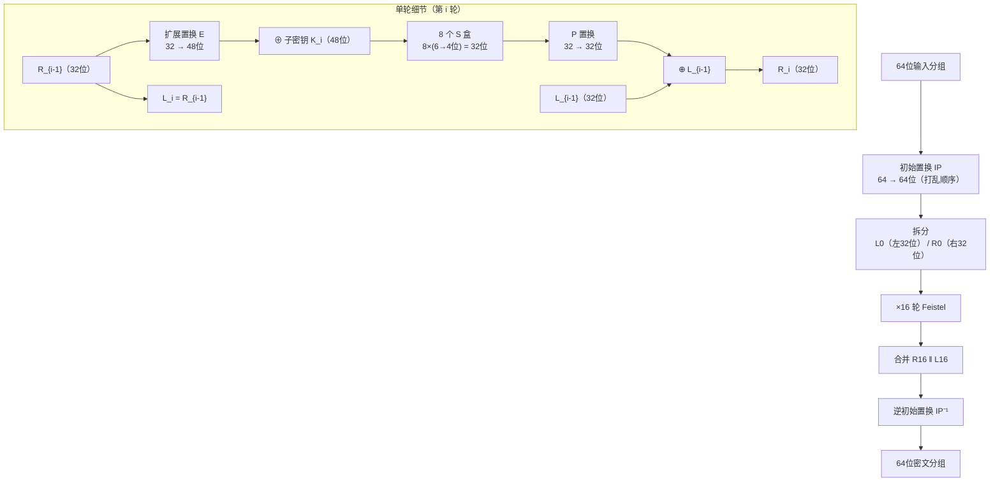
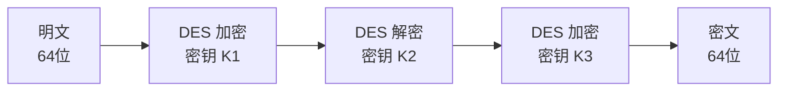

# 密码学（3）· DES与3DES

> [!abstract] TL;DR
> - **DES（Data Encryption Standard）**：1977 年 NIST 标准化的分组密码；64 位分组、56 位有效密钥（物理 64 位，8 位为奇偶校验），16 轮 Feistel 结构。S 盒是其安全核心，将 6 位压缩为 4 位，提供非线性。
> - **安全问题**：56 位密钥空间 2^56 ≈ 7.2×10^16，1998 年 EFF 的 DES Cracker 在 56 小时内暴力破解；弱密钥、差分与线性密码分析也击穿其学术安全性。
> - **3DES（Triple DES）**：以 EDE（加密-解密-加密）模式串联三次 DES，向后兼容单 DES；三密钥模式有效安全 112 位（中间相遇攻击），性能极差。Sweet32 生日攻击（2016）和 NIST 正式弃用（2023）标志着其退场。
> - **结论**：DES/3DES 均已淘汰，新系统一律用 [[04.AES详解]]（AES-128/192/256），理解 DES 的意义在于读懂 Feistel 结构与 S 盒设计哲学。

本篇属于[[02.对称加密总论]]所介绍的分组密码体系，重点讲解 Feistel 结构在 DES 中的完整实现、密钥调度、S 盒原理，以及 3DES 如何在过渡期延续这套机制。分组密码的工作模式（ECB/CBC/CTR 等）见[[10.分组密码工作模式总论]]，DES 被取代的继任者见[[04.AES详解]]。

---

## 概述与定位

DES 是 20 世纪对称密码学的奠基性标准。IBM 于 1970 年代设计（基于 Horst Feistel 的 Lucifer 密码），1977 年由美国国家标准局（NBS，今 NIST）标准化为 FIPS PUB 46，此后 20 余年是全球金融、政府通信的默认加密标准。

| 参数 | 值 |
|---|---|
| 分组大小 | 64 位（8 字节） |
| 密钥物理长度 | 64 位（8 字节） |
| 密钥有效长度 | **56 位**（每字节第 8 位为奇偶校验，不参与密钥调度） |
| 轮数 | 16 轮 |
| 结构 | Feistel |
| 标准化时间 | 1977 年（FIPS 46） |
| 正式弃用 | 2005 年（FIPS 46-3 撤销）；3DES 限制使用 2018 年，弃用 2023 年 |

DES 的设计哲学直接体现了香农（Claude Shannon）提出的**混淆（Confusion）与扩散（Diffusion）**原则：S 盒提供非线性混淆，P 置换与 Feistel 结构传播扩散。这套设计思想延续到了 AES 的 SubBytes + MixColumns，参见[[02.对称加密总论]]中对两种原则的讨论。

---

## 原理与机制：Feistel 结构

### Feistel 网络核心思想

Feistel 结构是一种将**任意（不必可逆的）轮函数 F**转变为可逆加密方案的通用框架。其核心在于：不需要 F 本身可逆，异或操作保证了整体可逆性。

设明文分组为 64 位，拆分为左半 L 和右半 R（各 32 位）：

```
第 i 轮（i = 1..16）：
  L_i = R_{i-1}
  R_i = L_{i-1} XOR F(R_{i-1}, K_i)
```

其中 K_i 是第 i 轮子密钥（48 位），F 是轮函数。

**解密的对称性**：Feistel 结构的精妙在于加解密使用相同的电路，只需反转子密钥顺序即可：

```
解密第 i 轮（等效于加密的第 17-i 轮，子密钥倒序）：
  R_{i-1} = L_i
  L_{i-1} = R_i XOR F(L_i, K_{17-i})
```

这一对称性极大降低了硬件实现成本，是 DES 被大规模部署的工程基础。

### DES 单轮 Feistel 结构图



---

## 算法流程 / 结构详解

### 一、初始置换（IP）与逆初始置换（IP⁻¹）

明文 64 位在进入 16 轮之前先经过**初始置换 IP**，将比特重新排列（例如原始第 58 位移到第 1 位）。这是固定的比特级置换，不依赖密钥，**不提供任何密码学安全性**——IP 和 IP⁻¹ 的设计初衷是硬件实现时便于对芯片引脚的字节对齐访问，现代分析中可将其视为透明层。

16 轮结束后，经 IP⁻¹ 置换恢复为标准顺序，输出 64 位密文。

### 二、轮函数 F 详解

轮函数 F 接收 32 位半块 R 和 48 位子密钥 K，输出 32 位。包含 4 个步骤：

#### 2.1 扩展置换 E（32 → 48 位）

将 32 位 R 扩展为 48 位：将 32 位按特定规则复制某些位，使总位数增加到 48 位，以便与 48 位子密钥进行异或。

```
E 的作用：
  输入 32 位，分为 8 组，每组 4 位
  → 每组前后各借相邻组的 1 位 → 每组扩展为 6 位
  → 共 8×6 = 48 位
```

这种"借位"设计使得一个输入比特影响多个 S 盒，实现**雪崩效应**（扩散）。

#### 2.2 与子密钥异或

48 位扩展结果与 48 位子密钥 K_i 逐位异或。这是密钥混入（Key Mixing）步骤，子密钥由密钥调度生成（见第三节）。

#### 2.3 S 盒替换（8 个 S 盒，6→4 压缩）

**S 盒是 DES 安全的核心**，提供非线性。共 8 个 S 盒（S1 ~ S8），每个 S 盒：

- 输入 6 位，输出 4 位
- 每个 S 盒是 4×16 的查找表（4 行 × 16 列）

寻址规则（以某个 S 盒的 6 位输入 `b1 b2 b3 b4 b5 b6` 为例）：

```
行索引 = b1‖b6（首尾两位，组成 0~3 的行号）
列索引 = b2 b3 b4 b5（中间四位，组成 0~15 的列号）
S 盒输出 = 表[行][列]（4 位值）
```

8 个 S 盒并行处理，共将 48 位 → 8×4 = 32 位，实现**压缩与非线性**。

S 盒的设计准则（部分）：
- 每行每列的输出尽可能均匀（非平衡性低）
- 相邻输入（Hamming 距离 1）的输出差异尽量大（雪崩）
- 不存在任何线性近似（防线性密码分析）

#### 2.4 P 置换（32 → 32 位）

S 盒输出的 32 位经过**P 置换**（比特重排），将每个 S 盒的输出分散到不同的位置，使得下一轮中，同一个 S 盒输出影响多个不同的 S 盒输入，实现**扩散（Diffusion）**。

P 置换是固定的线性操作，与 S 盒的非线性共同构成轮函数的混淆-扩散对。

### 三、密钥调度（Key Schedule）

DES 的 56 位有效密钥经过密钥调度，生成 16 个 48 位子密钥 K_1 ~ K_16。

#### 3.1 PC-1：第一置换选择（64 → 56 位）

去掉 64 位密钥中的 8 个奇偶校验位（每字节的第 8 位），剩余 56 位重排为 C_0（28 位）和 D_0（28 位）两个半密钥。

```
PC-1(64位密钥) → C_0(28位) ‖ D_0(28位)
```

#### 3.2 循环左移（CLR）

每一轮对 C 和 D 各做循环左移：

```
轮次 i   | 1  2  3  4  5  6  7  8  9  10 11 12 13 14 15 16
左移位数 | 1  1  2  2  2  2  2  2  1  2  2  2  2  2  2  1
```

第 1、2、9、16 轮移 1 位，其余移 2 位。16 轮结束后 C 和 D 各自完成一圈（28 位循环），这保证了每一轮子密钥都不同。

#### 3.3 PC-2：第二置换选择（56 → 48 位）

对每轮的 C_i‖D_i（56 位）经 PC-2 置换，选取并重排其中 48 位，得到子密钥 K_i。

```
PC-2(C_i ‖ D_i) → K_i（48位）
```

PC-2 丢弃了 56 位中的 8 位（每轮不同位），保证每个子密钥各异。

密钥调度完整伪代码：

```
KeySchedule(key_64bit):
    56bit_key = PC-1(key_64bit)           // 去奇偶校验，重排
    C = 56bit_key[0:28]
    D = 56bit_key[28:56]
    for i = 1 to 16:
        C = LeftRotate(C, shifts[i])
        D = LeftRotate(D, shifts[i])
        K[i] = PC-2(C ‖ D)               // 选 48 位作为子密钥
    return K[1..16]
```

### 四、DES 完整加密伪代码

```
DES_Encrypt(plaintext_64, key_64):
    K[1..16] = KeySchedule(key_64)
    block = IP(plaintext_64)               // 初始置换
    L, R = block[0:32], block[32:64]       // 拆分
    for i = 1 to 16:
        L_new = R
        R_new = L XOR F(R, K[i])          // Feistel 轮
        L, R = L_new, R_new
    ciphertext = IP_inv(R ‖ L)            // 注意：合并顺序是 R16‖L16
    return ciphertext

F(R_32, K_48):
    expanded = E(R_32)                    // 32 → 48 位
    mixed = expanded XOR K_48             // 与子密钥异或
    compressed = S_boxes(mixed)           // 8 个 S 盒，48 → 32 位
    return P(compressed)                  // P 置换，32 → 32 位
```

**解密**：使用相同结构，子密钥倒序（K_16, K_15, ..., K_1）。这是 Feistel 结构对称性的直接体现。

---

## 安全问题：DES 为何被弃用

### 一、56 位密钥：穷举复杂度 2^56

DES 最根本的缺陷是**密钥太短**。56 位密钥空间约 7.2×10^16 个可能密钥。

暴力破解进展：

| 时间 | 事件 |
|---|---|
| 1997 年 | RSA 安全公司发布 DES Challenge I，分布式计算 96 天破解 |
| 1998 年 | **EFF 的 DES Cracker**（"Deep Crack"）专用硬件，单机约 **56 小时**内暴力破解 DES Challenge II-2，耗资约 25 万美元 |
| 1999 年 | Deep Crack + distributed.net 联合攻击 DES Challenge III，约 **22 小时 15 分**内破解 |

EFF DES Cracker 的原理：专用 ASIC 芯片（1856 块），每块每秒测试数亿密钥，并行穷举整个密钥空间。这标志着 56 位密钥在当时的商业硬件面前已形同虚设。

随着摩尔定律推进，到 2026 年，56 位穷举成本已可用数百美元的 GPU 数小时完成。

**密钥有效位计算**：

```
密钥空间 = 2^56 ≈ 7.2 × 10^16

期望测试次数（找到正确密钥）= 2^56 / 2 = 2^55
```

### 二、弱密钥与半弱密钥

DES 存在**弱密钥（Weak Keys）**，使得加密两次等于恒等变换（即 DES_K(DES_K(P)) = P）：

共 4 个弱密钥（所有比特全 0、全 1，以及两种交替模式）。它们的 C_0 和 D_0 均为全 0 或全 1，导致所有 16 个子密钥相同，加密等于解密。

还有 **6 对半弱密钥**（Semi-Weak Keys），两个密钥 K1 和 K2 满足 `DES_K1(DES_K2(P)) = P`，即互为对方的"逆密钥"。

实践中弱密钥需要刻意选取，随机密钥命中弱密钥的概率仅为 4/2^56 ≈ 0，几乎不构成实际威胁，但在密码系统中仍需显式检查并排除。

### 三、差分密码分析与线性密码分析

**差分密码分析（Differential Cryptanalysis）**：由 Biham 和 Shamir 于 1990 年发表。对 DES 实施需要约 2^47 个选择明文对，在理论上优于穷举，但在实践中比暴力破解更难实施（需大量已知明文）。DES 的 S 盒设计事后证明已针对差分分析做过优化（IBM 内部早于公开发表知晓此攻击）。

**线性密码分析（Linear Cryptanalysis）**：由 Matsui 于 1993 年提出。通过寻找明文/密文比特的线性近似关系恢复密钥子集，理论需约 2^43 已知明文。也优于穷举，但同样需要海量已知明文，实际攻击成本仍高。

两种分析的现实意义：**DES 的 S 盒在学术层面上已被攻破**，56 位密钥穷举则是比分析攻击更容易实施的实际威胁。

---

## 3DES（Triple DES）：过渡期方案

### 一、设计动机

3DES 是在 DES 已被证明不安全、AES 竞赛尚未完成（1997–2001 年）期间，利用现有 DES 硬件基础设施延续安全性的**兼容性补丁**。

### 二、EDE 结构

3DES 采用 **EDE（Encrypt-Decrypt-Encrypt）** 模式：



加解密公式：

```
加密：C = DES_K3( DES⁻¹_K2( DES_K1(P) ) )
解密：P = DES⁻¹_K1( DES_K2( DES⁻¹_K3(C) ) )
```

**为何是 EDE 而非 EEE？**
EDE 模式下，当 K1 = K2 = K3 时，中间的"解密"抵消了第一次"加密"，整体退化为单次 DES（K1 = K3 加密）——这是**向后兼容单 DES** 的关键，使旧系统只需支持单 DES 即可与 3DES 系统互操作。

### 三、密钥选项

3DES 支持两种密钥模式：

| 模式 | 描述 | 物理密钥长度 | 有效安全强度 |
|---|---|---|---|
| 三密钥 3DES（3TDEA） | K1 ≠ K2 ≠ K3 | 168 位（3×56） | **112 位**（中间相遇攻击）|
| 两密钥 3DES（2TDEA） | K1 = K3 ≠ K2 | 112 位（2×56） | **80 位**（中间相遇攻击）|

**中间相遇攻击（Meet-in-the-Middle）**为什么将安全强度从 168 位降到 112 位？

对三密钥 3DES：攻击者可以从明文端执行 `DES_K1`（前向），从密文端执行 `DES⁻¹_K3 ∘ DES_K2`（后向），在中间比对。复杂度约为 2^112（时间）× 2^56（空间）的权衡，有效安全强度因此是 112 位而非 168 位。

### 四、3DES 的性能问题

DES 和 3DES 均为**软件不友好**的设计：

- S 盒查表、大量比特级置换（IP/P/PC-1/PC-2）在现代 CPU 上无法利用 SIMD 指令集优化
- 3DES 串联三次 DES，吞吐量仅约 40~70 MB/s（典型软件实现）
- 对比 AES-128 with AES-NI 指令：可达 10~50 GB/s（快约 100~700 倍）

### 五、Sweet32 生日攻击（2016 年）

Sweet32 是由 Bhargavan 和 Leurent 于 2016 年发表的针对 **64 位分组密码**（DES/3DES）的实际攻击：

**原理**：分组大小 64 位意味着生日悖论在 **2^32 ≈ 40 亿个**分组（约 32 GB 数据）后，相同密文分组出现的概率接近 1/2。在 CBC 模式下，两个相同密文块意味着对应的中间值相同，可以恢复明文 XOR 关系，进而泄露信息。

```
生日界（64位分组）：大约 2^(64/2) = 2^32 个分组后，碰撞概率约 50%
32 GB = 2^32 × 64位 = 2^32 个分组
```

2016 年的实验证明，通过保持长时间 TLS/OpenVPN 会话（发送 ~256 GB 数据），可以恢复 HTTP Cookie 等会话密钥。这不是理论攻击，而是**实际可利用的漏洞**（CVE-2016-2183）。

**防御**：在 AES 的 128 位分组下，生日界为 2^64 ≈ 1.8×10^19 个分组，实际上不可达到。这是 AES 优于 3DES 的又一维度。

### 六、NIST 弃用时间线

| 时间 | 事件 |
|---|---|
| 2005 年 | FIPS 46-3 撤销，DES 官方退出 |
| 2017 年 | NIST SP 800-131A Rev. 2：3DES 仅允许用于解密遗留数据 |
| 2023 年 | **NIST SP 800-131A Rev. 3：3DES 正式弃用（Disallowed）**，所有使用均不再被批准 |

---

## 安全性与正确使用

### DES/3DES 的当前安全状态

| 算法 | 密钥强度 | 状态 | 原因 |
|---|---|---|---|
| DES | 56 位 | **完全淘汰** | 数小时内可被 GPU 暴力破解 |
| 2-Key 3DES | 80 位有效 | **完全淘汰** | 80 位不满足现代安全要求 |
| 3-Key 3DES | 112 位有效 | **已弃用（2023）** | Sweet32、性能极差、NIST 明令禁止 |

### 正确的迁移路径

新系统**绝对不应使用** DES 或 3DES。正确选择：

```
对称加密（分组密码）：
  → AES-128（最低推荐）
  → AES-256（高安全场景，包括后量子迁移备选）
  → 工作模式选 GCM（认证加密，见 [[15.AEAD原理与GCM]]）
    或 CTR（需要单独 MAC 时，见 [[10.分组密码工作模式总论]]）

不要使用：
  × DES（任何场景）
  × 3DES（任何新系统）
  × ECB 模式（无论哪种算法，见 [[10.分组密码工作模式总论]]）
```

### 遗留系统处理

若遇到仍使用 3DES 的遗留系统：

1. **立即计划迁移**：NIST 2023 年已弃用，监管/合规压力持续增加
2. **短期缓解 Sweet32**：将 3DES 会话数据量限制在 < 4 GB（保守值），并频繁轮换密钥
3. **不要"打补丁"延续 DES 体系**：外层再加一次 AES 等于双重负担，不如直接迁移

### 为何 DES/3DES 被 AES 取代（呼应 [[04.AES详解]]）

DES 被取代的根本原因不是一个弱点，而是**结构性的历史局限**：

| 维度 | DES | AES |
|---|---|---|
| 密钥长度 | 56 位（不可增加） | 128/192/256 位可选 |
| 分组大小 | 64 位（Sweet32 漏洞） | 128 位 |
| 软件性能 | 极慢（比特置换不利 SIMD） | 极快（AES-NI 指令集支持） |
| 结构 | Feistel（需多轮补偿） | SPN（ShiftRows/MixColumns 扩散更强）|
| 安全裕量 | 已突破（穷举/Sweet32） | 保守估计 > 2^128 计算量 |

AES 由 Rijndael 算法（Daemen & Rijmen）在 NIST 的公开竞赛（1997–2001）中胜出，2001 年标准化为 FIPS 197，其内部结构（SubBytes/ShiftRows/MixColumns/AddRoundKey）与 DES 完全不同，但混淆-扩散的设计原则一脉相承。详见[[04.AES详解]]。

---

## 小结

1. **DES 的历史地位**：1977–2001 年的全球主流对称标准，Feistel 结构 + S 盒的设计奠定了分组密码学的范式。
2. **DES 的根本缺陷**：56 位密钥（由 NSA 要求压缩）在 1998 年已被专用硬件暴力破解，2026 年可用数百美元 GPU 数小时完成。
3. **S 盒的意义**：8 个 S 盒（6→4 压缩，非线性查表）是 DES 抵抗线性/差分分析的核心，即使在今天，其 S 盒设计准则仍是分组密码教学的基础范本。
4. **3DES 的过渡价值**：EDE 结构在向后兼容的前提下将安全强度提升到 112 位，在 AES 过渡期（1998–2001）发挥了桥梁作用，但 Sweet32 和 NIST 2023 弃用彻底终结了其生命周期。
5. **现代结论**：DES/3DES 均不应用于任何新系统；理解它的意义在于掌握 Feistel 结构、S 盒非线性、密钥调度等密码学基础概念，这些都在 AES 和后续算法中以更优化的形式延续。

---

## 相关阅读

- **前置**：[[02.对称加密总论]]——Feistel 结构、SPN 结构、混淆与扩散原则
- **继任者**：[[04.AES详解]]——Rijndael 的 SubBytes/ShiftRows/MixColumns/AddRoundKey 与 DES 对照
- **工作模式**：[[10.分组密码工作模式总论]]——ECB/CBC/CTR/GCM 对 DES/3DES/AES 均适用
- **分析攻击体系**：[[60.对称密码攻击]]——差分/线性分析、padding oracle、Sweet32 的统一视角
- **TLS 中的历史**：DES/3DES 曾是 SSL/TLS 中的主流套件，见 [[71.详解网络协议/14.SSL协议|SSL协议]] 与 [[71.详解网络协议/15.TLS协议|TLS协议]]

---

⬅️ 上一篇 [[02.对称加密总论]] ｜ 🏠 [[00.密码学总览]] ｜ 下一篇 [[04.AES详解]] ➡️
