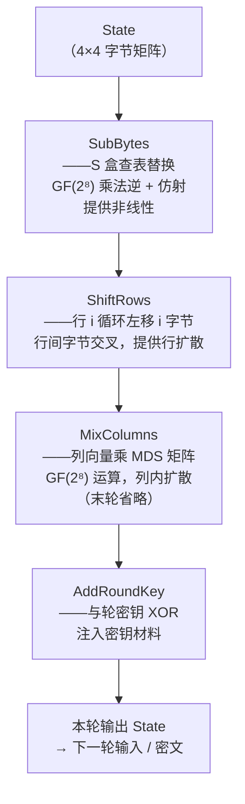

# 密码学（4）· AES详解

> [!abstract] TL;DR
> - **AES（Advanced Encryption Standard）**：2001 年 NIST 标准化（FIPS 197），基于 Joan Daemen 与 Vincent Rijmen 设计的 Rijndael 密码（AES 是 Rijndael 在特定参数下的子集）。
> - **参数**：分组固定 **128 位**（4×4 字节状态矩阵）；密钥 128/192/256 位，分别对应 **10/12/14 轮**。
> - **四步轮变换**：SubBytes（GF(2⁸) 乘法逆 + 仿射变换，提供非线性）→ ShiftRows（行循环移位，扩散）→ MixColumns（GF(2⁸) 列混合，列内扩散）→ AddRoundKey（与轮密钥异或）。末轮省略 MixColumns。
> - **密钥扩展**：原始密钥通过 RotWord/SubWord/Rcon 展开为 (Nr+1)×4 个 32 位字的轮密钥表。
> - **安全状态**：无已知实用攻击（最佳已知攻击仅对 6–8 轮 AES 有效），配合安全工作模式（AEAD/GCM）是当前对称加密首选。
> - **AES-NI**：x86 硬件指令集（`aesenc`/`aesdec` 等），单指令完成一轮变换，常数时间执行彻底消除 S 盒 cache 时序侧信道。

本篇承接 [[03.DES与3DES]] 的 Feistel 结构，深入讲解 AES 的替换-置换网络（SPN）设计、GF(2⁸) 数学基础、四步变换的完整原理，以及 AES-NI 硬件加速的安全意义。工作模式（ECB/CBC/GCM 等）见 [[10.分组密码工作模式总论]]，AEAD 原理见 [[15.AEAD原理与GCM]]，后继算法见 [[05.Blowfish]]。

---

## 概述与定位

### 为何需要 AES

[[03.DES与3DES]] 的 56 位 DES 密钥在 1998 年即被硬件暴力破解；3DES 虽将有效密钥延伸至 112 位，但其 64 位分组在 Sweet32 生日攻击（2016）下同样岌岌可危，性能亦是软件实现中的短板（约 1/3 至 1/5 的 AES 吞吐量）。

1997 年，NIST 发起 AES 竞赛，征集下一代分组密码。经过五年评选，Rijndael 以**安全性、性能、灵活性**综合最优胜出，于 2001 年标准化为 FIPS 197。

> [!note] Rijndael 与 AES 的关系
> Rijndael 原始设计支持 128/160/192/224/256 位的分组大小与密钥大小任意组合。AES 标准仅采用其中**分组固定 128 位、密钥 128/192/256 位**三个参数集，是 Rijndael 的子集。在工程实现中，"AES" 与 "Rijndael（128 位分组）" 等价。

### 参数速查表

| 参数 | AES-128 | AES-192 | AES-256 |
|---|---|---|---|
| 分组大小 | 128 位 | 128 位 | 128 位 |
| 密钥长度 | 128 位（16 字节） | 192 位（24 字节） | 256 位（32 字节） |
| 轮数 Nr | **10** | **12** | **14** |
| 轮密钥总数 | 11（Nr+1） | 13 | 15 |
| 状态矩阵 | 4×4 字节 | 4×4 字节 | 4×4 字节 |

AES 相比 DES 的设计变化：从 Feistel 网络（加解密共用电路、轮函数可不可逆）转为**替换-置换网络（SPN）**，加密每一步都是可逆变换，解密是对应的逆变换；代价是加解密电路不同，但配合 AES-NI 后影响可忽略。

---

## GF(2⁸) 数学基础

AES 中的 SubBytes 和 MixColumns 都在 **GF(2⁸)（二进制有限域，又称 F₂⁸）** 上进行运算。理解这个域是读懂两步变换的前提。

### 什么是 GF(2⁸)

GF(2⁸) 是由 256 个元素组成的有限域，每个元素对应一个 8 位字节（0x00–0xFF），可表示为 GF(2) 上次数 ≤ 7 的多项式：

```
字节 b7 b6 b5 b4 b3 b2 b1 b0
对应  b7·x⁷ + b6·x⁶ + ... + b1·x + b0
```

例如，`0x57 = 0101 0111` 对应多项式 `x⁶ + x⁴ + x² + x + 1`。

### 加法：异或

GF(2⁸) 中加法即**按位异或（XOR）**，无进位，没有额外计算。

```
0x57 XOR 0x83 = 0101 0111
                 1000 0011
               = 1101 0100 = 0xD4
```

### 乘法：模既约多项式

GF(2⁸) 的乘法是两多项式相乘后**模一个次数为 8 的既约多项式**。AES 选用：

```
m(x) = x⁸ + x⁴ + x³ + x + 1
     = 0x11B（十六进制，第 9 位是隐含的 x⁸ 项）
```

之所以需要模运算：两个 8 位多项式相乘可能得到 15 次多项式，必须模 m(x) 才能压回 8 位。`m(x)` 是 GF(2⁸) 上的既约多项式（在 GF(2) 上不可因式分解），选它是为了保证结果形成完整的域。

### xtime：乘以 x（乘 2）

最基础的乘法是乘以 `x`（即 `0x02`），称为 **xtime**：

```
xtime(b) = 
  若 b7 == 0：b << 1（左移 1 位）
  若 b7 == 1：(b << 1) XOR 0x1B
```

原理：`b · x` 若最高位为 1，则结果超出 8 位，需减去 m(x)。由于 m(x) 模 2 系数中次数 ≤ 7 的部分是 `x⁴+x³+x+1 = 0x1B`（x⁸ 项已被左移"溢出"消掉），故 XOR 0x1B 完成 mod m(x)。

```
示例：xtime(0x57)
0x57 = 0101 0111，b7=0 → 左移：1010 1110 = 0xAE
xtime(0xAE)
0xAE = 1010 1110，b7=1 → 1010 1110<<1 = 0101 1100，XOR 0x1B = 0100 0111 = 0x47
```

通过反复 xtime 和 XOR，可计算任意两个字节在 GF(2⁸) 上的乘积（类似"俄罗斯农夫乘法"在域上的推广）。

> [!note] 乘法逆元
> 在 GF(2⁸) 中，除 0x00 外每个元素都有乘法逆元（`a · a⁻¹ = 0x01`）。可用扩展欧几里得算法或查预计算表（S 盒正是这样一张表）求得。

---

## 状态矩阵：数据组织方式

AES 将 128 位（16 字节）明文排列为 **4×4 字节的状态矩阵（State）**，**按列**填入：

```
字节序：a0 a1 a2 ... a15

状态矩阵（列优先）：
       列0  列1  列2  列3
行0 [  a0   a4   a8   a12 ]
行1 [  a1   a5   a9   a13 ]
行2 [  a2   a6   a10  a14 ]
行3 [  a3   a7   a11  a15 ]
```

AES 的所有变换都作用于这个 4×4 矩阵上。加密结束后，状态矩阵再按列优先顺序读出得到 128 位密文。

---

## 轮结构：整体框架

AES 的加密流程由一次初始 AddRoundKey、Nr-1 次完整轮、以及一次末轮（省略 MixColumns）组成：

```
AES 加密（Nr 轮）

  输入：明文块（16 字节）→ 初始化为状态矩阵 State

  ① 初始 AddRoundKey（轮密钥 0）
     State = State XOR RoundKey[0]

  ② 完整轮（第 1 轮 到 Nr-1 轮）：
     for round = 1 to Nr-1:
         SubBytes(State)
         ShiftRows(State)
         MixColumns(State)
         AddRoundKey(State, RoundKey[round])

  ③ 末轮（第 Nr 轮）：
         SubBytes(State)
         ShiftRows(State)
         ——省略 MixColumns——
         AddRoundKey(State, RoundKey[Nr])

  输出：State 按列读出得到 128 位密文
```

> [!note] 末轮为何省略 MixColumns
> MixColumns 是线性变换，若放在最后一轮，加解密双方都需要额外求其逆；省略后，解密末轮对应 InvShiftRows + InvSubBytes + AddRoundKey，结构对称。此外 Rijndael 设计者证明省略 MixColumns 不降低安全性（扩散已经由前 Nr-1 轮的 MixColumns 完成）。

### Mermaid：一次完整轮的四步变换



---

## 四步变换详解

### ① SubBytes：字节替换（非线性层）

SubBytes 对状态矩阵的每个字节独立查 **S 盒（Substitution Box）**，输出替换后的字节。S 盒是 AES 唯一的非线性来源，决定算法抗差分/线性密码分析的能力。

#### S 盒的数学构造

S 盒的构造分两步，均在 GF(2⁸) 上进行：

**Step 1：求乘法逆元**

```
s = a⁻¹  （a 为输入字节；特别约定 0x00 的逆为 0x00）
```

**Step 2：仿射变换（GF(2) 上的 8×8 矩阵乘法 + 常数加法）**

将字节 s 视为 GF(2) 上的 8 位向量，乘以固定矩阵 M 后与常数 c 异或：

```
        ┌ 1 0 0 0 1 1 1 1 ┐       ┌ 1 ┐
        │ 1 1 0 0 0 1 1 1 │       │ 1 │
        │ 1 1 1 0 0 0 1 1 │       │ 0 │
M =     │ 1 1 1 1 0 0 0 1 │  c =  │ 0 │
        │ 1 1 1 1 1 0 0 0 │       │ 0 │
        │ 0 1 1 1 1 1 0 0 │       │ 1 │
        │ 0 0 1 1 1 1 1 0 │       │ 1 │
        └ 0 0 0 1 1 1 1 1 ┘       └ 0 ┘

结果字节 b = M · s + c  （所有运算在 GF(2) 上，即 XOR）
```

仿射变换加入了代数"噪声"，使 S 盒的代数表达式在 GF(2⁸) 上尽可能复杂，抵抗代数攻击（XSL 攻击等）。

> [!info] S 盒两步设计的安全目的
> - **乘法逆**：使 S 盒具有极小差分均匀性（最大差分特征概率 2⁻⁶）和极小线性偏置（最大线性逼近偏差 2⁻³），是抗差分/线性密码分析的核心。
> - **仿射变换**：消除乘法逆带来的不动点（`a⁻¹ = a`）和 XOR 对称性，进一步增加代数复杂度，防止 S 盒有过于简单的代数描述。

#### S 盒（完整 16×16 查找表，行=高 4 位，列=低 4 位）

```
      0x_0 0x_1 0x_2 0x_3 0x_4 0x_5 0x_6 0x_7 0x_8 0x_9 0x_A 0x_B 0x_C 0x_D 0x_E 0x_F
0x0_  63   7C   77   7B   F2   6B   6F   C5   30   01   67   2B   FE   D7   AB   76
0x1_  CA   82   C9   7D   FA   59   47   F0   AD   D4   A2   AF   9C   A4   72   C0
0x2_  B7   FD   93   26   36   3F   F7   CC   34   A5   E5   F1   71   D8   31   15
0x3_  04   C7   23   C3   18   96   05   9A   07   12   80   E2   EB   27   B2   75
0x4_  09   83   2C   1A   1B   6E   5A   A0   52   3B   D6   B3   29   E3   2F   84
0x5_  53   D1   00   ED   20   FC   B1   5B   6A   CB   BE   39   4A   4C   58   CF
0x6_  D0   EF   AA   FB   43   4D   33   85   45   F9   02   7F   50   3C   9F   A8
0x7_  51   A3   40   8F   92   9D   38   F5   BC   B6   DA   21   10   FF   F3   D2
0x8_  CD   0C   13   EC   5F   97   44   17   C4   A7   7E   3D   64   5D   19   73
0x9_  60   81   4F   DC   22   2A   90   88   46   EE   B8   14   DE   5E   0B   DB
0xA_  E0   32   3A   0A   49   06   24   5C   C2   D3   AC   62   91   95   E4   79
0xB_  E7   C8   37   6D   8D   D5   4E   A9   6C   56   F4   EA   65   7A   AE   08
0xC_  BA   78   25   2E   1C   A6   B4   C6   E8   DD   74   1F   4B   BD   8B   8A
0xD_  70   3E   B5   66   48   03   F6   0E   61   35   57   B9   86   C1   1D   9E
0xE_  E1   F8   98   11   69   D9   8E   94   9B   1E   87   E9   CE   55   28   DF
0xF_  8C   A1   89   0D   BF   E6   42   68   41   99   2D   0F   B0   54   BB   16
```

（查法示例：字节 `0x53` → 行 5（0x5_），列 3（0x_3）→ S 盒值 = `0xED`）

#### 逆 S 盒（InvSubBytes）

解密时使用逆 S 盒（先逆仿射变换，再取乘法逆），同样预计算为 16×16 表，此处不列全表，原理与正向 S 盒对称。

---

### ② ShiftRows：行移位（行间扩散）

ShiftRows 对状态矩阵的每一行做**循环左移**，移位量等于行号：

```
行 0：左移 0 字节（不动）
行 1：左移 1 字节
行 2：左移 2 字节
行 3：左移 3 字节
```

直观效果（s[row][col] 表示状态矩阵元素）：

```
变换前：
行0 [ s00  s01  s02  s03 ]      变换后：
行1 [ s10  s11  s12  s13 ]  →  行0 [ s00  s01  s02  s03 ]
行2 [ s20  s21  s22  s23 ]      行1 [ s11  s12  s13  s10 ]
行3 [ s30  s31  s32  s33 ]      行2 [ s22  s23  s20  s21 ]
                                 行3 [ s33  s30  s31  s32 ]
```

ShiftRows 的作用：每列输出字节现在来自**原矩阵的不同行**（即不同的原始列），保证后续 MixColumns 列操作能跨列扩散信息。单独的 MixColumns 只混合列内字节；ShiftRows 将不同列的字节"交叉到同一列"，两者合力提供行列双向扩散。

**解密逆变换 InvShiftRows**：每行循环右移对应字节数。

---

### ③ MixColumns：列混合（列内扩散）

MixColumns 对状态矩阵的每一列独立进行处理，将一列 4 字节视为 GF(2⁸) 上的向量，乘以固定的 **4×4 MDS 矩阵**：

```
        ┌ 2  3  1  1 ┐
        │ 1  2  3  1 │
M_MC =  │ 1  1  2  3 │
        └ 3  1  1  2 ┘
```

这里的数字是 GF(2⁸) 中的元素（`2 = 0x02`，`3 = 0x03`，`1 = 0x01`），矩阵乘法在 GF(2⁸) 上进行（乘法用 xtime，加法用 XOR）。

#### 单列计算示例

设一列为 `[a0, a1, a2, a3]`（GF(2⁸) 元素），输出 `[b0, b1, b2, b3]`：

```
b0 = (2·a0) XOR (3·a1) XOR (1·a2) XOR (1·a3)
b1 = (1·a0) XOR (2·a1) XOR (3·a2) XOR (1·a3)
b2 = (1·a0) XOR (1·a1) XOR (2·a2) XOR (3·a3)
b3 = (3·a0) XOR (1·a1) XOR (1·a2) XOR (2·a3)
```

其中：
- `1·x = x`（恒等）
- `2·x = xtime(x)`（如前述，左移 + 条件 XOR 0x1B）
- `3·x = xtime(x) XOR x`（先乘 2，再 XOR 原值）

> [!note] 为何选 MDS 矩阵
> 所用 4×4 矩阵是一个 **MDS（Maximum Distance Separable）矩阵**：其所有方形子矩阵均可逆，保证任意非零输入列在输出中至少有 5 个字节不同于全零情况（分支数 = 5 = 4+1）。这意味着 MixColumns 单步可最大化地"扩展"差分，配合 ShiftRows，使得两轮后任意单字节差异至少影响 25 个状态字节（宽轨迹策略，Wide-Trail Strategy），是 AES 抵抗差分/线性攻击的数学保证。

**末轮省略 MixColumns**：若末轮含 MixColumns，会使解密复杂化，且由于末轮已 AddRoundKey，再接 MixColumns 等效于 AddRoundKey 后再乘矩阵，安全性等价于不含的版本，故省略（Daemen-Rijmen 原文有严格证明）。

**解密逆变换 InvMixColumns**：乘以逆矩阵（`{0x0E, 0x0B, 0x0D, 0x09}` 系列），计算方式相同。

---

### ④ AddRoundKey：轮密钥加

最简单的一步：将状态矩阵与当前轮的轮密钥（同为 4×4 字节矩阵）**逐位 XOR**：

```
State[row][col] = State[row][col] XOR RoundKey[round][row][col]
```

AddRoundKey 是 AES 中**唯一注入密钥材料**的步骤。由于 XOR 是对合运算（加等于减），解密时 InvAddRoundKey = AddRoundKey（用同一轮密钥再 XOR 一次即还原）。

异或操作本身是线性的，其安全性完全依赖于其他三步提供的非线性（SubBytes）和扩散（ShiftRows + MixColumns），以及密钥调度输出的轮密钥足够"随机"。

---

## 密钥扩展（Key Schedule）

AES 需要 Nr+1 个 128 位轮密钥（AES-128 共 11 个，AES-256 共 15 个）。密钥扩展算法从原始密钥出发，生成总计 `4×(Nr+1)` 个 32 位字（Word），记为 `W[0..4*(Nr+1)-1]`。

### 基本流程（以 AES-128 为例）

密钥长度 Nk = 4（个 32 位字 = 128 位）：

```
密钥扩展伪代码（AES-128，Nk=4，Nr=10）

输入：原始密钥 Key[0..15]（16 字节）
输出：扩展密钥 W[0..43]（44 个 32 位字）

// 1. 将原始密钥直接填入前 Nk 个字
for i = 0 to Nk-1:
    W[i] = Word(Key[4i], Key[4i+1], Key[4i+2], Key[4i+3])

// 2. 扩展剩余字
for i = Nk to 4*(Nr+1)-1:
    temp = W[i-1]
    if i mod Nk == 0:
        temp = SubWord(RotWord(temp)) XOR Rcon[i/Nk]
    // （AES-256 还有 elif i mod Nk == 4: temp = SubWord(temp)）
    W[i] = W[i-Nk] XOR temp
```

### 三个关键操作

**RotWord（字循环移位）**：将 32 位字的 4 字节循环左移 1 字节：

```
RotWord([a0, a1, a2, a3]) = [a1, a2, a3, a0]
```

**SubWord（字节替换）**：对 32 位字的每个字节独立查 S 盒（与 SubBytes 使用同一张表）：

```
SubWord([a0, a1, a2, a3]) = [S(a0), S(a1), S(a2), S(a3)]
```

**Rcon（轮常数）**：第 i 次使用的轮常数是 `[x^(i-1), 0x00, 0x00, 0x00]`，其中 `x^(i-1)` 是 GF(2⁸) 中的幂次（`x^0=0x01, x^1=0x02, x^2=0x04, ...`）：

```
Rcon[1]  = [0x01, 0x00, 0x00, 0x00]
Rcon[2]  = [0x02, 0x00, 0x00, 0x00]
Rcon[3]  = [0x04, 0x00, 0x00, 0x00]
Rcon[4]  = [0x08, 0x00, 0x00, 0x00]
Rcon[5]  = [0x10, 0x00, 0x00, 0x00]
Rcon[6]  = [0x20, 0x00, 0x00, 0x00]
Rcon[7]  = [0x40, 0x00, 0x00, 0x00]
Rcon[8]  = [0x80, 0x00, 0x00, 0x00]
Rcon[9]  = [0x1B, 0x00, 0x00, 0x00]   ← xtime(0x80) XOR 0x1B
Rcon[10] = [0x36, 0x00, 0x00, 0x00]
```

Rcon 的作用：防止相同的密钥字节在不同轮产生相同的扩展字，破坏潜在的对称性，阻止"轮密钥相同"类型的滑动攻击。

### AES-192 / AES-256 密钥扩展差异

| 版本 | Nk | 轮密钥 RotWord/SubWord 频率 |
|---|---|---|
| AES-128 | 4 | 每 4 个字一次 |
| AES-192 | 6 | 每 6 个字一次 |
| AES-256 | 8 | 每 8 个字一次；此外当 `i ≡ 4 (mod 8)` 时额外做一次 SubWord（不含 RotWord/Rcon） |

AES-256 的密钥扩展中间多一次 SubWord（不含 RotWord/Rcon），是为了在较少的 Rcon 注入频率下仍保持扩展密钥的非线性。

---

## 解密：逆变换

AES 解密是加密的逆序，但由于使用 SPN 而非 Feistel，每步都需要对应逆变换：

```
AES 解密（等价结构）

  ① 初始 AddRoundKey（轮密钥 Nr，与加密末轮相对）

  ② 末轮逆变换（对应加密第 1 轮的逆）：
     InvShiftRows(State)
     InvSubBytes(State)
     AddRoundKey(State, RoundKey[Nr-1])

  ③ 完整逆轮（第 Nr-1 轮 到 1 轮的逆）：
     for round = Nr-1 downto 1:
         InvShiftRows(State)
         InvSubBytes(State)
         AddRoundKey(State, RoundKey[round-1])
         InvMixColumns(State)

  注：也可用"等价解密"将 InvShiftRows/InvSubBytes 与 InvMixColumns 重排，
      使结构更对称（Daemen-Rijmen 原论文给出了两种等价实现）。
```

> [!note] 解密与加密的顺序差异
> 注意 InvShiftRows 在 InvSubBytes 之前（因为两者操作的维度不同，顺序可以互换）；而 InvMixColumns 在 AddRoundKey 之后（因为 MixColumns 是线性的，可以把轮密钥"推过" MixColumns，即对轮密钥先做 InvMixColumns 处理，从而得到另一种等效解密排列）。

---

## AES-NI：硬件加速与安全意义

### 什么是 AES-NI

AES-NI（AES New Instructions）是 Intel 于 2010 年（Westmere 架构）引入的 x86 指令集扩展，AMD 同期跟进。提供以下核心指令：

| 指令 | 功能 |
|---|---|
| `AESENC xmm1, xmm2` | 执行一轮 AES 加密（SubBytes + ShiftRows + MixColumns + AddRoundKey） |
| `AESENCLAST xmm1, xmm2` | 执行末轮 AES 加密（SubBytes + ShiftRows + AddRoundKey，无 MixColumns） |
| `AESDEC xmm1, xmm2` | 执行一轮 AES 解密（InvShiftRows + InvSubBytes + InvMixColumns + AddRoundKey） |
| `AESDECLAST xmm1, xmm2` | 执行末轮 AES 解密 |
| `AESKEYGENASSIST xmm1, xmm2, imm8` | 辅助密钥扩展（SubWord + RotWord + Rcon） |
| `AESIMC xmm1, xmm2` | InvMixColumns（用于预处理解密轮密钥） |

### 性能提升

以 AES-128 为例，AES-NI 将 10 轮变换压缩为 10 条 `AESENC`/`AESENCLAST` 指令，延迟约 3–4 时钟周期/轮，吞吐量（流水线）可达约 1 指令/周期。现代 Haswell 及之后架构上，AES-GCM 的吞吐量可超过 **10 GB/s**（单核，CTR 模式并行多块时更高），比纯软件实现快 4–10 倍。

### 消除 cache 时序侧信道

纯软件 AES 实现通常用预计算表（T-table，将 SubBytes + ShiftRows + MixColumns 合并为 4 张 256 项查找表）加速，但这引入了**cache 时序侧信道**：不同输入字节访问不同 cache 行，攻击者通过精确测量（Flush+Reload、Prime+Probe）可以逐字节恢复密钥（AES cache-timing 攻击，Bernstein 2005）。

AES-NI 在 CPU 硬件中实现所有变换，**S 盒查表在专用电路中完成**，与 cache 状态无关，访问时间恒定——这消除了最主要的时序侧信道面。对于安全敏感场景（如服务器同时处理多用户 TLS），强烈建议使用 AES-NI 而非 T-table 实现。

```
# 检查 CPU 是否支持 AES-NI（Linux）
grep -m1 aes /proc/cpuinfo

# OpenSSL 测试 AES-NI 是否启用
openssl speed -evp aes-128-gcm
```

> [!warning] 示例输出为示意
> 上述命令输出因 CPU 型号和 OS 版本而异，实际结果需在目标环境执行。

---

## 安全性分析与正确使用

### AES 自身的安全性

| 攻击类型 | 状态 |
|---|---|
| 暴力枚举（AES-128） | 密钥空间 2¹²⁸，当前不可行（比宇宙原子数还大） |
| 差分密码分析 | AES 的 MDS 矩阵 + S 盒设计专门对抗；无实用攻击 |
| 线性密码分析 | 同上；无实用攻击 |
| 代数攻击（XSL） | 理论复杂度过高；S 盒仿射变换破坏简单代数结构 |
| 相关密钥攻击 | 对 AES-192/256 有理论上的相关密钥区分攻击（Biryukov-Khovratovich 2009），安全轮数有限；但在正确使用协议（密钥独立随机生成）下不适用 |
| 折叠攻击（meet-in-middle） | 对 AES 不适用（非 Feistel 结构） |
| 最佳已知攻击 | 仅对 6–8 轮 AES（缩轮版本）有效，计算复杂度仍极高 |

AES 自身安全性无争议；实际系统中的 AES 漏洞几乎全来自**工作模式误用**、**密钥管理缺陷**或**侧信道攻击**，而非 AES 算法本身。

### 正确使用：工作模式

> [!warning] 绝不单独使用 ECB 或裸 CBC
> AES 是分组密码，单独加密一个 128 位块并没有错，但绝大多数实际数据超过 16 字节，必须通过工作模式处理多块数据。ECB 模式保留块间模式（"ECB 企鹅"），CBC 仅在选择明文攻击下保持语义安全，且不提供完整性保护。

**推荐选择**：

| 场景 | 推荐模式 | 关键要求 |
|---|---|---|
| 一般加密+认证 | **AES-GCM**（AEAD） | Nonce 绝不重用；见 [[15.AEAD原理与GCM]] |
| 随机访问存储加密 | AES-XTS | 磁盘分区加密（如 FileVault/BitLocker） |
| 流式加密（无认证需求） | AES-CTR | Nonce+计数器绝不重用同密钥 |
| TLS 1.3 | TLS_AES_128_GCM_SHA256 等 | 由协议保证 Nonce 安全 |

工作模式的完整讨论见 [[10.分组密码工作模式总论]]；GCM/AEAD 的认证加密原理见 [[15.AEAD原理与GCM]]。

### 密钥长度选择

| 密钥 | 安全位 | 适用场景 |
|---|---|---|
| AES-128 | 128 位（后量子前足够，量子 Grover 后降至 64 位） | 当前绝大多数场景（性能最优） |
| AES-192 | 192 位 | 一般不推荐（无明显优势，实现更复杂） |
| AES-256 | 256 位 | 高度敏感数据、量子计算威胁场景（Grover 后降至 128 位） |

> [!note] 量子计算影响
> Grover 算法对对称密码提供二次方加速，AES-128 在量子对手下等效安全强度降至约 64 位，AES-256 降至约 128 位。对量子威胁有顾虑的场景应优先考虑 AES-256。

### Nonce/IV 管理

- **AES-GCM**：Nonce（96 位，12 字节）**在同一密钥下绝不重复**；重用 Nonce 将直接泄露认证密钥（伪造攻击），以及在选择密文场景下恢复明文差分。
- **AES-CBC**：IV 必须**随机且不可预测**（不能是计数器）；否则在 TLS-BEAST 类攻击中可恢复明文。
- **AES-CTR**：计数器必须不在同密钥下重复；重复等同于用同密钥两次加密，XOR 两段密文即可抵消密钥流。

### 与二进制安全的关系

AES 在现代二进制防护体系中（如 [[34.现代二进制防护机制/00.现代二进制防护机制总览.md]] 中讨论的 ASLR/PIE/Stack Canary 等）不直接交叉，但有两个接触点：

1. **代码签名与加密**：macOS/iOS 等平台的代码签名和加密保护中（`[[34.现代二进制防护机制/11.macOS与iOS防护.md]]`），对称密钥操作大量使用 AES-GCM。
2. **侧信道**：对 AES 的 cache 时序攻击（Flush+Reload 等）与二进制层面的内存访问监控技术高度相关；AES-NI 是在硬件层面阻断这类攻击的首选方案。

---

## 小结

| 特性 | 说明 |
|---|---|
| 结构 | 替换-置换网络（SPN），非 Feistel |
| 分组 | 固定 128 位（4×4 字节状态矩阵） |
| 密钥 | 128/192/256 位 → 10/12/14 轮 |
| 非线性来源 | SubBytes：GF(2⁸) 乘法逆 + 仿射变换 |
| 扩散机制 | ShiftRows（行间字节交叉）+ MixColumns（列内 MDS 混合） |
| 密钥注入 | AddRoundKey（XOR，每轮均发生，含初始轮） |
| 密钥扩展 | RotWord + SubWord + Rcon；共 4(Nr+1) 个 32 位字 |
| 硬件加速 | AES-NI（`aesenc` 等）；性能 >10 GB/s，消除 cache 时序侧信道 |
| 安全现状 | 无实用攻击；安全风险在工作模式误用/密钥管理/侧信道 |
| 推荐使用 | AES-GCM（AEAD）；正确管理 Nonce；优先使用 AES-NI |

AES 从 DES 的 56 位密钥和 64 位分组起步，通过严格的数学设计——GF(2⁸) 的非线性替换、MDS 矩阵的最大扩散、仿射变换对代数攻击的防御——达到了在高吞吐量下提供 128 位安全强度的工程目标，成为 20 余年后仍无实用威胁的工业标准。理解 AES 不仅是学习一个算法，更是掌握"混淆与扩散"在现代数学框架下的完整实现。

---

## 相关阅读

- [[03.DES与3DES]] — AES 的前身，Feistel 结构与 S 盒设计哲学的对比
- [[05.Blowfish]] — 同时代另一经典分组密码，Feistel 结构与密钥相关 S 盒
- [[10.分组密码工作模式总论]] — ECB/CBC/CTR/GCM 等模式，AES 必须配合使用
- [[15.AEAD原理与GCM]] — GCM 模式的认证加密原理，AES 最重要的使用场景
- [[34.现代二进制防护机制/00.现代二进制防护机制总览.md]] — 二进制安全防护体系，与 AES-NI 侧信道防护的交叉点

---

⬅️ 上一篇 [[03.DES与3DES]] ｜ 🏠 [[00.密码学总览]] ｜ 下一篇 [[05.Blowfish]] ➡️
