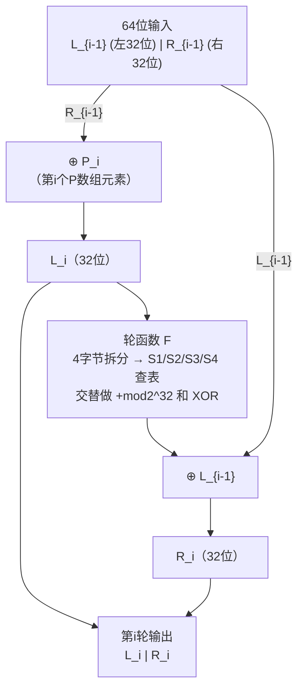

# 密码学（5）· Blowfish

> [!abstract] TL;DR
> - **Blowfish**：Bruce Schneier 1993 年设计的分组密码；**64 位分组**、可变密钥长度（32–448 位）、16 轮 Feistel 结构。
> - **子密钥体系**：18 个 32 位 P 数组 + 4 个 256×32 位 S 盒，全部用 **π 的小数部分**初始化，再用密钥和明文 0 反复加密生成——密钥调度代价极高，正是 **[[40.bcrypt]]** 的理论之源。
> - **轮函数 F**：4 次 S 盒查表 + 3 次模 2^32 加法/异或，纯查表运算，软件上极快。
> - **安全状态**：算法本身无已知实际破解；然而 **64 位分组在大数据量下有 Sweet32 生日攻击风险**，作者本人建议新系统改用 [[06.Twofish]] 或 [[04.AES详解]]。小数据/嵌入式/遗留兼容场景仍可使用。

本篇属于 [[02.对称加密总论]] 所介绍的 Feistel 型分组密码体系，重点讲解 Blowfish 的完整轮结构、独特的密钥调度哲学，以及为何密钥调度慢这一设计被 [[40.bcrypt]] 借用为密码哈希的加固手段。后继设计见 [[06.Twofish]]，AES 的 SPN 对比见 [[04.AES详解]]。

---

## 概述与定位

Blowfish 由 Bruce Schneier 于 1993 年发表于《Dr. Dobb's Journal》，设计目标是"快速、紧凑、简单、安全，并且可变密钥长度"，同时**不申请专利，公开免费使用**。

| 参数 | 值 |
|---|---|
| 发布时间 | 1993 年（Schneier） |
| 分组大小 | **64 位**（8 字节） |
| 密钥长度 | **32–448 位**（可变，步长 8 位） |
| 轮数 | **16 轮** Feistel |
| 子密钥 | 18 × 32 位 P 数组（P1…P18） |
| S 盒 | 4 个，各 256 项 × 32 位（共 4 KB） |
| 密钥调度速度 | 约需 521 次 Blowfish 加密，**慢** |
| 单次加密速度 | 纯查表，软件上**极快**（比 DES 快） |
| 授权 | 无专利，公开领域 |
| 标准化 | 未被 NIST 标准化，但广泛实现 |
| 安全状态 | 算法本身无实际破解；**64 位分组有 Sweet32 风险** |

Blowfish 填补了 1990 年代初的一个空白：DES 密钥太短（56 位），IDEA 有专利限制，RC4 是流密码——Blowfish 提供了一个可变密钥、无专利、高速的 Feistel 分组密码，并在 OpenSSH、OpenBSD、众多 VPN 和密码管理器中得到大量部署。

> [!info] 与 [[04.AES详解]] 的定位对比
> AES 是 2001 年 NIST 竞赛冠军，128 位分组，SPN 结构，经过严格评审；Blowfish 是同时代（1993）无专利自由实现，64 位分组，Feistel 结构。两者都无已知实际攻击，但 AES 的 128 位分组从根本上消除了 Sweet32 生日威胁，是新系统的首选。

---

## 原理与机制

### Feistel 结构回顾

Blowfish 沿用与 DES 相同的 **Feistel 网络**框架（原理详见 [[03.DES与3DES]] 及 [[02.对称加密总论]]）：

```
第 i 轮（i = 1..16）：
  L_i = R_{i-1} XOR P_i
  R_i = F(L_i) XOR L_{i-1}

加密尾部（第 16 轮后）：
  R_16 = R_16 XOR P_17
  L_16 = L_16 XOR P_18
  密文 = R_16 ‖ L_16      （注意左右互换后输出）
```

Feistel 结构保证：**即使轮函数 F 不可逆，整体加解密仍对称可逆**——解密只需将 P1…P18 倒序即可，无需另设逆函数。这一特性在硬件/嵌入式上尤其珍贵。

### 轮函数 F

轮函数 F 是 Blowfish 的核心——全部由 S 盒查表 + 整数运算构成，**没有任何比特置换**，使其对 32 位处理器极友好：

```
F(x)：
  x 为 32 位输入，拆分为 4 字节 a || b || c || d（高位到低位）

  F(x) = ((S1[a] + S2[b]) mod 2^32) XOR S3[c]
  F(x) =  (F(x) + S4[d]) mod 2^32

化简为一行：
  F(x) = ((S1[a] + S2[b]) XOR S3[c] + S4[d])  （mod 2^32 加，XOR 异或）
```

四个 S 盒各 256 项，每项 32 位，查表后分别做**加法**和**异或**交替混合：

```
步骤      操作            输出位宽
──────────────────────────────
S1[a]    查表（第0字节）   32位
+ S2[b]  模2^32 加         32位
XOR S3[c] 异或（第2字节）  32位
+ S4[d]  模2^32 加         32位
```

> [!note] 为何加法与异或交替？
> 加法（mod 2^32）与异或（XOR）对应两种不同代数结构（整数环 vs GF(2)^32），它们的混合让差分/线性密码分析更难建立统一的代数模型——这一技巧称为**混合运算（Mixed Operations）**，后来也被 ARX（Add-Rotate-XOR）家族密码（如 ChaCha20）采用。

### Blowfish 单轮 Feistel 结构图



> [!tip] 图解说明
> 上图是**一轮**的数据流。16 轮完成后，再分别用 P17、P18 与右半和左半做最终异或，然后左右对调输出密文——这两步称为"output whitening"，防止最后一轮被直接分析。

---

## 算法流程 / 结构详解

### 一、子密钥体系

Blowfish 的子密钥由两部分组成：

#### P 数组（P-array）

18 个 32 位元素 P1, P2, …, P18：

- P1…P16：第 1 轮至第 16 轮的**轮密钥**，在每轮中与左半块异或
- P17、P18：最后的**输出白化密钥**（output whitening），在 16 轮结束后分别与右半块、左半块异或

#### S 盒（Substitution-boxes）

4 个独立 S 盒，每个 S 盒含 256 个 32 位条目，共 4 × 256 × 4 = **4096 字节（4 KB）**：

```
S1[0..255]   32位 × 256
S2[0..255]   32位 × 256
S3[0..255]   32位 × 256
S4[0..255]   32位 × 256
```

总子密钥材料：(18 + 4×256) × 32 位 = **4168 个 32 位字 ≈ 4.1 KB**

### 二、密钥调度（Key Schedule）

密钥调度是 Blowfish 最具特色、也最重要的设计：它不是简单地从密钥推导子密钥，而是**用密钥和 Blowfish 本身反复加密一个已知值来生成所有子密钥**。

#### 步骤 1：用 π 初始化

用**π（圆周率）的小数部分**按十六进制填充 P 数组和 S 盒：

```
P1  = 0x243F6A88    ← π 的十六进制小数第1~32位
P2  = 0x85A308D3    ← 第33~64位
...
S1[0] = ...         ← 继续填充
S1[1] = ...
...（共 4168 个 32 位字）
```

用无理数的数字作为"无后门初值"——这种方法称为 **Nothing-up-my-sleeve numbers（不藏猫腻的数字）**，让任何人都能独立验证初值没有被特殊选择（类似地，SHA-1/SHA-2 也用素数的平方根/立方根小数作为常量）。

#### 步骤 2：P 数组与密钥异或

将密钥字节（32–448 位，即 4–56 字节）循环重复，按 32 位对齐后与 P1…P18 逐元素异或：

```
设密钥 K 长度 keyLen 字节（4–56），自动循环
K32[i] = 32位密钥块（按字节循环对齐）

for i = 1 to 18:
    P_i = P_i XOR K32[(i-1) mod ceil(keyLen/4)]
```

#### 步骤 3：反复加密 0 更新子密钥

这是密钥调度的核心——也是**慢**的来源：

```
设 X = 0x00000000_00000000   （64位全零）

for i = 1, 3, 5, ..., 17:        // 9次，更新 P1..P18
    X = Blowfish_Encrypt(X)
    P_i   = X 的高32位
    P_{i+1} = X 的低32位

for s = 1 to 4:                   // 4个S盒
    for j = 0, 2, 4, ..., 254:   // 128次，更新 S_s[0..255]
        X = Blowfish_Encrypt(X)
        S_s[j]   = X 的高32位
        S_s[j+1] = X 的低32位
```

共需调用 Blowfish_Encrypt：
- 更新 P 数组：9 次
- 更新 4 个 S 盒：4 × 128 = 512 次
- **合计：521 次 Blowfish 加密**

每次加密都使用当前已部分更新的 P/S 状态，因此整个过程是**顺序依赖、不可并行的**，密钥初始化天然耗时。

> [!warning] 密钥调度的时间代价
> 521 次加密对现代 CPU 约需数百微秒到数毫秒（视主频与密钥长度），相比 AES 的密钥扩展（几微秒）慢了 2~3 个数量级。
> 这在通信场景是开销，但在**密码哈希**场景是资产——参见下节。

### 三、Bcrypt 的由来

[[40.bcrypt]]（Provos & Mazières，1999）直接基于 Blowfish 的密钥调度思想，构建了一个**代价可调节的密码哈希函数**：

```
bcrypt 核心：
  1. 以密码（password）和盐（salt）初始化 Blowfish 子密钥
  2. 用代价因子 cost 控制密钥调度重复次数：2^cost 次循环（cost=10 ≈ 1024 次）
  3. 加密一个固定明文 "OrpheanBeholderScryDoubt" 64 轮
  4. 输出为密码哈希
```

Blowfish 密钥调度慢的"缺点"，在 bcrypt 中被刻意放大并参数化，成为抵抗 GPU 暴力破解的核心机制。换言之，**bcrypt 是把 Blowfish 密钥调度当作工作因子（work factor）来用，而非用 Blowfish 加密数据**。详见 [[40.bcrypt]]。

---

## 代码与示例

### Python 示例（使用 pycryptodome）

```python
from Crypto.Cipher import Blowfish
from Crypto.Util.Padding import pad, unpad
import os

key = os.urandom(16)          # 128位密钥（示例，可用32–448位）
iv  = os.urandom(8)           # Blowfish 分组64位，CBC模式IV也为8字节

cipher_enc = Blowfish.new(key, Blowfish.MODE_CBC, iv)
plaintext  = b"Hello Blowfish!"                   # 示例明文
ciphertext = cipher_enc.encrypt(pad(plaintext, 8)) # 8字节 = 64位对齐

cipher_dec = Blowfish.new(key, Blowfish.MODE_CBC, iv)
recovered  = unpad(cipher_dec.decrypt(ciphertext), 8)
assert recovered == plaintext
```

> [!warning] 示例输出为示意
> 每次运行密钥和 IV 随机生成，密文不固定。

### OpenSSL 命令行（兼容测试用）

```bash
# 加密（CBC 模式，示例密钥/IV 须替换为随机值）
openssl enc -bf-cbc -in plaintext.bin -out cipher.bin \
    -K 000102030405060708090a0b0c0d0e0f \
    -iv 0102030405060708

# 解密
openssl enc -d -bf-cbc -in cipher.bin -out recovered.bin \
    -K 000102030405060708090a0b0c0d0e0f \
    -iv 0102030405060708
```

> [!warning] 示例输出为示意
> 上述密钥/IV 仅为演示，生产环境必须使用密码学安全随机源（`/dev/urandom` 或等价）生成。

---

## 安全性与正确使用

### 已知攻击与分析

| 攻击类型 | 状态 | 说明 |
|---|---|---|
| 穷举/暴力破解 | **无实际威胁**（256位密钥时） | 密钥空间最大 2^448，远超暴力可行范围 |
| 差分密码分析 | **无实际威胁** | Schneier 设计时明确对抗差分分析；4轮以内有理论弱点，16轮无已知实际破解 |
| 线性密码分析 | **无实际威胁** | 同上，16轮结果无已知实用攻击 |
| 弱密钥 | **存在，极少** | 当密钥导致 P 数组产生碰撞时理论存在弱密钥（Vaudenay 1996），但实际概率可忽略（约 2^-14 条件，具体依实现） |
| **Sweet32 生日攻击** | **⚠️ 实际风险** | 64 位分组在同密钥大量数据下有生日碰撞；2016 年 Sweet32 论文证明约 2^32 分组（≈32 GB）后 CBC 模式可被攻击 |

### 64 位分组的根本限制：Sweet32

**Sweet32**（2016，Bhargavan & Leurent）是对所有 64 位分组密码（包括 Blowfish、DES/3DES）CBC 模式的**生日攻击**：

```
生日攻击原理（CBC 模式）：
  分组大小 n 位 → 期望碰撞约在 2^(n/2) 个分组后出现

  Blowfish：n = 64 → 2^32 = 4,294,967,296 个分组
  每块 8 字节 → 约 32 GB 数据后出现碰撞

  碰撞意味着：C_i XOR C_j = P_i XOR P_j
  攻击者可恢复明文块的 XOR 差，配合已知/选择明文即可还原部分明文。
```

> [!danger] 单密钥加密量限制
> 使用 Blowfish 时，**同一个密钥加密的数据不得超过 4 GB（安全裕量下建议 ≤ 2 GB）**，超过后必须重新协商密钥。TLS 1.3 已完全移除 64 位分组密码套件；OpenSSH 默认也已禁用 `blowfish-cbc`。

### 参数选择与推荐做法

**密钥长度**：

```
最低安全要求：128 位（16 字节）
推荐：          128 位（与 AES-128 对等）
无意义上限：    448 位（56 字节）以内均支持，超长密钥不提升安全性
```

**工作模式**：

| 场景 | 推荐模式 | 说明 |
|---|---|---|
| 纯加密 | CTR / OFB | 将块密码转为流密码，避免 CBC padding 问题 |
| 认证加密 | 不推荐 Blowfish | 改用 AES-GCM / ChaCha20-Poly1305 |
| 密码存储 | 用 bcrypt | 这是 Blowfish 密钥调度最正确的现代用法 |

**何时仍可用 Blowfish**：

- 遗留系统兼容（协议已固定无法升级）
- 嵌入式/资源受限场景（RAM < 4 KB 难以放 AES 查找表时）
- 加密数据量可控（单密钥 < 2 GB，且有密钥轮换机制）
- 密码哈希用途——此时应通过 `bcrypt` 而非直接用 Blowfish 加密

**新系统不应选 Blowfish**：

> [!warning] Schneier 本人的建议
> Bruce Schneier（Blowfish 作者）在 2007 年公开声明："**如果你需要一个分组密码，用 AES；如果不能用 AES，用 Twofish**。Blowfish 的 64 位分组在很多现代应用场景下是个设计缺陷，我当初只是在 1993 年做出了合理的设计权衡。"
>
> 新系统应优先选择：
> - **通用对称加密**：[[04.AES详解]]（AES-128-GCM 或 AES-256-GCM）
> - **高速流加密**：ChaCha20-Poly1305
> - **密码哈希**：[[40.bcrypt]]（继承 Blowfish 慢密钥调度之精华）
> - **后续 Feistel 分组密码**：[[06.Twofish]]（128 位分组，Blowfish 的精神继承者）

### Blowfish 与 Twofish 的关系

[[06.Twofish]]（1998，Schneier 等）是 Blowfish 的**正式后继**，同样由 Schneier 主导设计，参加了 AES 竞赛（最终输给 Rijndael）：

| 特性 | Blowfish | Twofish |
|---|---|---|
| 分组大小 | 64 位 | **128 位** |
| 密钥长度 | 32–448 位 | 128/192/256 位 |
| S 盒 | 固定 4 个 × 256×32 | **密钥相关** S 盒 |
| 轮数 | 16 | 16 |
| Sweet32 风险 | 有 | **无** |
| 密钥调度速度 | 慢（521次加密） | 适中 |
| 授权 | 公开领域 | 公开领域 |

Twofish 用**密钥相关 S 盒**（key-dependent S-boxes）替代 Blowfish 的固定 S 盒 + 超慢密钥调度，在保留高速查表设计的同时彻底解决了 64 位分组问题。

---

## 小结

Blowfish 是 1990 年代分组密码设计的典范之作：

1. **64 位分组 + 16 轮 Feistel**：结构与 DES 同源，但密钥长度可变（32–448 位），解决了 DES 密钥太短的根本缺陷。
2. **轮函数 F**：4 次 S 盒查表 + 模加/异或混合，无比特置换，软件实现极快。
3. **密钥调度哲学**：用 π 小数初始化（无后门数字），再用 521 次 Blowfish 自加密生成子密钥——**故意做慢**，为 [[40.bcrypt]] 埋下伏笔。
4. **时代局限**：64 位分组在大数据量下的 Sweet32 生日攻击（2016），使 Blowfish 无法安全用于 HTTPS/VPN 等高吞吐场景；作者建议新系统用 [[04.AES详解]] 或 [[06.Twofish]]。
5. **合法延续**：在密码存储领域，通过 [[40.bcrypt]] 的形式，Blowfish 的慢密钥调度仍是当前主流密码哈希方案之一。

理解 Blowfish 的意义在于：它将 Feistel 结构、可变密钥、无专利设计、超慢密钥调度四者结合，给出了一套完整的"设计权衡"示范，并直接催生了 bcrypt 这一长青密码哈希方案。

---

## 相关阅读

- [[02.对称加密总论]] — Feistel 网络与 SPN 的对比；对称加密总论
- [[03.DES与3DES]] — DES 的完整 Feistel 实现，与 Blowfish 轮函数对比
- [[04.AES详解]] — SPN 结构，128 位分组，当前首选
- [[06.Twofish]] — Blowfish 的 128 位后继，密钥相关 S 盒
- [[40.bcrypt]] — 以 Blowfish 密钥调度为核心的密码哈希函数

---

⬅️ 上一篇 [[04.AES详解]] ｜ 🏠 [[00.密码学总览]] ｜ 下一篇 [[06.Twofish]] ➡️
