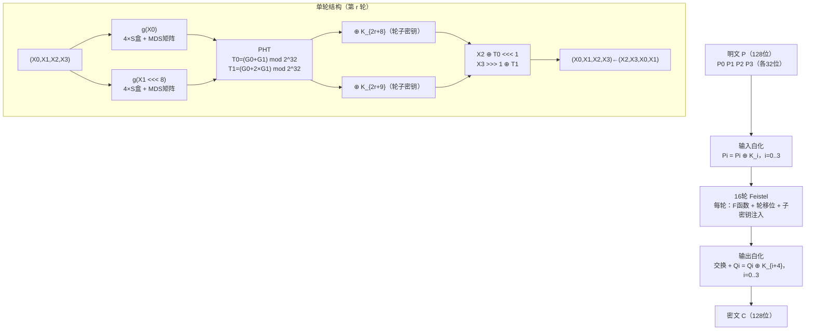

# 密码学（6）· Twofish

> [!abstract] TL;DR
> - **Twofish** 是 Bruce Schneier 团队（Counterpane Internet Security）1998 年设计的分组密码，AES 竞赛**五强决赛入围**之一，最终以一票之差被 Rijndael（即今日的 AES）击败。
> - **参数**：128 位分组、128/192/256 位密钥、**16 轮 Feistel 结构**。
> - **四大独特设计**：① **密钥相关 S 盒**（key-dependent S-boxes）——S 盒参数随密钥变化，杜绝针对固定 S 盒的预计算攻击；② **MDS 矩阵**（Maximum Distance Separable，最大距离可分矩阵）——强扩散，每列改 1 字节必然影响全部 4 字节输出；③ **PHT**（Pseudo-Hadamard Transform，伪哈达玛变换）——在 F 函数内混合两路 32 位数据；④ **输入/输出白化**（whitening）——首尾额外异或子密钥，阻断对第一/最后一轮的滑动攻击。
> - **安全状态**：至今无实际破解，安全裕度（最佳分析只到 7 轮）远高于 AES 标准要求；无专利，完全自由使用。
> - **实践建议**：Twofish 可信但生态窄——OpenPGP 支持（GnuPG `--cipher-algo TWOFISH`）、VeraCrypt 内置；**新项目首选 AES-128-GCM 或 AES-256-GCM**，仅在需要非 AES 备选或多密码混合加密时使用 Twofish。

本篇属于 [[02.对称加密总论]] 所介绍的**分组密码·Feistel 子族**，与 [[05.Blowfish]]（同一作者 Schneier 的前代设计）形成对照，并与 [[04.AES详解]]（竞赛胜者）构成完整的 AES 决赛前后比较视角。密钥管理与工作模式见后续篇章。

---

## 概述与定位

### 历史背景：NIST AES 竞赛

1997 年，美国国家标准与技术研究院（NIST）宣布公开征集 DES 的继任者——Advanced Encryption Standard（AES）。竞赛要求算法满足：128 位分组、支持 128/192/256 三档密钥、安全、高效、免费可用。最终从 15 个候选算法中选出五强进入决赛，Twofish 位列其中。

| 算法 | 设计者 | 决赛结果 |
|---|---|---|
| **Rijndael** | Daemen、Rijmen（比利时） | 胜选，成为 AES |
| **Twofish** | Schneier 等（美国） | 决赛第二 |
| **Serpent** | Anderson、Biham、Knudsen | 决赛第三，安全裕度最高 |
| **RC6** | Rivest 等（RSA Security） | 决赛入围 |
| **MARS** | IBM | 决赛入围 |

Twofish 落败并非因为不安全——评委的共识是安全裕度足够，败因在于：**密钥调度复杂、密钥相关 S 盒的预计算开销偏大**，在资源受限设备（智能卡等）上的性能比 Rijndael 逊色。Rijndael 凭借更简洁的 SPN 结构和出色的跨平台性能胜出（参见 [[04.AES详解]]）。

### 与 Blowfish 的传承关系

Twofish 继承了 Schneier 早期设计 [[05.Blowfish]] 的多个思路，同时做出重要改进：

| 对比项 | Blowfish（1993） | Twofish（1998） |
|---|---|---|
| 分组大小 | 64 位 | **128 位** |
| 密钥长度 | 32–448 位 | 128/192/256 位 |
| 结构 | 16 轮 Feistel | 16 轮 Feistel（带 PHT） |
| S 盒 | 密钥相关，但预计算开销极高 | 密钥相关，4 个 4KB S 盒（更可控） |
| 密钥调度 | 非常慢（设计目标之一） | 快于 Blowfish，但慢于 AES |
| 分组大小安全 | 64 位分组的生日界问题（见 Sweet32） | 128 位分组，安全 |

---

## 原理与机制

### 整体参数总览

| 参数 | 值 |
|---|---|
| 分组大小 | **128 位** |
| 密钥长度 | 128 / 192 / 256 位（三档） |
| 轮数 | **16 轮** |
| 结构 | Feistel（带 PHT） |
| 子密钥数量 | 40 个 32 位子密钥（K_0 … K_39） |
| S 盒 | 4 个密钥相关 S 盒，各 256 × 8 位 |
| 发布时间 | 1998 年（AES 竞赛） |
| 专利状态 | **无专利，公有领域** |

### 四大核心机制

#### 机制一：密钥相关 S 盒（Key-Dependent S-boxes）

普通分组密码（如 DES 的 S 盒）使用**固定常量**——攻击者事先知晓 S 盒的全部输出，可针对 S 盒做差分/线性分析的预计算。

Twofish 的革命性之处是：**S 盒的内容随密钥不同而改变**。

具体地，Twofish 使用两张固定的 8×8 双射置换 q_0、q_1（类似字节级置换盒），结合从密钥中派生出的 **M_e**（偶数字节）和 **M_o**（奇数字节）子密钥材料，通过 GF(2^8) 上的运算生成 4 个最终 S 盒：

```
s_i(x) = q_1[ q_0[ q_0[x] XOR m_{e,i} ] XOR m_{o,i} ]   (128位密钥，两层 q)
s_i(x) = q_1[ q_0[ q_0[ q_1[x] XOR m_{e,i} ] XOR m_{o,i} ] XOR m_{e,i+4} ] XOR m_{o,i+4}
         (256位密钥，三层/四层 q，密钥越长混入越多)
```

**直觉理解**：S 盒是密钥的"函数"——攻击者不知道密钥就不知道 S 盒，无法预计算差分表，大幅提高了代数攻击的难度。代价是密钥调度必须完成全部 S 盒生成后才能开始加密（首次密钥设置相对较慢）。

#### 机制二：MDS 矩阵（Maximum Distance Separable Matrix）

MDS 矩阵源于纠错码理论，是一类**具有最优扩散特性**的线性映射。"最大距离可分"的含义：对于 n×n 的 MDS 矩阵，任意非零输入向量（含若干零分量）经过矩阵乘法后，输入和输出中非零分量的总数之和至少为 n+1（即汉明权重的分支数最大化）。

Twofish 使用 4×4 的 MDS 矩阵，在 GF(2^8)（生成多项式 x^8+x^6+x^5+x^3+1 (0x169)）上运算：

```
MDS =  [ 01  EF  5B  5B ]
       [ 5B  EF  EF  01 ]
       [ EF  5B  01  EF ]
       [ EF  01  EF  5B ]   （元素为十六进制，GF(2^8) 上的域元素）
```

**效果**：任意一个字节的改变，经过 MDS 乘法后保证影响输出的全部 4 字节。配合 S 盒（非线性）和 PHT（局部混合），每轮产生强扩散，16 轮后差分/线性特征概率极小。AES 中的 MixColumns 也是 MDS 矩阵（见 [[04.AES详解]]），这是密码学界的共识最优扩散工具。

#### 机制三：PHT（Pseudo-Hadamard Transform，伪哈达玛变换）

PHT 是 Twofish F 函数内的**局部混合步骤**，将两个 32 位字 a、b 混合为 (a', b')：

```
a' = (a + b)     mod 2^32
b' = (a + 2b)    mod 2^32
```

这是经典哈达玛变换在模 2^32 算术上的仿射近似。PHT 的作用：
- 将 g 函数的两路 32 位输出**相互耦合**，单独分析任一路都会受到另一路的影响；
- 纯用模加法（整数运算），在现代处理器上极高效；
- 与 XOR（GF(2) 上的加法）混用，引入**代数多样性**，同时抵抗基于 XOR 差分和基于模加差分的两类分析。

#### 机制四：输入/输出白化（Input/Output Whitening）

白化（whitening）是在加密**首轮之前**和**末轮之后**各额外异或一组子密钥的技术：

```
加密白化流程：
  输入明文 P（128位，分 4 个 32 位字 P0..P3）
  P0 XOR K0, P1 XOR K1, P2 XOR K2, P3 XOR K3  → 输入白化（子密钥 K0..K3）
  ← 经过 16 轮 Feistel →
  Q0 XOR K4, Q1 XOR K5, Q2 XOR K6, Q3 XOR K7  → 输出白化（子密钥 K4..K7）
  输出密文 C
```

白化的防御目标：**滑动攻击（Slide Attack）**。若没有白化，攻击者可以构造明文对使得两份加密"在某一轮对齐"，从而在攻击参数上"节省"整轮的工作量。白化使得攻击者在不知道 K0..K7 的情况下，无法建立有效的轮对齐关系。Blowfish 也采用了相同的白化策略（见 [[05.Blowfish]]），Twofish 将其继承并规范为设计要素之一。

---

## 算法流程与结构详解

### 总体加密流程



### g 函数：S 盒 + MDS 矩阵

g 函数是 Twofish 的**混淆+扩散核心**，接受一个 32 位输入，输出一个 32 位：

```
g(X):
  // 拆分为 4 字节
  (x0, x1, x2, x3) = split_bytes(X)

  // 每字节经过对应的密钥相关 S 盒（各 256 项）
  y0 = s0[x0]
  y1 = s1[x1]
  y2 = s2[x2]
  y3 = s3[x3]

  // MDS 矩阵乘法（GF(2^8) 上，4×4 MDS）
  (z0, z1, z2, z3) = MDS × (y0, y1, y2, y3)

  return (z0 | z1<<8 | z2<<16 | z3<<24)
```

**每字节经不同 S 盒**确保四路之间没有代数对称性；**MDS 矩阵**随后保证任何单字节的差分扩散到全部 4 字节。

### F 函数：PHT + 子密钥注入

F 函数以两个 32 位字 R0、R1 和轮索引 r 为输入，产生两个 32 位输出 F0、F1：

```
F(R0, R1, r):
  T0 = g(R0)
  T1 = g(R1 <<< 8)          // R1 循环左移 8 位（字节旋转，增加位置多样性）
  F0 = (T0 + T1 + K_{2r+8}) mod 2^32
  F1 = (T0 + 2×T1 + K_{2r+9}) mod 2^32
  return (F0, F1)
```

注意 T0、T1 的混合方式正是 PHT：F0 = T0 + T1，F1 = T0 + 2T1（模 2^32）。

### 单轮 Feistel 详细步骤

Twofish 将 128 位状态视为 4 个 32 位字 (X0, X1, X2, X3)，每轮操作：

```
单轮 Feistel（第 r 轮，r = 0..15）：
  (F0, F1) = F(X0, X1, r)
  X2 = (X2 >>> 1) XOR F0           // X2 先循环右移 1 位，再异或 F0
  X3 = (X3 XOR F1) <<< 1           // X3 先异或 F1，再循环左移 1 位
  交换：(X0,X1,X2,X3) = (X2,X3,X0,X1)
```

移位方向（X2 右移、X3 左移）与异或顺序是精心选择的，使得加解密时可以用相同的 F 函数，只需调整循环移位方向——体现了 Feistel 结构的天然可逆性（见 [[02.对称加密总论]] 中对 Feistel 可逆性的讨论）。

**解密**：子密钥逆序（K_39 先用），循环移位方向对调，其余逻辑与加密对称。

### 密钥调度

Twofish 的密钥调度是最为复杂的部分，也是其密钥设置相对较慢的根本原因。

设密钥长度为 128/192/256 位（k = 2/3/4 个 64 位组），密钥字节分为偶数字节组 M_e 和奇数字节组 M_o：

```
密钥调度概述（以128位密钥为例）：

① 将 128 位密钥分为 M_e（字节 0,2,4,6,8,10,12,14）和 M_o（字节 1,3,5,7,9,11,13,15）

② 构造 S 盒材料 s_i（供 g 函数使用）：
   对于 i = 0..k-1：
     s_i = RS × (M_{8i}, M_{8i+1}, ..., M_{8i+7})   （RS 是 GF(2^8) 上的 4×8 MDS 矩阵）

③ 生成 40 个 32 位轮子密钥 K_0..K_39：
   对于 i = 0..19：
     A_i = h(2i × ρ,    M_e)      （ρ = 0x01010101，构造多样化常量）
     B_i = h((2i+1) × ρ, M_o) <<< 8
     K_{2i}   = (A_i + B_i)   mod 2^32
     K_{2i+1} = (A_i + 2×B_i) mod 2^32 <<< 9
```

其中 h 函数结构与 g 函数相同（S 盒 + MDS），但使用的 S 盒材料在调度阶段逐步建立。这一"递推自举"导致密钥调度无法并行化，是 Twofish 在嵌入式设备上性能弱于 AES 的主因。

---

## 与 AES/Blowfish 详细对比

### 为何 Twofish 未成为 AES

AES 选择 Rijndael 而非 Twofish，官方评估报告（NIST AES Final Report, 2000）给出的综合理由：

| 评估维度 | Rijndael（AES） | Twofish |
|---|---|---|
| 安全性 | 充分，16 轮 SPN | 充分，安全裕度更高（最佳攻击仅 7 轮） |
| 密钥调度速度 | 快，可简单展开 | **较慢**，需预计算密钥相关 S 盒 |
| 加密吞吐量（软件） | 优秀 | 良好，略逊 |
| 低资源设备（8位MCU） | 优秀 | **受限**，4KB S 盒对 RAM 有压力 |
| 结构简洁性 | SPN，数学简洁 | Feistel+PHT+MDS，层次多 |
| 并行化潜力 | 高（SPN 逐轮独立） | 较低（密钥调度串行） |
| 实现复杂度 | 中等 | **偏高** |

> [!tip] 关键洞察
> 落败并不意味着不安全。密码学界普遍认为 Twofish 的**安全裕度甚至高于 AES**——只是 AES 的安全裕度对于已知攻击"足够高"，加之 Rijndael 在各类平台上实现效率更好，综合权衡下 Rijndael 更优。

### 三算法横向对比

| 对比项 | Blowfish | Twofish | AES（Rijndael） |
|---|---|---|---|
| 设计年份 | 1993 | 1998 | 2001（标准化） |
| 分组大小 | 64 位 | **128 位** | 128 位 |
| 密钥长度 | 32–448 位 | 128/192/256 | 128/192/256 |
| 结构 | Feistel | Feistel+PHT | **SPN** |
| 轮数 | 16 | 16 | 10/12/14 |
| S 盒类型 | 密钥相关，4KB | **密钥相关，4×1KB** | 固定 S 盒（8×8） |
| 硬件加速 | 无 | 无 | **AES-NI** 指令集 |
| 标准化地位 | 无官方标准 | AES 决赛入围 | **FIPS 197** |
| 生态支持 | 广泛（OpenPGP、bcrypt） | 中等（GnuPG、VeraCrypt） | **极广（TLS、磁盘加密等）** |
| 新项目推荐 | 不推荐 | 备选 | **首选** |

---

## 代码示例

### Python（使用 pycryptodome）

```python
from Crypto.Cipher import AES  # pycryptodome 内置 Twofish 需单独包
# 使用 twofish 库（pip install twofish）
from twofish import Twofish
import os

# 密钥和 nonce 均为示例随机值
key   = os.urandom(32)   # 256 位密钥（示例）
nonce = os.urandom(16)   # 自行实现 CTR 模式时的计数器初值（示例）

cipher = Twofish(key)

# Twofish 底层是 ECB（单块）；实际使用时应在外层包 CTR/CBC 等模式
plaintext  = b'Hello, Twofish!!'   # 恰好 16 字节（128 位）（示例明文）
ciphertext = cipher.encrypt(plaintext)
recovered  = cipher.decrypt(ciphertext)

assert recovered == plaintext
```

> [!warning] 示例输出为示意
> 上述代码中 key/nonce 均由 `os.urandom` 生成，每次运行不同；`ciphertext` 为随机密文，此处不列示例输出。

### GnuPG（命令行，OpenPGP 应用）

```bash
# 使用 Twofish-256 对称加密文件（GnuPG 支持 TWOFISH 算法）
gpg --symmetric --cipher-algo TWOFISH --output secret.gpg plaintext.txt

# 解密
gpg --decrypt secret.gpg > plaintext_recovered.txt
```

> [!warning] 示例输出为示意
> GnuPG 会提示输入口令（用于派生对称密钥），实际输出取决于 GPG 版本与配置。

---

## 安全性与正确使用

### 已知攻击与安全裕度

| 攻击类型 | 最佳结果 | 攻击条件 |
|---|---|---|
| 差分密码分析 | 攻破 7 轮 Twofish | 理论分析（选择明文） |
| 线性密码分析 | 类似，止于 7 轮以内 | 理论分析 |
| 相关密钥攻击 | 部分子密钥泄露场景下有弱化 | 密钥管理不当 |
| 全 16 轮攻击 | **无已知实际破解** | — |
| 暴力攻击 | 128 位密钥：2^128 次操作，不可行 | — |

安全裕度 = 16 - 7 = 9 轮冗余，远超 AES（AES-128 已知最佳攻击：14 轮 Biclique，复杂度 2^126.2，安全裕度极薄但足够）。换言之，**Twofish 的理论安全余量比 AES 更大**，只是其密钥设置的工程代价更高。

### 参数选择建议

- **密钥长度**：始终选 256 位（`Twofish-256`）；硬件极度受限时才选 128 位。
- **工作模式**：Twofish 本身是 ECB 模式的单块置换，必须在外层使用安全的工作模式：
  - **CTR 模式**（推荐）：并行化好，无填充；需要不可重复的 nonce（128 位随机）。
  - **CBC 模式**：需随机 IV；有填充 Oracle 风险，须配合 MAC（如 HMAC-SHA256）做 Encrypt-then-MAC。
  - **GCM 模式**：若所用库支持 Twofish-GCM，则直接获得认证加密，首选。
- **密钥派生**：从口令派生时必须用 Argon2id / scrypt / bcrypt，**绝对不能**直接 SHA256(password) 作为密钥。

### 误用场景与正确做法

| 误用 | 后果 | 正确做法 |
|---|---|---|
| 直接使用 ECB 模式 | 相同明文块产生相同密文块，模式泄露 | 使用 CTR/CBC/GCM |
| 重用 nonce（CTR 模式） | 两条密文异或 = 两条明文异或，破密 | 每次加密使用随机 128 位 nonce |
| 口令直接作为密钥 | 密钥熵远低于 128 位，暴力可破 | Argon2id 派生后再用 |
| 无 MAC 的 CBC 模式 | 密文篡改不被发现（不可区分攻击） | Encrypt-then-MAC 或直接用 GCM |
| 跨会话复用密钥+nonce | 语义安全失效 | 每次会话独立生成密钥或 nonce |

### 什么时候选 Twofish

> [!tip] 实践判断树
> 1. **新项目**：无特殊限制 → 选 **AES-256-GCM**（硬件 AES-NI 加速、生态最广）。
> 2. **需要非 AES 算法**（国防合规、多密码混合）→ Twofish 是优质备选。
> 3. **VeraCrypt 多重加密**：AES + Twofish + Serpent 三层串联，Twofish 是其中一环。
> 4. **OpenPGP 传统部署**：GnuPG 支持 TWOFISH，可在 `~/.gnupg/gpg.conf` 指定优先算法。
> 5. **嵌入式 / RAM < 4KB**：不推荐 Twofish（S 盒约 4KB），改用 PRESENT 或 GIFT。

---

## 小结

Twofish 是密码学史上一个"遗憾的优胜者"：以精巧的多层设计（密钥相关 S 盒 + MDS 矩阵 + PHT + 白化）在 AES 竞赛中拿到决赛第二，安全裕度至今比 AES 更高，却因工程实现复杂度和密钥调度开销而与 AES 桂冠擦肩而过。

核心要点回顾：

- **128 位分组、16 轮 Feistel**，与 DES 同为 Feistel 族，但引入 PHT 使得数据混合更彻底。
- **密钥相关 S 盒**是其最独特的设计——攻击者若不知道密钥，连 S 盒都是未知量，大幅提高代数分析门槛。
- **MDS 矩阵**提供最优线性扩散，与 AES 的 MixColumns 原理相通（参见 [[04.AES详解]]），是密码设计的现代共识。
- **PHT** 混合两路 32 位输出，利用模加算术引入代数多样性。
- **白化**在首尾各添一层子密钥异或，防止滑动攻击。
- **无专利、公有领域**，可自由使用；安全记录干净，无实际破解。
- **实践定位**：可信算法，适合需要 AES 备选或多密码场景；新项目默认选 AES-GCM。

---

## 相关阅读

- [[02.对称加密总论]] — Feistel 结构与 Shannon 混淆/扩散原则总论
- [[03.DES与3DES]] — 最早的 Feistel 标准，理解 S 盒与 P 置换的起点
- [[04.AES详解]] — AES 竞赛胜者，SPN 结构与 MixColumns/MDS 详解
- [[05.Blowfish]] — Schneier 的前代 Feistel 设计，Twofish 的直接前身
- [[07.Camellia]] — 另一个高安全裕度的非 AES 对称算法，ISO/IEC 标准

---

⬅️ 上一篇 [[05.Blowfish]] ｜ 🏠 [[00.密码学总览]] ｜ 下一篇 [[07.Camellia]] ➡️
