# 密码学（7）· Camellia

> [!abstract] TL;DR
> - **Camellia** 是由 NTT 与三菱电机联合设计、2000 年发布的 128 位分组密码；支持 128 / 192 / 256 位密钥。
> - 结构：**Feistel 网络**——128 位密钥版 18 轮，192/256 位密钥版 24 轮；每 6 轮插入一对 **FL / FL⁻¹ 函数层**，打破单纯迭代的规律性。
> - 安全认可：同时通过 **CRYPTREC（日本政府）/ NESSIE（欧洲）/ ISO/IEC 18033-3** 三大评选；被 TLS、IPsec、OpenSSL 原生支持。
> - 安全性与 AES 同级，性能在专用硬件与 8 位 MCU 上有优势；专利免费（RFC 3713 / RFC 5529 公开实现）。
> - 实践建议：**与 AES 等效可信**；优先选 AES（生态更广），Camellia 适合需 CRYPTREC/NESSIE 合规或厂商明确要求的场景。

本篇属于[[02.对称加密总论]]所介绍的分组密码体系，深入讲解 Camellia 的 Feistel + FL 层设计、S 盒与 P 函数的数学来源、密钥调度，并与[[04.AES详解]]（SPN）做横向对比。关于 Feistel 结构的通用原理，已在[[03.DES与3DES]]详述；Camellia 是 Feistel 这一家族中最受全球标准认可的现代成员之一。

---

## 概述与定位

### 诞生背景

2000 年前后，AES 评选（1997–2001）吸引了全球密码学界目光。与此同时，日本 NTT（Nippon Telegraph and Telephone）与三菱电机（Mitsubishi Electric）联合推出 **Camellia**，定位是：

1. **AES 竞争者**：在安全性与性能上与 Rijndael（即 AES）对齐；
2. **Feistel 阵营旗舰**：日本方面在 DES/MISTY1 设计传承上积累了丰富经验，Camellia 是这一技艺的集大成；
3. **全球标准兼容**：主动参与 NESSIE、CRYPTREC，最终双线通过，进入 ISO/IEC 18033-3（2010 年修订版）。

名字来自山茶花（*Camellia japonica*），是日本的标志性植物。

### 基本参数

| 参数 | 值 |
|---|---|
| 分组大小 | 128 位（16 字节） |
| 密钥长度 | 128 / 192 / 256 位 |
| 轮数（128 位密钥） | 18 轮 |
| 轮数（192/256 位密钥） | 24 轮 |
| 结构 | Feistel 网络 |
| FL/FL⁻¹ 层插入位置 | 每 6 轮之后（前后各一次） |
| 标准认可 | CRYPTREC · NESSIE · ISO/IEC 18033-3 · RFC 3713 |
| 专利 | 专利免费（免授权费用） |

### 与 AES 横向对比

| 维度 | AES（Rijndael） | Camellia |
|---|---|---|
| 设计者 | Joan Daemen & Vincent Rijmen（比利时） | NTT + 三菱电机（日本） |
| 发布时间 | 2001 年（NIST 标准化） | 2000 年（原始论文） |
| 分组大小 | 128 位 | 128 位 |
| 密钥长度 | 128 / 192 / 256 位 | 128 / 192 / 256 位 |
| 结构 | SPN（代换-置换网络） | Feistel 网络 |
| 轮数（128 位密钥） | 10 轮 | 18 轮 |
| S 盒数量/类型 | 1 个（GF(2^8) 倒数 + 仿射） | 4 个（GF(2^8) 仿射变换族） |
| 密钥调度 | KeyExpansion（轮密钥字展开） | KL/KR/KA/KB 四级派生 |
| 硬件面积 | 较小 | 较小（结构天然支持硬件复用） |
| AES-NI 支持 | 是（x86 专用指令） | 否（无专用指令集加速） |
| 8 位 MCU 性能 | 中 | 优（S 盒 8 位友好） |
| 全球标准 | FIPS 197 · ISO 18033-3 | CRYPTREC · NESSIE · ISO 18033-3 |
| TLS 套件支持 | TLS_AES_128_GCM_SHA256 等 | TLS_RSA_WITH_CAMELLIA_128_CBC_SHA 等 |
| 生态广度 | 极广（事实标准） | 中等（日本/欧洲政府场景为主） |
| 安全评估结果 | 无已知实际威胁 | 无已知实际威胁 |

两者安全性**同等可信**；AES 凭借更广的生态与 AES-NI 加速成为全球默认选择，Camellia 则在合规性有特定要求的场景（CRYPTREC、某些欧洲政府采购）占有一席之地。

---

## 原理与机制

### Feistel 结构回顾

Camellia 的底座是 Feistel 网络（详见[[03.DES与3DES]]原理部分）。128 位明文 P 被拆分为两个 64 位半块 D1（左）和 D2（右），每轮执行：

```
D1_new = D2
D2_new = D1 XOR F(D2, k_i)
```

F 是轮函数，k_i 是第 i 轮的子密钥（64 位）。18 或 24 轮后，合并 D1、D2 得到 128 位密文。

**Feistel 的可逆性**：F 函数**无需可逆**，解密只需把子密钥序列反转，电路完全对称，硬件实现成本低。这是 Camellia 选择 Feistel（而非 SPN）的核心工程动机之一。

### FL / FL⁻¹ 函数层——Camellia 的关键创新

纯 Feistel 迭代的"规律性"可能给差分/线性密码分析提供可利用的结构。Camellia 在每 **6 轮之后**插入一对 **FL / FL⁻¹** 层（密钥相关线性变换），其作用是：

1. **打破规律性**：FL 层的输入依赖额外的密钥材料（`KE_i`），让攻击者无法在未知密钥时建立跨越 FL 边界的干净差分路径。
2. **增加混淆维度**：FL 是乘法与 OR 的组合，FL⁻¹ 是乘法与 AND 的组合，两者与纯 XOR/S 盒操作形成互补。

**FL 函数定义**（输入 x ∈ {0,1}^64，密钥 kl ∈ {0,1}^64）：

```
设 x = x_L || x_R（各 32 位），kl = kl_L || kl_R

FL(x, kl):
  x_R = x_R XOR ROL1((x_L AND kl_L))
  x_L = x_L XOR ( (x_R OR kl_R) )
  return x_L || x_R
```

**FL⁻¹ 函数定义**（输入 y，密钥 kl）：

```
FL_INV(y, kl):
  y_L = y_L XOR (y_R OR kl_R)
  y_R = y_R XOR ROL1((y_L AND kl_L))
  return y_L || y_R
```

其中 `ROL1` 表示循环左移 1 位。可以验证 `FL_INV(FL(x, kl), kl) = x`，保证可逆性。

FL 层不是非线性变换的主体，而是一个**依赖密钥的线性-半线性扰动**，以极低的计算代价换取对长程差分路径的破坏。

### 轮函数 F 的内部结构

每轮轮函数 F 作用于 64 位数据，共包含三个环节：**4 个 S 盒（s1–s4，每轮对 8 字节调用）、P 函数（字节级扩散）、子密钥混入**。

#### 四个 S 盒（基于 GF(2^8) 仿射）

Camellia 使用 **4 个不同的 8×8 S 盒**（s1, s2, s3, s4），均基于有限域 GF(2^8) 的仿射变换，与 AES 的 SubBytes 同源但参数不同：

- `s1`：基础 S 盒——在 GF(2^8)（不可约多项式 x^8+x^4+x^3+x^2+1）上取乘法逆元，再施加 8×8 仿射矩阵 A1 和常数 c1。
- `s2 = ROL1 ∘ s1`：对 s1 输出循环左移 1 位。
- `s3 = ROL7 ∘ s1`：对 s1 输出循环左移 7 位（等价于循环右移 1 位）。
- `s4 = s1 ∘ ROL1`：对 s1 的**输入**循环左移 1 位后再查表。

这种设计只需硬件/软件存储**一张** s1 查找表（256 字节），s2/s3/s4 通过移位动态构造，大幅节省面积/缓存。4 个盒的差异化保证了轮函数的非均匀性，抵御 S 盒内部的对称攻击。

**GF(2^8) 上仿射变换（以 s1 为例，简化描述）**：

```
s1(x) = A1 · x^(-1) + c1     （矩阵乘法与加法均在 GF(2) 上）

其中：
  x^(-1)  = x 在 GF(2^8) = GF(2)[t]/(t^8+t^4+t^3+t^2+1) 中的乘法逆元
  A1       = 8×8 仿射矩阵（具体值见 RFC 3713 附录 A）
  c1       = 固定常数向量
```

对比 AES 的 SubBytes：AES 用多项式 `m(x) = x^8+x^4+x^3+x+1`，Camellia 的 s1 用 `m(x) = x^8+x^4+x^3+x^2+1`，两者仿射矩阵也不同——设计者刻意与 AES 保持差异，防止"迁移攻击"（针对 AES S 盒的特殊攻击若能迁移到 Camellia 则设计失败）。

#### P 函数（字节级扩散矩阵）

P 函数将 8 个字节（64 位）做**线性扩散**，类比 AES 的 MixColumns：

```
轮函数 F 的输入（64 位）拆为 8 字节：z0..z7

经 s1/s2/s3/s4 查表：
  t0 = s1(z0)
  t1 = s2(z1)
  t2 = s3(z2)
  t3 = s4(z3)
  t4 = s2(z4)
  t5 = s3(z5)
  t6 = s4(z6)
  t7 = s1(z7)

P 函数（字节 XOR 组合）：
  u0 = t0 XOR t2 XOR t3 XOR t5 XOR t6 XOR t7
  u1 = t0 XOR t1 XOR t3 XOR t4 XOR t6 XOR t7
  u2 = t0 XOR t1 XOR t2 XOR t4 XOR t5 XOR t7
  u3 = t1 XOR t2 XOR t3 XOR t4 XOR t5 XOR t6
  u4 = t0 XOR t1 XOR t5 XOR t6 XOR t7
  u5 = t1 XOR t2 XOR t4 XOR t6 XOR t7
  u6 = t2 XOR t3 XOR t4 XOR t5 XOR t7
  u7 = t0 XOR t3 XOR t4 XOR t5 XOR t6

输出 u0..u7（64 位）即为 F(D2, k_i) 的结果
```

P 函数的混合矩阵设计保证了**分支数（Branch Number）**足够高（设计目标 ≥ 5），即改变 1 个输入字节至少影响 5 个输出字节，提供充分的扩散。

### 密钥调度

Camellia 的密钥调度是其结构中最复杂的部分，分四级派生：

**第一级**：根据密钥长度扩充原始密钥

```
128 位密钥：KL = K（128 位），KR = 0（128 位全零）
192 位密钥：KL = K[0:127]，KR = K[128:191] || ~K[0:63]
256 位密钥：KL = K[0:127]，KR = K[128:255]
```

**第二级**：生成中间密钥 KA 和 KB

```
D  = KL XOR KR
D1 = D[0:63],  D2 = D[64:127]

-- 4 次 F 调用 + 已知常量 Σ（6 个 64 位常量，由π小数展开确定）
D2 = D2 XOR F(D1, Σ1)
D1 = D1 XOR F(D2, Σ2)
D1 = D1 XOR KL[0:63]
D2 = D2 XOR KL[64:127]
D2 = D2 XOR F(D1, Σ3)
D1 = D1 XOR F(D2, Σ4)
KA = D1 || D2

-- 192/256 位密钥额外步骤生成 KB：
D1 = KA[0:63] XOR KR[0:63]
D2 = KA[64:127] XOR KR[64:127]
D2 = D2 XOR F(D1, Σ5)
D1 = D1 XOR F(D2, Σ6)
KB = D1 || D2
```

**Σ 常量**（6 个 64 位值）：

```
Σ1 = 0xA09E667F3BCC908B
Σ2 = 0xB67AE8584CAA73B2
Σ3 = 0xC6EF372FE94F82BE
Σ4 = 0x54FF53A5F1D36F1C
Σ5 = 0x10E527FADE682D1D
Σ6 = 0xB05688C2B3E6C1FD
```

这些常量是 π（圆周率）的十六进制小数展开，用于消除密钥扩展过程中的对称性（与 AES 的 Rcon 或 SHA 的√2/√3 常量同一思路）。

**第三级**：从 KL/KR/KA/KB 通过循环移位提取最终子密钥（kw1..kw4, k1..k24, ke1..ke12），具体移位量见 RFC 3713 Table 1–3。

### Camellia 整体结构（Mermaid）

```mermaid
graph TD
    PT["128 位明文<br/>D1_0 ‖ D2_0"]
    PRE["预白化<br/>D1 XOR kw1<br/>D2 XOR kw2"]

    R1["第 1 轮 F(D2, k1)"]
    R2["第 2 轮 F(D1, k2)"]
    R3["第 3 轮 F(D2, k3)"]
    R4["第 4 轮 F(D1, k4)"]
    R5["第 5 轮 F(D2, k5)"]
    R6["第 6 轮 F(D1, k6)"]

    FL1["FL 层<br/>D1 = FL(D1, ke1)<br/>D2 = FL_INV(D2, ke2)"]

    R7["第 7 轮 F(D2, k7)"]
    R8["第 8 轮 F(D1, k8)"]
    R9["第 9 轮 F(D2, k9)"]
    R10["第 10 轮 F(D1, k10)"]
    R11["第 11 轮 F(D2, k11)"]
    R12["第 12 轮 F(D1, k12)"]

    FL2["FL 层<br/>D1 = FL(D1, ke3)<br/>D2 = FL_INV(D2, ke4)"]

    R13["第 13 轮 F(D2, k13)"]
    R14["第 14 轮 F(D1, k14)"]
    R15["第 15 轮 F(D2, k15)"]
    R16["第 16 轮 F(D1, k16)"]
    R17["第 17 轮 F(D2, k17)"]
    R18["第 18 轮 F(D1, k18)"]

    POST["后白化<br/>D2 XOR kw3<br/>D1 XOR kw4"]
    CT["128 位密文"]

    PT --> PRE --> R1 --> R2 --> R3 --> R4 --> R5 --> R6
    R6 --> FL1
    FL1 --> R7 --> R8 --> R9 --> R10 --> R11 --> R12
    R12 --> FL2
    FL2 --> R13 --> R14 --> R15 --> R16 --> R17 --> R18
    R18 --> POST --> CT
```



> 192/256 位密钥版在 R12 → FL2 之后再增加 FL3 层与 6 轮（R19–R24），共 3 个 FL 层、24 轮。

---

## 算法流程与伪代码

### 加密流程（128 位密钥版，18 轮）

```
Camellia-128-Encrypt(K, P):
  // 密钥调度
  KL, KR = K, 0x000...0
  KA = derive_KA(KL, KR)
  kw1..kw4, k1..k18, ke1..ke6 = expand_subkeys(KL, KA)

  // 预白化
  D1 = P[63:0]   XOR kw1
  D2 = P[127:64] XOR kw2

  // 第 1–6 轮
  D2 = D2 XOR F(D1, k1)
  D1 = D1 XOR F(D2, k2)
  D2 = D2 XOR F(D1, k3)
  D1 = D1 XOR F(D2, k4)
  D2 = D2 XOR F(D1, k5)
  D1 = D1 XOR F(D2, k6)

  // FL 层 1
  D1 = FL(D1, ke1)
  D2 = FL_INV(D2, ke2)

  // 第 7–12 轮
  D2 = D2 XOR F(D1, k7)
  D1 = D1 XOR F(D2, k8)
  D2 = D2 XOR F(D1, k9)
  D1 = D1 XOR F(D2, k10)
  D2 = D2 XOR F(D1, k11)
  D1 = D1 XOR F(D2, k12)

  // FL 层 2
  D1 = FL(D1, ke3)
  D2 = FL_INV(D2, ke4)

  // 第 13–18 轮
  D2 = D2 XOR F(D1, k13)
  D1 = D1 XOR F(D2, k14)
  D2 = D2 XOR F(D1, k15)
  D1 = D1 XOR F(D2, k16)
  D2 = D2 XOR F(D1, k17)
  D1 = D1 XOR F(D2, k18)

  // 后白化
  D2 = D2 XOR kw3
  D1 = D1 XOR kw4

  return D2 || D1      // 注意左右互换（Feistel 最后一步）
```

**解密**：用相同函数体，子密钥序列**反转**，FL/FL⁻¹ 角色对调。

### 轮函数 F 伪代码

```
F(x, k):           // x, k 均为 64 位
  t = x XOR k
  t0..t7 = bytes(t)   // 拆为 8 个字节

  // S 盒查表（四类交替）
  u0 = s1[t0]; u1 = s2[t1]; u2 = s3[t2]; u3 = s4[t3]
  u4 = s2[t4]; u5 = s3[t5]; u6 = s4[t6]; u7 = s1[t7]

  // P 函数线性扩散（XOR 组合）
  y0 = u0^u2^u3^u5^u6^u7
  y1 = u0^u1^u3^u4^u6^u7
  y2 = u0^u1^u2^u4^u5^u7
  y3 = u1^u2^u3^u4^u5^u6
  y4 = u0^u1^u5^u6^u7
  y5 = u1^u2^u4^u6^u7
  y6 = u2^u3^u4^u5^u7
  y7 = u0^u3^u4^u5^u6

  return y0||y1||y2||y3||y4||y5||y6||y7
```

---

## 代码与示例

### OpenSSL 调用示例

```bash
# 使用 Camellia-128-CBC 加密文件（OpenSSL 3.x）
openssl enc -camellia-128-cbc \
  -in plaintext.txt -out ciphertext.bin \
  -K 0102030405060708090a0b0c0d0e0f10 \
  -iv 00000000000000000000000000000000

# 解密
openssl enc -d -camellia-128-cbc \
  -in ciphertext.bin -out decrypted.txt \
  -K 0102030405060708090a0b0c0d0e0f10 \
  -iv 00000000000000000000000000000000
```

> [!warning] 示例输出为示意
> 以上密钥与 IV 均为演示用例，不代表真实使用的随机值；实际部署请使用 CSPRNG 生成密钥，IV/nonce 不得复用。

### Python（cryptography 库）

```python
from cryptography.hazmat.primitives.ciphers import Cipher, algorithms, modes
from cryptography.hazmat.backends import default_backend
import os

key = os.urandom(16)   # 128 位随机密钥（示例）
iv  = os.urandom(16)   # 128 位随机 IV

cipher = Cipher(
    algorithms.Camellia(key),
    modes.CBC(iv),
    backend=default_backend()
)

encryptor = cipher.encryptor()
ct = encryptor.update(b"Hello Camellia!!") + encryptor.finalize()

decryptor = cipher.decryptor()
pt = decryptor.update(ct) + decryptor.finalize()
assert pt == b"Hello Camellia!!"
```

> [!warning] 示例输出为示意
> 生产代码应使用 AEAD 模式（如 Camellia-GCM 或 AES-GCM），CBC 模式需自行添加 HMAC 完整性校验。

---

## 标准化历程与生态支持

### 国际标准认可

| 评选/标准 | 状态 | 意义 |
|---|---|---|
| **CRYPTREC**（日本 METI/NICT，2003） | 推荐密码（电子政府推荐暗号） | 日本政府采购的合法加密算法 |
| **NESSIE**（EU，2003） | 推荐密码之一 | 欧洲 IST 项目独立评估认可 |
| **ISO/IEC 18033-3**（2010 修订） | 列入标准 | 国际标准化组织认可 |
| **RFC 3713**（2004） | Informational RFC | Camellia 算法规范正式文档 |
| **RFC 5529**（2009） | 将 Camellia 纳入 IPsec | IPsec/IKEv2 支持 |
| **RFC 4132 / RFC 5932** | TLS 套件 | TLS 1.2 Camellia 密码套件 |

### TLS 中的 Camellia

TLS 1.2 定义了多个 Camellia 套件，例如：

```
TLS_RSA_WITH_CAMELLIA_128_CBC_SHA
TLS_RSA_WITH_CAMELLIA_256_CBC_SHA
TLS_ECDHE_RSA_WITH_CAMELLIA_128_CBC_SHA256
TLS_ECDHE_RSA_WITH_CAMELLIA_256_CBC_SHA384
```

TLS 1.3 中未定义 Camellia 套件（TLS 1.3 仅支持 AEAD，且官方套件列表仅含 AES-GCM/ChaCha20-Poly1305）。若需在 TLS 1.3 场景使用 Camellia，需在协议层面做定制化配置（厂商扩展）。

详见[[71.详解网络协议/15.TLS协议.md]]中对密码套件协商的介绍。

---

## 安全性与正确使用

### 已知分析结果（截至 2025 年）

| 攻击类型 | 最佳结果 | 结论 |
|---|---|---|
| 差分密码分析 | 对缩减轮版（11 轮以内）有理论攻击 | 全轮不可行 |
| 线性密码分析 | 类似差分，缩减轮可攻 | 全轮不可行 |
| 相关密钥攻击 | 部分减轮变体存在理论弱点 | 在正确使用（不重用密钥）下无实际威胁 |
| 侧信道攻击 | S 盒查表存在 Cache-Timing 风险（与 AES 类似） | 需 constant-time 实现 |
| 暴力破解（128位） | 2^128 复杂度，不可行 | 安全 |

全轮 Camellia-128/192/256 **无已知实际可行攻击**。S 盒的 GF(2^8) 仿射结构提供了与 AES SubBytes 同等级别的代数强度，FL 层进一步破坏了攻击者建立长程差分路径的能力。

### 参数选择建议

| 场景 | 推荐参数 |
|---|---|
| 通用对称加密 | **Camellia-128** 即已足够（128 位密钥） |
| 高安全/量子前储备 | **Camellia-256** |
| 数据加密 | 优先 **GCM/CCM 等 AEAD 模式**（同时提供认证），避免裸 CBC/ECB |
| 密钥生成 | 使用 CSPRNG；不得从弱熵源派生；KDF 见[[20.KDF与密钥派生]] |
| IV/Nonce | 随机生成，**严禁复用**（CBC IV 复用 → 明文泄露；GCM Nonce 复用 → 完全破密） |

### 正确使用清单

> [!tip] 使用 Camellia 的正确姿势
> 1. **选 AEAD 模式**：裸 CBC 不提供完整性，应配合 HMAC-SHA256 或直接用 Camellia-GCM。
> 2. **密钥不重用**：每个独立会话生成独立密钥，密钥材料通过 ECDH/HKDF 派生。
> 3. **随机 IV**：每次加密用 CSPRNG 生成新 IV，不可将计数器或时间戳直接作为 IV。
> 4. **避免 ECB**：ECB 模式不加密模式（企鹅图攻击），任何生产场景均禁止。
> 5. **Constant-time 实现**：使用经过审计的库（OpenSSL/libgcrypt），不要手写 S 盒查表——手写实现极易引入 Cache-Timing 侧信道。
> 6. **合规场景**：若需 CRYPTREC 合规，Camellia 是指定算法；若仅需 FIPS，AES 是更通用的选择。

### 与 AES 如何选择

> [!note] 选 AES 还是 Camellia？
> - **默认选 AES**：AES 拥有 AES-NI 硬件加速（x86/ARM）、更广泛的库支持、TLS 1.3 官方套件；在绝大多数平台上性能更优。
> - **选 Camellia 的场景**：
>   - 需满足 CRYPTREC（日本政府）或 NESSIE 合规要求；
>   - 部署在无 AES-NI 的 8 位/16 位 MCU（Camellia 的 S 盒对 8 位处理器更友好）；
>   - 客户/合同明确要求双算法备份（AES + Camellia 作为备用）。
> - **两者安全性等同**：在无合规约束的情况下，AES 是事实标准，生态成本最低。

---

## 小结

Camellia 是 Feistel 结构现代实现的最高水准之一，由 NTT + 三菱 2000 年发布，以 128 位分组、128/192/256 位密钥的参数族对齐 AES。其核心设计亮点是每 6 轮插入 **FL / FL⁻¹ 函数层**——以极低代价破坏长程差分路径——以及基于 GF(2^8) 仿射的四类 S 盒加上 P 函数字节扩散。密钥调度通过 KL/KR/KA/KB 四级派生和 Σ 常量消除结构对称性。

Camellia 同时通过 CRYPTREC、NESSIE 和 ISO/IEC 18033-3 三大国际评选，在安全性上与 AES 等级相同，无已知实际可行攻击。在 TLS 1.2、IPsec 等协议中均有官方套件支持，专利免费。

实践上：在无合规特殊要求时 AES 是更优选择（生态更广、AES-NI 加速）；在 CRYPTREC/NESSIE 场景、8 位 MCU 或需要双算法容灾时，Camellia 是完全成熟的备选方案。

---

## 相关阅读

- [[02.对称加密总论]] — Feistel 与 SPN 结构概念框架
- [[03.DES与3DES]] — Feistel 网络详解（Camellia 的结构基础）
- [[04.AES详解]] — SPN 结构与 GF(2^8) 详解（与 Camellia S 盒的对比来源）
- [[06.Twofish]] — 另一个 AES 决赛 Feistel 变体（与 Camellia 的横向对比）
- [[08.IDEA]] — 混合代数结构的分组密码（历史上 PGP 默认算法）
- [[10.分组密码工作模式总论]] — Camellia 如何与 CBC/GCM 等模式配合使用
- [[71.详解网络协议/15.TLS协议.md]] — TLS 套件协商，Camellia 套件的实际部署

---

⬅️ 上一篇 [[06.Twofish]] ｜ 🏠 [[00.密码学总览]] ｜ 下一篇 [[08.IDEA]] ➡️
