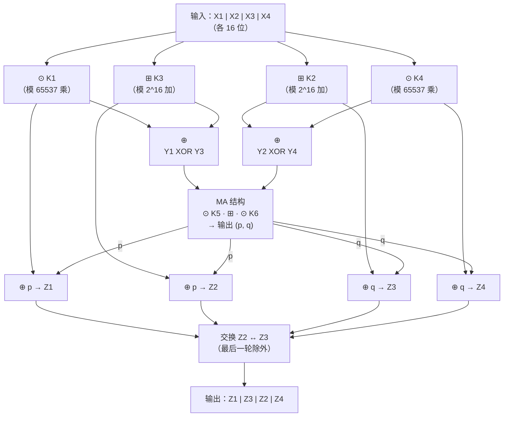

# 密码学（8）· IDEA

> [!abstract] TL;DR
> - **IDEA（International Data Encryption Algorithm）**：由 Lai Xuejia 与 James Massey 于 1991 年提出；64 位分组、128 位密钥、8.5 轮结构。
> - **核心创新**：混合三种代数上互不兼容的群运算——①模 2^16 加法 ②模 (2^16+1) 乘法 ③逐位异或——使线性与差分攻击极难建立跨运算的统一线性逼近。
> - **历史地位**：PGP 早期默认对称算法，曾受专利保护；**2012 年全部专利到期**，现已可自由使用。
> - **现状**：64 位分组在现代应用中存在生日攻击（Sweet32 类问题）天花板；新系统一律使用 [[04.AES详解]]（AES-128/256），IDEA 作为历史经典保留研究价值。

本篇属于 [[02.对称加密总论]] 所描述的分组密码体系，与 [[03.DES与3DES]] 属于同代产品（均是 64 位分组），是 [[04.AES详解]] 之前欧洲密码学的重要里程碑。理解 IDEA 的关键在于其"三群混合"设计思想，与 DES 的 Feistel+S 盒路线迥然不同。

---

## 概述与定位

### 历史沿革

IDEA 的前身是 **PES（Proposed Encryption Standard）**，Lai 与 Massey 1990 年发表；次年发现 PES 对差分密码分析存在弱点，改进后重命名为 **IPES（Improved PES）**，1992 年最终命名为 IDEA，收录于 Ascom Systec AG 的专利体系。

| 时间线 | 事件 |
|---|---|
| 1990 | Lai & Massey 发表 PES |
| 1991 | 改进为 IPES，应对差分分析 |
| 1992 | 正式命名 IDEA，申请专利 |
| 1994 | 进入 PGP 2.x，成为 PGP 默认对称算法 |
| 2012 | **所有专利全部到期**，IDEA 进入公有领域 |

### 核心参数

| 参数 | 值 |
|---|---|
| 分组大小 | **64 位**（8 字节） |
| 密钥长度 | **128 位**（16 字节） |
| 轮数 | **8 轮 + 半轮（输出变换）** |
| 子密钥总数 | 52 个 16 位子密钥（8 轮各 6 个 + 最终半轮 4 个） |
| 核心结构 | MA 结构（Multiplication-Addition） |
| 运算混合 | 模 2^16 加法、模 (2^16+1) 乘法、逐位 XOR |

> [!note] 为何叫"8.5 轮"
> IDEA 含 **8 个完整轮**，每轮包含 MA 结构与混淆层；最后还有一个**半轮（输出变换）**，仅做 4 个子密钥的混合，不含 MA 结构。严格说是"8 轮 + 输出变换"，习惯上称 8.5 轮。

---

## 原理与机制：三群混合

### 核心设计哲学

香农的混淆-扩散原则要求每一轮同时提供良好的非线性和雪崩效应。DES 通过 S 盒产生非线性；IDEA 走了一条截然不同的路：

> **用三种代数结构上不相容的运算混合，使攻击者无法建立统一的线性关系式。**

三种运算分别来自三个不同的代数群，它们在互相混合时会"打架"——对其中任何一种建立线性逼近，另外两种会将其破坏。

### 三种运算详解

**① 逐位异或（XOR）**

```
a ⊕ b  （在 GF(2)^16 上的加法）
```

来自 `(Z/2Z)^16` 群，是布尔代数操作。XOR 本身是线性的，这正是为什么不能单独用它——需要与另外两种非线性运算混合。

**② 模 2^16 加法**

```
a ⊞ b  = (a + b) mod 2^16     （0 ≤ a, b ≤ 65535）
```

来自整数模加群 `Z/2^16 Z`，范围 `[0, 65535]`。进位行为与 XOR 不同，提供扩散。

**③ 模 (2^16+1) 乘法（IDEA 乘法）**

```
a ⊙ b  = (a × b) mod 65537    （2^16+1 = 65537，是质数）
特殊约定：将 0 视作 65536（即 2^16）参与运算
```

来自乘法群 `(Z/65537Z)*`，因为 65537 是质数，所以 `1..65537` 都有乘法逆元。将 0 映射到 65536 使得 16 位整数与群元素之间构成双射（0 ↔ 65536）。

**为什么是 65537？**

65537 = 2^16 + 1 是费马质数（Fermat prime），它使得 `Z/65537Z` 中每个非零元素都有逆元，且乘法可以用有限步位操作高效计算。另外，16 位输入恰好能与 65537 阶群形成一一对应（加上 0 ↔ 65536 的约定）。

```
群        运算符   单位元   逆元计算
(Z/2Z)^16    ⊕       0     a^{-1} = a  （自逆）
Z/2^16 Z     ⊞       0     -a mod 2^16
(Z/65537Z)*  ⊙       1     扩展欧几里得算法 / 费马小定理：a^{65535} mod 65537
```

> [!tip] 互不兼容的本质
> - `⊕` 对 `⊞` 不分配（`a ⊕ (b ⊞ c) ≠ (a ⊕ b) ⊞ (a ⊕ c)` 一般不成立）
> - `⊞` 对 `⊙` 不分配（不同模数）
> - 三者两两不兼容，无法合并为一个统一的代数系统 → 攻击者无法用单一线性系统逼近整个轮函数

---

## 算法流程与结构详解

### MA 结构（Multiplication-Addition Structure）

MA 结构是 IDEA 每轮的子结构，接收两个 16 位值 `(x, y)` 和两个子密钥 `(K_a, K_b)`，输出两个 16 位值 `(p, q)`：

```
MA(x, y, K_a, K_b):
    t1 = (x  ⊙  K_a)
    t2 = (t1 ⊞  y)
    t3 = (t2 ⊙  K_b)
    t4 = (t1 ⊞  t3)
    p  = t3
    q  = t4
    return (p, q)
```

MA 结构中 `⊙` 和 `⊞` 的交替使用保证了输出对输入的**非线性**依赖。

### 单轮结构（完整）

IDEA 将 64 位分组分为 4 个 16 位子块：`X1, X2, X3, X4`。每轮消耗 6 个子密钥 `K1..K6`。

```
一轮 IDEA（第 r 轮，使用子密钥 K1..K6）：

步骤 1：混合层（四个子块分别与子密钥作用）
    Y1 = X1 ⊙ K1
    Y2 = X2 ⊞ K2
    Y3 = X3 ⊞ K3
    Y4 = X4 ⊙ K4

步骤 2：MA 输入准备
    t1 = Y1 ⊕ Y3
    t2 = Y2 ⊕ Y4

步骤 3：MA 结构
    (p, q) = MA(t1, t2, K5, K6)

步骤 4：输出混合
    Z1 = Y1 ⊕ p
    Z2 = Y3 ⊕ p
    Z3 = Y2 ⊕ q
    Z4 = Y4 ⊕ q

步骤 5：交换中间两个子块（最后一轮不交换）
    output = (Z1, Z3, Z2, Z4)   ← 注意 Z2 和 Z3 互换位置
```

> [!note] 最后一轮不交换
> 第 8 轮结束后**不做中间子块交换**，直接进入输出变换（半轮），这与 DES 最后一轮不交换 L/R 的设计如出一辙，目的是使加解密结构对称。

### 输出变换（半轮）

8 轮结束后，用最后 4 个子密钥 `K49..K52` 做最终混合：

```
输出变换（使用子密钥 K49, K50, K51, K52）：
    C1 = X1 ⊙ K49
    C2 = X2 ⊞ K50
    C3 = X3 ⊞ K51
    C4 = X4 ⊙ K52

密文 = 拼接(C1, C2, C3, C4)
```

### Mermaid：IDEA 一轮数据流



---

## 密钥调度

### 子密钥生成

IDEA 从 128 位主密钥生成 52 个 16 位子密钥（共 832 位），算法极为简洁：

```
密钥调度算法：

1. 将 128 位主密钥 K 直接视作 8 个 16 位段：
   K[0..7]  →  子密钥 K1..K8（供第 1 轮使用 6 个，K7/K8 入第 2 轮）

2. 循环左移：将当前 128 位密钥串整体循环左移 25 位，
   再取出 8 个 16 位子密钥，依次排入子密钥序列。

3. 重复步骤 2，直到产生足够 52 个子密钥：
   需进行 7 次移位（7×8=56 个槽，取前 52 个）。
```

**子密钥分配表：**

| 轮次 | 子密钥（6 个） |
|---|---|
| 第 1 轮 | K1, K2, K3, K4, K5, K6 |
| 第 2 轮 | K7, K8, K9, K10, K11, K12 |
| … | … |
| 第 8 轮 | K43, K44, K45, K46, K47, K48 |
| 输出变换 | K49, K50, K51, K52 |

每次循环左移 25 位的设计使所有密钥位在不同轮次的子密钥中均匀分布，雪崩充分。

### 解密密钥推导

IDEA 的加解密结构对称——解密就是再走一遍同样的轮结构，只是子密钥换成对应的**逆**：

| 加密子密钥作用 | 解密替换规则 |
|---|---|
| `⊙` 位置的子密钥 `K` | 替换为模 65537 乘法逆 `K^{-1} mod 65537` |
| `⊞` 位置的子密钥 `K` | 替换为模 2^16 加法逆 `-K mod 2^16` |
| `⊕` 位置（MA 结构内） | 直接使用相同子密钥（XOR 自逆） |

且解密子密钥的顺序是**加密子密钥的逆序**（最后一轮的逆密钥在解密时排在最前）。

> [!tip] 乘法逆计算
> `K^{-1} mod 65537` 使用扩展欧几里得算法，复杂度 `O(log p)`。对特殊值：
> - `K = 0`（实际映射为 65536）的乘法逆是 65536
> - `K = 1` 的乘法逆是 1

---

## 代码示例

以下是 IDEA 核心操作的伪代码实现，展示三种运算的混合方式：

```python
# ---- 三种基本运算 ----

MODULUS = 65537  # 2^16 + 1

def mul65537(a: int, b: int) -> int:
    """模 (2^16+1) 乘法，0 视作 65536"""
    if a == 0:
        a = 65536
    if b == 0:
        b = 65536
    result = (a * b) % MODULUS
    return 0 if result == 65536 else result

def add_mod16(a: int, b: int) -> int:
    """模 2^16 加法"""
    return (a + b) & 0xFFFF

def xor16(a: int, b: int) -> int:
    """逐位异或"""
    return a ^ b

# ---- MA 结构 ----

def MA(x: int, y: int, Ka: int, Kb: int):
    t1 = mul65537(x, Ka)    # ⊙
    t2 = add_mod16(t1, y)   # ⊞
    t3 = mul65537(t2, Kb)   # ⊙
    t4 = add_mod16(t1, t3)  # ⊞
    return t3, t4            # (p, q)

# ---- 单轮加密 ----

def idea_round(X1, X2, X3, X4, K1, K2, K3, K4, K5, K6):
    # 步骤 1：混合层
    Y1 = mul65537(X1, K1)
    Y2 = add_mod16(X2, K2)
    Y3 = add_mod16(X3, K3)
    Y4 = mul65537(X4, K4)
    # 步骤 2-3：MA 结构
    t1 = xor16(Y1, Y3)
    t2 = xor16(Y2, Y4)
    p, q = MA(t1, t2, K5, K6)
    # 步骤 4：输出混合
    Z1 = xor16(Y1, p)
    Z2 = xor16(Y3, p)   # 注意：Y3 对应 Z2
    Z3 = xor16(Y2, q)   # Y2 对应 Z3
    Z4 = xor16(Y4, q)
    return Z1, Z3, Z2, Z4  # 中间两个子块已交换

# ---- 完整加密（示意，省略密钥调度） ----

def idea_encrypt(plaintext_64bit: int, subkeys: list) -> int:
    """
    plaintext_64bit：64 位明文整数
    subkeys：52 个 16 位子密钥列表 subkeys[0..51]
    """
    # 拆分为 4 个 16 位子块
    X1 = (plaintext_64bit >> 48) & 0xFFFF
    X2 = (plaintext_64bit >> 32) & 0xFFFF
    X3 = (plaintext_64bit >> 16) & 0xFFFF
    X4 =  plaintext_64bit        & 0xFFFF

    # 8 完整轮
    for r in range(8):
        base = r * 6
        K1, K2, K3, K4, K5, K6 = subkeys[base:base+6]
        X1, X2, X3, X4 = idea_round(X1, X2, X3, X4, K1, K2, K3, K4, K5, K6)

    # 输出变换（半轮）
    K49, K50, K51, K52 = subkeys[48:52]
    C1 = mul65537(X1, K49)
    C2 = add_mod16(X2, K50)
    C3 = add_mod16(X3, K51)
    C4 = mul65537(X4, K52)

    return (C1 << 48) | (C2 << 32) | (C3 << 16) | C4
```

> [!warning] 示例输出为示意
> 上述伪代码为教学示意，省略了密钥调度的具体循环移位实现，实际运行前需补全 `idea_key_schedule(key_128bit)` 函数。

---

## 安全性与正确使用

### 已知攻击与弱密钥

**弱密钥（Weak Keys）**

IDEA 存在一类弱密钥：若主密钥使得某些子密钥在模 65537 乘法下退化（特别是若 `K = 0` 或 `K = 1` 出现在 `⊙` 位置），则该轮的乘法混合退化为平凡变换，显著降低安全性。

已知 IDEA 弱密钥数量估计约为 `2^51`，相对 2^128 的密钥空间比例极小（约 `2^{-77}`），实际随机选取时碰撞概率可忽略，但需在实现中主动检测和排除。

**中间相遇攻击（Meet-in-the-Middle）**

对双 IDEA（两次 IDEA 加密）的中间相遇攻击将有效密钥空间从 256 位压缩到约 128 位，与单次 IDEA 相当——类似于 [[03.DES与3DES]] 中双 DES 的缺陷。因此若要提升安全强度，需使用三次加密而非两次。

**差分与线性密码分析**

Lai 等人在设计之初即针对差分分析做了专门加固。目前已知的最优差分攻击需 `2^{64}` 选择明文，已超出 64 位分组所能提供的最大密文量，差分分析实际不可行。线性攻击同样因三群混合而无法建立全轮近似式。

### 64 位分组的根本限制

```
生日攻击阈值：约 2^{n/2} 分组（n = 分组位数）

IDEA（n=64）：约 2^32 ≈ 43 亿分组 ≈ 32 GB 密文
AES（n=128）：约 2^64 ≈ 1.8×10^19 分组（实际安全）
```

在 CBC、CTR 等模式下，当同一密钥加密数据量达到约 32 GB 时，可以利用生日悖论进行碰撞分析（Sweet32 攻击的同类问题）。64 位分组密码在高带宽场景下无法安全使用。

### 专利历史与现状

| 状态 | 说明 |
|---|---|
| 1991–2011 | 受多国专利保护；商业使用需向 Ascom AG 授权（非商业免费） |
| 2012 年起 | **所有专利到期**，IDEA 进入公有领域，可自由商业使用 |
| 目前支持 | OpenSSL（`idea-cbc`）、GnuPG 仍保留，主要用于兼容旧 PGP 消息 |

### 正确使用建议

> [!warning] 新项目禁止使用 IDEA
> 64 位分组在单密钥下的生日攻击上限（约 32 GB）无法满足现代传输量要求；尽管算法本身无已知实用破解，分组大小的结构性缺陷使其不适合新系统。

| 场景 | 建议 |
|---|---|
| 新系统对称加密 | 使用 [[04.AES详解]]（AES-128-GCM 或 AES-256-GCM） |
| 解密旧 PGP/IDEA 消息 | 可使用 OpenSSL/GnuPG 兼容模式，解密后迁移到 AES |
| 学习/研究 | IDEA 是三群混合思想的极佳案例，值得深入分析 |
| CTF/逆向 | 识别特征：模 65537 乘法（65537 = 0x10001）、52 个 16 位子密钥 |

**OpenSSL 兼容示例（仅用于处理旧数据）：**

```bash
# 解密旧 IDEA-CBC 加密数据（兼容模式）
openssl enc -d -idea-cbc -in ciphertext.bin -out plaintext.bin -k "passphrase"
```

> [!warning] 示例输出为示意
> 上述命令仅用于旧数据兼容解密，新系统中请替换为 `openssl enc -aes-256-gcm`。

---

## 小结

| 维度 | IDEA |
|---|---|
| 设计年代 | 1991（Lai & Massey） |
| 前身 | PES（1990）→ IPES → IDEA |
| 分组/密钥 | 64 位 / 128 位 |
| 轮数 | 8 轮 + 输出变换（8.5 轮） |
| 核心创新 | 三群（⊕ ⊞ ⊙）混合提供混淆 |
| 典型用途 | PGP 早期默认算法（1994–2000s） |
| 专利 | 2012 年全部到期 |
| 现状 | 64 位分组生日攻击限制；历史经典，新系统用 AES |

IDEA 的历史意义在于展示了一条**不依赖 S 盒**而仅靠代数运算多样性实现密码安全的道路。其"三群混合"思想影响了后续多种算法的设计。然而 64 位分组这一硬约束在 TiB 级别数据流的今天已无法回避，退出主流是必然趋势。真正继承其衣钵并解决分组限制的，是 [[04.AES详解]] 所代表的 128 位分组时代。

---

## 相关阅读

- [[02.对称加密总论]] —— 混淆与扩散原则、分组密码体系概览
- [[03.DES与3DES]] —— 同代 64 位分组密码，Feistel 路线对比
- [[04.AES详解]] —— IDEA 的现代继任者，128 位分组，SPN 结构
- [[10.分组密码工作模式总论]] —— CBC/CTR/GCM 等工作模式，生日攻击上限分析

---

⬅️ 上一篇 [[07.Camellia]] ｜ 🏠 [[00.密码学总览]] ｜ 下一篇 [[09.RC5与RC6]] ➡️
