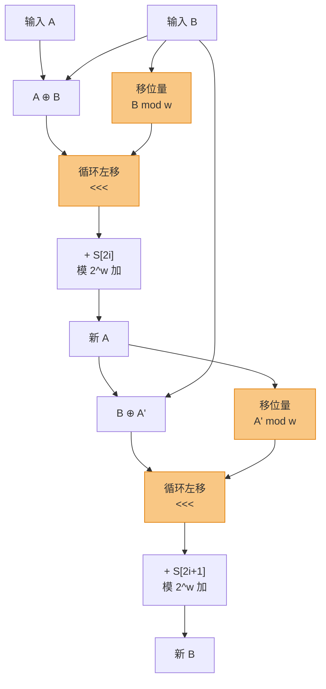
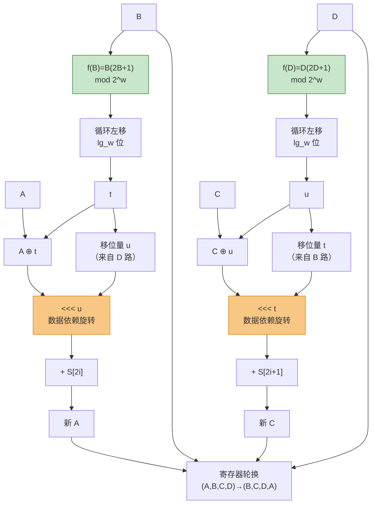

# 密码学（9）· RC5与RC6

> [!abstract] TL;DR
> - **RC5**（Rivest 1994）：极简的参数化分组密码，核心创新是**数据依赖的循环移位**（DDR，Data-Dependent Rotation）——每轮移位量由中间数据本身决定，非线性、难以用线性逼近，是密码学史上首次将 DDR 作为主要扩散机制。
> - **RC6**（Rivest、Sidney、Yin 1998）：在 RC5 基础上引入**整数乘法**和四寄存器结构，成为 **AES 决赛五强之一**；128 位分组、20 轮，安全性与 AES 相当。
> - **核心区别**：RC5 靠 DDR 提供非线性；RC6 额外用乘法 `f(x) = x(2x+1)` 增强扩散、用固定移位量 lg(w) 将乘法结果映射为旋转位数。
> - **现状**：两者均无实际破解；曾受 RSA Security 专利保护，**专利均已过期**。生产环境用 [[04.AES详解]]，RC5/RC6 以历史与教学价值著称。

本篇属于 [[02.对称加密总论]] 所描述的分组密码体系，与 [[04.AES详解]]、[[06.Twofish]] 处于同一竞争赛道（后两者均参加 AES 征集）。RC6 是唯一以 RC5 为直接原型进入 AES 决赛的候选算法，理解 RC5→RC6 的演进有助于把握"为何 AES 需要乘法或 S 盒"的设计取舍。

---

## 概述与定位

### 历史沿革

| 时间 | 事件 |
|---|---|
| 1994 | Ronald Rivest 在 RSA Security 发表 RC5，第一次把 DDR 作为主要密码原语 |
| 1997 | NIST 发起 AES 公开征集，要求 128 位分组 |
| 1998 | Rivest、Sidney、Yin 发表 RC6，提交 AES 候选 |
| 1999–2000 | AES 第二轮，RC6 获评最高安全得分之一，但硬件效率弱于 Rijndael |
| 2001 | AES 最终确定为 Rijndael，RC6 落选 |
| ~2015 | RC5 相关专利约 2015 年到期；RC6（1998 申请）约 2018–2019 年到期，具体因地区而异 |

RC5 由 Ron Rivest（RSA 的 R）于 1994 年在技术报告 "The RC5 Encryption Algorithm" 中提出，代号 RC 表示 "Rivest Cipher"（同系列还有 RC2/RC4/RC6/RC7…）。RC6 是三人合作，本质是"为 AES 赛道改造的 RC5"。

### 两算法一览

| 属性 | RC5 | RC6 |
|---|---|---|
| 发布年份 | 1994 | 1998 |
| 分组大小 | 2w 位（通常 64 位，w=32） | **128 位**（固定，w=32） |
| 寄存器数量 | 2（A、B） | **4**（A、B、C、D） |
| 轮数 | 可变（推荐 ≥16，通常 r=20） | **固定 20** |
| 密钥长度 | 0–255 字节 | 128/192/256 位 |
| 核心运算 | 模加、XOR、**DDR（数据依赖移位）** | 模加、XOR、DDR、**整数乘法** |
| AES 候选 | 否 | **是（五强之一）** |
| 专利 | 已过期 | 已过期 |

---

## 原理与机制

### RC5 的三条原语

RC5 只用三种运算，形成完整的混淆-扩散体系：

**运算一：模 2^w 加法（`+`）**

```
A + B   （结果截断到 w 位）
```

提供非线性（进位链），是 Feistel 类算法的经典组件。

**运算二：逐位 XOR（`⊕`）**

```
A ⊕ B
```

提供扩散，线性操作，单独使用不安全，与加法组合产生良好混淆。

**运算三：数据依赖的循环左移（`<<<`）**

```
A <<< (B mod w)     — 移位量 = B 的低 lg(w) 位
```

这是 RC5 的核心创新：**移位量不是固定常数，而是另一个寄存器的低 `lg(w)` 位**。以 w=32 为例，移位量取低 5 位（0–31 范围），每轮的移位量随数据变化——这既引入非线性，又使差分分析极难成立（攻击者无法预测移位量）。

> [!note] DDR 为何有效
> 在经典差分攻击中，攻击者追踪"差分对"（两个明文对的 XOR 差）在每一步如何传播。固定移位只是线性旋转，差分可以跟踪；但当移位量本身依赖数据，差分对的移位量就不同，"差分轨迹"在这里分叉成 2^lg(w) 条可能，使攻击复杂度指数级上升。

### RC5 半轮结构

RC5 以"半轮"（half-round）为单位：**一轮 = 两个半轮**，每个半轮处理一个寄存器。

定义参数 RC5-w/r/b：
- w：字长（bit），取 16/32/64，决定分组大小 = 2w bit
- r：轮数，推荐 ≥16
- b：密钥字节数（0–255）
- 子密钥数组：`S[0..2r+1]`，共 `t = 2(r+1)` 个 w 位子密钥

**单轮（两个半轮）伪代码：**

```
# 第 i 轮（i = 1..r），子密钥 S[2i] 和 S[2i+1]
A = ((A XOR B) <<< B) + S[2*i]
B = ((B XOR A) <<< A) + S[2*i+1]
```

注意：这里 `A XOR B` 先做，移位量取（更新后的）`B` 的低 5 位；第二个半轮已经用了更新后的 A。

**完整加密流程：**

```
加密 RC5-w/r/b（明文 [A, B]，子密钥数组 S）：
  A = A + S[0]
  B = B + S[1]
  for i = 1 to r:
      A = ((A XOR B) <<< (B mod w)) + S[2*i]
      B = ((B XOR A) <<< (A mod w)) + S[2*i+1]
  输出密文 [A, B]
```

**解密（逆操作）：**

```
解密 RC5-w/r/b（密文 [A, B]，子密钥数组 S）：
  for i = r downto 1:
      B = ((B - S[2*i+1]) >>> (A mod w)) XOR A
      A = ((A - S[2*i])   >>> (B mod w)) XOR B
  B = B - S[1]
  A = A - S[0]
  输出明文 [A, B]
```

其中 `>>>` 表示循环右移（`<<<` 的逆）。

### RC5 密钥扩展

密钥扩展将 b 字节密钥展开为 `t = 2(r+1)` 个 w 位子密钥，用两个**魔术常量**初始化：

**魔术常量定义（w=32 时）：**

```
Pw = 0xB7E15163   （基于 (e - 2) × 2^32，e = 自然常数底）
Qw = 0x9E3779B9   （基于 (φ - 1) × 2^32，φ = 黄金比例 (1+√5)/2）
```

这两个常数是奇整数，保证在 2^w 模算术下有良好的"伪随机"性质（来自无理数的小数部分，类似 AES 的常数选取思想）。

**密钥扩展步骤：**

```
步骤 1：将 b 字节密钥 K 填充为 c = ceil(b/u) 个 w 位字 L[0..c-1]
        （u = w/8，不足补零，小端序）

步骤 2：初始化子密钥数组
        S[0] = Pw
        for i = 1 to t-1:
            S[i] = S[i-1] + Qw    （模 2^w）

步骤 3：混合（3 × max(t, c) 次迭代）
        A = B = i = j = 0
        for k = 0 to 3*max(t,c)-1:
            A = S[i] = (S[i] + A + B) <<< 3
            B = L[j] = (L[j] + A + B) <<< (A + B)
            i = (i + 1) mod t
            j = (j + 1) mod c
```

步骤 3 的混合轮次保证密钥的每一位都影响所有子密钥。

### 魔术常量 P/Q 的推导原理

RC5 密钥扩展中的两个魔术常量并非随意选取，而是从两个经典无理数的小数部分推导而来，遵循"Nothing-Up-My-Sleeve"（NUMS）设计原则——公开来源的常数无法被算法设计者预留后门。

**Pw 的推导（来自自然常数 e）**

```
e = 2.71828182845904523536…

取 (e − 2) 的小数部分 = 0.71828182845904…
乘以 2^32 = 3084996963.183…
取奇数最近值（向上取奇）= 0xB7E15163 = 3084996963
```

具体步骤：`floor((e − 2) × 2^32)` 若为偶数则加 1，得奇数 `Pw`。取奇数是为了保证 Pw 在模 2^w 加法群中与 2^w 互质（即与 2 互质），使得子密钥序列 `S[0], S[0]+Qw, S[0]+2·Qw, …` 遍历 2^w 阶群的最长轨道。

**Qw 的推导（来自黄金比例 φ）**

```
φ = (1 + √5) / 2 = 1.61803398874989484820…

取 (φ − 1) 的小数部分 = 0.61803398874989…
乘以 2^32 = 2654435769.497…
取奇数最近值 = 0x9E3779B9 = 2654435769
```

同理取奇数最近值得 Qw。黄金比例小数部分 `0.618…` 的奇特性质使其在 2^32 周期内的分布非常均匀（与 Fibonacci 序列的关联保证低差异性），让子密钥序列覆盖密钥空间均匀。

**为何选 e 和 φ**

| 常数 | 来源 | 选择理由 |
|---|---|---|
| Pw | 自然常数 e | 最著名的数学常数之一，来源公开，不可操纵 |
| Qw | 黄金比例 φ | 小数展开具有低差异性，序列分布最优 |
| 取奇数 | 代数要求 | 奇数与 2^w 互质，保证子密钥序列遍历全群 |

类似的 NUMS 常数设计还出现在 AES（S 盒常数 0x63 来自 GF 逆运算）、SHA-2（圆常数来自前 64 个质数的立方根/平方根小数部分）等算法中，成为现代密码学的标准实践。

**RC6 沿用相同常数**

RC6 密钥扩展与 RC5 完全相同的三步结构，魔术常量 Pw/Qw 不变，仅子密钥数组大小调整为 `t = 2r+4 = 44`（RC6-32/20 时）。



橙色节点为 DDR（数据依赖旋转），是 RC5 的核心非线性来源。

---

## RC6：RC5 的 AES 升级版

### RC6 的三项升级

AES 要求 128 位分组，而 RC5-32/r/b 只有 64 位分组。RC6 做了三处架构升级：

**升级一：四寄存器（128 位分组）**

将 128 位明文拆为 4 个 32 位寄存器 (A, B, C, D)，类似 64 位分组的两寄存器扩展到四个。

**升级二：整数乘法增强扩散**

引入函数：

```
f(x) = x × (2x + 1)   （模 2^32）
```

其中 `x × (2x+1)` 也写作 `2x² + x`，输出取低 32 位。这个函数具有两个关键特性：
1. 当 x 为奇数时，`(2x+1)` 也是奇数，乘积满足 2^32 互质，是 Z/2^32 上的双射（可逆）。
2. 乘法将 x 的低位信息"扩散"到高位——一个比特的翻转会影响结果的大量高位比特，远比纯加法 `x+1` 的进位链更猛。

> [!note] 为何用 f(x) 而不直接用乘法？
> `f(x) = x(2x+1)` 不是随意选的：这个形式保证对所有 w 位整数都是**置换**（双射），因此不会"压缩"信息，加解密都可逆。纯乘法 `x × k` 只有 k 为奇数时才满足，而 `2x+1` 恒奇，构造优雅。

**升级三：乘法结果作固定移位量**

```
lg_w = lg(w) = 5   （w=32 时）

# RC6 中每轮的"移位量"取法：
rotate_amount = f(B) 的高 lg_w 位
```

具体地，取 `f(B) >>> (w - lg_w)` 的低 `lg_w` 位（即 f(B) 右移 27 位，取低 5 位）。这等价于取乘法结果最高的 `lg_w` 位，**比取低位有更好的雪崩性**（乘法的高位受低位影响最大）。

### RC6-w/r/b 完整加密

标准竞赛版本为 RC6-32/20/16（w=32，r=20，b=16 即 128 位密钥）。

```
加密 RC6-w/r/b（明文 [A,B,C,D]，子密钥 S[0..2r+3]）：

  B = B + S[0]
  D = D + S[1]
  for i = 1 to r:
      t = f(B) <<< lg_w        # t = (B*(2B+1) mod 2^w) 循环左移 lg_w 位
      u = f(D) <<< lg_w        # u = (D*(2D+1) mod 2^w) 循环左移 lg_w 位
      A = ((A XOR t) <<< u) + S[2*i]
      C = ((C XOR u) <<< t) + S[2*i+1]
      (A, B, C, D) = (B, C, D, A)    # 寄存器轮换
  A = A + S[2*r+2]
  C = C + S[2*r+3]
  输出密文 [A, B, C, D]
```

> [!note] 关于 `<<< lg_w`
> `f(B) <<< lg_w` 是循环左移 `lg_w = 5` 位（固定，非数据依赖）。这里移位量是常数，目的是让乘法输出的高 5 位来充当后续 DDR 的移位量——将乘法与旋转耦合，使扩散既有乘法的高位雪崩，又有旋转的非线性。

**解密（逆序执行）：**

```
解密 RC6-w/r/b（密文 [A,B,C,D]，子密钥 S[0..2r+3]）：

  C = C - S[2*r+3]
  A = A - S[2*r+2]
  for i = r downto 1:
      (A, B, C, D) = (D, A, B, C)    # 寄存器逆轮换
      u = f(D) <<< lg_w
      t = f(B) <<< lg_w
      C = ((C - S[2*i+1]) >>> t) XOR u
      A = ((A - S[2*i])   >>> u) XOR t
  D = D - S[1]
  B = B - S[0]
  输出明文 [A, B, C, D]
```

### RC6 密钥扩展

RC6 密钥扩展与 RC5 完全相同的三步结构（初始化 → 子密钥序列 → 混合），只需将子密钥数组大小改为 `t = 2r+4`（RC6-32/20 时为 44 个 32 位子密钥）。魔术常量沿用 RC5 的 Pw = 0xB7E15163、Qw = 0x9E3779B9。

### RC6 一轮结构（Mermaid）



绿色节点为整数乘法函数 f(x)，橙色为数据依赖旋转（DDR），二者协作提供强扩散。

---

## RC5 与 RC6 对比

### 设计理念演进

| 维度 | RC5 | RC6 |
|---|---|---|
| 分组大小 | 2w 位（灵活，通常 64 位） | 固定 128 位 |
| 非线性来源 | DDR（移位量依赖数据） | DDR + 整数乘法 |
| 扩散速度 | 较慢（每轮仅 2 个字交互） | 更快（4 字交互 + 乘法高位扩散） |
| 轮数需求 | 推荐 ≥16 轮才安全 | 20 轮达到 AES 级安全 |
| 加密速度 | 极简，软件快 | 因乘法稍慢，但仍高效 |
| 硬件面积 | 极小（无 S 盒） | 小（无 S 盒，但需乘法器） |
| AES 赛道 | 未参赛 | 五强入围，最终落选 |

### 为何 RC6 落选 AES

AES 第二轮评选中，RC6 在安全性评估上获得高评价，但在以下方面弱于 Rijndael（最终 AES）：

1. **硬件效率**：Rijndael 的 SubBytes（S 盒替换）在硬件上可高度并行；RC6 的 20 轮整数乘法在硬件流水线上串行瓶颈更明显。
2. **轮函数并行度**：Rijndael 的 ShiftRows+MixColumns 提供列级并行；RC6 四个寄存器的交叉依赖限制了指令级并行。
3. **专利阴影**：评选期间 RC6 仍处于专利保护期，NIST 担忧标准化后的可用性（Rijndael 作者 Daemen & Rijmen 明确无专利主张）。

> [!info] 五强候选的对比见 [[06.Twofish]]
> AES 五强：Rijndael（胜出）、Serpent、Twofish、RC6、MARS。[[06.Twofish]] 篇中有五强对比表，RC6 处于安全性最高、效率折中的位置。

### RC6 AES 竞赛安全分析

**RC6 在 AES 评选期间的最佳攻击记录**

在 1998–2000 年的 AES 公开评估期间，国际密码学界对 RC6-32/20 进行了大量分析，结论如下：

| 分析类型 | 达到的最大轮数 | 所需条件 | 是否威胁 20 轮 |
|---|---|---|---|
| 差分密码分析 | 最多 15 轮（理论） | 2¹¹⁹ 选择明文 | 否（仅 15/20 轮） |
| 线性密码分析 | 最多 16 轮（理论） | 2¹²⁵ 已知明文 | 否（仅 16/20 轮） |
| 统计区分器 | 最多 18 轮 | 2¹²⁸ 级别复杂度 | 否（复杂度超穷举） |
| 密钥猜测辅助差分 | 15 轮 | 需部分密钥假设 | 否 |

结论：**RC6-32/20 在评选期间无实际可行的破解路径**，安全裕度约为 4–5 轮（最强攻击打到 15–16 轮，距离 20 轮有明显缓冲）。

**最终输给 Rijndael 的真正原因**

安全性从来不是 RC6 落选的主因——评估委员会明确指出 RC6 安全性充足。实际决定因素是三个维度的综合权衡：

```
维度 1：硬件实现面积与速度
  Rijndael ：ShiftRows + MixColumns 可以完全展开为组合逻辑（无乘法器需求）
             S 盒 8×8 查找表在 FPGA/ASIC 上映射为 256 条线，面积极小
  RC6      ：f(x) = x(2x+1) 的 32 位乘法需要硬件乘法器
             面积约为 Rijndael 的 1.5–2 倍（评估期间嵌入式场景权重高）

维度 2：轮函数的可证明安全性分析简洁性
  Rijndael ：Wide Trail Strategy 提供严格的差分/线性界证明（AES 设计者自带安全证明框架）
  RC6      ：基于 DDR 和乘法的安全性证明框架尚不成熟，
             评估期间无等价于 Wide Trail 的正式界

维度 3：专利与标准化可用性
  Rijndael ：作者 Daemen & Rijmen 2000 年明确表示放弃所有专利主张
  RC6      ：RSA Security 专利保护至 2015–2019 年，
             NIST 担忧若选 RC6 为标准，商业使用将受专利约束
```

> [!note] 历史背景
> NIST 在 1999 年的第二轮评估报告中专门写道："RC6 的专利状况给标准化带来不确定性，即便 RSA Security 承诺免费授权政府使用，商业环境的许可问题仍难以预判。" 这一风险评估与 Serpent 落选（性能弱于 Rijndael）的原因不同，凸显了密码标准化中"可用性政策"与"纯技术优劣"同等重要。

---

## 安全性与正确使用

### RC5 安全性

**已知攻击：**

| 攻击方式 | 针对版本 | 复杂度 | 现实威胁 |
|---|---|---|---|
| 差分攻击 | RC5-32/5/b | 2^25 选择明文 | 仅学术（5 轮） |
| 差分攻击 | RC5-32/8/b | 2^37 | 仅学术（8 轮） |
| 差分攻击 | RC5-32/12/b | 2^51 | 仅学术（12 轮） |
| 穷举（RSA 挑战） | RC5-32/12/8（64 位）| 2^56 | 1997 年被 Distributed.net 破解 |
| 目前已知最强攻击 | RC5-32/16/b | 2^44 选择明文 | 16 轮仍有理论弱点 |

> [!warning] RC5-32/12/8 的破解
> 1997 年 Distributed.net 通过分布式穷举破解了 RSA 公司发起的 RC5-56 挑战（密钥仅 56 位）。这说明密钥太短才是问题，64 位密钥不是密码本身缺陷。使用 RC5 时应选 128 位密钥（b=16）及至少 **20 轮**（r≥20）。

**推荐参数：** RC5-32/20/16（64 位分组，20 轮，128 位密钥）

**根本局限：** RC5 的 64 位分组在大量数据加密时面临**生日攻击**风险——加密约 2^32（约 40 亿）个分组（32 GB）后，块碰撞概率达 50%（类似 Sweet32 对 3DES/Blowfish 的攻击）。因此即使参数选对，RC5 也**不适合大文件/大流量加密**。

### RC6 安全性

| 评估维度 | 结论 |
|---|---|
| 差分攻击 | 20 轮 RC6 无实际差分攻击 |
| 线性攻击 | 20 轮抵抗线性密码分析 |
| 相关密钥攻击 | 未发现实际可行攻击 |
| 穷举 | 128/192/256 位密钥空间足够大 |

RC6 目前**无实际破解**，128 位分组消除了 RC5 的生日攻击天花板，理论安全性与 AES 相当。

### 正确使用建议

> [!danger] 生产环境不要选 RC5/RC6
> 两者均无库级支持（OpenSSL 未内置、主流 TLS 实现不支持）；专利过期后也未成主流。所有新系统使用 [[04.AES详解]]（AES-128-GCM 或 AES-256-GCM）。

**如果你在维护使用 RC5 的遗留系统：**

```
参数最低要求：
  RC5-32/20/16   （r ≥ 20，b = 16 即 128 位密钥）
  分组模式：CBC（需要 8 字节 IV）或 CTR
  注意：单次会话加密上限 ~ 1 GB（生日界限保守估计）

禁止使用：
  RC5-32/12/b    （轮数不足，已有学术攻击）
  RC5 任意 b ≤ 8 （56 位密钥已被穷举）
  ECB 模式       （任何算法均禁止）
```

**学习与研究价值：**

RC5 是讲解"非线性来源"的极佳教材——用三条简单原语（加、XOR、DDR）就构造出充分的混淆-扩散，代码量极少，便于从零实现验证。RC6 则展示了"如何将乘法融入分组密码"的设计思路，对理解 AES 候选算法的取舍很有价值。

---

## 算法流程示例（RC5-32/2/8，仅演示用）

> [!warning] 以下使用极小参数（2 轮，64 位密钥），仅用于步骤演示，不代表安全用法。实际安全参数见"安全性与正确使用"节。

**参数：** w=32，r=2，b=8（64 位密钥）

**密钥（示例）：** `K = [0x00, 0x01, 0x02, 0x03, 0x04, 0x05, 0x06, 0x07]`

**子密钥初始化（t = 2×(2+1) = 6 个 32 位子密钥）：**

```
# 步骤 1：密钥字
L[0] = 0x03020100   （小端序读 K[0..3]）
L[1] = 0x07060504   （小端序读 K[4..7]）

# 步骤 2：初始子密钥序列
S[0] = 0xB7E15163   （Pw）
S[1] = 0x57517DC6   （S[0]+Qw mod 2^32）
S[2] = 0xF6C20A29   （S[1]+Qw mod 2^32）
S[3] = 0x9632968C   （...）
S[4] = 0x35A322EF
S[5] = 0xD513AF52

# 步骤 3：混合（3 × max(6,2) = 18 次迭代，此处略去计算细节）
→ 得到最终 S[0..5]
```

> [!warning] 示例输出为示意
> 上述 S[1..5] 初值未经步骤 3 混合，实际子密钥由完整混合过程决定；此处仅展示结构。

---

## 小结

RC5 以极简的参数化设计和**数据依赖的循环移位**开创了分组密码的新思路——用"移位量随数据变化"这一机制同时实现非线性与扩散，三条原语（模加 + XOR + DDR）即可构成安全的分组密码框架。这一思想直接影响了 RC6 的设计，并被后续多个算法借鉴。

RC6 在 RC5 基础上引入整数乘法 `f(x) = x(2x+1)`，将分组扩展到 128 位，并采用四寄存器结构，以此参赛 AES 征集并跻身五强。最终落选的原因不在于安全性缺陷，而在于硬件并行度弱于 Rijndael 以及专利问题。

两者今天的价值主要在于：

- **教学**：RC5 是讲解 DDR 非线性、参数化密码设计的绝佳案例；RC6 是理解 AES 竞争与乘法-旋转耦合设计的窗口。
- **历史**：二者共同代表了 1990 年代末分组密码设计从纯 Feistel/S 盒路线向"算术运算混合"路线的探索。
- **生产禁用**：所有新系统应使用 [[04.AES详解]]（AES-GCM），不应在新代码中引入 RC5/RC6。

---

## 相关阅读

- [[02.对称加密总论]] —— 分组密码通用框架：混淆-扩散、Feistel、SPN 结构
- [[04.AES详解]] —— AES 征集的最终胜出者，生产标准
- [[06.Twofish]] —— AES 五强之一，与 RC6 同代竞争者；含五强对比
- [[08.IDEA]] —— 同代三群混合思路，另一种"无 S 盒"路线
- [[10.分组密码工作模式总论]] —— RC5/RC6 若使用应选择的分组模式（CBC/CTR/GCM）

---

⬅️ 上一篇 [[08.IDEA]] ｜ 🏠 [[00.密码学总览]] ｜ 下一篇 [[10.分组密码工作模式总论]] ➡️
