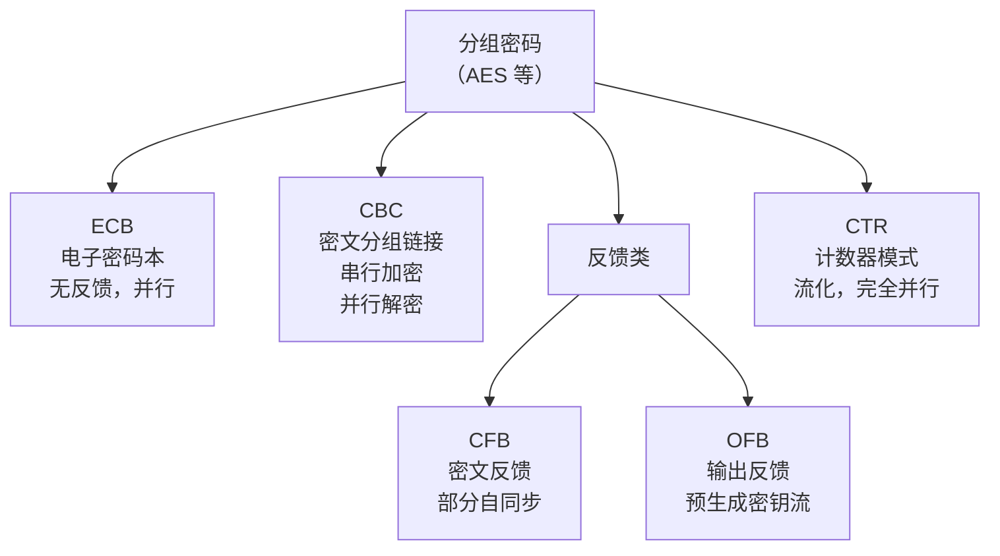
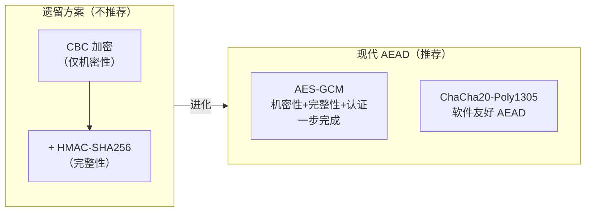

# 密码学（10）· 分组密码工作模式总论

> [!abstract] TL;DR
> - **分组密码本身只能加密固定长度的一个块**（AES 128 位）；加密任意长消息需要"工作模式"来规定多个块如何串联。
> - **五大经典模式**：ECB（无反馈）、CBC（密文反馈）、CFB（密文字节反馈）、OFB（输出反馈）、CTR（计数器）；各有不同的并行性、随机访问能力、错误传播特性。
> - **IV/nonce** 是引入随机性的关键——同一密钥下 IV 不重用是硬性要求；不同模式对 IV 的可预测性要求不同。
> - **填充**（PKCS#7 为主流）解决消息不对齐问题，但也引入 Padding Oracle 攻击面。
> - **核心警示**：ECB/CBC/CTR/CFB/OFB 仅提供**机密性**，**不提供完整性与认证**；裸用这些模式可被主动攻击者篡改密文且不被察觉。
> - **现代实践**：始终用 AEAD（[[15.AEAD原理与GCM|GCM]]、ChaCha20-Poly1305）；若受限于遗留接口，裸 CBC/CTR 必须叠加 MAC（Encrypt-then-MAC）。

本篇承接 [[04.AES详解]]（分组密码本体），系统总结工作模式的设计动机、关键参数、各模式属性对比与选型建议，是后续各模式详篇（[[11.ECB模式]]、[[12.CBC模式]]、[[13.CTR模式]]）的总索引与导论。AEAD 全面原理见 [[15.AEAD原理与GCM]]。

---

## 概述与定位

### 为何需要工作模式

[[04.AES详解]] 的核心描述是：给定一个 128 位明文块与一个密钥，输出一个 128 位密文块。这是一个**确定性的、无状态的、固定输入长度的置换**（permutation）。

现实消息几乎从不恰好是 128 位——它们可能是几个字节的 HTTP 头，也可能是几十 GB 的文件。工作模式（Mode of Operation）就是**规定如何把这个固定长度置换应用到任意长度消息上**的标准化方法，具体要解决三个问题：

1. **消息切分**：把任意长消息切成若干块，逐块（或逐字节）送入分组密码。
2. **块间关联**：让各密文块相互关联，否则相同明文块将产生相同密文块（ECB 的根本缺陷）。
3. **末尾处理**：消息末块可能不满一个分组，需要填充或流化处理。

> [!note] 历史脉络
> 分组密码工作模式由 NIST SP 800-38 系列文件系统化定义：SP 800-38A（ECB/CBC/CFB/OFB/CTR，2001）、SP 800-38D（GCM，2007）、SP 800-38E（XTS，2010）等。GCM 的出现标志着"模式"职责从单纯机密性扩展到**认证加密**。

### 五大经典模式一览



ECB 无块间关联，已不推荐；CBC 是历史上最广泛使用的模式；CFB/OFB 将分组密码流化；CTR 是现代高性能首选基础；GCM 在 CTR 基础上叠加 GHASH 认证，构成 AEAD。

---

## 原理与机制

### 符号约定

| 符号 | 含义 |
|------|------|
| `E_K(X)` | 用密钥 K 加密块 X |
| `D_K(X)` | 用密钥 K 解密块 X |
| `P_i` | 第 i 个明文块（128 位） |
| `C_i` | 第 i 个密文块 |
| `IV` | 初始化向量（Initialization Vector） |
| `Nonce` | 每次加密唯一的数值（Number used ONCE） |
| `⊕` | 按位异或 |
| `Counter_i` | 第 i 个计数器块 |

### ECB 模式（不推荐）

```
C_i = E_K(P_i)
```

每块独立加密，相同明文块产生相同密文块。详见 [[11.ECB模式]]。

### CBC 模式

```
C_0 = IV
C_i = E_K(P_i ⊕ C_{i-1})      // 加密：串行
P_i = D_K(C_i) ⊕ C_{i-1}      // 解密：可并行（C_{i-1} 已知）
```

每个明文块先与上一密文块异或，再加密。IV 作为 C_0 注入。详见 [[12.CBC模式]]。

### CTR 模式

```
Counter_i = Nonce || counter_value_i
KeyStream_i = E_K(Counter_i)
C_i = P_i ⊕ KeyStream_i
```

将分组密码变为流密码：预生成密钥流块，与明文异或得密文（解密完全相同，因为异或对称）。详见 [[13.CTR模式]]。

### CFB 模式

```
C_0 = IV
C_i = P_i ⊕ E_K(C_{i-1})
P_i = C_i ⊕ E_K(C_{i-1})
```

将上一密文块（或 shift register）加密后的前 s 位与明文异或，支持字节级（CFB-8）或块级（CFB-128）变体。

### OFB 模式

```
O_0 = IV
O_i = E_K(O_{i-1})             // 密钥流独立于明密文
C_i = P_i ⊕ O_i
P_i = C_i ⊕ O_i
```

密钥流完全由 IV 和密钥决定，与明密文无关，可预计算。

---

## IV / Nonce 的作用与要求

### 为什么需要 IV

同一密钥加密同一消息，若没有 IV，每次密文完全相同——攻击者可通过重放或比对判断消息内容是否一致（重放攻击、流量分析）。IV 引入随机性，使得：

- 即使使用同一密钥，不同次加密同一消息的密文也不同（语义安全，IND-CPA 要求）；
- 阻断跨消息的密文关联分析。

> [!info] IV vs Nonce
> **IV（Initialization Vector）**：通常要求随机或不可预测，如 CBC 的 IV 必须随机（防止 BEAST/POODLE 类攻击对可预测 IV 的利用）。
> **Nonce（Number used Once）**：只要求在同一密钥下唯一，不要求随机，如 CTR/GCM 的 nonce 可以是计数器，但**绝不能重用**。
> 两者语义不同，混用会导致安全漏洞（例如把 GCM nonce 当随机数，若使用计数器以外的方式管理，碰撞概率被低估）。

### 各模式 IV/Nonce 要求

| 模式 | IV/Nonce 要求 | 重用后果 |
|------|--------------|---------|
| ECB | 无 IV | — |
| CBC | 随机、不可预测（公开传输） | 相同明文 → 相同密文前缀；BEAST 攻击利用可预测 IV |
| CTR | 唯一（nonce），可公开 | nonce 重用 → 两段密文异或得明文差，一次性密本攻击 |
| CFB | 随机 | 同 CBC |
| OFB | 唯一，不可重用 | 重用 → 相同密钥流，明文差暴露 |
| GCM | 唯一（96 位 nonce 最优） | 重用 → 认证密钥 H 泄露，彻底破解 |

> [!danger] GCM Nonce 重用是灾难性的
> GCM 的 GHASH 认证密钥 `H = E_K(0)` 会在 nonce 重用时通过两条密文代数方程直接还原，之后攻击者可伪造任意认证标签（Joux 2006；Handshake 攻击复现于多个 TLS 实现）。96 位 nonce 使用随机生成时，生日悖论约在 2^32 条消息（~40 亿）后碰撞风险显著，**长期密钥下推荐用计数器 nonce**。

---

## 填充（Padding）

### 为什么需要填充

CBC、ECB、CFB（块级）要求消息长度是分组长度（128 位 = 16 字节）的整数倍。若消息末块不足 16 字节，必须填充至对齐。CTR/OFB 因为将分组密码流化，无需填充（密钥流按需截断）。

### PKCS#7 填充标准

PKCS#7（RFC 5652）是最广泛使用的分组填充标准：

- 若消息末块缺少 `n` 字节（`1 ≤ n ≤ 16`），则追加 `n` 个值为 `n` 的字节；
- 若消息恰好对齐，追加完整一块（16 个 `0x10` 字节），**确保填充总存在**（避免去填充时歧义）。

```
示例：明文 "HELLO" (5 字节)
需填充至 16 字节，缺 11 字节
填充后：H E L L O 0x0B 0x0B 0x0B 0x0B 0x0B 0x0B 0x0B 0x0B 0x0B 0x0B 0x0B
                  ↑──────────────── 11 个 0x0B ───────────────────────────↑
```

```
示例：明文恰好 16 字节
填充后追加一整块：[原 16 字节] + [0x10 × 16]
```

去填充时：读取最后一个字节 `n`，验证末尾 `n` 个字节均为 `n`，然后去掉；验证失败则报错（不能静默忽略）。

### Padding Oracle 攻击隐患

> [!danger] Padding Oracle 警告
> 若服务端在去填充失败时返回**可区分于其他错误的错误响应**（不同 HTTP 状态码、不同错误消息、不同响应时延），攻击者可以逐字节查询构造"填充预言机"，对任意 CBC 密文做逐字节解密——**无需密钥**，仅需约 128 次 oracle 查询即可还原一个 16 字节块。
>
> 典型漏洞：CVE-2016-2107（OpenSSL AES-CBC Padding Oracle）、POODLE（TLS 1.0 CBC）、Lucky 13（时序变体）。
>
> 根本缓解：使用 AEAD（先认证，填充错误和 MAC 失败返回同一错误且不泄露位置）；或严格常数时间去填充并统一报错。完整攻击分析见 [[60.对称密码攻击]]。

---

## 各模式属性对比

### 核心维度对比表

| 属性 | ECB | CBC | CTR | CFB | OFB |
|------|-----|-----|-----|-----|-----|
| **并行加密** | ✓ | ✗（串行） | ✓ | ✗ | ✗（可预计算） |
| **并行解密** | ✓ | ✓ | ✓ | ✓ | ✗（可预计算） |
| **随机访问解密** | ✓ | 需前一块 | ✓（计算 Counter_i） | 需前一块 | ✗ |
| **需要填充** | ✓ | ✓ | ✗ | ✗（CFB-8 位级） | ✗ |
| **错误传播** | 仅当前块 | 当前块+下一块 | 仅当前块（位级） | 部分（取决于变体） | 仅当前块（位级） |
| **密钥流可预计算** | ✗ | ✗ | ✓ | ✗ | ✓ |
| **IV 要求** | 无 | 随机不可预测 | 唯一（计数器可） | 随机 | 唯一 |
| **模式推荐** | 已废弃 | 遗留兼容 | 推荐基础（+MAC） | 少用 | 少用 |

### 错误传播详解

```mermaid
graph TD
  subgraph CBC["CBC 错误传播"]
    C1["C_i（位翻转）"] -->|D_K 后 ⊕ C_{i-1}| P1["P_i：完全随机损坏"]
    C1 -->|作为下一块 IV| P2["P_{i+1}：对应位同样翻转（确定性）"]
    P3["P_{i+2} 之后正常"]
  end
  subgraph CTR["CTR 错误传播"]
    C2["C_i（位翻转）"] -->|⊕ KeyStream_i| P4["P_i：对应位翻转（一对一）"]
    P5["其他块不受影响"]
  end
```

CBC 的错误传播特性：第 i 个密文块损坏 → P_i 完全乱码，P_{i+1} 对应位翻转（可被攻击者精确控制），P_{i+2} 开始正常。这是 CBC 比特翻转攻击（Bit-Flipping Attack）的基础。

CTR 的错误传播：密文块的一个位翻转只导致对应明文位翻转，错误不扩散——但这也意味着攻击者可**精确控制**明文特定位（比特翻转攻击），在无完整性保护时极度危险。

---

## 安全性与正确使用

### 核心警示：传统模式仅提供机密性

> [!danger] 传统模式（ECB/CBC/CTR/CFB/OFB）不提供完整性或认证
> 这是工程实践中最常见的误解。这些模式：
> - **无法检测密文被篡改**——攻击者可任意翻转密文位，解密成功但明文已被修改。
> - **无法验证密文来源**——任何人都可构造"合法"密文。
> - **不抵御主动攻击**（选择密文攻击、比特翻转攻击、填充预言机）。
>
> 典型错误：`AES-CBC 加密 = 安全传输`。正确做法：AEAD，或 Encrypt-then-MAC。

### AEAD：现代正确答案

AEAD（Authenticated Encryption with Associated Data）在一个操作中同时提供**机密性 + 完整性 + 可选附加数据认证**：

- **GCM（Galois/Counter Mode）**：CTR 模式加密 + GHASH 多项式认证；原生硬件支持（CLMUL）；TLS 1.3 标准选择之一。详见 [[15.AEAD原理与GCM]]。
- **ChaCha20-Poly1305**：软件友好，ARM/嵌入式环境首选；TLS 1.3 另一标准选择。
- **CCM**：CTR + CBC-MAC，受限场景（802.11i/WPA2、BLE）。
- **OCB**：高性能 AEAD，专利历史问题已解决，采用受限。



### Encrypt-then-MAC 原则

若因系统约束必须使用裸模式（如 CBC），**必须遵循 Encrypt-then-MAC**：

```
步骤1: C = CBC_Encrypt(K_enc, IV, P)
步骤2: Tag = HMAC-SHA256(K_mac, IV || C)       // 对密文计算 MAC
步骤3: 发送 (IV, C, Tag)

验证时:
步骤1: Tag' = HMAC-SHA256(K_mac, IV || C)
步骤2: 常数时间比较 Tag' == Tag（失败则丢弃，不解密）
步骤3: P = CBC_Decrypt(K_enc, IV, C)
```

> [!warning] 顺序至关重要
> - **Encrypt-then-MAC（推荐）**：先加密后 MAC，MAC 覆盖密文；解密前验证 MAC，失败直接丢弃，不接触密文（消除 Padding Oracle）。
> - **MAC-then-Encrypt（危险）**：先 MAC 后加密，MAC 在密文内部；解密后才能验证，攻击者可借助解密过程（如填充检查）做 Oracle 攻击。这是 SSL/TLS 1.0/1.1 的历史选择，导致 Lucky 13 等攻击。
> - **Encrypt-and-MAC（危险）**：MAC 覆盖明文，泄露明文信息（MAC 不提供机密性）。

### 参数选择速查

| 场景 | 推荐方案 | 关键注意 |
|------|---------|---------|
| 新系统网络传输 | AES-256-GCM 或 ChaCha20-Poly1305 | nonce 用 96 位计数器，每密钥下唯一 |
| 文件加密（大文件） | AES-256-GCM 分段 或 AES-256-CTR + HMAC | GCM 单段上限 ≈ 64 GB；CTR 需显式 MAC |
| 磁盘/存储加密 | AES-256-XTS | XTS 专为磁盘扇区设计，不提供认证（需文件系统级完整性） |
| 遗留 TLS 1.2 兼容 | AES-128-GCM-SHA256（TLS_AES_128_GCM_SHA256） | 优先配置 TLS 1.3 |
| 嵌入式/低功耗 | ChaCha20-Poly1305 或 AES-128-CCM | 无 AES-NI 时 ChaCha20 更优 |
| 绝对不用 | ECB | 任何场景 |
| 谨慎使用 | 裸 CBC/CTR | 必须配 MAC，且理解攻击面 |

### 已知弱点与正确使用检查清单

```
□ 使用 AEAD 而非裸加密模式
□ AES-GCM nonce 从不重用（计数器或充分随机）
□ CBC 的 IV 真随机（不使用前一密文块末尾）
□ CTR nonce 在同一密钥生命周期内唯一
□ 去填充失败与 MAC 失败返回相同错误（常数时间）
□ 不用 ECB
□ 密钥与 MAC 密钥分离（K_enc ≠ K_mac）
□ 密文传输包含完整性保护（AEAD Tag 或 HMAC）
□ 长期密钥定期轮换（同一密钥加密数据量有上限）
```

---

## 小结

分组密码工作模式是密码工程中"正确使用分组密码"的核心知识：

- **ECB 是反面教材**：无 IV、无块间关联，相同明文块密文相同，已废弃。
- **CBC 是历史主力**：需随机 IV、串行加密、PKCS#7 填充、Padding Oracle 风险；在遗留系统中仍大量存在，必须配合 Encrypt-then-MAC。
- **CTR 是现代高性能基础**：并行、无填充、随机访问，但同样仅机密性，需叠加 MAC。
- **GCM = CTR + 认证**：一体化 AEAD，是当前默认选择，见 [[15.AEAD原理与GCM]]。
- **IV/nonce 管理**是模式安全的核心；重用 nonce 是最常见的实现错误，后果从语义安全崩溃（CBC）到完全破解（GCM）不等。
- **传统模式仅机密性**：这一认知是整个"为什么要 AEAD"论述的起点，也是工程实践中避免"加密了就安全"错误认知的基础。

各模式详细原理、攻击复现与实战代码见各篇：[[11.ECB模式]]、[[12.CBC模式]]、[[13.CTR模式]]；AEAD 完整原理见 [[15.AEAD原理与GCM]]。

---

## 相关阅读

- [[04.AES详解]] — 分组密码本体；工作模式的"积木"
- [[11.ECB模式]] — 最简模式，安全反面教材
- [[12.CBC模式]] — 历史最广泛模式，Padding Oracle 重灾区
- [[13.CTR模式]] — 现代高性能基础，nonce 管理关键
- [[14.CFB与OFB模式]] — 反馈类模式，自同步特性
- [[15.AEAD原理与GCM]] — 现代正确答案，CTR + GHASH
- [[60.对称密码攻击]] — Padding Oracle、比特翻转、nonce 重用攻击完整分析

---

⬅️ 上一篇 [[09.RC5与RC6]] ｜ 🏠 [[00.密码学总览]] ｜ 下一篇 [[11.ECB模式]] ➡️
