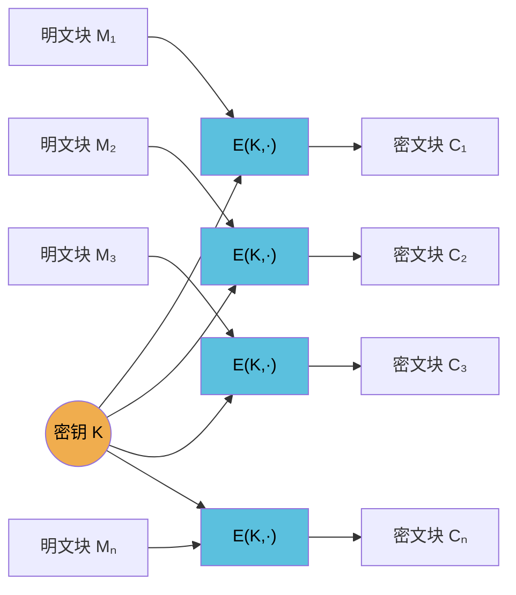

# 密码学（11）· ECB模式

> [!abstract] TL;DR
> - **ECB（Electronic Codebook，电子密码本）**：最简单的分组密码工作模式，每个明文块独立用同一密钥加密，块间完全无关联。
> - **致命缺陷**：相同明文块 → 相同密文块，数据结构和重复模式完全泄露于密文——"ECB 企鹅图"是教科书级反面案例。
> - **攻击面**：块重放、块重排、剪切-粘贴攻击；搭配频率分析可对均匀分布的密文做统计区分。
> - **结论**：除非数据确保只有单一随机块，**几乎永远不要用 ECB**。现实惨案：Adobe 2013 年密码数据库以 ECB 模式加密，直接被字典映射破解。
> - **替代**：CTR（可并行、随机访问）、GCM（带认证）、CBC（经典，但仍有填充问题）。

本篇在 [[10.分组密码工作模式总论]] 的框架下，聚焦 ECB 的原理、缺陷与现实案例，是理解"工作模式为何存在"的最佳反面教材。攻击原理与 [[60.对称密码攻击]] 呼应；正确替代见 [[12.CBC模式]] 及后续各篇。

---

## 概述与定位

工作模式是把**分组密码**（如 AES，固定处理 128 位块）扩展到**任意长度数据**的方案。[[10.分组密码工作模式总论]] 列出了 ECB、CBC、CTR、CFB、OFB、GCM 等主要模式及其设计动机。

ECB 是历史上最早、最直觉化的方案：把明文切成等长分组，对每个分组**单独加密**，密文块拼接即结果。它几乎没有额外设计开销，因此成为理解工作模式**必要性**的最佳反例——正是 ECB 的失败，揭示了为什么工作模式不能只是"把分组密码运行多次"。

### 模式速查

| 属性 | ECB |
|---|---|
| 块间依赖 | 无 |
| IV / Nonce | 不需要 |
| 加密是否可并行 | 是 |
| 解密是否可并行 | 是 |
| 随机访问解密 | 支持（任意块独立） |
| 错误传播 | 无（一块损坏只影响该块） |
| 数据模式泄露 | **严重**（相同明文块 → 相同密文块） |
| 推荐用于生产 | **否**（极少数例外见安全性节） |

---

## 原理与机制

### 加密过程

设分组大小为 `b`（AES 中 b = 128 位 = 16 字节），明文 M 被填充至 `b` 的整数倍后切分为 n 块：

```
M = M₁ ‖ M₂ ‖ … ‖ Mₙ
```

每块独立加密：

```
Cᵢ = E(K, Mᵢ)    i = 1, 2, …, n
```

密文为：

```
C = C₁ ‖ C₂ ‖ … ‖ Cₙ
```

解密是逐块做逆变换：

```
Mᵢ = D(K, Cᵢ)
```

全程只需要密钥 K，**不需要 IV、不需要计数器、不需要任何状态**。

### Mermaid 流程图



每列完全独立，**可以完全并行化**——这是 ECB 在"优点"栏几乎唯一值得一提的技术特性。

### 填充

明文长度通常不是块大小的整数倍，需要填充最后一块。ECB 通常搭配 **PKCS#7 填充**：末尾补 `p` 字节，每字节值均为 `p`（1 ≤ p ≤ b/8）。例如 AES 128 位块（16 字节），若最后一块只有 11 字节，则补 5 个 `0x05`。

> [!note] 填充预言
> PKCS#7 填充 + ECB 组合下，ECB 不存在经典 CBC Padding Oracle（块间无链式解密依赖）；其填充信息的利用方式与 CBC 不同。完整的填充预言攻击分析见 [[60.对称密码攻击]]。

---

## 优点（有限场景下确实存在）

ECB 的优点几乎全部来自其"无状态"特性：

1. **实现极简**：无 IV 生成、无链式状态维护，代码路径最短，出 Bug 的地方少。
2. **完全并行**：所有块可同时加解密，适合 SIMD/多核实现，理论吞吐量仅受硬件限制。
3. **随机访问解密**：可直接解密任意第 i 块而无需处理前 i-1 块——对加密数据库记录（每条记录是独立的单块）或加密随机访问存储有天然适配性。
4. **无错误扩散**：一个密文块损坏或丢失，**只影响对应明文块**，其余块完好解密。CBC 中一个密文位翻转会破坏两块明文。

然而，这四条优点都有不存在上述缺陷的替代方案（CTR 同样并行、随机访问；AEAD 模式提供完整性保护）。

---

## 致命缺陷

### 1. 相同明文 → 相同密文（确定性语义）

ECB 是**确定性加密**（deterministic encryption）：给定固定密钥，同一明文块永远产生同一密文块。这直接违反现代密码学对语义安全（semantic security / IND-CPA）的基本要求。

> [!danger] 定义级失败
> IND-CPA（选择明文攻击下的不可区分性）要求攻击者无法区分 `Enc(K, M₀)` 和 `Enc(K, M₁)`。ECB 在**已知明文部分相等**时会在密文中留下对应的相等密文块，直接泄露结构——这是比 IND-CPA 更强的攻击能力都不需要的泄露。

### 2. ECB 企鹅图（Tux 演示）

这是密码学史上最著名的视觉演示之一。将 Linux 吉祥物 Tux 企鹅的 BMP 图像（位图，头部固定、像素逐行排列）用 ECB 模式加密 AES：

- **现象**：加密后的图像**仍然清晰可见企鹅轮廓**。黄色喙区域对应一组重复的像素值，加密后产生一组相同的密文块，这些相同密文块在图像中仍然以相同颜色渲染——鸟的形状完好保留。
- **原因**：大面积纯色背景（白色、黑色）对应大量相同的像素块，ECB 将它们加密为相同的密文块，颜色/纹理信息被"密文等价"完整保留。
- **对比**：同一图像用 CBC 或 CTR 模式加密后，视觉上是随机噪声，无任何可辨识结构。

> [!warning] 实验说明
> 若自行复现，BMP 格式中图像头部（文件头+DIB头，通常 54 字节）并不参与像素内容的"重复块"推断，但像素数据本身的重复性已足够演示 ECB 的结构泄露。标准演示见 Wikipedia "Block cipher mode of operation" 条目中的 Tux 对比图。

该演示直观表明：**ECB 加密不隐藏数据统计结构**，任何具备重复模式的明文（图像、数据库行、协议报文）在 ECB 下都存在类似泄露。

### 3. 块重放、重排与剪切-粘贴攻击

因为每个密文块与其位置无关（无链式依赖），攻击者无需知道密钥即可操控明文语义（呼应 [[60.对称密码攻击]] 中的块操控类攻击）：

**块重放（Block Replay）**
```
加密：[用户名: alice][角色: user ]
攻击者录制管理员登录：[用户名: admin][角色: admin]
攻击者将第二块（角色: admin）替换到 alice 的会话密文中
→ 解密结果：[用户名: alice][角色: admin]
```

**块重排（Block Reordering）**
若消息格式是固定宽度字段拼接，攻击者可将密文块重新排列（如把金额字段和账号字段对调），服务端解密后得到语义扭曲的明文，且**无法检测篡改**（ECB 不提供完整性保护）。

**剪切-粘贴（Cut-and-Paste）**
攻击者注册一个名为 `admin\x0b\x0b\x0b\x0b\x0b\x0b\x0b\x0b\x0b\x0b\x0b`（凑满一块，后跟 PKCS 填充字节）的账户，获取其加密后的块，再把该块插入另一个用户 cookie 的角色字段位置，在不知道密钥的情况下制造出"角色=admin"的合法密文。

这三类攻击统一特征：**密文块的位置无语义约束，攻击者自由拼接即可操控解密语义**。

---

## 现实误用案例

### Adobe 2013 年密码数据库泄露

2013 年，Adobe 约 1.53 亿条用户数据库被泄露。安全研究人员发现 Adobe 使用 **3DES-ECB** 加密存储密码（而非哈希）。

**为什么 ECB 使问题更严重**：
- 相同密码 → 完全相同的密文。攻击者无需破解密钥，只需统计密文出现频率：最常见的密文对应最常见的密码（"123456"、"password" 等）。
- 数据库中密文字段旁边还有密码提示（password hint），研究人员结合提示和密文频率，批量还原了大量密码——完全绕过了 3DES 的加密强度。
- 即便用 AES-ECB，同样的攻击依然有效，因为问题在模式而非算法。

> [!danger] 双重错误
> 用加密代替哈希存储密码，是第一层错误（密码应哈希，不应加密）；选 ECB 模式，是第二层错误（使频率分析成为可能）。两者叠加导致在密钥不泄露的情况下，大量密码仍被还原。

### 其他常见误用场景

| 场景 | 误用方式 | 后果 |
|---|---|---|
| 数据库字段加密 | 对固定长度结构化字段用 ECB | 等值查询攻击：密文相同即明文相同，无需解密即可比对 |
| 网络协议加密 | 固定头部 + ECB 分组消息 | 头部重复产生固定密文前缀，可区分消息类型 |
| 文件加密 | 大文件 ECB 分组 | 同一文件的重复数据块（如文本中重复行）在密文层面可见 |
| 会话 Token | ECB 加密 cookie | 剪切-粘贴提权，见上文 |

---

## 安全性与正确使用

### 正式安全属性

| 安全目标 | ECB 表现 |
|---|---|
| IND-CPA（选择明文攻击不可区分） | **不满足**（确定性加密，相同明文→相同密文） |
| IND-CCA（选择密文攻击不可区分） | **不满足** |
| 完整性 / 认证 | **不提供**（无 MAC，密文可任意篡改） |
| 保密性（单块随机数据） | 满足（退化为单纯的分组密码安全性） |

### 极少数合理用途

ECB 在以下**极端受限**场景下勉强可接受：

1. **单块随机数据**：如加密一个 128 位随机数（恰好一块，无重复，无结构）。此时块间关联问题不存在。典型例子：用 AES-ECB 加密 AES 密钥本身（KEK 场景，密钥封装）——但即便如此，NIST SP 800-38F 推荐的 AES Key Wrap 用的是专用模式而非裸 ECB。
2. **构建更高层模式的原语**：CTR 模式本质上是用 ECB 加密计数器序列，再 XOR 明文。这里 ECB 是内部原语，暴露给用户的接口是 CTR，使用者永远看不到裸 ECB。

**结论：用户可见接口层，禁止使用 ECB 加密超过单块的结构化或重复数据。**

### 正确替代方案

| 需求 | 推荐模式 | 说明 |
|---|---|---|
| 通用加密（需保密） | **AES-CTR** | 流密码语义，可并行，随机访问 |
| 通用加密（需保密 + 认证） | **AES-GCM / ChaCha20-Poly1305** | AEAD，一次提供保密性与完整性 |
| 块链式（经典场景） | **AES-CBC** | 引入块间依赖，但需安全 IV；填充预言见 [[60.对称密码攻击]] |
| 磁盘/存储扇区加密 | **AES-XTS** | 专为随机访问块存储设计，无 IV 传输开销 |
| 认证加密（标准首选） | **AES-GCM** | TLS 1.3 强制要求，见 [[71.详解网络协议/15.TLS协议.md]] |

> [!warning] 关于 CBC
> CBC 解决了 ECB 的模式泄露问题，但引入了 Padding Oracle 攻击风险（详见 [[60.对称密码攻击]]）。在新系统中，应优先 AEAD 模式（GCM/ChaCha20-Poly1305），而非直接跳到 CBC。

### 代码示例：如何在 Python 中避免 ECB

```python
from Crypto.Cipher import AES
import os

key = os.urandom(32)   # AES-256，示例密钥

# ❌ 错误：ECB 模式
cipher_ecb = AES.new(key, AES.MODE_ECB)
# ct = cipher_ecb.encrypt(plaintext)  # 永远不要这样做

# ✅ 正确：GCM 模式（AEAD）
nonce = os.urandom(12)   # 96 位 nonce，示例值
cipher_gcm = AES.new(key, AES.MODE_GCM, nonce=nonce)
ciphertext, tag = cipher_gcm.encrypt_and_digest(b"Hello, World!  ")
# 传输：nonce + tag + ciphertext
```

> [!warning] 示例输出为示意
> 上述代码演示 API 用法，nonce 和密文值因随机性每次不同，不提供固定示例输出。

---

## 小结

ECB 是理解分组密码工作模式**为什么必要**的最佳反面案例：

- **原理正确，模式错误**：底层分组密码（AES、3DES）本身是安全的，但裸 ECB 使密文成为"码本查表"，相同明文块永远得到相同密文块。
- **结构泄露是根本问题**：不是密钥短，不是算法弱，是工作模式未引入随机性和块间关联，导致明文统计结构在密文中完整保留。
- **攻击无需破解密钥**：块重放、块重排、剪切-粘贴、频率分析——这些攻击都利用密文块的位置无关性，与密钥强度无关。
- **ECB 企鹅图**一句话总结：加密后仍然能看见企鹅，说明加密没有完成"隐藏信息"这件最基本的事。
- **现实惨案（Adobe 2013）**再次证明：算法强度（3DES）不能弥补模式选择错误带来的灾难性后果。

工作模式的核心价值——引入随机性（IV/Nonce）和块间依赖——正是为了避免 ECB 的这些问题。[[12.CBC模式]] 是最早解决块间依赖的方案，但它仍有自身问题；现代推荐见 [[15.AEAD原理与GCM]]。

---

## 相关阅读

- [[10.分组密码工作模式总论]] — 各工作模式的设计维度对比与选型指南
- [[12.CBC模式]] — ECB 的直接继任者，引入 IV 和链式依赖
- [[60.对称密码攻击]] — 块重放、填充预言、频率分析等攻击的完整讲解
- [[04.AES详解]] — ECB 使用的底层分组密码原理
- [[71.详解网络协议/15.TLS协议.md]] — 现代协议如何强制 AEAD 淘汰 ECB/CBC
- [[15.AEAD原理与GCM]] — 正确替代方案的完整原理

---

⬅️ 上一篇 [[10.分组密码工作模式总论]] ｜ 🏠 [[00.密码学总览]] ｜ 下一篇 [[12.CBC模式]] ➡️
