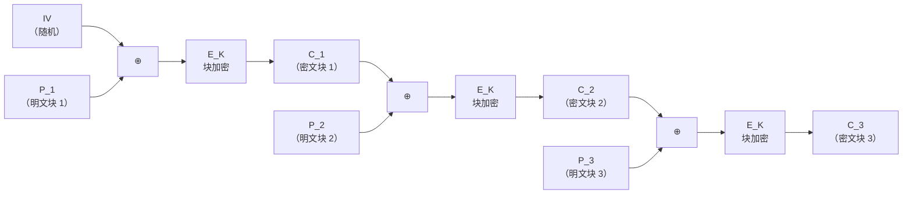
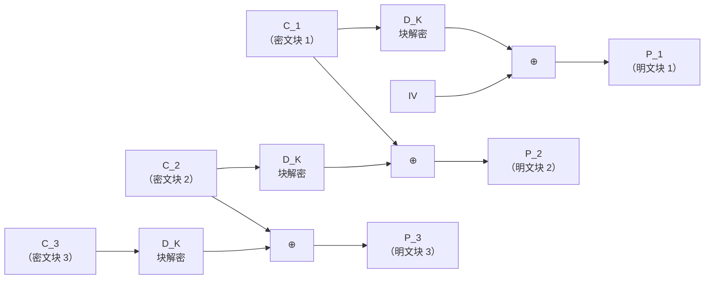
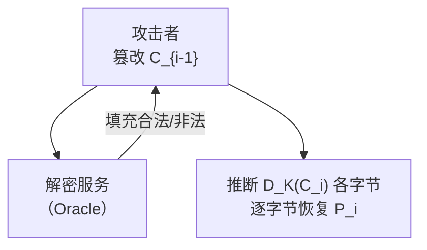
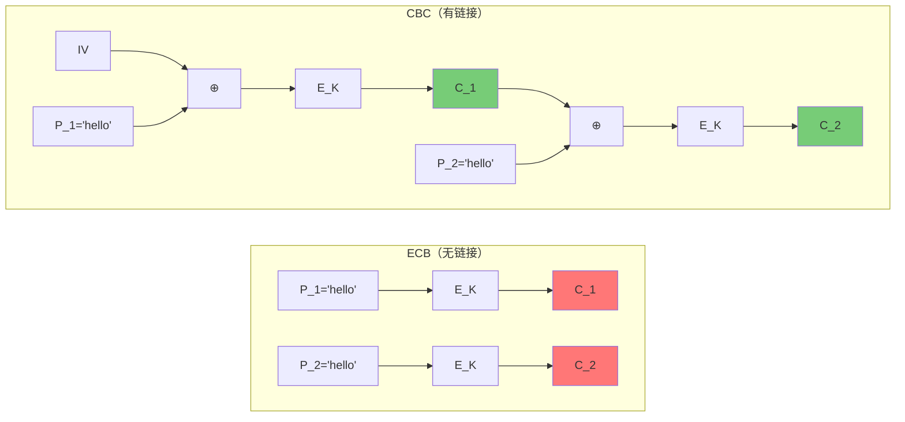

# 密码学（12）· CBC模式

> [!abstract] TL;DR
> CBC（Cipher Block Chaining，密文分组链接）是对称分组密码最经典的链式工作模式：每个明文块在加密前先与上一个密文块（或 IV）异或，使相同明文在不同上下文产生不同密文，彻底解决 [[11.ECB模式]] 的"模式泄露"问题。代价是：**加密串行、解密可并行、错误传播两个块**，且对填充攻击（Padding Oracle）和比特翻转高度敏感。现代工程中若使用 CBC，必须配 HMAC（Encrypt-then-MAC）；更推荐直接选 GCM/ChaCha20-Poly1305 等 AEAD 模式，详见 [[15.AEAD原理与GCM]]。

---

## 概述与定位

CBC 由 IBM 于 1976 年提出，是分组密码工作模式历史上使用最广泛的模式之一。TLS 1.0/1.1、早期 HTTPS、SSH 的大量实现都曾以 AES-CBC 为主力。然而，随着 BEAST 攻击（2011）、Lucky Thirteen（2013）和 POODLE（2014）相继公开，CBC 的安全假设被系统性地打破，TLS 1.3 已彻底移除 CBC 套件。

### CBC 在模式谱系中的坐标

分组密码工作模式的核心问题只有两个：**如何让相同明文块产生不同密文**，以及**如何把固定块大小扩展到任意长度数据**。[[10.分组密码工作模式总论]] 从全局视角梳理了各模式的设计取舍，本篇聚焦 CBC 的链式机制与安全边界。

| 维度 | CBC | ECB（对比）| CTR（对比）|
|---|---|---|---|
| 相同明文块 → 相同密文？| 否（依赖前驱密文）| **是（严重泄露）**| 否（依赖计数器）|
| 加密并行性 | 串行 | 并行 | 并行 |
| 解密并行性 | **并行** | 并行 | 并行 |
| 需要填充 | 是（PKCS#7）| 是 | 否（流化）|
| 错误传播 | 2 个块 | 1 个块 | 1 个块内对应位 |
| 安全隐患 | Padding Oracle、比特翻转 | 模式泄露 | Nonce 重用 |

---

## 原理与机制

### 核心公式

CBC 的思路极简：在每个分组进入块密码加密引擎之前，先把它与**前一个密文块**异或。第 0 号"前驱密文"是人为引入的初始化向量（IV）。

**加密**（`E_K` 表示以密钥 K 做块加密）：

```
C_0 = IV
C_i = E_K(P_i ⊕ C_{i-1})    (i = 1, 2, ..., n)
```

**解密**（`D_K` 表示以密钥 K 做块解密）：

```
P_i = D_K(C_i) ⊕ C_{i-1}    (i = 1, 2, ..., n)
C_0 = IV
```

关键洞察：

- 解密时，`D_K(C_i)` 与 `C_{i-1}` 都已知——`C_{i-1}` 来自密文流，不依赖前面分组的解密结果——所以各块可**并行**解密，然后各自异或前驱密文得到明文。
- 加密时，`C_{i-1}` 必须在 `C_i` 生成后才能用于生成 `C_{i+1}`，因此加密**严格串行**。

### CBC 加密链路（Mermaid）



### CBC 解密链路（Mermaid）



---

## 算法流程与结构详解

### 初始化向量（IV）

IV 是 CBC 模式的"链头"，与块大小等长（AES-CBC 为 128 位 = 16 字节）。IV 本身不保密（通常随密文一起传输），但**必须满足两个条件**：

1. **每次加密随机生成**：若相同 IV 配相同密钥加密两条消息，攻击者一旦发现两条密文开头相同，就知道两条消息的第一个明文块相同，部分信息泄露。
2. **不可预测**（对 CPA 安全至关重要）：若 IV 对攻击者在加密前可预测，BEAST 攻击即可成立（详见"安全隐患"节）。

> [!warning] 不要复用 IV
> 密钥不变、IV 复用是 CBC 最常见的误用，会导致结构性明文泄露。每次加密必须用 `CSPRNG` 生成新鲜 IV，绝不使用固定 IV、计数器 IV 或可预测 IV。

### PKCS#7 填充

分组密码要求明文长度是块大小的整数倍（AES 为 16 字节）。明文长度不满时，使用 **PKCS#7** 填充：

- 设末尾差 `n` 个字节（`1 ≤ n ≤ 16`），则填充 `n` 个值为 `n` 的字节。
- 若明文恰好是块大小的倍数，仍需追加一个全为 `0x10`（16）的填充块，使解密时能无歧义地剥离填充。

```
明文：[AA BB CC DD]      （4 字节）
块大小：16 字节，差 12 字节
填充后：[AA BB CC DD | 0C 0C 0C 0C 0C 0C 0C 0C 0C 0C 0C 0C]
              （0C = 12 的十六进制）
```

```
明文：[... 16 字节整块]
填充后：[... 16 字节] + [10 10 10 10 10 10 10 10 10 10 10 10 10 10 10 10]
              （额外一整块填充，值全为 0x10 = 16）
```

解密后，读取最后一个字节的值 `n`，校验末尾 `n` 个字节是否均为 `n`，合法则剥离，否则报填充错误——这个"填充校验"正是 Padding Oracle 攻击的着力点。

### 加密伪代码

```python
# CBC 加密
def cbc_encrypt(key, iv, plaintext):
    blocks = pkcs7_pad(plaintext, BLOCK_SIZE)  # 按块大小填充
    ciphertext = []
    prev = iv
    for block in blocks:
        xored = xor_bytes(block, prev)          # P_i ⊕ C_{i-1}
        cipher_block = block_encrypt(key, xored) # E_K(...)
        ciphertext.append(cipher_block)
        prev = cipher_block                      # 更新链接状态
    return iv + b''.join(ciphertext)            # IV 随密文前缀传输
```

### 解密伪代码

```python
# CBC 解密
def cbc_decrypt(key, ciphertext):
    iv = ciphertext[:BLOCK_SIZE]
    blocks = chunks(ciphertext[BLOCK_SIZE:], BLOCK_SIZE)
    plaintext = []
    prev = iv
    for block in blocks:
        decrypted = block_decrypt(key, block)    # D_K(C_i)
        plain_block = xor_bytes(decrypted, prev) # ⊕ C_{i-1}
        plaintext.append(plain_block)
        prev = block                             # 注意：是密文块，非明文块
    return pkcs7_unpad(b''.join(plaintext))
```

### 错误传播

CBC 的错误传播特性对可靠性与攻击分析都很重要：

| 错误类型 | 影响范围 | 后续块 |
|---|---|---|
| 密文块 `C_i` 中 1 位翻转 | 解密 `P_i` 完全乱码（因 `D_K` 是混淆块整体） | `P_{i+1}` 中**对应位翻转**（仅异或那一位），之后恢复 |
| 密文块丢失 | 后续所有块错位 | 不可恢复 |

> [!tip] 一个块出错 → 两个块受影响
> `C_i` 损坏：`P_i` 全错（D_K 输入变了），`P_{i+1}` 中对应比特被翻转（前驱异或链错了），从 `P_{i+2}` 开始正常恢复——因为 `C_{i+1}` 未受损。

---

## 安全隐患与攻击

### 1. Padding Oracle 攻击

Padding Oracle 是针对 CBC 最具威胁性的攻击，由 Serge Vaudenay 于 2002 年提出。详细原理见 [[60.对称密码攻击]]，此处给出直觉：

**攻击前提**：
- 攻击者能提交任意密文给解密端；
- 解密端对"填充是否合法"的反馈可被观察（时序差异、错误码差异、HTTP 响应差异均可）。

**攻击过程（以一个块为例）**：

设目标密文块为 `C_i`，其前驱为 `C_{i-1}`，攻击者想恢复 `P_i`：

1. 篡改 `C_{i-1}` 的最后一字节，发给解密端，观察填充是否合法。
2. 当 `D_K(C_i)[15] ⊕ modified_byte == 0x01` 时，填充合法（单字节填充 `0x01`）。
3. 由此推出 `D_K(C_i)[15]`，再异或原始 `C_{i-1}[15]` 得到 `P_i[15]`。
4. 继续推导倒数第 2 字节……直至还原整个块。

每字节最多需要 256 次查询，16 字节的块最多 `16 × 256 = 4096` 次请求即可还原——完全无需密钥。



**历史案例**：ASP.NET ViewState（2010，POET/CBC-R）、POODLE（SSL 3.0，2014）、Lucky Thirteen（TLS CBC，基于时序，2013）。

**防御**：
- 使用 AEAD（GCM、ChaCha20-Poly1305）完全规避；
- 若必须用 CBC，采用 **Encrypt-then-MAC**（先加密，后对密文+IV 计算 HMAC），并用**常量时间**比较 MAC——不要 MAC-then-Encrypt；
- 填充校验失败时，保证与其他错误**完全等时**响应（抵御时序 Oracle）。

### 2. 比特翻转篡改

CBC 解密时，篡改 `C_{i-1}` 会使 `P_{i-1}`（即对应块）完全乱码，但 `P_i` 中与篡改位精确对应的比特被翻转——**这正是攻击目标**：牺牲前一块的可读性，换取对目标块指定位的精确控制。

攻击者若知道部分明文结构（例如 JSON 字段名、表单值位置），可精确篡改 `C_{i-1}` 让目标字段在解密后变成期望值——**无需密钥**即可"定制"解密结果。

```
原始密文：... | C_{i-1} | C_i | ...
篡改后：  ... | C'_{i-1}| C_i | ...
解密结果：... | P'_i（乱码，但攻击者可能不在乎）| P_{i+1}（被精确篡改）| ...
```

**防御**：同上——AEAD 或 Encrypt-then-MAC，MAC 校验不通过立即拒绝，不解密。

### 3. 可预测 IV 与 BEAST 攻击

BEAST（Browser Exploit Against SSL/TLS，2011）针对 TLS 1.0 的 IV 预测性：TLS 1.0 使用上一条记录的**最后一个密文块**作为下一条记录的 IV，攻击者可以预测 IV，从而实施选择明文攻击（CPA），最终恢复 HTTPS Cookie。

TLS 1.1 通过为每条记录生成**随机 IV** 修复了此问题；TLS 1.3 直接废弃了 CBC。

> [!warning] IV 必须不可预测
> "每次随机"还不够——IV 必须在加密**之前**对攻击者不可预测。若攻击者能在提交明文前得知 IV，则 CPA 安全性完全失效。

---

## 与 ECB 的核心对比

[[11.ECB模式]] 最大的缺陷是"相同明文块 → 相同密文块"，导致结构信息泄露（企鹅图攻击）。CBC 的链式异或完全消除了这一缺陷：



两个相同的 `"hello"` 块：ECB 产生相同密文（红色），CBC 产生不同密文（绿色），因为第二块加密前混入了 `C_1`。

---

## 安全性与正确使用

### 参数选择

| 参数 | 推荐值 | 说明 |
|---|---|---|
| 底层分组密码 | AES-128 / AES-256 | 不要用 DES / 3DES |
| 块大小 | 128 位（AES） | 64 位块密码（DES/Blowfish）在 CBC 下有 SWEET32 攻击 |
| IV 长度 | 等于块大小（16 字节）| |
| IV 生成 | `os.urandom(16)` / `RAND_bytes()` | 必须 CSPRNG，不能是固定值或计数器 |
| 填充方案 | PKCS#7 | 唯一标准选择 |
| 完整性保护 | HMAC-SHA256（Encrypt-then-MAC）| 或直接换 GCM/ChaCha20-Poly1305 |

### 已知弱点汇总

| 攻击 | 前提 | 后果 | 缓解 |
|---|---|---|---|
| Padding Oracle | 解密端泄露填充合法性 | 无密钥解密任意密文 | AEAD 或 E-t-M + 常量时间校验 |
| 比特翻转 | 无完整性保护 | 篡改明文指定字段 | MAC/AEAD |
| BEAST | TLS 1.0 可预测 IV | CPA，恢复 Cookie | 随机 IV（TLS 1.1+） |
| SWEET32 | 64 位块密码 + 大量数据 | 生日攻击 | 改用 AES（128 位块） |
| Lucky Thirteen | TLS CBC 时序侧信道 | 填充 Oracle 变种 | 常量时间 MAC 校验 |

### 正确使用建议

> [!success] 最佳选择：直接用 AEAD
> 现代系统应优先选择 **AES-GCM** 或 **ChaCha20-Poly1305**，它们同时提供机密性与完整性，不存在 Padding Oracle 问题，API 也更简洁。详见 [[15.AEAD原理与GCM]]。

若遗留系统必须使用 CBC：

1. **底层算法**：AES（128 位块），拒绝 3DES。
2. **IV**：每次加密用 CSPRNG 生成，随密文一起发送，不复用。
3. **完整性**：Encrypt-then-MAC 模式——先用 AES-CBC 加密，再对 `(IV || 密文)` 计算 `HMAC-SHA256`，接收方先验 MAC（常量时间比较）再解密。
   ```
   发送方：
     ciphertext = AES_CBC_encrypt(key_enc, iv, plaintext)
     tag = HMAC_SHA256(key_mac, iv || ciphertext)
     send(iv || ciphertext || tag)

   接收方：
     verify tag（常量时间）→ 失败则丢弃，不解密
     plaintext = AES_CBC_decrypt(key_enc, iv, ciphertext)
   ```
4. **密钥分离**：加密密钥 `key_enc` 与 MAC 密钥 `key_mac` 独立，从同一主密钥用 KDF 派生。
5. **安全边界**：AES-CBC 下同一密钥加密数据量不超过 2^32 块（约 64 GB），超过则轮换密钥（生日界）。

---

## 小结

CBC 用"前驱密文异或"这一简洁机制解决了 ECB 的模式泄露问题，是分组密码链式工作模式的经典设计。其核心属性：

- **加密公式** `C_i = E_K(P_i ⊕ C_{i-1})`，`C_0 = IV`；
- **解密公式** `P_i = D_K(C_i) ⊕ C_{i-1}`，加密串行、解密并行；
- **IV 必须随机且不可预测**——可预测 IV 导致 BEAST 等 CPA 攻击；
- **PKCS#7 填充**处理非块对齐数据，但填充校验信息一旦泄露即触发 Padding Oracle；
- **无内置完整性**，比特翻转可精确篡改明文，必须配 MAC（Encrypt-then-MAC）；
- 现代工程应直接采用 AEAD 模式（GCM、ChaCha20-Poly1305），CBC 仅在维护遗留系统时使用。

---

## 相关阅读

- [[10.分组密码工作模式总论]] — IV/nonce 设计、模式选型全局视角
- [[11.ECB模式]] — CBC 对比基准，了解"为何需要链式"
- [[13.CTR模式]] — 计数器模式，加解密均并行，无需填充
- [[14.CFB与OFB模式]] — 自同步流化模式
- [[15.AEAD原理与GCM]] — CBC 的现代替代，同时提供加密与完整性
- [[60.对称密码攻击]] — Padding Oracle、比特翻转、BEAST 等攻击的完整原理

---

⬅️ 上一篇 [[11.ECB模式]] ｜ 🏠 [[00.密码学总览]] ｜ 下一篇 [[13.CTR模式]] ➡️
