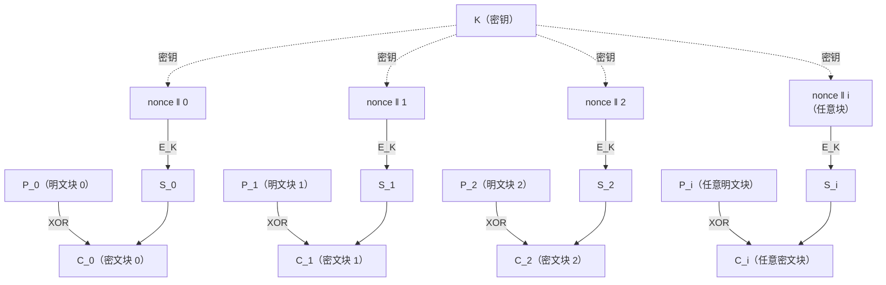
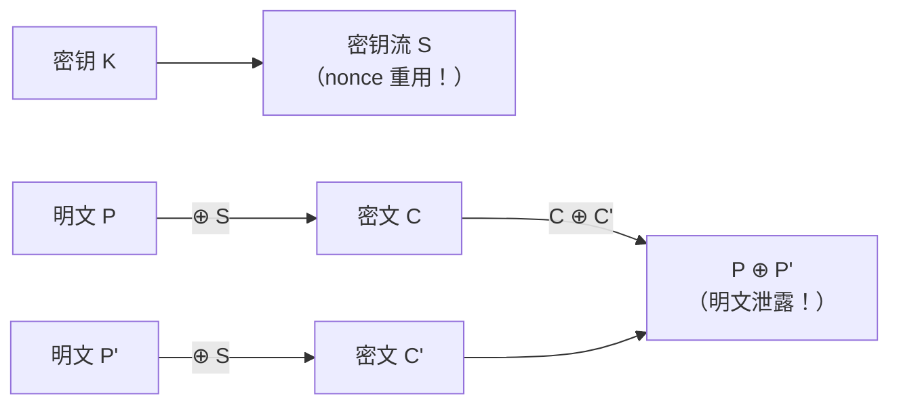

# 密码学（13）· CTR模式

> [!abstract] TL;DR
> - CTR（Counter Mode，计数器模式）把分组密码变成**同步流密码**：每个块对 `nonce‖counter` 加密，得到密钥流块；明文与密钥流异或即得密文，解密完全相同。
> - **最大优势**：加/解密均可**完全并行**、支持**随机访问（seek）**、无需填充、加解密使用同一函数（只需正向 `E_K`）、比特错误不传播。
> - **最大安全要求**：同一密钥下，`(nonce, counter)` 对**绝不能重复**——重用密钥流会让两段密文异或泄露明文（Two-Time Pad 之灾）。
> - CTR 本身**不提供完整性**；实践中应使用 GCM（CTR + GHASH MAC），详见 [[15.AEAD原理与GCM]]。

本篇属于「分组密码工作模式」子系列，是 [[10.分组密码工作模式总论]] 的第四个具体模式。读者应先掌握 [[12.CBC模式]] 所代表的"反馈链接"思路，再对比 CTR 的"密钥流并行"路线。

---

## 概述与定位

### 从分组到流：CTR 的核心思想

CBC、ECB 这类模式直接对明文分组做加密，明文与密文之间存在"结构对应"——填充、串行依赖、解密需逆函数，种种约束都源于此。

CTR 换了一个思路：**不加密明文，而加密一个单调递增的计数器序列**，把密文分组作为密钥流；明文只做一步 XOR。这样的设计：

1. 密钥流块彼此**独立**（第 `i` 块只依赖 `i` 本身，不依赖前块），天然并行。
2. 分组密码只需**正向 `E_K`**，无需逆函数 `D_K`——对只实现加密方向的硬件或加速指令尤其友好。
3. 输出为比特流，**不要求明文长度对齐分组**，末尾截取所需长度即可，无需填充。
4. 单比特密文错误只影响对应明文位，**不传播**到其他块（与 CBC 截然相反）。

> [!info] "CTR 把分组密码变成流密码"
> 这句话值得细品：经典流密码（如 RC4）直接生成密钥流；CTR 借助分组密码的伪随机置换能力生成密钥流。两者在外部接口上完全等价，但 CTR 的安全性继承自底层分组密码（通常是 AES），而非流密码自身的设计。

### 在工作模式版图中的位置

| 模式 | 密文依赖链 | 并行（加密）| 并行（解密）| 随机访问 | 需填充 |
|------|-----------|------------|------------|----------|--------|
| ECB  | 无         | ✓          | ✓          | ✓        | ✓      |
| CBC  | 有（链接） | ✗          | ✓          | 解密可   | ✓      |
| CTR  | 无         | ✓          | ✓          | ✓        | ✗      |
| CFB  | 有         | ✗          | ✓          | 解密可   | ✗      |
| OFB  | 有         | ✗          | ✗          | ✗        | ✗      |

CTR 在并行性与随机访问两项上独占最高分，代价是必须严格管理 nonce 唯一性。

---

## 原理与机制

### 密钥流生成：核心公式

设分组密码为 `E_K`，分组长度为 `n` 位（AES 取 128 位）。

```
密钥流块 i：  S_i = E_K(nonce ‖ counter_i)
密文块 i：    C_i = P_i ⊕ S_i
解密：        P_i = C_i ⊕ S_i     （与加密公式完全相同）
```

- `nonce`：本次加密会话的唯一值，典型 96 位（GCM 标准）或 64 位，不要求随机，但**在同一密钥下必须唯一**。
- `counter_i`：从初始值（通常 0 或 1）单调递增的整数，通常 32 位或 64 位（具体分配由 nonce 与 counter 的拼接方案决定）。
- `‖`：拼接，合计恰好等于分组长度 `n`。

AES-128 最常见的格式（符合 NIST SP 800-38A 及 GCM 惯例）：

```
128 位输入块 = [ 96 位 nonce | 32 位 counter ]
              |←————— T（T 块，T = ceil(len/128)）————→|
```

counter 从 1 递增（GCM 规范；有些实现从 0 起）。32 位 counter 支持最多 2^32 × 16 = 64 GiB 单次加密，充分覆盖绝大多数场景。

### 加解密完全对称

```
加密：C_i = P_i ⊕ E_K(nonce ‖ i)
解密：P_i = C_i ⊕ E_K(nonce ‖ i)
```

同一条公式，换入密文即解密——实现时加解密共用同一代码路径，软件/硬件复杂度减半。

### Mermaid：CTR 加密流程



> [!note] 并行箭头
> 上图中每列密钥流块 `S_i` 的生成**彼此无依赖**，可以同时投入多核/多 AES-NI 管道并发计算；CBC 那条"前块密文 → 后块 IV"的串行链在 CTR 中完全消失。

---

## 算法流程与伪代码

### 加密

```
输入：明文 P（任意长度），密钥 K，nonce N（96 位示例）
输出：密文 C（长度同 P）

1. 将 P 分割为块：P_0, P_1, ..., P_{T-1}，最后一块可能不足 128 位
2. 对每个 i = 0, 1, ..., T-1（**可并行**）：
   a. ctr_block = N ‖ (i + 1)                  // 拼接 nonce 和计数器（GCM 惯例从 1 起）
   b. keystream  = E_K(ctr_block)               // 调用分组密码正向加密
   c. C_i = P_i ⊕ keystream[0 : len(P_i)]      // XOR，末块截取实际长度
3. 输出 C = C_0 ‖ C_1 ‖ ... ‖ C_{T-1}
```

### 解密

```
输入：密文 C，密钥 K，nonce N
输出：明文 P

// 完全相同——只需把 C_i 代入步骤 2c 右边
对每个 i（**可并行**）：
   P_i = C_i ⊕ E_K(N ‖ (i + 1))[0 : len(C_i)]
```

### 随机访问（seek）

CTR 最独特的能力之一：若要解密从第 `s` 字节开始的 `l` 字节，只需：

```
i_start = s / 16          // 块索引（整除）
byte_off = s mod 16       // 块内字节偏移

生成从 i_start 开始的密钥流，跳过前 byte_off 字节，取所需长度 XOR 即可
```

这使 CTR 天然适合**加密大文件的随机读写**、**网络协议的乱序重组**、**磁盘扇区独立解密**（不过磁盘场景通常用 XTS，见 [[17.CCM与OCB与XTS]]）。

---

## 代码与示例

以 Python 3 + `cryptography` 库为例（AES-128-CTR，示例值）：

```python
from cryptography.hazmat.primitives.ciphers import Cipher, algorithms, modes
import os

key   = bytes.fromhex("2b7e151628aed2a6abf7158809cf4f3c")  # 示例 AES-128 密钥
nonce = os.urandom(12)                                       # 96 位随机 nonce

plaintext = b"Hello, CTR Mode! No padding needed."

# 加密
cipher = Cipher(algorithms.AES(key), modes.CTR(nonce + b"\x00\x00\x00\x01"))
encryptor = cipher.encryptor()
ciphertext = encryptor.update(plaintext) + encryptor.finalize()

# 解密（同一 nonce）
cipher2 = Cipher(algorithms.AES(key), modes.CTR(nonce + b"\x00\x00\x00\x01"))
decryptor = cipher2.decryptor()
recovered = decryptor.update(ciphertext) + decryptor.finalize()

assert recovered == plaintext
```

> [!warning] 示例输出为示意
> 密文为随机字节，每次运行因 nonce 不同而相异。上例中 `nonce + b"\x00\x00\x00\x01"` 手动拼接 128 位初始计数块（counter 从 1 起），实际库封装通常已处理计数器递增。

### OpenSSL 命令行

```bash
# 加密（nonce 以 hex 形式拼入 -iv，前 96 位是 nonce，后 32 位是初始 counter）
openssl enc -aes-128-ctr \
  -K  2b7e151628aed2a6abf7158809cf4f3c \
  -iv 000102030405060708090a0b00000001 \
  -in plaintext.bin -out ciphertext.bin

# 解密（命令完全相同，加 -d 参数）
openssl enc -aes-128-ctr -d \
  -K  2b7e151628aed2a6abf7158809cf4f3c \
  -iv 000102030405060708090a0b00000001 \
  -in ciphertext.bin -out recovered.bin
```

> [!warning] 示例输出为示意
> OpenSSL `-iv` 字段直接对应 128 位初始计数块，前 96 位为 nonce（示例），后 32 位为初始 counter（`00000001`）。

---

## 攻击与误用：密钥流重用

### Two-Time Pad：CTR 的头号杀手

CTR 的本质是把分组密码包装成流密码。流密码的核心规则——**同一密钥的密钥流绝不能使用两次**——在 CTR 中化身为：

> **同一密钥 K 下，任何两条消息不得使用相同的 `(nonce, counter)` 对。**

若违反此规则，攻击者截获两条密文 C 和 C'：

```
C  = P  ⊕ S
C' = P' ⊕ S      （S 相同，因为 nonce 重用）

C ⊕ C' = P ⊕ P'
```

两段密文异或直接给出**两段明文的异或**。结合英文/协议字节的统计规律，攻击者可以以极低成本还原明文——这正是 **Two-Time Pad**（"两次一密之灾"），是古老的 Vernam 密码被重用时的同款败局。关于对称密码攻击的系统分析，参见 [[60.对称密码攻击]]。



### 计数器回绕

若 counter 位数不足且消息过长，counter 回到 0 时密钥流与 nonce=0 起点处重叠。AES-CTR 的 32 位 counter 支持 2^32 个块（64 GiB），一般场景安全；若单次加密超过此限制，必须增大 counter 宽度或改用支持更大 counter 的规格。

### 伪造风险：无完整性

CTR 不包含任何 MAC 或认证机制。攻击者若知道明文的某些字节（甚至仅知部分），可以**精确翻转对应的密文比特**，篡改内容：

```
C_i[j] ^= (P_i[j] ^ P'_i[j])   // 用已知明文字节实施翻转攻击
```

这意味着**裸 CTR 不能单独用于需要完整性保护的场景**，必须配合 MAC（如 HMAC-SHA256 的 Encrypt-then-MAC 结构）或直接升级到 GCM。

---

## CTR 是 GCM 的基础

GCM（Galois/Counter Mode）= **AES-CTR** + **GHASH 认证**：

```
GCM 加密：
  C_i    = P_i ⊕ E_K(nonce ‖ counter_i)   ← 这就是 CTR
  Tag    = GHASH_H(AAD ‖ ciphertext) ⊕ E_K(nonce ‖ 0)   ← 这是 Galois field MAC
```

GCM 保留了 CTR 的全部优点（并行、无填充、随机访问），并在其上叠加了 Galois field 乘法构成的认证标签——一举解决 CTR 的完整性缺失问题。详见 [[15.AEAD原理与GCM]]。

> [!tip] 实践建议
> 除非有充分理由，**优先选 AES-GCM 而非裸 AES-CTR**。GCM 超集了 CTR 的所有性能优势，同时提供加密+认证一体保障。

---

## 安全性与正确使用

### nonce 管理：随机 vs 计数

| 策略 | 适用场景 | 风险 |
|------|---------|------|
| **随机 nonce**（CSPRNG，96 位）| 无状态服务、多发送方 | 生日悖论：约 2^48 条消息后碰撞概率达 1%；AES-GCM 实践上限约 2^32 条（NIST 建议）|
| **计数器 nonce**（从 0 单调递增）| 单一有状态发送方 | 状态不持久（崩溃/重启）时可能重用；分布式场景需协调 |
| **KDF 派生 nonce**（从会话密钥 + 序号派生）| TLS 等有记录序号的协议 | 依赖记录层序号的唯一性（TLS 1.3 即此路线）|

无论哪种策略，**nonce 不需要保密，但必须唯一**。可以随密文明文传输。

### 参数选择（AES-CTR）

| 参数 | 推荐值 | 说明 |
|------|--------|------|
| 底层密码 | AES-128 / AES-256 | AES-192 性能无优势，通常跳过 |
| nonce 长度 | 96 位（GCM 标准）或 64 位 | 96+32=128 bits 恰好一个分组 |
| counter 起始 | 1（GCM 规范）或 0（其他实现）| 两端保持一致即可 |
| counter 宽度 | 32 位（GCM 限单次 64 GiB）| 超大数据流可用 64 位 counter（牺牲 nonce 宽度）|
| 最大加密量 | AES-GCM：单 nonce 下 2^32-2 块 | 超出须轮换 nonce 或密钥 |

### 错误使用清单

```
✗ 同一 (K, nonce) 加密两条不同消息          → Two-Time Pad，明文泄露
✗ counter 固定不递增（每块都加密同一 nonce‖0）→ 所有块密钥流相同，同 ECB 加密同块输出相同
✗ 用 CTR 裸加密，不加 MAC                   → 遭比特翻转攻击，可篡改任意字节
✗ 在分布式系统中用全局计数器但不加锁        → 并发写导致 nonce 重用
✗ nonce 以固定值 0x000000... 硬编码         → 多密钥下如密钥泄露即 nonce 重用
```

### 推荐使用路线

- **需要加密 + 认证** → AES-GCM（底层即 CTR，且携带 Tag）
- **需要高性能软件 + 认证** → ChaCha20-Poly1305（见 [[16.ChaCha20-Poly1305]]）
- **仅加密（已外置 MAC）** → AES-CTR + HMAC-SHA256（Encrypt-then-MAC 顺序）
- **磁盘扇区加密** → XTS-AES（见 [[17.CCM与OCB与XTS]]）

---

## 小结

CTR 模式用一句话概括：**对计数器序列加密，用密钥流与明文 XOR**。

它的工程价值极高：

- **并行**：加解密块间无依赖，可充分利用多核和 AES-NI 流水线。
- **seek**：任意块独立计算，支持大文件随机读写。
- **简洁**：只需 `E_K`，加解密代码路径合一，无填充烦恼。
- **错误不传播**：单比特翻转只影响对应明文位。

但这些优点全部建立在**严格 nonce 管理**之上。一旦 nonce 重用，CTR 退化为 Two-Time Pad，后果灾难性。现代实践几乎总选 **GCM**（= CTR + GHASH）而非裸 CTR，以一并解决完整性缺失的问题。理解 CTR 原理，正是理解 GCM 的必要前提。

---

## 相关阅读

- [[10.分组密码工作模式总论]] —— 模式选型总论，并行性/随机访问/填充对比表
- [[12.CBC模式]] —— 串行链接范式，与 CTR 并行范式对比
- [[14.CFB与OFB模式]] —— 另两种流化模式，OFB 同样先生成密钥流
- [[15.AEAD原理与GCM]] —— CTR + GHASH = GCM，认证加密的工程标准
- [[16.ChaCha20-Poly1305]] —— 软件友好 AEAD，ChaCha20 本质也是 counter 流密码
- [[60.对称密码攻击]] —— Two-Time Pad、比特翻转攻击等系统分析

---

⬅️ 上一篇 [[12.CBC模式]] ｜ 🏠 [[00.密码学总览]] ｜ 下一篇 [[14.CFB与OFB模式]] ➡️
