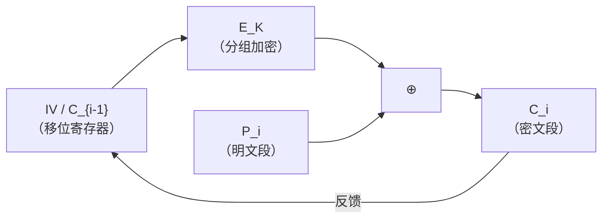
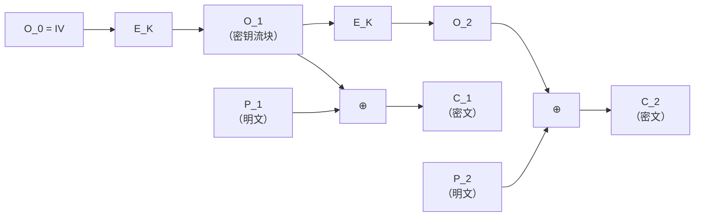
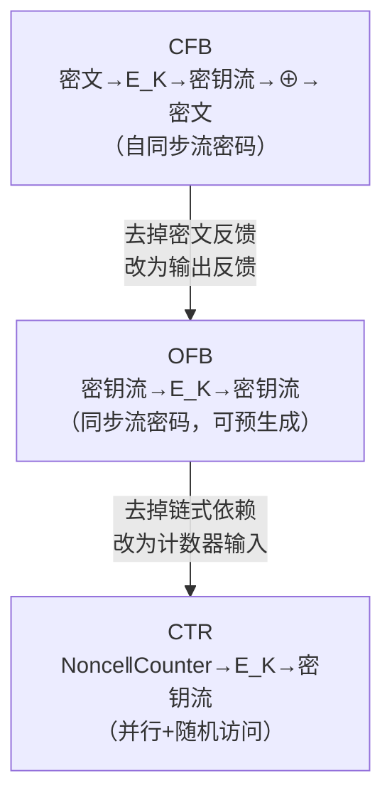

# 密码学（14）· CFB与OFB模式

> [!abstract] TL;DR
> - **CFB（Cipher Feedback，密文反馈）**：`C_i = P_i ⊕ E_K(C_{i-1})`，C_0 = IV。把分组密码变成**自同步流密码**——密钥流依赖前一个密文块，丢失若干密文后能自行恢复同步；错误传播有限。
> - **OFB（Output Feedback，输出反馈）**：`O_i = E_K(O_{i-1})`，`C_i = P_i ⊕ O_i`，O_0 = IV。密钥流完全独立于明/密文，是**同步流密码**；错误不传播，但密钥流可预生成；IV 必须唯一且 O 序列不可重复。
> - **两者共性**：加解密都只调用加密方向 `E_K`，天然适合没有解密接口的硬件；不能并行加密（每步依赖前步输出）；现代场景已被 CTR/GCM 替代，了解其原理主要服务于遗留系统分析与密码学学习。

本篇承接 [[13.CTR模式]] 对"把分组密码变流密码"路线的讨论，聚焦另外两条历史路线——CFB 与 OFB。与 [[12.CBC模式]] 同为需要 IV 的链式模式，但反馈对象不同、安全属性截然有别。宏观选型见 [[10.分组密码工作模式总论]]。

---

## 概述与定位

### 历史背景

CFB 与 OFB 都是 NIST SP 800-38A 定义的标准工作模式，设计年代早于 CTR 被广泛推广之前。其核心动机：**在仅拥有分组密码加密方向的前提下，构造流密码语义**——允许加密任意长度数据，无需块对齐填充。

两种模式在 TLS 1.0/1.1（AES-128-CFB/OFB）、SSH 早期实现、磁盘/串口通信硬件中广泛出现。理解它们不仅是历史回顾，更是分析遗留协议（含若干 CTF 场景）的基础。

### 在工作模式谱系中的位置

| 维度 | ECB | CBC | CFB | OFB | CTR |
|---|---|---|---|---|---|
| 流密码语义 | 无 | 无 | 是 | 是 | 是 |
| 加密可并行 | 是 | 否 | 否 | 否 | **是** |
| 解密可并行 | 是 | **是** | **是** | 否 | **是** |
| 随机访问 | 是 | 否 | 否 | 否 | **是** |
| 错误传播 | 1块 | 本块+1块 | 本块+s位 | **不传播** | 仅对应位 |
| 需要 E_K 方向 | 加/解 | 加/解 | **只加** | **只加** | **只加** |
| IV 唯一性 | 不需 | 每次不同 | 每次不同 | **每次不同且 O 不可重** | 每次不同 |

---

## 原理与机制

### CFB——密文反馈（Cipher Feedback）

#### 核心思想

CBC 用"前密文块"异或**明文**后再加密；CFB 用"前密文块"先加密得到密钥流，再异或**明文**得到密文——反馈进去的是**密文**，故称"密文反馈"。

```
数学定义（CFB-128，整块反馈）：

  C_0 = IV                   （初始向量，长度 = 分组长度 b 位）
  C_i = P_i ⊕ E_K(C_{i-1})  （i = 1, 2, …）

解密：
  P_i = C_i ⊕ E_K(C_{i-1})  （同样只用 E_K）
```

注意加密和解密公式对称——都只调用 `E_K`（加密方向），这是 CFB/OFB 的共同特征。

#### CFB-s 分段模式

标准允许每次只反馈 s 位（s = 1、8、64、128），常见的 **CFB-8** 每次处理 1 字节：

```
CFB-s 模式（移位寄存器语义）：

  SR_0 = IV                         （b 位移位寄存器，b = 分组大小）
  对每个 s 位输入段 P_i：
    O_i = E_K(SR_{i-1})             （加密移位寄存器，取前 s 位为密钥流段）
    C_i = P_i ⊕ MSB_s(O_i)        （XOR 高 s 位）
    SR_i = (SR_{i-1} << s) | C_i   （把新密文 s 位移入寄存器低端）
```

CFB-1（逐位）提供最细粒度，CFB-8 与串口/字节流硬件对齐，CFB-128 退化为整块处理。

#### CFB 数据流图



> [!info] 自同步特性
> 密钥流由前密文块决定，接收方只要收到足够多的正确密文块（= b/s 个），即可自动重建密钥流状态，**无需带外同步**。这在早期不可靠信道（如卫星链路）中是显著优势。

#### 错误传播

CFB-128 中，若 `C_i` 中某位翻转：

- **本块 `P_i`**：解密时直接 XOR 错误 `C_i`，对应位错误。
- **下一块 `P_{i+1}`**：`E_K(C_i)` 输入错误，整个输出块全乱。
- **再之后**：错误密文被移出移位寄存器，自动恢复正常。

CFB-s 时，错误影响 1+ceil(b/s) 个段，之后自愈。

---

### OFB——输出反馈（Output Feedback）

#### 核心思想

OFB 把反馈路径从密文侧移到**加密器输出侧**，密钥流完全独立于明/密文：

```
数学定义（OFB）：

  O_0 = IV                   （初始向量）
  O_i = E_K(O_{i-1})        （密钥流块，仅由 IV 和 K 决定）
  C_i = P_i ⊕ O_i           （加密）
  P_i = C_i ⊕ O_i           （解密，公式相同）
```

密钥流序列 `O_1, O_2, …` 与明文、密文毫无关系——可以**在明文到来之前预先生成**，适合高延迟计算环境（如卫星通信预计算密钥流）。

#### OFB 数据流图



#### 错误传播

OFB 密钥流独立，密文位翻转只影响解密时对应明文位——**错误不传播**。这既是优点（抗误码信道），也是弱点：攻击者翻转密文的已知位，可精确篡改明文对应位，即典型的**位翻转攻击（Bit-Flipping Attack）**——与流密码的共通弱点相同，需要在 OFB 外层叠加完整性保护（MAC）。

---

## 算法流程与伪代码

### CFB-128 加密

```
function CFB128_Encrypt(K, IV, P[1..n]):
  C[0] = IV
  for i = 1 to n:
    ks = E_K(C[i-1])        // 密钥流块
    C[i] = P[i] XOR ks      // XOR 整块
  return C[1..n]
```

### CFB-128 解密

```
function CFB128_Decrypt(K, IV, C[1..n]):
  // 解密可并行（每个 C[i] 的解密只需 C[i-1]，可同时计算所有 E_K(C[i-1])）
  C[0] = IV
  for i = 1 to n:
    ks = E_K(C[i-1])
    P[i] = C[i] XOR ks
  return P[1..n]
```

> [!tip] 解密可并行
> CFB 解密时，所有 `E_K(C[i-1])` 的输入在密文已知时立即确定，可以并行计算——这是 CFB 相对 CBC 加密可以并行解密的同一原因。但**加密**必须串行，因为 `C[i]` 依赖 `C[i-1]`。

### OFB 加密（兼解密）

```
function OFB_Encrypt(K, IV, P[1..n]):
  O = IV
  for i = 1 to n:
    O = E_K(O)               // 下一个密钥流块（与 P/C 无关）
    C[i] = P[i] XOR O
  return C[1..n]

// 解密：用同样流程，C[i] XOR O 得 P[i]
// OFB 加解密完全对称
```

---

## CFB、OFB 与 CTR 三模式对比

### 密钥流依赖关系对比

| 属性 | CFB | OFB | CTR |
|---|---|---|---|
| 密钥流来源 | `E_K(C_{i-1})` | `E_K(O_{i-1})` | `E_K(Nonce ‖ Counter_i)` |
| 密钥流依赖密文 | **是** | 否 | 否 |
| 加密可并行 | **否** | **否** | **是** |
| 解密可并行 | **是** | **否** | **是** |
| 随机访问第 i 块 | **否** | **否** | **是**（直接计算 `E_K(N‖i)`）|
| 密钥流可预生成 | 否（需密文） | **是** | **是** |
| 自同步特性 | **有** | 无 | 无 |

### 关键区别直观解释

- **CFB vs OFB**：两者结构极相似，差别仅在反馈对象——CFB 把密文送回去，OFB 把加密器**输出**（密钥流本身）送回去。OFB 因此切断了密钥流与密文的耦合。
- **OFB vs CTR**：OFB 密钥流是一条单向链（O_i 依赖 O_{i-1}），无法跳跃；CTR 以计数器作为独立输入，任意块可即时计算，天然并行且支持随机访问。



---

## 安全性与正确使用

### IV / Nonce 唯一性

**CFB**：IV 与 CBC 同等要求——每次加密必须使用不可预测的随机 IV。若两次加密共用同一 IV 和密钥，攻击者可对比密文，异或消掉密钥流，推断明文差。

**OFB**：要求更严格——不仅 IV 必须唯一，还要保证 **O 序列不发生碰撞**。若某两个 OFB 实例恰好产生相同的 O_i（极低概率，但需生日界估算），则等效于一次性密码本密钥流重用，攻击者 XOR 两段密文即可消掉密钥流，直接得到两段明文的 XOR——与 [[13.CTR模式]] 中 nonce 重用危害完全相同。

> [!warning] OFB IV 不可重用
> OFB 密钥流完全由 (K, IV) 决定。相同 (K, IV) 产生相同密钥流；若用不同明文加密，XOR 两段密文即还原明文 XOR，信息大量泄露。AES-OFB 实践中每次加密必须使用随机 IV，且在同一密钥下 IV 空间（128 位）生日界约 2^64 次，超过即需换密钥。

### 错误传播与完整性

OFB 错误不传播，但这不等于"安全"——**无完整性保护**。攻击者可翻转密文任意位，精确控制对应明文位，而接收方无法察觉。CFB 有自限制的错误传播，同样无法检测蓄意篡改。

**实践原则：任何 CFB/OFB 场景都应叠加 MAC 或换用 AEAD（GCM/ChaCha20-Poly1305）。**

### 已知弱点摘要

| 威胁 | CFB | OFB | 缓解 |
|---|---|---|---|
| IV 重用 | 密钥流重叠→明文差泄露 | 同上，且危害与 CTR nonce 重用等同 | 随机 IV，每次独立 |
| 位翻转攻击 | 仅影响对应位（解密） + 下一块全乱 | 精确位翻转，无扩散 | 叠加 MAC / 改用 AEAD |
| 无法并行加密 | 性能瓶颈（串行） | 性能瓶颈（串行） | 改用 CTR / GCM |
| 自同步丢包恢复 | 传播 1 块后自愈（CFB 特有优点） | 需重同步 IV | — |

### 推荐做法

1. **新系统**：使用 AES-GCM（[[15.AEAD原理与GCM]]）或 ChaCha20-Poly1305，同时提供机密性与完整性。CTR 若必须单独使用，需外加 HMAC。
2. **遗留系统维护**：理解 CFB/OFB 的错误传播规则和 IV 要求，修复"IV 固定"或"IV 计数器"等常见实现缺陷。
3. **CFB-8 特别注意**：不同库对 CFB-8 的实现细节存在差异，实际错误传播范围可能与理论描述有出入，使用前核对所用库的 CFB 模式实现与版本。
4. **密钥与 IV 管理**：IV 应由 CSPRNG 生成（参见系列 [[43.随机数与熵]]），绝不硬编码或递增。

---

## 小结

CFB 与 OFB 代表了"用分组密码构造流密码"的两条历史路径：

- **CFB**：密文作为反馈，构成自同步流密码，适合不可靠信道的历史场景；错误在有限块内自愈，但加密串行，IV 重用危险。
- **OFB**：密钥流自反馈，切断与密文的耦合，错误不传播，密钥流可预生成；但串行、无随机访问，IV 绝对不可重用。

两者共同短板——不提供完整性保护、不能并行加密——已被 CTR 的随机访问与 GCM 的 AEAD 所克服。现代新系统应首选 [[15.AEAD原理与GCM]] 中的认证加密方案；CFB/OFB 的价值在于理解密码学演进路径与分析遗留系统。

---

## 相关阅读

- [[10.分组密码工作模式总论]] — IV、填充、并行性与模式选型全景
- [[12.CBC模式]] — 与 CFB 同为链式模式，CBC 的安全属性对比
- [[13.CTR模式]] — CFB/OFB 自然进化方向，可并行、随机访问
- [[15.AEAD原理与GCM]] — 现代推荐：机密性+完整性一体化
- [[60.对称密码攻击]] — padding oracle、IV 重用、位翻转等实际攻击分析

---

⬅️ 上一篇 [[13.CTR模式]] ｜ 🏠 [[00.密码学总览]] ｜ 下一篇 [[15.AEAD原理与GCM]] ➡️
