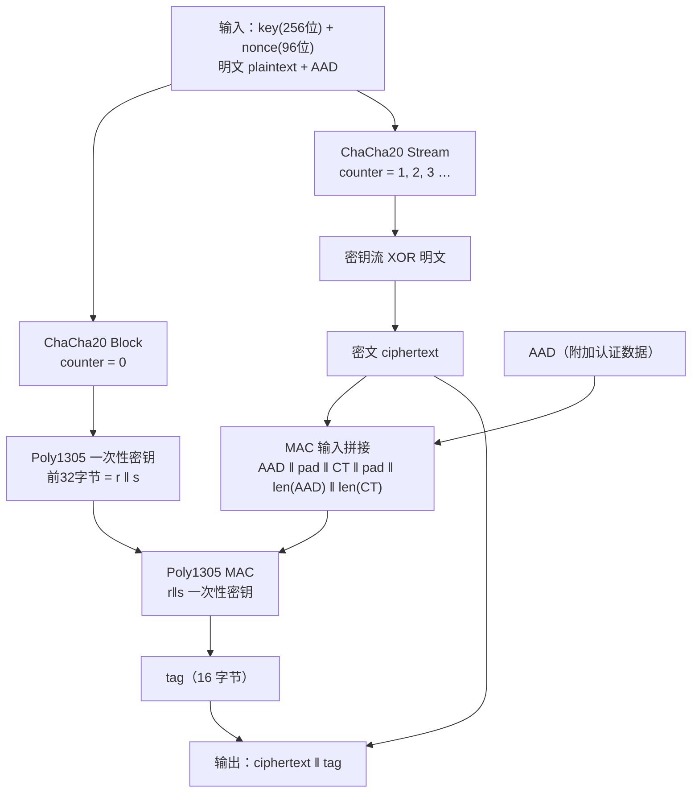

# 密码学（16）· ChaCha20-Poly1305

> [!abstract] TL;DR
> - ChaCha20-Poly1305 是 RFC 8439 定义的 AEAD（认证加密）算法：用 **ChaCha20** 流密码加密明文，用 **Poly1305** 一次性 MAC 认证 AAD 与密文。
> - **核心优势**：纯软件 ARX（加-旋-异或）实现即可达到甚至超越 AES-GCM 的性能，且天然**恒定时间**——无需 AES-NI 等硬件加速，抵抗 cache-timing 侧信道。
> - **标准地位**：TLS 1.3 必选套件、OpenSSH 默认、WireGuard 唯一加密算法；移动端与嵌入式场景的首选 AEAD。
> - **核心禁忌**：同密钥下 nonce（96 位）绝对不可重用；nonce 一旦碰撞，同时暴露密钥流和 MAC 密钥。
> - 与 [[15.AEAD原理与GCM]] 中的 AES-GCM 形成互补：前者软件友好、后者硬件加速场景更优。

---

## 概述与定位

### 历史渊源

2008 年，Daniel J. Bernstein 发布 **Salsa20** 流密码与配套 MAC **Poly1305**。Salsa20 家族在软件上极为高效，但 Google 工程师 Adam Langley 在研究移动端 TLS 性能时发现：ARM 平台没有 AES 指令集加速，AES-GCM 比桌面慢 4–8 倍，而 Salsa20 变体可以在软件中追平甚至超越 AES-NI 版 AES-GCM。

2013 年，Bernstein 在 Salsa20 基础上改进，发布 **ChaCha20**——改变了列混淆方向（行→列），使 quarter-round 在 ARM NEON 下更高效。同年 Google 在 Chrome/Android 中部署了 ChaCha20-Poly1305，随后由 Adam Langley、Yoav Nir 等人推进标准化，2015 年发布 RFC 7539，2018 年勘误更新为 **RFC 8439**。

### 在密码学体系中的位置

```
对称加密体系
├── 分组密码 + 模式 → AES-CBC / AES-CTR（已被 AEAD 取代）
└── AEAD（认证加密）
    ├── AES-GCM  ← [[15.AEAD原理与GCM]]（硬件加速，AES-NI+PCLMULQDQ）
    ├── ChaCha20-Poly1305 ← 本篇（软件快、恒定时间，无需专用指令）
    └── CCM / OCB / XTS ← [[17.CCM与OCB与XTS]]
```

ChaCha20 本身是独立的流密码（详见 [[20.ChaCha20与Salsa20]]），Poly1305 是独立的一次性 MAC（详见 [[37.Poly1305与GMAC]]）。本篇专注于两者如何组合为 AEAD，以及工程与安全含义。

---

## 原理与机制

### ChaCha20 流密码回顾

ChaCha20 是一种 **ARX**（Add-Rotate-XOR）流密码，使用一个 4×4 的 32 位字矩阵作为内部状态：

```
状态矩阵（16 个 32 位字 = 512 位）
  固定常量（4 字）    密钥（8 字）
  ┌──────────────────┬──────────────────────────────────────┐
  │ "expa" "nd 3"   │  K0   K1   K2   K3   K4   K5   K6  K7│
  │ "2-by" "te k"   │                                        │
  ├──────────────────┼────────────────┬───────────────────── ┤
  │  计数器（1~2字） │  Nonce（3 字） │                      │
  └──────────────────┴────────────────┴──────────────────────┘
```

- **密钥**：256 位（32 字节）
- **Nonce**：96 位（12 字节），RFC 8439 规定
- **计数器**：32 位（从 0 或 1 起，生成一次性 Poly1305 密钥时用 counter=0）
- **轮数**：20 轮（10 列轮 + 10 行轮交替），每轮由 4 次 quarter-round 构成

**Quarter-round** 是最基本操作单元（对四个 32 位字 a, b, c, d）：

```
a += b;  d ^= a;  d <<<= 16
c += d;  b ^= c;  b <<<= 12
a += b;  d ^= a;  d <<<= 8
c += d;  b ^= c;  b <<<= 7
```

20 轮后，将输出矩阵与初始状态**字级相加**（防止可逆），输出 64 字节密钥流块。详细原理见 [[20.ChaCha20与Salsa20]]。

### Poly1305 一次性 MAC 回顾

Poly1305 对消息 m 在有限域 GF(2^130 - 5) 上计算多项式：

```
MAC = ((Σ m_i · r^i) + s) mod 2^128
```

- **r**（128 位）：多项式系数，从一次性密钥的低 128 位截取，需将特定位清零（"clamping"）
- **s**（128 位）：加法掩码，从一次性密钥的高 128 位取得
- **一次性**：同一个 (r, s) 对绝对不能认证两个不同消息，否则可解方程组恢复 r，进而伪造 MAC

Poly1305 的一次性密钥（256 位 = r‖s）由 ChaCha20 的第 0 个密钥流块生成，这正是 ChaCha20-Poly1305 的核心耦合点。详细原理见 [[37.Poly1305与GMAC]]。

### AEAD 构造：从两个原语到一个安全方案

两个独立原语（流密码 + MAC）组合为 AEAD，依赖正确的"胶水"：密钥派生方式、MAC 覆盖范围、填充与长度编码。

RFC 8439 规定 ChaCha20-Poly1305 的完整构造如下：

**加密阶段**：

1. 以 `(key, nonce, counter=0)` 调用 ChaCha20，取前 32 字节作为 Poly1305 一次性密钥（r‖s）
2. 以 `(key, nonce, counter=1)` 调用 ChaCha20，生成密钥流，与明文 XOR 得到密文

**认证阶段**：

3. 构造 MAC 输入：`AAD ‖ pad(AAD) ‖ ciphertext ‖ pad(ciphertext) ‖ len(AAD,8) ‖ len(ciphertext,8)`
   - pad 将各段填充到 16 字节对齐（填 0x00）
   - 两个 8 字节小端长度字段
4. 用步骤 1 生成的一次性密钥，对上述拼接数据计算 Poly1305，得到 16 字节 MAC tag

**输出**：`ciphertext ‖ tag`

**解密阶段**与加密相反，且必须**先验证 tag、再解密**（使用常量时间比较），任何顺序颠倒都会导致 padding oracle 等攻击。

---

## 算法流程与结构详解

### ChaCha20-Poly1305 完整数据流



### 状态初始化：常量魔数

ChaCha20 矩阵的 4 个常量字来自 ASCII 字符串 `"expand 32-byte k"`（小端解释）：

| 位置 | 值（hex） | ASCII 含义 |
|------|-----------|-----------|
| `state[0]` | `0x61707865` | `expa` |
| `state[1]` | `0x3320646e` | `nd 3` |
| `state[2]` | `0x79622d32` | `2-by` |
| `state[3]` | `0x6b206574` | `te k` |

这与 Salsa20 使用相同常量（"nothing up my sleeve numbers"——毫无隐含后门的公开推导值）。

### MAC 输入的精确构造

RFC 8439 对 MAC 输入的二进制布局有严格规定，确保 AAD 与密文的长度不同时不会发生拼接歧义：

```
Poly1305 输入布局（示例 AAD=20字节，CT=100字节）：

 字节偏移  内容
 0..19    AAD（20字节）
 20..31   0x00 填充（12字节，凑足16字节对齐）
 32..131  密文（100字节）
 132..143 0x00 填充（12字节，凑足16字节对齐）
 144..151 len(AAD) = 20，小端 uint64
 152..159 len(CT)  = 100，小端 uint64
 共 160字节
```

长度字段（8 字节小端）放在末尾，避免了"长度前置"导致的 MAC 覆盖范围歧义。这与 GCM 的 GHASH 输入构造类似但不同（GCM 使用 GHASH 多项式而非 Poly1305）。

### 伪代码：加密

```python
def chacha20_poly1305_encrypt(key, nonce, plaintext, aad):
    # 步骤 1：生成 Poly1305 一次性密钥（counter=0 的前32字节）
    otk = chacha20_block(key, nonce, counter=0)[:32]  # one-time key
    r, s = otk[:16], otk[16:]

    # 步骤 2：ChaCha20 加密（counter 从 1 开始）
    ciphertext = chacha20_stream_xor(key, nonce, counter=1, plaintext)

    # 步骤 3：构造 Poly1305 MAC 输入
    mac_input  = aad
    mac_input += b'\x00' * (-len(aad) % 16)          # pad AAD
    mac_input += ciphertext
    mac_input += b'\x00' * (-len(ciphertext) % 16)   # pad ciphertext
    mac_input += len(aad).to_bytes(8, 'little')
    mac_input += len(ciphertext).to_bytes(8, 'little')

    # 步骤 4：计算 tag
    tag = poly1305_mac(r, s, mac_input)               # 16 字节

    return ciphertext + tag
```

```python
def chacha20_poly1305_decrypt(key, nonce, ciphertext_with_tag, aad):
    ciphertext, tag_recv = ciphertext_with_tag[:-16], ciphertext_with_tag[-16:]

    # 重建一次性密钥并验证 tag（先验证！）
    otk = chacha20_block(key, nonce, counter=0)[:32]
    r, s = otk[:16], otk[16:]
    mac_input = ... # 与加密相同构造
    tag_calc = poly1305_mac(r, s, mac_input)

    if not constant_time_compare(tag_recv, tag_calc):
        raise AuthenticationError("tag mismatch")

    # 验证通过后解密
    return chacha20_stream_xor(key, nonce, counter=1, ciphertext)
```

> [!warning] 示例输出为示意
> 上述伪代码为教学目的简化；生产环境务必使用经过审计的库（libsodium、OpenSSL 1.1+、Go crypto/chacha20poly1305 等）。

---

## 为何软件性能优越：ARX vs 查表

### AES 的软件困境

AES 的 SubBytes 步骤需要查 S 盒（256 字节查表）。在没有 AES-NI 的平台（移动端早期 ARM、嵌入式 RISC-V、部分 IoT），纯软件 AES 实现有两难：

- **查表实现**：快，但访问时间取决于缓存命中状态，泄露密钥信息（cache-timing 攻击）
- **位切片实现**：恒定时间，但慢（约 4–10× 查表速度的折损）

### ChaCha20 的先天优势

ARX 操作（整数加法、循环移位、异或）在所有现代 CPU 上执行时间与数据值无关：

| 特性 | AES（无 AES-NI）| ChaCha20 |
|------|---------------|----------|
| 操作类型 | S 盒查表 + 矩阵乘 | 加/移位/异或（ARX）|
| 是否依赖缓存 | 是（S 盒查表） | 否 |
| 恒定时间软件实现 | 难（需位切片，很慢） | 天然恒定时间 |
| ARM Cortex-A 性能 | 约 30–60 MB/s（无 AES-NI） | 约 200–600 MB/s |
| x86 有 AES-NI 时 | AES-GCM 更快 | 依然有竞争力 |
| SIMD 并行 | AES-NI 4 路并行 | NEON/AVX2 下 4路并行 |

> [!info] 现代 x86 上的比较
> 有 AES-NI + PCLMULQDQ 时，AES-128-GCM 在 x86 上可达 3–8 GB/s；ChaCha20-Poly1305 用 AVX2 约 2–4 GB/s。在高端服务器上 AES-GCM 有优势，但差距不足以成为选型主因——安全工程师更看重恒定时间与 nonce 误用场景的差异。

---

## 部署场景与生态

### TLS 1.3

[[71.详解网络协议/15.TLS协议.md]] 中，TLS 1.3 的强制 AEAD 套件包括：

- `TLS_AES_128_GCM_SHA256`
- `TLS_AES_256_GCM_SHA384`
- **`TLS_CHACHA20_POLY1305_SHA256`**（RFC 8446）

移动客户端（Android 早期版本、ARMv7 设备）在连接 Google、Cloudflare 等服务器时，若客户端无 AES 硬件加速，协商优先选 `TLS_CHACHA20_POLY1305_SHA256`，可将 TLS 握手和数据传输的 CPU 耗时降低 60%+ 。

### OpenSSH

OpenSSH 自 6.5 起引入 `chacha20-poly1305@openssh.com` 加密算法（ssh 数据包级别的 AEAD），并自 8.0 起成为默认首选。它使用了稍微不同的构造（两个 ChaCha20 实例：一个加密包头长度，一个加密内容），但核心仍是 ChaCha20 + Poly1305。

### WireGuard

WireGuard VPN 协议**只支持** ChaCha20-Poly1305（不做协议协商）。这是 WireGuard 设计哲学"密码学敏捷性有害"的体现：固定唯一算法消除降级攻击面，同时 ChaCha20-Poly1305 在无 AES-NI 的路由器 MIPS/ARM 芯片上性能完全可接受。

### libsodium

`crypto_secretstream_xchacha20poly1305` 和 `crypto_aead_chacha20poly1305_ietf` 是 libsodium 的核心 API，XChaCha20 变体（见下文）也在其中实现。

---

## XChaCha20-Poly1305：扩展 nonce 变体

### 问题背景

96 位 nonce 在长连接或大规模分布式系统中存在生日碰撞风险：若使用随机 nonce，约 $2^{48}$ 次操作后有 50% 概率碰撞（$n = 2^{96}$，birthday bound $= 2^{48}$）。对于文件加密、数据库记录加密等**随机 nonce 场景**，这可能不足够安全。

### HChaCha20 子密钥派生

**XChaCha20** 将 nonce 扩展至 **192 位（24 字节）**，通过以下步骤：

1. 取 nonce 的前 128 位，调用 **HChaCha20**（ChaCha20 的子密钥函数，只取输出矩阵的首末两行共 32 字节，不做末尾加法）派生子密钥 `subkey`
2. 用 `subkey` 和 nonce 后 64 位（前补 32 位 0 构成 96 位 nonce）运行标准 ChaCha20-Poly1305

```
HChaCha20(key, nonce[0..15]) → subkey (32字节)
XChaCha20-Poly1305(subkey, 0x000000000000000 ‖ nonce[16..23], plaintext, AAD)
```

192 位随机 nonce 下，生日 bound 升至 $2^{96}$，可安全随机生成 nonce 而几乎不担心碰撞。**libsodium 的推荐高级 API `crypto_secretstream` 内部使用 XChaCha20**。

---

## 与 AES-GCM 的系统比较

| 维度 | AES-128/256-GCM | ChaCha20-Poly1305 |
|------|-----------------|-------------------|
| **底层加密** | AES（SPN，需 S 盒） | ChaCha20（ARX 流密码）|
| **底层 MAC** | GHASH（GF(2^128) 多项式） | Poly1305（GF(2^130-5) 多项式）|
| **标准文档** | NIST SP 800-38D | RFC 8439 |
| **有 AES-NI 时速度** | 极快（3–8 GB/s）| 快（2–4 GB/s）|
| **无 AES-NI 时速度** | 慢（需位切片或接受时序泄漏） | 快（天然恒定时间）|
| **恒定时间** | 需硬件指令或位切片 | 天然满足 |
| **Nonce 长度** | 96 位（GCM 标准） | 96 位（RFC 8439）/ 192 位（XChaCha20）|
| **Nonce 误用** | 密钥流重用 + GHASH 密钥泄露 | 密钥流重用 + Poly1305 密钥泄露 |
| **Tag 长度** | 128 位（可截断，不推荐） | 128 位（不可截断）|
| **AAD 支持** | 有 | 有 |
| **硬件依赖** | 高（AES-NI + PCLMULQDQ） | 低（纯整数运算）|
| **主要采用方** | TLS 1.3、HTTPS 主力 | TLS 1.3、OpenSSH、WireGuard |
| **后量子抵抗** | 量子计算下 AES-256 安全级别降至 128 位 | ChaCha20-256 同样降至 128 位 |

> [!tip] 选型建议
> - 服务器端有 AES-NI：两者均可，AES-256-GCM 略快
> - 移动/嵌入式/无 AES 硬件：优先 ChaCha20-Poly1305
> - 随机 nonce 场景（文件加密）：XChaCha20-Poly1305（192 位 nonce）
> - 只需 RFC 标准互操作：ChaCha20-Poly1305（RFC 8439）

---

## 安全性与正确使用

### Nonce 唯一性：最核心约束

**同一密钥下，nonce 绝对不能重用。** 设 nonce 重用时加密消息 m1、m2，密钥流相同：

```
c1 = m1 XOR ks
c2 = m2 XOR ks
c1 XOR c2 = m1 XOR m2   ← 直接泄露两明文异或，词频分析可恢复全文
```

更严重的是：counter=0 的密钥流块（生成 Poly1305 密钥）也完全相同，即同一组 (r, s) 认证了两条不同消息——攻击者可解方程组恢复 r，从而**任意伪造 MAC**。这与 AES-GCM nonce 重用的危害完全一致（均为 nonce misuse → key stream + MAC key recovery）。

**正确 nonce 管理策略**：

| 场景 | 推荐策略 |
|------|---------|
| 单设备、单进程、短会话 | 32/64 位顺序计数器（从 0 递增）|
| 分布式/多设备 | 前缀 = 设备 ID / 随机初始值，后缀 = 本地计数器 |
| 随机 nonce（文件加密） | 用 XChaCha20（192 位），随机生成 nonce 随密文存储 |
| 长期存储密钥 | 每次加密一个新的随机子密钥（通过 KDF 派生），独立 nonce 空间 |

### Poly1305 一次性密钥的唯一性

因为 Poly1305 一次性密钥由 ChaCha20(key, nonce, counter=0) 生成，nonce 唯一即一次性密钥唯一——两者不可分割。只要保证 nonce 唯一，Poly1305 的一次性要求自动满足。

### 密钥长度与密钥管理

- 密钥固定 256 位，不存在 128 位变体（不同于 AES-128/256-GCM）
- 密钥必须由 CSPRNG 生成；禁止口令直接作为密钥（应经 Argon2/HKDF 等 KDF 派生，详见系列 KDF 篇）
- 密钥泄露即完全失密（前向安全需要会话密钥每次 ECDH 临时派生，如 TLS 1.3 的 ECDHE）

### 认证失败处理

- 解密必须**先验证 tag**，通过后再解密。未验证的密文绝不能输出给上层。
- tag 比较必须用**常量时间函数**（`constant_time_compare`），否则时序差异泄露 tag 匹配位数。
- 认证失败时，返回统一错误，不暴露失败原因（防止 oracle）。

### 已知安全性上界

- ChaCha20 密钥流安全性：目前无已知区分器（最好的攻击针对轮数削减变体，如 7 轮 ChaCha）
- Poly1305 安全性：在一次性假设下，伪造概率 ≤ `(l+1) · 2^(−102)` （l 为消息块数），约 128 位安全
- 组合 AEAD 安全性（IND-CCA2 + AE）：在随机预言机模型下可证
- **不存在基于 nonce 误用的恢复性设计**（如 AES-SIV）：ChaCha20-Poly1305 在 nonce 重用下即"彻底失密"，没有部分安全降级

> [!warning] 禁止使用低轮数变体
> RFC 8439 之外存在 `chacha20-ietf`（与 RFC 兼容）和非标准的 8/12 轮 ChaCha8/12 变体。生产环境必须坚持 20 轮；轮数削减提高速度但降低安全边际，且与标准库不兼容。

### 实用库推荐

```python
# Python（cryptography 库）
from cryptography.hazmat.primitives.ciphers.aead import ChaCha20Poly1305
import os

key = os.urandom(32)          # 256 位密钥
nonce = os.urandom(12)        # 96 位 nonce（每次必须唯一）
aead = ChaCha20Poly1305(key)

ct = aead.encrypt(nonce, plaintext, aad)    # 返回 ciphertext + tag
pt = aead.decrypt(nonce, ct, aad)           # 验证+解密，失败抛 InvalidTag
```

> [!warning] 示例输出为示意
> 上述代码片段为示意，生产代码需妥善处理 `InvalidTag` 异常，且 nonce 管理逻辑需根据业务场景设计（不可随意 `os.urandom(12)`：96 位随机 nonce 在单密钥加密 $2^{32}$ 个消息时碰撞概率接近 0.05%，宜使用计数器或切换至 XChaCha20）。

```go
// Go
import "golang.org/x/crypto/chacha20poly1305"

key := make([]byte, 32)
rand.Read(key)
aead, _ := chacha20poly1305.New(key)          // 96位nonce
// 或 chacha20poly1305.NewX(key)              // XChaCha20，192位nonce

nonce := make([]byte, aead.NonceSize())
rand.Read(nonce)
ct := aead.Seal(nil, nonce, plaintext, aad)
pt, err := aead.Open(nil, nonce, ct, aad)
```

---

## 小结

ChaCha20-Poly1305 将两个设计精良的密码原语（ARX 流密码 + 一次性多项式 MAC）组合为一个严谨的 AEAD 方案，其核心优势在于：

1. **软件性能**：ARX 操作在任何 ISA 上都高效，无需专用指令集
2. **恒定时间**：天然免疫 cache-timing 侧信道，无需额外防护措施
3. **简洁设计**：RFC 8439 的构造方式清晰、无歧义，易于正确实现
4. **广泛采用**：TLS 1.3、OpenSSH、WireGuard 的共同选择，表明其经过了大规模工程验证

与 AES-GCM 是互补关系而非替代：有 AES-NI 的服务器两者均可，无硬件加速的嵌入式/移动端应优先选用 ChaCha20-Poly1305。

最关键的安全要求只有一条：**同密钥下 nonce 必须唯一**。其余安全性（恒定时间、先验证后解密、256 位密钥强度）由正确使用库即可保证。

---

## 相关阅读

| 主题 | 链接 |
|------|------|
| AEAD 通用原理与 AES-GCM | [[15.AEAD原理与GCM]] |
| ChaCha20/Salsa20 流密码详解 | [[20.ChaCha20与Salsa20]] |
| Poly1305 与 GMAC 详解 | [[37.Poly1305与GMAC]] |
| CCM / OCB / XTS 模式 | [[17.CCM与OCB与XTS]] |
| TLS 1.3 协议（ChaCha20-Poly1305 套件） | [[71.详解网络协议/15.TLS协议.md]] |
| 密码学攻击（nonce 重用危害） | [[60.对称密码攻击]] |
| KDF 密钥派生（密钥管理） | [[38.HKDF]] |
| 密码学系列总览 | [[00.密码学总览]] |

---

⬅️ 上一篇 [[15.AEAD原理与GCM]] ｜ 🏠 [[00.密码学总览]] ｜ 下一篇 [[17.CCM与OCB与XTS]] ➡️
