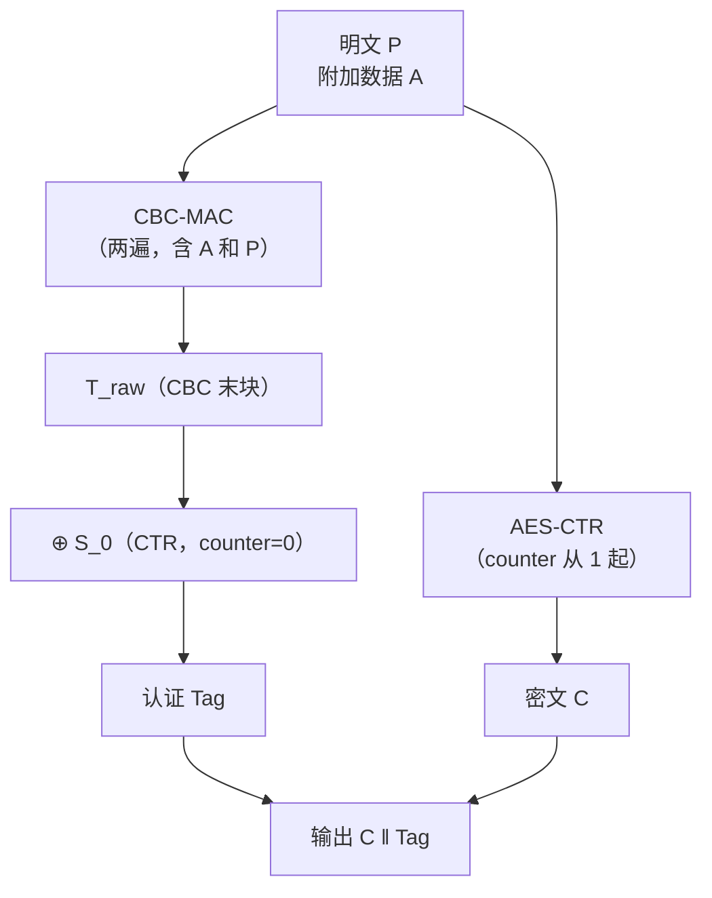
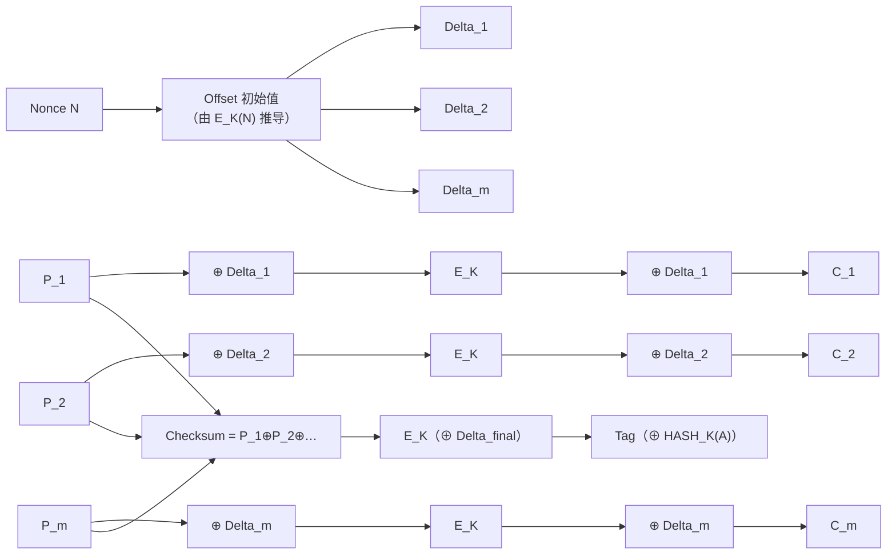
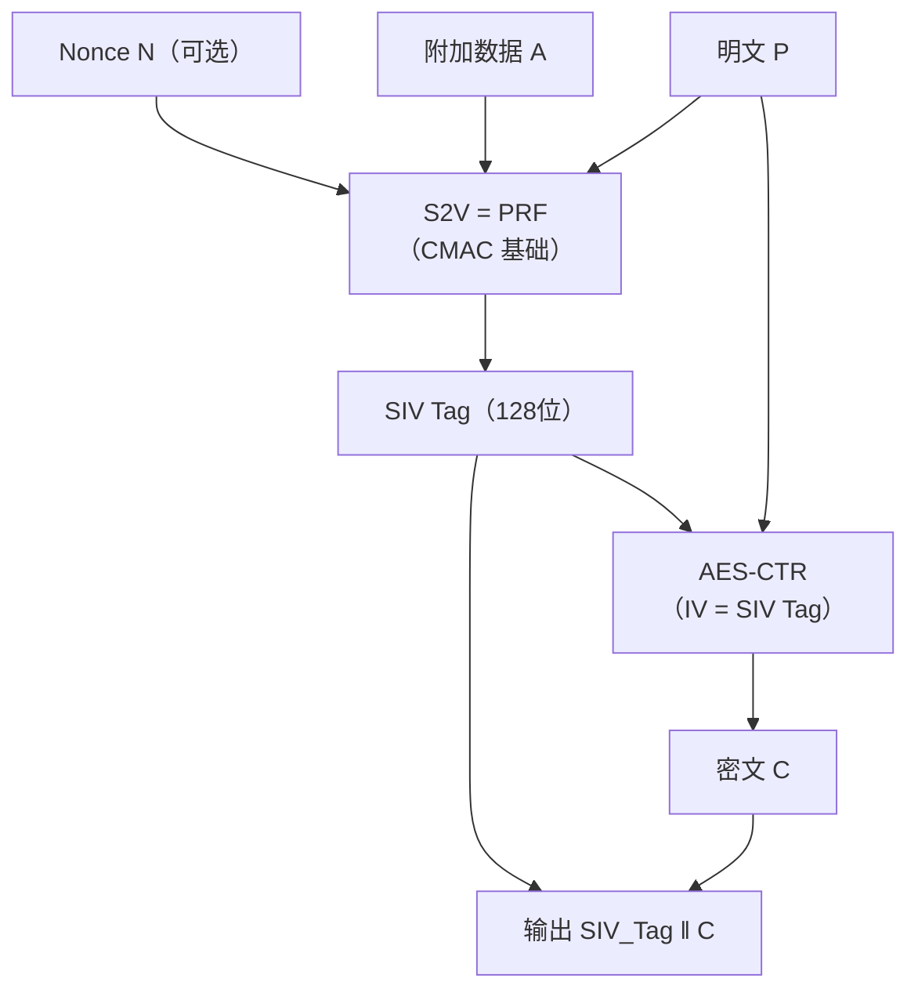
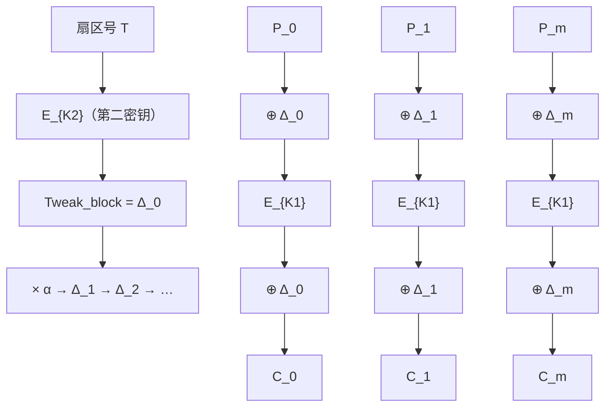
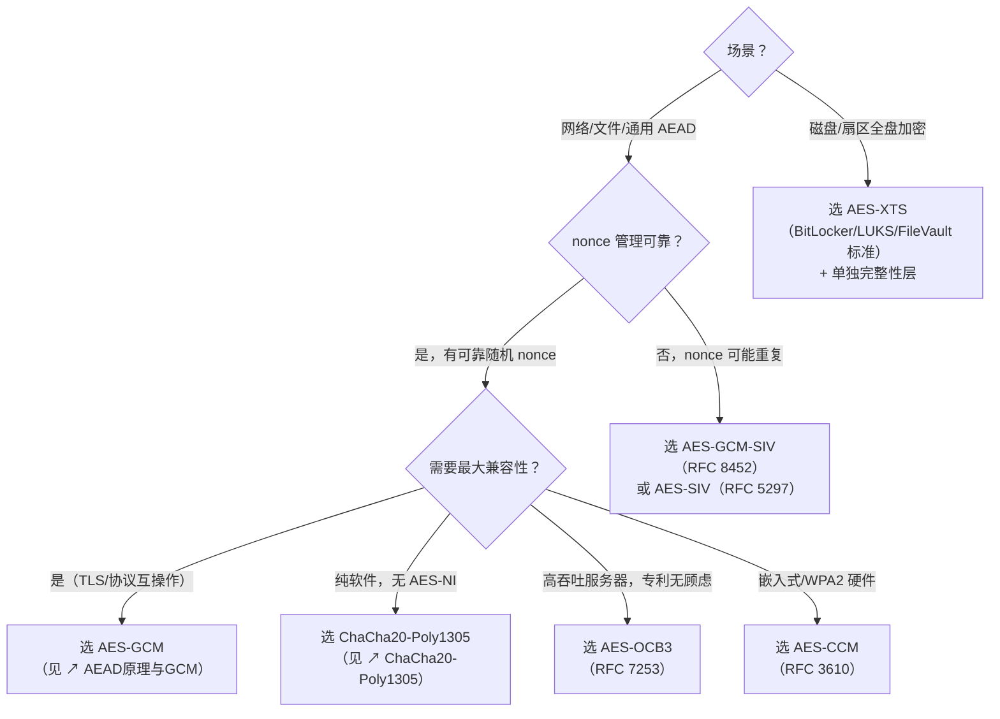

# 密码学（17）· CCM与OCB与XTS

> [!abstract] TL;DR
> - **CCM**（Counter with CBC-MAC）：CTR 加密 + CBC-MAC 认证，**两遍扫描**，nonce 不可复用，WPA2/TLS 1.2 早期常用。
> - **EAX**：双遍 AEAD（OMAC 认证 + CTR 加密），更灵活、无专利，但不如 GCM 普及。
> - **OCB**（Offset Codebook）：**单遍扫描**的高效 AEAD，吞吐可达 GCM 1.5–2×，历史上有专利（现已释放或宽泛授权）。
> - **SIV**（Synthetic IV）：**抗 nonce 误用**——nonce 重用只泄露两段密文相等性，不崩溃加密语义；AES-GCM-SIV 是现代标准。
> - **XTS**（XEX-based Tweakable Block Cipher with Ciphertext Stealing）：**磁盘/扇区加密**专用，两个密钥、tweak = 扇区号 + 块偏移，**无 MAC 无认证**，防止跨扇区复制粘贴攻击，BitLocker/FileVault/dm-crypt 均在使用。
> - **通用加密**优先选 GCM 或 ChaCha20-Poly1305；**nonce 易误用**场景选 SIV；**磁盘加密**选 XTS（并单独做完整性）。

本篇是 AEAD 专题的第三篇，承接 [[15.AEAD原理与GCM]]（GCM 核心原理）与 [[16.ChaCha20-Poly1305]]（软件友好的 AEAD），补全现代密码工程中剩余的重要认证加密模式与磁盘加密专用模式。读者应已熟悉 CTR 模式（[[13.CTR模式]]）、CBC-MAC 概念（[[12.CBC模式]]）、以及 [[10.分组密码工作模式总论]] 的分类框架。底层分组密码见 [[04.AES详解]]。

---

## 概述与定位

### 为什么还有这么多 AEAD 方案

[[15.AEAD原理与GCM]] 讲清了"加密+认证一体化"的核心动机：单纯加密无法抵御篡改，而 MAC-then-encrypt / encrypt-then-MAC 的组合容易出错，AEAD 把它们捏合成一个不可分割的接口。GCM 已成事实标准，但它并非没有弱点：

| GCM 的潜在痛点 | 对应的替代方案 |
|----------------|----------------|
| nonce 重用 → 密钥和认证密钥双双泄露 | SIV / AES-GCM-SIV |
| 两遍结构（CTR + GHASH）各扫一次 | OCB 单遍，速度更快 |
| WPA2/嵌入式 → AES-CCM 已内置硬件 | CCM |
| 历史遗留、灵活的 AAD 结构 | EAX |
| 整盘加密无 nonce 空间、无存储 MAC 的位置 | XTS |

这些方案不是 GCM 的竞争者，而是**不同约束下的最优解**。理解它们的设计取舍，才能在工程中正确选型。

### 模式全景速查

| 模式 | 遍数 | 认证 | nonce 要求 | 典型用途 |
|------|------|------|------------|----------|
| GCM  | 2（CTR+GHASH）| GHASH + GMAC | 唯一，重用致命 | TLS 1.3、SSH、HTTPS |
| CCM  | 2（CBC-MAC+CTR）| CBC-MAC | 唯一，重用致命 | WPA2、TLS（早期）、802.15.4 |
| EAX  | 2（OMAC×3+CTR）| OMAC | 唯一 | 自定义协议、PGP 替代 |
| OCB  | 1 | 并行认证 | 唯一 | 高性能服务器 |
| SIV  | 2 | S2V（PRF） | **可重用**（仅泄露相等性）| 密钥包装、key derivation |
| XTS  | 无 MAC | **无认证** | tweak=扇区号 | 磁盘/NVMe 扇区加密 |

---

## CCM：Counter with CBC-MAC

### 设计思路

CCM 由 Doug Whiting、Russ Housley 和 Niels Ferguson 于 2002 年提出，是"把已有组件拼起来得到 AEAD"的最直接示范：

- **加密**：AES-CTR（同 [[13.CTR模式]]）
- **认证**：AES-CBC-MAC（对消息和附加数据做 CBC 加密，取最终密文块作 MAC）
- **组合**：认证先于加密（MAC-then-CTR-encrypt），或二者串行两遍扫描

CCM 的关键参数：

| 参数 | 取值范围 | 说明 |
|------|----------|------|
| `n`（nonce 长度）| 7–13 字节 | 越短则消息长度字段越宽 |
| `t`（tag 长度）| 4/6/8/10/12/14/16 字节 | 越长则伪造概率越低 |
| `L`（长度字段字节数）| `15 − n` | 决定最大消息长度 `2^(8L)` |

三者满足 `n + L = 15`，合计 15 字节（加上 1 字节标志位恰好填满一个 AES 块）。

### 加密/认证流程

```
输入：密钥 K（128/192/256位）、nonce N（7–13字节）、
      明文 P、附加数据 A、参数 (n, t, L)

────────── 步骤一：CBC-MAC 认证 ──────────
B_0 = Flags ‖ N ‖ Q          # Q = len(P) 编码，Flags 含 t/L 信息
T_raw = CBC-MAC_K(B_0 ‖ [A 的长度+内容] ‖ P)  # 全量两遍 CBC 加密
T = T_raw[0 : t]              # 取前 t 字节

────────── 步骤二：CTR 加密 ──────────
A_0 = Flags' ‖ N ‖ 0x000000  # counter 从 0 开始
S_0 = E_K(A_0)                # 用于加密 tag
S_i = E_K(Flags' ‖ N ‖ i)    # i = 1, 2, … 用于加密明文

C = P ⊕ S_1 ‖ S_2 ‖ …
Tag = T ⊕ S_0[0 : t]         # tag 用 S_0 加密（防止 tag 泄露 CBC 输出）

输出：C ‖ Tag
```



### CCM 两遍扫描：nonce/长度编码构造详解

CCM 的两遍结构来自其编码规范（RFC 3610 第 2 节）——必须把 nonce、长度、flag 信息压缩进固定 16 字节块，才能喂给 CBC-MAC。

**B_0 的位级构造**：

```
B_0（16 字节）= Flags ‖ N（n 字节）‖ Q（L 字节）

Flags（1 字节）：
  Bit 7   = 0（保留）
  Bit 6   = Adata（附加数据是否非空：1 = 有）
  Bit 5-3 = (t - 2) / 2    （tag 长度编码，t ∈ {4,6,8,10,12,14,16}）
  Bit 2-0 = L - 1           （长度字段字节数编码）

N（nonce）：n = 15 - L 字节，填入 Flags 之后
Q（消息长度）：L 字节，大端序，编码 len(P)
```

示例（nonce=13 字节，t=8，L=2）：

```
Flags = 0b0_1_011_001  # Adata=1, (8-2)/2=3, L-1=1
```

**附加数据 A 的编码**（CBC-MAC 输入第二段）：

```
如果 0 < len(A) < 2^16 - 2^8：
    编码 = len(A) 以 2 字节大端序 ‖ A ‖ 零填充到 16 字节对齐
如果 2^16 - 2^8 ≤ len(A) < 2^32：
    编码 = 0xFF 0xFE ‖ len(A) 4 字节大端 ‖ A ‖ 零填充
```

**CTR 计数器块 A_i 的构造**：

```
A_i（16 字节）= Flags' ‖ N（n 字节）‖ Counter（L 字节，大端序，初值 i）

Flags' = 0b000_00_(L-1)
（A_0 用于加密 tag，A_1 起加密明文）
```

伪代码汇总（含两遍顺序）：

```
── 第一遍：CBC-MAC（先认证）──
  X_0 ← E_K(B_0)                   # B_0 含 Flags/nonce/消息长度
  X_j ← E_K(B_A_j ⊕ X_{j-1})      # 附加数据各块（含长度前缀，16 字节对齐）
  X_k ← E_K(P_{k-len_A} ⊕ X_{k-1})# 消息块依次（16 字节对齐，末块零填充）
  T_raw ← X_final                   # CBC 末输出
  T ← T_raw[0 : t]

── 第二遍：CTR（后加密）──
  S_0 ← E_K(A_0)               # counter=0，用于保护 tag
  S_i ← E_K(A_i)  for i=1,2…  # counter=1,2… 用于加密明文
  C ← P ⊕ (S_1 ‖ S_2 ‖ …)[0 : len(P)]
  Tag ← T ⊕ S_0[0 : t]         # S_0 "盲化" tag，防 CBC 中间值泄露
```

**安全直觉**：S_0 用于"盲化" tag 是关键——若直接输出 T_raw，CBC 末块泄露内部状态；用 S_0（独立 CTR 块）加密后，tag 变成不透明随机块，CBC 中间值对攻击者不可见。两遍的顺序（MAC-then-CTR-encrypt）同时意味着认证作用于明文而非密文——这与 GCM 的"CTR-encrypt then GHASH"相反，各有安全归约，但 CCM 先 MAC 后加密的路径需提前知道消息总长，故不支持流式。

### 两遍代价与限制

CCM 必须在认证前知道消息总长（因为 `B_0` 里编码了 `len(P)`），这要求**不支持流式处理**（streaming），也不支持 incremental AEAD：发送方必须把全部明文缓存完再开始。这是与 GCM 相比最大的实用劣势。

> [!warning] nonce 重用后果与 GCM 一样严重
> 同一密钥下 nonce 重用会导致 CTR 密钥流重用（Two-Time Pad），并且 CBC-MAC 的 tag 也不再提供认证保障。

### CCM 的使用场景

- **IEEE 802.11i（WPA2）**：AES-CCM 是强制支持的加密套件（AES-CCMP，128 位密钥，8 字节 tag）。
- **IEEE 802.15.4 / Zigbee**：低功耗设备内置 AES 硬件，CCM 实现只需 CBC 和 CTR 两个已有原语。
- **TLS 1.2**：`TLS_RSA_WITH_AES_128_CCM` 等套件（已逐渐被 GCM 取代）。
- **IETF RFC 3610**：CCM 的参考规范。

---

## EAX：双遍灵活的 AEAD

### 设计动机

EAX（2003 年，Bellare/Rogaway/Wagner）的设计目标是在没有专利顾虑、不依赖 GHASH 特定数学的前提下，提供一个可证明安全的 AEAD。它选用 **OMAC（One-key MAC，即 CMAC）** 作为认证原语，OMAC 本身只依赖分组加密，实现简单。

### 结构

```
输入：K、N（nonce，任意长度）、P、A（附加数据）

OMAC_N = OMAC_K([0] ‖ N)        # tag 覆盖 nonce
CTR 密文：C = CTR_K(N=OMAC_N, P) # 用 OMAC_N 作 CTR 的计数器起点
OMAC_C = OMAC_K([2] ‖ C)        # tag 覆盖密文
OMAC_A = OMAC_K([1] ‖ A)        # tag 覆盖附加数据

Tag = OMAC_N ⊕ OMAC_C ⊕ OMAC_A  # 三个 OMAC 输出异或

输出：C ‖ Tag
```

（`[0]/[1]/[2]` 表示不同的单字节前缀，用于域分离 domain separation。）

EAX 的优点：
- nonce 可**任意长度**，不像 CCM 限制在 7–13 字节。
- 附加数据可**增量处理**，无需提前知道消息总长（但实现时通常还是分两遍）。
- 无专利，被多个密码库收录（Crypto++ / Bouncy Castle）。

EAX 的缺点：
- 需要三次 OMAC 计算，常数因子比 GCM 略高。
- 未被 NIST 标准化，协议互操作性弱于 GCM。

---

## OCB：单遍高效 AEAD

### 核心思想

OCB（Offset Codebook Mode）是 Rogaway 等人设计的，目标是**单遍扫描**同时完成加密与认证，吞吐接近纯 AES-CTR（只做加密、不做 MAC）。

GCM 需要两遍：一遍 CTR 加密，一遍 GHASH 认证。OCB 把二者折叠进同一次分组密码调用，代价是结构更复杂。

### OCB offset 生成：灰码 LFSR 与 Galois 域推导

OCB3（RFC 7253）的核心效率来自 **offset**（Δ_i）的增量推导——从 Δ_{i-1} 到 Δ_i 只需一次 GF(2^128) 乘法或位移，不必对每个块重新加密 nonce。

#### L 表的预计算

首先用 nonce 加密得到 **Stretch**，再从中提取初始 offset；同时预计算一张 L 表：

```
K-dependent 预计算（每密钥一次）：
  L_* = E_K(0^128)                          # 恒星常量
  L_$ = double(L_*)                          # 美元常量（GF(2^128) ×2）
  L_0 = double(L_$)
  L_i = double(L_{i-1})  for i=1,2,…,max   # 最多需要 log2(块数) 个

double(X)：GF(2^128) 乘 α = x（即生成元）
  if MSB(X) == 0：return X << 1
  else：          return (X << 1) ⊕ 0x87   # 约化多项式 x^128 + x^7 + x^2 + x + 1
```

#### ntz 与灰码的联系

OCB3 用 **ntz(i)**（number of trailing zeros，i 的末尾零个数）来选择偏移量递推用哪个 L_j：

```
Δ_0 = E_K(Nonce ⊕ L_$)（含 tag 长度编码的 nonce 扩展，见 RFC 7253 §2.3）
Δ_i = Δ_{i-1} ⊕ L_{ntz(i)}   for i = 1, 2, 3, …
```

为什么 ntz(i) 正好对应"灰码相邻两个 index 差一位"？

```
i     二进制   ntz   灰码(i XOR i>>1)  灰码变化位
1     001       0     001               bit 0
2     010       1     011               bit 1
3     011       0     010               bit 0
4     100       2     110               bit 2
5     101       0     111               bit 0
6     110       1     101               bit 1
7     111       0     100               bit 0
```

相邻 i 和 i-1 的灰码之间**恰好差 1 位**，且该位的编号就是 ntz(i)。因此：

- 从 Δ_{i-1} 推 Δ_i 只要 XOR 一个 L_{ntz(i)}——**常量时间，无条件分支**。
- 整体访问模式与处理器预取友好；对于 SIMD 实现，所有块可流水并行。

#### Galois 域视角

从域乘法角度看，Δ_i 本质上是：

```
Δ_i = E_K(Nonce) ⊕ ∑_{j : bit j of graycode(i) = 1} L_j
    = E_K(Nonce) ⊕ L_* · graycode(i)     （GF(2^128) 域多项式线性组合）
```

其中求和在 GF(2^128) 上（⊕ 即域加法）。L_j = L_* · α^{j+2}，每次 XOR L_{ntz(i)} 等价于域元素加法。灰码确保每步只动一个系数位，递推复杂度 O(1) per block。

#### 末块与 tag 的 offset

末块处理和 tag 计算使用特殊常量：

```
末块 P_m 不满 128 位时：
  Δ_* = Δ_{m-1} ⊕ L_*   （⊕ 恒星常量，区分完整块与不完整末块）
  pad  = E_K(Δ_*)
  C_m  = P_m ⊕ pad[0 : len(P_m)]   （不整块 XOR 截断 keystream）

Tag 计算：
  Δ_$ = Δ_m ⊕ L_$           （m = 完整块数）
  Tag  = E_K(Checksum ⊕ Δ_$) ⊕ HASH_K(A)
```

**安全直觉**：每个 Δ_i 都是 nonce 派生的域元素，不同块位置产生不同偏移——即使两块明文相同，密文也不同。单遍结构中"认证"通过累积 Checksum（所有明文块的 XOR）实现，Checksum 经最终 E_K 调用产出 tag，与 GCM 的 GHASH 不同但具备类似的域线性认证性质。

### XEX 结构基础

```
加密第 i 个明文块 P_i：
  Delta_i = L_ntz(i) ⊕ Offset       # Offset 依赖 nonce；L 为预计算的 "偏移掩码"
  C_i = E_K(P_i ⊕ Delta_i) ⊕ Delta_i
```

每个块的 Delta 由 nonce 和块序号共同决定，使得相同明文在不同位置产生不同密文（类似 tweakable block cipher 的 tweak）。认证 tag 累积所有块的处理结果：

```
Checksum = P_1 ⊕ P_2 ⊕ … ⊕ P_m ⊕ [末块处理]
Tag = E_K(Checksum ⊕ Delta_final) ⊕ HASH_K(A)   # HASH_K(A) 处理附加数据
```



### OCB 版本历史与专利

| 版本 | 年份 | 专利状态 |
|------|------|----------|
| OCB1 | 2001 | IBM 专利，需授权 |
| OCB2 | 2004 | 发现安全缺陷（2019），**已废弃** |
| OCB3 | 2011 | RFC 7253，专利人（Rogaway）已发布**开放授权**（非军事用途免费，军事用途单独协议）|

> [!warning] OCB2 已被攻破
> 2019 年 Inoue 和 Minematsu 发现 OCB2 的 forgery 攻击（伪造 tag 而无需知道密钥）。**任何使用 OCB2 的代码都应立即迁移到 OCB3。**

### OCB 性能对比

在 AES-NI 加速的现代 x86 上：

| 模式 | 单核吞吐（参考值）| 备注 |
|------|-------------------|------|
| AES-GCM | ~4–6 GB/s | GHASH 有独立 PCLMULQDQ 加速 |
| AES-OCB3 | ~6–9 GB/s | 单遍，更少内存访问 |
| AES-CTR（仅加密）| ~8–10 GB/s | 无认证的理论上界 |

OCB3 的单遍设计使其 latency 更低，在高吞吐服务器（Nginx、WireGuard 的实验分支）中有竞争力。但因为历史上的专利顾虑，TLS/SSH 等协议均未标准化 OCB，导致生态普及受限。

---

## SIV：合成 IV，抗 nonce 误用

### nonce 误用的危害

GCM、CCM、OCB 的安全性都依赖**nonce 唯一性**。若 nonce 重复（软件 bug、虚拟机快照恢复、密钥派生错误），GCM 的认证密钥 H 立即泄露：

```
nonce 重用时：C_1 ⊕ C_2 = P_1 ⊕ P_2
（并且 H = (tag_1 ⊕ tag_2) / (密文差）可被计算）
```

这是一个"灾难性失效"（catastrophic failure）。

### SIV 的设计目标

SIV（Synthetic IV，RFC 5297，2008）的设计目标是：**即使 nonce 重用，也只泄露"两段消息是否相同"，不泄露明文内容，不破坏 tag 的认证能力**。

这种属性称为 **nonce-misuse resistance**（nonce 误用抗性）。

### SIV 原理

SIV 使用一种特殊的 PRF 称为 **S2V（String-to-Vector）**，基于 AES-CMAC/OMAC 构建：

```
输入：K（分两半：K_1 用于 S2V，K_2 用于 CTR）
      N（nonce，可选）、A（附加数据，可选）、P（明文）

────── 合成 IV ──────
SIV_Tag = S2V_K1(A_1, A_2, …, N, P)
    # S2V 是一个 PRF：把所有组件"合成"成一个 128 位块
    # 数学：双倍化（double）加 CMAC，逐层折叠

────── CTR 加密 ──────
# 用 SIV_Tag 作 CTR 的初始计数器（清除第 31 和 63 位以对齐）
C = CTR_K2(IV = SIV_Tag, P)

输出：SIV_Tag ‖ C   # tag 在前，密文在后
```



### nonce 重用时发生什么

若两次加密使用**相同 nonce 和相同附加数据，但明文不同**：

- `S2V(…, P_1) ≠ S2V(…, P_2)`，因为 S2V 输入包含明文本身。
- 两次 CTR 的 IV 不同 → 密钥流不同 → 密文不同。
- **攻击者能知道**：两段密文不同（明文不同），或相同（明文相同）。
- **攻击者不能知道**：明文内容。认证 tag 仍然有效。

若 nonce 相同且**明文也相同**：SIV_Tag 完全相同，密文完全相同。攻击者能看到"这两次传输内容一样"——这是唯一泄露的信息。

> [!info] 代价：两遍扫描 + 输出扩展
> SIV 因为要先算 S2V（扫一遍明文），再做 CTR（再扫一遍），是两遍；且输出比明文多 128 位 tag（放在头部）。SIV 不支持流式处理，不适合超大消息实时加密。

### AES-GCM-SIV 的 POLYVAL 认证器与 nonce 误用抗性证明思路

#### POLYVAL vs GHASH：字节序与域表示

GCM 使用 **GHASH**（定义在 GF(2^128) 上，生成多项式 `x^128 + x^7 + x^2 + x + 1`）；AES-GCM-SIV 使用 **POLYVAL**（RFC 8452 §3），两者定义在同一个域上，但**字节序相反**：

```
GHASH 中多项式系数表示（RFC 5116 / GCM 标准）：
  最高位字节 = 最高次项系数（big-endian bit ordering）
  ① 乘法用"反射位序"（reflected bit ordering）

POLYVAL 中多项式系数表示：
  最低位字节 = 最高次项系数（little-endian bit ordering）
  ② 乘法用"正常字节序"（standard bit ordering）
```

实际效果：POLYVAL(X, Y) = byte_reverse(GHASH(byte_reverse(X), byte_reverse(Y)))。两者可复用同一条 PCLMULQDQ 指令路径，只需在输入/输出处做字节翻转，几乎零额外开销。

POLYVAL 递推（对消息块和 AAD 块）：

```
S_0 = 0^128
S_i = (S_{i-1} ⊕ X_i) ·_H H    （GF(2^128) 点乘，H 为 POLYVAL key）

最终输出：S_m ⊕ len_block
len_block = len(A) 以 64 位小端 ‖ len(C) 以 64 位小端
```

与 GHASH 的对比：

| 特性 | GHASH（GCM） | POLYVAL（GCM-SIV） |
|------|-------------|-------------------|
| 字节序 | 反射位序（MSB first） | 标准字节序（LSB first） |
| 域多项式 | x^128+x^7+x^2+x+1 | 相同（同构） |
| 硬件指令 | PCLMULQDQ（直接） | PCLMULQDQ（+字节翻转） |
| nonce 使用 | nonce → H 密钥（固定） | nonce → 每消息派生子密钥 |

#### 每消息密钥派生（per-message key derivation）

AES-GCM-SIV 独有的安全增强：每条消息用 nonce 从主密钥派生出一次性子密钥 `(H, K_enc)`：

```
Counter-based KDF（RFC 8452 §4）：
  block_i = AES_K(nonce ‖ counter_i)   for counter_i = 0,1,2,3

  H（POLYVAL 密钥，128 位）= block_0[0:16]
  K_enc（加密密钥）:
    AES-128-GCM-SIV：K_enc = block_2[0:16]
    AES-256-GCM-SIV：K_enc = block_2[0:16] ‖ block_3[0:16]
```

即使 nonce 重用，相同 nonce+主密钥对导出的 H 和 K_enc 相同——但 SIV tag 仍由明文内容决定，故密钥流不同（下见 SIV 防护论证）。

#### nonce 误用抗性（nonce-misuse resistance）的证明思路

**SIV 标准安全结论**（Rogaway & Shrimpton 2006）：AES-GCM-SIV（及通用 SIV）提供 **MR-AEAD（Misuse-Resistant AEAD）** 安全性，形式化定义为：

> 即使敌手可对同一 nonce 进行多次加密查询，仍无法区分加密预言机与随机预言机——前提是不同查询的明文有至少 1 比特不同。

**re-encryption 核心论证**（直觉推导）：

```
设两次查询使用相同 nonce N、相同 AAD A、不同明文 P_1 ≠ P_2：

步骤 1：子密钥派生相同
  H, K_enc ← KDF(K, N)      # 完全相同

步骤 2：POLYVAL 输出不同
  T_1 = POLYVAL_H(A, P_1, len(A), len(P_1)) ⊕ nonce
  T_2 = POLYVAL_H(A, P_2, len(A), len(P_2))  ⊕ nonce
  P_1 ≠ P_2 → T_1 ≠ T_2 （POLYVAL 的近似 PRF 性质，碰撞概率 ≤ 2^{-128}）

步骤 3：SIV tag（合成 IV）不同
  SIV_1 = AES_{K_enc}(T_1)  ≠  SIV_2 = AES_{K_enc}(T_2)

步骤 4：CTR 密钥流不同
  IV_i 从 SIV_i 清除第 31/63 位得到，SIV_1 ≠ SIV_2 → 密钥流不同
  → C_1 ≠ C_2，且 C_1 ⊕ C_2 ≠ P_1 ⊕ P_2（不是 two-time pad）
```

**nonce 重用唯一泄露信息**：若 P_1 = P_2 且 A_1 = A_2，则 T_1 = T_2 → SIV_1 = SIV_2 → C_1 = C_2，密文完全相同，攻击者仅能推断"两次发送内容一致"，无法获取明文。

**与 GCM nonce 重用的对比**（直觉）：

```
GCM nonce 重用（nonce N 相同，P_1 ≠ P_2）：
  CTR 密钥流相同（仅依赖 nonce）
  C_1 ⊕ C_2 = P_1 ⊕ P_2        ← 直接暴露明文差分
  H = (tag_1 ⊕ tag_2) / f(C_1, C_2, A)  ← 认证密钥泄露

GCM-SIV nonce 重用（nonce N 相同，P_1 ≠ P_2）：
  CTR 密钥流不同（IV = SIV(P) 含明文）
  C_1 ⊕ C_2 ≠ P_1 ⊕ P_2        ← 无明文差分泄露
  POLYVAL key H 未通过密文差分暴露  ← 认证密钥安全
```

**工程结论**：AES-GCM-SIV 是在允许 nonce 意外重用的部署场景（如多副本无协调加密、静态内容加密、session ticket 加密）中替代 GCM 的首选，Tink 库和 AWS Encryption SDK 默认支持。

### AES-GCM-SIV（RFC 8452）

- 认证用 **POLYVAL**（GCM 的 GHASH 在不同域上的变体）而非 CMAC。
- 可利用现有 GCM 硬件加速（PCLMULQDQ / ARMv8 PMULL）。
- 密钥生成：每条消息用 nonce 从主密钥派生出一次性子密钥（key derivation per-message），进一步隔离 nonce 重用影响。
- Google 在 TLS 1.3 中提议 `TLS_AES_128_GCM_SIV_SHA256`（实验性），Tink 库默认实现。

---

## XTS：磁盘扇区加密专用模式

### 磁盘加密的特殊约束

全盘加密（Full Disk Encryption，FDE）面临与网络协议截然不同的约束：

| 约束 | 说明 |
|------|------|
| **无 nonce/IV 存储空间** | 每个 512/4096 字节扇区没有额外空间存 nonce |
| **无 MAC 存储空间** | 文件系统元数据区不能在每扇区追加 16 字节 tag |
| **随机读写** | 改写一个扇区不能影响其他扇区（无链接依赖）|
| **必须原长输出** | 密文扇区必须与明文扇区等大，文件系统不知道有加密层 |
| **需要防止跨扇区复制**| 扇区 A 的密文块不能直接复制到扇区 B 产生有效明文 |

这些约束排除了 GCM/CCM/SIV：它们都要求存储 MAC 或 nonce。

### XEX：tweakable 分组密码

XTS 建立在 **XEX（XOR-Encrypt-XOR）** 结构上（Rogaway 2004），本质是一个 tweakable 分组密码（可调分组密码）：

```
给定 tweak T、密钥 K、明文块 P：
  E_{K,T}(P) = E_K(P ⊕ Δ(T)) ⊕ Δ(T)
```

其中 `Δ(T)` 是由 tweak 和位置编号推导出的"偏移掩码"，在 GF(2^128) 上通过乘以 `α`（域生成元 `x`）高效递推：

```
Δ_i = E_{K2}(T) · α^i    （GF(2^128) 乘法，等价于左移一位加条件 XOR）
```

这保证：不同 tweak 下，同样明文产生不同密文；同一 tweak 下不同块位置也产生不同密文。

### XTS 完整流程

```
输入：
  K = K1 ‖ K2           # 两个独立密钥，各 128/256 位（AES-XTS-256 = 两个 128 位 AES 密钥）
  T = 扇区号             # tweak，128 位整数
  P = 扇区明文（通常 512 或 4096 字节）

预计算：
  Tweak_block = E_{K2}(T)    # 用第二个密钥加密扇区号
  Δ_0 = Tweak_block
  Δ_i = Δ_{i-1} · α         # 每块递推（GF(2^128) 乘 α）

加密第 i 块（i = 0, 1, …, m-2）：
  C_i = E_{K1}(P_i ⊕ Δ_i) ⊕ Δ_i

末块处理（Ciphertext Stealing，CTS）：
  若 |P| 不是 16 字节的整数倍：
    P_{m-1} 完整加密为 C_{m-1}
    P_m（不足 16 字节）用 C_{m-1} 的前几字节填充到 16 字节 → 加密 → 截取真实长度
    最终两块互换（CTS）

输出：C_0 ‖ C_1 ‖ … ‖ C_m（与输入等长）
```



### 密钥长度的常见混淆

XTS 使用**两个独立密钥**。"AES-128-XTS" 实际上是两个 128 位密钥，合计 256 位密钥材料；"AES-256-XTS" 是两个 256 位密钥，合计 512 位。

| 常见称呼 | K1 长度 | K2 长度 | 总密钥材料 |
|----------|---------|---------|------------|
| AES-128-XTS（FIPS 名 XTS-AES-128）| 128 位 | 128 位 | 256 位 |
| AES-256-XTS（FIPS 名 XTS-AES-256）| 256 位 | 256 位 | 512 位 |

Linux LUKS2 默认用 AES-256-XTS；BitLocker 默认 AES-128-XTS，可配置 AES-256-XTS；macOS FileVault 2 用 AES-128-XTS。

### XTS 的安全保证

XTS 提供的保证：

1. **伪随机置换（PRP）**：在扇区 + 块位置确定的前提下，加密函数行为如同随机置换，即无法通过观察密文推断明文。
2. **防跨扇区复制**：把扇区 A 的密文块 `C_i` 原样复制到扇区 B 的位置 `i`，解密后得到的不是 `P_i`（P_i 的原始值），而是随机比特，因为 tweak（扇区号）不同。
3. **防扇区内块重排**：同一扇区内把 `C_0` 和 `C_1` 对调，解密同样得到垃圾——Δ_0 ≠ Δ_1。

### XTS 的 Ciphertext Stealing（CS）与无认证安全边界

#### 最后不完整块的 CS 处理逻辑

XTS 要求数据单元（data unit，通常一扇区）至少包含一个完整 128 位块，但最后一块可以不足 16 字节（仅当数据单元长度不是 16 的整数倍时）。IEEE 1619 和 NIST SP 800-38E 规定用 **Ciphertext Stealing（密文窃取）** 处理此情形，确保输出与输入等长（无填充扩展）。

设最后两块为：第 m-1 块（完整 16 字节）和第 m 块（s 字节，0 < s < 16）：

```
步骤 1：加密第 m-1 块（完整块，正常 XTS）
  PP_{m-1} = P_{m-1} ⊕ Δ_{m-1}
  CC_{m-1} = E_{K1}(PP_{m-1}) ⊕ Δ_{m-1}    ← 这是"完整密文块"

步骤 2：构造第 m 块的填充明文
  P_m' = P_m ‖ CC_{m-1}[s : 16]             ← 用 CC_{m-1} 的末尾 (16-s) 字节补齐到 16 字节

步骤 3：加密补齐后的 P_m'
  PP_m' = P_m' ⊕ Δ_m
  CC_m' = E_{K1}(PP_m') ⊕ Δ_m

步骤 4：截取输出（Ciphertext Stealing 交换）
  C_m   = CC_m'[0 : s]                       ← 最终末块密文，恰好 s 字节
  C_{m-1} = CC_m'[s : 16] ‖ CC_{m-1}[0 : s] ← 这里有一处 IEEE 1619 与某些实现的差异！
              （等价写法：C_{m-1} = CC_{m-1} 的最后 16-s 字节被 CC_m'[s:16] 替换）
```

更常见的等价描述（位置互换视角）：

```
密文窃取本质：
  输出 C_{m-1}（16字节）= E_{K1}(P_m 填充后) ⊕ Δ_m 的前 16 字节
  输出 C_m（s字节）     = E_{K1}(P_{m-1}) ⊕ Δ_{m-1} 的前 s 字节

即：先加密第 m 块（用末块 tweak），再加密第 m-1 块（用次末块 tweak），最后互换输出位置。
```

解密时逆序即可：先用 Δ_m 解密"第 m-1 块位置的密文"，取其末 s 字节拼上 C_m，再用 Δ_{m-1} 解密重组后的块。

**实现注意**：不同库（OpenSSL、BoringSSL、Linux kernel）对 CTS 最后两块的输出顺序存在细微差异——有的保持"先 m-1 后 m"顺序，有的交换——需确认与对端实现一致，否则解密末块时出现静默错误（silent decryption error）。

#### XTS 无认证：安全边界与工程建议

**XTS 的威胁模型**：

XTS 提供的安全保证严格限定在"攻击者只能读取密文，不能修改"的场景：

| 攻击者能力 | XTS 的保护效果 |
|------------|----------------|
| 读取磁盘密文，推断明文 | 受保护（PRP 安全） |
| 复制扇区 A 密文到扇区 B | 受保护（tweak 不同，解密得垃圾） |
| **翻转密文中单个比特** | **不受保护**（对应明文比特同样翻转） |
| **重放旧版本扇区** | **不受保护**（无版本/时间戳机制） |
| **替换整个扇区** | **不受保护**（无扇区级 MAC） |

**比特翻转攻击的精确性**：XTS 的 XEX 结构使得密文第 i 字节的第 j 位翻转，恰好导致解密后明文第 i 字节的第 j 位翻转（1 对 1 映射），攻击者可以精确定位并修改特定字段（如分区表项、superblock、inode 的权限位）。

**工程建议**（分层防御策略）：

```
层 1（机密性）：XTS 扇区加密
  └── 防止离线磁盘读取获得明文（最常见的笔记本丢失/盗窃威胁）

层 2（完整性，按需叠加）：
  ├── Linux dm-integrity：每扇区附 HMAC（需额外存储空间，约 +4 KB/扇区）
  ├── ZFS / Btrfs 内置校验和：文件系统级 per-block checksum（能检测静默数据损坏）
  ├── 上层应用签名：如 git objects、包签名，防止文件级篡改
  └── TPM + Secure Boot：度量链验证，检测离线修改后启动异常

层 3（抗重放）：
  └── 文件系统日志 / 版本号（无通用方案，依赖应用语义）
```

**关键工程原则**：对于**高价值数据**（密钥材料、配置文件、用户凭证），不应单独依赖 XTS，必须配合上层完整性方案。BitLocker 在 TPM 模式下通过 PCR 值绑定，LUKS2 支持 dm-integrity 叠加，Apple APFS 带内置 checksum——这些是 XTS 无认证边界的实际工程补丁。

### XTS 没有提供什么
> 攻击者**可以翻转密文比特**，导致对应明文位同样翻转，XTS 无法检测。这意味着 XTS 只在**攻击者只能读盘、不能写盘**的威胁模型下才提供机密性；若攻击者能写盘，可以精确篡改特定字节。

真实磁盘加密场景（BitLocker/FileVault/LUKS）通常通过以下方式补足完整性：

- 依赖**文件系统或上层校验**（如 ZFS 的 checksumming、ext4 journal）。
- 使用 **dm-integrity**（Linux）在 XTS 层之上叠加每扇区的 HMAC。
- TPM 绑定开机：系统启动时 TPM 验证完整性度量链（PCR 值），间接检测离线篡改。

### XTS 的局限性

1. **数据长度 ≥ 16 字节**：XTS 不支持加密少于一个分组的明文（NIST SP 800-38E 规定单次 XTS 调用至少 1 个完整 128 位块，DataUnitSize ≥ 128 位）。

2. **两个密钥的独立性**：K1 = K2 虽然技术上可运行，但降低安全性（允许对 tweak 加密的某种结构攻击）。NIST 明确要求 K1 ≠ K2。

3. **扇区大小固定**：一次 XTS 调用对应一个"data unit"（典型 512 / 4096 字节），跨扇区没有联系，无法检测扇区级别的重放（sector replay）。

4. **不是 AEAD**：XTS 不在 AEAD 家族内，不能替代 GCM 用于网络协议或文件加密。

---

## 安全性与正确使用

### 选型决策树



### 各模式安全要点

**CCM 正确使用：**
- nonce 不可重用，生命周期内严格唯一（推荐用消息计数器 + 随机 salt）。
- tag 长度选 ≥ 8 字节（64 位）；安全场景选 16 字节。
- 不适合流式场景（必须缓存全部明文后才能开始）。

**OCB3 正确使用：**
- 检查部署环境的专利授权状态（军事用途需额外许可）。
- **禁用 OCB2**（已有 forgery 攻击）；确认库版本使用 OCB3（RFC 7253）。
- nonce 复用同样致命，防护与 GCM 相同。

**SIV / AES-GCM-SIV 正确使用：**
- SIV 适合"偶发 nonce 重用可接受、但不能容忍加密崩溃"的场景：密钥包装（key wrapping）、session ticket 加密、静态内容 CDN 缓存等。
- SIV 不适合**超大消息的流式处理**（两遍扫描，延迟高）。
- AES-GCM-SIV 的"每消息密钥派生"增加了少量开销，适合中等规模消息（KB 到 MB 级）。

**XTS 正确使用：**
- 仅用于**整扇区**对齐的磁盘/NVMe/SSD 加密，不要用于网络数据包或文件。
- K1 ≠ K2，使用库自动生成的随机密钥。
- 提供机密性，**不提供完整性**；完整性需叠加 dm-integrity 或上层 ZFS/Btrfs 校验。
- XTS 密钥每次磁盘格式化生成，由 TPM/密钥管理系统保护（不要硬编码或手动输入）。

### 已知弱点汇总

| 模式 | 已知弱点 |
|------|----------|
| CCM | nonce 重用、不支持流式、消息长度需预知 |
| EAX | 无实际攻击，但三次 OMAC 开销略高 |
| OCB2 | **2019 年 forgery 攻击，已废弃** |
| OCB3 | 历史专利（现已宽泛授权），nonce 重用致命 |
| SIV | 两遍扫描延迟，nonce 重用仅泄露相等性 |
| AES-GCM-SIV | 极大消息（接近 2^36 字节）时安全界变弱 |
| XTS | **无认证**，比特翻转攻击有效，扇区重放无法检测 |

---

## 小结

| 维度 | CCM | EAX | OCB3 | SIV / AES-GCM-SIV | XTS |
|------|-----|-----|------|-------------------|-----|
| 遍数 | 2 | 2 | **1** | 2 | 1（per block） |
| 认证 | CBC-MAC | OMAC | 并行 | S2V / POLYVAL | **无** |
| nonce 误用 | 致命 | 致命 | 致命 | **安全（仅泄露相等性）** | 无 nonce |
| 流式处理 | 不支持 | 有限 | 支持 | 不支持 | N/A |
| 典型用途 | WPA2/IoT | 自定义协议 | 高吞吐服务器 | 密钥包装/抗误用 | 磁盘加密 |
| 标准化 | RFC 3610 | 无 IETF RFC | RFC 7253 | RFC 5297 / RFC 8452 | NIST SP 800-38E / IEEE 1619 |
| 广泛部署 | WPA2/TLS（旧）| 较少 | 较少（专利历史）| 增长中 | BitLocker/LUKS/FileVault |

**核心选型原则**：
- **通用加密**：GCM 或 ChaCha20-Poly1305（见 [[15.AEAD原理与GCM]]、[[16.ChaCha20-Poly1305]]）。
- **nonce 难以保证唯一**：AES-GCM-SIV（RFC 8452）。
- **磁盘/扇区加密**：XTS，并配合完整性保护。
- **嵌入式/WPA2 场景**：CCM（利用现有硬件）。
- **高吞吐且无专利顾虑**：OCB3。

密码学模式的选择没有"总是最好"的答案——每种模式都是在**吞吐、延迟、nonce 管理难度、认证强度、存储开销、硬件支持**六个维度上的取舍。理解这六个维度，才能在面对新系统设计时做出正确判断。

---

## 相关阅读

- [[15.AEAD原理与GCM]] — AEAD 原理与 GCM/GHASH 详解（上篇）
- [[16.ChaCha20-Poly1305]] — 软件友好的 AEAD，nonce 随机安全（上篇）
- [[10.分组密码工作模式总论]] — 所有工作模式的横向对比与选型框架
- [[04.AES详解]] — AES 分组密码原理，本篇所有模式的底层原语
- [[13.CTR模式]] — CCM/GCM/OCB 共用的计数器加密层
- [[12.CBC模式]] — CCM 认证层（CBC-MAC）的基础
- [[18.流密码总论]] — 流密码视角：CTR 作为流密码的统一框架

---

⬅️ 上一篇 [[16.ChaCha20-Poly1305]] ｜ 🏠 [[00.密码学总览]] ｜ 下一篇 [[18.流密码总论]] ➡️
