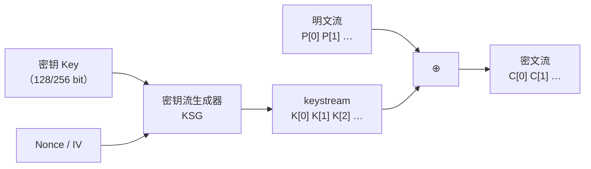
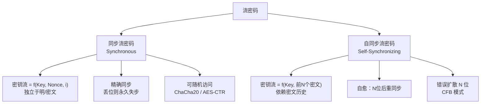

# 密码学（18）· 流密码总论

> [!abstract] TL;DR
> - 流密码逐位或逐字节加密：`C = P ⊕ keystream`，核心是**密钥流生成器（KSG）**，而非分组变换。
> - **同步流密码**（如 ChaCha20、OFB 模式）：密钥流只由密钥和 nonce 决定，与明/密文无关；一旦字节错位则永久失步。
> - **自同步流密码**（如 CFB 模式）：密钥流依赖前 N 位密文；可自动从比特错误中恢复，但错误会扩散 N 位。
> - 流密码是用**伪随机数生成器（PRG）**逼近理论上完美的**一次性密码本（OTP）**；安全性归约到 PRG 的不可区分性。
> - 经典硬件构造以 **LFSR** 为核心，单纯 LFSR 线性可被 Berlekamp-Massey 算法秒破，必须叠加**非线性组合**。
> - **致命缺陷：密钥流绝不可重用（两次一密攻击）。** 现代推荐：ChaCha20 或 AES-CTR，配合唯一 nonce。

---

## 概述与定位

分组密码将明文切块后整块变换，而**流密码**（stream cipher）走另一条路——**把密钥和 nonce 喂给一个确定性生成器，产生无限长的伪随机比特流（keystream），再与明文逐位或逐字节做 XOR**。

```
C[i] = P[i] ⊕ K[i]      # K[i] 来自密钥流生成器
```

这个思路极为简洁：XOR 可逆（解密与加密操作相同），速度极快，硬件实现只需移位寄存器。与 [[02.对称加密总论]] 所述的"混淆 + 扩散"分组框架平行，流密码用**伪随机性**取代多轮混淆。

### 流密码在系列中的位置

| 方向 | 代表 | 章节 |
|---|---|---|
| 分组密码 CTR 化（软件主流） | AES-CTR | [[13.CTR模式]] |
| 老一代流密码 | RC4 | [[19.RC4]] |
| 现代 ARX 流密码 | ChaCha20/Salsa20 | [[20.ChaCha20与Salsa20]] |
| AEAD 封装 | ChaCha20-Poly1305 | [[16.ChaCha20-Poly1305]] |
| 国密流密码 | ZUC | [[48.ZUC流密码]] |

---

## 原理与机制

### 密钥流生成器是核心

流密码可以抽象为：

```
(Key, Nonce) ──► [密钥流生成器 KSG] ──► K[0] K[1] K[2] … K[∞]
                                                  │
P[0] P[1] P[2] … ──────────────── ⊕ ──► C[0] C[1] C[2] …
```

KSG 的安全强度**等价于**其输出的伪随机性：如果 KSG 的输出与真随机字节串不可区分（即它是安全的 PRG），则密文不泄露明文信息。



> [!note] 为何称"流"
> 与分组密码等待凑满一个块（16 字节）不同，流密码可以每次只输出 1 字节甚至 1 比特，天然适合串行、实时的低延迟场景（卫星通信、早期手机信道、嵌入式 MCU）。

### 与一次性密码本（OTP）的关系

**一次性密码本**（One-Time Pad）是香农证明的理论上绝对安全方案：用真随机密钥与明文等长 XOR，密钥只用一次。其完美保密性不可突破，但代价是密钥必须与消息等长且绝不复用——工程上无法实现。

流密码是 OTP 的工程化近似：

| | OTP | 流密码 |
|---|---|---|
| 密钥长度 | = 消息长度 | 固定（128/256 bit） |
| 随机性来源 | 真随机 | 伪随机（PRG 扩展） |
| 复用密钥 | 不允许（绝对安全前提） | 可用 nonce 区分，但密钥流决不可重用 |
| 安全性 | 信息论完美 | 计算安全（基于 PRG 假设） |

流密码的本质是：用一个**确定性算法**将短密钥扩展成看起来随机的长串，其安全性基于计算复杂性假设而非信息论。这与 [[02.对称加密总论]] 对计算安全的讨论一脉相承。

---

## 同步流密码与自同步流密码

这是流密码最重要的分类，决定了容错行为与使用场景。

### 同步流密码（Synchronous Stream Cipher）

**密钥流的生成完全独立于明文和密文**，只由 `(Key, Nonce)` 决定：

```
K[i] = f(Key, Nonce, i)
C[i] = P[i] ⊕ K[i]
```

特点：
- 发送方和接收方的 KSG 必须**精确同步**（从同一位置开始）；
- 传输中若有 1 位丢失或插入，之后所有位置全部错位，解密完全乱掉——无法自愈；
- **随机访问**：可以直接计算第 N 字节的密钥流，无需顺序生成前 N-1 字节（CTR 模式正是利用这点实现并行解密）；
- 加密不影响密钥流，可以"跳解密"任意位置。

典型代表：ChaCha20、RC4（寻址版）、Salsa20、AES-CTR（[[13.CTR模式]] 本质上也是同步流密码）。

### 自同步流密码（Self-Synchronizing Stream Cipher）

**密钥流依赖前 N 个密文位**（移位寄存器装密文）：

```
K[i] = f(Key, C[i-N], C[i-N+1], …, C[i-1])
C[i] = P[i] ⊕ K[i]
```

特点：
- **自动恢复**：若传输中丢失或翻转了若干比特，最多经过 N 位后能重新同步，之后恢复正常解密；
- **错误扩散**：一个密文错误会导致之后 N 位的密钥流计算错误（密文依赖窗口 N）；
- 无法并行解密（每个 K[i] 依赖前 N 个密文）；
- 分组密码的 CFB（密文反馈）模式（见 [[14.CFB与OFB模式]]）是经典实例。

### 对比图



> [!tip] OFB 模式与同步流密码
> AES-OFB 模式（输出反馈）也属于同步流密码：它用加密输出而非密文作为反馈，密钥流完全不依赖明文，与 ChaCha20 同类。OFB 的密钥流可以提前预生成。

---

## 经典构造：LFSR 与非线性组合

### 线性反馈移位寄存器（LFSR）

LFSR 是硬件流密码的基础构件，结构极为简洁：

```
初始状态：[ s_{n-1} | s_{n-2} | … | s_1 | s_0 ]
输出位：s_0（每个时钟周期输出 1 位）
反馈：new_bit = c_{n-1}·s_{n-1} ⊕ c_{n-2}·s_{n-2} ⊕ … ⊕ c_0·s_0
移位：寄存器右移，new_bit 填入最高位
```

其特性由**反馈多项式**（特征多项式）决定：

```
p(x) = x^n + c_{n-1}·x^{n-1} + … + c_1·x + c_0
```

当 `p(x)` 是 **GF(2) 上的本原多项式**（primitive polynomial）时，LFSR 输出序列周期最大，为 `2^n - 1`（最大长序列，m 序列）。这是 LFSR 唯一安全可选的工作状态。

**典型参数示例（4 位 LFSR）**：

| 特征多项式 | 反馈抽头 | 周期 | 是否本原 |
|---|---|---|---|
| `x^4 + x + 1` | 第 4、1 位 | 15 | 是（本原） |
| `x^4 + x^2 + 1` | 第 4、2 位 | 6 | 否（可约） |

### 为何单纯 LFSR 不安全——Berlekamp-Massey 算法

LFSR 输出序列是**线性序列**（GF(2) 上的线性递推）。Berlekamp-Massey 算法能够从 **2n 个连续输出位**（n = LFSR 长度）完全恢复反馈多项式和初始状态：

```
已知输出：s_0, s_1, …, s_{2n-1}
─► B-M 算法 O(n^2) ─► 恢复特征多项式 p(x) 和初始状态
─► 之后可预测所有后续输出
```

这意味着：若密钥流由单个 LFSR 生成，攻击者只需截获 `2n` 位密文，加上已知（或猜测）的等长明文，即可还原全部密钥流。对 128 位 LFSR，仅需 256 位已知明文——远不够安全。

> [!danger] LFSR 的线性是致命弱点
> 线性意味着可代数求解。Berlekamp-Massey 是流密码分析的核心工具，任何单 LFSR 的密钥流都在它面前透明。

### 非线性组合：破线性的工程方案

为了在保留 LFSR 硬件效率的同时引入非线性，常见方案有：

| 方案 | 做法 | 代表 |
|---|---|---|
| **非线性组合生成器** | 多个 LFSR 输出喂非线性布尔函数 | Geffe 生成器 |
| **非线性滤波生成器** | 单 LFSR 状态喂非线性函数 | LILI-128 |
| **钟控生成器** | 以一个 LFSR 的输出控制另一个的时钟 | A5/1 内部、Alternating-Step Generator |
| **非线性 FSR** | 直接用非线性反馈（NLFSR） | Grain、Trivium |

---

## 硬件流密码族

### A5/1（GSM 通话加密）

A5/1 由三个 LFSR（长度 19、22、23 位）组成，以**多数表决钟控**（majority clocking）驱动：每个时钟，选择三个 LFSR 中时钟位多数值，只有与多数值相同的 LFSR 才前进。

- 总内部状态 64 位，密钥 64 位；
- 已被多次破解（彩虹表攻击、相关密钥攻击）；
- 2G GSM 仍有部署，但实际已不提供有效保护。

### E0（蓝牙加密）

E0 同样由四个 LFSR（长度 25、31、33、39 位）和一个求和组合器（summation combiner）组成，总状态 128 位。早期分析显示存在代数攻击漏洞，蓝牙现行版本已升级。

### Grain（NLFSR 族）

Grain-128a 用一个 NLFSR（128 位）和一个 LFSR（128 位）级联，NLFSR 提供非线性，LFSR 保证序列统计。Grain 专为极低门电路计数的 RFID/物联网设计，是 eSTREAM 竞赛硬件组冠军之一。

### Trivium

Trivium 由三个 NLFSR 环（长度 93、84、111 位，共 288 位状态）组成，以 AND-XOR 反馈互相驱动。设计极为简洁，分析安全强度接近 80 位，同为 eSTREAM 硬件组选手。

```
状态更新（每个时钟输出 1 位）：
t1 = s_66 ⊕ s_93
t2 = s_162 ⊕ s_177
t3 = s_243 ⊕ s_288
z  = t1 ⊕ t2 ⊕ t3            # 输出位
t1 ⊕= s_91 AND s_92 ⊕ s_171
t2 ⊕= s_175 AND s_176 ⊕ s_264
t3 ⊕= s_286 AND s_287 ⊕ s_69
```

---

## 现代趋势：专用流密码 vs 分组密码 CTR 化

历史上，软件流密码几乎只有 RC4（[[19.RC4]]），硬件则百花齐放。2000 年代 eSTREAM 竞赛（2004–2008）催生了 Salsa20、Grain、Trivium 等现代设计。但在软件层面，格局更偏向**用分组密码 CTR 模式替代专用流密码**：

| 路线 | 代表 | 优点 | 缺点 |
|---|---|---|---|
| 分组密码 CTR | AES-128-CTR / AES-256-CTR | 利用 AES-NI 硬件加速；与同一密钥的 GCM 复用 | 依赖硬件加速；软件实现较慢 |
| 专用 ARX 流密码 | ChaCha20（[[20.ChaCha20与Salsa20]]） | 软件优秀性能；无 AES-NI 时碾压 AES | 需要独立 MAC（Poly1305）才成 AEAD |
| 老式软件流密码 | RC4 | 极简 | 严重偏置漏洞、已彻底废弃 |

**现实选型**：TLS 1.3 保留 AES-128-GCM 和 ChaCha20-Poly1305；后者在移动端（无 AES-NI 的 ARM 低端设备）尤其有优势。[[16.ChaCha20-Poly1305]] 讲解了 AEAD 封装方式。

---

## 两次一密：流密码的致命使用错误

> [!danger] 密钥流绝不可重用——两次一密（Two-Time Pad）
> 如果同一个 (Key, Nonce) 对被用来加密两条不同消息 P1、P2：
> ```
> C1 = P1 ⊕ K
> C2 = P2 ⊕ K
>
> C1 ⊕ C2 = P1 ⊕ P2
> ```
> 两段密文异或后，密钥流完全消去，攻击者直接得到 `P1 ⊕ P2`。对自然语言，已知明文比例足以恢复两段明文——这正是 WEP（使用 RC4，IV 仅 24 位，快速重复）被彻底攻破的根本原因。

历史上反复出现两次一密灾难：
- **WEP**：24 位 IV，约 5000 个包后 IV 空间耗尽重复；RC4 密钥 = `IV ‖ Key`，统计攻击直接还原密钥。
- **微软 PPTP**：MS-CHAPv2 生成 RC4 密钥流，同一密钥用于两个方向，已知明文即可攻破。
- **VENONA 项目**：苏联 OTP 密钥本在压力下复用，美国 NSA 分析出大量情报（1940s–50s）。

---

## 算法流程与伪代码

### 通用同步流密码加密骨架

```
function StreamEncrypt(Key, Nonce, Plaintext):
    keystream = KSG_Generate(Key, Nonce, len(Plaintext))
    Ciphertext = []
    for i in 0..len(Plaintext)-1:
        Ciphertext[i] = Plaintext[i] XOR keystream[i]
    return Ciphertext

# 解密与加密完全相同：
function StreamDecrypt(Key, Nonce, Ciphertext):
    return StreamEncrypt(Key, Nonce, Ciphertext)
```

### ChaCha20 密钥流块生成（简化骨架，详见 [[20.ChaCha20与Salsa20]]）

```
# 512 位（64 字节）初始状态矩阵
state[0..3]  = "expa" "nd 3" "2-by" "te k"   # 常量
state[4..11] = Key[0..7]                        # 256 位密钥，8 个 uint32
state[12]    = counter                          # 块计数器（同步流密码的随机访问关键）
state[13..15]= Nonce[0..2]                      # 96 位 nonce

# 运行 20 轮 quarter-round
for round in 1..10:
    QuarterRound(0,4,8,12);  QuarterRound(1,5,9,13)
    QuarterRound(2,6,10,14); QuarterRound(3,7,11,15)
    QuarterRound(0,5,10,15); QuarterRound(1,6,11,12)
    QuarterRound(2,7,8,13);  QuarterRound(3,4,9,14)

output = state + initial_state    # 加回初始值（防可逆）
```

---

## 安全性与正确使用

### 参数选择与 nonce 唯一性

| 参数 | 推荐 | 禁忌 |
|---|---|---|
| 密钥长度 | ≥ 128 位（推荐 256 位） | 64 位以下（A5/1 时代已过期） |
| Nonce | 每次加密唯一（随机或计数器均可） | 同一 (Key, Nonce) 加密两条消息 |
| IV 空间 | ≥ 96 位（随机 nonce 碰撞概率可接受） | 24 位 IV（WEP 的悲剧） |
| 完整性 | 配合 MAC（HMAC-SHA256 / Poly1305） | 裸流密码无完整性保护 |

### 已知弱点与攻击面

| 攻击类型 | 适用场景 | 缓解 |
|---|---|---|
| 两次一密（Nonce 重用） | 任何流密码 | 严格保证 (Key, Nonce) 唯一 |
| Berlekamp-Massey | 单 LFSR 构造 | 使用非线性组合 / 现代流密码 |
| 相关密钥攻击 | A5/1 等早期设计 | 不用 GSM A5/1；使用现代算法 |
| 偏置/统计攻击 | RC4（大量研究显示初始输出有偏） | 弃用 RC4（RFC 7465 禁用于 TLS） |
| 明文污染（flip 攻击） | 裸流密码（XOR 线性） | 必须搭配 MAC 或使用 AEAD |

> [!warning] 裸流密码无认证
> `C = P ⊕ K` 是线性的：攻击者若能修改 `C[i]`，解密后 `P'[i] = P[i] ⊕ ΔC[i]` 精确可控。**流密码必须配合消息认证码**（HMAC、Poly1305 等）才能防止主动篡改。现代做法是直接用 ChaCha20-Poly1305 或 AES-GCM 等 AEAD 方案，加密与认证一体，不留空隙。

### 推荐做法

```python
# 推荐（Python cryptography 库示例）
from cryptography.hazmat.primitives.ciphers.aead import ChaCha20Poly1305
import os

key = os.urandom(32)           # 256 位随机密钥
nonce = os.urandom(12)         # 96 位随机 nonce，每次必须唯一
aad = b"authenticated header"  # 附加认证数据（可为空）

chacha = ChaCha20Poly1305(key)
ct = chacha.encrypt(nonce, plaintext, aad)     # 加密+认证
pt = chacha.decrypt(nonce, ct, aad)            # 解密+验证
```

> [!warning] 示例输出为示意
> 上述代码仅演示 API 形态，请以所用库的最新文档为准。

---

## 小结

流密码以 `C = P ⊕ keystream` 为核心操作，本质是用伪随机生成器对一次性密码本的工程近似。其安全性的全部重量落在两点：**密钥流生成器的伪随机强度**，以及**nonce 的绝对唯一性**。

| 维度 | 同步流密码 | 自同步流密码 |
|---|---|---|
| 密钥流依赖 | (Key, Nonce) | (Key, 前 N 密文) |
| 同步要求 | 精确字节对齐 | 最多 N 位后自愈 |
| 随机访问 | 支持（CTR 模式优势） | 不支持 |
| 代表 | ChaCha20、AES-CTR | AES-CFB |
| 错误传播 | 单位错误不扩散 | 扩散 N 位 |

经典 LFSR 构造高效但线性，需非线性组合才能抵抗 Berlekamp-Massey。现代软件首选 **ChaCha20**（或 AES-CTR），并封装在 AEAD 方案中以同时获得加密和完整性保护。密钥流绝不可重用，是所有流密码使用者必须刻入骨髓的铁律。

---

## 相关阅读

- [[02.对称加密总论]] — 分组与流密码的宏观对比、计算安全定义
- [[13.CTR模式]] — 分组密码 CTR 化：最主流的同步流密码实现路径
- [[14.CFB与OFB模式]] — CFB（自同步）与 OFB（同步）模式详解
- [[19.RC4]] — 历史最广泛的软件流密码，偏置弱点与废弃历程
- [[20.ChaCha20与Salsa20]] — ARX 设计，现代推荐流密码
- [[16.ChaCha20-Poly1305]] — ChaCha20 封装为 AEAD 的完整方案
- [[48.ZUC流密码]] — 国密流密码，4G/5G LTE 加密标准

---

⬅️ 上一篇 [[17.CCM与OCB与XTS]] ｜ 🏠 [[00.密码学总览]] ｜ 下一篇 [[19.RC4]] ➡️
