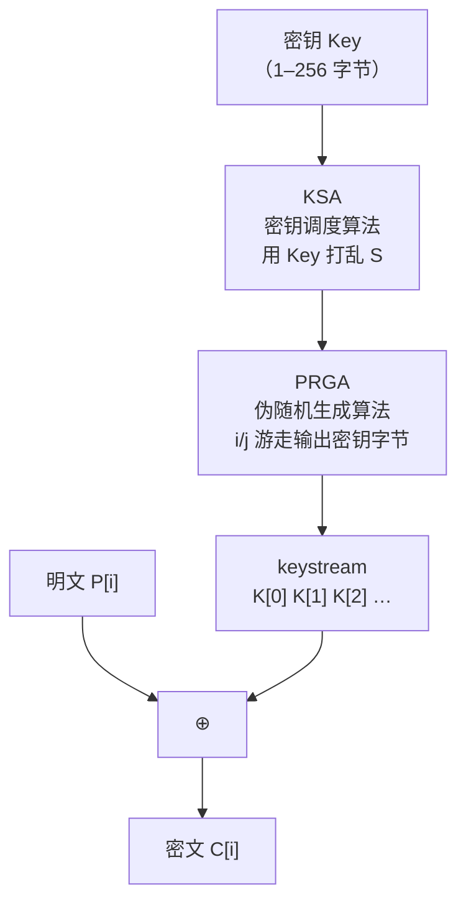
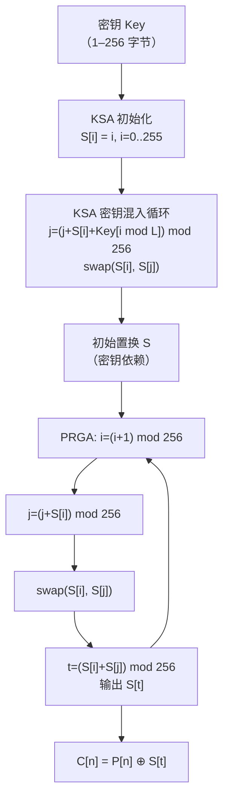
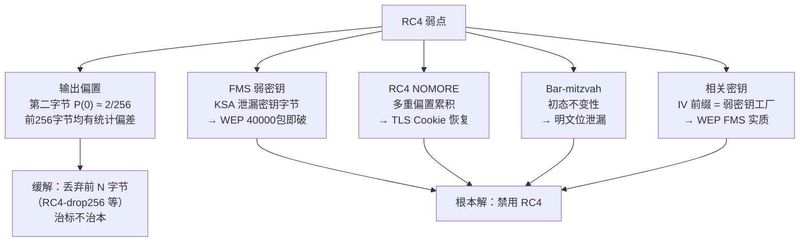

# 密码学（19）· RC4

> [!abstract] TL;DR
> - RC4（Ron Rivest，1987）是曾最广泛部署的**软件流密码**：256 字节置换状态 `S[0..255]`，两指针 `i`/`j` 游走产生每字节密钥流。
> - 核心两阶段：**KSA**（Key Scheduling Algorithm，密钥调度算法）用密钥打乱 `S`；**PRGA**（Pseudo-Random Generation Algorithm）逐字节输出密钥流。
> - 极简、极快，曾被 WEP、WPA-TKIP、SSL/TLS、RDP 广泛使用。
> - **致命弱点**：输出存在**统计偏置**（第二输出字节高概率为 0；Fluhrer-Mantin-Shamir 发现 KSA 弱密钥导致 WEP 被秒破；RC4 NOMORE 对 TLS/WPA 的实用攻击；Bar-mitzvah 攻击）。
> - **RC4-drop** 方案（丢弃前 N 字节）治标不治本，RC4 整体仍不安全。
> - **已淘汰**：RFC 7465 明确禁止 RC4 用于 TLS；**禁止在任何新系统中使用**。

---

## 概述与定位

1987 年，RSA Security 的 Ron Rivest 设计了 RC4（Rivest Cipher 4，曾标注 "Ron's Code 4"），作为内部商用流密码。1994 年匿名邮件列表泄露了其算法描述，此后成为事实上的公开算法。RC4 凭借**极简的实现**（核心不超过 30 行 C）和**优秀的软件速度**，在 1990–2000 年代被大量部署：

| 协议/产品 | RC4 用途 |
|---|---|
| WEP（802.11 无线加密） | 数据帧加密（已彻底破裂） |
| WPA-TKIP | WEP 替代过渡方案（2012 年被禁） |
| SSL/TLS | 历史上最常用的 TLS 对称算法 |
| Microsoft RDP | 早期版本连接加密 |
| SSH1 | 数据流加密（SSH2 已抛弃） |
| Adobe PDF | 文档加密选项之一 |

RC4 的本质是一个**对 256 字节数组做持续置换**的状态机，比 [[18.流密码总论]] 中描述的 LFSR 类构造更灵活，也比 AES-CTR 的"分组密码流化"更轻量。然而自 2000 年代起，密码学家持续发现其输出偏置，最终导致 RFC 7465（2015）在 TLS 中彻底禁用。

### RC4 在本系列中的位置

| 关联主题 | 章节 |
|---|---|
| 流密码基本框架（同步/自同步/KSG） | [[18.流密码总论]] |
| 对 RC4 等对称密码的偏置攻击 | [[60.对称密码攻击]] |
| 对称密码总论（计算安全/PRG 安全性） | [[02.对称加密总论]] |
| 现代替代：ChaCha20/Salsa20 | [[20.ChaCha20与Salsa20]] |

---

## 原理与机制

### 状态：256 字节置换

RC4 的全部秘密藏在一个长度为 256 的字节数组 `S[0..255]` 中，它始终是 `{0, 1, 2, …, 255}` 的一个**置换**（permutation），即每个字节恰好出现一次。两个指针 `i` 和 `j`（均为字节，初始为 0）在 `S` 上游走，每步交换两个元素，再从交换后的位置读出密钥流字节。

```
状态规模：
  S: 256 字节置换，内部状态 2048 位（256 × 8 bit）
  i: 1 字节计数器（顺序递增 mod 256）
  j: 1 字节散跳指针（由 S 内容驱动）
```

整个算法分两阶段：



---

## 算法流程详解

### KSA：密钥调度算法

**目的**：用密钥 `Key`（长度 `L` 字节，1 ≤ L ≤ 256）将恒等置换 `S = [0, 1, 2, …, 255]` 打乱，产生一个依赖密钥的初始置换。

```
KSA(Key[0..L-1]):
    # 初始化：恒等置换
    for i in 0..255:
        S[i] = i

    # 依密钥打乱
    j = 0
    for i in 0..255:
        j = (j + S[i] + Key[i mod L]) mod 256
        swap(S[i], S[j])

    return S
```

**逐步解读**：

1. **初始化阶段**：`S[i] = i`，建立恒等置换——此时 `S` 完全不依赖密钥。
2. **密钥混入阶段**：循环 256 次，每次计算 `j = (j + S[i] + Key[i mod L]) mod 256`，然后交换 `S[i]` 与 `S[j]`。
   - `Key[i mod L]` 使密钥循环覆盖所有 256 次迭代（密钥短于 256 字节时重复）。
   - 每次交换使 `S` 越来越偏离恒等，但始终保持置换性质（交换不改变"每个值恰好一个"这一不变式）。
3. 256 次迭代后，`S` 是一个由 `Key` 决定的伪随机置换；`i` 和 `j` 重置为 0 供 PRGA 使用。

> [!note] KSA 的"弱点种子"
> KSA 的问题在于：当密钥的某些字节满足特定关系（"弱密钥"，Fluhrer-Mantin-Shamir 发现），`S` 的初始状态会泄露密钥的部分信息到早期输出字节中。WEP 将 24 位 IV 直接拼接到密钥前缀，使弱密钥大量重复出现——这是 WEP 被破解的根本。

### PRGA：伪随机生成算法

**目的**：以 KSA 产生的 `S` 为起点，持续输出密钥流字节，同时更新 `S`。

```
PRGA(S):
    i = 0
    j = 0
    loop:
        i = (i + 1) mod 256          # i 顺序递增
        j = (j + S[i]) mod 256       # j 由 S[i] 驱动散跳
        swap(S[i], S[j])             # 交换，继续扰动置换

        # 输出密钥流字节
        t = (S[i] + S[j]) mod 256    # 取两指针之和 mod 256
        output byte: S[t]            # 读 S[t] 作为输出字节
```

**逐步解读**：

1. `i` 单调递增（每步 +1 mod 256），保证 256 步后遍历所有位置。
2. `j` 由 `S[i]` 驱动跳跃，引入非线性，使输出不是简单的 `S` 的读取。
3. `swap(S[i], S[j])`：每步都在继续扰动置换，使 `S` 的演化与明文无关（RC4 是同步流密码）。
4. 输出 `S[(S[i] + S[j]) mod 256]`：以两指针的 `S` 值之和为索引，从置换中取出输出字节。

### 两个关键不变式

| 不变式 | 含义 |
|---|---|
| `S` 始终是 `{0..255}` 的置换 | 交换操作不改变置换性质，每个值恰好出现一次 |
| `i` 顺序遍历 | 保证每 256 步 `S` 的每个位置被访问一次 |

### 完整流程 Mermaid 图



### 算法示例（简化 4 元素版）

为直观说明置换游走，以 `S = [0,1,2,3]`（4 元素，密钥 `Key = [2]`）示例 KSA 前两步（仅示意）：

```
初始：S = [0, 1, 2, 3], j = 0

i=0: j = (0 + S[0] + Key[0]) mod 4 = (0+0+2) mod 4 = 2
     swap(S[0], S[2]) → S = [2, 1, 0, 3]

i=1: j = (2 + S[1] + Key[1 mod 1]) mod 4 = (2+1+2) mod 4 = 1
     swap(S[1], S[1]) → S = [2, 1, 0, 3]  (自身与自身交换，无变化)

i=2: j = (1 + S[2] + Key[0]) mod 4 = (1+0+2) mod 4 = 3
     swap(S[2], S[3]) → S = [2, 1, 3, 0]
…（以此类推直到 i=3）
```

> [!note] 示例仅为说明置换机制，实际 RC4 使用 256 字节状态与真实密钥。

---

## 历史应用

RC4 的广泛部署是其轻量实现的直接结果。在 1990 年代，AES 尚未诞生，硬件加速不普遍，RC4 每字节加密代价极低，在当时的 CPU 上轻松超过 100 MB/s。

```
RC4 加密 1 字节的操作：
  2 次 mod 256 加法（等价于 AND 0xFF）
  1 次交换
  1 次 mod 256 加法
  1 次 S[] 查表
  ───────────────────────
  约 5~7 条简单指令，无复杂数学运算
```

这使得 RC4 在 SSL/TLS、WEP、SSH1、MS-RDP 等协议中成为默认选项，并维持了约 15 年的主流地位——直到密码学家系统揭示其统计缺陷。

---

## 弱点与攻击：为何 RC4 必须废弃

RC4 的问题是系统性的，不可通过参数调整修复。以下逐一梳理主要攻击。

### 1. 第二字节偏置（Roos 1995 / Mantin-Shamir 2001）

RC4 PRGA 输出的**第二字节**（即 `K[1]`，第二个输出的密钥流字节）以显著高于 1/256 的概率取值为 0：

```
理论均匀概率：P(K[1] = 0) = 1/256 ≈ 0.39%
实际观测概率：P(K[1] = 0) ≈ 2/256 ≈ 0.78%（约两倍）
```

Mantin 和 Shamir 2001 年系统分析了这一偏置，并展示了从足够多加密样本（使用相同密钥的不同明文）中统计恢复密钥流。

更广泛地，RC4 输出的前数百字节均存在不同程度的偏置：

| 输出字节位置 | 偏置性质 | 严重程度 |
|---|---|---|
| K[0] | P(K[0]=0) ≈ 1.5/256 | 中 |
| K[1] | P(K[1]=0) ≈ 2/256 | 高 |
| K[2] | 多值偏置 | 中 |
| K[3..255] | 逐渐衰减但不消失 | 低–中 |

### 2. Fluhrer-Mantin-Shamir（FMS）攻击与 WEP 的陷落

2001 年，Fluhrer、Mantin 和 Shamir 发现 RC4 KSA 存在**弱密钥**：当 `Key` 的开头几字节满足特定模式时，`S` 的初始状态中会大概率将密钥的下一字节"泄漏"到第一个输出字节 `K[0]`。

WEP 的致命设计错误在于：

```
WEP 密钥 = IV[0..2] ‖ Secret_Key[0..12]
         （24 位 IV 明文传输，拼接到密钥前）
```

攻击者可收集大量不同 IV 的 WEP 数据帧（IV 空间仅 2^24 = 16 777 216，很快穷举），筛选满足 FMS 弱密钥条件的 IV，统计每个 IV 条件下第一个密钥流字节的分布，逐字节恢复 `Secret_Key`：

```
攻击复杂度（实际工具如 aircrack-ng）：
  收集 ~40 000–85 000 个数据包
  ─► 以极高概率恢复 104 位 WEP 密钥
  ─► 典型耗时：几分钟（现代 CPU）
```

这使 WEP 成为密码史上最彻底的协议失败案例之一。

### 3. RC4 NOMORE 攻击（AlFardan et al. 2015）

研究者展示了针对 TLS 和 WPA-TKIP 中 RC4 的**实际可利用攻击**（"Numerous Occurrence MOnitoring & Recovery Exploit"）：

- 利用 RC4 输出字节的多重偏置（不仅限于前几字节），对目标加密数据（如 HTTP Cookie 或密码）进行**统计密文分析**。
- 只要攻击者能让受害者发送同一明文足够多次（例如通过脚本注入），就可逐字节统计恢复明文。
- **对 TLS 的估计**：约需 `2^{26.7}` 个样本（约 7500 万次 TLS 连接），在 52–75 小时内可还原 16 字节 Cookie。
- **对 WPA-TKIP**：约 3700 次握手，1 小时内可伪造数据包。

这是促使 RFC 7465 明确禁用 RC4 的直接推手。

### 4. Bar-mitzvah 攻击（Garman et al. 2015）

专注于 RC4 初始输出（"invariance weakness"）：当 KSA 后 `S` 处于某些特定初态（由密钥决定，约 1/256 的密钥会触发），PRGA 早期输出字节与密钥字节之间存在直接的线性关系。对 SSL/TLS：

```
~94% 的 HTTPS 连接可从 RC4 前两字节中
以统计优势提取 1 位明文信息。
```

虽然单次攻击只恢复 1 位，批量扫描的规模使其具有实际威胁意义。

### 5. 相关密钥攻击（FMS 的推广）

RC4 KSA 对**相关密钥**极度敏感：若攻击者知道大量密钥之间的部分差异（如 WEP 的 IV 前缀），即可利用 KSA 的弱密钥结构恢复秘密部分。这使任何"在密钥中直接嵌入公开数据"的设计都面临致命威胁。

### 偏置与攻击总览



---

## RC4-drop：治标不治本

鉴于早期输出字节偏置严重，曾提出 **RC4-drop[N]** 方案：运行 PRGA 但丢弃前 N 字节，从第 N+1 字节开始使用密钥流。常见建议值：

| 方案 | 丢弃字节数 | 状态 |
|---|---|---|
| RC4-drop256 | 256 字节 | 已标准化到部分实现中 |
| RC4-drop768 | 768 字节 | IETF 建议的最低限 |
| RC4-drop3072 | 3072 字节 | 更保守的建议 |

然而 **RC4-drop 无法解决 RC4 的根本问题**：

1. 丢弃前 N 字节只能缓解早期字节的强偏置，但 RC4 PRGA 整体输出分布仍然统计偏离均匀，RC4 NOMORE 等攻击利用的是长程偏置，丢弃前缀无济于事。
2. FMS 类弱密钥攻击针对 KSA 结构，不因丢弃输出字节而消除。
3. RC4-drop 是**安全工程上的"打补丁"**：正确答案是更换算法，而非修补一个根本存在设计缺陷的算法。

---

## 安全性与正确使用

### RFC 7465：TLS 禁止 RC4

2015 年 2 月，IETF 发布 **RFC 7465**《Prohibiting RC4 Cipher Suites》，明确：

```
"RC4 can no longer be seen as providing a sufficient level of security
 for TLS sessions. ... Therefore, RC4-based cipher suites MUST NOT
 be used."
```

主要节点时间线：

| 时间 | 事件 |
|---|---|
| 1994 | RC4 算法描述泄露（Cypherpunks 邮件列表） |
| 1995 | Roos 发现 KSA 弱密钥与初始字节偏置 |
| 2001 | FMS 攻击破解 WEP；Mantin-Shamir 第二字节偏置 |
| 2003 | IEEE 802.11 弃用 WEP，推 WPA（仍用 RC4） |
| 2012 | WPA-TKIP 被禁用于 802.11n 以上网络 |
| 2013 | BEAST/Lucky-13 重新引发 TLS RC4 弃用讨论 |
| 2015 | RC4 NOMORE + Bar-mitzvah 发表；RFC 7465 禁用 RC4 |
| 2016 | 主流浏览器全面移除 RC4 支持 |

### 已知弱点总结

| 弱点 | 影响范围 | 是否可修复 |
|---|---|---|
| 初始字节偏置（第二字节 2/256） | 所有 RC4 使用 | 否（RC4-drop 只治标） |
| FMS 弱密钥（IV 前缀） | WEP 等 IV‖Key 拼接设计 | 否（KSA 结构固有） |
| RC4 NOMORE 长程偏置 | TLS、WPA-TKIP | 否（RC4 本质偏差） |
| Bar-mitzvah 初态泄漏 | TLS/SSL | 否 |
| 相关密钥 | 任何 IV 前缀拼接密钥 | 否 |
| 无认证（XOR 线性翻转） | 裸 RC4 | 需搭配 MAC（但 RC4 已废弃）|

### 正确使用建议：彻底抛弃

> [!danger] RC4 已淘汰——禁止在任何新系统中使用
> - **任何新系统均不得使用 RC4**，无论 RC4-drop 还是任何变体。
> - 遗留系统若仍在使用 RC4，应立即升级到 AES-GCM（需硬件加速时）或 ChaCha20-Poly1305（软件优先时）。
> - RFC 7465 的禁止是强制性的（MUST NOT）；主流 TLS 库（OpenSSL 1.1+、BoringSSL、mbedTLS）均默认禁用 RC4。

**替代方案选型**：

| 场景 | 推荐方案 | 章节 |
|---|---|---|
| TLS 对称加密 | AES-128-GCM / ChaCha20-Poly1305 | [[16.ChaCha20-Poly1305]] |
| 嵌入式/低功耗 | ChaCha20（无 AES-NI 时优先） | [[20.ChaCha20与Salsa20]] |
| 磁盘/文件加密 | AES-256-XTS | [[17.CCM与OCB与XTS]] |
| 国密合规 | SM4-GCM / ZUC | [[45.SM4分组密码]] / [[48.ZUC流密码]] |
| 任何 AEAD 需求 | AES-GCM 或 ChaCha20-Poly1305 | [[15.AEAD原理与GCM]] |

**迁移验证命令**（检查 OpenSSL 是否禁用 RC4）：

```bash
openssl ciphers -v 'ALL:!RC4' | grep -i rc4
# 应无输出——若有输出说明 RC4 仍在候选列表中

openssl s_client -connect example.com:443 -cipher RC4-SHA
# 应得到 handshake failure，而非成功握手
```

> [!warning] 示例输出为示意
> 上述命令的实际输出依 OpenSSL 版本和服务端配置而异，仅用于演示检查思路。

---

## 小结

RC4 以其**极简的 256 字节置换状态机**独步 1990–2010 年代：KSA 用密钥打乱置换，PRGA 以 `i`/`j` 双指针游走、交换并输出 `S[(S[i]+S[j]) mod 256]`，实现了当时最快的软件流加密。

然而这一优雅的设计有根本性的统计缺陷：KSA 对弱密钥极度敏感，PRGA 输出字节存在不可消除的偏置，FMS、RC4 NOMORE、Bar-mitzvah 等攻击将这些缺陷转化为对 WEP、TLS、WPA-TKIP 的实际破坏。RC4-drop 是工程补丁，无法从根本上修复这些问题。

RC4 的历史价值在于：它清晰地展示了**一个算法即使逻辑上优雅、速度上领先，也可能在统计分析面前完全失效**——密码算法的安全性不能仅凭直觉或速度保证，必须经受严格的数学分析与实际攻击检验。

| 维度 | RC4 |
|---|---|
| 状态规模 | 256 字节置换（2048 bit） |
| 密钥长度 | 1–256 字节（历史常见 40/128 bit） |
| 速度 | 极快（历史上软件最快流密码之一） |
| 安全性 | 已破裂（统计偏置不可修复） |
| 标准状态 | RFC 7465 禁止用于 TLS；应全面废弃 |
| 替代方案 | ChaCha20-Poly1305 / AES-GCM |

---

## 相关阅读

- [[18.流密码总论]] — 流密码体系框架、同步/自同步、LFSR 构造
- [[02.对称加密总论]] — 对称加密全景、安全性定义与计算安全基础
- [[60.对称密码攻击]] — padding oracle、IV 重用、ECB、统计偏置攻击体系
- [[20.ChaCha20与Salsa20]] — RC4 的现代替代，ARX 设计，无偏置统计特性
- [[16.ChaCha20-Poly1305]] — ChaCha20 封装为 AEAD，TLS 1.3 推荐套件
- [[15.AEAD原理与GCM]] — AES-GCM，另一条 TLS 1.3 推荐路线
- [[48.ZUC流密码]] — 国密 ZUC，4G/5G 标准，设计上规避了 RC4 的弱点

---

⬅️ 上一篇 [[18.流密码总论]] ｜ 🏠 [[00.密码学总览]] ｜ 下一篇 [[20.ChaCha20与Salsa20]] ➡️
