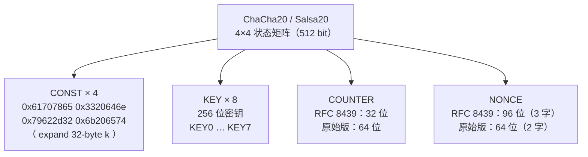
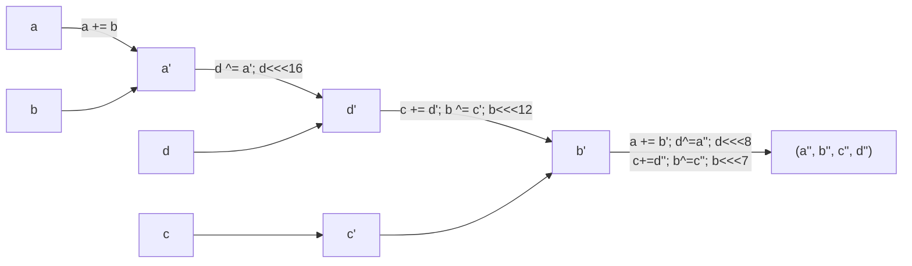
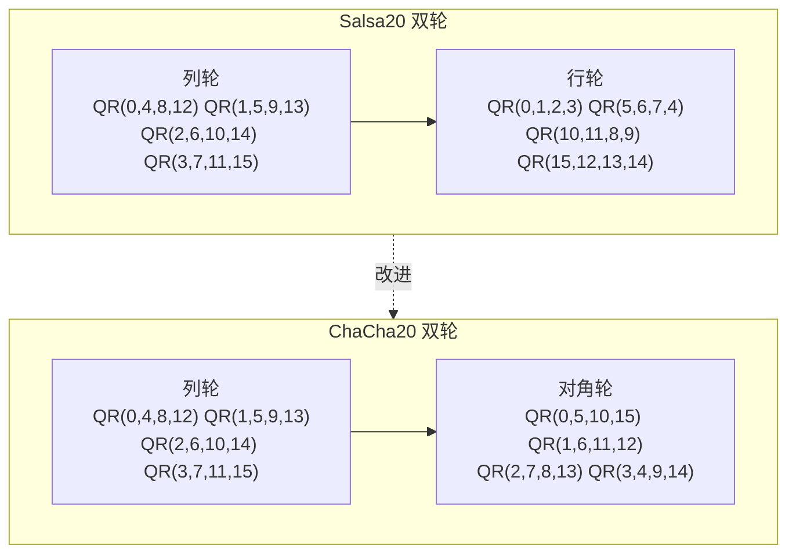

# 密码学（20）· ChaCha20与Salsa20

> [!abstract] TL;DR
> - **Salsa20**（Bernstein，2005）是第一个成熟的 ARX 流密码：仅用 Add、Rotate、XOR，没有 S 盒，无需查表，天然恒定时间、抗时序侧信道，软件效率极高；入选 eSTREAM 最终组合。
> - **ChaCha20** 是 Salsa20 的改进变体：同样 4×4 状态、20 轮，但改变了 quarter-round 的旋转量与轮次布局（引入对角轮），使每轮扩散更快、安全裕度更高。
> - 两者均以**计数器 + nonce** 控制密钥流位置，天然支持随机访问，与 CTR 模式同理（见 [[13.CTR模式]]）。
> - **RFC 8439** 将 ChaCha20 固定为 256 位密钥 + 96 位 nonce + 32 位计数器；该版本是 [[16.ChaCha20-Poly1305]]、TLS 1.3、WireGuard 的核心。
> - 无 AES-NI 时，ChaCha20 的纯软件速度优于 AES；有 AES-NI 时 AES-GCM 更快——两者形成互补。
> - 核心禁忌：**nonce 绝不能在同一密钥下重用。**

---

## 概述与定位

[[18.流密码总论]] 中提到，现代流密码的两大主流方向是"分组密码 CTR 化"和"专用 ARX 流密码"。Salsa20/ChaCha20 正是后者的代表——它们完全脱离分组密码框架，用最简单的三种 CPU 指令（加法、循环移位、XOR）在一个 512 位状态上迭代，直接产生密钥流。

与老一代流密码 [[19.RC4]] 相比，ChaCha20 家族有两个本质改进：

1. **ARX 而非 S 盒**：RC4 靠 KSA 打乱一张 256 字节的排列表，存在多处统计偏置（见 [[19.RC4]] 的弱点分析）。ARX 结构没有查表，没有数据相关内存访问，几乎不存在 cache-timing 侧信道。
2. **计数器驱动、可随机访问**：RC4 状态机是纯顺序的，无法跳到密钥流任意位置；ChaCha20 通过调整计数器字段，可直接生成任意 64 字节块，支持并行加密。

本篇专注原理；[[16.ChaCha20-Poly1305]] 讲解将 ChaCha20 与 Poly1305 MAC 组合为 AEAD 的工程细节。

---

## 原理与机制

### 4×4 状态矩阵

Salsa20 和 ChaCha20 的共同基础是一个 **4×4 矩阵，共 16 个 32 位无符号整数（512 位）**。字段按固定语义分配：

```
┌────────┬────────┬────────┬────────┐
│ CONST0 │ CONST1 │ CONST2 │ CONST3 │  ← 4 个常量字（"expand 32-byte k"）
├────────┼────────┼────────┼────────┤
│  KEY0  │  KEY1  │  KEY2  │  KEY3  │
├────────┼────────┼────────┼────────┤  ← 密钥 256 位（8 个字）
│  KEY4  │  KEY5  │  KEY6  │  KEY7  │
├────────┼────────┼────────┼────────┤
│ CTR/0  │ CTR/1  │ NONCE0 │ NONCE1 │  ← 计数器 + nonce（共 4 个字，下文分版本）
└────────┴────────┴────────┴────────┘
```

**常量**：ASCII 字符串 `"expand 32-byte k"` 按小端序拆为四个 32 位字，固定不变，称为 σ（sigma）。这种"魔数公开可审计"的做法与 Nothing-Up-My-Sleeve 设计哲学一致，防止后门常量。

**密钥**：256 位，8 个 32 位字（KEY0–KEY7）。

**计数器 + nonce**：两个方案并存，差别见"RFC 版本"节。

#### Mermaid 状态矩阵



### ARX 设计原则

ARX = **A**ddition + **R**otation + **XOR**，三种操作的循环嵌套：

- **模 2³² 加法**（ADD）：引入进位，使结果非线性于 XOR 视角。
- **循环移位**（ROL / `<<<`）：重排比特位，加速扩散；不同位置用不同旋转量，破坏对称性。
- **异或**（XOR）：混合两个字，可逆，不增加代价。

三者组合既不需要 S 盒，也没有分支或内存查表，**每条指令的执行时间与数据无关**，从设计层消除时序侧信道。这与 AES 的 SubBytes（MixColumns 的字节查表）形成对比——AES 在没有 AES-NI 指令的平台上，查表实现仍面临 cache-timing 风险。

### Salsa20：quarter-round

Salsa20 的基本变换单元是 **quarter-round（QR）**，作用于状态中选出的四个 32 位字 `(a, b, c, d)`：

```
# Salsa20 quarter-round(a, b, c, d)
b ^= (a + d) <<< 7
c ^= (b + a) <<< 9
d ^= (c + b) <<< 13
a ^= (d + c) <<< 18
```

每步都是"两个字相加 → 循环左移 → 与第三个字 XOR"，四步下来四个字彼此充分混合。

Salsa20 的**轮次结构**：

- **列轮（column round）**：对矩阵 4 列各执行 1 次 QR，共 4 次 QR。
- **行轮（row round）**：对矩阵 4 行各执行 1 次 QR，共 4 次 QR。
- 列轮 + 行轮 = 1 个**双轮（double-round）**；Salsa20 执行 **10 个双轮 = 20 轮**。

20 轮结束后，将当前状态各字**与初始状态对应字做模 2³² 加**（Add-initial-state），再序列化为小端序字节流，输出 64 字节密钥流块。这一"加回初始值"步骤极为关键：若无它，则逆向 20 轮可还原状态，整个函数可逆，安全性丧失。

### ChaCha20：改进的 quarter-round 与对角轮

ChaCha20 的 quarter-round 调整了旋转量和操作顺序：

```
# ChaCha20 quarter-round(a, b, c, d)
a += b;  d ^= a;  d <<<= 16
c += d;  b ^= c;  b <<<= 12
a += b;  d ^= a;  d <<<= 8
c += d;  b ^= c;  b <<<= 7
```

与 Salsa20 的关键差异：

| 特性 | Salsa20 | ChaCha20 |
|---|---|---|
| 旋转量 | 7, 9, 13, 18 | 16, 12, 8, 7 |
| 每步结构 | 先移后加再 XOR | 先加再 XOR 再移（更紧凑） |
| 旋转是否含 16 | 否 | **是**（16 位移在 ARM NEON 可用 vswp 等廉价操作） |
| 扩散速度 | 稍慢 | 每个双轮后扩散更充分 |

ChaCha20 的**轮次结构**引入了对角轮：

- **列轮**：对矩阵列 (0,4,8,12)、(1,5,9,13)、(2,6,10,14)、(3,7,11,15) 各执行一次 QR。
- **对角轮**：对矩阵对角线 (0,5,10,15)、(1,6,11,12)、(2,7,8,13)、(3,4,9,14) 各执行一次 QR。

对角轮使得每一个双轮后，矩阵的每个字都已被混合过至少两次，不再有"行轮只混合行、列轮只混合列"的局限性——扩散更均匀，对差分与线性分析的抵抗力更强。

#### Mermaid：quarter-round 数据流



### 密钥流生成：计数器 + nonce 的作用

ChaCha20/Salsa20 产生的每一个 64 字节块由**唯一计数器值**决定：

```
keystream_block[i] = ChaCha20_block(key, nonce, counter=i)
```

加密时：
```
ciphertext[64*i : 64*(i+1)] = plaintext[64*i : 64*(i+1)] XOR keystream_block[i]
```

这与 [[13.CTR模式]] 的 CTR 加密本质相同——分组密码 CTR 模式用 AES 加密计数器，ChaCha20 把计数器塞入状态矩阵直接产生密钥流，跳过了"分组加密"这一概念层。

两者共同优势：
- **随机访问**：任意块 `i` 可独立计算，无需顺序处理前 `i-1` 块。
- **天然并行**：不同块互不依赖，多核/SIMD 可同时计算多个块。

### RFC 8439 变体与原始 Salsa20 的参数对比

| 参数 | 原始 Salsa20 | 原始 ChaCha20 | **RFC 8439 ChaCha20** |
|---|---|---|---|
| 密钥 | 128 或 256 位 | 256 位 | **256 位** |
| nonce | 64 位（2 字） | 64 位（2 字） | **96 位（3 字）** |
| 计数器 | 64 位（2 字） | 64 位（2 字） | **32 位（1 字）** |
| 最大单次加密 | 2⁶⁴ × 64 B | 2⁶⁴ × 64 B | 2³² × 64 B = 256 GB |
| 主要应用 | eSTREAM 通用 | 过渡 | TLS 1.3、WireGuard |

RFC 8439 将 nonce 从 64 位扩展为 96 位，是为了方便在随机 nonce 场景下降低碰撞概率（96 位随机 nonce 生成 2³² 次前碰撞概率可忽略）；计数器缩减到 32 位，256 GB 单次上限在实际应用中绰绰有余。

---

## 算法流程详解

### 完整 ChaCha20 块函数（RFC 8439）

状态初始化：

```
state[0..3]   = [0x61707865, 0x3320646e, 0x79622d32, 0x6b206574]  # 常量
state[4..11]  = key[0..7]      # 256 位密钥，8 个小端序 32 位字
state[12]     = counter        # 32 位计数器（初始通常为 0 或 1）
state[13..15] = nonce[0..2]    # 96 位 nonce，3 个小端序 32 位字
```

伪代码（一次 block 的生成）：

```
function chacha20_block(key, nonce, counter):
    # 初始化
    s[0..3]   = SIGMA            # 魔数常量
    s[4..11]  = key_words        # 8 个 32 位字
    s[12]     = counter
    s[13..15] = nonce_words      # 3 个 32 位字

    working = copy(s)            # 工作状态，初始等于初始状态

    # 20 轮（10 个双轮：列轮 + 对角轮）
    for i in range(10):
        # 列轮：QR 作用于矩阵 4 列
        QR(working, 0,  4,  8, 12)
        QR(working, 1,  5,  9, 13)
        QR(working, 2,  6, 10, 14)
        QR(working, 3,  7, 11, 15)
        # 对角轮：QR 作用于矩阵 4 条对角线
        QR(working, 0,  5, 10, 15)
        QR(working, 1,  6, 11, 12)
        QR(working, 2,  7,  8, 13)
        QR(working, 3,  4,  9, 14)

    # 加回初始状态（模 2³²，字级）
    for i in range(16):
        working[i] = (working[i] + s[i]) & 0xFFFFFFFF

    # 序列化为 64 字节（小端序）
    return serialize_little_endian(working)
```

**"加回初始状态"的必要性**：20 轮 ARX 变换是**可逆**的——如果知道输出，理论上可逆推还原状态，从而恢复密钥。加回初始状态后，攻击者面对的是 `f(x) + x` 形式（类似 Davies-Meyer 结构），在不知道 `x`（初始状态即密钥）的情况下无法分离 `f(x)`，函数不可逆。

### 加密与解密

```
function chacha20_encrypt(key, nonce, plaintext, initial_counter=0):
    output = []
    for i, block_start in enumerate(range(0, len(plaintext), 64)):
        keystream = chacha20_block(key, nonce, initial_counter + i)
        block = plaintext[block_start : block_start + 64]  # 最后一块可能不足 64 字节
        output += [p ^ k for p, k in zip(block, keystream)]
    return output

# 解密与加密完全对称（XOR 互逆）
chacha20_decrypt = chacha20_encrypt
```

### Salsa20 与 ChaCha20 列轮对比



---

## 性能与平台

### 无硬件加速时的速度优势

AES 在没有 AES-NI 的 CPU 上依赖查表实现（T-table），受 L1 cache 大小限制，速度显著下降且有侧信道风险。ChaCha20 只用整数加法和移位，纯 C 实现即可达到：

| 平台 | AES-256-GCM（软件） | ChaCha20（软件） |
|---|---|---|
| x86-64（有 AES-NI） | ~1–4 GB/s | ~1–3 GB/s |
| ARM Cortex-A53（无 AES 扩展） | ~100–200 MB/s | ~500–800 MB/s |
| Cortex-A72（有 AES 扩展） | ~2 GB/s | ~1 GB/s |

数据说明：有 AES-NI/ARM AES 扩展时 AES-GCM 反超；无硬件加速时 ChaCha20 明显更快。这正是 Google 推动 TLS 使用 ChaCha20 的历史动因——2013 年大量 Android 设备无 AES 硬件加速。

### SIMD 向量化

ChaCha20 的列轮和对角轮可分别映射到 128 位 SIMD 寄存器（SSE2/NEON/AVX2），4 条 QR 流水并行执行，进一步提速。16 位旋转量在 NEON 里直接用向量字节排列（vtbl/vrev）实现零延迟，是 ChaCha20 选择 16 作旋转量的实用理由之一。

---

## 安全性与正确使用

### 已知密码分析结论

| 目标 | 最佳已知攻击 | 实际裕度 |
|---|---|---|
| Salsa20/20 | 无实际攻击；差分概率随轮数指数下降 | 充足 |
| ChaCha20/20 | 同上；每双轮扩散更完整 | 充足 |
| ChaCha12 | 学术上比 ChaCha20 稍弱，无实际威胁 | 合理 |
| ChaCha8 | 已有区分器（非密钥恢复），不推荐加密 | 薄 |
| Salsa20/8 | 存在密钥恢复攻击（学术），不可用于加密 | 不足 |

20 轮提供了充足的**安全裕度**（safety margin）。标准使用场景应坚持 ChaCha20（即 ChaCha/20），仅在受严格性能约束且经充分安全评估的嵌入式场景下才考虑 ChaCha12，**永不使用 ChaCha8 或 Salsa20/8 做加密**。

### nonce 唯一性：最关键约束

流密码的安全完全建立在"相同密钥下密钥流不重复"这一前提上。若同一 `(key, nonce)` 对被用于两条不同明文：

```
C1 = P1 XOR KS
C2 = P2 XOR KS
C1 XOR C2 = P1 XOR P2   # 密钥流消掉，明文差分直接暴露
```

这就是**两次一密（two-time pad）攻击**，详见 [[18.流密码总论]] 的相关分析。在 [[16.ChaCha20-Poly1305]] 中，nonce 碰撞还额外暴露 Poly1305 的 OTP 密钥，导致 MAC 完全失效。

**nonce 管理策略**：

1. **递增计数器**（首选，最不易出错）：每条消息 nonce 单调递增，永不回绕。多进程/多线程需要协调或分区。
2. **随机 nonce**（RFC 8439 场景）：96 位随机 nonce，生日界限约为 2⁴⁸ 次才有 50% 碰撞概率。**推荐上限：同密钥下 2³² 次以内使用随机 nonce**（安全裕度充足）。
3. **nonce 分区**（分布式系统）：将 96 位 nonce 按高位分区（如高 32 位 = 节点 ID，低 64 位 = 本地计数器）。

> [!warning] nonce 重用是灾难性的
> 不同于 AES-CBC IV 泄漏仅导致前块密文可见，ChaCha20 nonce 重用使攻击者直接获得两条明文的 XOR，通常足以恢复完整明文（自然语言有大量冗余）。有 Poly1305 时还同时丢失认证，是加密系统的完全崩溃。

### 正确使用指南

| 场景 | 推荐做法 |
|---|---|
| 通用网络加密 | ChaCha20-Poly1305（[[16.ChaCha20-Poly1305]]），不要裸用 ChaCha20 |
| 密钥/会话管理 | 每次会话生成新随机 256 位密钥 |
| nonce 生成 | 随机或严格单调递增；部署监控检测 nonce 重用 |
| 密钥长度 | 始终 256 位；不支持 128 位变体（RFC 8439 不含 128 位） |
| 内核/协议集成 | WireGuard 内置 ChaCha20-Poly1305；TLS 1.3 `TLS_CHACHA20_POLY1305_SHA256` |
| 避免 | 裸 XOR（无 MAC）；nonce 硬编码；在 128 位 nonce 原始格式与 RFC 8439 格式之间混用 |

### 与 AES-CTR/AES-GCM 的选型

- **有 AES-NI**：AES-GCM 通常更快，首选 AES-GCM 或 AES-128-GCM；ChaCha20-Poly1305 备用。
- **无 AES-NI / ARM 嵌入式**：ChaCha20-Poly1305 明显更快且更安全（无 AES 查表侧信道）。
- **跨平台一致性**：若希望一套代码在所有平台都快且安全，ChaCha20-Poly1305 是更稳健的选择。
- **nonce 安全预算**：AES-GCM 96 位随机 nonce 在 2³² 次后有不可忽略碰撞风险；ChaCha20-Poly1305 同等安全。

---

## 小结

Salsa20 奠定了 ARX 流密码的范式：用最简单的 CPU 操作（Add/Rotate/XOR）和 4×4 状态矩阵迭代 20 轮，在软件中高效产生密码安全的密钥流，天然规避 S 盒查表带来的时序侧信道。

ChaCha20 在 Salsa20 基础上优化了 quarter-round 旋转量与对角轮布局，使每双轮的扩散更完整、ARM NEON 向量化更高效，安全裕度更宽。RFC 8439 将其固定为 256 位密钥 + 96 位 nonce + 32 位计数器的标准形式，成为 [[16.ChaCha20-Poly1305]]、TLS 1.3、WireGuard 的密码学基石。

使用 ChaCha20 家族的核心约束只有一条：**nonce 在同一密钥下必须唯一**，其余一切安全性都由精心设计的 20 轮 ARX 保证。

---

## 相关阅读

- [[18.流密码总论]] —— 流密码理论基础：密钥流、同步/自同步、LFSR、两次一密攻击
- [[19.RC4]] —— 老一代流密码：KSA/PRGA、偏置弱点、对比 ARX 设计的本质区别
- [[13.CTR模式]] —— 分组密码 CTR 模式与 ChaCha20 的计数器机制对比
- [[16.ChaCha20-Poly1305]] —— 将 ChaCha20 封装为 AEAD 的工程细节与 RFC 8439
- [[15.AEAD原理与GCM]] —— AES-GCM 与 ChaCha20-Poly1305 的互补关系
- [[43.随机数与熵]] —— nonce 的生成需要密码安全随机数源（CSPRNG）
- RFC 8439：*ChaCha20 and Poly1305 for IETF Protocols*（标准文档）
- Daniel J. Bernstein, "ChaCha, a variant of Salsa20", 2008

---

⬅️ 上一篇 [[19.RC4]] ｜ 🏠 [[00.密码学总览]] ｜ 下一篇 [[21.非对称加密总论]] ➡️
