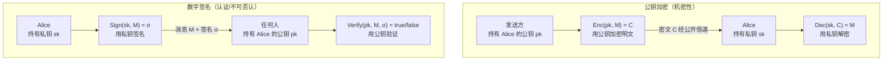
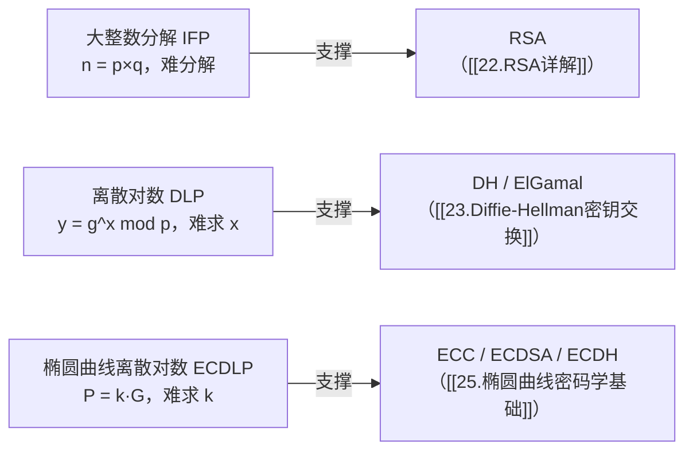
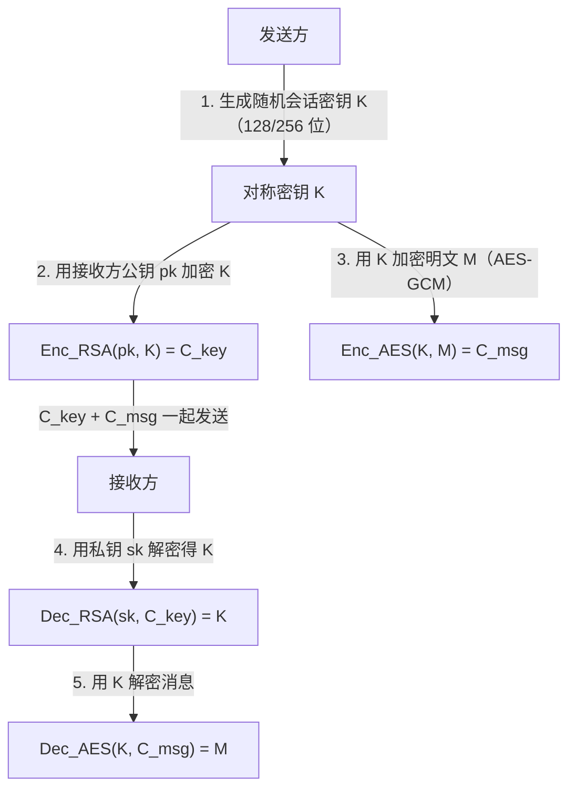
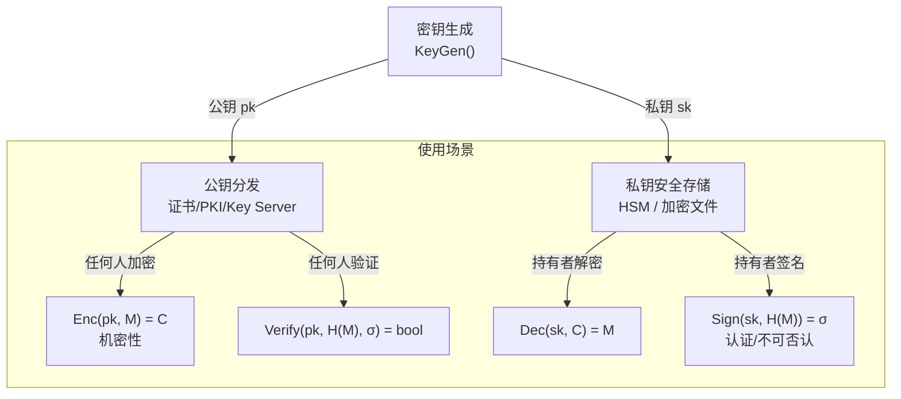
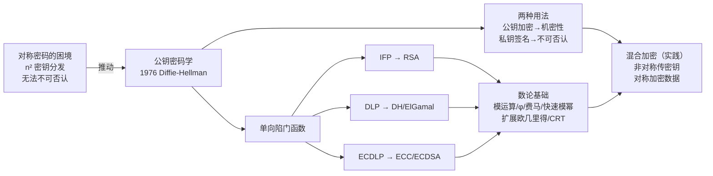

# 密码学（21）· 非对称加密总论

> [!abstract] TL;DR
> - **核心思想**：每个参与者持有一对密钥——**公钥**（可公开）与**私钥**（保密）；数学上满足"公钥加密→私钥解密"和"私钥签名→公钥验证"，两个方向互不可逆。
> - **解决的两大难题**：① [[02.对称加密总论]] 的 n² 密钥分发问题——陌生人可安全协商会话密钥无需提前共享秘密；② **不可否认**——签名者无法事后抵赖，对称 MAC 做不到这一点。
> - **数学支柱**——**单向陷门函数**：正向易算、反向难算，但持有"陷门"（私钥）可高效求逆。三大困难问题支撑三大方向：**大整数分解** → RSA；**离散对数（DLP）** → DH/ElGamal；**椭圆曲线离散对数（ECDLP）** → ECC/ECDSA。
> - **数论地基**：模运算与同余、欧拉函数 φ(n)、费马小定理/欧拉定理、快速模幂、扩展欧几里得（模逆）、中国剩余定理 CRT、DLP——这些是本系列后续所有非对称算法的共同语言，本篇逐一讲清。
> - **实践：混合加密**。非对称运算慢（RSA 2048 位加密 vs AES 块加密相差数百倍），实际系统永远是"非对称传递对称密钥 → 对称加密数据"（TLS 握手即此范式）。

本篇是非对称子版块（第 21–28 篇）的**总论与数学铺垫**，后续所有算法篇直接引用此处结论。公钥加密应用见 [[22.RSA详解]]；密钥交换见 [[23.Diffie-Hellman密钥交换]]；椭圆曲线入门见 [[25.椭圆曲线密码学基础]]。

---

## 概述与定位

### 对称加密遗留了什么问题

[[02.对称加密总论]] 结尾指出了对称加密的两个根本困境：

**1. 密钥分发（Key Distribution）**

n 个用户两两安全通信，必须预先共享 n(n-1)/2 把密钥。100 个用户需要 4 950 把密钥，10 000 个用户需要约 5 000 万把。更棘手的是：互不相识的陌生人（浏览器与某电商服务器）如何在公开信道上协商出一把只有他们知道的密钥？对称密码无解，因为**任何在公开信道上传输的信息都可以被窃听者截获用于导出同样的密钥**。

**2. 不可否认（Non-repudiation）**

Alice 用 HMAC 给 Bob 发了一条消息。Bob 能验证消息完整性，但无法向第三方证明"是 Alice 发的"——因为 Bob 自己也掌握同一把密钥，理论上可以伪造。对称密码无法提供法律意义上的"签名"。

> [!note] 非对称密码学于 1976 年由 Diffie 与 Hellman 在论文《New Directions in Cryptography》中提出，次年 RSA 算法问世，彻底改变了密码学格局。

---

## 原理与机制

### 公钥/私钥对：核心模型

非对称密码学的本质是：**密钥不再是单一共享秘密，而是一对数学上关联的密钥**。

```
KeyGen() → (pk, sk)     -- pk: 公钥（public key），sk: 私钥（secret key）
```

- **公钥 pk**：可以完全公开，写在证书里、发布到 Key Server，任何人都能拿到。
- **私钥 sk**：仅持有者保管，永不离开本地（理想情况下存在 HSM/TPM）。

两把密钥的核心性质：**用其中一把加工过的数据，只有另一把能还原**，且从 pk 无法高效推出 sk。

### 两种用法：机密性 vs 认证

非对称密码有两种截然不同的使用方向，用 Mermaid 图展示：



| 用途 | 操作密钥 | 还原密钥 | 目标 |
|---|---|---|---|
| **加密** | 接收方公钥（任何人可加密） | 接收方私钥（只有接收方能解密） | 机密性 |
| **签名** | 发送方私钥（只有发送方能签名） | 发送方公钥（任何人可验证） | 认证 + 不可否认 |

> [!important] 方向不能混淆。"用私钥加密"在 RSA 中等同于签名（结果任何人都可用公钥"解密"看到），不提供机密性。工程中一定要根据目标选择正确操作方向。

### 单向陷门函数

非对称密码的数学核心是**单向陷门函数**（Trapdoor One-Way Function）：

```
正向（容易）：y = f(x)         -- 给定 x，快速计算 y
反向（困难）：x = f⁻¹(y)       -- 给定 y，在没有陷门时计算 x 极其困难
有陷门（容易）：x = f_t⁻¹(y)  -- 持有陷门 t（私钥），可高效求逆
```

三大困难问题分别提供三种陷门：

| 困难问题 | 正向操作 | 反向难题 | 应用 |
|---|---|---|---|
| **大整数分解（IFP）** | 计算 n = p × q（两大素数乘积） | 从 n 分解出 p, q | RSA |
| **离散对数（DLP）** | 计算 g^x mod p | 从 g^x mod p 还原 x | DH / ElGamal |
| **椭圆曲线离散对数（ECDLP）** | 计算 P = k·G（点的标量乘） | 从 P, G 还原 k | ECC / ECDSA / ECDH |

ECDLP 难度最高（在同等安全级别下私钥最短），这也是 ECC 正在取代传统 RSA/DH 的根本原因。

---

## 数论基础

> [!note] 这一节是本系列非对称篇（第 21–28 篇）的**共同数学语言**。后续各篇直接引用这里的结论，不再重复推导。请认真读完。

### 1. 模运算与同余

**模运算**：a mod n 是 a 除以 n 的余数，结果在 `{0, 1, ..., n-1}` 中。

```
17 mod 5 = 2     (17 = 3 × 5 + 2)
-3 mod 7 = 4     (−3 = −1 × 7 + 4，余数恒非负)
```

**同余关系**：`a ≡ b (mod n)` 意为 n | (a − b)（n 整除 a-b），即 a 和 b 除以 n 余数相同。

模运算对加减乘封闭（可先运算再取模，也可逐步取模，结果相同）：

```
(a + b) mod n = ((a mod n) + (b mod n)) mod n
(a × b) mod n = ((a mod n) × (b mod n)) mod n
```

**模逆**：若存在 x 使得 `a × x ≡ 1 (mod n)`，则称 x 为 a 在模 n 意义下的逆元，记作 a⁻¹ mod n。
条件：a⁻¹ mod n 存在**当且仅当** gcd(a, n) = 1（a 与 n 互素）。

### 2. 欧拉函数 φ(n)

**φ(n)**（Euler's totient function，欧拉函数）定义为：小于等于 n 且与 n 互素的正整数个数。

关键公式：

```
n = p（素数）         → φ(p) = p - 1         (1 到 p-1 全部与 p 互素)
n = p^k               → φ(p^k) = p^k - p^(k-1)
n = p × q（不同素数） → φ(n) = (p-1)(q-1)   -- RSA 的核心公式
n = p1^a1 × ... × pk^ak → φ(n) = n × ∏(1 - 1/pi)   -- 乘性公式
```

**直观理解**：φ(n) 是模 n 乘法群 Z*_n 的阶（元素个数）。RSA 中 n = p × q，所以 φ(n) = (p-1)(q-1)，这是生成 RSA 密钥的关键（见 [[22.RSA详解]]）。

| n | φ(n) | 说明 |
|---|---|---|
| 7 | 6 | 素数，1~6 全互素 |
| 8 | 4 | 与 8 互素的：1,3,5,7 |
| 15 | 8 | 3×5，φ = 2×4 = 8 |
| p×q（大素数） | (p-1)(q-1) | RSA 私钥计算所需 |

### 3. 费马小定理与欧拉定理

**费马小定理**（Fermat's Little Theorem）：若 p 是素数，且 gcd(a, p) = 1，则：

```
a^(p-1) ≡ 1 (mod p)
```

推论：`a^p ≡ a (mod p)`（对所有整数 a 成立，含 a 是 p 的倍数时）。

**欧拉定理**（Euler's Theorem）：费马小定理的推广，适用于任意 n：若 gcd(a, n) = 1，则：

```
a^φ(n) ≡ 1 (mod n)
```

**在 RSA 中的作用**：RSA 的正确性直接依赖欧拉定理。加密后解密 `(M^e)^d = M^(ed) ≡ M (mod n)`，当且仅当 `ed ≡ 1 (mod φ(n))`——即 d 是 e 在模 φ(n) 下的逆元，由扩展欧几里得求得。

### 4. 快速模幂（平方-乘算法）

**问题**：计算 a^e mod n，e 可能是 2048 位大整数。直接逐次相乘需要 e 步，完全不可行。

**平方-乘算法**（Square-and-Multiply，也叫二进制指数法）：利用指数的二进制展开，复杂度降至 O(log e) 次模乘。

```
算法 ModExp(a, e, n):
    result ← 1
    base ← a mod n
    while e > 0:
        if e 的最低位 == 1:
            result ← (result × base) mod n
        base ← (base × base) mod n
        e ← e >> 1    -- e 右移一位（整除 2）
    return result
```

**示例**（示例值，仅演示步骤）：计算 3^13 mod 7。
13 = 1101₂，从低位到高位依次处理：

```
e 二进制: 1 1 0 1
          ↑ ↑ ↑ ↑
bit 0=1: result = 1×3 = 3,   base = 3²=9≡2
bit 1=0: result = 3,          base = 2²=4
bit 2=1: result = 3×4=12≡5,  base = 4²=16≡2
bit 3=1: result = 5×2=10≡3,  base = 2²=4
→ 结果: 3^13 mod 7 = 3  （验证：3^6≡1(mod 7)，3^13=3^(6×2+1)≡3）
```

现代 RSA 库（如 OpenSSL）在此基础上使用滑动窗口、Montgomery 模乘等优化，但核心逻辑不变。

### 5. 扩展欧几里得算法与模逆

**欧几里得算法**求 gcd(a, b)（辗转相除）：

```
gcd(a, b):
    while b ≠ 0:
        (a, b) ← (b, a mod b)
    return a
```

**扩展欧几里得算法**（Extended Euclidean Algorithm）：在求 gcd 的同时，找到满足 Bézout 等式的系数 x, y：

```
ax + by = gcd(a, b)
```

若 gcd(a, n) = 1，则 `ax + ny = 1`，两边取模 n 得 `ax ≡ 1 (mod n)`，即 **x 就是 a 的模逆**。

```
算法 ExtGCD(a, b):
    if b == 0: return (a, 1, 0)    -- gcd=a, x=1, y=0
    (g, x1, y1) ← ExtGCD(b, a mod b)
    x ← y1
    y ← x1 - (a // b) × y1
    return (g, x, y)

模逆 ModInverse(a, n):
    (g, x, _) ← ExtGCD(a mod n, n)
    assert g == 1          -- 否则不存在模逆
    return x mod n
```

**RSA 中的应用**：已知 e 和 φ(n)，用 ExtGCD 计算 d = e⁻¹ mod φ(n)，即私钥指数（见 [[22.RSA详解]]）。

### 6. 中国剩余定理（CRT）

**定理**：若 n₁, n₂, ..., nₖ 两两互素，则以下方程组：

```
x ≡ a₁ (mod n₁)
x ≡ a₂ (mod n₂)
...
x ≡ aₖ (mod nₖ)
```

在 `[0, n₁ × n₂ × ... × nₖ)` 内有**唯一解**。

**直观理解**：CRT 说明可以把一个大模数下的运算"分解"到多个小模数下并行计算，最后合并——运算量大幅减少。

**在 RSA 中的作用（CRT 加速解密）**：

知道分解 n = p × q 时，不必在模 n 下直接计算 M^d mod n（d 约 2048 位），而是分别在模 p 和模 q 下做较小规模的幂运算，再用 CRT 合并：

```
CRT-RSA 解密（示例）:
    dp ← d mod (p-1)          -- 仅需小指数
    dq ← d mod (q-1)
    Mp ← C^dp mod p
    Mq ← C^dq mod q
    h  ← qInv × (Mp - Mq) mod p    -- qInv = q⁻¹ mod p，密钥生成时算好
    M  ← Mq + q × h
```

这让 RSA 解密速度提升约 4 倍（见 [[22.RSA详解]] 的 CRT 一节）。攻击面：不完整 CRT 实现可能泄露侧信道，见 [[55.RSA攻击概览]]。

### 7. 离散对数问题（DLP）

在有限群（如模 p 的乘法群 Z*_p）中，**离散对数问题**（Discrete Logarithm Problem）定义为：

```
已知 g（生成元）、p（大素数）、y = g^x mod p
求 x
```

正向计算（指数运算）：O(log x) 次模乘，轻而易举。
反向计算（求 x）：目前最好的亚指数算法（General Number Field Sieve 的离散对数版）对 2048 位 p 仍需天文时间。

**生成元与循环群**：

若 g 的幂 `g¹, g², ..., g^(p-1)` 遍历 Z*_p 的所有 p-1 个元素，称 g 为 Z*_p 的**生成元**（Primitive Root，也叫原根）。素数 p 对应的 Z*_p 是阶为 p-1 的**循环群**。

DLP 困难性是 Diffie-Hellman 密钥交换（[[23.Diffie-Hellman密钥交换]]）和 ElGamal 加密（[[24.ElGamal加密与签名]]）的安全基础。

### 8. 大整数分解问题（IFP）

给定两个大素数 p、q（各约 1024 位），计算 n = p × q 是平凡的（毫秒级）。但**反过来**——仅给定 n，分解出 p 和 q——目前无多项式时间算法。

```
正向（容易）: n = p × q                 -- 比特乘法
反向（困难）: 分解 n → 找 p, q          -- IFP：Integer Factorization Problem
```

最快算法：**通用数域筛法（GNFS）**，次指数时间 O(exp(c·(ln n)^(1/3)·(ln ln n)^(2/3)))。
2048 位 RSA 模数：当前无法在实际时间内分解（参考：768 位 RSA 于 2009 年被分解，耗时约 2 年等效计算量）。

IFP 是 RSA 安全性的数论基础（见 [[22.RSA详解]]）。

### 9. 三大困难问题对比



**安全强度对比**（达到同等 128 位安全级别）：

| 方向 | 密钥长度 | 难度量级 |
|---|---|---|
| RSA（IFP） | 3072 位模数 | 次指数（GNFS） |
| DH（DLP，整数域） | 3072 位 | 次指数（类似 GNFS） |
| ECC（ECDLP） | **256 位**私钥 | 指数（Pollard-rho，最好已知算法） |

ECC 以更短密钥实现更高安全，是当前主流方向（特别是移动端和嵌入式）。

### 10. 椭圆曲线与 ECDLP 预览

椭圆曲线 ECDLP 问题的形式与整数域 DLP 平行，但"群"是曲线上的点集，"乘法"是点加法：

```
ECC 标量乘（容易）: P = k·G
ECDLP（困难）: 已知 P, G，求整数 k
```

其中 G 是曲线的基点（生成元），k 是私钥，P 是公钥。具体曲线方程、点加公式、常用参数（secp256k1/P-256/Curve25519）详见 [[25.椭圆曲线密码学基础]]。

---

## 非对称加密的实践：混合加密

### 为什么不直接用非对称加密数据

非对称加密是**计算密集型**操作：

```
RSA-2048 加密吞吐：约 1 MB/s 量级（软件实现）
AES-256-GCM 吞吐：约 1–10 GB/s（带 AES-NI 指令集）
```

差距达 3–4 个数量级。此外，RSA 加密的**明文长度上限**等于密钥长度（2048 位 = 256 字节），无法直接加密大文件。

### 混合加密范式

实践中的范式是**混合加密**（Hybrid Encryption）：



这正是 TLS 握手的本质：
- TLS 1.2：RSA/ECDH 交换预主密钥 → 派生对称密钥 → AES-GCM 加密流量。
- TLS 1.3：ECDHE 密钥交换 → HKDF 派生 → AEAD 加密（无纯 RSA 加密路径）。

详见 [[71.详解网络协议/15.TLS协议]]。

---

## 算法流程 / 结构详解

### 非对称加密生命周期



注意签名流程中先对消息做哈希 H(M)——原因：① 非对称操作只能处理固定长度小块；② 对哈希签名等价于对消息签名（单向性保证）；③ 先哈希后签名防止原像攻击。

### 公钥基础设施（PKI）简述

公钥本身的分发引入了新问题：如何确认"我拿到的公钥真的属于 Alice"？解决方案是 **PKI（Public Key Infrastructure）**——由可信的**证书颁发机构（CA）** 用自己的私钥为 Alice 的公钥签名，颁发**数字证书（X.509）**。

```
证书 = {pk_Alice, 身份信息, 有效期} + CA 的签名
```

任何人拿到证书后，用预置的 CA 根证书验证签名，就能信任 pk_Alice 确实属于 Alice。这是 HTTPS 证书链的基础，见 [[71.详解网络协议/15.TLS协议]] 和 [[13.PE文件详解/12-详解PE文件(十二)：证书表|PE 证书表]]。

---

## 安全性与正确使用

### 密钥长度选择

| 算法 | 推荐密钥长度 | 淘汰水位 | 备注 |
|---|---|---|---|
| RSA | 2048 位（当前），3072–4096 面向 2030+ | < 1024 位已破，1024 淘汰 | 见 [[22.RSA详解]] |
| DH（有限域） | 2048 位（最低），3072 位推荐 | < 1024 位已破 | 建议换 ECDH |
| ECC（secp256k1/P-256） | 256 位私钥 | < 224 位淘汰 | 见 [[25.椭圆曲线密码学基础]] |
| ECC（后量子储备） | 384 位（P-384/Curve448） | — | 抵御 Grover |

### 常见误用与陷阱

**1. 教科书 RSA（Textbook RSA）**

直接计算 `C = M^e mod n` 而不填充，存在多种攻击（选择明文、广播攻击、同模攻击等）。实践中必须使用 **OAEP**（加密）和 **PSS**（签名）填充方案。见 [[22.RSA详解]] 和 [[56.RSA共模与小公钥指数攻击]]。

**2. 自行实现大数运算**

大整数模幂、模逆等运算实现细节极易引入侧信道漏洞（时序攻击、Flush+Reload 缓存攻击）。必须使用经过审计的库（如 OpenSSL、libsodium、BouncyCastle），且务必开启常量时间模式。见 [[61.侧信道攻击]]。

**3. 复用 nonce/随机数**

签名算法（ECDSA）的 nonce 重用直接泄露私钥（见 [[54.ECDSA-nonce攻击]]）。使用确定性签名（EdDSA/Ed25519）可完全避免此类风险，见 [[28.EdDSA与Ed25519]]。

**4. 忽略混合加密**

永远不要直接用 RSA 加密大文件，也不要用非对称加密作为唯一加密层——应遵循混合加密范式，非对称只负责传递对称密钥。

**5. 量子威胁**

Shor 算法可在量子计算机上多项式时间内破解 IFP 和 DLP，意味着 RSA/DH/ECC 全部受威胁。现阶段无实用规模量子计算机，但敏感数据应考虑"harvest-now-decrypt-later"威胁，适时迁移到后量子算法（NIST 已标准化 Kyber/Dilithium，见 [[49.后量子密码概览]]）。

### 推荐实践清单

> [!tip] 正确使用非对称密码
> - 加密：RSA-OAEP（2048+ 位）或 ECDH + HKDF 派生对称密钥，再 AES-GCM 加密数据
> - 签名：RSA-PSS（2048+ 位）或 ECDSA P-256（需确保 nonce 随机）或 Ed25519（推荐，确定性）
> - 库：OpenSSL / libsodium / BouncyCastle，不要手搓大数运算
> - 密钥存储：私钥用 HSM 或 TPM；软件方案需加密存储并限制访问权限
> - 证书：使用 PKI/CA 体系，验证完整证书链，关注吊销（OCSP/CRL）

---

## 小结



非对称密码学以优雅的数学解答了对称密码的两大难题：密钥分发（陌生人可协商会话密钥）和不可否认（私钥签名无法伪造）。但其计算开销决定了它永远是"密钥管理层"而非"数据加密层"——混合加密才是实践范式。本系列接下来将依次深入：[[22.RSA详解]]（IFP 的工程实现）→ [[23.Diffie-Hellman密钥交换]]（DLP 的密钥协商）→ [[25.椭圆曲线密码学基础]]（ECDLP 的几何之美）。

---

## 相关阅读

- [[02.对称加密总论]] — 非对称密码学的起点：对称密码的 n² 密钥分发困境
- [[22.RSA详解]] — IFP 的完整实现：密钥生成、OAEP 加密、PSS 签名、CRT 加速
- [[23.Diffie-Hellman密钥交换]] — DLP 的密钥协商：DH 参数、MITM 防御、ECDH
- [[24.ElGamal加密与签名]] — DLP 的加密与签名应用
- [[25.椭圆曲线密码学基础]] — ECDLP：曲线方程、点加运算、secp256k1/P-256/Curve25519
- [[27.ECDSA签名]] — ECC 签名：nonce 的关键性
- [[28.EdDSA与Ed25519]] — 确定性签名：彻底消除 nonce 重用风险
- [[49.后量子密码概览]] — Shor 算法威胁与 NIST 后量子标准化
- [[55.RSA攻击概览]] — IFP 攻击：Fermat 分解、Pollard rho
- [[62.协议误用与密码工程]] — 弱随机数、降级攻击、密钥管理最佳实践
- [[71.详解网络协议/15.TLS协议|TLS协议]] — 混合加密的最大应用场景

---

⬅️ 上一篇 [[20.ChaCha20与Salsa20]] ｜ 🏠 [[00.密码学总览]] ｜ 下一篇 [[22.RSA详解]] ➡️
