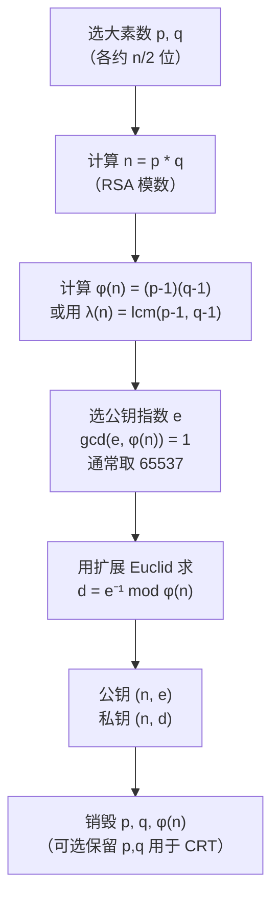
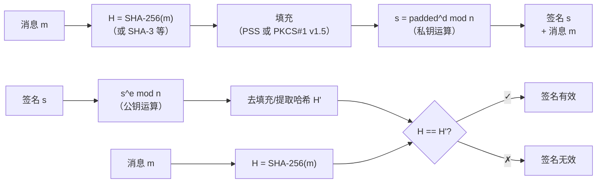
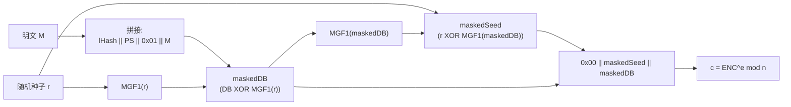
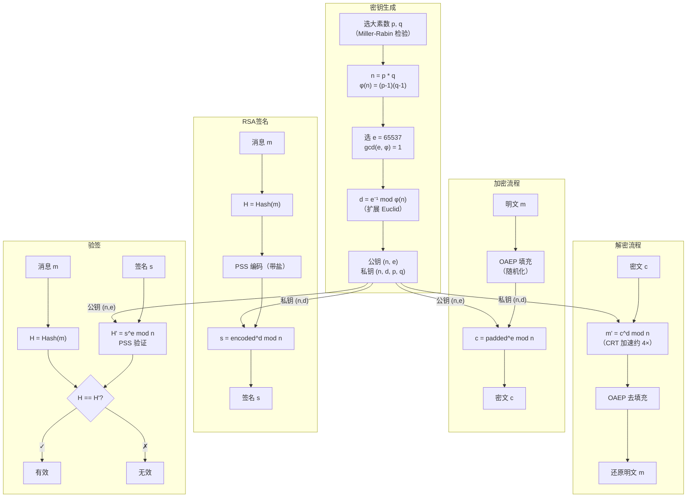

# 密码学（22）· RSA详解

> [!abstract] TL;DR
> - **RSA** 是 1977 年由 Rivest、Shamir、Adleman 提出的第一个实用公钥密码系统，安全性依赖**大整数分解难题**（IFP）。
> - **密钥生成**：随机选两个大素数 `p, q`，令 `n = p * q`；计算 `φ(n) = (p-1)(q-1)`；选公钥指数 `e`（通常 `65537`）；求私钥指数 `d = e⁻¹ mod φ(n)`。公钥 `(n, e)`，私钥 `(n, d)`，`p, q` 用后销毁。
> - **加密** `c = m^e mod n`；**解密** `m = c^d mod n`；正确性由欧拉定理保证。
> - **签名**：私钥签 `s = H(m)^d mod n`，公钥验 `H(m) == s^e mod n`；与加密方向相反。
> - **填充不可省**：裸 RSA 确定性、可乘性，必须用 **OAEP**（加密）或 **PSS**（签名）；PKCS#1 v1.5 有 Bleichenbacher 攻击，详见 [[58.RSA-Bleichenbacher与padding-oracle]]。
> - **密钥长度**：1024 位已不安全，**2048 位是当前最低门槛**，高安全场景用 3072/4096；e 用 `65537`，d 勿用小值，p、q 需通过素数质量检验。
> - 攻击全景见 [[55.RSA攻击概览]]；RSA 在 X.509 证书中的用法见 [[13.PE文件详解/12-详解PE文件(十二)：证书表.md]]。

本篇是「密码学」系列非对称加密的核心算法篇，承接 [[21.非对称加密总论]] 的数论基础（模幂、欧拉定理、费马小定理、中国剩余定理），全面讲解 RSA 的数学原理、完整算法流程、填充方案与安全实践。读者需熟悉模运算与整除的基本概念；数论复杂度背景已在 [[21.非对称加密总论]] 建立，本篇直接沿用。

---

## 概述与定位

RSA 是迄今使用最广泛的公钥密码算法之一。其名字来源于三位发明人：**Ron Rivest、Adi Shamir、Leonard Adleman**，1977 年在 MIT 提出，1983 年获得美国专利（2000 年到期）。它的核心思想极其简洁：

> **大整数容易相乘，但难以分解**。利用这个不对称性，构造一个只有知道分解的人才能逆转的单向陷门函数。

RSA 同时支持两种用途：**公钥加密**（发送方用接收方公钥加密，接收方用私钥解密）和**数字签名**（签名方用自己私钥签，验证方用公钥验），这是其他基于离散对数（DH、ElGamal）的方案所不同的设计。

### RSA 在工程中的位置

| 使用场景 | 具体作用 |
|---|---|
| TLS 握手 | 服务端证书携带 RSA 公钥，用于身份验证与密钥交换（已被 ECDHE 取代为主流） |
| 代码签名 | PE/ELF 中证书表（[[13.PE文件详解/12-详解PE文件(十二)：证书表.md]]）内嵌 RSA 签名 |
| SSH 认证 | `ssh-rsa` 类型公钥认证 |
| PGP/GPG | 对邮件/文件签名或加密会话密钥 |
| X.509 PKI | CA 用 RSA 私钥为证书签名，依赖链信任 |

RSA 不直接加密大数据（性能远低于对称加密）——工程中始终是**混合加密**：用 RSA 加密/交换对称密钥，再用 AES/ChaCha20 加密实际数据（工作模式见 [[10.分组密码工作模式总论]]）。

---

## 数学基础速查

本节快速列出 RSA 所需的数论结论；详细证明见 [[21.非对称加密总论]]。

### 关键定理

**欧拉定理**（Euler's Theorem）：若 `gcd(a, n) = 1`，则

```
a^φ(n) ≡ 1 (mod n)
```

其中 `φ(n)` 是欧拉函数（小于 `n` 且与 `n` 互质的正整数个数）。

**费马小定理**：`p` 为素数时，`a^(p-1) ≡ 1 (mod p)`，是欧拉定理对素数 `p` 的特例（`φ(p) = p-1`）。

**中国剩余定理（CRT）**：若 `n = p * q`（`p, q` 互质），则

```
Z_n ≅ Z_p × Z_q
```

即模 `n` 的计算可以分别在模 `p` 和模 `q` 上做，最后合并结果，速度快约 4 倍。

**模逆元**：`d = e⁻¹ mod φ(n)` 存在当且仅当 `gcd(e, φ(n)) = 1`，可用扩展欧几里得算法求出。

### 大整数分解难题（IFP）

给定 `n = p * q`（`p, q` 均为约 1024 位的随机素数），目前没有已知多项式时间算法能从 `n` 还原 `p, q`。最快算法是**通用数域筛法（GNFS）**，复杂度亚指数级：

```
exp((64/9)^(1/3) * (ln n)^(1/3) * (ln ln n)^(2/3))
```

对 2048 位的 `n`，这在经典计算机上目前不可行（估计 > 10⁹ MIPS 年）；量子计算机用 Shor 算法可以多项式时间破解——后量子 RSA 替代方案见系列后续篇。

---

## 原理与机制

### RSA 核心思路

设有两个大素数 `p, q`，令 `n = p * q`。对模 `n` 的乘法群，有

```
a^(φ(n)) ≡ 1 (mod n)   （当 gcd(a, n) = 1）
```

若选取整数 `e, d` 满足 `e * d ≡ 1 (mod φ(n))`，则

```
(m^e)^d = m^(e*d) = m^(1 + k*φ(n)) = m * (m^φ(n))^k ≡ m * 1^k = m   (mod n)
```

于是 **加密函数 `f(m) = m^e mod n` 的逆就是 `g(c) = c^d mod n`**，两者互为逆运算。公开 `(n, e)` 而保密 `d`（等价于保密 `p, q`），形成公私钥对。

### 完整的密钥生成流程



**关键参数说明：**

| 参数 | 典型值/要求 | 说明 |
|---|---|---|
| `p, q` 大小 | 各约 1024 位（生成 2048 位 `n`） | Miller-Rabin 概率素性检验 |
| `p - q` | 需要足够大 | 过近则 Fermat 分解法可破 |
| `e` | `65537 = 2^16 + 1`（Fermat 质数 F4） | 小 `e` 加密快；3、17 也曾用，但有低指数攻击风险 |
| `d` | 自动由 `e, φ(n)` 决定 | 若 `d < n^0.292`，Wiener 攻击可还原（见 [[57.RSA-Wiener与小私钥攻击]]） |
| `φ(n)` vs `λ(n)` | 两者均可，`λ(n) = lcm(p-1, q-1)` 更小 | `λ(n)` 是 RSA 的"真正"群阶，d 可取其模逆；许多现代实现用 `λ` |

> [!note] λ(n) 与 φ(n) 的关系
> `λ(n) = lcm(p-1, q-1)` 始终整除 `φ(n) = (p-1)(q-1)`。用 `λ(n)` 作为指数模时 RSA 仍然正确（因为 `m^λ(n) ≡ 1 mod n`），且 `d` 的值更小（但不影响安全，因为 `d` 的公开下界仍受 Wiener 攻击约束）。PKCS#1 v2.2 及 RFC 8017 均指定用 `λ`。

---

## 算法流程详解

### 加密

已知公钥 `(n, e)`，明文 `m`（整数，需满足 `0 ≤ m < n`），密文：

```
c = m^e  mod  n
```

实现使用**快速模幂**（square-and-multiply）算法，时间复杂度 `O(log e)` 次模乘：

```python
def modpow(base, exp, mod):
    result = 1
    base = base % mod
    while exp > 0:
        if exp % 2 == 1:
            result = (result * base) % mod
        exp //= 2
        base = (base * base) % mod
    return result

# 加密
def rsa_encrypt(m, e, n):
    return modpow(m, e, n)
```

### 解密

已知私钥 `(n, d)`，密文 `c`，还原明文：

```
m = c^d  mod  n
```

同样使用快速模幂。`d` 约 2048 位，模幂约需 `log₂ d ≈ 2048` 次模乘，比加密（`e = 65537`，约 17 次）慢得多——这正是 CRT 加速要解决的问题。

```python
def rsa_decrypt(c, d, n):
    return modpow(c, d, n)
```

### 正确性证明

**命题**：若 `e * d ≡ 1 (mod φ(n))`，则对任意 `m`（`0 ≤ m < n`，`gcd(m, n) = 1`），有 `(m^e)^d ≡ m (mod n)`。

**证明**：

由于 `e * d ≡ 1 (mod φ(n))`，存在整数 `k` 使得 `e * d = 1 + k * φ(n)`。于是：

```
(m^e)^d = m^(e*d) = m^(1 + k*φ(n)) = m * (m^φ(n))^k
```

由欧拉定理（`gcd(m, n) = 1` 时），`m^φ(n) ≡ 1 (mod n)`，故

```
m * (m^φ(n))^k ≡ m * 1^k = m   (mod n)
```

> [!note] m 与 n 不互质的情况
> 实际上即使 `gcd(m, n) > 1`（即 `m` 是 `p` 或 `q` 的倍数），RSA 解密仍然正确——用 CRT 分别在 `Z_p` 和 `Z_q` 上应用费马小定理仍可验证。由于 `n = p * q`，而 `m < n`，`gcd(m, n) > 1` 等价于 `m = 0, p, q, 2p, ...`，概率极小（约 `2/n^0.5`）且可视为灾难性密钥泄露。工程上填充后的消息一定满足 `gcd(m_padded, n) = 1`。

---

## 数值示例（小数演示）

选取极小数以便手算，**仅示意原理，不代表安全参数**：

```
选 p = 61,  q = 53
n = p * q = 61 * 53 = 3233
φ(n) = (p-1)(q-1) = 60 * 52 = 3120

选 e = 17   (gcd(17, 3120) = 1 ✓)
用扩展 Euclid 求 d：
    17 * d ≡ 1  (mod 3120)
    d = 2753   （验证：17 * 2753 = 46801 = 1 + 15 * 3120 ✓）

公钥：(n=3233, e=17)
私钥：(n=3233, d=2753)

加密明文 m = 65：
    c = 65^17 mod 3233 = 2790

解密密文 c = 2790：
    m = 2790^2753 mod 3233 = 65  ✓
```

---

## RSA 数字签名

### 签名与加密的方向对比

> [!important] 签名 ≠ 加密的逆
> 从操作层面看，"签名 = 私钥加密" 是民间说法，但在现代 RSA 签名（PKCS#1 v1.5 / PSS）中，签名对象是**消息的哈希值**而非消息本身，且使用完全不同的填充方案。直接等同会导致误解。

| 操作 | 密钥 | 公式 | 目的 |
|---|---|---|---|
| 加密 | 接收方公钥 `(n, e)` | `c = m^e mod n` | 机密性 |
| 解密 | 接收方私钥 `(n, d)` | `m = c^d mod n` | 还原明文 |
| **签名** | **签名方私钥 `(n, d)`** | `s = H(m)^d mod n` | **不可否认 + 完整性** |
| **验签** | **签名方公钥 `(n, e)`** | `H(m) == s^e mod n` | **验证来源** |

### 签名流程



**为何签名消息的哈希而非消息本身：**

1. RSA 只能处理 `m < n` 的整数；消息可以任意长，哈希输出固定（如 256 位）且远小于 `n`。
2. 哈希提供抗碰撞性，避免选择消息攻击。
3. 现代标准（PSS、PKCS#1 v1.5 for signatures）在哈希后还要填充，进一步增强安全性。

---

## CRT 加速解密

### 原理

朴素解密 `m = c^d mod n` 需要对约 2048 位的数做约 2048 次模乘。利用 **中国剩余定理（CRT）**，可将一次大模数运算分拆为两次半长度运算，速度提升约 **4 倍**。

**关键预计算**（密钥生成时一次性完成）：

```
p, q            ← 大素数（保留）
d_p = d mod (p-1)
d_q = d mod (q-1)
q_inv = q⁻¹ mod p    （用扩展 Euclid）
```

**CRT 解密步骤**：

```python
def rsa_decrypt_crt(c, p, q, d_p, d_q, q_inv):
    m_p = modpow(c, d_p, p)          # 用 p 阶模数，约 1024 位
    m_q = modpow(c, d_q, q)          # 用 q 阶模数，约 1024 位
    h = (q_inv * (m_p - m_q)) % p    # Garner 公式
    m = m_q + h * q                   # 合并结果
    return m
```

**速度分析：**

| 方法 | 模幂运算规模 | 相对速度 |
|---|---|---|
| 朴素解密 `c^d mod n` | `d` ≈ 2048 位，`n` ≈ 2048 位 | 1× |
| CRT 解密 | `d_p, d_q` ≈ 1024 位，模数 ≈ 1024 位 | **≈ 4×** |

> 模乘 k 位数的代价约 `O(k²)`，模幂复杂度 `O(k)` 次模乘。将 1 次 `(2048, 2048)` 替换为 2 次 `(1024, 1024)` 可节省 `2*(1024)² < (2048)²`，即理论约 4 倍。实际受 Garner 合并步骤影响，略低于 4 倍，但仍是标准实现（OpenSSL、Java JCA 等均默认使用 CRT）。

### 安全注意

CRT 私钥（包含 `p, q, d_p, d_q, q_inv`）必须与 `d` 同等保密。若发生故障注入攻击（glitch 使 `m_p` 或 `m_q` 计算出错但另一个正确），对比签名输出可以因式分解 `n`（Bellcore 攻击）——高安全实现需在 CRT 解密后额外验证。

---

## 填充方案

**裸 RSA（Textbook RSA）绝不可直接用于工程**，原因：

1. **确定性**：相同的 `m` 总得到相同的 `c`，允许已知明文攻击（CPA 不安全）。
2. **可乘性**：`Enc(m1) * Enc(m2) = Enc(m1 * m2) mod n`，允许攻击者在不知明文的情况下构造新的有效密文。
3. **小消息易攻击**：若 `m^e < n`，则 `c = m^e`（不发生模规约），e 次方根即可破解。

### PKCS#1 v1.5 填充（加密）

PKCS#1 v1.5（RFC 2313/2437）是 1991 年提出的早期填充方案，格式如下：

```
0x00 | 0x02 | PS | 0x00 | M
```

- `PS`：至少 8 字节的**随机非零字节**（引入随机性）
- `M`：实际明文

尽管 PS 随机化了，Bleichenbacher（1998）发现：**只要能区分解密结果是否满足 `0x00 0x02` 开头，就能通过数百万次 oracle 查询逐步恢复明文**。这就是著名的 **PKCS#1 v1.5 Padding Oracle 攻击**，也称 Bleichenbacher 攻击。TLS 中的 ROBOT 攻击（2018）证明该漏洞在生产系统中仍然存在。

> [!warning] PKCS#1 v1.5 加密已不推荐
> 所有新系统应使用 OAEP。若必须兼容旧系统，务必实现**常数时间填充验证**（消除 oracle），且即便如此仍有理论风险。详见 [[58.RSA-Bleichenbacher与padding-oracle]]。

### OAEP（Optimal Asymmetric Encryption Padding）

**OAEP**（RFC 8017 / PKCS#1 v2.x）是 RSA 加密的现代标准，在随机预言机模型下可证 CCA2 安全。

```
OAEP 编码结构：

输入: 消息 M，标签 L（可为空），随机种子 r

DB  = lHash || PS || 0x01 || M       （lHash = H(L)，PS 为零填充）
maskedDB  = DB  XOR MGF(r, len(DB))
maskedSeed = r  XOR MGF(maskedDB, hLen)

编码输出: 0x00 || maskedSeed || maskedDB
```

其中 `MGF`（Mask Generation Function）通常基于 SHA-256 的 MGF1。

**安全特性：**

- 随机种子 `r` 使相同明文每次加密结果不同（语义安全）
- 去掉了 v1.5 的结构特征，消除 Bleichenbacher oracle
- 在随机预言机模型下可证 IND-CCA2 安全



### PSS（Probabilistic Signature Scheme）

**PSS**（PKCS#1 v2.1+）是 RSA 签名的现代填充，对应 OAEP 的签名侧，在随机预言机模型下可证安全。

```
PSS 编码（签名前处理）：

输入：消息 m，盐 salt（随机，长度 sLen）

mHash  = H(m)
M'     = 0x00 00 00 00 00 00 00 00 || mHash || salt   （8 字节零填充）
H'     = H(M')
DB     = PS || 0x01 || salt                             （PS 为零填充）
maskedDB = DB XOR MGF1(H', emLen - hLen - 1)
EM     = maskedDB || H' || 0xbc
```

签名时，`s = EM^d mod n`（私钥运算）；验签时逆向提取 `H'` 并重新计算比较。

**PSS vs PKCS#1 v1.5 签名**：

| 特性 | PKCS#1 v1.5 签名 | PSS |
|---|---|---|
| 随机化 | 无（确定性） | 有（盐） |
| 可证明安全 | 无 | 随机预言机模型下可证 |
| 标准推荐 | 旧系统兼容 | RFC 8017、TLS 1.3 强制 |
| 现实攻击 | 有历史漏洞（Bleichenbacher 签名变体） | 目前无已知实用攻击 |

> [!tip] 工程选择
> 新系统：签名用 **RSA-PSS**，加密用 **RSA-OAEP**，均配合 **SHA-256** 或更强哈希。PKCS#1 v1.5 仅在必须兼容旧系统（如某些 TLS 1.2 场景）时保留，且签名侧 v1.5 通常比加密侧风险略低。

---

## 密钥长度与安全强度

| RSA 密钥长度 | 安全强度（近似等效对称密钥位数） | 状态 |
|---|---|---|
| 512 位 | < 40 位 | 已破（数小时内） |
| 768 位 | ≈ 60 位 | 已破（2009 年学术） |
| 1024 位 | ≈ 80 位 | **不安全**，不推荐新用 |
| **2048 位** | **≈ 112 位** | **当前最低门槛**（NIST 至 2030 年） |
| **3072 位** | **≈ 128 位** | **推荐**（等效 AES-128） |
| **4096 位** | **≈ 140 位** | 高保密场景、长期密钥 |

> 来源：NIST SP 800-57 Part 1 Rev. 5。ECRYPT-CSA 及 BSI 德国标准类似。量子计算机下 Shor 算法使所有 RSA 密钥长度归零——后量子迁移见系列 [[49.后量子密码概览]] 及 [[51.Kyber-ML-KEM]]。

---

## RSA 在 X.509 证书中的应用

X.509 证书（TLS、代码签名的核心）中，RSA 的使用方式是：

1. 证书持有者生成 RSA 密钥对（`n, e, d, p, q`）
2. 将公钥 `(n, e)` 编入证书的 `SubjectPublicKeyInfo` 字段
3. CA 用自己的 RSA 私钥对证书内容（TBS Certificate）的哈希值进行 PSS 或 PKCS#1 v1.5 签名
4. 签名结果附于证书末尾，任何人可用 CA 公钥验证

在 Windows PE 文件中，Authenticode 签名将证书嵌入**证书表（Certificate Table）**，操作系统加载器验证 RSA 签名确保代码完整性，完整细节见 [[13.PE文件详解/12-详解PE文件(十二)：证书表.md]]。

**常见 OID 对应关系：**

| OID | 含义 |
|---|---|
| `1.2.840.113549.1.1.1` | rsaEncryption（RSA 公钥） |
| `1.2.840.113549.1.1.5` | sha1WithRSAEncryption（已不推荐） |
| `1.2.840.113549.1.1.11` | sha256WithRSAEncryption（主流） |
| `1.2.840.113549.1.1.10` | RSASSA-PSS（推荐） |

---

## 完整流程 Mermaid 总图



---

## 安全性与正确使用

### 安全依赖与攻击面

RSA 的**理论安全性**依赖：
1. **大整数分解难题（IFP）**：从 `n` 无法高效得到 `p, q`
2. **RSA 问题**：从 `(n, e, c)` 无法高效得到 `m`（弱于 IFP，但未证明等价）

**实际攻击往往针对实现而非数学**：

| 攻击类型 | 条件 | 防御 |
|---|---|---|
| 小因数分解（Fermat/Pollard ρ） | `p, q` 选取不当（差太小/有特殊因子） | 用密码学安全随机数，验证 `|p-q|` 足够大 |
| Wiener 小私钥攻击 | `d < n^0.292` | 不要手动选小 `d`，让算法自动生成 |
| 共模攻击 | 两人共用 `n` 但 `e` 不同 | **绝不共用模数** |
| 低指数广播攻击（Håstad） | 同一 `m` 用不同 `n` 和小 `e` 发送 | 使用 OAEP，每次加密随机化 |
| Bleichenbacher Padding Oracle | PKCS#1 v1.5 + 解密 oracle | 改用 OAEP，或常数时间验证 |
| CRT 故障攻击（Bellcore） | 硬件故障 / 物理攻击 | CRT 解密后验证签名 |
| 时序侧信道 | 模幂时间泄露 `d` | 使用常数时间模幂（Montgomery） |

完整攻击分类与原理见 [[55.RSA攻击概览]]；Bleichenbacher 及 Padding Oracle 深入分析见 [[58.RSA-Bleichenbacher与padding-oracle]]。

### 正确使用清单

> [!tip] RSA 工程最佳实践
> 1. **密钥长度**：加密/签名 ≥ 2048 位，推荐 3072；2030 年后迁移至后量子算法
> 2. **公钥指数**：始终用 `e = 65537`
> 3. **填充**：加密用 **OAEP + SHA-256**（或 SHA-384/512）；签名用 **PSS + SHA-256**；禁止裸 RSA
> 4. **哈希**：绝不用 MD5/SHA-1，用 SHA-256 或更强
> 5. **勿手搓**：使用 OpenSSL / BouncyCastle / libsodium（间接）等审计库，不要自行实现模幂、填充
> 6. **密钥存储**：私钥存于 HSM 或操作系统密钥库（Windows CNG、macOS Keychain）；绝不明文落磁盘
> 7. **随机数**：素数生成必须用 CSPRNG（`/dev/urandom`、`getrandom()`、`BCryptGenRandom`）；弱随机源已导致真实 RSA 私钥被破解（2012 年 Lenstra 等研究）
> 8. **共模禁忌**：不同用户/证书的 `n` 必须独立生成
> 9. **CRT 验证**：高安全场景（HSM、FIDO）应在 CRT 解密/签名后做额外验证

### 使用 OpenSSL 示例

```bash
# 生成 2048 位 RSA 私钥
openssl genrsa -out private.pem 2048

# 提取公钥
openssl rsa -in private.pem -pubout -out public.pem

# OAEP 加密（-oaep 即 RSAES-OAEP，SHA-1 填充）
openssl rsautl -encrypt -oaep -pubin -inkey public.pem -in plaintext.bin -out cipher.bin

# OAEP 解密
openssl rsautl -decrypt -oaep -inkey private.pem -in cipher.bin -out decrypted.bin

# PSS 签名（推荐方式）
openssl dgst -sha256 -sigopt rsa_padding_mode:pss -sigopt rsa_pss_saltlen:-1 \
    -sign private.pem -out sig.bin message.txt

# PSS 验签
openssl dgst -sha256 -sigopt rsa_padding_mode:pss -sigopt rsa_pss_saltlen:-1 \
    -verify public.pem -signature sig.bin message.txt
```

> [!warning] 示例输出为示意
> 上述命令行在不同 OpenSSL 版本下参数可能有差异（特别是 `rsautl` 在 OpenSSL 3.x 中已软弃用，推荐改用 `pkeyutl`）。请参照当前版本文档。

---

## 小结

| 要素 | 关键点 |
|---|---|
| **数学基础** | n=pq，模运算，欧拉定理，中国剩余定理 |
| **密钥生成** | 大素数 p,q → φ(n) → 选 e=65537 → 求 d；公钥(n,e)，私钥(n,d) |
| **加密/解密** | c=mᵉ mod n，m=cᵈ mod n；正确性由欧拉定理保证 |
| **签名/验签** | s=H(m)ᵈ，验 H(m)==sᵉ；方向与加密相反 |
| **CRT 加速** | 分拆为 p/q 两侧半长运算，约 4 倍提速 |
| **填充** | OAEP（加密）、PSS（签名）；PKCS#1 v1.5 有 Bleichenbacher 风险 |
| **密钥长度** | 最低 2048，推荐 3072+；1024 已不安全 |
| **安全基础** | 大整数分解难题；量子计算机 Shor 算法可破 |

RSA 是公钥密码学的"原点"：理解了 RSA 的数学与工程权衡，后续 DH、ECC、ECDSA 的思路便水到渠成。与此同时，RSA 也是攻击研究最丰富的公钥方案——从数学分解到实现侧信道，每一类攻击都映射到一条具体的防御原则。正确用好 RSA 的核心在于：**不手搓、用合规参数、强制填充、密钥高质量生成与安全存储**。

---

## 相关阅读

- [[21.非对称加密总论]] — 数论基础（欧拉、费马、CRT、DLP）与公钥思想
- [[55.RSA攻击概览]] — 因式分解、Pollard、Fermat、共模、低指数攻击全景
- [[56.RSA共模与小公钥指数攻击]] — common modulus、Håstad 广播
- [[57.RSA-Wiener与小私钥攻击]] — 连分数恢复小 d
- [[58.RSA-Bleichenbacher与padding-oracle]] — PKCS#1 v1.5 oracle、ROBOT
- [[59.RSA-Coppersmith攻击]] — 已知部分位、格攻击
- [[23.Diffie-Hellman密钥交换]] — 基于离散对数的密钥交换，与 RSA 互补
- [[13.PE文件详解/12-详解PE文件(十二)：证书表.md]] — RSA 在 PE Authenticode 签名中的应用
- [[10.分组密码工作模式总论]] — 混合加密中 RSA 搭档的对称加密侧
- [[71.详解网络协议/15.TLS协议.md]] — RSA 在 TLS 握手中的历史地位与现状

---

⬅️ 上一篇 [[21.非对称加密总论]] ｜ 🏠 [[00.密码学总览]] ｜ 下一篇 [[23.Diffie-Hellman密钥交换]] ➡️
