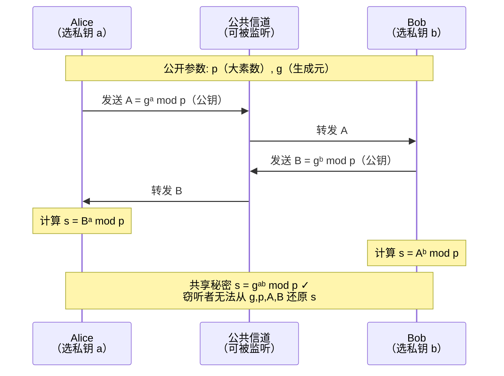
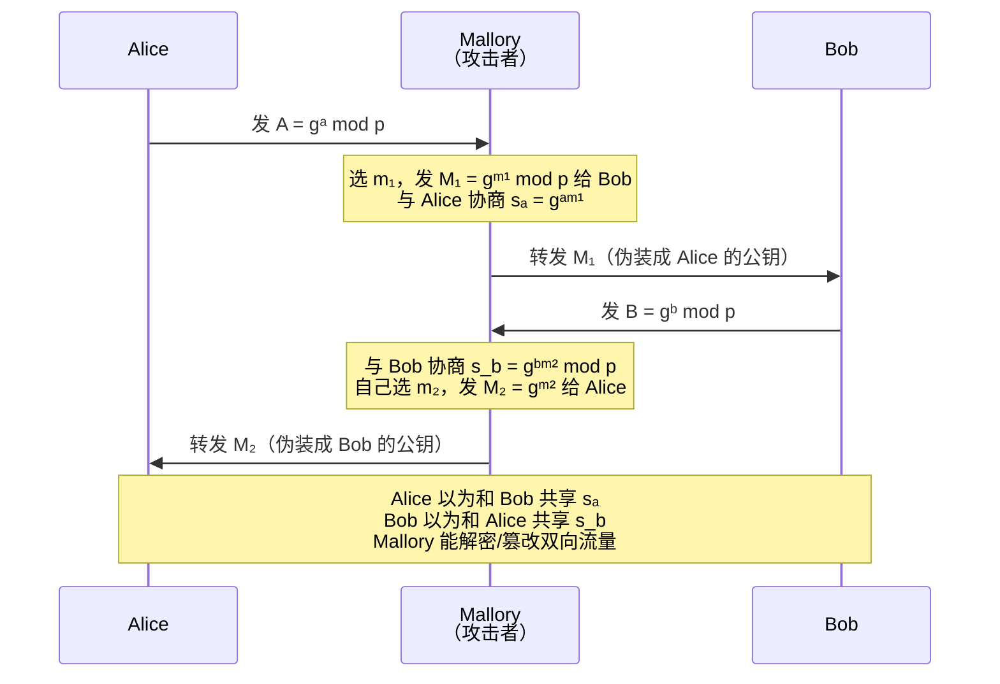

# 密码学（23）· Diffie-Hellman密钥交换

> [!abstract] TL;DR
> - Diffie-Hellman（DH）是第一个公开发表的**公钥密钥交换协议**（1976），让双方在不安全信道上协商出共享秘密，而不需要预先共享任何秘密。
> - 安全性依赖**离散对数难题（DLP）**：在大素数 `p` 的乘法群中，已知 `g` 和 `gᵃ mod p`，求 `a` 在计算上不可行。
> - **原始 DH 不含身份认证**——中间人（MITM）可以分别与双方各做一次 DH，冒充对方。必须配合签名/证书才能对抗 MITM。
> - **DHE（临时 DH）提供前向保密（PFS）**：每次会话用新鲜私钥，历史会话加密不受长期私钥泄露影响——这是 TLS 1.3 默认使用 (EC)DHE 的根本原因。
> - 现代应用应优先选 **ECDH**（椭圆曲线 DH，见 [[26.ECDH密钥交换]]）——更小密钥、等价安全强度、更快。

---

## 概述与定位

1976 年，Whitfield Diffie 与 Martin Hellman 在论文 *New Directions in Cryptography* 中提出了 DH 协议，彻底颠覆了密码学的范式：**在完全公开的信道上，通信双方可以协商出一个只有他们知道的共享秘密**，而不依赖任何事先的秘密交换。

DH 在密码工程中的地位：
- 是 TLS 握手 `(EC)DHE` 套件的核心机制（见 [[71.详解网络协议/15.TLS协议.md]]）。
- 是 SSH、IPsec/IKE、Signal 协议等几乎所有安全通信协议实现前向保密的基础。
- 在密码体系中处于"密钥交换"的专属位置——它**不加密数据**，而是产出供对称加密使用的共享密钥材料（与 [[21.非对称加密总论]] 对单向陷门的描述一致）。
- ECDH（[[26.ECDH密钥交换]]）是其椭圆曲线推广，ElGamal（[[24.ElGamal加密与签名]]）是其在加密/签名方向的应用。

---

## 原理与机制

### 数学基础：有限域离散对数

DH 工作在整数模 `p` 的乘法群 `ℤ*_p`，`p` 是大素数。

**核心三元组**

```
p  — 大素数，定义群的阶（群的大小为 p-1）
g  — 生成元（primitive root mod p），g 的阶为 p-1，g 能生成群中所有元素
a  — 私钥，随机选自 [2, p-2]
```

**单向性（DLP）**

```
正向（容易）：给定 g, a, p，计算 A = gᵃ mod p  → 快速幂，O(log a) 次模乘
逆向（困难）：给定 g, A, p，求 a（离散对数）→ 最优算法 GNFS/Index Calculus 需要亚指数时间
```

当 `p` 取 2048 位以上时，目前无已知多项式时间算法能在实际时间内求解 DLP。

**共享密钥的数学成立性**

Alice 选私钥 `a`，发送 `A = gᵃ mod p`；Bob 选私钥 `b`，发送 `B = gᵇ mod p`。

```
Alice 计算：s = Bᵃ mod p = (gᵇ)ᵃ mod p = gᵃᵇ mod p
Bob  计算：s = Aᵇ mod p = (gᵃ)ᵇ mod p = gᵃᵇ mod p
```

两者得到相同的 `s = gᵃᵇ mod p`，而窃听者只知道 `g, p, A, B`，要得到 `s` 必须先解决 DLP 或 CDH（计算 Diffie-Hellman 问题）。

---

## 算法流程详解

### 基本 DH 密钥交换

**阶段一：公开参数协商**

Alice 和 Bob（或由可信方）公开选定：

```
p  : 大素数（≥ 2048 位，推荐 3072/4096 位）
g  : 模 p 的生成元（常取 g = 2 或 g = 5）
```

`(p, g)` 可以公开，整个 DH 交换的保密性不依赖它们。

**阶段二：密钥交换**

```
Alice                                   Bob
─────────────────────────────────────────────────────
选 a ← random [2, p-2]
A = gᵃ mod p
                    ── A ──>
                                        选 b ← random [2, p-2]
                                        B = gᵇ mod p
                    <── B ──
s = Bᵃ mod p = gᵃᵇ mod p              s = Aᵇ mod p = gᵃᵇ mod p
```

**阶段三：派生会话密钥**

共享秘密 `s = gᵃᵇ mod p` 不能直接用作密钥（有数学结构），需经过 KDF（密钥派生函数）处理：

```
K = KDF(s)          # 例如 HKDF-SHA256，得到 256 位对称密钥
```

### Mermaid 流程图：DH 正常交换



### 中间人攻击（MITM）

> [!warning] DH 不含身份认证，原始协议对 MITM 完全无防御能力

攻击者 Mallory 拦截 Alice 和 Bob 的公钥，分别与各方完成独立的 DH 交换，建立两条共享密钥：



**缓解**：将 DH 与签名结合（如 TLS 中用服务器证书签名 DHE 参数），或使用站对站协议（STS）。这是 [[71.详解网络协议/15.TLS协议.md]] 中 Certificate + CertificateVerify 消息的存在意义。

---

## 参数选择与安全陷阱

### 安全素数与生成元

**安全素数（Safe Prime）**

```
p = 2q + 1，其中 q 也是素数（称为 Sophie Germain 素数）
```

ℤ*_p 的阶为 `p-1 = 2q`，子群阶只有 `{1, 2, q, 2q}`。选择阶为 `q` 的子群（即选生成元 `g` 使其阶为 `q`）可规避小子群攻击。

**为什么需要大子群**

若 Alice 选 `a` 使得 `A = gᵃ` 落在小阶子群中，攻击者可对小阶群穷举，用中国剩余定理（Pohlig-Hellman）拼出 `a`。安全素数确保大的 `q` 使这条路不可行。

**小子群攻击（Small Subgroup Attack）**

```
若群有阶为 r 的小子群（r 很小）：
攻击者发送阶为 r 的群元素作为"公钥"
受害者的响应会泄露 a mod r
重复不同小阶子群，通过 CRT 恢复私钥
```

防御：接收到对方公钥后，验证 `1 < B < p-1` 且 `Bᵠ mod p = 1`（q 为子群阶）。

### Logjam 攻击与 512 位降级

2015 年 Logjam 漏洞揭示：

1. **多个服务器共用相同的弱 DH 参数**（512 位"出口级"素数）。
2. 攻击者可通过 MITM 将 TLS 握手降级到 512 位 DHE。
3. 对 512 位 DH 的离散对数预计算在国家级攻击者能力范围内（Number Field Sieve 预计算针对特定素数，结果可复用）。
4. 与此类似的是 1024 位参数——研究人员估计国家级攻击者可能已对常用 1024 位 Diffie-Hellman 群完成预计算。

**关键教训**：如果大量服务器共用同一个素数，离散对数预计算成本可以被摊薄。

### RFC 7919 ffdhe 群

RFC 7919（2016）定义了**命名有限域 DH 群**（`ffdhe2048`、`ffdhe3072`、`ffdhe4096` 等），TLS 1.3 中 DHE 必须使用这些命名群或等价强度的自定义群：

| 群名 | 模数大小 | 安全级别（近似） | 备注 |
|---|---|---|---|
| `ffdhe2048` | 2048 位 | 112 位 | 最小推荐（TLS 1.3） |
| `ffdhe3072` | 3072 位 | 128 位 | 推荐 |
| `ffdhe4096` | 4096 位 | 140 位 | 高安全场景 |
| `ffdhe6144` | 6144 位 | — | 高安全 |
| `ffdhe8192` | 8192 位 | — | 最高 |

这些群使用安全素数且生成元 `g=2`，公开审计，消除了"自造参数可能暗藏后门"的风险。

---

## 静态 DH vs 临时 DH（DHE）与前向保密

### 静态 DH（Static DH）

```
Alice 有固定的 DH 公私钥对 (a, A)，A 写入证书
每次会话复用同一 a
```

问题：若长期私钥 `a` 泄露，攻击者可解密**所有历史录制的会话**——没有前向保密。

### 临时 DH（DHE，Ephemeral DH）

```
每次会话：
  Alice 临时生成新的 (a, A)，会话结束后丢弃
  Bob  临时生成新的 (b, B)，会话结束后丢弃
  A, B 仅用于本次会话
```

**前向保密（PFS，Perfect Forward Secrecy）**：即使长期私钥（如服务器证书私钥）事后泄露，攻击者也**无法解密历史录制的会话密文**——因为每次会话的临时密钥已被销毁，且历史共享密钥无法从长期私钥单独推算。

```
有前向保密：服务器证书私钥 ≠ 会话密钥材料
无前向保密（RSA 密钥交换）：截获的握手包含用证书公钥加密的 pre-master secret
                             → 证书私钥泄露 = 所有历史会话可解密
```

TLS 1.3 **强制使用 (EC)DHE**，彻底废弃了 RSA 静态密钥交换（参见 [[71.详解网络协议/15.TLS协议.md]] 中 1.3 vs 1.2 的握手对比）。

---

## ECDH：更小密钥，等价安全

有限域 DH 需要 2048 位以上的模数来对抗 Index Calculus/GNFS 攻击。椭圆曲线群上不存在亚指数时间 DLP 算法（目前最优仍为指数时间），因此：

| 安全级别 | 有限域 DH 密钥长度 | ECDH 密钥长度 |
|---|---|---|
| 112 位 | 2048 位 | 224 位 |
| 128 位 | 3072 位 | 256 位（secp256r1/P-256、X25519） |
| 192 位 | 7680 位 | 384 位（P-384） |
| 256 位 | 15360 位 | 521 位（P-521） |

ECDH 在相同安全强度下密钥更短、计算更快、握手带宽更小，是现代 TLS 1.3 的首选（通常用 `X25519`）。详见 [[26.ECDH密钥交换]]。

---

## 安全性与正确使用

### 参数选择

| 要求 | 正确做法 | 错误做法 |
|---|---|---|
| 群大小 | ≥ 2048 位（推荐 RFC 7919 ffdhe3072/4096） | 512/768/1024 位（Logjam） |
| 素数类型 | 安全素数（p=2q+1），或验证子群大小 | 随机素数未验证子群结构 |
| 生成元 | 使用命名群定义的 g | 自定义可能非全群生成元 |
| 参数来源 | RFC 7919、NIST SP 800-77r1 | 自造不知来源的参数 |
| 优先选择 | ECDH（X25519、P-256） | 有限域 DH（效率低，密钥长） |

### 必须认证

> [!danger] 未认证的 DH 对 MITM 毫无防御

使用 DH 必须配合：
- **数字签名**：对方对 `(g, p, A)` 或 `(g, p, B)` 签名，验证者用事先认证的公钥验证（TLS 的做法）。
- **预共享密钥（PSK）**：将共享密钥结合到密钥派生中（TLS 1.3 0-RTT 模式）。
- **公钥基础设施（PKI）**：证书将公钥绑定到身份，依赖 CA 签名链。

### 前向保密

```
部署 TLS 时优先选 DHE/ECDHE 套件
TLS 1.3 已强制，1.2 需显式配置禁用 RSA 密钥交换套件
```

### 私钥生成

```
a ← 密码学安全随机数生成器（CSPRNG）
范围：[2, p-2]，即 [2, q-1]（若使用安全素数的 q 阶子群）
禁止：复用私钥做多次 DHE（违背 PFS 目的）
禁止：使用弱随机数（弱 PRNG → 私钥可预测）
```

### 共享秘密后处理

```
s = gᵃᵇ mod p 有数学结构，不能直接用作密钥
正确做法：K = HKDF(s, salt, info)  # 或 KDF(s)，如 TLS 1.3 的密钥调度
```

### 已知攻击汇总

| 攻击 | 前提 | 影响 | 防御 |
|---|---|---|---|
| 中间人（MITM） | 无认证 | 完全破解 | 签名 + 证书 |
| Logjam 降级 | 允许弱参数（512位） | 离线解密 | 强制 ≥ 2048 位，RFC 7919 命名群 |
| 小子群攻击 | 未验证公钥 | 泄露私钥 mod r | 验证收到的公钥在正确子群 |
| Pohlig-Hellman | 群阶有小因子 | 分解 DLP | 安全素数（子群阶为大质数 q） |
| Index Calculus / NFS | < 2048 位群 | 离散对数 | ≥ 2048 位或 ECDH |

---

## 小结

Diffie-Hellman 密钥交换的精髓可以用三句话概括：

1. **幂运算单向性（DLP）使公开交换成为可能**：双方各保一个指数（私钥），公开的是幂（公钥），窃听者在多项式时间内无法还原共享秘密。

2. **DH 本身不认证，必须叠加签名**：裸 DH 对 MITM 完全无防御，工程上必须与 PKI/签名结合使用（TLS 的 Server Certificate + CertificateVerify 正是为此）。

3. **临时化（DHE）换来前向保密**：每次会话用新鲜随机私钥并会话结束即丢弃，历史会话密钥对攻击者不可追溯——这是现代 TLS 1.3 强制 (EC)DHE 的根本原因。

实践选型：优先 **ECDH/X25519**（[[26.ECDH密钥交换]]），若须有限域 DH 则用 **RFC 7919 ffdhe3072/4096**，决不自造参数，决不复用 DHE 私钥，决不省略认证步骤。

---

## 相关阅读

- [[21.非对称加密总论]] — 公钥密码的数学基础、模幂与欧拉定理，DH 的数论背景
- [[22.RSA详解]] — 同样基于数论困难问题的非对称体系，与 DH 并列
- [[24.ElGamal加密与签名]] — 将 DH 的 DLP 思想扩展到加密与签名
- [[26.ECDH密钥交换]] — DH 的椭圆曲线推广，更小密钥，现代 TLS 首选
- [[71.详解网络协议/15.TLS协议.md]] — TLS 握手中 DHE/ECDHE 的实际使用：前向保密、密钥调度、证书认证
- RFC 7919 — Negotiated Finite Field Diffie-Hellman Ephemeral Parameters for Transport Layer Security (TLS)
- NIST SP 800-77r1 — Guide to IPsec VPNs（DH 群参数推荐）

---

⬅️ 上一篇 [[22.RSA详解]] ｜ 🏠 [[00.密码学总览]] ｜ 下一篇 [[24.ElGamal加密与签名]] ➡️
