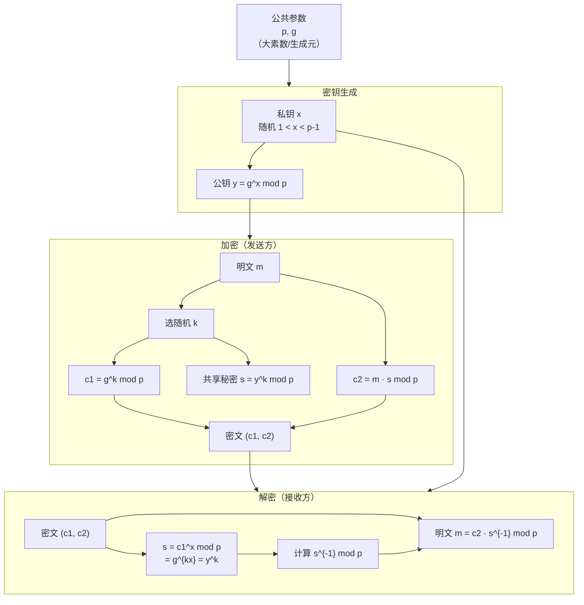

# 密码学（24）· ElGamal加密与签名

> [!abstract] TL;DR
> - ElGamal 是把 DH 密钥交换"升级"为加密方案的经典构造：安全性归约到离散对数问题（DLP），密文天然概率性（同明文每次加密结果不同）。
> - 加密：公共参数 `(p, g)`，私钥 `x`，公钥 `y = g^x mod p`；选随机 `k`，密文 `(c1, c2) = (g^k, m·y^k) mod p`；密文是明文两倍长（2 倍膨胀）。
> - 解密：`m = c2 · (c1^x)^{-1} mod p`，利用 `c1^x = g^{kx} = y^k` 还原。
> - 签名：签名方程 `s = (H(m) - x·r) · k^{-1} mod (p-1)`；DSA 是 ElGamal 签名的规范化变体（工作在子群，更紧凑）。
> - 致命陷阱：随机数 `k` 重用或可预测会直接泄露私钥——这与 ECDSA nonce 攻击同源，见 [[54.ECDSA-nonce攻击]]。

---

## 概述与定位

Taher ElGamal 于 1985 年发表的论文同时给出了**加密方案**和**签名方案**两件事，二者共用同一组公钥参数，但数学结构截然不同——加密基于 DH 秘密共享，签名基于离散对数方程求解。

### 在系列中的位置

ElGamal 是非对称加密"第二根支柱"：

| 方案 | 安全性基础 | 密钥交换 | 加密 | 签名 |
|---|---|---|---|---|
| [[22.RSA详解]] | 大整数分解 | 否（直接传） | 是 | 是 |
| [[23.Diffie-Hellman密钥交换]] | DLP | 是 | 否 | 否 |
| ElGamal（本篇） | DLP | 是（隐含） | 是 | 是 |
| DSA | DLP（子群） | 否 | 否 | 是 |
| [[25.椭圆曲线密码学基础]] | ECDLP | 是 | 是 | 是 |

可以把 ElGamal 理解为"给 DH 装上信封"：DH 让双方共享秘密 `y^k`，ElGamal 直接把这个秘密当掩码乘到消息上，得到密文 `c2 = m·y^k`。

### 数论前提

与 [[21.非对称加密总论]] 和 [[23.Diffie-Hellman密钥交换]] 共用同一套数论基础：

- **循环群**：`Z_p*`（`p` 为素数）是 `p-1` 阶循环群，`g` 是生成元（原根）。
- **离散对数问题（DLP）**：已知 `g, p, y`，求 `x` 使 `g^x ≡ y (mod p)` 是困难的（无多项式时间通用算法）。
- **模逆元**：`a^{-1} mod p` 在 `gcd(a, p)=1` 时存在，由扩展欧几里得算法计算。

---

## 原理与机制

### ElGamal 加密原理

#### 系统参数与密钥生成

```
公共参数：大素数 p（≥ 2048 位）、p 的原根 g
私钥：  随机选 x，满足 1 < x < p-1
公钥：  y = g^x mod p
```

`y` 是公开的，`x` 是秘密的。由 DLP 的困难性，知道 `y` 无法高效推出 `x`。

#### 加密

发送方要加密消息 `m`（`1 ≤ m ≤ p-1`）：

1. 选随机临时指数 `k`（`1 < k < p-1`，`gcd(k, p-1) = 1`）
2. 计算 `c1 = g^k mod p`（DH 公开值）
3. 计算共享秘密 `s = y^k mod p = g^{xk} mod p`
4. 计算 `c2 = m · s mod p = m · y^k mod p`
5. 密文 = `(c1, c2)`

> [!note] 概率性加密
> 每次加密用不同随机 `k`，同一消息 `m` 每次产生不同密文 `(c1, c2)`，这叫**语义安全（IND-CPA）**。攻击者即使见过两次相同消息的加密结果，也无法区分它们对应哪个明文（假设 DLP 困难）。

#### 解密

接收方持有私钥 `x`：

1. 由 `c1` 计算 `s = c1^x mod p = (g^k)^x = g^{kx} = y^k mod p`（与发送方共享同一秘密）
2. 计算 `s^{-1} mod p`（模逆元）
3. 还原明文 `m = c2 · s^{-1} mod p = m·y^k · (y^k)^{-1} = m mod p`

正确性一句话：加密时把秘密 `y^k` 乘上去，解密时接收方也能独立算出 `y^k = (g^k)^x = c1^x`，乘逆元抵消。

### ElGamal 加解密流程图



### 密文膨胀

原始消息 `m`（一个整数 `< p`）需要传输 `(c1, c2)` 两个整数——**密文是明文的 2 倍长**。这是 ElGamal 在实践中被 RSA 替代、或被 ECIES（ECC 变体）代替的主要工程原因之一。

---

## ElGamal 签名

### 签名原理

签名目标：证明"私钥持有者"签了消息 `m`，任何人可以用公钥验证。

#### 签名生成

设 `H(m)` 是消息的哈希（整数形式）：

1. 选随机临时数 `k`，满足 `1 < k < p-1`，`gcd(k, p-1) = 1`
2. 计算 `r = g^k mod p`
3. 计算 `s = (H(m) - x·r) · k^{-1} mod (p-1)`
4. 若 `s = 0`，重新选 `k`
5. 签名 = `(r, s)`

注意模数：`r` 在 `mod p` 下计算，`s` 在 `mod (p-1)` 下计算（费马小定理：`g^{p-1} ≡ 1 mod p`）。

#### 签名验证

验证方持有公钥 `y`，收到消息 `m` 和签名 `(r, s)`：

检查：
```
g^{H(m)} ≡ y^r · r^s (mod p)
```

正确性推导（验证方程从何而来）：

```
由签名方程：  H(m) = x·r + k·s  (mod p-1)
两边以 g 为底取幂：
  g^{H(m)} ≡ g^{x·r + k·s} = (g^x)^r · (g^k)^s = y^r · r^s (mod p)
```

即验证方程等价于"签名方程在指数上成立"。

### ElGamal 签名与 DSA 的关系

DSA（Digital Signature Algorithm，NIST FIPS 186）是 ElGamal 签名的**规范化变体**：

| 特性 | ElGamal 签名 | DSA |
|---|---|---|
| 工作群 | 全 `Z_p*`（阶 `p-1`）| `Z_p*` 的 `q` 阶子群（`q | p-1`，`q` ≈ 256 位） |
| 签名长度 | `2|p|` 位 | `2|q|` 位（小得多） |
| 标准化 | 否 | NIST FIPS 186-4 |
| 随机数需求 | `k mod (p-1)` 可逆 | `k mod q` 可逆 |
| 验证方程 | `g^{H(m)} ≡ y^r · r^s` | `g^{u1} · y^{u2} ≡ r mod q`（等价但更紧凑） |

DSA 通过引入 `q` 阶子群，把签名从 `2048` 位压缩到 `512` 位（`q=256` 时），同时保持安全性等价于在子群上的 DLP。ECDSA（[[27.ECDSA签名]]）进一步把 `Z_p*` 替换为椭圆曲线群，得到更短密钥和更高效率。

---

## 随机数 k 的致命性

这是 ElGamal 签名（以及 DSA、ECDSA）最重要的安全约束：**`k` 必须每次重新随机生成且不可预测**。

### k 重用攻击

若攻击者得到两条使用相同 `k` 的签名 `(r, s1)` 和 `(r, s2)` 对消息 `m1`、`m2`：

```
s1 = (H(m1) - x·r) · k^{-1}  mod (p-1)
s2 = (H(m2) - x·r) · k^{-1}  mod (p-1)
```

两式相减：

```
s1 - s2 = (H(m1) - H(m2)) · k^{-1}  mod (p-1)
→ k = (H(m1) - H(m2)) · (s1 - s2)^{-1}  mod (p-1)
→ x = (H(m1) - s1·k) · r^{-1}  mod (p-1)
```

`k` 一旦暴露，**私钥 `x` 立即可算**。这是彻底的密钥泄露，不是部分信息泄露。

> [!danger] 同源威胁
> 这与 ECDSA 的 nonce 攻击在数学上完全同源。Sony PS3 使用固定 nonce 导致签名私钥被提取，正是 ElGamal/DSA nonce 重用的 ECC 版本——详见 [[54.ECDSA-nonce攻击]]。

### k 可预测攻击（偏置 nonce）

即使 `k` 每次不同，若其低几位固定（偏置），攻击者收集足够多签名后可用**格攻击**（Lattice Attack）恢复私钥——这也是 [[54.ECDSA-nonce攻击]] 的核心话题，ElGamal 签名同样适用。

### 伪代码：安全的 k 生成

```
function gen_k(p):
    q = p - 1       # ElGamal 工作群的阶
    while True:
        k = csprng_randint(2, q - 1)   # 密码学安全随机数生成器
        if gcd(k, q) == 1:
            return k
```

关键：必须使用**密码学安全伪随机数生成器（CSPRNG）**，绝对不能使用语言标准库的普通 `rand()`。

---

## 与 DH 和 RSA 的对比

### 与 Diffie-Hellman 的关系

ElGamal 加密就是"把 DH 密钥交换的共享秘密直接当加密掩码用"。

[[23.Diffie-Hellman密钥交换]] 让 Alice 和 Bob 共享 `g^{ab}`，但没有直接产生密文——双方在线才能协商。ElGamal 把 `g^k`（Bob 的一次性 DH 公钥）和密文 `m·y^k` 一起发给接收方，接收方离线即可解密，这就是**非交互式的 DH**。

```
DH 密钥交换：     Alice ↔ Bob（双方在线，共享秘密）
ElGamal 加密：   Alice → Bob（单向，Bob 离线可解）
```

### 与 RSA 的关系

[[22.RSA详解]] 和 ElGamal 都是非对称加密，但安全性基础不同：

| 维度 | RSA | ElGamal |
|---|---|---|
| 安全性假设 | 大整数分解（IFP） | 离散对数（DLP） |
| 加密确定性 | PKCS#1 v1.5 确定性；OAEP 随机化 | 天然概率性（每次 `k` 不同） |
| 密文膨胀 | 无（密文与模数同长） | 2× 明文长度 |
| 标准化 | PKCS#1/RFC 8017 | 主要见于 OpenPGP（hybrid） |
| 签名 | RSA-PSS/PKCS#1 | ElGamal 签名 / DSA |

量子计算机上，Shor 算法可以同时破解 RSA（分解）和 ElGamal/DH/ECDSA（离散对数），这是后量子密码（[[49.后量子密码概览]]）的动机。

---

## 实际算法流程（完整伪代码）

### 加密完整流程

```python
# ===== ElGamal 加密 =====
# 参数（示例，实际 p 需 ≥ 2048 位安全素数）
p = ...          # 大素数（示例）
g = 2            # 生成元/原根（示例）

# 密钥生成
x = csprng_randint(2, p - 2)   # 私钥（示例）
y = pow(g, x, p)                # 公钥 y = g^x mod p

# 加密
def elgamal_encrypt(m, p, g, y):
    assert 1 <= m < p
    k = gen_k(p)                   # 安全随机，gcd(k, p-1) = 1
    c1 = pow(g, k, p)             # c1 = g^k mod p
    c2 = (m * pow(y, k, p)) % p  # c2 = m * y^k mod p
    return (c1, c2)

# 解密
def elgamal_decrypt(c1, c2, x, p):
    s = pow(c1, x, p)             # s = c1^x = y^k mod p
    s_inv = pow(s, -1, p)         # s 的模逆元
    m = (c2 * s_inv) % p
    return m
```

### 签名完整流程

```python
# ===== ElGamal 签名 =====
import hashlib

def elgamal_sign(msg, x, p, g):
    H = int(hashlib.sha256(msg).hexdigest(), 16) % (p - 1)
    while True:
        k = gen_k(p)               # gcd(k, p-1) = 1
        r = pow(g, k, p)
        k_inv = pow(k, -1, p - 1) # k 在 mod (p-1) 下的逆元
        s = (k_inv * (H - x * r)) % (p - 1)
        if s != 0:
            return (r, s)

def elgamal_verify(msg, r, s, p, g, y):
    if not (0 < r < p and 0 < s < p - 1):
        return False
    H = int(hashlib.sha256(msg).hexdigest(), 16) % (p - 1)
    lhs = pow(g, H, p)
    rhs = (pow(y, r, p) * pow(r, s, p)) % p
    return lhs == rhs
```

> [!warning] 示例输出为示意
> 上述代码省略了安全参数生成（safe prime、原根验证），仅展示核心计算逻辑，不可直接用于生产。

---

## 安全性分析

### 加密安全性

ElGamal 加密的语义安全（IND-CPA）在**决策性 Diffie-Hellman 假设（DDH）**下成立：

```
DDH 假设：给定 (g, g^a, g^b, g^c)，区分 c = ab 与 c 随机
          在合适群（如 p 阶子群 q 阶）上是计算困难的
```

> [!note] DDH vs DLP
> DDH 是比 DLP 更强的假设（DDH 困难 → DLP 困难，反之不一定）。ElGamal 加密的安全归约到 DDH，而非直接到 DLP。

ElGamal 加密**不提供 IND-CCA 安全性**（选择密文攻击）：攻击者可以构造合法密文的"变形"版并得到解密结果，从而还原原始明文。实践中需要结合 MAC 或使用 ECIES（集成加密方案）来获得 IND-CCA2 安全。

### 签名安全性

ElGamal 签名的安全性依赖 DLP 困难：若能伪造签名，则可解决 DLP。但注意：

- **存在性不可伪造**在随机预言模型下成立（需绑定哈希）
- 若直接对消息 `m` 签名（不哈希），存在**消息恢复攻击**：攻击者可构造合法三元组 `(m', r, s)` 而无需知道私钥

---

## 安全性与正确使用

### 参数选择

| 参数 | 要求 | 原因 |
|---|---|---|
| 素数 `p` | ≥ 2048 位，推荐 3072 位 | DLP 算法（GNFS/NFS）时间复杂度与 `p` 位数相关 |
| `p` 的类型 | safe prime（`p = 2q + 1`，`q` 也是素数）| 防止 Pohlig-Hellman 攻击（利用 `p-1` 的光滑因子） |
| 生成元 `g` | `q` 阶子群的生成元 | 限定工作在大素数阶子群，防止小子群攻击 |
| 随机数 `k` | CSPRNG、每次独立、`gcd(k, p-1)=1` | 见"随机数 k 的致命性"一节 |

### 已知弱点

1. **小子群攻击**：若 `p-1` 有小因子，DLP 可在子群内高效求解（Pohlig-Hellman），因此必须用 safe prime 或显式选大素数阶子群。
2. **IND-CCA 不安全**：ElGamal 加密本身可被选择密文攻击，实践中应包装为 ECIES 或混合加密方案。
3. **密文可延展（malleability）**：`(c1, α·c2)` 解密得到 `α·m`——攻击者可按比例修改明文而无需知道私钥，这正是不满足 CCA 安全的表现。
4. **消息空间限制**：明文 `m` 必须是 `Z_p*` 中的元素，实际中需要将任意长度消息哈希到 `Z_p*` 或使用混合加密。

### 正确使用建议

> [!tip] 工程实践
> - **不要直接用裸 ElGamal**：现代系统用 ECIES（基于 ECDH + HKDF + AEAD）或 RSA-OAEP，它们安全模型更完整（IND-CCA2）。
> - **签名用 EdDSA/ECDSA**：EdDSA（[[28.EdDSA与Ed25519]]）使用确定性 nonce，从根本上消除 k 重用漏洞；ECDSA（[[27.ECDSA签名]]）次之，需妥善管理 nonce。
> - **密钥长度**：若确实使用 ElGamal/DSA，`p` ≥ 2048 位，`q` ≥ 256 位。
> - **参数来源**：用标准化群参数（RFC 7919 定义的 DH groups、NIST FIPS 186 的 DSA 参数），不要自己生成素数。
> - **底层库**：使用 OpenSSL/libsodium/cryptography.py 等审计过的库，不要手写模幂。

---

## 小结

ElGamal 在密码学史上具有双重意义：一方面，它证明了 DH 协议可以"升级"为完整的公钥加密方案，奠定了"基于 DLP 的加密"这一整条技术路线；另一方面，其签名方案直接催生了 DSA，并通过"离散对数 → 椭圆曲线"的抽象化演进为 ECDSA、最终走向 EdDSA。

概率性加密（语义安全）的思想——通过随机化使密文不可区分——也是现代公钥加密的标准要求，ElGamal 是最早系统性展示这一性质的方案之一。

理解 ElGamal 的两大约束（密文 2× 膨胀 + k 必须安全随机）就掌握了它为什么在实践中让位于 ECIES 和 EdDSA，但其数学结构仍然是理解整个 DLP 加密家族的基石。

---

## 相关阅读

| 篇目 | 关联点 |
|---|---|
| [[21.非对称加密总论]] | 公钥思想、数论基础、DLP 定义 |
| [[22.RSA详解]] | 同为经典非对称方案，对比分解 vs DLP |
| [[23.Diffie-Hellman密钥交换]] | ElGamal 加密的直接前驱，共享秘密思想 |
| [[25.椭圆曲线密码学基础]] | ECC：ElGamal 在椭圆曲线群上的推广 |
| [[27.ECDSA签名]] | ElGamal 签名 → DSA → ECDSA 的演进 |
| [[28.EdDSA与Ed25519]] | 确定性 nonce，从根本解决 k 重用问题 |
| [[54.ECDSA-nonce攻击]] | nonce 重用/偏置的数学攻击与防御，同源于 ElGamal 签名 |
| [[49.后量子密码概览]] | Shor 算法同时破解 DLP 与 IFP |

---

⬅️ 上一篇 [[23.Diffie-Hellman密钥交换]] ｜ 🏠 [[00.密码学总览]] ｜ 下一篇 [[25.椭圆曲线密码学基础]] ➡️
