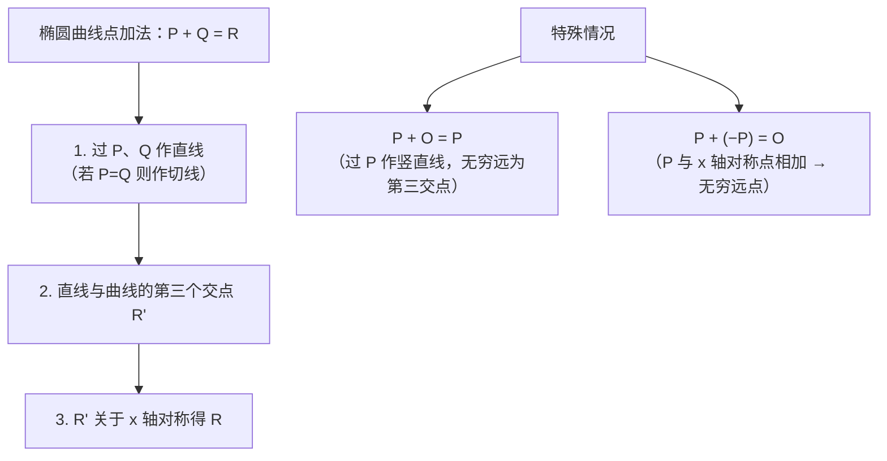
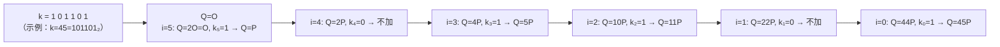
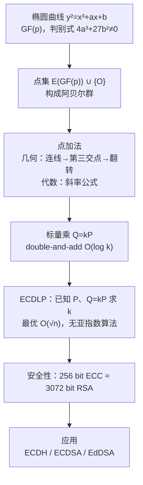

# 密码学（25）· 椭圆曲线密码学基础

> [!abstract] TL;DR
> - 椭圆曲线密码学（ECC）将群运算定义在椭圆曲线的点集上，利用**椭圆曲线离散对数问题（ECDLP）**的困难性构建非对称密码原语。
> - 核心运算是**标量乘** `Q = kP`：已知 P 和 k 求 Q 很快（double-and-add），已知 P 和 Q 反求 k 极难——比有限域 DLP 更难，使得 **256 位 ECC 安全性约等于 3072 位 RSA**。
> - ECC 家族覆盖密钥交换（[[26.ECDH密钥交换]]）、数字签名（[[27.ECDSA签名]]、[[28.EdDSA与Ed25519]]），是现代 TLS、区块链、安全芯片的核心组件。
> - 选曲线选参数：优先 Curve25519 / P-256，避免弱曲线；验证对方的公钥点是否在曲线上，防无效曲线攻击。

---

## 概述与定位

椭圆曲线密码学（Elliptic Curve Cryptography，ECC）由 Neal Koblitz 和 Victor Miller 于 1985 年独立提出，是继 RSA、DH 之后非对称密码学的第三条主线。与 [[21.非对称加密总论]] 中讲到的 RSA（依赖整数分解）和 [[23.Diffie-Hellman密钥交换]]（依赖有限域离散对数）不同，ECC 把困难问题迁移到**椭圆曲线点群**上，同等安全级别所需的密钥长度大幅缩短：

| 安全级别（bits） | RSA / DH 密钥长度 | ECC 密钥长度 |
|:-:|:-:|:-:|
| 80 | 1024 bit | 160 bit |
| 112 | 2048 bit | 224 bit |
| 128 | 3072 bit | 256 bit |
| 192 | 7680 bit | 384 bit |
| 256 | 15360 bit | 521 bit |

密钥短带来的好处：运算更快、存储更小、带宽更省——在嵌入式、移动端、TLS 握手中优势显著。本篇是 ECC 系列的**数学基础篇**，后续 [[26.ECDH密钥交换]] 和 [[27.ECDSA签名]] 将直接在本篇的点群结构上构建协议。

---

## 原理与机制

### 椭圆曲线的定义

密码学中最常用的是**短 Weierstrass 形式**（Short Weierstrass Form）：

```
y² = x³ + ax + b    （域特征 ≠ 2, 3）
```

参数 a、b 决定曲线形状。要让曲线构成一个合法的群（不产生尖点或自交），需要满足**非奇异条件**，即判别式不为零：

```
判别式 Δ = 4a³ + 27b² ≠ 0
```

若 Δ = 0，曲线有奇点（尖点或节点），此时点加法无法良好定义，不能用于密码学。

除短 Weierstrass 外还有几种等价形式：
- **Montgomery 曲线**：`By² = x³ + Ax² + x`（Curve25519 所用）
- **扭曲 Edwards 曲线**：`ax² + y² = 1 + dx²y²`（Ed25519 所用，详见 [[28.EdDSA与Ed25519]]）

这些形式在数学上与 Weierstrass 等价，但对特定运算（如完全加法公式、抵抗侧信道）有工程优势。

### 有限域 GF(p) 上的曲线

密码学不在实数上运算（实数无穷精度，无法枚举），而是在**有限域 GF(p)** 上（p 为大素数）：

```
y² ≡ x³ + ax + b  (mod p)
```

所有运算（加减乘除）都在模 p 意义下进行。曲线上的点集为：

```
E(GF(p)) = { (x, y) | x,y ∈ GF(p),  y² ≡ x³ + ax + b (mod p) } ∪ { O }
```

其中 **O**（无穷远点，Point at Infinity）是群的**单位元**：它不对应坐标平面上任何具体点，但在代数意义上是点加法的中性元素，满足 `P + O = O + P = P`。

曲线上的点个数 `#E(GF(p))` 由 Hasse 定理约束：

```
| #E(GF(p)) - (p + 1) | ≤ 2√p
```

即点数在 p 附近，量级为 p。

### 点加法的几何意义

在实数域上，椭圆曲线点加法有直观几何解释：



关键几何规则：
1. 过两点（或过切点）作直线，取曲线上第三个交点。
2. 将第三交点关于 x 轴**对称翻转**，得到和点。
3. 直线与曲线恰好有且仅有一个第三交点（计重数），保证运算封闭。

### 点加法的代数公式

将几何直觉翻译成模 p 的代数运算。

**P ≠ Q 时（P + Q）的斜率与坐标：**

```
设 P = (x₁, y₁)，Q = (x₂, y₂)，P ≠ Q，且 x₁ ≠ x₂

斜率 λ = (y₂ - y₁) · (x₂ - x₁)⁻¹  (mod p)

x₃ = λ² - x₁ - x₂  (mod p)
y₃ = λ(x₁ - x₃) - y₁  (mod p)

R = P + Q = (x₃, y₃)
```

**倍点 P + P（切线斜率）：**

```
设 P = (x₁, y₁)，y₁ ≠ 0

斜率 λ = (3x₁² + a) · (2y₁)⁻¹  (mod p)

x₃ = λ² - 2x₁  (mod p)
y₃ = λ(x₁ - x₃) - y₁  (mod p)

R = 2P = (x₃, y₃)
```

若 `y₁ = 0`，则 `2P = O`（切线垂直，打到无穷远）。

**特殊情况：**
- `P + O = P`（O 是单位元）
- `P + (−P) = O`，其中 `−P = (x₁, −y₁ mod p)`

> [!note] 有限域中的"除法"
> 公式中的 `(x₂−x₁)⁻¹ (mod p)` 是模逆元，通过扩展 Euclidean 算法或费马小定理 `a⁻¹ ≡ aᵖ⁻² (mod p)` 计算。

可以验证该点加法满足：封闭性、结合律、单位元（O）、逆元（`−P`），即 `E(GF(p))` 构成一个**阿贝尔群**（交换群）。

### 标量乘法 kP

**标量乘**（Scalar Multiplication）是 ECC 的核心运算：给定点 P 和正整数 k，计算：

```
Q = kP = P + P + P + ... + P  （k 个 P 相加）
```

直接累加需要 k-1 次点加法，当 k 是 256 位整数（约 10^77）时完全不可行。实际使用 **double-and-add** 算法（类比模幂的 square-and-multiply）：

```
算法：Double-and-Add（从高位到低位）

输入：点 P，整数 k = (k_{n-1} k_{n-2} ... k_1 k_0)₂
输出：Q = kP

Q ← O          # 初始为无穷远点（单位元）
for i = n-1 downto 0:
    Q ← 2Q                 # 倍点（doubling）
    if k_i == 1:
        Q ← Q + P          # 点加（addition）
return Q
```

时间复杂度：约 `n` 次倍点 + `n/2` 次点加，共 `O(log k)` 次群运算，256 位 k 只需约 384 次运算。



> [!note] 与模幂对比
> 标量乘 `kP` 与 RSA/DH 的模幂 `gᵏ mod p` 在结构上一一对应：群运算从整数乘法换成点加法，double 从平方换成倍点，add 从乘以 g 换成加 P。double-and-add 就是 square-and-multiply 的群论等价。

### 椭圆曲线离散对数问题（ECDLP）

ECC 的安全性建立在 **ECDLP（Elliptic Curve Discrete Logarithm Problem）** 的困难性上：

```
已知曲线 E、生成元 G、公钥点 Q = kG，
求私钥整数 k。
```

目前已知的最优算法：
- **Pohlig-Hellman**：若群阶有小质因子则快，正规曲线选大素数阶子群规避。
- **Baby-step Giant-step（BSGS）**：时间/空间复杂度均 O(√n)。
- **Pollard ρ 算法**：期望 O(√n) 时间、O(1) 空间，实践中最优。

对于 256 位素数阶曲线，Pollard ρ 需要约 2^128 次群运算——当前计算资源无法企及。**为何 ECDLP 比有限域 DLP 更难？** 椭圆曲线群不像有限域乘法群那样有"指数运算的代数结构"（如 Index Calculus 可利用光滑数），目前没有已知的亚指数算法适用于一般椭圆曲线群，因此同等安全级别下密钥比 DLP 短得多。

---

## 算法流程 / 结构详解

### 曲线域参数

一套 ECC 参数（domain parameters）由以下六元组描述：

```
(p, a, b, G, n, h)

p : 有限域素数（曲线定义在 GF(p) 上）
a, b : Weierstrass 曲线系数（满足 4a³+27b² ≠ 0 mod p）
G : 生成元（基点，Generator），G ∈ E(GF(p))
n : G 的阶（order），即最小正整数使得 nG = O，n 为大素数
h : 余因子（cofactor），h = #E(GF(p)) / n，安全曲线要求 h 尽量小（1 或 4 或 8）
```

密钥生成：
```
私钥 d ←_random [1, n-1]
公钥 Q = dG
```

### 常用曲线参数

#### secp256k1（Koblitz 曲线，比特币/以太坊）

```
p  = 2²⁵⁶ - 2³² - 2⁹ - 2⁸ - 2⁷ - 2⁶ - 2⁴ - 1
   = 0xFFFFFFFFFFFFFFFFFFFFFFFFFFFFFFFFFFFFFFFFFFFFFFFFFFFFFFFEFFFFFC2F

a  = 0（无 x 项）
b  = 7
曲线方程：y² = x³ + 7

n  = 0xFFFFFFFFFFFFFFFFFFFFFFFFFFFFFFFEBAAEDCE6AF48A03BBFD25E8CD0364141
h  = 1（余因子为 1，素数阶群）
```

Koblitz 曲线 a=0 使得倍点公式中 `3x² + a` 退化为 `3x²`，部分实现可优化。比特币 ECDSA 和以太坊地址均基于此曲线。

#### NIST P-256（secp256r1，TLS/PKI 最常用）

```
p  = 2²⁵⁶ - 2²²⁴ + 2¹⁹² + 2⁹⁶ - 1
a  = p - 3  （即 a = -3 mod p，倍点公式可优化）
b  = 0x5AC635D8AA3A93E7B3EBBD55769886BC651D06B0CC53B0F63BCE3C3E27D2604B

n  = 0xFFFFFFFF00000000FFFFFFFFFFFFFFFFBCE6FAADA7179E84F3B9CAC2FC632551
h  = 1
```

NIST P-256 是 TLS 1.3 握手、iOS/Android 证书、FIDO2 WebAuthn 的默认曲线。

#### Curve25519（Montgomery 形式，Bernstein 2006）

```
形式：By² = x³ + Ax² + x，GF(p)
p  = 2²⁵⁵ - 19
A  = 486662
B  = 1
n  = 2²⁵² + 27742317777372353535851937790883648493（大素数）
h  = 8（余因子 8，ECDLP 限制在素数阶子群）
```

Curve25519 专为 Diffie-Hellman 设计（见 [[26.ECDH密钥交换]] 中的 X25519），有如下特性：
- Montgomery 梯形（Montgomery ladder）天然抵御时序侧信道
- 余因子 8，需在实现层清除低 3 位（clamping）防小子群攻击
- 参数选取过程完全公开透明（SafeCurves 认证）

#### Ed25519 / 扭曲 Edwards 曲线

```
形式：ax² + y² = 1 + dx²y²
曲线：-x² + y² = 1 - (121665/121666)x²y²  （GF(2²⁵⁵−19)）
```

Ed25519 是 Curve25519 在扭曲 Edwards 坐标下的等价形式，专为签名优化（完全加法公式，无例外情况），详见 [[28.EdDSA与Ed25519]]。

### 曲线对比

| 曲线 | 形式 | 密钥长度 | 余因子 | 主要用途 | SafeCurves |
|------|------|---------|--------|---------|------------|
| secp256k1 | Weierstrass | 256 bit | 1 | 比特币、以太坊 | 不在列（参数选择过程不透明） |
| P-256 (secp256r1) | Weierstrass | 256 bit | 1 | TLS、FIDO2、iOS | 不在列（NIST 曲线后门争议） |
| Curve25519 | Montgomery | 255 bit | 8 | X25519 密钥交换 | 通过 |
| Ed25519 | Edwards | 255 bit | 8 | EdDSA 签名 | 通过 |
| P-384 | Weierstrass | 384 bit | 1 | 政府/NSA Suite B | 不在列 |

---

## 安全性与正确使用

### ECDLP 的实际安全边界

对 n 阶群，最优 Pollard ρ 的复杂度约 `O(√n)` 次群运算：

```
secp256k1 / P-256：n ≈ 2²⁵⁶ → 攻击需 ≈ 2¹²⁸ 次运算  → 128 位安全
P-384：             n ≈ 2³⁸⁴ → 攻击需 ≈ 2¹⁹² 次运算  → 192 位安全
P-521：             n ≈ 2⁵²¹ → 攻击需 ≈ 2²⁶⁰ 次运算  → 260 位安全
```

量子计算机：Shor 算法可在多项式时间内求解 ECDLP，使 ECC 完全不安全。后量子迁移方向见 [[49.后量子密码概览]]。

### 安全曲线选择

**SafeCurves 项目**（Bernstein & Lange）给出了评估曲线安全性的多维度标准：

1. **大素数阶**：n 为大素数，余因子 h 小（避免小子群攻击）
2. **CM 判别式足够大**：防 CM 方法加速 ECDLP
3. **Twist 安全**：曲线的扭曲（twist）也有大素数阶，防无效曲线攻击
4. **完全加法公式**：Edwards 曲线无例外情况，Montgomery 梯形无分支泄露
5. **参数可验证**：参数来源透明，无隐含后门

**NIST P-256 / P-384 的争议**：NIST 曲线的种子参数（如 P-256 的 b 值）通过哈希 "c49d3608 86e70493..." 生成，种子来源不透明，理论上存在后门嫌疑（Dual_EC_DRBG 事件加剧此担忧）。目前无已知实际攻击，工业界依然广泛使用；但对高安全性场景，优先选 Curve25519/Ed25519。

### 无效曲线攻击（Invalid Curve Attack）

攻击场景：攻击者发送一个**不在目标曲线上**的点给受害者，受害者若不验证直接做 ECDH 计算，可能泄露私钥信息。

```
正常 ECDH：接收方收到对方公钥 Q，计算 dQ
攻击：发送点 Q' ∉ E，且 Q' 在一条阶很小（如阶=r，r 很小）的曲线上
      则 dQ' 的结果在小集合中，枚举可还原 d mod r
      多次攻击不同小阶曲线，CRT 合并还原完整私钥 d
```

防御：**每次接收对方公钥时，验证点在曲线上**：

```
验证步骤：
1. Q ≠ O（不是无穷远点）
2. Q 的坐标 x, y ∈ [0, p-1]
3. y² ≡ x³ + ax + b  (mod p)
4. nQ = O（阶验证，余因子 h > 1 时必须做）
```

使用成熟库（如 libsodium、BoringSSL、OpenSSL ≥ 1.1）通常自动执行上述检查，不应自行实现底层点运算。

### 小子群攻击

当余因子 h > 1 时（如 Curve25519 的 h=8），曲线点群包含低阶子群（阶为 1、2、4、8）。若私钥标量未清除低位，攻击者可构造低阶点探测私钥信息。

Curve25519 的防御是**密钥 clamping**：

```python
# Curve25519 私钥 clamping（示意）
def clamp(k_bytes):
    k = bytearray(k_bytes)
    k[0]  &= 248   # 清除最低 3 位（余因子 8 = 2³）
    k[31] &= 127   # 清除最高位
    k[31] |= 64    # 置次高位为 1
    return bytes(k)
```

### 侧信道防护

标准 double-and-add 对私钥位存在分支：`k_i=1` 时多一次点加，时序和功耗泄露私钥位。防御：

- **Montgomery ladder**（Curve25519 默认）：无论 k_i 是 0 还是 1 都执行相同数量的运算，只是结果选哪个。
- **常量时间实现**：使用条件移动（`CMOV`）代替条件跳转。
- **点随机化（Randomized Projective Coordinates）**：加运算前随机化坐标表示，防功耗分析。

### 正确使用建议

| 场景 | 推荐曲线 | 不推荐 |
|------|---------|--------|
| 密钥交换（ECDH） | Curve25519（X25519） | 自定义曲线、secp192 |
| 数字签名 | Ed25519（EdDSA） | 手动实现 ECDSA nonce |
| TLS / PKI 互操作 | P-256 | P-192、brainpool（若无合规要求） |
| 政府/NSA Suite B | P-256 / P-384 | — |
| 区块链（比特币生态） | secp256k1 | — |

> [!warning] 永远不要自己实现点运算
> ECC 的安全性极度依赖常量时间、参数验证、随机数质量。使用 libsodium、OpenSSL、BoringSSL、Go `crypto/elliptic` 等经过审计的库；如需 Curve25519 优先用 `crypto_box`/`X25519` API 而非底层点运算接口。

---

## 小结



ECC 的数学精髓：在有限域上定义的椭圆曲线点集天然具有阿贝尔群结构，点加法满足结合律且有单位元和逆元；标量乘 kP 的**不可逆性**（ECDLP 困难）是所有 ECC 协议的安全根基。选对曲线（Curve25519/P-256）、验证对方公钥点的合法性、使用常量时间实现，是把 ECC 理论正确落地的三道门槛。

---

## 相关阅读

- [[21.非对称加密总论]]——公钥密码学全景、单向陷门函数框架
- [[23.Diffie-Hellman密钥交换]]——有限域 DLP，ECC 的前身与对比
- [[26.ECDH密钥交换]]——基于本篇点群的密钥协商协议（X25519）
- [[27.ECDSA签名]]——标量乘的签名应用，nonce 安全的关键性
- [[28.EdDSA与Ed25519]]——Edwards 曲线、确定性签名、优势
- [[47.SM2公钥密码]]——国密 SM2，同样基于 ECC
- [[54.ECDSA-nonce攻击]]——nonce 重用/偏置如何导致私钥泄露（防御视角）
- [[49.后量子密码概览]]——量子计算对 ECC 的威胁与后量子迁移

---

⬅️ 上一篇 [[24.ElGamal加密与签名]] ｜ 🏠 [[00.密码学总览]] ｜ 下一篇 [[26.ECDH密钥交换]] ➡️
