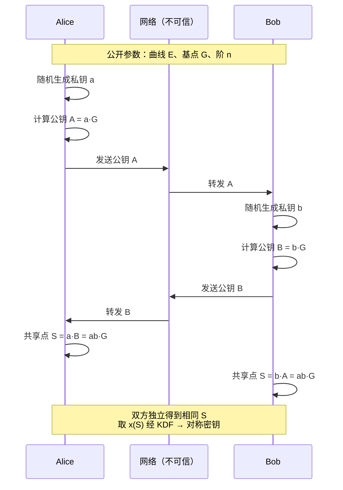
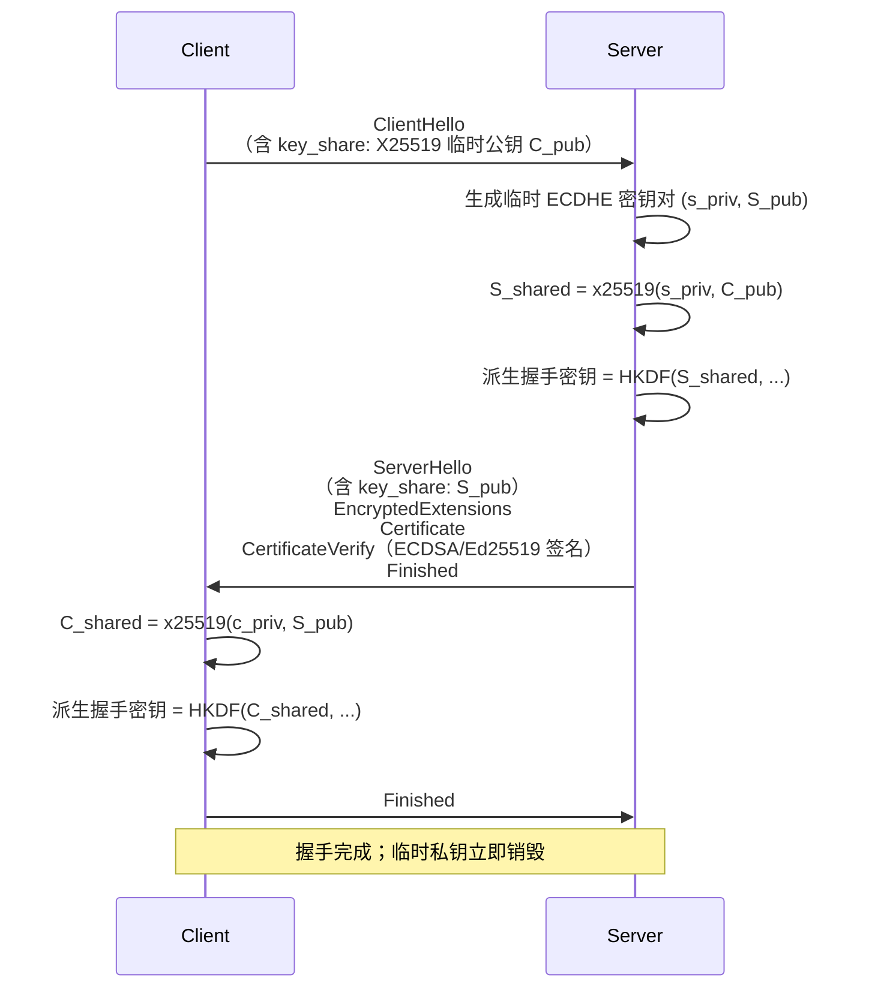

# 密码学（26）· ECDH密钥交换

> [!abstract] TL;DR
> - **ECDH**（Elliptic Curve Diffie-Hellman）是经典 DH 的椭圆曲线推广：双方各选私钥标量，交换对应的曲线点（公钥），再用对方公钥做标量乘得到同一共享点——安全性由椭圆曲线离散对数难题（ECDLP）保证。
> - 相较经典 DH，ECDH **密钥短得多**：256 位 ECC ≈ 3072 位 DH 安全强度，握手更快，带宽更省。
> - 共享点的 **x 坐标不能直接当密钥用**——需通过 KDF（如 [[38.HKDF]]）派生，避免统计偏置与 context-binding 缺失。
> - **X25519**（Curve25519 上的 ECDH）是首选实现：Montgomery 阶梯算法、clamping 处理协因子、常数时间、误用容忍——现代 TLS 1.3 和 Signal 协议的标准选择。
> - **ECDHE**（临时 ECDH）为每次会话生成新鲜密钥对，提供**前向保密（PFS）**；TLS 1.3 强制 (EC)DHE，废弃静态密钥交换（参见 [[71.详解网络协议/15.TLS协议.md]]）。
> - ECDH 本身**不含身份认证**：必须配合签名（[[27.ECDSA签名]]）或证书才能抵抗中间人攻击。

---

## 概述与定位

ECDH 是"椭圆曲线版的 Diffie-Hellman"。理解它需要两个前置概念：

1. **椭圆曲线上的点加法与标量乘法**（见 [[25.椭圆曲线密码学基础]]）：点加法是曲线上的群操作，标量乘法 `kP = P + P + … + P`（k 次）构成单向陷门——已知 `P` 和 `Q = kP`，求 k（ECDLP）在大曲线上计算不可行。
2. **Diffie-Hellman 思想**（见 [[23.Diffie-Hellman密钥交换]]）：双方各持私有标量，公开对应的"群元素幂次"，利用交换律让双方独立算出相同结果。

ECDH 把经典 DH 中的"乘法群指数运算"替换为"椭圆曲线标量乘法"，在保留数学成立性的同时，将所需密钥长度从 2048～3072 位压缩到 256 位，同时安全强度等价。

### ECDH 在密码体系中的位置

| 场景 | ECDH 的角色 |
|---|---|
| TLS 1.3 握手 | ECDHE（临时）是唯一允许的密钥交换机制，提供 PFS |
| Signal 协议 | X3DH 用多组 X25519 完成初始密钥建立与前向保密 |
| SSH | `curve25519-sha256` 是现代默认密钥交换算法 |
| WireGuard VPN | 全程只用 X25519，无协商、极简设计 |
| IPsec/IKEv2 | ECDH 组替换传统 DH 组 |

---

## 原理与机制

### 数学基础：椭圆曲线群上的共享秘密

设公共曲线参数为 `(曲线方程, p/a/b, G, n, h)`，其中：

- `G`：基点（生成元），已知
- `n`：G 的阶（n·G = 无穷远点 O）
- `h`：协因子（h = |曲线总阶| / n，X25519 曲线 h=8）

**密钥生成与交换**

```
Alice:
  私钥 a  ← 随机选自 [1, n-1]
  公钥 A  = a · G   （标量乘，发给 Bob）

Bob:
  私钥 b  ← 随机选自 [1, n-1]
  公钥 B  = b · G   （标量乘，发给 Alice）

Alice 计算共享点：S_A = a · B = a·(b·G) = ab·G
Bob  计算共享点：S_B = b · A = b·(a·G) = ab·G

S_A == S_B  ✓  （标量乘结合律/交换律）
```

**共享秘密的提取**

共享点 `S = abG` 是曲线上一个点 `(x, y)`。规范做法是只取 **x 坐标**，再通过 KDF 派生实际密钥材料：

```
raw_secret  = x_coordinate(S)
session_key = HKDF(raw_secret, salt, "握手上下文..." )
```

> [!warning] 不要直接用 x 坐标当密钥
> 曲线点的 x 坐标在群中分布均匀，但它并不是"随机比特串"——它具有特定代数结构，且缺少 context-binding。直接使用会在实现中引入潜在弱点。KDF（如 [[38.HKDF]]）起到"提炼 + 上下文绑定"的双重作用。

### 与经典 DH 的对比

| 维度 | 经典 DH | ECDH |
|---|---|---|
| 数学结构 | 有限域乘法群 `ℤ*_p` | 椭圆曲线加法群 `E(𝔽_p)` 或 `E(𝔽_{2^m})` |
| 困难问题 | 离散对数 DLP | 椭圆曲线离散对数 ECDLP |
| 128 位安全所需密钥长度 | 3072 位 | 256 位 |
| 计算开销（比较） | 模幂，O(log a) 次大数模乘 | 标量乘，O(log k) 次点加 |
| 带宽（128 位安全） | 3072 位公钥 ≈ 384 字节 | 256 位公钥 ≈ 32 字节（压缩点） |
| 子群攻击面 | 需大 safe prime；小子群攻击 | 需验证点在正确子群；协因子处理 |
| 标准化/实现 | RFC 3526（MODP 组）；较成熟 | NIST P-256/P-384、X25519；现代首选 |

### 交换流程可视化



---

## 算法流程与参数详解

### 典型曲线参数选择

| 曲线 | 形式 | 域 | 密钥长度 | 安全位 | 协因子 h | 备注 |
|---|---|---|---|---|---|---|
| P-256 (secp256r1) | Weierstrass | 素数域 | 256 位 | ~128 | 1 | NIST 标准；TLS 广泛支持 |
| P-384 (secp384r1) | Weierstrass | 素数域 | 384 位 | ~192 | 1 | 政府/高安全级别 |
| Curve25519 | Montgomery | 素数域 | 255 位 | ~128 | 8 | X25519 的基础曲线；首选 |
| Curve448 | Montgomery | 素数域 | 448 位 | ~224 | 4 | X448；更高安全等级 |

### 标准 ECDH 算法流程（伪代码）

```
=== 参数 ===
曲线 E, 基点 G, 阶 n, 协因子 h

=== 密钥生成 ===
function KeyGen():
    a ← random_scalar(1, n-1)
    A ← scalar_mul(a, G)      // A = aG
    return (private_key=a, public_key=A)

=== 密钥交换 ===
function ECDH(my_private_key, peer_public_key):
    // 1. 验证对方公钥（防无效曲线攻击）
    assert point_on_curve(peer_public_key)
    assert peer_public_key != O               // 不是无穷远点
    assert scalar_mul(n, peer_public_key) == O // 点的阶整除 n

    // 2. 计算共享点（h=1 时可省协因子乘法）
    S ← scalar_mul(my_private_key, peer_public_key)

    // 3. 检查结果有效
    assert S != O

    // 4. 提取 x 坐标
    raw ← x_coordinate(S)

    // 5. 用 KDF 派生密钥
    key ← HKDF(ikm=raw, salt=..., info=上下文字符串, len=所需长度)
    return key
```

### X25519：现代 ECDH 的首选

X25519 是 Curve25519 上的 ECDH 函数（RFC 7748），由 Daniel J. Bernstein 设计，有几个显著的工程优势：

**Montgomery 阶梯（Montgomery ladder）**

Curve25519 采用 Montgomery 曲线形式 `By² = x³ + Ax² + x`（A=486662，B=1），其参数使得标量乘法可以只用 x 坐标计算，不需要 y 坐标——这让 Montgomery 阶梯算法成为天然选择：

```
=== Montgomery Ladder（仅 x 坐标）===
function x25519_ladder(scalar k, x_coordinate u):
    R0 ← (1, 0)     // 无穷远点
    R1 ← (u, ?)     // 输入点（只需 x）
    for i = 254 downto 0:
        bit ← (k >> i) & 1
        if bit == 1:
            R0, R1 ← point_add(R0, R1), point_double(R1)
        else:
            R0, R1 ← point_double(R0), point_add(R0, R1)
    return x_coordinate(R0)
```

关键性质：**每次循环执行的操作数量与 bit 值无关**，天然对抗时序攻击与缓存侧信道。

**Clamping（标量钳制）**

X25519 在使用私钥前会做位操作处理（clamping）：

```
private_key[0]  &= 248   // 清低 3 位：强制标量是 8 的倍数
private_key[31] &= 127   // 清第 256 位
private_key[31] |= 64    // 置第 255 位
```

- 清低 3 位（即乘以 8 = 协因子 h）：自动处理小子群，消除小子群攻击面
- 固定最高有效位：使 scalar_mul 运行时间恒定，避免通过执行路径泄露私钥长度信息

**误用容忍设计**

X25519 的接口极简：`x25519(scalar, u_coordinate) → u_coordinate`，输入任意 32 字节都合法——即使对方传来"无效点"也不会崩溃（Clamping + 协因子处理已内置），大幅降低实现错误风险。这与 NIST 曲线需要手动验证公钥的情况形成对比。

**X25519 完整流程（RFC 7748）**

```
=== 密钥生成 ===
Alice_private  ← random_bytes(32)
Alice_public   ← x25519(clamp(Alice_private), 9)   // 9 是 Curve25519 基点 u 坐标

=== 密钥交换 ===
shared_u       ← x25519(clamp(Alice_private), Bob_public)
shared_key     ← KDF(shared_u, ...)
```

---

## ECDHE 与前向保密

### 静态 ECDH vs 临时 ECDHE

| 模式 | 密钥寿命 | 前向保密 | 场景 |
|---|---|---|---|
| 静态 ECDH | 长期公钥，反复使用 | 无——私钥一旦泄露，历史会话全部可解密 | 已被 TLS 1.3 废弃 |
| ECDHE | 每次会话生成新鲜密钥对，用后销毁 | 有——即使长期私钥（签名私钥）泄露，过去会话仍不可解密 | TLS 1.3 默认且唯一 |

### TLS 1.3 中的 ECDHE

TLS 1.3 握手（[[71.详解网络协议/15.TLS协议.md]]）中 ECDHE 的位置：



- **认证**由 `CertificateVerify`（签名）完成，与 ECDHE 分离——ECDHE 提供密钥材料，签名提供身份证明
- 临时私钥在握手完成后立即销毁，确保 PFS
- TLS 1.3 优先的 named group 顺序：`x25519 > x448 > P-256 > P-384`

---

## 安全性与正确使用

### 无效曲线攻击（Invalid Curve Attack）

**攻击原理**：对于 NIST Weierstrass 曲线（形如 `y² = x³ + ax + b`），参数 `b` 不影响加法运算，只约束曲线上的点集。若攻击者发来的"公钥点" `Q` 满足加法法则但不在正曲线上（位于参数 `b'≠b` 的另一条曲线上），这些曲线往往有小阶子群。服务端若不验证公钥，标量乘后 `S` 会在小子群中泄露私钥的低位，通过多次交互即可逐步恢复完整私钥。

**已知案例**：2017 年研究者对多个 TLS 实现（包括某些 Java 实现）验证了此攻击的可行性。

**防御**：
1. 验证公钥点在曲线方程上：`y² ≡ x³ + ax + b (mod p)`
2. 验证点不是无穷远点 O
3. 验证 `n·Q = O`（对 h>1 的曲线需额外验证 `h·Q ≠ O` 或直接乘以 `h·n`）

**X25519 天然免疫**：clamping 已内置协因子处理，API 设计上输入任意 32 字节都安全，无需手动验证。

### 小子群攻击（Small Subgroup Attack）

**攻击原理**：当曲线协因子 `h > 1` 时，曲线的总点数为 `h·n`。攻击者可以发送一个阶整除 `h` 的点（位于小子群中）。若直接用此点计算共享秘密，结果仅取决于 `k mod (子群阶)`，暴力搜索即可恢复私钥信息的一部分（类似于 DH 中的小子群攻击）。

**防御**：
- 对 h=1 的曲线（如 P-256）：小子群仅含 O，无攻击面
- 对 h=8 的 Curve25519：clamping 使私钥是 8 的倍数，`k·(小子群点) = (k/8)·8·(小子群点) = O`，共享点为 O——实现中检查共享点非 O 即可拦截
- 对 h=4 的 Curve448：类似处理

### MITM 仍需独立认证

ECDH 本身只保证两端算出了相同的共享秘密，**不证明"谁是那另一端"**。中间人可以：

```
Alice ←── ECDH_1 ──→ Mallory ←── ECDH_2 ──→ Bob

Alice 以为在和 Bob 交换密钥；Mallory 看到所有明文
```

解决方案：在 ECDH 公钥上附加**签名**（用 [[27.ECDSA签名]] 或 Ed25519），结合 PKI 证书验证对方身份——TLS 的 `CertificateVerify` 消息就是这层保护。

### 安全使用检查单

| 项目 | 建议 |
|---|---|
| 曲线选择 | 优先 X25519（RFC 7748）；次选 P-256（NIST FIPS 186-5）；不用 P-192/secp256k1（非 TLS 场景） |
| 公钥验证（NIST 曲线） | 验证点在曲线上、非 O、阶为 n；X25519 可跳过 |
| 密钥派生 | 必须用 KDF（HKDF-SHA256 等），不要直接用 x 坐标 |
| 前向保密 | 使用 ECDHE（临时密钥），不使用静态 ECDH |
| 实现选择 | 优先调用 libsodium/BoringSSL 等已审计库，不要手写 ECC 运算 |
| 随机数质量 | 私钥生成必须用 CSPRNG（参见 [[43.随机数与熵]]）；X25519 私钥可以是任意 32 随机字节 |
| 防时序 | X25519 内置；NIST 曲线需确保库实现是常数时间 |
| 认证 | ECDH 必须配合签名/证书；单独使用 ECDH 无法抵抗 MITM |

---

## 小结

ECDH 将经典 Diffie-Hellman 的群元素从有限域乘法群替换为椭圆曲线加法群，以 ECDLP 的难解性换来等价安全下的极小密钥尺寸：256 位对比 3072 位。协议的数学本质是**交换标量乘法的顺序**——Alice 做 `a·(bG)`，Bob 做 `b·(aG)`，两者均等于 `abG`。共享点的 x 坐标经 KDF 派生才是可用的对称密钥。

X25519 是当前工程首选：Montgomery 阶梯保证常数时间，clamping 内置协因子处理，API 设计使误用极难——WireGuard、TLS 1.3、Signal 均以此为基石。ECDHE 模式在此基础上增加临时性，实现前向保密，已成为 TLS 1.3 强制要求。

安全性的核心要点只有三条：**验证公钥点**（NIST 曲线）、**配 KDF 派生密钥**、**配签名做身份认证**——单独的 ECDH 只解决了密钥材料交换，不解决"谁"的问题。

---

## 相关阅读

- [[25.椭圆曲线密码学基础]] — 点加法、标量乘法、ECDLP、曲线参数详解
- [[23.Diffie-Hellman密钥交换]] — 经典 DH 原理与对比基准
- [[27.ECDSA签名]] — ECDH 的搭档：签名与身份认证
- [[38.HKDF]] — 从共享点提取真正可用密钥的 KDF 标准
- [[71.详解网络协议/15.TLS协议.md]] — ECDHE 在 TLS 1.3 握手中的完整上下文
- [[43.随机数与熵]] — 私钥生成的随机数质量要求

---

⬅️ 上一篇 [[25.椭圆曲线密码学基础]] ｜ 🏠 [[00.密码学总览]] ｜ 下一篇 [[27.ECDSA签名]] ➡️
