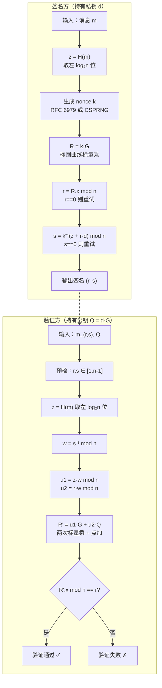

# 密码学（27）· ECDSA签名

> [!abstract] TL;DR
> - **ECDSA**（Elliptic Curve Digital Signature Algorithm）是基于椭圆曲线的 DSA 变体，签名尺寸小（256 位曲线产生约 64 字节签名）、计算快，是比特币、以太坊、TLS 1.3、JWT、代码签名的主流选择。
> - **签名核心**：私钥 `d`，公钥 `Q = d·G`，消息哈希 `z = H(m)`；随机 nonce `k`，算 `R = k·G`，取 `r = R.x mod n`，算 `s = k⁻¹(z + r·d) mod n`，签名为 `(r, s)`。
> - **验证核心**：`u1 = z·s⁻¹ mod n`，`u2 = r·s⁻¹ mod n`；计算 `R' = u1·G + u2·Q`；若 `R'.x mod n == r` 则验证通过。
> - **nonce k 是命门**：k 重用 → 联立两式立即解出私钥 d；k 有偏置 → lattice 攻击恢复 d。这是 ECDSA 最大的工程陷阱，已有真实世界灾难案例（[[54.ECDSA-nonce攻击]]）。
> - **RFC 6979 确定性 nonce**：用私钥和消息一起 HMAC-DRBG 派生 k，彻底消除随机数依赖、防止 k 重用，是现代 ECDSA 实现的强制要求。
> - 需要更安全的签名且不想手动管理 k？转向 [[28.EdDSA与Ed25519]]。

本篇是「密码学」系列非对称加密的签名核心篇，承接 [[25.椭圆曲线密码学基础]] 的曲线运算与点加/标量乘知识，详解 ECDSA 的完整数学流程、nonce 的致命重要性与工程实践。与 [[22.RSA详解]] 中的 RSA-PSS 签名形成对比；nonce 攻击的数学深度展开见 [[54.ECDSA-nonce攻击]]；更现代的确定性替代方案见 [[28.EdDSA与Ed25519]]。

---

## 概述与定位

### ECDSA 的来历

**DSA**（Digital Signature Algorithm）由 NIST 于 1991 年提出（FIPS 186），基于离散对数问题（DLP），是 RSA 签名之外的政府标准选择。**ECDSA** 是 DSA 的椭圆曲线版本：用椭圆曲线群的标量乘代替有限域的模幂，在更短的密钥下达到同等安全强度。

| 方案 | 安全基础 | 256 位安全对应密钥长度 | 签名长度 |
|---|---|---|---|
| RSA-PSS | 整数分解（IFP） | 15360 位 RSA | 1920 字节 |
| DSA | 有限域离散对数 | 3072 位 DSA | 约 456 字节 |
| **ECDSA** | **椭圆曲线离散对数（ECDLP）** | **521 位（P-521）** | **约 66 字节** |
| EdDSA/Ed25519 | Edwards 曲线 ECDLP | 256 位 | 64 字节 |

ECDSA 的优势在于：相同安全强度下，密钥与签名都短得多；椭圆曲线标量乘在专用硬件上极快（TLS 握手速度是 RSA 的数倍）。

### ECDSA 的工程地位

| 应用场景 | 曲线 | 说明 |
|---|---|---|
| Bitcoin 交易签名 | secp256k1 | 私钥签、公钥验，每笔交易必须有效签名 |
| Ethereum 交易 | secp256k1 | 地址直接从公钥派生；签名验证是共识的一部分 |
| TLS 1.3 证书 | P-256（prime256v1） | 服务端证书签名，握手认证 |
| JWT / JOSE | P-256（ES256）、P-384（ES384） | JSON Web Signature |
| SSH 密钥 | P-256、P-384、P-521 | `ecdsa-sha2-nistp256` 等 |
| 代码签名（Android APK） | P-256 / P-384 | APK 签名方案 v2/v3 |
| 国密 SM2 签名 | SM2 曲线 | SM2 签名算法本质与 ECDSA 同源，参见 [[47.SM2公钥密码]] |

---

## 原理与机制

### 椭圆曲线回顾

ECDSA 需要如下椭圆曲线公共参数（domain parameters），参见 [[25.椭圆曲线密码学基础]]：

```
曲线参数六元组 (p, a, b, G, n, h)
  p  : 定义有限域 GF(p) 的大素数（曲线在 mod p 运算下）
  a,b: 曲线方程 y² ≡ x³ + ax + b (mod p) 的系数
  G  : 基点（生成元），阶为 n
  n  : 基点 G 的阶（大素数，满足 n·G = O，O 是无穷远点）
  h  : 余因子（cofactor），通常为 1
```

**关键运算**：
- **点加** `P + Q`：曲线上两点相加，结果还在曲线上（群封闭性）。
- **标量乘** `k·G`：对 G 做 k 次点加，等价于对整数 k 用"倍加法"高效计算。
- **单向性**：已知 `Q = k·G`，无法（在多项式时间内）从 Q 反推 k，这是**椭圆曲线离散对数问题（ECDLP）**的困难性假设。

常用曲线参数（示例，非完整 hex）：

| 曲线 | 域大小 | n 的大小 | 用途 |
|---|---|---|---|
| secp256k1 | 256 bit | 256 bit | Bitcoin、Ethereum |
| P-256（secp256r1 / prime256v1） | 256 bit | 256 bit | TLS、JWT、Android |
| P-384（secp384r1） | 384 bit | 384 bit | 高安全 TLS、NSA Suite B |
| P-521（secp521r1） | 521 bit | 521 bit | 最高安全 NIST 曲线 |
| Curve25519 | 255 bit | 252 bit | X25519 ECDH；签名用 Ed25519 |

### ECDSA 签名生成——数学推导

**参数**：
- 私钥：随机整数 `d ∈ [1, n-1]`
- 公钥：`Q = d·G`（椭圆曲线点）
- 消息 m 的哈希：`z = H(m)`（取哈希输出最左 `log₂(n)` 位）

**签名步骤**：

```
ECDSA_Sign(d, m):
  z = H(m) 取左 ceil(log2(n)) 位，截断到整数
  重复:
    1. 随机选 k ← [1, n-1]（高质量 CSPRNG 或 RFC 6979 确定性派生）
    2. R = k·G          # 椭圆曲线标量乘；R 是曲线上的点 (R.x, R.y)
    3. r = R.x mod n    # 取 R 的 x 坐标模 n
    4. 若 r == 0，回 1 重试
    5. s = k⁻¹ · (z + r·d) mod n   # k 的模逆 × (哈希 + r×私钥)
    6. 若 s == 0，回 1 重试
  返回签名 (r, s)
```

> [!note] 为什么这样构造 s？
> 把 `s = k⁻¹(z + r·d) mod n` 变形：`k·s ≡ z + r·d (mod n)`，即 `k ≡ z·s⁻¹ + d·r·s⁻¹ (mod n)`。
> 于是，验证方拿到 `(r, s)` 后，用公钥 Q 重算这个等式右边就可以重建 k，进而重建 R.x 与 r 做比对——而不需要知道私钥 d。这正是 ECDSA 巧妙的"陷门"结构。

**关键参数说明**：

| 参数 | 含义 | 要求 |
|---|---|---|
| d | 私钥 | 随机 ∈ [1, n-1]，必须绝对保密 |
| Q = d·G | 公钥 | 曲线上的点，可公开 |
| k | 一次性 nonce | 每签一次必须全新、随机、保密；重用即泄露 d |
| z = H(m) | 消息哈希截断 | 不同消息哈希不同，防止伪造 |
| r = R.x mod n | 签名第一分量 | 把曲线上的点压缩成一个整数 |
| s = k⁻¹(z+rd) mod n | 签名第二分量 | 把 k、z、d 绑定在一起 |

### ECDSA 验证——数学推导

**验证步骤**（验证方持有公钥 Q，收到消息 m 和签名 (r, s)）：

```
ECDSA_Verify(Q, m, r, s):
  预检查:
    r, s ∈ [1, n-1]，否则签名无效
  z = H(m) 取左 ceil(log2(n)) 位
  w = s⁻¹ mod n            # s 的模逆
  u1 = z · w mod n          # z · s⁻¹
  u2 = r · w mod n          # r · s⁻¹
  R' = u1·G + u2·Q          # 椭圆曲线：两次标量乘 + 点加
  若 R' == O（无穷远点），签名无效
  验证 R'.x mod n == r      # 核心等式
```

**正确性证明**（为何 `R'.x == r` 当且仅当签名正确）：

```
R' = u1·G + u2·Q
   = (z·s⁻¹)·G + (r·s⁻¹)·(d·G)
   = s⁻¹·(z + r·d)·G        # 提取公因子 s⁻¹ 和 G
   = s⁻¹·(k·s)·G            # 因为 s = k⁻¹·(z+r·d)，所以 z+r·d = k·s
   = k·G
   = R                        # 正是签名时用的那个 R
```

故 `R'.x == R.x == r`，等式成立，验证通过。

### Mermaid 流程图：ECDSA 签名与验证



---

## 算法流程与结构详解

### nonce k 的致命性

> [!danger] nonce k 是 ECDSA 最危险的单点故障

#### 场景一：k 重用——两次签名秒杀私钥

假设对两条不同消息 m₁、m₂ 使用了**同一个 k**，分别得到签名 `(r, s₁)` 和 `(r, s₂)`（注意 r 相同，因为 R = k·G 相同）：

```
s₁ = k⁻¹(z₁ + r·d) mod n
s₂ = k⁻¹(z₂ + r·d) mod n

两式相减：
s₁ - s₂ = k⁻¹(z₁ - z₂) mod n

=> k = (z₁ - z₂) · (s₁ - s₂)⁻¹ mod n   # k 直接算出来了！

=> d = (s₁·k - z₁) · r⁻¹ mod n          # 私钥也算出来了！
```

攻击者只需看到两条签名共享 `r`（即同一 k），就能**一行公式恢复私钥**。这是纯代数攻击，无需任何计算难度。

**真实案例**：
- **Sony PlayStation 3（2010 年）**：PS3 固件签名使用了固定 k，研究员 fail0verflow 从多个固件签名提取私钥，完全破解代码签名体系。
- **Android Bitcoin 钱包（2013 年）**：`java.security.SecureRandom` 在某些 Android 版本上随机数池初始化有缺陷，多个钱包 app 产生相同 k，攻击者盗取了数千个钱包的私钥。

详细数学展开见 [[54.ECDSA-nonce攻击]]。

#### 场景二：k 有偏置——格攻击（Lattice Attack）

若 k 的生成并不"真正随机"，而是有偏置（例如 k 的最高若干位恒为 0），则多条签名的信息可以建立一个**最短向量问题（SVP）**实例：

```
每条签名给出约束：
  s_i = k_i⁻¹(z_i + r_i·d) mod n
  => k_i = s_i⁻¹·z_i + s_i⁻¹·r_i·d mod n

若 k_i 的最高 l 位恒为 0（偏置 l bit），
则可建立如下格：
  k_i ≈ s_i⁻¹·z_i + s_i⁻¹·r_i·d (mod n)
         ↑ 已知              ↑ 未知的 d

收集 ~n/l 条签名，构造 (n/l) × (n/l) 格，
用 LLL/BKZ 格基约化求最短向量，
恢复 d。
```

即使 k 的偏置只有 1 bit（最高位恒 0），大约 300 条签名就能恢复私钥（Nguyen-Shparlinski 2002）。

**实际案例**：硬件安全密钥（Yubikey 5 等使用 Infineon TPM 芯片）的 nonce 生成曾有已知弱点（ROCA 相关变种），利用格攻击恢复了签名私钥。

#### k 的安全要求总结

| 要求 | 说明 |
|---|---|
| 全随机 | k 必须从 CSPRNG 均匀采样于 `[1, n-1]` |
| 每次唯一 | 同一私钥签不同消息，k 必须每次不同 |
| 严格保密 | k 一旦泄露，d 立即可求 |
| 足够长 | 不能 truncate，必须与曲线 n 同等位长 |

### 确定性 ECDSA（RFC 6979）

RFC 6979（2013，T. Pornin）给出了确定性生成 nonce k 的标准方法，彻底消除了对外部 CSPRNG 的依赖：

**核心思路**：用私钥 d 和消息 m 一起作为 HMAC-DRBG 的种子，派生 k。只要 d 不泄露，k 就不可预测；同一 (d, m) 总产生同一 k（故两次签名同一消息结果相同，这是正常的——重要的是不同消息绝不共享 k）。

**RFC 6979 算法简要**（以 HMAC-SHA256 为例）：

```
RFC6979_generate_k(d, m, hash_algo, n):
  # 步骤 1：初始化 HMAC-DRBG
  h1  = hash_algo(m)                   # 消息哈希
  V   = 0x01 × 32                      # 32 字节全 1
  K   = 0x00 × 32                      # 32 字节全 0
  x   = int2octets(d)                  # 私钥字节串
  h1  = bits2octets(h1)                # 哈希截断到曲线大小

  # 步骤 2：HMAC-DRBG 更新
  K = HMAC(K, V || 0x00 || x || h1)
  V = HMAC(K, V)
  K = HMAC(K, V || 0x01 || x || h1)
  V = HMAC(K, V)

  # 步骤 3：生成候选 k
  重复:
    T = ""
    while len(T) < len(n):
      V = HMAC(K, V)
      T = T || V
    k = bits2int(T)
    if 1 <= k <= n-1: return k
    # k 不合法则继续更新 DRBG
    K = HMAC(K, V || 0x00)
    V = HMAC(K, V)
```

**RFC 6979 的核心特性**：

| 特性 | 效果 |
|---|---|
| 确定性 | 同 (d, m) → 同 k，签名可重现，便于测试向量 |
| 防重用 | 不同 m → 不同 k（HMAC 输入不同）；同一密钥不同消息 k 绝不碰撞 |
| 消除外部随机 | 不再依赖 OS/硬件 CSPRNG 的质量 |
| 可审计 | 签名过程完全可重现，利于合规审计 |

> [!tip] 现代实践
> OpenSSL、BouncyCastle、libsecp256k1（Bitcoin）、Go `crypto/ecdsa` 均已默认实现 RFC 6979。新项目直接用这些库，不要手写 ECDSA。

### 签名的两种格式

ECDSA 签名 `(r, s)` 有两种常见编码：

| 格式 | 说明 | 典型用途 |
|---|---|---|
| DER 编码（ASN.1） | `SEQUENCE { INTEGER r, INTEGER s }`，变长，通常 70–72 字节（P-256） | X.509 证书、TLS、OpenPGP |
| 紧凑（raw）格式 | r 和 s 各固定 32 字节拼接，共 64 字节 | JWT（ES256）、Bitcoin 压缩签名 |

### 低 s 规范（Low-S Canonicalization）与延展性

**签名延展性（Malleability）**：对于有效签名 `(r, s)`，`(r, n - s)` 也是同一消息的有效签名（因为 `-s mod n = n - s`，对 `-k` 做相同计算可得）。这意味着攻击者可以在不知道私钥的情况下，把有效签名变换成另一个有效签名。

**比特币的修复（BIP-62、BIP-146）**：强制要求 s ≤ n/2（即"低 s"规范）：

```
if s > n / 2:
    s = n - s      # 取 s 的"等价对"
```

这样每条消息只有唯一的规范签名形式，消除了延展性。以太坊在 EIP-2 中也引入了类似约束（`v` 字段的规范化）。

**TLS 不受延展性影响**：TLS 签名是对握手哈希的签名，整体都有完整性保护；而比特币的 `txid` 曾经依赖签名原始字节（SegWit 之前），延展性可以改变 txid 导致混乱。

---

## 与 DSA、RSA 签名的比较

### ECDSA 与原始 DSA 的关系

DSA 和 ECDSA 在算法逻辑上几乎完全平行，区别仅在于"群"不同：

| 步骤 | DSA（有限域） | ECDSA（椭圆曲线） |
|---|---|---|
| 群操作 | `y = g^x mod p`（模幂） | `Y = x·G`（标量乘） |
| 困难问题 | DLP：已知 `g^x mod p`，求 x | ECDLP：已知 `x·G`，求 x |
| 签名 r | `r = (g^k mod p) mod q` | `r = (k·G).x mod n` |
| 签名 s | `s = k⁻¹(z + r·x) mod q` | `s = k⁻¹(z + r·d) mod n` |
| 密钥长度（128-bit 安全） | 3072 位域，256 位 q | **256 位曲线** |

ECDSA 将 DSA 中的"有限域大素数群"换成"椭圆曲线群"，在等价安全强度下密钥缩短了约 10 倍。

### ECDSA 与 RSA 签名的关系

| 维度 | ECDSA（P-256） | RSA-PSS（2048-bit） |
|---|---|---|
| 安全基础 | ECDLP | IFP（整数分解） |
| 密钥大小 | 32 字节（私钥），64 字节（公钥，压缩） | 256 字节（模数） |
| 签名大小 | ~64 字节 | 256 字节 |
| 签名速度 | 快（标量乘） | 慢（大指数幂，但验证快） |
| 验证速度 | 中等（两次标量乘+点加） | 快（小公钥指数，通常 65537） |
| nonce 要求 | **必须安全随机** | RSA-PSS 的随机性在填充层（盐），不直接影响私钥安全 |
| 已知攻击 | nonce 重用/偏置（[[54.ECDSA-nonce攻击]]）；侧信道 | 填充 oracle（[[58.RSA-Bleichenbacher与padding-oracle]]）；因子分解 |
| 量子安全 | 否（Shor 算法 O(log³ n)） | 否（Shor 算法 O(log³ n)） |

> [!note] 验证速度不对称
> RSA 验证极快（e=65537 只需 17 次平方），ECDSA 验证需要两次标量乘（通常比一次慢约 2×）。在需要高速验证、低速签名的场景（如 TLS 服务端验证客户端证书）这有实际影响。

---

## secp256k1 与比特币/以太坊

**secp256k1** 是比特币选用的曲线（Satoshi Nakamoto 的选择），相比 NIST P-256 有几个特点：

**曲线方程**：`y² = x³ + 7`（即 `a = 0, b = 7`），结构更简单，a=0 使加法公式略简化。

**域素数**：
```
p = 2²⁵⁶ - 2³² - 2⁹ - 2⁸ - 2⁷ - 2⁶ - 2⁴ - 1
  = FFFFFFFF FFFFFFFF FFFFFFFF FFFFFFFF
    FFFFFFFF FFFFFFFF FFFFFFFE FFFFFC2F
```

这个 p 的特殊结构（接近 2²⁵⁶）使得 `mod p` 运算可以高效实现（无乘法，用移位和加减），非常适合嵌入式/硬件实现。

**为何不用 P-256**：
- Satoshi 对 NIST 曲线的随机生成种子的透明度存疑（P-256 的 b 参数来源于一个"随机"哈希，理论上可能有后门）；
- secp256k1 的参数完全由透明的代数关系决定，更可验证；
- Koblitz 曲线（a=0）有高效的 GLV/GLS 标量乘算法，可提速约 30%。

**以太坊的扩展——`v`、`r`、`s` 与公钥恢复**：

以太坊签名在 `(r, s)` 之外还携带一个恢复参数 `v`（0 或 1）：

```
给定消息哈希 z 和签名 (r, s, v)，恢复公钥：
  R  = 曲线上 x = r 的点（v 选 R.y 的奇偶）
  Q  = r⁻¹ · (s·R - z·G)    # 从签名直接恢复公钥
  地址 = keccak256(Q 的 x||y)[12:]   # 取后 20 字节
```

这使得以太坊不需要在交易中显式携带公钥——从签名就能恢复，节省链上存储。这是 secp256k1 的"公钥恢复"特性，P-256 同样支持但以太坊场景下用得最广泛。

---

## 代码示例

### Python（cryptography 库，含 RFC 6979）

```python
from cryptography.hazmat.primitives.asymmetric import ec
from cryptography.hazmat.primitives import hashes
from cryptography.hazmat.backends import default_backend

# 密钥生成
private_key = ec.generate_private_key(ec.SECP256K1(), default_backend())
public_key  = private_key.public_key()

# 签名（cryptography 库默认使用 RFC 6979 确定性 nonce）
message = b"Hello, ECDSA!"
signature = private_key.sign(message, ec.ECDSA(hashes.SHA256()))

# 验证
try:
    public_key.verify(signature, message, ec.ECDSA(hashes.SHA256()))
    print("验证通过")
except Exception as e:
    print("验证失败:", e)
```

> [!warning] 示例输出为示意
> `signature` 为 DER 编码的变长字节串，实际长度约 70–72 字节。

### OpenSSL 命令行

```bash
# 生成 P-256 私钥
openssl ecparam -name prime256v1 -genkey -noout -out priv.pem

# 提取公钥
openssl ec -in priv.pem -pubout -out pub.pem

# 签名（SHA-256）
openssl dgst -sha256 -sign priv.pem -out sig.der message.txt

# 验证
openssl dgst -sha256 -verify pub.pem -signature sig.der message.txt
```

> [!warning] 示例输出为示意
> OpenSSL 现代版本（1.1+）的 ECDSA 签名默认使用 RFC 6979 确定性 nonce（通过 `ECDSA_do_sign_ex` 路径），老版本（0.9.x）使用随机 nonce，不要在生产中使用老版本。

### 伪代码：完整 ECDSA 签名与验证

```
# ── 公共参数 ──────────────────────────────────────────────────
params = (p, a, b, G, n, h)   # 曲线参数，预共享

# ── 密钥生成 ──────────────────────────────────────────────────
KeyGen():
    d = random_int([1, n-1])    # 私钥（保密）
    Q = d · G                    # 公钥（公开）
    return (d, Q)

# ── 签名 ──────────────────────────────────────────────────────
Sign(d, m):
    z = leftmost_bits(H(m), bitlen(n))
    loop:
        k = RFC6979(d, m)         # 或 CSPRNG([1, n-1])
        R = k · G
        r = R.x mod n
        if r == 0: continue
        s = mod_inv(k, n) * (z + r * d) mod n
        if s == 0: continue
        return (r, s)

# ── 验证 ──────────────────────────────────────────────────────
Verify(Q, m, r, s):
    if not (1 <= r <= n-1 and 1 <= s <= n-1): return INVALID
    z = leftmost_bits(H(m), bitlen(n))
    w  = mod_inv(s, n)
    u1 = z * w mod n
    u2 = r * w mod n
    R_prime = u1 · G + u2 · Q
    if R_prime == O: return INVALID
    return (R_prime.x mod n) == r
```

---

## 安全性与正确使用

### nonce 管理（最高优先级）

> [!danger] 绝不手写 nonce 生成
> ECDSA 安全性的全部负担压在 nonce k 上。任何手写随机数生成、使用系统时间、重用 k 的行为，都会导致私钥被完全恢复。务必：
> - 使用实现了 **RFC 6979** 的成熟库（libsecp256k1、OpenSSL ≥ 1.1、Go stdlib、BouncyCastle）；
> - 或使用经过审计的 CSPRNG（OS 提供的 `getrandom`/`CryptGenRandom`），绝不自己实现。

### 曲线选择

| 场景 | 推荐曲线 | 说明 |
|---|---|---|
| 通用（TLS/JWT/代码签名） | P-256（prime256v1） | 广泛支持，FIPS 认证 |
| 高安全要求（政府/金融） | P-384 | NSA Suite B，128-bit 后量子前不够，但经典安全充足 |
| 区块链（Bitcoin/Ethereum） | secp256k1 | 生态要求，不要随意替换 |
| 新项目优先考虑 | Ed25519（EdDSA） | 确定性、抗侧信道更好，参见 [[28.EdDSA与Ed25519]] |
| 国密合规 | SM2（SM2 曲线） | 参见 [[47.SM2公钥密码]] |

### 哈希函数选择

| 曲线 | 推荐哈希 | 说明 |
|---|---|---|
| P-256 / secp256k1 | SHA-256 | 安全强度匹配（128-bit） |
| P-384 | SHA-384 | 匹配 192-bit 安全 |
| P-521 | SHA-512 | 匹配 256-bit 安全 |

不要用 SHA-1 或 MD5，即使曲线足够大——哈希碰撞直接绕过签名安全性（[[30.MD5]]、[[31.SHA-1]]）。

### 侧信道防护

标量乘 `k·G` 的实现中，如果执行时间依赖 k 的比特位（如 double-and-add 在 0 位不做 add），则时序侧信道可以泄露 k 进而泄露 d。

- 使用**恒定时间**（constant-time）的标量乘实现：Montgomery ladder、co-Z 坐标等。
- 对 k 做随机化掩盖：`k' = k + r·n`（r 随机），使得同一 k 每次乘法时序不同。
- 对 d 做 blinding：在每次乘法前加入随机偏移，使功耗分析失效。

### 验证公钥合法性

接收他人公钥 Q 时，必须验证：
1. Q 不是无穷远点 O；
2. Q 在曲线方程上（`Q.y² ≡ Q.x³ + a·Q.x + b (mod p)`）；
3. `n·Q == O`（Q 的阶整除 n）——防止小子群攻击。

成熟库通常自动做这些检查，但手动解析 DER/JWK 格式时需注意。

### ECDSA 的已知弱点总结

| 弱点 | 后果 | 缓解 |
|---|---|---|
| k 重用 | 私钥完全恢复 | RFC 6979 或 CSPRNG，绝不重用 |
| k 有偏置 | Lattice 攻击恢复私钥 | RFC 6979 |
| 弱 CSPRNG | k 可预测，等同重用 | 用 OS 提供的 CSPRNG |
| 侧信道（时序/功耗） | 泄露 k 的比特 | 恒定时间实现 |
| 签名延展性 | txid 变换（区块链场景） | Low-S 规范（BIP-62） |
| 曲线参数后门（理论） | 若 b 参数被操纵 | 优先用 Edwards 曲线（Ed25519）或可验证参数曲线 |
| 哈希碰撞 | 伪造签名 | 用 SHA-256/SHA-384/SHA-512 |

### 何时转向 EdDSA/Ed25519

如果没有特定的兼容性约束（比特币链、现有 TLS 证书生态），新项目应优先使用 [[28.EdDSA与Ed25519]]：

- Ed25519 **内置确定性 nonce**（不依赖外部随机数），从根本上消除了 k 重用的可能；
- 签名速度更快（Curve25519 的 Montgomery 形式优化极好）；
- 抗侧信道能力更强（设计时即考虑了常数时间实现）；
- 签名格式简单（固定 64 字节，无延展性问题）。

---

## 小结

ECDSA 是现代数字签名的核心算法，在区块链、TLS、JWT、代码签名中无处不在。其数学结构基于椭圆曲线离散对数的困难性，相比 RSA 签名在相同安全强度下密钥与签名都短得多。

**核心记忆点**：

| 环节 | 关键公式 | 安全要点 |
|---|---|---|
| 密钥 | `Q = d·G` | d 随机、保密 |
| 签名 | `R = k·G; r = R.x mod n; s = k⁻¹(z+rd) mod n` | k 每次新鲜、随机 |
| 验证 | `R' = u1·G + u2·Q; u1=zs⁻¹, u2=rs⁻¹; R'.x==r?` | 用可信公钥 Q |
| nonce | k 重用 → d 暴露（两签名联立） | 用 RFC 6979 |
| 格攻击 | k 偏置 → Lattice 恢复 d | RFC 6979 |
| 延展性 | (r, s) 和 (r, n-s) 都有效 | Low-S 规范（BIP-62） |

ECDSA 的最大工程风险始终在 nonce：**用 RFC 6979，或换 Ed25519**。

---

## 相关阅读

- [[25.椭圆曲线密码学基础]] — 曲线方程、点加、标量乘、常用曲线参数
- [[26.ECDH密钥交换]] — 同样基于 ECC 的密钥协商协议
- [[28.EdDSA与Ed25519]] — 确定性签名的现代替代方案，彻底规避 nonce 问题
- [[22.RSA详解]] — RSA 签名对比：RSA-PSS vs ECDSA
- [[54.ECDSA-nonce攻击]] — nonce 重用与 Lattice 攻击的深度数学展开（防御视角）
- [[47.SM2公钥密码]] — 国密 SM2 签名：与 ECDSA 同源的设计
- [[43.随机数与熵]] — CSPRNG 原理，nonce 安全的随机数基础
- [[71.详解网络协议/15.TLS协议.md|TLS 协议]] — TLS 中 ECDSA 证书与握手的完整应用
- [[13.PE文件详解/12-详解PE文件(十二)：证书表]] — 代码签名中的 ECDSA 证书

---

⬅️ 上一篇 [[26.ECDH密钥交换]] ｜ 🏠 [[00.密码学总览]] ｜ 下一篇 [[28.EdDSA与Ed25519]] ➡️
