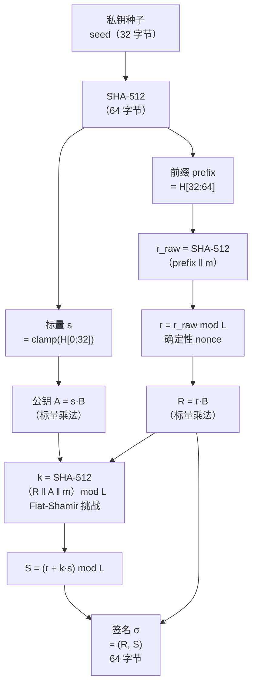
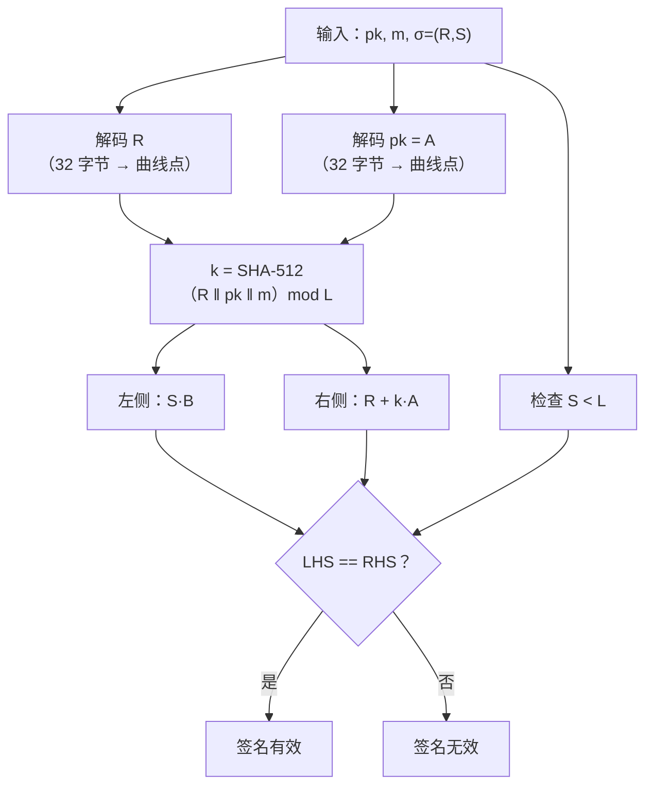

# 密码学（28）· EdDSA 与 Ed25519

> [!abstract] TL;DR
> - **EdDSA**（Edwards-curve Digital Signature Algorithm）由 Bernstein 等人提出，基于**扭曲爱德华曲线**，是当前最推荐的数字签名方案。
> - 最大创新：**确定性 nonce**——签名所需的随机数 `r` 由私钥派生的"前缀"与消息哈希决定，**完全不依赖外部随机源**，从根本上免疫 ECDSA 的 nonce 重用/弱随机灾难（见 [[54.ECDSA-nonce攻击]]）。
> - **Ed25519** 是 EdDSA 在 edwards25519 曲线上的实例：128 位安全性、签名/验证极快、抗侧信道、点编码简洁，已成 OpenSSH、TLS 1.3、Signal 等协议的首选签名算法。
> - 相对 [[27.ECDSA签名]]：无需 RNG、无模逆、实现更简单且不易出错，主动规避了最危险的误用场景。

---

## 概述与定位

### 背景与历史

2011 年，Daniel J. Bernstein、Niels Duif、Tanja Lange、Peter Schwabe、Bo-Yin Yang 在论文《High-speed high-security signatures》中发表了 **Ed25519**——EdDSA 在 edwards25519 曲线上的具体实现。其设计目标可以归纳为四点：

1. **确定性**：签名结果完全由私钥与消息决定，消除外部随机数依赖。
2. **安全性**：128 位安全级别，抵抗离散对数、侧信道与实现错误。
3. **高速**：在 64 位 x86 上签名约 87000 次/秒、验证约 20000 次/秒（2011 年基准，现代硬件更快）。
4. **简洁**：点编码、签名格式、密钥格式均高度规范化，减少歧义。

EdDSA 本身是一族方案，曲线参数可替换；Ed25519 是目前最广泛部署的实例，Ed448（Goldilocks 曲线）提供更高安全性（224 位）。

### 与 ECDSA 的核心区别

| 维度 | [[27.ECDSA签名]] | EdDSA / Ed25519 |
|---|---|---|
| nonce 来源 | 需要外部 CSPRNG，弱随机=私钥泄露 | 确定性 `r = H(prefix ‖ m)`，无需随机数 |
| 曲线类型 | Weierstrass 曲线（如 secp256k1、P-256） | 扭曲爱德华曲线（完整加法，无例外点） |
| 点加公式 | 需处理无穷点等例外情形 | 统一公式，永不需要例外处理 |
| 验证复杂度 | 需模逆 | 不需模逆（仅乘法与加法） |
| 抗侧信道 | 难（需主动防护） | 天然更好（统一公式、固定时间） |
| 实现易错性 | 高（nonce 重用= 灾难） | 低（确定性杜绝主要误用） |
| 标准化 | ANSI X9.62、FIPS 186 | RFC 8032（Ed25519/Ed448） |

---

## 原理与机制

### 扭曲爱德华曲线

Ed25519 使用 **edwards25519**，定义在有限域 `GF(p)`，`p = 2^255 - 19`：

```
edwards25519 方程：
  -x² + y² = 1 + d·x²·y²
  d = -121665/121666  （mod p）
```

这是一条**扭曲爱德华曲线**（Twisted Edwards curve），参数形如 `a·x² + y² = 1 + d·x²·y²`，其中 `a = -1`。

相对 Weierstrass 曲线（[[25.椭圆曲线密码学基础]] 介绍的标准形式），扭曲爱德华曲线有两个关键性质：

**1. 完整加法公式（Complete addition law）**

两点相加公式：

```
设 P₁ = (x₁, y₁)，P₂ = (x₂, y₂)，则 P₁ + P₂ = (x₃, y₃)：

令 A = x₁·x₂，  B = y₁·y₂
   C = d·A·B·x₁·y₂·x₂·y₁ 的中间项，即 d·(x₁·x₂·y₁·y₂)

x₃ = (x₁·y₂ + y₁·x₂) / (1 + d·x₁·x₂·y₁·y₂)
y₃ = (y₁·y₂ + x₁·x₂) / (1 - d·x₁·x₂·y₁·y₂)
```

这个公式对所有点（包括单位元、自加、结果为单位元）都成立，**无例外情形**。实现时不需要分支，天然抗侧信道。

**2. edwards25519 与 Curve25519 双有理等价**

Curve25519 是 Montgomery 曲线 `v² = u³ + 486662·u² + u`，用于 [[26.ECDH密钥交换]]（X25519）。edwards25519 与 Curve25519 之间存在**双有理等价映射**，两者本质同构，但代数形式不同：

- Curve25519（Montgomery 形式）：标量乘法更快，适合 DH。
- edwards25519（扭曲爱德华形式）：统一加法公式，适合签名。

这种双有理等价确保两者共享相同的离散对数安全性，同时各自在用途上发挥形式优势。

### 曲线参数（edwards25519 标准参数）

```
域：p = 2^255 - 19
  ≈ 5.789×10^76（约 256 位素数）

基点 B = (Bx, By)：
  By = 4/5 mod p（固定 y 坐标，x 取正号）
  Bx ≈ 151122213495354007725011514095885315114540126930418572446576 3111 ...

子群阶 L（B 的阶）：
  L = 2^252 + 27742317777372353535851937790883648493
  L 是质数，|E(GF(p))| = 8·L（余因子 h = 8）

安全级别：128 位（针对通用离散对数算法）
```

余因子 `h = 8` 意味着曲线上存在 8 阶小子群，实现时需注意**小子群攻击**（在验证时用 `8·S·B == 8·R + 8·H(R,A,m)·A` 或验证 `S < L` 等方式防范）。

### EdDSA 的确定性 nonce：消灭随机数依赖

这是 EdDSA 最重要的安全设计。[[27.ECDSA签名]] 中，签名依赖随机数 `k`，一旦 `k` 重用或可预测，私钥立即泄露（见 [[54.ECDSA-nonce攻击]] 中的完整攻击分析）。

EdDSA 的解法：**从私钥本身派生签名所需的随机性**，使 nonce `r` 在数学上确定，却又足够伪随机：

```
密钥生成：
  1. 选取随机种子 seed（32 字节，真随机，只需一次）
  2. 计算 H(seed) = (h₀ ‖ h₁ ‖ … ‖ h₆₃)（SHA-512，64 字节）
  3. 标量 s：取低 32 字节，进行 clamp 操作：
       s = h[0..31]，设 h[0] &= 248，h[31] &= 63，h[31] |= 64
     （clamp 确保 s 是 8 的倍数且最高位清零，消除小子群和侧信道风险）
  4. 前缀 prefix = h[32..63]（高 32 字节）
  5. 公钥 A = s·B（标量乘法，B 为基点）

签名（消息 m）：
  1. r = H(prefix ‖ m) mod L   ← 确定性 nonce！
  2. R = r·B                    ← nonce 对应的公开点
  3. k = H(R ‖ A ‖ m) mod L   ← Fiat-Shamir 挑战
  4. S = (r + k·s) mod L       ← 签名标量
  输出签名 σ = (R, S)，共 64 字节
```

> [!note] 为什么 `r = H(prefix ‖ m)` 是安全的？
> - `prefix` 是从私钥种子派生的秘密值，外部不可知。
> - 对不同消息 `m`，`r` 总是不同（哈希的抗碰撞性保证）。
> - 对相同消息 `m`，`r` 总是相同（确定性）——签名结果可重现，便于测试与审计。
> - 攻击者无法在不知道 `prefix` 的情况下预测 `r`，即使能观察大量签名。

这一设计从根本上消除了 ECDSA 中"一次 RNG 失败 = 私钥泄露"的灾难性场景。

### 验证方程的推导

验证条件为：

```
S·B == R + H(R, A, m)·A
```

代入 `S = r + k·s`、`k = H(R, A, m)`、`A = s·B`、`R = r·B`：

```
S·B = (r + k·s)·B = r·B + k·s·B = R + k·A = R + H(R, A, m)·A  ✓
```

验证时，验证方不需要知道 `r` 或 `s`，只需计算一次哈希和两次标量乘法（或一次双基点标量乘法）。

---

## 算法流程与结构详解

### 密钥生成

```
KeyGen():
  seed  ← random_bytes(32)         // 唯一需要随机数的地方
  H64   ← SHA-512(seed)            // 64 字节
  s     ← clamp(H64[0:32])         // 标量（私钥核心）
  prefix← H64[32:64]               // 签名时的确定性来源
  A     ← s · B                    // 公钥（点 → 32 字节压缩编码）
  sk    ← seed                     // 私钥 = 原始种子（32 字节）
  pk    ← encode(A)                // 公钥（32 字节）
  return (sk, pk)

clamp(b[32]):
  b[0]  &= 0xF8   // 清低 3 位（确保 s 是 8 的倍数，消除小子群）
  b[31] &= 0x7F   // 清最高位
  b[31] |= 0x40   // 设第 254 位（确保 s ≥ 2^254，固定最高有效位）
  return b 解释为小端 256 位整数
```

### 签名

```
Sign(sk, m):
  H64   ← SHA-512(sk)
  s     ← clamp(H64[0:32])
  prefix← H64[32:64]

  r_raw ← SHA-512(prefix ‖ m)     // 64 字节
  r     ← r_raw mod L              // 标量 nonce
  R     ← r · B                    // 点
  R_enc ← encode(R)                // 32 字节

  A     ← s · B                    // 公钥点（也可从 pk 直接读）
  A_enc ← encode(A)

  k     ← SHA-512(R_enc ‖ A_enc ‖ m) mod L   // 挑战
  S     ← (r + k · s) mod L        // 签名标量

  return R_enc ‖ little_endian(S, 32)  // 64 字节签名
```

### 验证

```
Verify(pk, m, σ):
  R_enc ‖ S_bytes ← σ              // 各 32 字节
  R     ← decode(R_enc)            // 解码为曲线点，若失败 → 拒绝
  S     ← from_little_endian(S_bytes)
  if S >= L: return INVALID        // S 必须 < 子群阶
  A     ← decode(pk)               // 解码公钥点

  k     ← SHA-512(R_enc ‖ pk ‖ m) mod L

  // 验证方程：S·B == R + k·A
  lhs   ← S · B
  rhs   ← R + k · A
  return lhs == rhs
```

> [!note] 批验证优化
> 同时验证 N 个签名时，可将 N 个验证方程线性组合：`(ΣaᵢSᵢ)·B == Σaᵢ(Rᵢ + kᵢ·Aᵢ)`（aᵢ 为随机系数），只需一次多标量乘法，比逐一验证快约 2 倍。TLS 1.3、libsodium 均支持批验证。

### 点编码（32 字节压缩格式）

edwards25519 的点 `(x, y)` 编码为 32 字节：

```
编码：
  bytes ← little_endian(y, 32)    // y 坐标小端存储
  bytes[31] |= (x & 1) << 7       // 最高字节最高位存 x 的奇偶性

解码：
  y     ← bytes & 0x7FFF...FF     // 还原 y（清除符号位）
  x_sign← bytes[31] >> 7          // x 的奇偶性
  x²    ← (y² - 1) / (d·y² + 1)  // 由曲线方程解出 x²
  x     ← sqrt(x²)               // 取模平方根
  若 x mod 2 ≠ x_sign，则 x ← p - x
```

这种编码比 Weierstrass 曲线的压缩格式（`02/03 ‖ x`）更整洁——`y` 坐标直接存储，无需前缀字节，且奇偶位塞进已有字节的最高位，浪费零字节。

### Mermaid：签名流程



### Mermaid：验证流程



---

## Ed25519 与 Ed448

### Ed25519（RFC 8032 §5.1）

| 参数 | 值 |
|---|---|
| 曲线 | edwards25519 |
| 域 | `GF(2^255 - 19)` |
| 哈希 | SHA-512 |
| 安全级别 | 128 位 |
| 私钥大小 | 32 字节（种子） |
| 公钥大小 | 32 字节 |
| 签名大小 | 64 字节 |
| 子群阶 L | `2^252 + 27742317...`（质数） |
| 余因子 h | 8 |

Ed25519 是目前部署最广的 EdDSA 变体，适用于绝大多数场景。

### Ed448（RFC 8032 §5.2，"Goldilocks"）

| 参数 | 值 |
|---|---|
| 曲线 | edwards448（Goldilocks 曲线） |
| 域 | `GF(2^448 - 2^224 - 1)` |
| 哈希 | SHAKE256（context 模式） |
| 安全级别 | 224 位 |
| 私钥大小 | 57 字节 |
| 公钥大小 | 57 字节 |
| 签名大小 | 114 字节 |
| 余因子 h | 4 |

Ed448 适合对安全级别要求更高、需要抵抗后量子过渡期某些威胁的场景，但速度略慢于 Ed25519，应用也相对较少。

### 变体：Ed25519ph、Ed25519ctx

RFC 8032 还定义了：
- **Ed25519ph**：消息先用 SHA-512 预哈希（ph = "pre-hash"），适合大消息流式签名。
- **Ed25519ctx**：签名包含上下文字节串，可区分不同协议中的签名以防混淆攻击。

---

## 与 ECDSA 对比详解

### 核心差异

[[27.ECDSA签名]] 需要在每次签名时产生随机 nonce `k`，签名方程为：

```
r = (k·G).x mod n
s = k⁻¹ · (H(m) + r·privkey) mod n
```

任何 `k` 的弱点都直接导致私钥可恢复。[[54.ECDSA-nonce攻击]] 详述了以下灾难：

- **nonce 重用**：两条消息用同一 `k`，联立方程即可解出私钥（PS3 事件、比特币早期漏洞）。
- **nonce 偏置**：`k` 的最高若干位可预测时，格攻击（Lattice attack）可从数十到数百个签名中恢复私钥。
- **弱 RNG**：Dual_EC_DRBG 后门（NSA 争议）、Android SecureRandom 漏洞均属此类。

EdDSA 用 `r = H(prefix ‖ m) mod L` 完全切断了对 RNG 的依赖：

```
对比示意：

ECDSA：
  签名需要 → [外部 CSPRNG] → k → 签名
  RNG 失败 → k 泄露 / 可预测 → 私钥恢复

EdDSA：
  签名只需 → [私钥 seed + 消息 m] → r（确定性）→ 签名
  无外部随机数依赖，RNG 质量不影响签名安全
```

### 性能对比（参考基准，64 位 x86）

| 操作 | ECDSA/secp256k1 | Ed25519 |
|---|---|---|
| 密钥生成 | ~50 μs | ~15 μs |
| 签名 | ~70 μs | ~20 μs |
| 验证 | ~180 μs | ~60 μs |
| 批验证（每签名） | 不标准支持 | ~25 μs |

> [!warning] 示例输出为示意
> 以上数字仅为量级参考，实际性能因实现（libsodium、BoringSSL、OpenSSL）、硬件（AVX2、ARMv8）差异显著。

---

## 代码与示例

### OpenSSL（命令行）

```bash
# 生成 Ed25519 私钥
openssl genpkey -algorithm ED25519 -out ed_private.pem

# 提取公钥
openssl pkey -in ed_private.pem -pubout -out ed_public.pem

# 签名（OpenSSL 3.x，Ed25519 走 one-shot 原始消息签名）
openssl pkeyutl -sign -inkey ed_private.pem -rawin -in message.txt -out sig.bin

# 验证
openssl pkeyutl -verify -pubin -inkey ed_public.pem -rawin -in message.txt -sigfile sig.bin
```

> [!warning] 示例输出为示意
> Ed25519 内部已固定使用 SHA-512，**不能也不需要**通过 `dgst -sha512` 指定哈希；应使用 `pkeyutl -rawin` 传入原始消息，由 OpenSSL EVP 层完整处理签名流程。具体参数以 OpenSSL 版本为准。

### libsodium（C，推荐）

```c
#include <sodium.h>

// 密钥生成
unsigned char pk[crypto_sign_PUBLICKEYBYTES];   // 32 字节
unsigned char sk[crypto_sign_SECRETKEYBYTES];   // 64 字节（seed + pk）
crypto_sign_keypair(pk, sk);

// 签名
unsigned char sig[crypto_sign_BYTES];           // 64 字节
unsigned long long siglen;
crypto_sign_detached(sig, &siglen, msg, msglen, sk);

// 验证（成功返回 0，失败返回 -1）
int result = crypto_sign_verify_detached(sig, msg, msglen, pk);
```

### Python（cryptography 库）

```python
from cryptography.hazmat.primitives.asymmetric.ed25519 import Ed25519PrivateKey

# 密钥生成
private_key = Ed25519PrivateKey.generate()
public_key = private_key.public_key()

# 签名
message = b"Hello, EdDSA!"
signature = private_key.sign(message)  # 64 字节，无需指定哈希（Ed25519 内部处理）

# 验证（失败抛出 InvalidSignature）
from cryptography.exceptions import InvalidSignature
try:
    public_key.verify(signature, message)
    print("签名有效")
except InvalidSignature:
    print("签名无效")
```

---

## 应用场景

### 已广泛部署

| 系统 / 协议 | EdDSA 变体 | 用途 |
|---|---|---|
| **OpenSSH** | Ed25519 | SSH 主机密钥与用户密钥（`ssh-keygen -t ed25519`） |
| **TLS 1.3** | Ed25519、Ed448 | 握手签名（RFC 8446） |
| **Signal 协议** | Ed25519（转换为 X25519） | 身份密钥签名与密钥协商 |
| **WireGuard** | Curve25519（DH），内部 Ed25519 | 认证与密钥派生 |
| **Tor** | Ed25519 | 洋葱服务身份、中继签名（v3 地址） |
| **以太坊 2.0 / Beacon Chain** | BLS（衍生）、Ed25519 辅助 | 验证者身份 |
| **Git（sigstore/gitsign）** | Ed25519 | 提交签名 |
| **DNSSEC（草案）** | Ed25519（RFC 8080）| DNS 记录签名 |
| **PGP / GPG** | Ed25519（RFC 9580 v6） | 邮件/文件签名 |

### SSH 实战说明

```bash
# 生成 Ed25519 SSH 密钥（现代推荐，替代 RSA/ECDSA）
ssh-keygen -t ed25519 -C "user@host"

# 结果：
# ~/.ssh/id_ed25519      （私钥 seed，32 字节，PEM 格式）
# ~/.ssh/id_ed25519.pub  （公钥，32 字节，base64）
```

Ed25519 SSH 密钥比 RSA-4096 小 10 倍以上，验证速度快数倍，且不存在密钥长度选择错误的问题。

---

## 安全性与正确使用

### 安全性基础

Ed25519 的安全性建立在以下基础上：

1. **ECDLP（椭圆曲线离散对数问题）**：已知 `A = s·B`，求 `s`。目前最快的已知算法（Pollard rho）复杂度为 `O(√L) ≈ 2^126`，等效 126 位安全。
2. **哈希函数碰撞抵抗**：SHA-512 的 128 位碰撞抗性支撑了挑战 `k = H(R‖A‖m)` 的不可伪造性。
3. **Schnorr 签名安全证明**：EdDSA 本质是 Schnorr 签名在爱德华曲线上的实例，在随机预言机模型下可证明 EUF-CMA 安全。

### 已知注意事项与正确使用

> [!warning] 签名可塑性（Signature Malleability）
> Ed25519 签名不是唯一的：给定有效签名 `(R, S)`，理论上可构造 `(R, S + L)` 等形式的"不同"签名（但同样有效）。标准要求实现拒绝 `S >= L` 的签名（cofactor 检查），但部分早期实现未严格执行。**不要将签名字节本身用作唯一 ID**；需要唯一性时应对消息内容哈希。

> [!warning] 余因子攻击与 cofactor 验证
> edwards25519 余因子 `h = 8`，曲线上存在 8 阶小子群。严格的实现需在验证时使用 cofactor 形式 `8·S·B == 8·R + 8·k·A`，或检查点的阶。特别是在多方计算（MPC）、聚合签名等高级协议中，这一点不可忽视。

> [!tip] 私钥文件保护
> Ed25519 私钥本质上是 32 字节随机种子，从中可派生公钥和所有签名能力。**必须以高权限保护私钥文件**（`chmod 600`），在服务器上使用 HSM 或密钥管理服务存储。

> [!tip] 上下文分离：Ed25519ctx
> 若同一密钥对在多个协议或应用中使用，应采用 **Ed25519ctx** 变体，在签名中包含协议标识符上下文字节，防止跨协议签名混淆攻击。TLS 1.3、SSH 等均在协议层做了域分离，无需额外处理。

> [!tip] 批验证提升吞吐
> 当需要验证大量签名（如区块链节点、证书透明度日志）时，启用批验证可将单签名验证成本降低约 50%。libsodium 提供 `crypto_sign_ed25519_verify_batch`，使用前确认实现已修复随机化系数生成。

### 选型建议

| 场景 | 推荐 |
|---|---|
| 通用数字签名（新项目） | **Ed25519**（RFC 8032） |
| 需要更高安全级别 | **Ed448** |
| 需要与现有 ECDSA 基础设施兼容 | ECDSA/P-256（但务必用 CSPRNG + RFC 6979 确定性 k） |
| 受国密合规约束 | SM2（基于 ECC，见 [[47.SM2公钥密码]]） |
| 后量子场景 | Dilithium/ML-DSA（见 [[52.Dilithium-ML-DSA]]） |

**一条原则**：新系统优先选 Ed25519，除非有明确的合规或兼容性约束。

---

## 小结

EdDSA 与 Ed25519 代表了现代数字签名的设计最佳实践：

- **扭曲爱德华曲线**提供统一加法公式，消除点加边界情形，天然抗侧信道；
- **确定性 nonce `r = H(prefix ‖ m)`** 从根本上消除了 [[54.ECDSA-nonce攻击]] 所揭示的 nonce 重用/弱随机灾难，这是相较于 [[27.ECDSA签名]] 最关键的安全升级；
- 签名流程简洁（密钥生成一次 SHA-512 + clamp，签名两次 SHA-512 + 两次标量乘法），实现难度低，误用空间小；
- **验证方程 `S·B == R + H(R,A,m)·A`** 直接来自 Schnorr 签名框架，在随机预言机模型下可证 EUF-CMA 安全；
- 128 位安全（Ed25519）覆盖绝大多数场景，224 位安全（Ed448）满足高安全需求；
- 已被 OpenSSH、TLS 1.3、Signal、WireGuard、Tor 等主流系统广泛采用，是当前最推荐的非对称签名算法。

与 [[25.椭圆曲线密码学基础]] 的点运算、[[26.ECDH密钥交换]] 的 Curve25519 密钥交换一起，Ed25519 构成了"25519 家族"的签名支柱，三者共享相同的数学基础，各司其职，协同支撑现代密码协议。

---

## 相关阅读

- [[25.椭圆曲线密码学基础]] — ECC 数学基础：点加、标量乘、曲线参数
- [[26.ECDH密钥交换]] — Curve25519 与 X25519：EdDSA 的姊妹方案
- [[27.ECDSA签名]] — EdDSA 的前身，理解对比必读
- [[54.ECDSA-nonce攻击]] — nonce 重用与偏置攻击：EdDSA 解决的核心问题
- [[47.SM2公钥密码]] — 国密 SM2 签名（同为 ECC 签名，中国合规场景）
- [[52.Dilithium-ML-DSA]] — 后量子签名：EdDSA 的量子时代接班人
- [[43.随机数与熵]] — 为什么 ECDSA 依赖 RNG 而 EdDSA 不依赖
- RFC 8032 — Ed25519 与 Ed448 完整规范
- Bernstein 等，"High-speed high-security signatures"（2011）

---

⬅️ 上一篇 [[27.ECDSA签名]] ｜ 🏠 [[00.密码学总览]] ｜ 下一篇 [[29.哈希函数原理]] ➡️
