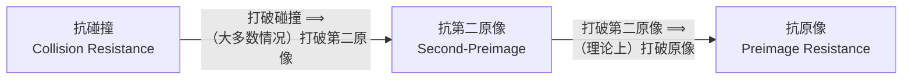
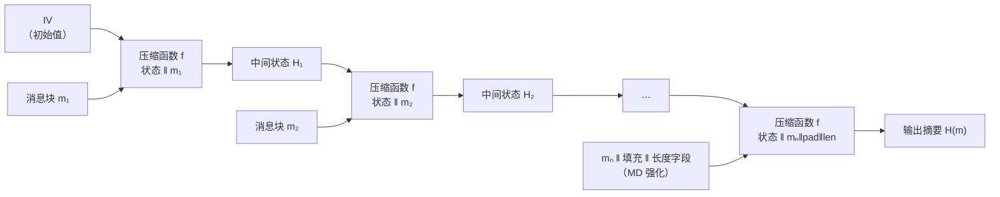
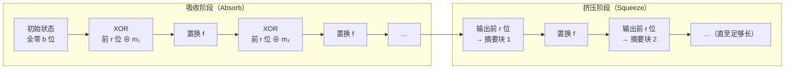
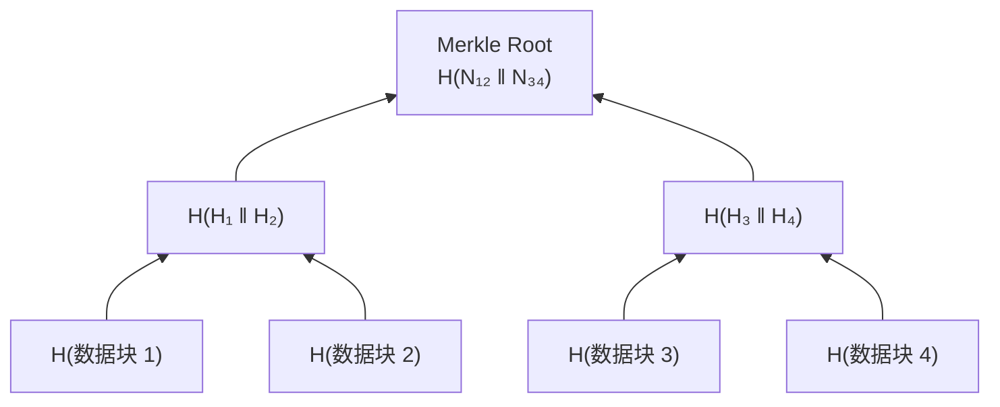

# 密码学（29）· 哈希函数原理

> [!abstract] TL;DR
> - **密码学哈希函数**将任意长度输入映射到固定长度摘要，必须满足三大安全性质：**抗原像（preimage resistance）、抗第二原像（second-preimage resistance）、抗碰撞（collision resistance）**；三者强弱关系：抗碰撞 ⟹ 抗第二原像（大致上），抗碰撞最难攻破。
> - **生日攻击**决定了碰撞复杂度为 `2^(n/2)`，故 256 位输出只有 128 位"抗碰撞"安全级别——选输出长度时务必按攻击目标倍算。
> - **Merkle-Damgård（MD）结构**：IV + 压缩函数迭代 + 长度填充（MD 强化），MD5 / SHA-1 / SHA-2 均采用此结构，并因此继承了**长度扩展攻击**漏洞。
> - **海绵结构（Sponge）**：吸收阶段（absorb）+ 挤压阶段（squeeze），容量 `c` 决定安全级别，SHA-3/Keccak 采用此结构，天然免疫长度扩展攻击（见 [[33.SHA-3与Keccak]]）。
> - **长度扩展攻击**：已知 `H(m)` 与 `len(m)` 可在不知 `m` 的情况下计算 `H(m ‖ pad ‖ m')`，因此**裸哈希不能当 MAC**；正确做法是用 [[36.HMAC]]。
> - 实践选型：完整性/签名用 SHA-256 或 SHA-3-256；抗碰撞场景需 ≥256 位输出；禁止用 MD5/SHA-1 做任何安全用途。

---

## 概述与定位

### 什么是密码学哈希函数

**哈希函数（Hash Function / 散列函数）**将任意长度的消息 `m` 映射到固定长度的**摘要（digest）**：

```
H : {0,1}* → {0,1}^n
```

普通哈希（如数据结构里的散列）只追求分布均匀、碰撞率低，**密码学哈希函数**还额外要求：攻击者在计算上无法逆推、无法找到碰撞。这一层"计算不可行"的安全性质，才是密码学哈希区别于普通哈希的根本。

哈希函数是密码学体系的"基石工具"：数字签名先哈希再签（签名短且快，见 [[27.ECDSA签名]]）；HMAC 在哈希外套一层密钥（见 [[36.HMAC]]）；Merkle 树/区块链整个建构在哈希链上；口令存储用带盐哈希或 KDF。

### 哈希函数在密码学中的位置

| 用途 | 依赖性质 | 典型方案 |
|---|---|---|
| 消息完整性校验 | 抗第二原像 | SHA-256 摘要随消息传输 |
| 数字签名（先哈希）| 抗碰撞 | SHA-256 + RSA/ECDSA |
| MAC（消息认证码）| 抗第二原像 + 密钥 | HMAC-SHA-256 |
| 口令存储 | 抗原像 + KDF 慢性 | bcrypt / Argon2 |
| 承诺方案（commitment）| 抗原像 + 抗碰撞 | SHA-256 |
| Merkle 树 / 区块链 | 抗第二原像 + 抗碰撞 | SHA-256 |
| 伪随机数派生（PRF）| 单向性 | HKDF、HMAC |

---

## 原理与机制

### 三大安全性质

密码学哈希函数需要满足三个层次的安全性质，强度逐步递增。

#### 性质一：抗原像（Preimage Resistance）

> 给定摘要 `y`，计算上不可能找到 `x` 使得 `H(x) = y`。

这也称**单向性（one-wayness）**：函数正向计算容易（微秒级），反向求原像在计算上不可行（暴力搜索需 `2^n` 次）。

```
给定 y = H(x)，找到 x'   使得  H(x') = y   ← 抗原像：这很难
```

**攻击代价**：暴力枚举 `2^n`。

#### 性质二：抗第二原像（Second-Preimage Resistance）

> 给定消息 `m₁`，计算上不可能找到不同的 `m₂`（`m₂ ≠ m₁`）使得 `H(m₁) = H(m₂)`。

与抗原像的区别：**原始消息 `m₁` 已知**，攻击者要找另一个碰撞的消息来替换它——这是对消息完整性的直接威胁（篡改后摘要不变）。

```
给定 m₁，找到 m₂ ≠ m₁  使得  H(m₁) = H(m₂)   ← 抗第二原像：这很难
```

**攻击代价**：暴力枚举约 `2^n`（和抗原像同阶）。

#### 性质三：抗碰撞（Collision Resistance）

> 计算上不可能找到**任意一对**不同消息 `m₁ ≠ m₂` 使得 `H(m₁) = H(m₂)`。

注意：这里攻击者可以**自由选择两条消息**，不需要固定其中一条——比抗第二原像更宽松的攻击条件，因此**最难满足**。数字签名安全依赖此性质：若攻击者能找到碰撞 `(m₁, m₂)` 使 `H(m₁) = H(m₂)`，则对 `m₁` 的签名可直接转用于 `m₂`。

```
找到 m₁ ≠ m₂  使得  H(m₁) = H(m₂)   ← 抗碰撞：这最难
```

**攻击代价**：生日攻击（Birthday Attack）使代价降至 `2^(n/2)`，详见下节。

#### 三者强弱关系



> [!note] 注意方向
> 蕴含关系从**强到弱**：打破抗碰撞通常（但非严格）意味着打破抗第二原像，但反向未必成立。抗原像的条件最宽松（只要找不到逆像），抗碰撞最严格（自由选消息对）。

---

### 生日攻击（Birthday Attack）

**生日悖论**：若随机抽取约 `2^(n/2)` 个 `n` 位的哈希值，以高概率（≥50%）存在两个相同的值——这是概率论中"生日问题"在密码学中的直接应用。

**攻击思路**：

1. 攻击者随机生成大量消息 `{m₁, m₂, …, mₖ}`；
2. 计算各自摘要 `{H(m₁), H(m₂), …, H(mₖ)}`；
3. 当 `k ≈ 2^(n/2)` 时，以约 50% 概率找到一对碰撞 `H(mᵢ) = H(mⱼ)`。

**具体数字（n = 256，即 SHA-256）**：

| 性质 | 攻击代价 | 实际意义 |
|---|---|---|
| 抗原像 | `2^256` | 宇宙热寂也不够 |
| 抗第二原像 | `2^256`（近似）| 同上 |
| 抗碰撞（生日攻击）| **`2^128`** | 128 位"抗碰撞"安全强度 |

> [!warning] 关键结论
> **256 位输出的哈希，其抗碰撞强度只有 128 位**。因此：
> - 若只需"抗原像"（如 MAC），128 位输出（MD5 的 128 位，排除其他弱点的话）对应 128 位强度；
> - 若需"抗碰撞"（如签名），则 256 位输出才提供 128 位抗碰撞强度；
> - 数字签名场景应选至少 256 位输出（SHA-256、SHA-3-256）。

---

### Merkle-Damgård 结构

**MD 结构**是 1979 年由 Ralph Merkle 和 Ivan Damgård 分别独立提出的迭代哈希框架，MD5、SHA-1、SHA-2 均基于此构建。

#### 核心组件

| 组件 | 说明 |
|---|---|
| IV（Initial Value）| 固定初始状态，由算法标准规定 |
| 压缩函数 `f`（Compression Function）| 核心：将当前状态 + 一个消息块 → 新状态，固定大小输入/输出 |
| 消息填充（Padding）| 将消息填充至块大小整数倍 |
| MD 强化（MD-strengthening）| 在末尾附加原消息**长度字段**，这是抵御若干攻击的关键 |

#### 结构流程



#### 伪代码

```
function MD_Hash(m):
    blocks = pad_and_split(m)    # 填充 + 附加长度字段，再分块
    state = IV                   # 初始化状态
    for block in blocks:
        state = f(state, block)  # 压缩函数迭代
    return state                 # 最终状态即摘要
```

#### MD 强化（Length Strengthening）的作用

若末尾**不附加长度字段**，攻击者可拼接任意后续块而不改变原始消息的"合法性"——长度扩展攻击（见下节）正是利用这一点。MD 结构通过在填充末尾嵌入 64 位（或 128 位）原始消息长度，使得"对已知摘要状态继续迭代"构造出的消息包含额外的长度信息，从而在语义层打破朴素的扩展。

> [!note] SHA-2 与 MD 结构
> SHA-256/384/512 均基于 MD 结构（不同的压缩函数和块大小），因此理论上均受长度扩展攻击影响——见 [[32.SHA-2]] 中的讨论。

---

### 海绵结构（Sponge Construction）

**海绵结构**是 Guido Bertoni 等人（Keccak 团队）2007 年提出的另一种哈希构造范式，SHA-3 的底层 Keccak 算法即采用此结构（见 [[33.SHA-3与Keccak]]）。

#### 核心参数

| 参数 | 含义 |
|---|---|
| `b = r + c` | 状态总宽度（Keccak 为 1600 位） |
| `r`（rate，速率）| 每轮吸收/挤压的位数，决定吞吐率 |
| `c`（capacity，容量）| 对外隐藏的内部容量，决定安全强度（`c/2` 位安全级别） |
| `f`（置换函数）| 固定宽度的置换（Keccak-f），不同于 MD 的压缩函数 |

#### 两个阶段

**吸收阶段（Absorb）**：将消息分成 `r` 位的块，每块与状态的前 `r` 位 XOR 后，经过置换函数 `f`；

**挤压阶段（Squeeze）**：吸收完成后，每次输出状态前 `r` 位，再经 `f`，直到得到足够长度的摘要。



#### 海绵 vs MD 结构对比

| 维度 | Merkle-Damgård | 海绵（Sponge） |
|---|---|---|
| 代表算法 | MD5、SHA-1、SHA-2 | SHA-3 (Keccak)、SHAKE |
| 内部状态宽度 | 等于输出长度 | 远大于输出长度（1600 位） |
| 安全强度由…决定 | 输出长度 `n`（原像 `2^n`，碰撞 `2^(n/2)`） | 容量 `c/2`（与输出长度解耦） |
| 可变长输出（XOF）| 不支持 | 天然支持（SHAKE128/256） |
| 长度扩展攻击 | 存在（MD 结构通病）| **天然免疫**（`c` 位对外隐藏） |
| 结构核心 | 压缩函数 `f: (n+r) → n` | 置换函数 `f: b → b` |

---

### 长度扩展攻击（Length Extension Attack）

#### 攻击原理

MD 结构输出的摘要 `H(m)` 本质上是**压缩函数迭代到末尾的内部状态**。如果攻击者知道 `H(m)` 与 `len(m)`，就能**以 `H(m)` 为起始状态，继续迭代**，在无需知道 `m` 本身的情况下构造：

```
H(m ‖ pad(m) ‖ m')
```

其中 `pad(m)` 是 MD 结构对 `m` 施加的填充（包含长度字段），`m'` 是攻击者附加的任意消息。

#### 攻击场景

假设服务端用 `H(secret ‖ message)` 做朴素 MAC 验证请求合法性，攻击者：

1. 不知道 `secret`，但能观察到 `H(secret ‖ message)` 及 `message` 的长度；
2. 利用长度扩展攻击，在无需 `secret` 的情况下，构造 `H(secret ‖ message ‖ pad ‖ extra_data)` 的合法摘要；
3. 向服务端发送 `(message ‖ pad ‖ extra_data, 伪造摘要)`，服务端验证通过。

这一攻击已在 Flickr API、Vimeo 等实际系统中被利用（见 [[60.对称密码攻击]] 中的详细讨论）。

#### 根本原因与修复

| 问题根源 | 修复方案 |
|---|---|
| MD 结构状态直接作为输出，外部可见 | 海绵结构的容量 `c` 对外隐藏 |
| 裸 `H(k ‖ m)` 构造的 MAC | 使用 **[[36.HMAC]]**（内外双层嵌套） |
| 裸 `H(m ‖ k)` 也不安全（可能有其他弱点）| 统一用 HMAC，不要自创 MAC 构造 |

> [!warning] 核心结论
> **任何基于 MD 结构的哈希函数（MD5、SHA-1、SHA-2），都不能直接用作 MAC。** 必须用 HMAC 或基于海绵结构的方案（KMAC）。

---

## 算法流程 / 结构详解

### 压缩函数的典型设计

MD 结构的核心是压缩函数 `f(state, block) → new_state`。其设计通常借鉴分组密码：

- **Davies-Meyer 构造**（SHA-256 采用）：`f(H, m) = E_m(H) XOR H`，其中 `E_m` 是以消息块为密钥的分组密码加密；
- **Matyas-Meyer-Oseas / Miyaguchi-Preneel**：其他变体，调整加密函数输入方式。

这些构造把压缩函数的安全性归约到底层分组密码（如 SHA-256 用 AES 类似的 AES-like 置换），在理想密码模型下可以形式化证明安全。

### 消息填充规则

以 SHA-256（块大小 512 位，消息长度字段 64 位）为例：

```
原始消息 m（长度 L 位）
+---+----+-------+----------+
| m | 1  | 0×k   | len(m)   |
+---+----+-------+----------+
        ↑ 一个 1 位
            ↑ 若干 0 填充，使总长 ≡ 448 (mod 512)
                   ↑ 64 位大端序 L
```

填充后总长是 512 的倍数，保证整除分块。

---

## 安全性与正确使用

### 参数选择

| 安全需求 | 推荐算法 | 输出位数 | 安全强度 |
|---|---|---|---|
| 完整性校验、一般签名前哈希 | SHA-256 | 256 位 | 128 位（抗碰撞） |
| 高安全需求（政府/长期文档）| SHA-384 / SHA-512 | 384/512 位 | 192/256 位 |
| 海绵结构，免长度扩展 | SHA-3-256 | 256 位 | 128 位 |
| 可变长输出（XOF）| SHAKE128 / SHAKE256 | 任意 | 128/256 位 |
| 已破 / 禁止 | MD5 | 128 位 | 碰撞已实用化 |
| 已破 / 禁止 | SHA-1 | 160 位 | SHAttered 碰撞（2017）|

### 已知弱点与历史教训

**MD5（1992）**：
- 2004 年王小云等人发现实用碰撞算法；
- 2008 年攻击者利用 MD5 碰撞伪造 X.509 证书；
- 2012 年 Flame 恶意软件利用 MD5 碰撞伪造 Windows Update 签名；
- 结论：MD5 已死，任何安全用途均禁止使用（见 [[30.MD5]]）。

**SHA-1（1995）**：
- 2017 年 Google 宣布 SHAttered 攻击，实际构造出碰撞；
- 攻击代价约为 `2^63.1`，已低于 `2^80` 的理论安全阈；
- TLS、代码签名、Git 已废弃 SHA-1（见 [[31.SHA-1]]）。

**SHA-2（2001）**：
- 至今无实用碰撞攻击；
- 存在长度扩展攻击（见上节），但只影响裸 MAC 用法，正规协议都用 HMAC；
- 仍是业界主流（见 [[32.SHA-2]]）。

**SHA-3（2012 NIST 标准化）**：
- 海绵结构，天然免疫长度扩展；
- Keccak 置换至今无有效攻击；
- 与 SHA-2 并存，可用于对抗碰撞攻击有高要求或需 XOF 的场景。

### 正确使用原则

> [!tip] 正确使用清单
> 1. **签名场景**：用 SHA-256 或 SHA-3-256 对消息做摘要，再对摘要签名（见 [[27.ECDSA签名]]）。
> 2. **MAC 场景**：一律用 [[36.HMAC]]，禁止直接用 `H(key ‖ message)` 或 `H(message ‖ key)`。
> 3. **口令存储**：禁止用裸哈希；使用 bcrypt / scrypt / Argon2 等带盐慢哈希 KDF（见相关 KDF 篇）。
> 4. **禁止算法**：MD5、SHA-1 对任何新安全用途均已淘汰。
> 5. **输出长度**：需要抗碰撞强度 `s` 位，选输出长度 `≥ 2s` 位的算法（生日界限）。
> 6. **长度扩展防护**：若用 SHA-2，MAC 层用 HMAC；或直接改用 SHA-3（无此问题）。
> 7. **密码套件降级**：协议实现需拒绝降级至弱哈希（见 [[60.对称密码攻击]]）。

---

## 哈希的主要应用

### 数字签名（先哈希后签）

签名直接处理任意长消息效率极差，且数学安全性更难证明。实践中统一做法：

```
签名方：sig = Sign(sk, H(m))
验证方：Verify(pk, H(m), sig)
```

抗碰撞保证了"找不到 m' ≠ m 使 H(m') = H(m)"，从而签名不可伪造（无法用合法签名滥用于不同消息）。

### 完整性校验与 Merkle 树

**Merkle 树**将大量数据组织成二叉树，叶节点是各数据块的哈希，中间节点是其两个子节点哈希值拼接后的再哈希，根节点（Merkle Root）代表整棵树。



优点：只需信任根哈希即可**验证任意一个叶节点**——提供 `O(log n)` 大小的 Merkle Proof，无需传输全部数据。区块链（Bitcoin、Ethereum）将每个区块的交易哈希组织成 Merkle 树，块头只存根哈希，SPV 轻节点即依赖此机制。

### 承诺方案（Commitment Scheme）

密码协议中常见"先承诺后揭示"：

```
承诺阶段：c = H(value ‖ random_nonce)  → 发送 c（隐藏 value）
揭示阶段：发送 (value, nonce)           → 对方验证 H(value ‖ nonce) = c
```

- **绑定性（Binding）**：抗碰撞保证无法在承诺后改变 `value`；
- **隐藏性（Hiding）**：单向性保证 `c` 不泄露 `value`（需 nonce 保证熵）。

### 口令存储（Password Hashing）

> [!warning] 不要用裸哈希存口令
> `stored = H(password)` 面临彩虹表攻击（预计算库可秒查常见口令）。正确做法：`stored = KDF(password, salt, work_factor)`（bcrypt / Argon2 等），引入随机盐使彩虹表失效，引入时间/内存代价抵抗暴力破解。

---

## 小结

| 概念 | 要点 |
|---|---|
| 三大安全性质 | 抗原像 `2^n`、抗第二原像 `≈2^n`、抗碰撞 `2^(n/2)`（最弱） |
| 生日攻击 | 碰撞代价 `2^(n/2)`；256 位输出 = 128 位抗碰撞强度 |
| MD 结构 | IV + 压缩函数迭代 + MD 强化；MD5/SHA-1/SHA-2 用 |
| 海绵结构 | 吸收 + 挤压；容量 `c` 决定安全；SHA-3 用；天然免长度扩展 |
| 长度扩展攻击 | MD 结构通病；禁用裸 `H(k‖m)` 当 MAC；用 HMAC |
| 禁用算法 | MD5（碰撞已实用）、SHA-1（SHAttered 2017）|
| 推荐算法 | SHA-256（主流）、SHA-3-256（免长度扩展）、SHA-512（高强度）|

---

## 相关阅读

- [[30.MD5]]：MD 结构的第一个主流算法，碰撞史与结构详解
- [[31.SHA-1]]：SHA 家族早期版本，SHAttered 碰撞事件
- [[32.SHA-2]]：SHA-256/384/512 算法详解
- [[33.SHA-3与Keccak]]：海绵结构与 Keccak 置换详解
- [[36.HMAC]]：基于哈希的 MAC，正确防止长度扩展攻击
- [[27.ECDSA签名]]：签名中哈希函数的实际使用与 nonce 的重要性
- [[60.对称密码攻击]]：长度扩展攻击与 padding oracle 等实际攻击场景

---

⬅️ 上一篇 [[28.EdDSA与Ed25519]] ｜ 🏠 [[00.密码学总览]] ｜ 下一篇 [[30.MD5]] ➡️
