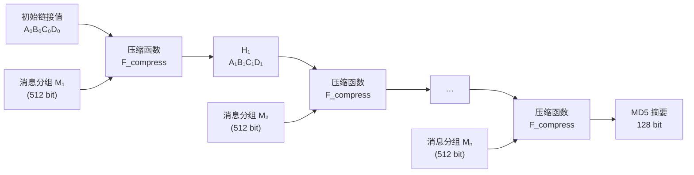
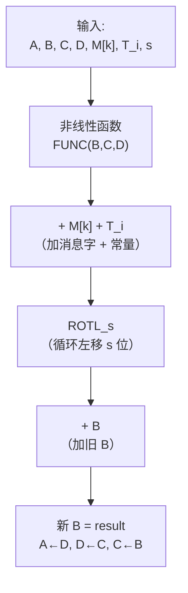
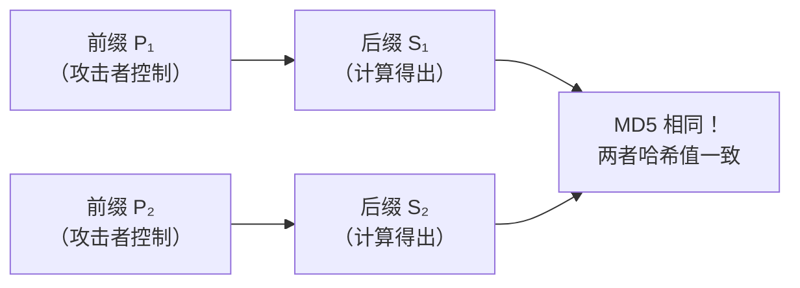
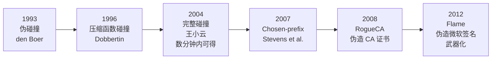
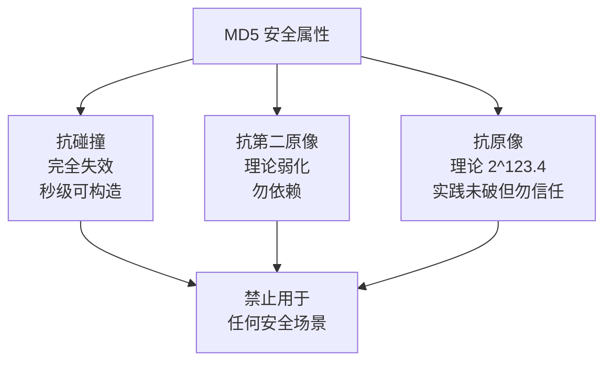

# 密码学（30）· MD5

> [!abstract] TL;DR
> - MD5（Message Digest 5，Rivest 1991）输出 **128 位（16 字节）**摘要，采用 **Merkle-Damgård** 结构，512 位分组，4 轮共 **64 步**。
> - 每步使用非线性函数（F/G/H/I）+ 基于 sin 的加常量 + 循环左移，作用于 4 个 32 位**链接变量 A/B/C/D**。
> - **2004 年王小云差分攻击宣告碰撞可在数分钟内构造**；此后 chosen-prefix 碰撞让伪造证书成为现实，Flame 恶意软件借此伪造微软签名。
> - **抗碰撞性已完全失效**。MD5 今日仅可用于非安全场景（校验和/去重）；凡涉及安全语义（签名、证书、完整性、HMAC），必须迁移至 SHA-256 或更强算法。

---

## 概述与定位

MD5 由 Ron Rivest 于 1991 年设计，发表为 RFC 1321，是 MD4 的改进版。设计目标是：快速、软件友好、产生 128 位固定长度摘要，用于数字签名和完整性验证。

在 1990 年代，MD5 广泛用于 TLS 证书签名、软件分发校验、口令存储（加盐 MD5）。然而到 2004 年前后，其核心安全属性——**抗碰撞性**——被证明完全不成立，至今 MD5 在所有安全场景下均属**禁止使用**。

与 [[29.哈希函数原理]] 中所述的三大性质对应：

| 安全属性 | MD5 现状 | 说明 |
|---|---|---|
| 抗碰撞（Collision Resistance） | **完全失效** | 2004 年起可在普通 PC 上秒级构造碰撞 |
| 抗第二原像（Second Preimage） | 理论弱化，实践仍难 | 理论复杂度 2^123.4，勿依赖 |
| 抗原像（Preimage Resistance） | 理论 2^123.4，实践未破 | 仍勿依赖，算法已不可信 |

> [!warning] 核心结论
> MD5 抗碰撞性完全丧失。即使其他两个属性尚未被完全打破，在已知碰撞攻击的背景下，依赖 MD5 的任何安全系统均需视为不可信。

---

## 原理与机制

### Merkle-Damgård 结构回顾

MD5 使用 [[29.哈希函数原理]] 中描述的 **Merkle-Damgård** 迭代结构：将任意长度消息分割为固定大小的分组，通过压缩函数 F_compress 迭代处理，前一轮的输出作为下一轮的链接值（chaining variable）输入。

```
消息 M → [填充] → M₁ ‖ M₂ ‖ … ‖ Mₙ
H₀ = IV（魔术初始值）
Hᵢ = F_compress(Hᵢ₋₁, Mᵢ)
输出 = Hₙ
```



### 消息填充

在哈希计算之前，消息必须被填充至长度 ≡ 448 (mod 512) 位：

1. **附加 1 位 "1"**：在消息末尾追加一个 1 位（二进制 `1`）。
2. **填充 0 位**：附加足够的 0 使总长度 ≡ 448 (mod 512)。
3. **附加 64 位原始长度**：将原始消息长度（mod 2⁶⁴）以小端序附加，使总长度 ≡ 0 (mod 512)。

填充后总长度必为 512 的整数倍，可分成 N 个 512 位分组，每个分组含 16 个 32 位字（小端序）。

### 初始链接变量（魔术常量）

MD5 使用 4 个 32 位**链接变量**，初始值为固定魔术常量（小端序表示）：

```
A₀ = 0x67452301
B₀ = 0xEFCDAB89
C₀ = 0x98BADCFE
D₀ = 0x10325476
```

这些常量与 MD4 相同，是精心挑选的"无特殊意义"初始值（nothing-up-my-sleeve numbers）——其 16 进制模式本身没有隐藏后门。

### 非线性函数

每轮使用一个不同的非线性逻辑函数，作用于三个 32 位变量：

| 轮次 | 函数 | 表达式（逐位） | 直观含义 |
|---|---|---|---|
| 第 1 轮 | F(B,C,D) | `(B & C) \| (~B & D)` | B 选择 C 或 D（多路复用） |
| 第 2 轮 | G(B,C,D) | `(B & D) \| (C & ~D)` | D 选择 B 或 C |
| 第 3 轮 | H(B,C,D) | `B ^ C ^ D` | 三者异或 |
| 第 4 轮 | I(B,C,D) | `C ^ (B \| ~D)` | 复杂非线性混合 |

### 加常量表（T 表）

MD5 使用 64 个预计算常量 T[1..64]，定义为：

```
T[i] = floor(2^32 × |sin(i)|)，i 为弧度
```

这是"可证明无意义"的 nothing-up-my-sleeve 常量——借助三角函数确保无法预先内嵌后门。64 个常量覆盖每一步操作，赋予每步独特的混淆作用。

---

## 算法流程与结构详解

### 单步操作（Step Function）

MD5 一共执行 64 步（每轮 16 步 × 4 轮）。每步操作作用于当前 4 个链接变量 A/B/C/D：

```
// 第 r 轮第 j 步（整体用 step = 0..63 编号）
FUNC = 本轮非线性函数（F/G/H/I）
k = 本步使用的消息字下标（0..15，每轮排列不同）
s = 本步循环左移量（固定表）
T_i = 本步加常量

temp = A + FUNC(B, C, D) + M[k] + T_i
A = D
D = C
C = B
B = B + ROTL(temp, s)   // ROTL 为 32 位循环左移
```

链接变量在每步后循环轮转：旧 D→新 A，旧 A（经变换）→新 B，旧 B→新 C，旧 C→新 D。



### 四轮结构

| 轮次 | 步骤 | 函数 | 消息字顺序 k | 移位量 s（每组 4 个循环） |
|---|---|---|---|---|
| 第 1 轮 | 步 1–16 | F(B,C,D) | 0,1,2,...,15（顺序） | 7,12,17,22（循环） |
| 第 2 轮 | 步 17–32 | G(B,C,D) | 1,6,11,0,5,10,15,4,9,14,3,8,13,2,7,12 | 5,9,14,20（循环） |
| 第 3 轮 | 步 33–48 | H(B,C,D) | 5,8,11,14,1,4,7,10,13,0,3,6,9,12,15,2 | 4,11,16,23（循环） |
| 第 4 轮 | 步 49–64 | I(B,C,D) | 0,7,14,5,12,3,10,1,8,15,6,13,4,11,2,9 | 6,10,15,21（循环） |

消息字下标的非顺序排列（尤其第 2–4 轮）是打乱输入顺序的设计，增加每轮对所有消息字的覆盖，提升扩散性。

### 分组处理后的链接值更新

每个 512 位分组处理完毕后，将本分组产生的 A/B/C/D 与进入该分组前的链接值相加（mod 2³²）：

```
A_new = A_prev + A
B_new = B_prev + B
C_new = C_prev + C
D_new = D_prev + D
```

这一"Davies-Meyer feed-forward"结构使得即使压缩函数被反转，也难以推回原始链接值——这是 Merkle-Damgård 安全性的关键。

### 伪代码（RFC 1321 风格）

```text
MD5(message):
  // 1. 填充
  padded = message ‖ 0x80 ‖ zeros ‖ length_64bit_LE
  // 填充后 len(padded) ≡ 0 (mod 512)

  // 2. 初始化链接变量
  (A, B, C, D) = (0x67452301, 0xEFCDAB89, 0x98BADCFE, 0x10325476)

  // 3. 分组迭代
  for each 512-bit block Mᵢ in padded:
    M[0..15] = Mᵢ 拆分为 16 个 32 位小端字
    (a, b, c, d) = (A, B, C, D)  // 保存本分组入口值

    // 第 1 轮：步 0–15，函数 F，移位 {7,12,17,22}
    for j in 0..15:
      f = F(b, c, d) + a + M[j] + T[j+1]
      (a, b, c, d) = (d, b + ROTL(f, s[j]), b, c)

    // 第 2 轮：步 16–31，函数 G，移位 {5,9,14,20}
    for j in 0..15:
      f = G(b, c, d) + a + M[(5*j+1) mod 16] + T[j+17]
      (a, b, c, d) = (d, b + ROTL(f, s[16+j]), b, c)

    // 第 3 轮：步 32–47，函数 H，移位 {4,11,16,23}
    for j in 0..15:
      f = H(b, c, d) + a + M[(3*j+5) mod 16] + T[j+33]
      (a, b, c, d) = (d, b + ROTL(f, s[32+j]), b, c)

    // 第 4 轮：步 48–63，函数 I，移位 {6,10,15,21}
    for j in 0..15:
      f = I(b, c, d) + a + M[(7*j) mod 16] + T[j+49]
      (a, b, c, d) = (d, b + ROTL(f, s[48+j]), b, c)

    // feed-forward 叠加
    (A, B, C, D) = (A+a, B+b, C+c, D+d)

  // 4. 输出（小端序拼接 A‖B‖C‖D）
  return LE32(A) ‖ LE32(B) ‖ LE32(C) ‖ LE32(D)
```

---

## 碰撞攻击史：从理论缺陷到武器化利用

MD5 的陨落是密码学史上最有代表性的碰撞攻击实例，分几个阶段逐步升级。

### 早期分析（1993–1996）

Bert den Boer 和 Antoon Bosselaers（1993）发现 MD5 的"伪碰撞"（pseudo-collisions）——在不同初始值下可以构造碰撞，但使用标准初始值时还不构成威胁。Hans Dobbertin（1996）构造出 MD5 压缩函数本身的碰撞，正式揭示底层设计缺陷，但对完整 MD5 仍有一步之遥。这些工作在学界发出警报，但工业界继续大量使用 MD5。

### 王小云 2004 年差分攻击（决定性突破）

2004 年，**王小云**（山东大学）在 CRYPTO 2004 发表差分攻击，在普通 PC 上于**数分钟到一小时**内找到 MD5 完整碰撞。

**差分攻击原理（概要）**：

攻击者选取两条消息 M 和 M'，使它们在特定位的差分（M ⊕ M' = Δ）精心设计，令压缩函数在 64 步中产生的中间差分遵循可控路径，最终在输出处差分归零，即 MD5(M) = MD5(M')。

```
选取消息对 (M, M')，其中 Δ = M ⊕ M' = 预定义差分模式
目标：差分在 4 轮传播后恰好对消耗——碰撞

直觉类比：若函数 f 满足 f(x) ≈ f(x + Δ)（差分传播受控），
则可以系统地搜索满足条件的消息对，而非随机碰撞搜索（避开生日界）。
```

王小云的工作将 MD5 碰撞的实际复杂度降至 **2^39** 次运算（理论生日界为 2^64），使碰撞构造从天文数字降到了家用电脑能承担的范围。

> [!note] 历史意义
> 王小云同时攻破了 MD4、MD5、HAVAL-128、RIPEMD，并于 2005 年宣布 SHA-1 的碰撞复杂度降至 2^69。密码学界将 2004–2005 年称为"哈希函数危机"。

### Chosen-Prefix 碰撞（2007）：可伪造证书

Marc Stevens、Arjen Lenstra 和 Benne de Weger（2007）开发了 **chosen-prefix collision**（选择前缀碰撞）技术：

- **普通碰撞（identical-prefix）**：攻击者得到一对碰撞消息，但两者前缀相同、内容相近——在实际伪造中用途有限。
- **Chosen-prefix 碰撞**：给定**任意两个不同前缀** P₁ 和 P₂，攻击者可以找到后缀 S₁、S₂，使得 MD5(P₁ ‖ S₁) = MD5(P₂ ‖ S₂)。



这意味着：给定一个**合法证书请求**（P₁）和一个**恶意证书内容**（P₂），攻击者能拼接出相同 MD5 的两份文件，让 CA 对合法请求签名后，哈希也覆盖了恶意版本。这直接导致可伪造 CA 签发的 X.509 证书。

### MD5 伪造证书攻击（2008，RogueCA）

2008 年，Alexander Sotirov、Marc Stevens 等研究人员在 CCC 会议公开演示了 **RogueCA 攻击**：

1. 向真实 CA（使用 MD5 签名的 CA）申请一个合法域名的证书。
2. 利用 chosen-prefix 碰撞，使该请求的 MD5 与一个伪造 CA 证书的 MD5 相同。
3. CA 对合法请求签名，但其签名数学上也覆盖了伪造 CA 证书。
4. 攻击者持有一张**由真实 CA 背书的伪造 CA 证书**，可进一步签发任意域名证书，发动 MITM 攻击。

此攻击促使主流 CA 停止使用 MD5 签名。与 [[71.详解网络协议/15.TLS协议|TLS 证书]] 中的证书链信任体系直接相关。

### Flame 恶意软件（2012）：武器化碰撞

2012 年发现的 **Flame**（亦称 Flamer/sKyWIper）国家级 APT 恶意软件，是 MD5 chosen-prefix 碰撞首次在真实攻击中被武器化：

- Flame 使用 MD5 碰撞伪造微软的**代码签名证书**（Windows Update 基础设施使用 MD5）。
- 伪造签名使 Flame 组件可以通过 Windows Update 通道分发，表现为合法的微软补丁。
- 微软签发的真实证书的 MD5 哈希，与 Flame 恶意负载证书的 MD5 相同。
- 感染目标：中东地区基础设施，多国政府网络。

Flame 是 MD5 碰撞从学术攻击演变为国家级网络武器的里程碑。与 [[34.现代二进制防护机制/00.现代二进制防护机制总览|代码签名防护机制]] 的削弱直接相关。

### 碰撞进展时间线



---

## 安全性分析与正确使用

### 安全属性现状总结



**MD5 的根本缺陷在于压缩函数设计**：

1. **差分传播可控**：非线性函数 F/G/H/I 的代数结构在差分分析下表现为可预测的传播路径，攻击者能系统地操纵 64 步中的差分演化。
2. **分组宽度不足**：128 位输出对应生日界 2^64，已在理论上可达。王小云的攻击将实际复杂度进一步降至 2^39。
3. **Merkle-Damgård 的长度扩展**：若已知 MD5(M)，可以在不知道 M 的情况下计算 MD5(M ‖ padding ‖ M')，与 [[60.对称密码攻击]] 中的长度扩展攻击同属一类结构缺陷（HMAC-MD5 通过双重嵌套规避此问题，但不推荐）。

### 禁用场景

> [!danger] 严禁使用 MD5 的场景
> - **数字签名**：基于 MD5 的签名（代码签名、文档签名）可被碰撞伪造——Flame 案例已证明。
> - **X.509 证书签名**：已完全淘汰（RogueCA 攻击，2008 年后主流 CA 停用）。
> - **软件完整性验证（安全语义）**：若攻击者可替换文件，MD5 校验无意义。
> - **口令存储**：即使加盐，MD5 速度极快，GPU 可达数十亿次/秒暴力破解。
> - **HMAC-MD5（安全场景）**：HMAC 构造在技术上规避了长度扩展，但底层函数已不可信，替换为 HMAC-SHA-256。
> - **TLS/SSL**：TLS 1.3 已完全移除 MD5；TLS 1.2 的 MD5 相关套件应禁用。

### 仅允许使用的非安全场景

| 用途 | 可否使用 MD5 | 说明 |
|---|---|---|
| 非安全校验和（文件去重、数据库分片 key） | 可 | 无攻击者介入时仅需唯一性，碰撞概率极低 |
| 分布式缓存 key（Redis/Memcached） | 可 | 性能优先，无安全语义 |
| 遗留系统内部一致性校验（无对外安全承诺） | 谨慎可 | 明确标注"非安全用途" |
| 哈希表散列函数 | 可 | 但专用非密码学哈希（xxHash/MurmurHash）更快更合适 |
| 软件下载完整性验证（官网标注） | **不推荐** | 官网被攻击时攻击者可同时替换文件和 MD5 值；用 SHA-256 |
| 任何安全语义（签名、认证、密码） | **禁止** | 见上节 |

### 遗留系统迁移建议

```
MD5 → SHA-256（通用替换，优先选择）
MD5 → SHA-3（需要更高保证时）
HMAC-MD5 → HMAC-SHA-256
MD5 口令哈希 → Argon2id（口令专用 KDF）
MD5 证书签名 → SHA-256 with RSA 或 ECDSA P-256
```

与 [[31.SHA-1]] 的迁移建议一致：SHA-1 碰撞亦已被证明，遗留系统同步迁移。

### 性能参考（为何不是替换借口）

MD5 速度快（单核约 500–600 MiB/s）常被作为保留理由，但 SHA-256 在现代 CPU（支持 SHA-NI 指令集）上性能与 MD5 相当甚至更快（可达 2–4 GiB/s）。速度不构成继续使用 MD5 的合理理由。

---

## 代码与示例

### Python（hashlib 示例）

```python
import hashlib

# 非安全用途示例（如去重 key）
data = b"hello world"
digest = hashlib.md5(data).hexdigest()
print(digest)  # 5eb63bbbe01eeed093cb22bb8f5acdc3

# 推荐替换：SHA-256
digest_safe = hashlib.sha256(data).hexdigest()
```

> [!warning] 示例输出为示意
> 上述输出为 `"hello world"` 的实际 MD5/SHA-256 值，仅用于说明接口用法，不代表任何安全保证。

### OpenSSL 命令行

```bash
# 计算 MD5（仅非安全场景）
openssl dgst -md5 file.bin

# 推荐：使用 SHA-256
openssl dgst -sha256 file.bin
```

> [!warning] 示例输出为示意
> 实际输出取决于文件内容，以上命令仅展示接口形式。

### 构造碰撞（学术展示，HashClash 工具）

```bash
# HashClash 项目（Marc Stevens）可复现 chosen-prefix 碰撞
# https://github.com/cr-marcstevens/hashclash
# 学术复现，非用于攻击真实系统
```

MD5 碰撞对在互联网上已有公开例子，例如著名的两段 PostScript 文件打印出不同内容但 MD5 相同，充分说明碰撞并非理论。

---

## 小结

| 维度 | MD5 |
|---|---|
| 设计者 | Ron Rivest（1991） |
| 输出长度 | 128 位（16 字节） |
| 分组大小 | 512 位 |
| 轮次/步数 | 4 轮 × 16 步 = 64 步 |
| 链接变量 | A/B/C/D（各 32 位） |
| 结构 | Merkle-Damgård + Davies-Meyer feed-forward |
| 非线性函数 | F/G/H/I（各轮一个） |
| 碰撞抵抗 | **完全失效**（2004 年王小云，普通 PC 数分钟） |
| Chosen-prefix 碰撞 | 可构造（2007 年 Stevens et al.） |
| 最严重现实攻击 | Flame（2012）伪造微软代码签名 |
| 现状判决 | 所有安全场景**禁止使用** |
| 替代方案 | SHA-256（通用）、Argon2id（口令）、HMAC-SHA-256（MAC） |

MD5 是密码学史上最重要的"反面教材"之一——它展示了理论攻击（差分分析、生日界）如何在十余年间从学术工作逐步演化为国家级武器，也证明了"速度快、广泛部署"从来不是安全的替代品。理解 MD5 的破解史，是理解为何现代密码学要求更大输出宽度、更强差分抵抗（如 SHA-3 海绵结构）的最佳入口。

---

## 相关阅读

- [[29.哈希函数原理]]——Merkle-Damgård 结构、生日攻击、碰撞界的数学基础
- [[31.SHA-1]]——同属已破哈希，SHAttered 碰撞，类似教训
- [[32.SHA-2]]——当前主流安全替代，SHA-256/384/512
- [[33.SHA-3与Keccak]]——海绵结构从根本上规避 MD 扩展弱点
- [[60.对称密码攻击]]——长度扩展攻击与 Merkle-Damgård 结构缺陷
- [[71.详解网络协议/15.TLS协议|TLS 协议]]——证书链如何依赖哈希完整性
- [[13.PE文件详解/12-详解PE文件(十二)：证书表|PE 证书表]]——Windows 代码签名与 Flame 攻击背景

---

⬅️ 上一篇 [[29.哈希函数原理]] ｜ 🏠 [[00.密码学总览]] ｜ 下一篇 [[31.SHA-1]] ➡️
