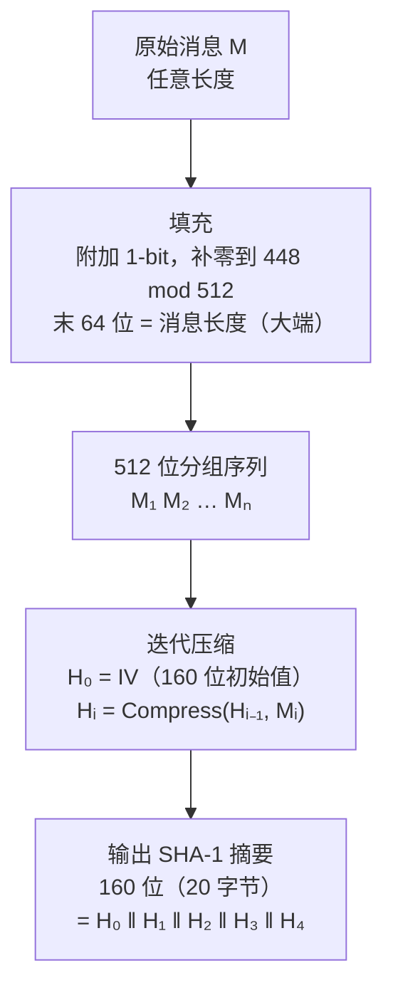
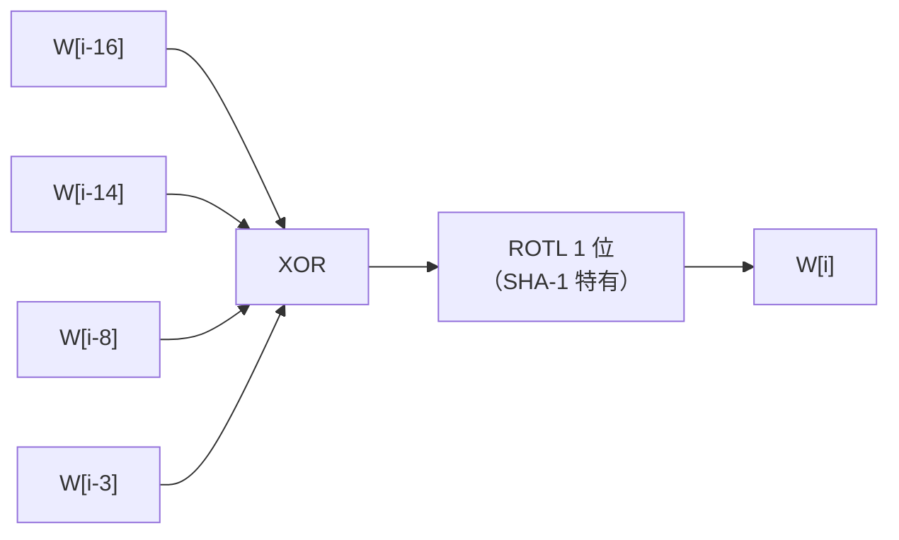
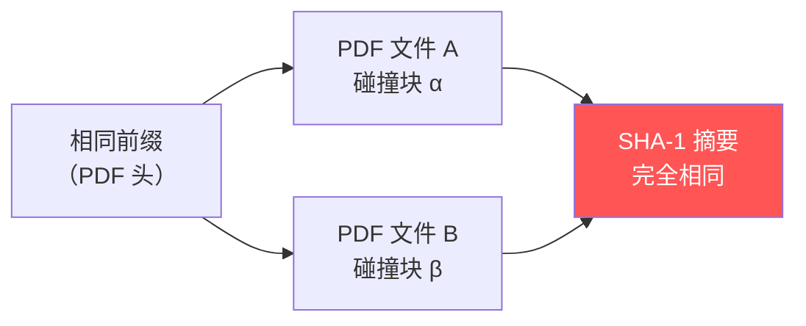
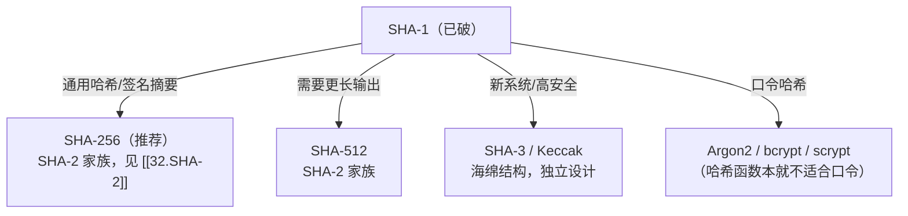

# 密码学（31）· SHA-1

> [!abstract] TL;DR
> - SHA-1 由 NSA 设计、NIST 于 **1995 年**发布，输出 **160 位**（20 字节）摘要，512 位分组，80 步，5 个 32 位链接变量——比 MD5 多 32 位输出、多 16 步。
> - 构造基于 **Merkle-Damgård**（与 MD5 同源），消息扩展将 16 个 32 位字扩展为 80 个，每字含 SHA-1 **特有的循环左移 1 位**（SHA-0 无此步，正是这一差异修复了 SHA-0 的线性弱点）。
> - 抗碰撞性已彻底被攻破：**SHAttered（2017）**是首个实际碰撞（约 2^63.1 次运算），**SHA-1 is a Shambles（2020）**实现 chosen-prefix 碰撞（可伪造签名，约 2^63.4）。
> - **禁止**用于数字签名、证书、完整性保护。迁移至 [[32.SHA-2]] 或 SHA-3。

---

## 概述与定位

SHA-1（Secure Hash Algorithm 1）是 NSA 在 SHA-0 基础上修订、由 NIST 于 **1995 年**在 FIPS PUB 180-1 中发布的哈希算法。在相当长的时间里，它是 X.509 证书签名、TLS、GPG、Git 对象寻址的事实标准。

与 [[30.MD5]]（128 位）相比，SHA-1 输出更长（160 位），抵抗生日攻击的理论代价是 2^80——MD5 只有 2^64。但随着密码分析进步，这个差距并不像数字看起来那样安全：SHA-1 的压缩函数被发现存在结构弱点，导致碰撞复杂度从理论 2^80 逐年降低，直至 2017 年被实际演示。

SHA-1 与 [[29.哈希函数原理]] 所讲的 Merkle-Damgård 框架完全一致：预处理（填充）→ 迭代压缩 → 输出最终链接变量拼接。

### SHA-0 与 SHA-1 的关键差异

SHA-0 是 1993 年发布的原始版本，两年后即被撤回。SHA-1 相比 SHA-0 只改了**消息扩展中的一个循环左移（ROTL 1）**：

```
SHA-0 消息扩展：W[i] = W[i-3] XOR W[i-8] XOR W[i-14] XOR W[i-16]
SHA-1 消息扩展：W[i] = ROTL1(W[i-3] XOR W[i-8] XOR W[i-14] XOR W[i-16])
```

这一改动打破了消息调度中的线性结构，显著提升了雪崩效应，使 SHA-0 已知的快速碰撞路径对 SHA-1 失效。

---

## 原理与机制

### Merkle-Damgård 整体结构

与 [[29.哈希函数原理]] 一致，SHA-1 的处理流程如下：



**初始链接变量（IV）** 为固定常数（大端 32 位整数）：

| 变量 | 初始值（十六进制） |
|---|---|
| H0 | `67452301` |
| H1 | `EFCDAB89` |
| H2 | `98BADCFE` |
| H3 | `10325476` |
| H4 | `C3D2E1F0` |

### 消息扩展（16 → 80 字）

每个 512 位分组被分为 16 个 32 位字 W[0..15]，再由消息调度扩展到 80 个字：

```
对 i = 16..79：
    W[i] = ROTL1(W[i-3] XOR W[i-8] XOR W[i-14] XOR W[i-16])
```

其中 ROTL1 表示 32 位循环左移 1 位——这是 SHA-1 区别于 SHA-0 的唯一改动，却是决定性的安全改进。



### 压缩函数：80 步轮函数

每个分组的压缩过程维护五个 32 位寄存器 `(A, B, C, D, E)`，执行 80 步：

```
分 4 轮，每轮 20 步（t = 0..19 / 20..39 / 40..59 / 60..79）

步骤逻辑：
    T  = ROTL5(A) + f(t, B, C, D) + E + W[t] + K[t]
    E  = D
    D  = C
    C  = ROTL30(B)
    B  = A
    A  = T

完成后：Hᵢ = (H0 + A, H1 + B, H2 + C, H3 + D, H4 + E)
```

其中四个布尔函数 `f(t, B, C, D)` 和常量 `K[t]`：

| 轮次（步骤） | f(t, B, C, D) | K（十六进制） |
|---|---|---|
| 0–19 | Ch(B,C,D) = (B AND C) OR (NOT B AND D) | `5A827999` ≈ ⌊2^30 × √2⌋ |
| 20–39 | Parity = B XOR C XOR D | `6ED9EBA1` ≈ ⌊2^30 × √3⌋ |
| 40–59 | Maj(B,C,D) = (B AND C) OR (B AND D) OR (C AND D) | `8F1BBCDC` ≈ ⌊2^30 × √5⌋ |
| 60–79 | Parity = B XOR C XOR D | `CA62C1D6` ≈ ⌊2^30 × √10⌋ |

---

## 算法流程详解

### 完整伪代码

```
函数 SHA1(消息 M)：

  // 1. 填充
  令 L = bit_length(M)
  附加 1 位"1"
  附加 若干位"0"直至 bit_length ≡ 448 (mod 512)
  附加 L 的 64 位大端表示
  // 现在总长度 ≡ 0 (mod 512)

  // 2. 初始化
  H = [0x67452301, 0xEFCDAB89, 0x98BADCFE, 0x10325476, 0xC3D2E1F0]

  // 3. 迭代分组
  对每个 512 位分组 Block：
    W[0..15] = 分组中 16 个 32 位大端字

    // 消息扩展
    对 i = 16..79：
      W[i] = ROTL1(W[i-3] XOR W[i-8] XOR W[i-14] XOR W[i-16])

    // 初始化工作变量
    (A, B, C, D, E) = (H[0], H[1], H[2], H[3], H[4])

    // 80 步压缩
    对 t = 0..79：
      按上表选 f 和 K
      T = ROTL5(A) + f(t,B,C,D) + E + W[t] + K
      (A, B, C, D, E) = (T, A, ROTL30(B), C, D)

    // 累加链接变量
    H[0..4] += (A, B, C, D, E)（mod 2^32）

  // 4. 输出
  返回 H[0] ‖ H[1] ‖ H[2] ‖ H[3] ‖ H[4]（大端，共 20 字节）
```

### 参数一览

| 参数 | 值 |
|---|---|
| 输出长度 | 160 位（20 字节） |
| 分组大小 | 512 位（64 字节） |
| 字大小 | 32 位 |
| 链接变量数 | 5 个（A–E） |
| 步骤数 | 80 步（4 轮 × 20 步） |
| 消息扩展 | 16 → 80 字，含 ROTL1（SHA-1 特有） |
| 填充方式 | Merkle-Damgård（与 MD5 相同）|
| 字节序 | 大端（区别于 MD5 的小端） |

### 与 MD5 对比

| 维度 | MD5 | SHA-1 |
|---|---|---|
| 发布年份 | 1992 | 1995 |
| 设计者 | Ron Rivest | NSA / NIST |
| 输出位数 | 128 位 | 160 位 |
| 分组大小 | 512 位 | 512 位 |
| 链接变量 | 4 × 32 位 | 5 × 32 位 |
| 步骤数 | 64 步（4 轮×16）| 80 步（4 轮×20）|
| 字节序 | 小端 | 大端 |
| 消息扩展 | 直接使用原始字 | 16→80 字，含 ROTL1 |
| 碰撞状态 | 已实际碰撞（~2^18，秒级）| 已实际碰撞（SHAttered，~2^63）|
| 现状 | 禁用 | 禁用于签名/证书 |

---

## 碰撞攻击史

SHA-1 的安全性瓦解历经近二十年，是密码分析史上最具代表性的渐进攻击案例。

### 理论攻击的逐步降维

| 年份 | 研究者 | 攻击类型 | 复杂度 |
|---|---|---|---|
| 2005 | Wang、Yin、Yu | 碰撞（理论） | 2^69 |
| 2005 | Wang、Yin、Yu（改进）| 碰撞（理论） | 2^63 |
| 2006 | Xiaoyun Wang 等 | 进一步优化 | < 2^63 |
| 2011 | Marc Stevens | 分析改进 | 2^60.3（估算） |
| 2017 | Google + CWI | **首个实际碰撞（SHAttered）** | ~2^63 |
| 2020 | Leurent + Peyrin | **Chosen-prefix 碰撞** | ~2^63.4 |

理论攻击的核心技术是**差分路径（differential path）**：Wang 等人找到了一条消息差分路径，使得两条消息在每一步中维护特定差分，最终产生相同压缩输出。这一思路来自对压缩函数线性/差分结构的深度分析。

### SHAttered（2017）

2017 年 2 月，Google 安全团队与荷兰 CWI 数学研究所合作公布 **SHAttered**（[shattered.io](https://shattered.io)）：

- **首个实际可计算的 SHA-1 碰撞**：两个内容不同的 PDF 文件具有完全相同的 SHA-1 摘要。
- 攻击代价：约 **2^63.1 次 SHA-1 压缩运算**，相当于 9.2 × 10^18 次——在当时约折合 110 个 GPU 年，或 Google 规模算力下数月完成。
- 技术核心：相同前缀碰撞（identical-prefix collision）+ 精心构造的碰撞块，两个 PDF 头完全相同，后接两个哈希碰撞的内容块，其余内容随意。
- 意义：从"理论上可行"到"实际已完成"，宣告 SHA-1 抗碰撞性不再有安全保证。



### SHA-1 is a Shambles（2020）

2020 年 Leurent 与 Peyrin 发表《SHA-1 is a Shambles》：

- 实现 **Chosen-Prefix Collision（选择前缀碰撞）**，复杂度约 **2^63.4**。
- Chosen-prefix 碰撞比 SHAttered 的相同前缀碰撞更强：攻击者可以为**任意两个不同前缀**分别构造碰撞后缀，使两者拼合后 SHA-1 摘要相同。
- 实际意义：可伪造 PGP/GPG 签名——攻击者能为一个恶意密钥和一个受信任密钥分别伪造具有相同 SHA-1 摘要的证书，从而在签名验证中以恶意密钥冒充受信任密钥。
- 该工作直接加速了 GnuPG 等工具完全弃用 SHA-1 签名。

> [!warning] 安全结论
> SHA-1 的抗碰撞性已于 2017 年实际攻破，chosen-prefix 碰撞于 2020 年实现。**任何依赖 SHA-1 抗碰撞性的应用均不再安全**，包括数字签名、证书、完整性验证。

---

## 影响与弃用历史

### X.509 证书与 TLS

SHA-1 长期主导 X.509 证书签名（`sha1WithRSAEncryption`）。随着攻击进展：

- **2013 年**：CA/Browser Forum 规定 2016 年 1 月起不再签发 SHA-1 证书。
- **2017 年 1 月**：主流浏览器（Chrome、Firefox）开始拒绝 SHA-1 证书。
- **2017 年 SHAttered 后**：各大 CA 全面停止 SHA-1 证书签发。

[[71.详解网络协议/15.TLS协议|TLS]] 握手中的签名摘要算法也随之全面切换至 SHA-256。

### Git 与 SHA-1

Git 使用 SHA-1 为所有对象（commit、tree、blob）计算 40 字符十六进制 ID（即对象哈希），用于内容寻址和完整性验证。SHAttered 之后：

- **2017 年**：Git 项目启动 NewHash 工程，设计支持 SHA-256 的对象格式。
- **2020 年**：`git init --object-format=sha256` 选项正式可用（实验性）。
- **2022 年 Git 2.38**：SHA-256 对象格式进入正式支持阶段（`object-format = sha256`）。
- SHA-1 仍是默认格式，**完全迁移需生态系统（远程仓库、工具链）同步**——这一过程仍在进行中。

> [!note] Git 的 SHA-1 碰撞缓解
> Git 代码库中已加入 SHAttered 碰撞检测：对每个 SHA-1 输入块检查已知碰撞模式，碰撞文件会被拒绝入库，短期内降低了实际风险，但这只是过渡措施，根本解决需迁移 SHA-256。

### GPG / 代码签名

- GnuPG 自 2.2.x 起默认使用 SHA-256 签名，SHA-1 签名会产生警告。
- 2020 年 Shambles 论文发表后，GnuPG 2.2.18 开始拒绝以 SHA-1 签名的密钥绑定（User ID 认证）。
- 代码签名（PE 证书表见 [[13.PE文件详解/12-详解PE文件(十二)：证书表|PE 证书表]]）同步弃用 SHA-1，Windows 平台已要求 SHA-256。

---

## 安全性与正确使用

### 当前安全状态

| 安全性质 | 状态 | 说明 |
|---|---|---|
| 抗原像（Preimage resistance）| 尚未实际攻破 | 理论最优攻击约 2^160，无实际威胁 |
| 抗第二原像（Second preimage）| 尚未实际攻破 | 理论复杂度仍高 |
| 抗碰撞（Collision resistance）| **已破** | SHAttered 2017，约 2^63 |
| Chosen-prefix 碰撞 | **已实现** | Shambles 2020，可伪造签名 |

> [!danger] 核心限制
> 碰撞攻击已实际实现意味着：**任何依赖"两个不同输入不能产生相同摘要"的应用，都不能再用 SHA-1**。数字签名和证书正是依赖碰撞抗性——签名者签的是摘要，若攻击者能找到碰撞，就能用不同内容冒充签名结果。

### 仍可使用的场景（极少数）

SHA-1 的原像抗性尚未被实际攻破，以下**仅做完整性校验（非安全场景）** 的用途理论上风险有限，但出于合规和未来迁移成本，同样建议替换：

- 非安全的文件去重（如 Git 历史兼容层）
- 内部调试日志的快速校验码（不面向安全决策）

**即便如此，新系统禁止选用 SHA-1**。

### 禁止使用的场景

- 数字签名（代码签名、文档签名、PGP）
- X.509 证书签名算法
- TLS 握手签名摘要
- HMAC-SHA1 用于密钥派生或认证（建议升级至 HMAC-SHA256）
- 任何需要抗碰撞性的完整性验证

### 迁移路径



| 用途 | 推荐替代 |
|---|---|
| 通用摘要、完整性 | SHA-256（FIPS 180-4）|
| 长输出、更高安全边际 | SHA-512 |
| 独立于 SHA-2 设计的验证 | SHA3-256 / SHA3-512 |
| HMAC | HMAC-SHA256 |
| 证书签名 | sha256WithRSAEncryption / ecdsa-with-SHA256 |
| Git 对象格式 | SHA-256 对象格式（`--object-format=sha256`）|

### 实用命令示例

```bash
# 计算文件 SHA-1（仅参考，不要用于安全场景）
openssl dgst -sha1 file.bin

# 计算文件 SHA-256（应使用这个）
openssl dgst -sha256 file.bin

# 检查证书签名算法（查看是否仍含 SHA-1）
openssl x509 -in cert.pem -noout -text | grep "Signature Algorithm"
```

> [!warning] 示例输出为示意
> 上述命令输出格式因 OpenSSL 版本而异，仅供参考；签名算法字段应显示 `sha256WithRSAEncryption` 或类似 SHA-256/SHA-384 字样。

---

## 小结

SHA-1 是 NSA/NIST 在 1995 年对 SHA-0 的修订版，核心改动是消息扩展中新增 ROTL1，修复了 SHA-0 的线性弱点。其 Merkle-Damgård 框架、160 位输出、80 步四轮结构，曾是 TLS、证书、GPG、Git 的基石。

然而从 2005 年 Wang 等人的理论突破，到 2017 年 SHAttered 的实际碰撞演示，再到 2020 年 Shambles 的 chosen-prefix 碰撞，SHA-1 的抗碰撞性被彻底攻破。其历史教训深刻：

1. **80 位的碰撞安全边际（2^80 理论）对现代计算力不足够**；
2. **Merkle-Damgård 结构本身不提供对碰撞攻击的特别保护**，一旦压缩函数有差分弱点即可被利用；
3. **算法生命周期管理是工程实践的必修课**：弃用窗口须在攻击实际可行前开启，而非等到被破才行动。

[[32.SHA-2]] 通过更长的输出（256/512 位）、更复杂的压缩函数设计，维持了至今的安全性。[[33.SHA-3与Keccak]] 则以海绵结构完全独立于 Merkle-Damgård，提供了设计多样性保障。

---

## 相关阅读

- [[29.哈希函数原理]] —— Merkle-Damgård、生日攻击、抗碰撞性三要素
- [[30.MD5]] —— 同为 Merkle-Damgård、更早被破，对比学习
- [[32.SHA-2]] —— SHA-256/512，当前安全替代
- [[33.SHA-3与Keccak]] —— 海绵结构，独立设计路线
- [[71.详解网络协议/15.TLS协议|TLS 协议]] —— SHA-1 弃用对握手的影响
- [[13.PE文件详解/12-详解PE文件(十二)：证书表|PE 证书表]] —— 代码签名摘要算法迁移

---

⬅️ 上一篇 [[30.MD5]] ｜ 🏠 [[00.密码学总览]] ｜ 下一篇 [[32.SHA-2]] ➡️
