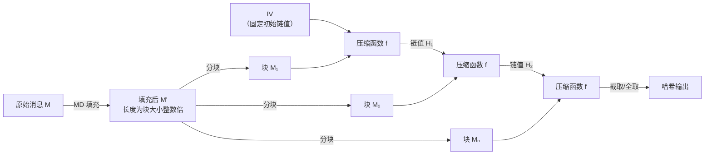
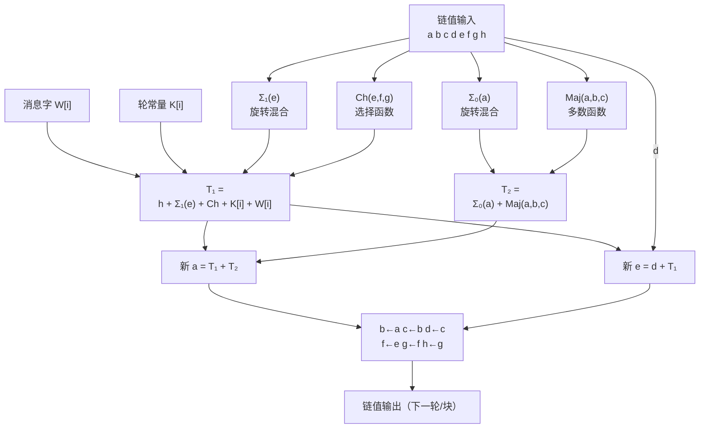

# 密码学（32）· SHA-2

> [!abstract] TL;DR
> - SHA-2 是 NSA 设计、NIST 于 2001 年标准化的哈希函数家族，共六个成员：**SHA-224、SHA-256、SHA-384、SHA-512、SHA-512/224、SHA-512/256**。
> - SHA-256 是当今互联网最广泛部署的哈希函数：TLS 证书签名、代码签名、比特币 PoW 全部依赖它。
> - 底层结构：**Merkle-Damgård** 迭代 + **Davies-Meyer** 单向压缩，与 SHA-1 同源但安全裕量大幅提升。
> - **长度扩展攻击（Length Extension Attack）对 SHA-256/512 仍然有效**；截断变体 SHA-224/384/512-256 因丢弃部分内部状态而免疫。MAC 场景**必须使用 HMAC**，禁止裸 `H(key ‖ msg)`。
> - 截至 2025 年，SHA-2 无已知实际碰撞，是目前默认安全的哈希选择；抗碰撞目标值与未来演进可关注 [[33.SHA-3与Keccak]]。

---

## 概述与定位

### 历史背景

SHA-2 家族由 NSA 设计，2001 年以 FIPS 180-2 发布（首批包含 SHA-256 和 SHA-512），后经 FIPS 180-3（2008）和 FIPS 180-4（2012）扩充，添加了 SHA-512/224 和 SHA-512/256 两个截断变体。命名中的"2"是代际编号——前代 SHA-1 因 2005 年理论碰撞攻击（Wang et al.）及 2017 年 SHAttered 实际碰撞已被淘汰（见 [[31.SHA-1]]），SHA-2 接棒成为主流。

SHA-2 与 SHA-1 的关键区别在于：更大的内部状态（256 或 512 位 vs 160 位）、更多的轮数（64/80 vs 80，但字宽翻倍）、更复杂的轮函数，以及对长度扩展攻击的部分缓解（截断变体）。

### 家族成员一览

| 变体 | 输出长度 | 内部状态 | 字宽 | 块大小 | 轮数 | 备注 |
|------|---------|---------|------|-------|------|------|
| SHA-224 | 224 bit | 256 bit | 32 bit | 512 bit | 64 | SHA-256 截断，不同 IV |
| SHA-256 | 256 bit | 256 bit | 32 bit | 512 bit | 64 | 最常用，当前默认选择 |
| SHA-384 | 384 bit | 512 bit | 64 bit | 1024 bit | 80 | SHA-512 截断，不同 IV |
| SHA-512 | 512 bit | 512 bit | 64 bit | 1024 bit | 80 | 64 位平台可能更快 |
| SHA-512/224 | 224 bit | 512 bit | 64 bit | 1024 bit | 80 | 截断，免疫长度扩展 |
| SHA-512/256 | 256 bit | 512 bit | 64 bit | 1024 bit | 80 | 截断，免疫长度扩展 |

> [!note] 截断变体的意义
> SHA-512/256 输出与 SHA-256 相同长度（256 bit），但基于 512 位内部状态运行。64 位平台处理 64 位字比 32 位字更快，因此 SHA-512/256 在 64 位 CPU 上性能通常**优于 SHA-256**，同时因截断丢弃了一半内部状态而**对长度扩展攻击完全免疫**。

---

## 原理与机制

### Merkle-Damgård 结构

SHA-256 和 SHA-512 都基于经典的 Merkle-Damgård（MD）迭代框架：

```
消息 M  ──填充──►  M₁ ‖ M₂ ‖ … ‖ Mₙ   （固定大小的块序列）
                        │    │         │
         IV ──►  f(IV, M₁) ─► f(·, M₂) ─► … ──► f(·, Mₙ) ──► 哈希值
```

- **IV（初始向量）**：固定常量，由小数部分精心选取（见下文），各变体不同。
- **压缩函数 f**：接收上一轮 256/512 位链值（chaining value）和当前消息块，输出新的链值。
- **MD 填充**：消息末尾附加 `1` bit，再填 `0` 到满足 `|M| + 1 ≡ 448 (mod 512)`（SHA-256）或 `≡ 896 (mod 1024)`（SHA-512），最后附加 64/128 位大端消息长度。这使得不同长度消息的填充结果唯一，是抗第二原像的必要条件。



### Davies-Meyer 压缩

SHA-2 的压缩函数 f 采用 Davies-Meyer 结构：将一个分组密码 E（此处为 SHA-2 内建的分组变换）包裹成单向压缩函数：

```
f(H, M) = E_M(H) XOR H
```

其中 `E_M` 表示以当前消息块 M 为密钥、以链值 H 为明文的加密。XOR 回加（feed-forward）确保即使 `E_M` 是可逆的，f 整体也是单向的——已知 `f(H, M)` 和 M 无法反推 H，因为需要计算 `E_M^{-1}` 再 XOR，但这不等价于知道 H。

### 轮常量的生成

SHA-256 使用 **64 个 32 位轮常量** `K[0..63]`，SHA-512 使用 **80 个 64 位轮常量** `K[0..79]`。

生成规则（"天外来客"选取，避免后门嫌疑）：

> 取前 N 个素数（SHA-256：前 64 个；SHA-512：前 80 个），对每个素数 p 取其**立方根**（cube root）小数部分的前 32/64 位。

例如，SHA-256 第一个轮常量由素数 2 生成：
- `cbrt(2) = 1.2599210498948732...`
- 小数部分 `0.2599210498948732...` × 2^32 ≈ `1116352408₁₀ = 0x428a2f98`
- 故 `K[0] = 0x428a2f98`

IV（初始链值）由同样方式取**平方根**小数部分得到。这种"无中生有"（nothing up my sleeve）的选取方式，公开证明了常量没有隐藏弱点。

---

## 算法流程与结构详解

### SHA-256 预处理

**1. MD 填充**

```
输入：消息 M，|M| = L 位

追加 1 bit "1"
追加 k 个 "0" bit，使 (L + 1 + k) ≡ 448 (mod 512)
追加 64 位大端整数表示 L
```

结果长度为 512 的倍数，分成 N 个 512 位（16 个 32 位字）的块。

**2. 初始链值 H（SHA-256）**

```
H₀ = 0x6a09e667    H₁ = 0xbb67ae85
H₂ = 0x3c6ef372    H₃ = 0xa54ff53a
H₄ = 0x510e527f    H₅ = 0x9b05688c
H₆ = 0x1f83d9ab    H₇ = 0x5be0cd19
```

（前 8 个素数平方根小数部分的前 32 位）

### SHA-256 消息调度（Message Schedule）

每个 512 位消息块被扩展为 64 个 32 位字 `W[0..63]`：

```
W[i] = M_block[i]                              对 i = 0..15
W[i] = σ₁(W[i-2]) + W[i-7] + σ₀(W[i-15]) + W[i-16]   对 i = 16..63
```

其中 σ（小 sigma）函数定义为：

```
σ₀(x) = ROTR²(x)  XOR  ROTR⁷(x)  XOR  SHR³(x)
σ₁(x) = ROTR¹⁷(x) XOR  ROTR¹⁹(x) XOR  SHR¹⁰(x)
```

`ROTR^n(x)` = 循环右移 n 位，`SHR^n(x)` = 逻辑右移 n 位（线性操作）。

消息调度使得每个原始消息位影响多个 W[i]，为雪崩效应奠定基础。

### SHA-256 压缩函数主循环

初始化工作变量（首块取 IV，后续取前一块输出）：

```
a, b, c, d, e, f, g, h = H₀, H₁, H₂, H₃, H₄, H₅, H₆, H₇
```

执行 64 轮，每轮：

```
T₁ = h + Σ₁(e) + Ch(e, f, g) + K[i] + W[i]
T₂ = Σ₀(a) + Maj(a, b, c)

h = g
g = f
f = e
e = d + T₁
d = c
c = b
b = a
a = T₁ + T₂
```

四个核心辅助函数：

```
Ch(e, f, g)  = (e AND f) XOR (NOT e AND g)     "Choose"：用 e 选 f 或 g
Maj(a, b, c) = (a AND b) XOR (a AND c) XOR (b AND c)  "Majority"：多数投票
Σ₀(a) = ROTR²(a)  XOR ROTR¹³(a) XOR ROTR²²(a)   大 Sigma-0
Σ₁(e) = ROTR⁶(e)  XOR ROTR¹¹(e) XOR ROTR²⁵(e)   大 Sigma-1
```

64 轮结束后，将工作变量与块开始时链值加法合并（Davies-Meyer feed-forward）：

```
H₀ += a,  H₁ += b,  H₂ += c,  H₃ += d
H₄ += e,  H₅ += f,  H₆ += g,  H₇ += h
```

### SHA-256 压缩函数轮结构



### SHA-512 与 SHA-256 的差异

SHA-512 是 SHA-256 的 64 位字宽版本，结构完全对应：

| 参数 | SHA-256 | SHA-512 |
|------|---------|---------|
| 字宽 | 32 bit | 64 bit |
| 块大小 | 512 bit | 1024 bit |
| 轮数 | 64 | 80 |
| σ₀ 旋转量 | 2, 7, 3（SHR） | 1, 8, 7（SHR） |
| σ₁ 旋转量 | 17, 19, 10（SHR） | 19, 61, 6（SHR） |
| Σ₀ 旋转量 | 2, 13, 22 | 28, 34, 39 |
| Σ₁ 旋转量 | 6, 11, 25 | 14, 18, 41 |
| 初始链值长度 | 8 × 32 bit | 8 × 64 bit |

### 截断变体的 IV 差异

SHA-224 不是 SHA-256 的简单截断，而是使用**不同的 IV**（前 9～16 个素数的平方根小数部分），然后截取最终 256 位输出的前 224 位。这保证了 SHA-224 与 SHA-256 的独立性，即 SHA-224 哈希值无法用来重构 SHA-256 的内部状态。

SHA-384、SHA-512/224、SHA-512/256 同理——基于 SHA-512 内核、不同 IV、截取不同位数输出。

---

## 安全性与正确使用

### 碰撞安全性

| 变体 | 碰撞攻击理论安全性 | 当前状态 |
|------|-----------------|---------|
| SHA-224 | 2^112 | 安全，无已知碰撞 |
| SHA-256 | 2^128 | 安全，无已知碰撞 |
| SHA-384 | 2^192 | 安全，无已知碰撞 |
| SHA-512 | 2^256 | 安全，无已知碰撞 |

SHA-256 提供 **128 位碰撞安全性**（生日界），比 SHA-1 的理论 80 位（实际已被攻破至 <2^63 复杂度）大幅提升。目前没有任何针对完整轮数 SHA-2 的实际碰撞或原像攻击，学术工作仅到简化轮版本（如 31 轮 SHA-256）。

### 长度扩展攻击（Length Extension Attack）

这是 Merkle-Damgård 结构固有的弱点，**SHA-256 和 SHA-512 均受影响**。

**攻击原理：**

MD 结构的最终哈希值 `H = f(f(f(IV, M₁), M₂), Mₙ)` 实际上就是处理完 M 之后的内部链值。攻击者若已知 `H(secret ‖ msg)` 和 `|secret|`（但不知道 secret 本身），可以：

1. 将已知哈希值 H 作为初始链值；
2. 伪造追加数据 `ext`，计算 `H(secret ‖ msg ‖ padding ‖ ext)`；
3. 得到合法的新哈希，**完全不需要知道 secret**。

```
已知：H(K ‖ M) = h，|K| = 已知
攻击者可计算：H(K ‖ M ‖ pad(M) ‖ ext) = h'
              不需要知道 K
```

**受影响与免疫变体：**

| 变体 | 长度扩展攻击 |
|------|------------|
| SHA-256 | 受影响（完整 256 位输出 = 完整内部状态） |
| SHA-512 | 受影响（完整 512 位输出 = 完整内部状态） |
| SHA-224 | **免疫**（输出 224 bit，丢弃 32 bit 内部状态，无法恢复完整链值） |
| SHA-384 | **免疫**（输出 384 bit，丢弃 128 bit） |
| SHA-512/224 | **免疫**（截断丢弃 288 bit） |
| SHA-512/256 | **免疫**（截断丢弃 256 bit） |

> [!danger] 禁止用裸哈希做 MAC
> 即使使用免疫变体，也不应直接使用 `H(key ‖ message)` 作为 MAC。正确做法是使用 **[[36.HMAC]]**，其设计同时解决了长度扩展和密钥泄漏问题。
>
> ```
> HMAC-SHA256(key, msg) = SHA-256((key XOR opad) ‖ SHA-256((key XOR ipad) ‖ msg))
> ```
>
> HMAC 的嵌套结构使得外层哈希的输入包含了内层哈希的完整输出，内外层都混合了密钥，从根本上切断了长度扩展攻击路径。

### 性能考量

**SHA-NI 硬件指令**（Intel SHA Extensions，AMD Ryzen 起支持）：

x86 平台提供 `SHA256MSG1`、`SHA256MSG2`、`SHA256RNDS2`（及 SHA-1 对应指令）等专用指令，可将 SHA-256 吞吐量提升 3～4 倍。OpenSSL/BoringSSL 在检测到 SHA-NI 时自动启用。

**64 位平台上 SHA-512 更快：**

SHA-512 每轮处理 1024 位（vs SHA-256 的 512 位），但 64 位 CPU 的 64 位字操作不比 32 位更慢。实际上在 x86_64 上，SHA-512 的每字节吞吐量通常**优于 SHA-256**（约 30-50%），而 SHA-512/256 同时获得性能优势和长度扩展免疫，是需要 256 位输出时在 64 位平台的首选。

**ARM 平台**：ARMv8 同样提供了 `SHA256H`/`SHA256H2`/`SHA256SU0`/`SHA256SU1` 及 SHA-512 系列 crypto 扩展指令。

### 正确使用建议

| 场景 | 推荐做法 |
|------|---------|
| 通用数据完整性/指纹 | SHA-256（32 字节，128 位安全，主流兼容） |
| 数字签名（TLS 证书） | SHA-256 配合 ECDSA P-256 或 RSA-2048 |
| MAC / 消息认证 | **HMAC-SHA256**（见 [[36.HMAC]]），禁止裸 H(key‖msg) |
| 防长度扩展 MAC | HMAC（首选）；或 SHA-512/256、SHA-384（截断变体） |
| 64 位平台高性能 | SHA-512/256（免扩展攻击 + 快）或 SHA-384 |
| 超长期存档（2030+） | 考虑 [[33.SHA-3与Keccak]]（海绵结构，与 MD 完全不同） |
| 密码哈希 | **禁止使用任何 SHA-2**——改用 bcrypt/Argon2/scrypt |

> [!warning] SHA-256 不是密码哈希函数
> SHA-256 速度极快（现代 CPU 数 GB/s），暴力破解/彩虹表攻击效率极高。存储用户密码必须使用专门设计的慢哈希（KDF）：bcrypt、Argon2id、scrypt。

### 与 SHA-3 的关系

SHA-3（Keccak，2015 年 NIST 标准化）不是 SHA-2 的替代，而是**互补备份**。两者基于完全不同的数学结构：

- SHA-2：Merkle-Damgård + Davies-Meyer（面向字的 ARX 变换）
- SHA-3：海绵结构（Sponge）+ Keccak-f 置换（比特级操作）

若未来发现针对 MD 结构的新型通用攻击，SHA-3 因结构不同可作为备用。但在此之前，SHA-256 仍是默认推荐（更广泛的硬件加速支持、更成熟的生态）。详见 [[33.SHA-3与Keccak]]。

---

## 应用场景

### TLS / 证书体系

现代 TLS 1.3 握手中，证书签名算法优先使用 SHA-256 或 SHA-384 配合 ECDSA。X.509 证书的 `signatureAlgorithm` 字段通常为 `sha256WithRSAEncryption` 或 `ecdsa-with-SHA256`。参见 [[71.详解网络协议/15.TLS协议]] 和 [[13.PE文件详解/12-详解PE文件(十二)：证书表]] 中关于代码签名证书的说明。

### 区块链

比特币 PoW 使用 **双重 SHA-256**：`SHA-256(SHA-256(block_header))`。双重哈希消除了某些长度扩展场景的理论风险（虽然区块头格式本身已排除了这类攻击）。比特币地址生成同时使用 SHA-256 和 RIPEMD-160（`HASH160 = RIPEMD160(SHA-256(pubkey))`）。

### Git 对象寻址

Git 传统使用 SHA-1 寻址对象（commit/blob/tree 哈希）。自 Git 2.29 起提供 SHA-256 对象格式（`--object-format=sha256`），正逐步推广。

### 代码签名与软件分发

macOS、iOS、Windows Authenticode 均使用 SHA-256 对可执行文件和代码签名证书链进行完整性验证。参见 [[34.现代二进制防护机制/00.现代二进制防护机制总览]] 中关于代码签名的说明。

---

## 小结

SHA-2 以 **Merkle-Damgård + Davies-Meyer** 为骨架，在 SHA-1 的设计思路上大幅拓宽了安全裕量：输出从 160 位扩展到最高 512 位，内部状态相应增大，轮函数（Ch/Maj/Σ/σ）更为复杂。六个变体在字宽（32/64 位）和截断策略上形成矩阵，覆盖从 224 到 512 位的输出需求。

核心使用原则三条：

1. **SHA-256 是当今默认安全哈希**——TLS/证书/区块链的事实标准，无已知实际攻击。
2. **MAC 必须用 HMAC-SHA256**——裸 `H(key ‖ msg)` 被长度扩展攻击击穿；[[36.HMAC]] 是正确选择。
3. **密码哈希禁用 SHA-2**——速度特性与密码存储需求相悖，应用 bcrypt/Argon2id。

与 [[33.SHA-3与Keccak]] 并存但互补，两者提供了结构多样性以应对未知的未来威胁。

---

## 相关阅读

- [[29.哈希函数原理]] — Merkle-Damgård 构造与 Davies-Meyer 理论，生日攻击、碰撞安全性证明
- [[31.SHA-1]] — SHA-2 前代，理解从 SHA-1 到 SHA-2 的演进与弱点修复
- [[33.SHA-3与Keccak]] — 海绵结构，与 SHA-2 完全不同的数学基础，后备选择
- [[36.HMAC]] — 基于 SHA-2 构造 MAC 的正确方式，解决长度扩展攻击
- [[71.详解网络协议/15.TLS协议]] — SHA-2 在握手与证书验证中的核心地位
- FIPS 180-4 — NIST SHA-2 官方规范

---

⬅️ 上一篇 [[31.SHA-1]] ｜ 🏠 [[00.密码学总览]] ｜ 下一篇 [[33.SHA-3与Keccak]] ➡️
