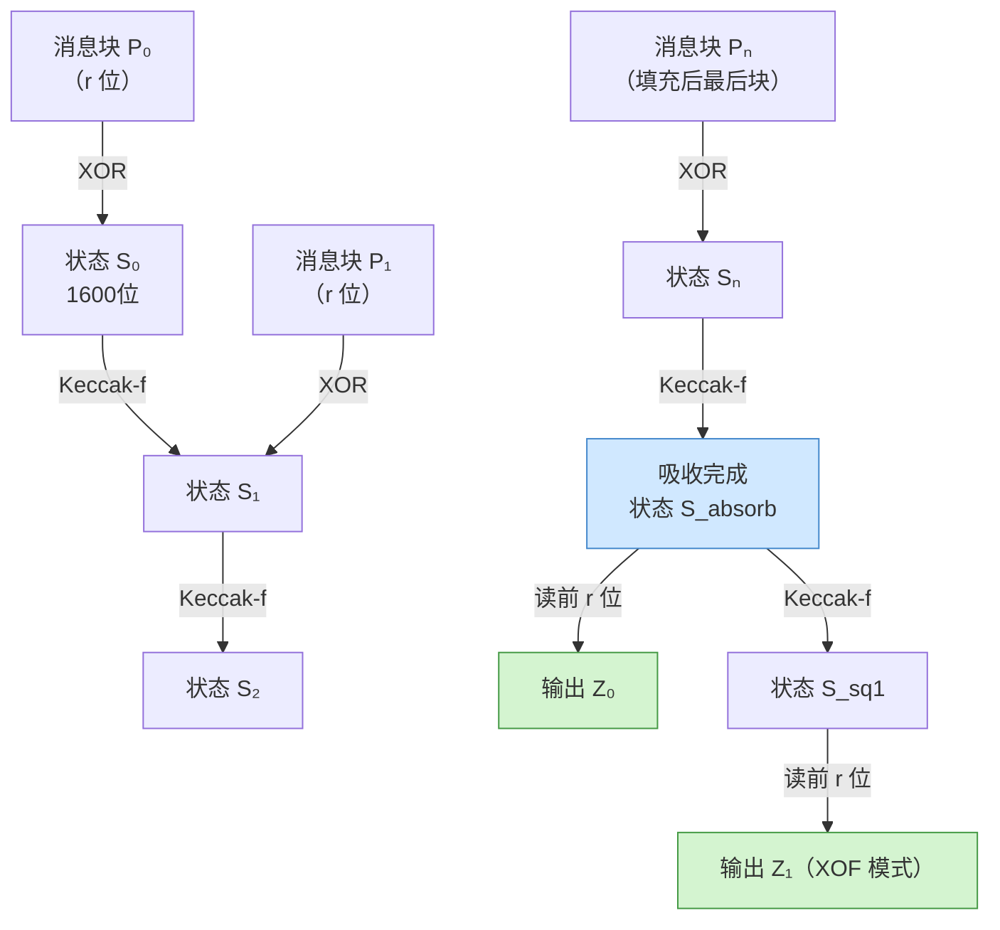
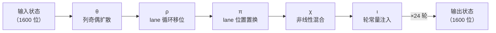

# 密码学（33）· SHA-3 与 Keccak

> [!abstract] TL;DR
> - **SHA-3** 是 NIST 于 2015 年（FIPS 202）正式发布的哈希标准，底层算法是 **Keccak**（2012 年 NIST 竞赛胜出）。与 SHA-1/SHA-2 完全不同：采用**海绵结构（sponge construction）**，而非 Merkle-Damgård。
> - 海绵的工作方式：先将消息逐块**吸收（absorb）**进 1600 位状态，再**挤压（squeeze）**出所需长度的输出。安全强度由**容量 c** 决定（强度 = c/2），与输出长度解耦。
> - 核心置换 **Keccak-f[1600]** 运行 24 轮，每轮五步（θ/ρ/π/χ/ι），在 5×5×64 的三维位阵上操作。
> - **天然免疫长度扩展攻击**——海绵结构的容量 c 与输出都不暴露全状态，根本上封闭了 SHA-2 的那条攻击面（见 [[29.哈希函数原理]]）。
> - 成员除固定输出的 SHA3-224/256/384/512 外，还有 **SHAKE128/SHAKE256**（XOF，可扩展输出函数），以及 cSHAKE/KMAC/TupleHash 等高级衍生。
> - SHA-3 与 SHA-2 **并存而非替代**：NIST 同时推荐两族，作为不同结构的备份；软件性能 SHA-3 略慢于 SHA-2，但硬件实现友好。

---

## 概述与定位

### SHA-3 竞赛的历史背景

2004–2005 年，MD5 碰撞攻击、SHA-1 理论碰撞相继出现，密码学界意识到 Merkle-Damgård 结构本身存在系统性弱点（长度扩展、多碰撞等，详见 [[29.哈希函数原理]]）。NIST 于 2007 年发起公开竞赛，目标是征集一种**结构不同于 SHA-2** 的新标准——即使 SHA-2 被攻破，也有结构迥异的备用方案。

竞赛共收到 64 份方案，历经三轮筛选（初赛 → 5 个决赛入围者 → 冠军），最终 **Keccak**（Guido Bertoni、Joan Daemen、Michaël Peeters、Gilles Van Assche 提交）在 2012 年胜出。2015 年 NIST 发布 **FIPS 202**，正式命名为 **SHA-3**。

值得注意的是：Keccak 提交版与最终 FIPS 202 版在填充规则上有细微差别（Keccak 用 `10*1`，SHA-3 追加了域分隔符 `01||10*1`），导致相同输入下两者输出不同。

### SHA-3 在系列中的位置

| 算法族 | 结构 | 主要优势 | 弱点 |
|---|---|---|---|
| [[29.哈希函数原理]] | Merkle-Damgård 通论 | — | 长度扩展攻击 |
| [[32.SHA-2]] | Merkle-Damgård | 软件快、硬件成熟、广泛部署 | 长度扩展攻击 |
| **SHA-3（本篇）** | 海绵结构 | 免长度扩展、结构多样性、XOF | 软件比 SHA-2 慢 |
| [[34.BLAKE2与BLAKE3]] | HAIFA/树形 | 极快、并行 | — |

---

## 原理与机制

### 海绵结构（Sponge Construction）

海绵结构是 SHA-3 的根本设计，也是它区别于 SHA-2 的核心。

**状态（State）**：内部维护 1600 位（200 字节）状态，逻辑上划分为：

```
状态宽度 b = r + c
  r = 速率（rate）：每块吸收/挤压的位数
  c = 容量（capacity）：不与外界直接交互的位数
  
安全强度 = c / 2
```

**两阶段处理**：

```
┌─────────────────────────────────────────────────────────────────┐
│  吸收阶段（Absorb）                                              │
│  将消息按 r 位分块，每块 XOR 进状态的前 r 位，再运行 Keccak-f  │
│                                                                  │
│  挤压阶段（Squeeze）                                             │
│  每次从状态前 r 位读出 r 位输出，再运行 Keccak-f，直至够长     │
└─────────────────────────────────────────────────────────────────┘
```



**为何不受长度扩展攻击**：SHA-2（Merkle-Damgård）的长度扩展漏洞在于：攻击者知道 `H(m)` 后，可以直接当作中间状态继续计算 `H(m ‖ padding ‖ extra)`——因为输出就是完整内部状态。海绵结构的 `H(m)` 只是 1600 位状态前 r 位的一部分，**容量 c 位从未暴露**；没有完整状态，攻击者无法"续算"，长度扩展在结构层面被封闭。

### SHA-3 各成员的参数

| 算法 | 输出长度 | 速率 r | 容量 c | 安全强度 | 用途 |
|---|---|---|---|---|---|
| SHA3-224 | 224 bit | 1152 bit | 448 bit | 112 bit | 与 SHA-224 同级 |
| SHA3-256 | 256 bit | 1088 bit | 512 bit | 128 bit | 通用哈希 |
| SHA3-384 | 384 bit | 832 bit | 768 bit | 192 bit | 高安全场景 |
| SHA3-512 | 512 bit | 576 bit | 1024 bit | 256 bit | 最高安全 |
| SHAKE128 | 可变 | 1344 bit | 256 bit | min(d/2, 128) bit | XOF / 低延迟 |
| SHAKE256 | 可变 | 1088 bit | 512 bit | min(d/2, 256) bit | XOF / 高安全 |

> 注：d 为 XOF 请求的输出位数；固定输出版的（碰撞）安全强度 = output/2（因输出长度 < 容量 c，输出长度是瓶颈）。

### 填充规则

SHA-3 在消息末尾追加**域分隔 + 多速率填充（multi-rate padding）**：

```
SHA3-* 填充：在消息位流末尾添加 0x06，在最后一个 r 位块末位置 1
（十六进制表达：...msg... 06 00...00 80）

SHAKE-* 填充：同理但域分隔符为 0x1F
```

域分隔符保证 SHA3-256(m) ≠ SHAKE256(m, 256)，即使两者参数相同，也不会产生输出混淆。

---

## Keccak-f[1600] 置换详解

### 状态表示

Keccak-f[1600] 的 1600 位内部状态被组织为一个 **5×5×64 的三维位阵**，称为"lane"结构：

```
状态 A[x][y][z]：
  x ∈ {0,1,2,3,4}  （列索引）
  y ∈ {0,1,2,3,4}  （行索引）
  z ∈ {0,...,63}   （位深索引，64 位宽）

一个 A[x][y] 称为一条 lane（64 位）
一行 A[x][y=const] 称为 row
一列 A[x=const][y] 称为 column
一片 A[x][y][z=const] 称为 slice（25 位）
```

实现时，状态常被表示为 25 个 64 位无符号整数的数组：`A[y*5 + x]`。

### 24 轮 × 五步变换

Keccak-f[1600] 共运行 **24 轮**，每轮按固定顺序执行 5 个步函数：**θ → ρ → π → χ → ι**。

#### 步骤 1：θ（Theta）—— 奇偶混合

θ 将每个位与其列的奇偶校验混合，产生雪崩效应：

```python
# θ 伪代码
for x in range(5):
    C[x] = A[x,0] XOR A[x,1] XOR A[x,2] XOR A[x,3] XOR A[x,4]

for x in range(5):
    D[x] = C[(x-1) mod 5] XOR ROT64(C[(x+1) mod 5], 1)

for x in range(5):
    for y in range(5):
        A[x,y] = A[x,y] XOR D[x]
```

每个 lane 都被其左侧一列与右侧一列（旋转 1 位）的 XOR 影响，**一位扰动可传播至整个切片**，是最重要的扩散步骤。

#### 步骤 2：ρ（Rho）—— 位旋转

ρ 对每条 lane 做固定偏移量的循环左移，增加纵向扩散（不同 y 层间）：

```python
# ρ 伪代码（偏移量由代数公式预计算，共 24 个非零偏移）
ROT_OFFSETS = [
    # (x, y): offset（标准表，见 FIPS 202 表 2）
    (1,0):1,  (2,0):62, (3,0):28, (4,0):27,
    (0,1):36, (1,1):44, (2,1):6,  (3,1):55, (4,1):20,
    (0,2):3,  (1,2):10, (2,2):43, (3,2):25, (4,2):39,
    (0,3):41, (1,3):45, (2,3):15, (3,3):21, (4,3):8,
    (0,4):18, (1,4):2,  (2,4):61, (3,4):56, (4,4):14,
]
for (x,y), offset in ROT_OFFSETS.items():
    A[x,y] = ROT64(A[x,y], offset)
# A[0,0] 不旋转（偏移=0）
```

#### 步骤 3：π（Pi）—— 置换

π 重排 lane 的位置，在整个 5×5 阵上做长距离置换：

```python
# π 伪代码
B = copy of A
for x in range(5):
    for y in range(5):
        A[y, (2*x + 3*y) mod 5] = B[x, y]
```

π 配合 ρ 的旋转，将被 θ 激活的位散布到状态的各处。

#### 步骤 4：χ（Chi）—— 非线性混合

χ 是唯一的**非线性**步骤，在每行上做逐 lane 的非线性运算：

```python
# χ 伪代码
B = copy of A
for y in range(5):
    for x in range(5):
        A[x,y] = B[x,y] XOR ((NOT B[(x+1)%5, y]) AND B[(x+2)%5, y])
```

形式上类似 S 盒，但对整行并行执行。χ 是 Keccak 实现密码强度（单向性、抗碰撞）的关键。

#### 步骤 5：ι（Iota）—— 轮常量注入

ι 将本轮专属的**轮常量**（RC）XOR 进 lane A[0,0]，打破状态对称性，防止固定点攻击：

```python
# ι 伪代码
A[0,0] = A[0,0] XOR RC[round_index]
```

24 个轮常量（RC[0..23]）由线性反馈移位寄存器（LFSR）生成，每个均为 64 位值，完整表见 FIPS 202 附录 B。

### 五步协同：为何 24 轮足够



| 步骤 | 作用 | 类比 |
|---|---|---|
| θ | 线性扩散（横向） | AES MixColumns |
| ρ | 线性扩散（纵向移位） | AES ShiftRows |
| π | 长距离置换 | AES ShiftRows（更大范围） |
| χ | 非线性（唯一） | AES SubBytes（S 盒） |
| ι | 打破对称性 | AES AddRoundKey（轮常量） |

经过 24 轮后，输入的单比特改变可以扩散至所有 1600 位状态（完全雪崩），达到设计安全目标。

---

## XOF 与衍生函数

### SHAKE：可扩展输出函数（XOF）

SHAKE128 和 SHAKE256 是 SHA-3 家族中的**可扩展输出函数（XOF，eXtendable Output Function）**，输出长度任意：

```
SHAKE128(M, d) → d 位输出   （安全强度 min(d/2, 128) 位）
SHAKE256(M, d) → d 位输出   （安全强度 min(d/2, 256) 位）
```

典型用途：

- 派生任意长度密钥（KDF 场景）
- 作为流密码的密钥流生成器
- 后量子密码（NIST PQC 标准普遍使用 SHAKE256）

### cSHAKE / KMAC / TupleHash

NIST SP 800-185 在 SHAKE 基础上定义了三个高级函数：

**cSHAKE（Customizable SHAKE）**：引入"自定义字符串"，使同一算法在不同应用场景下产生不同域划分：

```
cSHAKE128(X, L, N, S)
  X = 输入
  L = 输出位数
  N = 函数名（如 "MAC"）
  S = 自定义字符串（如应用上下文标识）
```

**KMAC（Keccak MAC）**：基于 cSHAKE 构造的 MAC，直接以密钥和消息为输入：

```
KMAC128(K, X, L, S) → L 位 MAC
KMAC256(K, X, L, S) → L 位 MAC
```

> 关键优势：**无需外层 HMAC 包装即可安全做 MAC**。因海绵结构天然免疫长度扩展，KMAC 的内部状态吸收密钥后不会泄露任何可供续算的信息，比 `HMAC(SHA3, ...)` 更简洁，语义上也更干净。与 [[36.HMAC]] 和 [[37.Poly1305与GMAC]] 所用的包装范式不同，KMAC 将 keying 与哈希融为一体。

**TupleHash**：对多个字符串输入做哈希，自动处理分隔，避免 `H(a ‖ b) = H(a' ‖ b')` 的拼接歧义：

```
TupleHash128([X₁, X₂, ..., Xₙ], L, S)
（内部对每个 Xi 先编码长度前缀再拼接，再调用 cSHAKE128）
```

---

## 安全性与正确使用

### SHA-3 的安全性基础

**抗碰撞强度**：

| 算法 | 碰撞安全位 | 抗原像安全位 |
|---|---|---|
| SHA3-224 | 112 | 224 |
| SHA3-256 | 128 | 256 |
| SHA3-384 | 192 | 384 |
| SHA3-512 | 256 | 512 |
| SHAKE128 | 128（d≥256 时） | 128 |
| SHAKE256 | 256（d≥512 时） | 256 |

**抗长度扩展**：SHA-3 所有成员（含固定输出版）均不受长度扩展攻击，因为：

1. 内部状态 1600 位，输出只暴露其中 r 位（不足全状态）。
2. 容量 c 位始终被"藏"在状态里，攻击者无法重构完整状态。
3. 见 [[29.哈希函数原理]] 中 Merkle-Damgård 的长度扩展分析对比。

**已知最佳攻击**：截至 2024 年，对完整 Keccak-f[1600] 的最佳区分攻击仅作用于约 7–8 轮（远低于 24 轮），无实际破解威胁。

### 何时选 SHA-3

> [!tip] 选型指引

**优先选 SHA-3 的场景**：

1. **协议或存储格式需要抗长度扩展**——不能或不方便使用 `HMAC` 包装时（如某些 API 直接拼接 key+message 取哈希），用 SHA3-256 替代 SHA-256 可直接消除这一漏洞。
2. **需要任意长度输出**——用 SHAKE128/256 替代截断哈希，语义更清晰。
3. **需要 MAC 且不想双层嵌套**——用 KMAC，密钥管理更干净。
4. **结构多样性需求**——系统中已大量依赖 SHA-2 时，引入 SHA-3 作为备份哈希，防止 Merkle-Damgård 系被同一结构级攻击波及。
5. **后量子密码学配套**——ML-KEM（Kyber）、ML-DSA（Dilithium）等 NIST PQC 标准内部均使用 SHAKE256，生态已成熟。

**SHA-2 仍合理的场景**：

- 性能关键且无 SHA-3 硬件加速——软件实现 SHA-256 通常比 SHA3-256 快约 2–3 倍。
- 已有大量 SHA-256/SHA-512 基础设施且无长度扩展风险（如已正确使用 HMAC）。
- 需兼容老旧系统或协议（TLS 1.2 之前的握手、证书摘要等）。

### 常见误用与注意

> [!warning] 避免的做法

- **不要裸用 `SHA3(key ‖ message)` 代替 HMAC**——虽然 SHA-3 自身无长度扩展问题，但这种拼接方式仍可能受前缀攻击（攻击者知道 key 时可枚举）；应使用 KMAC 或标准 HMAC。
- **SHAKE 的输出长度要足够**——SHAKE128 安全强度上限 128 位，请求 < 256 位输出时碰撞安全度降为 d/2；需要 128 位碰撞安全应至少输出 256 位。
- **不要把 SHA3 和 Keccak 混用**——两者填充不同，互不兼容；在智能合约（如 Ethereum）中常见 `keccak256` 指的是**原始 Keccak**，而非 FIPS 202 SHA3-256，两者输出不同。
- **域分隔要严格**——在同一系统中混用 SHA3-256 与 SHAKE256(x, 256) 时，两者因填充规则不同已自然隔离，无需手动加域；但引入 cSHAKE 时需确保自定义字符串唯一，否则失去域隔离效果。

### 性能特性

```
SHA3-256（Keccak-f[1600]，软件）：~300–600 MB/s（x86-64，视实现）
SHA-256（ARMv8 / x86-64 with SHA-NI）：~1–5 GB/s（硬件指令）

SHA-3 在软件中慢于 SHA-2 的原因：
  - Keccak-f 操作 1600 位状态，寄存器压力大
  - SHA-NI（Intel/AMD SHA 硬件指令）只加速 SHA-256/512，不加速 SHA-3
  - 未来若有专用 Keccak 硬件指令，差距将消失

SHA-3 硬件实现友好的原因：
  - 无进位加法（无 Carry-chain 的 XOR/AND/ROT 组成）
  - 可并行化流水线
  - ASIC/FPGA 面积效率优于 SHA-256
```

---

## 小结

| 维度 | SHA-3（Keccak） | SHA-2 |
|---|---|---|
| 标准年份 | 2015（FIPS 202） | 2001/2004（FIPS 180） |
| 内部结构 | 海绵（Sponge） | Merkle-Damgård |
| 核心置换 | Keccak-f[1600]，24 轮 × 5 步 | SHA-256 压缩函数，64 轮 |
| 长度扩展攻击 | 天然免疫 | 易受攻击（需 HMAC 包装） |
| XOF 支持 | SHAKE128/256 | 否（需截断） |
| 直接 MAC | KMAC（无需双层包装） | 必须 HMAC |
| 软件性能 | 较慢（无硬件指令加速） | 快（SHA-NI） |
| 硬件实现 | 友好（仅 XOR/AND/ROT） | 一般 |
| 部署广度 | 增长中（PQC 标准、区块链） | 极广（TLS、证书、Git） |
| NIST 推荐状态 | **当前推荐，与 SHA-2 并存** | **当前推荐，与 SHA-3 并存** |

SHA-3 的价值不在于"取代"SHA-2，而在于提供一个**结构异质的备份**，并以海绵结构解锁长度扩展免疫与任意长度输出两大能力。正确的工程实践是：理解两族的安全属性与性能特性，在适合的场景选用合适的工具——长度扩展敏感或需要 XOF 时选 SHA-3，性能敏感且安全属性已足够时选 SHA-2。

---

## 相关阅读

- [[29.哈希函数原理]]——Merkle-Damgård 结构与长度扩展攻击的完整分析，是理解海绵结构优势的前置基础。
- [[32.SHA-2]]——Merkle-Damgård 系列的最高形态，与本篇构成"结构对比"。
- [[36.HMAC]]——为 SHA-2 提供 MAC 语义的包装方案，与 KMAC 对比理解两种路径。
- [[37.Poly1305与GMAC]]——另一种 MAC 构造路线，与 KMAC 各有适用场景。
- [[34.BLAKE2与BLAKE3]]——竞赛时代同期的另一族高速哈希，软件性能优于 SHA-3。

---

⬅️ 上一篇 [[32.SHA-2]] ｜ 🏠 [[00.密码学总览]] ｜ 下一篇 [[34.BLAKE2与BLAKE3]] ➡️
