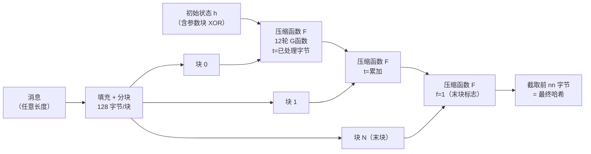
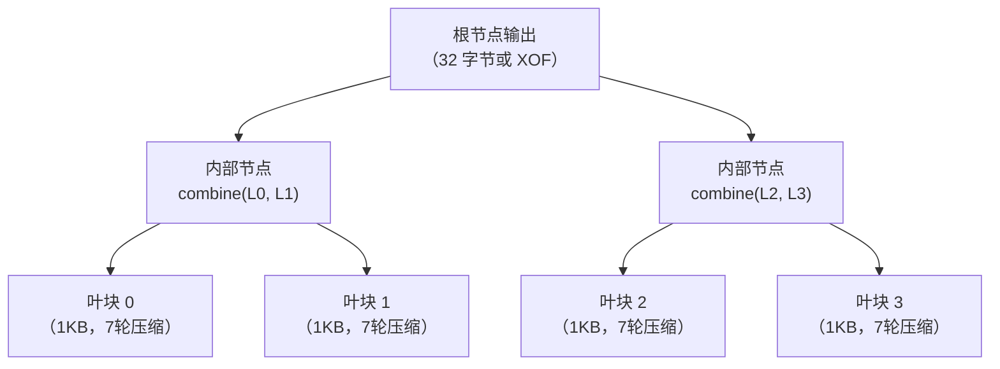

# 密码学（34）· BLAKE2与BLAKE3

> [!abstract] TL;DR
> - **BLAKE2**（2012）：源自 SHA-3 决赛入围的 BLAKE，基于 ChaCha 的 ARX（加-旋转-异或）G 函数；比 MD5、SHA-1、SHA-2、SHA-3 **全部都快**，同时安全性不亚于 SHA-3；内置 keyed / salt / personalization / 树哈希，无需外套 HMAC 即可当 MAC 用。
> - **变体**：BLAKE2b（64 位优化，输出 1–512 位）、BLAKE2s（32 位/嵌入式，输出 1–256 位），BLAKE2bp / BLAKE2sp 为对应的多核并行版。
> - **BLAKE3**（2020）：以 BLAKE2s 压缩函数为核心、叠加 **Merkle 树**结构，天生多线程 + SIMD 并行；单一算法、默认 256 位、支持 **XOF 可扩展输出**，可做流密码/KDF/MAC；是目前通用哈希速度最快的实用算法之一。
> - **典型应用**：Argon2 内部用 BLAKE2b；IPFS / libp2p 内容寻址用 BLAKE2b；cargo（Rust 包管理器）文件指纹用 BLAKE3；WireGuard 握手用 BLAKE2s；Linux 内核 `fscrypt` / `dm-verity` 用 BLAKE2b。
> - **正确使用**：高性能场景优先选 BLAKE3 / BLAKE2b；需要 MAC 直接用 keyed 模式，无需 HMAC；Argon2 / 口令哈希类场景保持使用 BLAKE2b（已被 Argon2 直接集成，无需单独调用）。

---

## 概述与定位

### 历史脉络：从 BLAKE 到 BLAKE2 再到 BLAKE3

SHA-3 竞赛（2007–2012 年，NIST 组织）吸引了 51 个候选方案，最终 5 个进入决赛：Grøstl、JH、Keccak、Skein、**BLAKE**。最终 Keccak 胜出成为 SHA-3（见 [[33.SHA-3与Keccak]]），但 BLAKE 以其极高的软件性能、简洁的设计和充分的安全分析保留了广泛关注。

2012 年，Jean-Philippe Aumasson 等人发布 **BLAKE2**，在原 BLAKE 基础上大幅简化（去掉 SHA-3 赛规定的若干"安全冗余"），吸取 [[20.ChaCha20与Salsa20]] 的 ARX 设计精华，在保持安全性的同时把速度拉到 MD5 之上。

2020 年，由 BLAKE2 作者团队（联合 Samuel Neves、Zooko Wilcox-O'Hearn、JP Aumasson）发布 **BLAKE3**，彻底重构并行架构，引入 Merkle 树使多核 / SIMD 利用率接近线性扩展。

```
SHA-3 竞赛决赛五方案（2009–2012）
┌─────────────────────────────────────────────────────────┐
│  BLAKE ─→ 2012 BLAKE2（ARX，软件极速）                 │
│                  └─→ 2020 BLAKE3（Merkle树+SIMD并行）   │
│  Keccak ─→ SHA-3（NIST 2015 标准）                     │
└─────────────────────────────────────────────────────────┘
```

### 与现有哈希家族对比（速度 × 安全 × 特性）

| 算法 | 核心构造 | 典型速度¹ | 输出长度 | 内置 keyed | 并行 | 状态 |
|------|---------|----------|---------|------------|------|------|
| MD5 | Merkle-Damgård | ≈700 MB/s | 128 bit | 否 | 否 | 已破（碰撞） |
| SHA-1 | Merkle-Damgård | ≈350 MB/s | 160 bit | 否 | 否 | 已破（碰撞） |
| SHA-256 | Merkle-Damgård | ≈300 MB/s | 256 bit | 否 | 否 | 安全 |
| SHA-512 | Merkle-Damgård | ≈450 MB/s²| 512 bit | 否 | 否 | 安全 |
| SHA3-256 | 海绵/Keccak | ≈200 MB/s | 256 bit | 否 | 否 | 安全 |
| BLAKE2b | ARX（类ChaCha） | ≈1 GB/s | 1–512 bit | 是 | 可选 | 安全 |
| BLAKE2s | ARX | ≈600 MB/s | 1–256 bit | 是 | 可选 | 安全 |
| BLAKE3 | Merkle树+ARX | ≥2 GB/s³ | 任意（XOF）| 是 | 天生 | 安全 |

> ¹ 参考值，Intel Core i7 / AVX2，数据来自算法论文及 SUPERCOP 基准，实际因平台差异较大。  
> ² SHA-512 在 64 位 CPU 上因 64 位字宽反而快于 SHA-256。  
> ³ BLAKE3 多线程时随核数近线性扩展，大数据场景下可超过 10 GB/s。

> [!info] 哈希函数基础
> 关于碰撞阻力、原像阻力、Merkle-Damgård 构造与海绵构造的通用原理，参见 [[29.哈希函数原理]]。本篇专注 BLAKE2 / BLAKE3 的算法机制与工程应用。

---

## 原理与机制

### ARX 核心：BLAKE2 的 G 函数

BLAKE2 的核心是从 [[20.ChaCha20与Salsa20]] 的 quarter-round 演化而来的 **G 函数**（有时也叫 G mixing function）。G 函数仅用三种基本操作：

- **A（Add）**：模 2^w 加法（w = 64 用于 BLAKE2b，w = 32 用于 BLAKE2s）
- **R（Rotate）**：按固定旋转量循环右移
- **X（XOR）**：按位异或

这三种操作在现代 CPU 上全部是单周期指令，完全避免了 AES-based 哈希（如 Grøstl）对 AES-NI 指令集的依赖，也不需要 SHA-256 的复杂布尔函数。

**G 函数形式（BLAKE2b，64 位字）**：

```
G(a, b, c, d):
  a = (a + b + m[σ[r][2i]])   mod 2^64
  d = (d XOR a) >>> 32         // 循环右移 32 位
  c = (c + d)                  mod 2^64
  b = (b XOR c) >>> 24         // 循环右移 24 位
  a = (a + b + m[σ[r][2i+1]]) mod 2^64
  d = (d XOR a) >>> 16         // 循环右移 16 位
  c = (c + d)                  mod 2^64
  b = (b XOR c) >>> 63         // 循环右移 63 位
  return a, b, c, d
```

其中 `m[·]` 是当前消息块的 64 位字，`σ[r]` 是第 r 轮的置换表（共 10 个置换，轮流使用，12 轮对应 σ[0]…σ[9], σ[0], σ[1]）。

> [!note] 与 ChaCha quarter-round 的对比
> ChaCha20 的 quarter-round 是 4 步 ARX（见 [[20.ChaCha20与Salsa20]]）；BLAKE2 的 G 函数是 8 步 ARX，并额外引入了消息字 `m[σ[r][·]]` 的混入，使每一步都受消息内容驱动——这是哈希函数与流密码在设计上的核心差异：哈希函数的每轮变换必须让**消息内容真正参与**混合，而不仅仅是密钥流的扩散。

### BLAKE2 状态与整体结构

BLAKE2b 维护一个 **8 × 64 位**（512 位）的内部状态 `h[0..7]`，初始值为 SHA-512 的初始哈希值（从平方根的小数部分取得，与 SHA-2 共用，保证没有后门），并根据参数块（输出长度、keyed 模式等）进行 XOR 调整。

每次处理一个 **128 字节**（16 个 64 位字）的消息块：

```
压缩函数 F(h, m, t, f):
  // h: 当前 8×64 位状态
  // m: 当前 128 字节消息块（16 个字）
  // t: 已处理字节计数器（128 位，防长度扩展）
  // f: 最后一块标志

  v[0..7]  = h[0..7]              // 上半 = 当前状态
  v[8..15] = IV[0..7]             // 下半 = 初始向量常量
  v[12] ^= t_low                  // 注入计数器低64位
  v[13] ^= t_high                 // 注入计数器高64位
  v[14] ^= f ? 0xFFFF...FFFF : 0 // 最后块翻转

  for r in 0..11:                 // 12 轮（BLAKE2b）
    // 列混合（4列）
    G(v[0], v[4], v[8],  v[12], r, 0)
    G(v[1], v[5], v[9],  v[13], r, 1)
    G(v[2], v[6], v[10], v[14], r, 2)
    G(v[3], v[7], v[11], v[15], r, 3)
    // 对角线混合（4条对角线）
    G(v[0], v[5], v[10], v[15], r, 4)
    G(v[1], v[6], v[11], v[12], r, 5)
    G(v[2], v[7], v[8],  v[13], r, 6)
    G(v[3], v[4], v[9],  v[14], r, 7)

  h[i] ^= v[i] ^ v[i+8]  for i in 0..7   // Davies-Meyer 结构
  return h
```

这种"4 列 + 4 对角线"每轮 8 次 G 调用的结构，直接沿用自 ChaCha20 的行-对角线轮次，使消息在 16 个状态字之间快速扩散。



### BLAKE2 的内置特性

BLAKE2 在设计上超越了"纯哈希"的定位，通过**参数块**（parameter block）在首轮状态初始化时一次性注入所有变体信息，无需为 MAC / salt / person 追加额外计算：

| 特性 | 机制 | 用途 |
|------|------|------|
| **keyed 模式** | 密钥（≤64 字节）填入第一块，参数块注明密钥长度 | 直接当 MAC 用，无需 HMAC |
| **salt** | 参数块中 16 字节随机盐 | 域分离，防彩虹表 |
| **personalization** | 参数块中 16 字节任意字节串 | 同一密钥不同用途的域分离 |
| **树哈希** | 参数块中定义叶数/树深/内联长度 | 支持并行 Merkle 树哈希 |

**keyed 模式**（直接用 BLAKE2 作 MAC）：

```python
# 以 Python cryptography / pyblake2 为例
import pyblake2
mac = pyblake2.blake2b(b"message", key=b"secret-32-byte-key-here!1234567", digest_size=32)
print(mac.hexdigest())
```

> [!warning] 示例输出为示意
> 真实输出取决于具体密钥和消息内容。

keyed BLAKE2 的安全性**严格强于** `HMAC-BLAKE2`（后者反而多了一层包装开销），已经在 libsodium 等密码库中作为首选 MAC 方案。

### BLAKE2 变体

| 变体 | 优化目标 | 字宽 | 状态 | 块大小 | 轮数 | 输出 |
|------|---------|------|------|--------|------|------|
| BLAKE2b | 64 位 CPU | 64 位 | 512 位（8×64） | 128 字节 | 12 | 1–64 字节 |
| BLAKE2s | 32 位/嵌入式 | 32 位 | 256 位（8×32） | 64 字节 | 10 | 1–32 字节 |
| BLAKE2bp | 多核 64 位 | 64 位 | 4×BLAKE2b | 128×4 字节 | 12 | 1–64 字节 |
| BLAKE2sp | 多核 32 位 | 32 位 | 8×BLAKE2s | 64×8 字节 | 10 | 1–32 字节 |

BLAKE2bp/2sp 是在应用层并行运行 4 / 8 个 BLAKE2b / 2s 实例再合并，适合多核场景，但引入了额外的合并步骤。BLAKE3 从根本上解决了这个问题。

---

## BLAKE3：Merkle 树并行

### 设计目标与关键思路

BLAKE3 的核心问题意识：BLAKE2 的顺序 Merkle-Damgård 链（每块必须等上一块算完才开始）天然是**串行瓶颈**。在多核 + SIMD 时代，这让 BLAKE2 无法充分利用现代 CPU 的并行能力。

BLAKE3 的解决方案：将消息切成 **1 KB 的叶块**，每个叶块独立计算出一个 32 字节的**链值**（chaining value），然后两两合并成一棵 **Merkle 二叉树**，树根即最终哈希。

**核心要点**：
- 所有叶块的哈希计算彼此**独立**，可以完全并行（CPU 多核 / SIMD 同时算多个块）；
- 中间节点的合并也可并行进行，整棵树的深度是 `log2(N)`，而非线性的 `N`；
- 压缩函数本身就是 BLAKE2s 的变体（7 轮 ARX G 函数，32 位字），极适合 SIMD（AVX2 / AVX-512 / NEON）；
- 由于 Merkle 树的结构，支持**增量更新**（只需重新计算受影响的路径）和**并行验证**。

### BLAKE3 Merkle 树并行结构



每个叶块的压缩也并非单次运算——每 64 字节（一个压缩块）为一步，叶块内部串行链接 16 步（1024 / 64 = 16）；但不同叶块之间完全并行。SIMD 实现中，AVX2 可同时计算 8 个压缩函数实例（8-way SIMD），AVX-512 可同时计算 16 个。

### BLAKE3 压缩函数

BLAKE3 的压缩函数是 BLAKE2s G 函数的简化版（7 轮，32 位字，去掉消息置换表 σ，改为固定顺序），接受：

```
compress(chaining_value, block_words, counter, block_len, flags):
  // chaining_value: 8 × 32 位（256 位状态）
  // block_words: 当前 64 字节块（16 个字）
  // counter: 64 位计数器（支持 XOF）
  // flags: 域分离标志（ROOT / PARENT / KEYED_HASH / DERIVE_KEY_*）

  v[0..7]  = chaining_value
  v[8..15] = [IV[0..7]]   // BLAKE3 固定 IV（同 SHA-256 初始常量）
  v[12] ^= counter_low
  v[13] ^= counter_high
  v[14] ^= block_len
  v[15] ^= flags

  for r in 0..6:           // 7 轮（BLAKE2b 是 12 轮，BLAKE2s 是 10 轮）
    G(v[0], v[4], v[8],  v[12], m[0],  m[1])
    G(v[1], v[5], v[9],  v[13], m[2],  m[3])
    G(v[2], v[6], v[10], v[14], m[4],  m[5])
    G(v[3], v[7], v[11], v[15], m[6],  m[7])
    G(v[0], v[5], v[10], v[15], m[8],  m[9])
    G(v[1], v[6], v[11], v[12], m[10], m[11])
    G(v[2], v[7], v[8],  v[13], m[12], m[13])
    G(v[3], v[4], v[9],  v[14], m[14], m[15])

  return v[0..7] XOR v[8..15]   // 8 × 32 位 = 256 位链值
```

7 轮比 BLAKE2s（10 轮）少，是有意为之：BLAKE3 靠**树的层数**（Merkle 路径上多次压缩）来积累安全性，单个叶节点不需要像独立哈希那样的轮数，整体安全度由树结构保证。

### XOF（可扩展输出函数）

BLAKE3 内置 XOF 能力：在树根处，通过不断递增 `counter` 参数可以输出任意长度的伪随机字节流：

```
output_length = 1 MB   // 任意长度
bytes = blake3_xof(key="", message, output_length)
```

这让 BLAKE3 可以直接充当：
- **KDF**（密钥派生函数，替代 HKDF 的扩展阶段）
- **PRF/流密码**（配合密钥）
- **MAC**（keyed 模式）
- **普通哈希**（输出 32 字节）

所有模式通过 `flags` 域分离，使用同一套代码路径。

### BLAKE3 模式

| 模式 | 调用方式 | flags 含义 | 等价于 |
|------|---------|-----------|--------|
| 普通哈希 | `blake3(message)` | ROOT | 哈希函数 |
| keyed 哈希 | `blake3_keyed(key, message)` | KEYED_HASH \| ROOT | MAC（32 字节密钥） |
| 密钥派生 | `blake3_derive_key(context, material)` | DERIVE_KEY_CONTEXT/MATERIAL | KDF |

---

## 算法流程对比

### BLAKE2b 处理流程

```
输入：消息 M（任意长度），输出长度 nn（1–64 字节），可选密钥 k
初始化：
  h = SHA-512_IV XOR 参数块（nn || kk || 0x01 || 0x01 || ...）
  若有密钥：将密钥填充至 128 字节作为第一块
处理：
  for each 128-byte block b (except last):
    h = F(h, b, t += 128, false)
  h = F(h, last_block_padded, t = total_bytes, true)
输出：h 的前 nn 字节
```

### BLAKE3 处理流程

```
输入：消息 M，可选密钥（32 字节），输出长度 L（默认 32）
分块：将 M 切为 1 KB 叶块（末块可短）
叶节点计算（全部并行）：
  for each 1KB leaf chunk:
    cv = IV（或派生自密钥）
    for each 64-byte block in chunk:
      cv = compress(cv, block, counter, block_len, chunk_flags)
树合并（自底向上，可并行）：
  while len(cv_list) > 1:
    pair (left, right) two-by-two
    parent_cv = compress(left || right, ...)
根输出（XOF）：
  output = 无限流，每 64 字节 compress(root_cv, ..., counter++, ROOT)
  截取前 L 字节
```

---

## 代码与示例

### Python（pyblake2 / hashlib）

Python 3.6+ 的 `hashlib` 内置 `blake2b` / `blake2s`：

```python
import hashlib

# 普通 BLAKE2b（等同 BLAKE2b-256 输出）
h = hashlib.blake2b(b"hello, world", digest_size=32)
print(h.hexdigest())

# keyed BLAKE2b（直接作 MAC）
key = b"secret-key-32bytes!!!!!!!!!!!!" # 恰好 32 字节（实际可 1-64）
mac = hashlib.blake2b(b"message", key=key, digest_size=32)
print(mac.hexdigest())

# 带 salt 和 personalization 的 BLAKE2b
h2 = hashlib.blake2b(
    b"data",
    digest_size=64,
    salt=b"random16bytesalt",     # 最多 16 字节
    person=b"myapp-v1\x00" * 2    # 最多 16 字节
)
print(h2.hexdigest())
```

> [!warning] 示例输出为示意
> 实际输出取决于输入内容和密钥，请勿使用上方示例密钥用于生产。

### Rust（BLAKE3 官方库）

```rust
// Cargo.toml: blake3 = "1"
use blake3;

fn main() {
    // 普通哈希
    let hash = blake3::hash(b"hello, world");
    println!("{}", hash);

    // keyed MAC
    let key = *b"an example very very secret key!"; // 32 字节
    let keyed = blake3::keyed_hash(&key, b"message");
    println!("{}", keyed);

    // XOF：生成 64 字节伪随机输出
    let mut output = [0u8; 64];
    let mut hasher = blake3::Hasher::new();
    hasher.update(b"input data");
    hasher.finalize_xof().fill(&mut output);
    println!("{}", hex::encode(&output));

    // 多线程（自动，BLAKE3 库内部调度）
    let big_data = vec![0u8; 10 * 1024 * 1024];
    let hash_mt = blake3::hash(&big_data); // 自动多线程
    println!("{}", hash_mt);
}
```

### OpenSSL / 命令行

```bash
# BLAKE2b-256（openssl 3.x 支持）
echo -n "hello" | openssl dgst -blake2b512

# 若系统未集成，可用 b2sum（GNU coreutils 8.25+）
b2sum --length=256 /etc/os-release
```

> [!warning] 示例输出为示意
> OpenSSL 版本不同可能有差异；`b2sum` 工具在旧版 coreutils 中可能不可用。

---

## 安全性与正确使用

### 安全性评估

BLAKE2 和 BLAKE3 目前均无已知实际威胁：

| 安全属性 | BLAKE2b | BLAKE2s | BLAKE3 |
|---------|---------|---------|--------|
| 碰撞阻力 | 128 位安全（256 位输出） | 128 位 | 128 位 |
| 原像阻力 | 256 位（最大输出） | 128 位 | 128 位 |
| 长度扩展攻击 | **免疫**（计数器注入设计） | 免疫 | 免疫 |
| keyed 模式安全 | PRF 安全 | PRF 安全 | PRF 安全 |
| 已知最佳攻击 | 仅约简轮数（≤10/12轮）差分 | 类似 | 仅约简轮数 |

长度扩展攻击（length extension attack）是 Merkle-Damgård 类哈希（MD5/SHA-1/SHA-2）的固有弱点（见 [[29.哈希函数原理]]）。BLAKE2/BLAKE3 通过在状态中注入**已处理字节计数器**并在末块设标志位，从根本上消除了这个漏洞——这也是 BLAKE2 可以直接做 MAC 而 SHA-256 不行的根本原因（SHA-256 直接 keyed 有长度扩展漏洞，必须用 HMAC 包装）。

### 变体选型建议

| 场景 | 推荐 | 原因 |
|------|------|------|
| 通用高性能哈希（64 位） | BLAKE3 | 最快，并行，单算法 |
| 需要 XOF / KDF / MAC 一体化 | BLAKE3 | 原生支持，模式清晰 |
| 32 位嵌入式 / IoT | BLAKE2s | 针对 32 位字优化 |
| 与 Argon2 配合（内部 KDF） | BLAKE2b | Argon2 已内置，无需单独调用 |
| 需要 BLAKE 与现有 SHA-2 兼容 | 不适用 | BLAKE 系列与 SHA-2 互不兼容 |
| WireGuard 握手 | BLAKE2s（已固定） | 协议内置，不可更换 |

### 正确使用原则

**1. MAC 场景：直接用 keyed 模式，不要外套 HMAC**

```python
# 正确：直接 keyed BLAKE2b
mac = hashlib.blake2b(data, key=secret_key, digest_size=32)

# 不推荐（功能等价但多此一举）：
import hmac, hashlib
hmac.new(secret_key, data, hashlib.blake2b).digest()
```

**2. keyed 模式密钥长度**

- BLAKE2b：密钥 1–64 字节，推荐 32 或 64 字节
- BLAKE2s：密钥 1–32 字节，推荐 32 字节
- BLAKE3：固定 **32 字节**密钥

**3. 域分离（personalization）**

同一密钥用于不同目的时，必须用 personalization 或 BLAKE3 的上下文字符串区分：

```python
# BLAKE2b：person 参数做域分离
mac_auth = hashlib.blake2b(data, key=k, digest_size=32, person=b"auth-token\x00\x00\x00\x00\x00\x00")
mac_enc  = hashlib.blake2b(data, key=k, digest_size=32, person=b"enc-key\x00\x00\x00\x00\x00\x00\x00\x00\x00")
```

```rust
// BLAKE3：derive_key 做域分离（推荐方式）
let auth_key = blake3::derive_key("myapp 2024 auth token v1", master_key);
let enc_key  = blake3::derive_key("myapp 2024 enc key v1",   master_key);
```

**4. 不要用于口令哈希**

BLAKE2/BLAKE3 是**高速通用哈希**，正因为快，**不适合**直接用于口令存储（攻击者暴力破解成本低）。口令哈希必须用内存硬函数：Argon2（见 [[42.Argon2]]）、bcrypt（见 [[40.bcrypt]]）、scrypt（见 [[41.scrypt]]）。Argon2 内部用 BLAKE2b 作子函数，但其整体构造提供了 Argon2 所需的抗 GPU 暴力破解属性。

**5. 输出截断**

BLAKE2b 默认 64 字节（512 位），若只需 32 字节，通过 `digest_size=32` 参数直接截取（不是先算 512 位再截，而是算法内部就按 32 字节输出），无安全损失。

### 已知局限

| 局限 | 说明 |
|------|------|
| 标准化程度 | SHA-2/SHA-3 有 NIST FIPS 标准；BLAKE2/BLAKE3 无正式 FIPS，合规场景受限 |
| BLAKE3 轮数 | 7 轮（vs BLAKE2s 10 轮），依赖 Merkle 树补偿，理论安全裕量略窄 |
| BLAKE3 规范年龄 | 2020 年发布，密码学分析积累时间较 BLAKE2（2012）短 |
| 量子安全 | 所有输出 ≤256 位在 Grover 算法下有效安全性减半到 128 位，推荐 256+ 位输出 |

---

## 应用场景

### 实际应用举例

**Argon2（口令哈希冠军）**：内部用 BLAKE2b 对输入口令、盐、参数做 512 位哈希，以及在每个 memory block 的 G 函数（基于 BLAKE2b 的 round function）中作为压缩核心（详见 [[42.Argon2]]）。

**WireGuard VPN**：握手协议的 MAC 和混合函数用 BLAKE2s（32 位字长适合嵌入式和低功耗设备），密钥派生也用 BLAKE2s。

**IPFS / libp2p**：内容寻址的哈希默认使用 BLAKE2b-256（作为 multihash 前缀 `0x20`），用于 CID（Content Identifier）。

**Rust cargo**：1.71+ 版本的包完整性校验从 SHA-256 迁移到 BLAKE3，利用其多线程速度加快大依赖树的校验。

**Linux 内核**：`fscrypt`（文件系统加密）和 `dm-verity`（块设备完整性验证）支持 BLAKE2b 作为哈希后端。

**libsodium**：`crypto_generichash*` 系列 API 底层用 BLAKE2b，是推荐的通用哈希/MAC 接口。

---

## 小结

| 维度 | BLAKE2b | BLAKE2s | BLAKE3 |
|------|---------|---------|--------|
| 发布年份 | 2012 | 2012 | 2020 |
| 核心构造 | ARX G 函数 + M-D 链 | ARX G 函数 + M-D 链（32 位） | ARX + Merkle 二叉树 |
| 最大输出 | 512 位 | 256 位 | 任意（XOF） |
| 并行 | 需 BLAKE2bp | 需 BLAKE2sp | 天生（叶块独立） |
| 内置 MAC | 是（keyed） | 是（keyed） | 是（keyed） |
| 内置 KDF | 否 | 否 | 是（derive_key） |
| 典型速度 | ≈1 GB/s | ≈600 MB/s | ≥2 GB/s（多核更快） |
| 主要应用 | Argon2、IPFS、libsodium | WireGuard | cargo、新项目 |

BLAKE 系列的核心价值在于：**同时做到快 + 安全 + 功能丰富**。它们以 [[20.ChaCha20与Salsa20]] 的 ARX 理念为基础，解决了 Merkle-Damgård（MD5/SHA-1/SHA-2）的长度扩展弱点，又比 [[33.SHA-3与Keccak]] 的海绵构造在软件上快 2–5 倍，并通过参数块或 Merkle 树架构原生支持 MAC、KDF、XOF 等多种模式。**在无硬性 FIPS 合规要求的场景下，BLAKE2b/BLAKE3 是新项目哈希与 MAC 的首选**。

---

## 相关阅读

- [[29.哈希函数原理]] ——碰撞阻力、原像阻力、Merkle-Damgård 构造、海绵构造通用原理
- [[33.SHA-3与Keccak]] ——BLAKE 的 SHA-3 决赛对手，海绵构造详解
- [[20.ChaCha20与Salsa20]] ——BLAKE G 函数的直接源头，ARX 流密码设计
- [[36.HMAC]] ——基于哈希的 MAC；BLAKE2/BLAKE3 keyed 模式可直接替代
- [[42.Argon2]] ——以 BLAKE2b 为子函数的现代口令哈希

---

⬅️ 上一篇 [[33.SHA-3与Keccak]] ｜ 🏠 [[00.密码学总览]] ｜ 下一篇 [[35.CBC-MAC与CMAC]] ➡️
