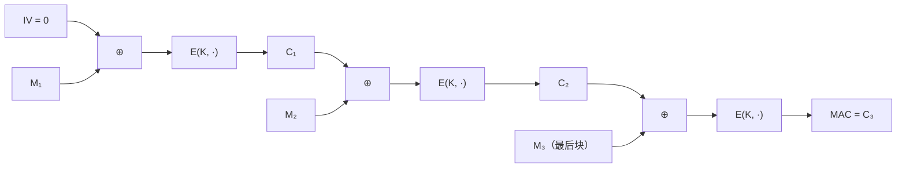
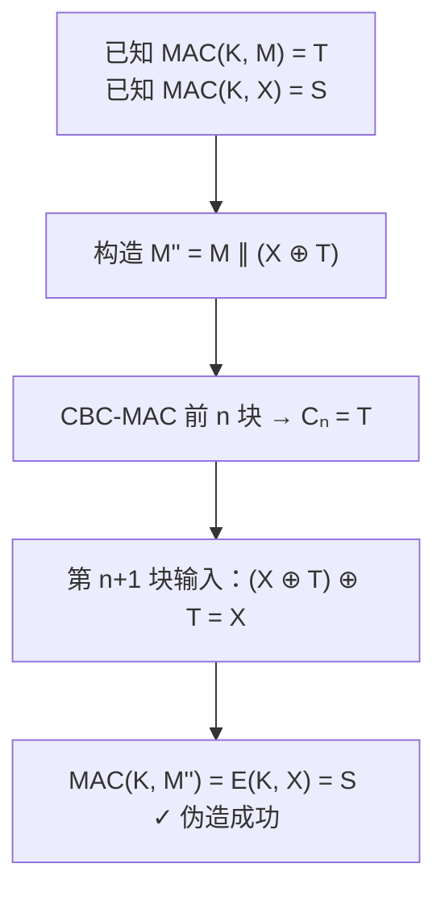
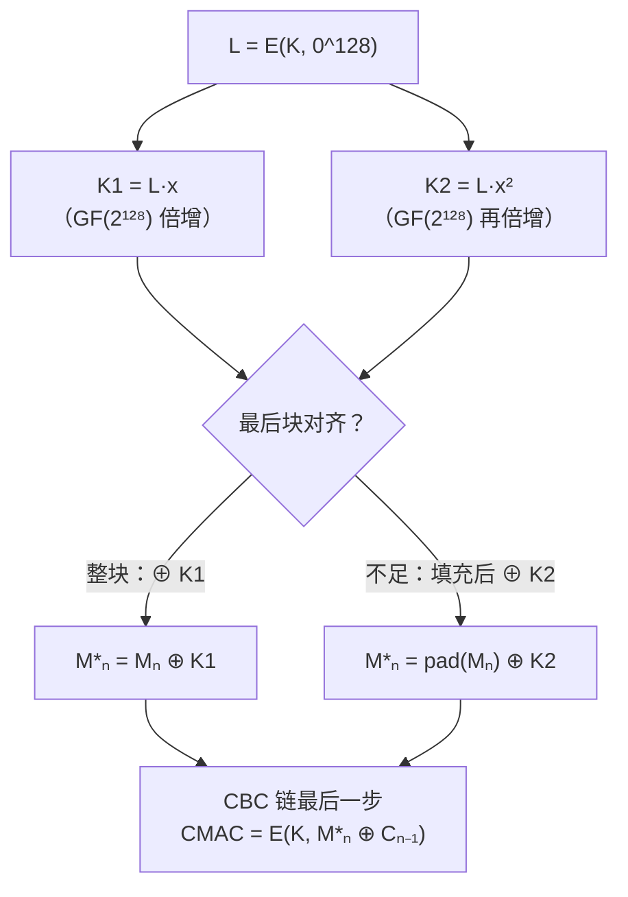

# 密码学（35）· CBC-MAC与CMAC

> [!abstract] TL;DR
> - **MAC（消息认证码）** 是对称密钥方案，同时提供消息**完整性**与**真实性**——只有持有密钥的一方才能生成或验证标签。
> - **CBC-MAC**：把消息分组后做 CBC 链接，取最后一个密文块做标签；IV 固定为 0。**仅对固定长度消息安全**；允许可变长度时存在拼接伪造攻击。
> - **CMAC（NIST SP 800-38B / OMAC1）**：在 CBC-MAC 基础上引入两个子密钥 K1/K2，最后一块处理时按是否需要填充选择子密钥异或，从根本上消除变长攻击。CMAC-AES 是工程首选。
> - 横向对比：CMAC 基于**分组密码**，[[36.HMAC]] 基于**哈希函数**，各有适用场景；需要同时加密+认证时，直接用 AEAD（[[15.AEAD原理与GCM]]）更省心。

---

## 概述与定位

### MAC 是什么

**消息认证码（Message Authentication Code，MAC）** 是一个函数：

```
MAC(K, M) → T
```

其中 K 是**共享对称密钥**，M 是任意长度消息，T 是固定长度的**认证标签**（tag）。通信双方共享 K，发送方计算 T 随 M 一起发送，接收方用同一 K 重新计算并比对。

MAC 提供两种安全属性：

| 属性 | 含义 |
|---|---|
| **完整性** | M 被篡改后，T 不再匹配 |
| **真实性（认证）** | 只有持有 K 的人才能生成合法的 T |

MAC **不提供机密性**——消息 M 是明文传输的；若同时需要机密性，应使用 AEAD（参见 [[15.AEAD原理与GCM]]）。

> [!info] MAC vs 哈希 vs 签名
> - 哈希（SHA-256 等）：无密钥，不能认证来源；
> - MAC：对称密钥，快速，通信双方必须共享密钥；
> - 数字签名（ECDSA/EdDSA）：非对称，任何人可验签，但更慢。

### 本篇在系列中的位置

CBC-MAC 依赖 [[12.CBC模式]] 链接机制与 [[04.AES详解]] 作底层分组密码；CMAC 是 CBC-MAC 的直接升级。后续 [[36.HMAC]] 用哈希函数代替分组密码来构造 MAC，[[37.Poly1305与GMAC]] 则给出多项式/GF 域 MAC（GMAC 是 GCM 的认证组件）。

---

## 原理与机制

### CBC-MAC 的构造

**CBC-MAC** 利用 [[12.CBC模式]] 链接分组密码，思路极简：

1. 将消息 M 按分组大小（AES 为 128 位 = 16 字节）切分：M₁ M₂ … Mₙ；若不足一块则填充。
2. IV 固定为全零块 `0ⁿ`（这是关键——不像加密用随机 IV）。
3. 逐块做 CBC 链接：
   - C₁ = E(K, M₁ ⊕ 0ⁿ) = E(K, M₁)
   - Cᵢ = E(K, Mᵢ ⊕ Cᵢ₋₁)，i = 2…n
4. **MAC = Cₙ**（最后一块密文）。

```
IV=0
 │
 ▼
M₁ ──⊕──► E(K) ──► C₁
                    │
          M₂ ──⊕──► E(K) ──► C₂
                              │
                    M₃ ──⊕──► E(K) ──► C₃ = MAC
```

下图用 Mermaid 展示三块消息的 CBC-MAC 链接：



> [!note] 为何 IV 必须固定为 0
> 若 IV 是随机的，发送方需要把 IV 一同附上，攻击者可以通过修改 IV 来操控第一块的输入，无需密钥即可伪造特定消息的 MAC。固定 IV=0 让 MAC 与 IV 无关，消除这个自由度。

### CBC-MAC 的固定长度安全性

当所有消息**长度固定**时，CBC-MAC 在 PRF（伪随机函数）意义下是安全的——攻击者无法区分 MAC 输出与随机函数。直觉上，固定长度意味着攻击者无法通过拼接来引入额外信息，CBC 链接的雪崩效应保证了不可预测性。

---

## 变长消息的不安全性与攻击

### 长度扩展/拼接伪造攻击

CBC-MAC 对**可变长度消息**不安全。攻击者不需要密钥，只需持有若干"消息–MAC 对"，即可伪造新消息的 MAC。

**攻击示例（拼接伪造）：**

假设攻击者获得：
- `MAC(K, M) = T`（M 是一个完整的 n 块消息，T = Cₙ）

攻击者想要伪造消息 `M' = M ∥ X`（M 后面拼接任意块 X）的 MAC，无需知道 K：

1. M' 的前 n 块处理与 M 完全相同，生成 Cₙ = T。
2. 第 n+1 块：CBC 输入为 `X ⊕ T`，攻击者令 `X' = X ⊕ T`，则 `Cₙ₊₁ = E(K, X' ⊕ T) = E(K, X)`。

但攻击者其实有更简单的形式：已知 `MAC(K, M) = T`，对于任意块 X，构造 `M'' = M ∥ (X ⊕ T)`，则：

```
MAC(K, M'') = E(K, (X ⊕ T) ⊕ T) = E(K, X)
```

如果攻击者碰巧也知道 `MAC(K, X) = S`（即 X 是单块消息的 MAC），那么 `MAC(K, M'') = S`——**攻击者成功伪造了一个从未见过的消息 M'' 的 MAC，且结果等于已知值 S**。



> [!danger] 核心教训
> **裸 CBC-MAC 只能用于固定长度消息。** 任何允许不同长度消息共用同一密钥 K 的场景，都面临上述伪造攻击。历史上多个协议（早期 SSL/TLS 的 MAC-then-Encrypt 变体、某些银行 API）因此受到攻击。

### 为何长度前缀不够

一个直觉修复：在消息前拼接长度字段 `len(M) ∥ M`，不同长度消息的前缀不同，避免直接拼接。但这种方案要求接收方**提前知道消息总长**，不适用于流式处理；且若实现不当（长度字段本身被截断/对齐异常），仍有绕过风险。CMAC 从密码学角度彻底解决这一问题。

---

## CMAC（NIST SP 800-38B）

### 背景与标准

**CMAC（Cipher-based MAC）** 又称 **OMAC1**，由 Tetsu Iwata 与 Kaoru Kurosawa 于 2003 年提出，2005 年被 NIST 标准化为 **SP 800-38B**。CMAC 修复 CBC-MAC 的变长漏洞，同时保持纯分组密码实现、无需额外哈希原语。

### 子密钥生成：K1 与 K2

CMAC 从主密钥 K 派生两个**子密钥** K1、K2，用于区分"最后一块恰好对齐"与"最后一块需要填充"两种情形，从而使不同长度的消息产生不同的计算路径，消除拼接攻击。

**子密钥生成算法（以 AES-128 为例，分组长度 b = 128 位）：**

```
L = E(K, 0^128)          # 用密钥 K 加密全零块

const_Rb = 0x87          # GF(2^128) 中的不可约多项式常数（b=128 时）

if MSB(L) == 0:
    K1 = L << 1          # 左移一位
else:
    K1 = (L << 1) ⊕ const_Rb   # 左移后与 Rb 异或

if MSB(K1) == 0:
    K2 = K1 << 1
else:
    K2 = (K1 << 1) ⊕ const_Rb
```

K1、K2 本质上是 L 在 GF(2¹²⁸) 中乘以 x 和 x² 的结果——这是从多项式域运算导出的"域元素倍增"，保证 K1 ≠ K2 ≠ K，且三者在 GF(2¹²⁸) 中线性无关，消除了代数结构上的攻击入口。

### CMAC 计算流程

设消息 M 共 n 块（至少 1 块）。

**情形一：最后一块 Mₙ 恰好填满（|M| 是 b 的整数倍）：**

```
M*ₙ = Mₙ ⊕ K1
```

**情形二：最后一块 Mₙ 不足 b 位（需要填充）：**

先对 Mₙ 做**10*填充**（在消息末尾追加一个 1 位，再补零至满块）：

```
Mₙ_padded = Mₙ ∥ 1 ∥ 0…0
M*ₙ = Mₙ_padded ⊕ K2
```

**统一 CBC 链接：**

```
C₀ = 0^b
Cᵢ = E(K, Mᵢ ⊕ Cᵢ₋₁)，i = 1…n-1
CMAC = E(K, M*ₙ ⊕ Cₙ₋₁)
```

下图展示 CMAC 对最后一块的子密钥处理：



> [!tip] 为何 K1 ≠ K2 就够了
> 两个子密钥把"整块路径"与"填充路径"分离到不同的函数值域，使攻击者无法通过在 M 后拼接恰好能消除填充的块来构造等价消息；GF(2¹²⁸) 中的线性无关性保证了这种分离是密码学意义上的。

### 与 CBC-MAC 对比

| 特性 | CBC-MAC | CMAC |
|---|---|---|
| 标准 | 无统一标准（IEEE 802.11i 等各自用） | NIST SP 800-38B |
| 变长消息 | **不安全**（拼接伪造） | **安全** |
| 子密钥 | 无 | K1/K2（GF 域倍增） |
| 最后块处理 | 直接加密 | 按对齐情况 ⊕ K1 或 K2 |
| 填充要求 | 需要（实现易出错） | 内置 10* 填充 |
| 实现复杂度 | 低 | 略高（子密钥生成） |
| 适用场景 | **仅固定长度**（慎用） | 通用变长消息 MAC |

---

## 算法流程详解

### CMAC-AES 参数

| 参数 | 值 |
|---|---|
| 底层密码 | AES-128 / AES-192 / AES-256 |
| 分组大小 b | 128 位（16 字节） |
| TAG 长度 | 默认 128 位，可截断至 ≥ 64 位（截断越短越弱） |
| 子密钥常数 Rb | `0x00000000000000000000000000000087` |
| IV | 全零 128 位 |

### 完整伪代码（CMAC-AES-128）

```
function CMAC(K: bytes[16], M: bytes) -> bytes[16]:
    # 子密钥生成
    L = AES_Encrypt(K, 0x00...00)
    K1 = DBLGF(L)        # L·x in GF(2^128)
    K2 = DBLGF(K1)       # L·x^2

    # 分块
    n = ceil(len(M) * 8 / 128)    # 块数（至少 1）
    if n == 0: n = 1

    flag_complete = (len(M) > 0) and (len(M) * 8 % 128 == 0)

    if flag_complete:
        # 最后一块恰好对齐
        M_n = M[(n-1)*16 : n*16] ⊕ K1
    else:
        # 最后一块不足，10* 填充
        last = M[(n-1)*16 :]
        padded = last ∥ 0x80 ∥ (0x00 * (15 - len(last)))
        M_n = padded ⊕ K2

    # CBC 链接
    C = 0x00...00
    for i in 1..n-1:
        C = AES_Encrypt(K, M[i块] ⊕ C)
    T = AES_Encrypt(K, M_n ⊕ C)
    return T

function DBLGF(X: bytes[16]) -> bytes[16]:
    if MSB(X) == 0:
        return X << 1          # 逻辑左移 1 位
    else:
        return (X << 1) ⊕ 0x87   # 模 GF(2^128) 不可约多项式
```

### OpenSSL 调用示例

```bash
# CMAC-AES-128（KEY 为 128 位十六进制，-macopt engine 指定算法）
openssl mac -digest AES-128 -macopt hexkey:2b7e151628aed2a6abf7158809cf4f3c \
  -in message.bin CMAC
```

> [!warning] 示例输出为示意
> 上述命令因 OpenSSL 版本与平台不同，语法可能略有差异；输出为 32 字符十六进制 MAC 标签。

---

## 安全性与正确使用

### 安全参数

| 参数 | 推荐 |
|---|---|
| 底层密码 | AES-128 起，推荐 AES-256（量子场景） |
| TAG 长度 | ≥ 128 位；截断到 64 位仅允许受限场景（如挑战–响应协议，每次不同） |
| 密钥管理 | 每个会话/通道独立密钥；禁止 MAC 密钥与加密密钥复用 |
| 验证 | 使用**常量时间比较**（`hmac.compare_digest` 或等价函数），防止时序侧信道 |

### 已知弱点与注意事项

**1. 禁止用裸 CBC-MAC 于可变长度消息**
如上文攻击所示，这是实现层面最常见的严重错误。务必用 CMAC，或在消息前明确编码长度（并验证实现的正确性）。

**2. TAG 截断需谨慎**
CMAC 输出可截断，但每截断 1 位，伪造成功率翻倍。64 位 TAG 在 2⁶⁴ 次验证查询后可被暴力伪造——适用于离线 MAC（一次性挑战），不适用于高频在线 MAC。

**3. MAC-then-Encrypt 的隐患**
先 MAC 后加密（MAC-then-Encrypt）是历史上易错的组合——解密后才能验证完整性，给攻击者一个"先解密再检测错误"的窗口（Padding Oracle 的来源之一）。**推荐直接使用 AEAD**，如 AES-GCM（[[15.AEAD原理与GCM]]），加密与认证不可分割。

**4. 密钥分离**
若同一密钥同时用于 CMAC 和 AES 加密，可能存在相关密钥攻击面（理论）。工程上始终保持密钥职责分离。

**5. CMAC vs HMAC 的选择**

| 场景 | 推荐 |
|---|---|
| 只有分组密码库（嵌入式/硬件 HSM） | **CMAC-AES** |
| 通用软件，哈希库更常见 | **HMAC-SHA256/SHA3-256** |
| 同时加密+认证 | **AES-GCM 或 ChaCha20-Poly1305** |
| 高速软件 MAC（流处理） | **Poly1305**（[[37.Poly1305与GMAC]]） |

### 正确使用清单

- [x] 使用 CMAC（SP 800-38B），而非裸 CBC-MAC
- [x] TAG 长度 ≥ 64 位（推荐 128 位）
- [x] 常量时间验证，防时序攻击
- [x] 每个独立通信方向使用独立密钥
- [x] 需要机密性时改用 AEAD，不要手动组合 MAC + 加密

---

## 小结

**CBC-MAC** 是用分组密码 CBC 链接构造 MAC 的经典方案：IV 固定为零，取最后密文块为标签。它在固定长度消息上安全，但在变长场景下存在拼接伪造漏洞——攻击者仅凭已知 MAC 对即可构造新消息的合法标签，无需密钥。

**CMAC** 通过引入 GF(2ᵇ) 域倍增派生的两个子密钥 K1/K2，在 CBC 链接的最后一步用它们"标记"消息的长度奇偶性，从密码学上隔离了不同长度的消息空间，根本消除变长攻击。CMAC-AES 是 NIST SP 800-38B 标准方案，工程成熟，是嵌入式与硬件安全场景的首选 MAC。

横向来看：CMAC 基于**分组密码**，[[36.HMAC]] 基于**哈希函数**，两者安全性相当，选型看部署环境的原语可用性；[[37.Poly1305与GMAC]] 则是专为高速流式认证优化的多项式 MAC。需要加密+认证一体时，直接用 AEAD（[[15.AEAD原理与GCM]]）是最省心的工程选择。

---

## 相关阅读

- [[12.CBC模式]] — CBC 链接原理，CMAC 的基础构件
- [[04.AES详解]] — AES 分组密码，CMAC-AES 的底层密码
- [[15.AEAD原理与GCM]] — 加密+认证一体方案（GMAC 是 GCM 的认证组件）
- [[36.HMAC]] — 基于哈希的 MAC，与 CMAC 同级对比
- [[37.Poly1305与GMAC]] — 多项式 MAC，ChaCha20-Poly1305 与 GCM 的认证核心
- NIST SP 800-38B: *Recommendation for Block Cipher Modes of Operation: The CMAC Mode for Authentication*

---

⬅️ 上一篇 [[34.BLAKE2与BLAKE3]] ｜ 🏠 [[00.密码学总览]] ｜ 下一篇 [[36.HMAC]] ➡️
