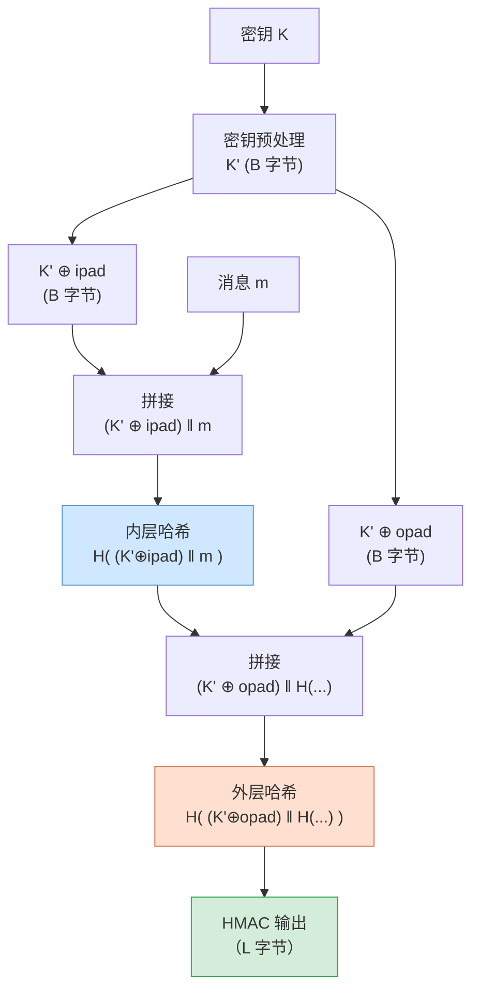

# 密码学（36）· HMAC

> [!abstract] TL;DR
> - **HMAC**（Hash-based Message Authentication Code，RFC 2104）是目前最广泛部署的 MAC 算法，构造为 `HMAC(K, m) = H((K ⊕ opad) ‖ H((K ⊕ ipad) ‖ m))`，其中 ipad = 0x36 重复、opad = 0x5C 重复，各重复一个哈希块长度。
> - **嵌套两层的根本原因**：直接 `H(K ‖ m)` 对 Merkle-Damgård 哈希（SHA-2 等）存在**长度扩展攻击**，攻击者无需知道密钥即可伪造 `H(K ‖ m ‖ 额外数据)`（呼应 [[29.哈希函数原理]] 和 [[32.SHA-2]]）；双层嵌套彻底隔断该漏洞。
> - **可证明安全**：HMAC 的安全性可归约到底层哈希的**弱抗碰撞性（weak collision resistance）**，即使 MD5 已碰撞，HMAC-MD5 理论上仍比裸 `MD5(K ‖ m)` 更安全，但工程上推荐 HMAC-SHA256。
> - **典型应用**：TLS 握手 PRF/记录完整性、JWT HS256、AWS SigV4 请求签名、HKDF 基础构件（[[38.HKDF]]）、Web Cookie 完整性、API 认证。
> - **正确使用三要素**：密钥用 ≥256 位随机数据；优先选 HMAC-SHA256/HMAC-SHA3-256；验证时**必须使用恒定时间比较**（timing-safe compare），否则侧信道攻击可逐字节还原正确 MAC。

---

## 概述与定位

### 为什么需要 HMAC

[[29.哈希函数原理]] 揭示了一个关键弱点：基于 Merkle-Damgård 结构的哈希（MD5、SHA-1、SHA-2 家族）存在**长度扩展攻击**——若攻击者已知 `H(m)` 和 `len(m)`，便可在不知道 `m` 内容的前提下，计算出 `H(m ‖ pad ‖ m')` 对任意附加数据 `m'`。

这意味着：

- `H(K ‖ m)` 不安全：攻击者可伪造扩展消息的合法"签名"；
- `H(m ‖ K)` 同样不安全：容易受到碰撞攻击，因密钥追加在已知消息之后；
- 哈希函数本身没有"密钥输入"接口，直接拼接密钥无法提供密码学意义上的 MAC 保证。

**HMAC**（RFC 2104，1997 年，作者 Bellare、Canetti、Krawczyk）用"嵌套哈希 + 密钥异或填充"的方式，将任意 Merkle-Damgård 哈希安全地升级为 MAC。它是 [[35.CBC-MAC与CMAC]] 的互补方案：CMAC 基于分组密码、HMAC 基于哈希函数。

### 本篇在系列中的位置

| 维度 | 本篇聚焦 | 相邻篇章 |
|---|---|---|
| MAC 构造 | 基于哈希的 MAC | 基于分组密码的 MAC 见 [[35.CBC-MAC与CMAC]] |
| 底层哈希 | SHA-256 为主推荐 | SHA-2 原理见 [[32.SHA-2]]，全貌见 [[29.哈希函数原理]] |
| KDF 基础 | HMAC 是 HKDF 的核心操作 | 具体见 [[38.HKDF]] |
| 工程应用 | TLS / JWT / API 签名 | TLS 见 [[71.详解网络协议/15.TLS协议]] |

---

## 原理与机制

### HMAC 构造公式

设底层哈希函数为 `H`，块长（block size）为 `B` 字节（SHA-256 为 64 字节，SHA-512 为 128 字节），密钥 `K` 经填充/压缩得到 `K'`（长度 = `B`），则：

```
HMAC(K, m) = H( (K' ⊕ opad) ‖ H( (K' ⊕ ipad) ‖ m ) )
```

常量定义：

```
ipad = 0x36 重复 B 次   # inner padding
opad = 0x5C 重复 B 次   # outer padding
K'   = 密钥预处理后的 B 字节块（见下节）
```

`⊕` 为逐字节异或，`‖` 为字节串拼接。

### 密钥预处理

```
if len(K) > B:
    K' = H(K)          # 哈希压缩到输出长度，再右补零到 B 字节
else:
    K' = K ‖ 0x00...   # 右补零到 B 字节
```

常见参数（SHA-256）：

| 参数 | 值 |
|---|---|
| 块长 B | 64 字节 |
| 输出长度 L | 32 字节 |
| ipad | `0x3636...36`（64 字节） |
| opad | `0x5C5C...5C`（64 字节） |

### 为何嵌套两层：抵御长度扩展攻击

Merkle-Damgård 结构（见 [[29.哈希函数原理]]）处理消息 `m` 的过程是：

```
state_0 = IV
state_i = compress(state_{i-1}, block_i)    # 逐块压缩
H(m) = state_final  (接受 MD 强化填充)
```

攻击者已知 `H(K' ⊕ ipad ‖ m)` 后，若没有外层哈希，便可利用内部状态继续压缩 `额外数据`，得到 `H(K' ⊕ ipad ‖ m ‖ pad ‖ m')`——等同于一个新的合法 MAC，而无需知道 K。

HMAC 外层哈希的作用是：**把内层输出视为不透明的"消息"，用另一条以 `K' ⊕ opad` 为前缀的哈希运算包裹**。由于攻击者不知道 `K'`，无法构造合法的外层哈希输入，长度扩展攻击被彻底封堵。

两个不同的填充常量（ipad vs opad）确保内外两层的密钥流**线性独立**，即使 `K'` 相同，`K' ⊕ ipad` 与 `K' ⊕ opad` 在哈希压缩函数层面产生不同的初始状态。

### HMAC 双层嵌套结构



---

## 算法流程与伪代码

### 完整伪代码（以 HMAC-SHA256 为例）

```
function HMAC-SHA256(K, m):
    B = 64        # SHA-256 块长，字节
    L = 32        # SHA-256 输出长度，字节

    # 1. 密钥预处理
    if len(K) > B:
        K' = SHA256(K)           # 压缩，得 32 字节
        K' = K' ‖ (0x00 × (B - L))  # 右补零到 64 字节
    else:
        K' = K ‖ (0x00 × (B - len(K)))  # 右补零到 64 字节

    # 2. 计算填充变体
    ipad_key = K' XOR (0x36 × B)
    opad_key = K' XOR (0x5C × B)

    # 3. 内层哈希
    inner = SHA256(ipad_key ‖ m)

    # 4. 外层哈希
    result = SHA256(opad_key ‖ inner)

    return result  # 32 字节 HMAC 值
```

### 流式计算优化

实际实现通常利用哈希函数的流式接口，避免拼接大字符串：

```
# 等价的流式版本
inner_ctx = SHA256_init()
SHA256_update(inner_ctx, ipad_key)    # 先喂 B 字节
SHA256_update(inner_ctx, m)           # 再喂消息（可分块）
inner = SHA256_final(inner_ctx)

outer_ctx = SHA256_init()
SHA256_update(outer_ctx, opad_key)    # 先喂 B 字节
SHA256_update(outer_ctx, inner)       # 再喂内层摘要（L 字节）
result = SHA256_final(outer_ctx)
```

这样在密钥和填充常量确定后，`ipad_key` 和 `opad_key` 可以预计算并缓存，后续对不同消息的 HMAC 只需两次增量哈希，性能极优。

---

## 安全性分析

### 可证明安全性

HMAC 有严格的安全证明（Bellare 1996/2006）：**若底层哈希函数是弱抗碰撞的伪随机函数（PRF），则 HMAC 是安全的 PRF/MAC**。

关键结论：

- HMAC 的安全性只需要哈希函数满足"弱"安全性，**不需要完全的抗碰撞性**；
- 即使 MD5 的碰撞已被实际攻破（同一密钥下找到两条碰撞的消息），HMAC-MD5 在"密钥未知"场景下理论上依然安全——但工程上仍应迁移；
- HMAC-SHA256 达到 128 位安全级别（穷举 MAC 值需 2^128 次），完全满足现代安全要求。

### 与 CBC-MAC / CMAC 对比

| 维度 | HMAC | CMAC（见 [[35.CBC-MAC与CMAC]]） |
|---|---|---|
| 基础原语 | 哈希函数（SHA-2 等） | 分组密码（AES 等） |
| 标准化 | RFC 2104；FIPS 198 | NIST SP 800-38B |
| 典型性能 | 软件快（SHA-256 有硬件加速） | 软件快（AES-NI） |
| 长度扩展 | 双层嵌套彻底消除 | CBC 模式本身无此问题 |
| 密钥长度 | 推荐 ≥256 位，可哈希压缩 | 与分组密码密钥等长（AES 128/192/256 位） |
| 主要用途 | TLS、JWT、API 签名、HKDF | IEEE 802.11i、AES-CCM、磁盘完整性 |
| 部署广泛度 | 极高（互联网基础设施标准配件） | 高（无线协议、嵌入式） |

### 时序安全比较（Timing-Safe Compare）

MAC 验证的最大陷阱不在于 HMAC 本身，而在于**比较阶段**。

如果使用普通字节串比较（Python `==`、C `memcmp`、Java `Arrays.equals`）：

```
# 危险：早退出导致侧信道
def verify_naive(mac_expected, mac_received):
    return mac_expected == mac_received  # 第一个不匹配字节处立刻返回
```

攻击者可以通过测量响应时间，逐字节猜测正确 MAC 值（**timing oracle 攻击**），将 `O(2^L)` 穷举降为 `O(256 × L)`（对 32 字节 HMAC = 8192 次尝试）。

正确做法——**恒定时间比较**：

```
# 安全：所有字节都比较，时间与结果无关
def hmac_verify(mac_expected, mac_received):
    if len(mac_expected) != len(mac_received):
        return False
    diff = 0
    for a, b in zip(mac_expected, mac_received):
        diff |= a ^ b      # 累积所有差异
    return diff == 0       # 所有字节相同则为 0

# 各语言内置版本（优先使用）：
# Python:  hmac.compare_digest(a, b)
# Go:      subtle.ConstantTimeCompare(a, b)
# C (OpenSSL): CRYPTO_memcmp(a, b, len)
# Java:    MessageDigest.isEqual(a, b)
```

---

## 典型应用场景

### TLS 1.2 PRF 与记录完整性

TLS 1.2（[[71.详解网络协议/15.TLS协议]]）使用 HMAC 的两处核心场景：

1. **PRF（伪随机函数）**：`PRF(secret, label, seed) = P_<hash>(secret, label ‖ seed)`，其中 `P_hash` 基于 HMAC 的 HMAC-based Key Derivation（类 HKDF）。用于生成会话密钥、Finished 消息验证等。
2. **记录层 MAC**：在非 AEAD 密码套件中，每条 TLS 记录追加 `HMAC-SHA(write_MAC_key, seq_num ‖ type ‖ version ‖ len ‖ data)`，验证数据完整性。

TLS 1.3 已全面转向 AEAD，但 HMAC 仍在握手 HKDF 中发挥核心作用。

### JWT HS256

JSON Web Token 的 `HS256` 算法：

```
header  = base64url({"alg":"HS256","typ":"JWT"})
payload = base64url({...claims...})
signature = HMAC-SHA256(secret, header + "." + payload)
token = header + "." + payload + "." + base64url(signature)
```

验证方用相同 secret 重算签名并恒定时间比较，确认 token 未被篡改。**HS256 是对称方案**，签发方和验证方必须共享同一 secret——对多方场景应改用 RS256/ES256（非对称签名）。

### AWS SigV4 请求签名

AWS Signature Version 4 对每个 API 请求计算多层 HMAC：

```
kDate    = HMAC-SHA256("AWS4" + secret_key, date)
kRegion  = HMAC-SHA256(kDate, region)
kService = HMAC-SHA256(kRegion, service)
kSigning = HMAC-SHA256(kService, "aws4_request")

signature = HMAC-SHA256(kSigning, string_to_sign)
```

这种"密钥派生树"正是 HMAC 作为 PRF 的应用，与 [[38.HKDF]] 的提取-扩展思路同源。

### HKDF 的核心构件

HKDF（[[38.HKDF]]，RFC 5869）完全基于 HMAC：

```
# 提取（Extract）
PRK = HMAC-Hash(salt, IKM)

# 扩展（Expand）
T(1) = HMAC-Hash(PRK, info ‖ 0x01)
T(2) = HMAC-Hash(PRK, T(1) ‖ info ‖ 0x02)
...
OKM = T(1) ‖ T(2) ‖ ...   # 按需截取
```

HMAC 提供 PRF 保证，使 HKDF 能将"弱随机"输入密钥材料（IKM）安全地扩展为多条密钥流。

### Web Cookie 完整性

常见 Web 框架（Django、Express、Rails 等）对 session cookie 附加 HMAC 签名：

```
cookie_value = data + "." + HMAC-SHA256(server_secret, data)
```

服务器收到 cookie 后重算 HMAC 并恒定时间比较，防止客户端伪造或篡改 session 数据。

---

## 安全性与正确使用

### 参数选型

| 参数 | 推荐 | 避免 |
|---|---|---|
| 底层哈希 | SHA-256、SHA-384、SHA-512、SHA-3-256 | MD5（已部分弱化）、SHA-1（已不推荐） |
| 密钥长度 | ≥256 位（32 字节）随机数据，推荐与输出长度一致 | 短于 128 位；人类可记忆密码（应先走 KDF） |
| 截断输出 | 需截断时保留 ≥128 位（例如 HMAC-SHA256 截前 16 字节） | 截断至 <64 位（丧失安全意义） |

### 密钥管理

- **密钥随机生成**：使用 CSPRNG（`os.urandom(32)`、`/dev/urandom`），不要用哈希密码直接作密钥；
- **密钥轮换**：长期使用的 HMAC 密钥（如 cookie secret）应定期轮换；
- **密钥分离**：不同用途（签名、加密、派生）使用不同密钥，可通过 HKDF 从主密钥派生；
- **人类输入的密码**：需先通过 PBKDF2、Argon2 等密码哈希函数增加计算成本，再用结果作 HMAC 密钥。

### 已知弱点与误用

| 误用模式 | 后果 | 正确做法 |
|---|---|---|
| 裸哈希 `H(K ‖ m)` 作 MAC | 长度扩展攻击伪造 MAC | 改用 HMAC |
| 普通 `==` 比较 MAC | Timing oracle 逐字节还原 | 恒定时间比较 |
| 密钥过短（<128 位） | 暴力穷举密钥 | 随机生成 ≥256 位密钥 |
| 同一密钥多用途复用 | 不同协议上下文干扰 | 每用途独立派生密钥 |
| HMAC-MD5 新部署 | 工程形象问题，MD5 进一步弱化风险 | 新部署选 HMAC-SHA256 |
| JWT secret 硬编码 | 代码泄露即密钥泄露 | 从安全存储读取，定期轮换 |

### HMAC-SHA256 与 HMAC-SHA3-256 的选择

两者安全性等价（均 128 位安全），区别在于：

- **HMAC-SHA256**：部署最广，硬件加速支持最成熟（x86 SHA-NI 扩展），是 TLS/JWT/HKDF 的默认选择；
- **HMAC-SHA3-256**：SHA-3 采用海绵结构，天然无长度扩展漏洞，HMAC 包装对它来说某种程度是冗余保护（但无害）；若系统已有 SHA-3 原语，HMAC-SHA3-256 是可靠的未来替代。

---

## 小结

HMAC 以"双层嵌套 + 密钥异或填充"这一精巧构造，将任意 Merkle-Damgård 哈希安全地升格为 MAC：

- **内层哈希**将消息与密钥绑定；
- **外层哈希**将内层输出再次与密钥绑定，并彻底消除长度扩展攻击面；
- **两个不同填充常量（ipad/opad）** 保证内外密钥流线性独立。

可证明安全性使 HMAC 成为"把哈希变成 MAC"的标准方法，HMAC-SHA256 是现代互联网基础设施（TLS、JWT、AWS SigV4、HKDF）的事实标准 MAC。工程使用中的两条铁律：**密钥足够长且随机；验证必须恒定时间比较**。

---

## 相关阅读

- [[29.哈希函数原理]] —— Merkle-Damgård 结构与长度扩展攻击原理，理解 HMAC 存在的根本动机
- [[32.SHA-2]] —— HMAC-SHA256 底层哈希算法详解，块长/输出长度参数来源
- [[35.CBC-MAC与CMAC]] —— 分组密码路线的 MAC，与 HMAC 形成互补对照
- [[38.HKDF]] —— HMAC 作为 PRF 的核心应用，提取-扩展密钥派生
- [[71.详解网络协议/15.TLS协议]] —— HMAC 在 TLS 握手与记录层的具体部署

---

⬅️ 上一篇 [[35.CBC-MAC与CMAC]] ｜ 🏠 [[00.密码学总览]] ｜ 下一篇 [[37.Poly1305与GMAC]] ➡️
