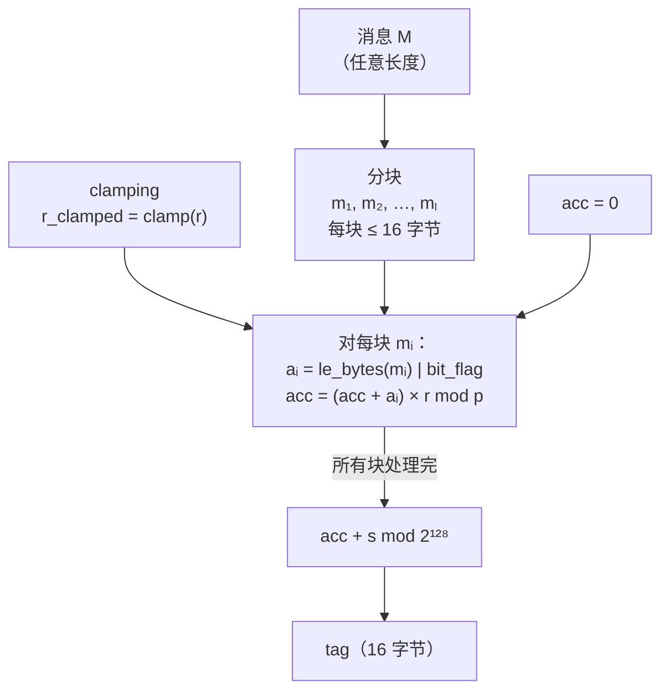

# 密码学（37）· Poly1305与GMAC

> [!abstract] TL;DR
> - **Poly1305**（Bernstein）和 **GMAC** 是当今最主流的两种"通用哈希 MAC"（universal hash MAC）：速度极快、可并行，但它们都是**一次性 MAC**——每条消息必须使用**唯一的密钥/nonce**，复用即可伪造。
> - Poly1305 在素数域 **GF(2¹³⁰−5)** 上把消息当多项式系数，用密钥 r 求值再加 s mod 2¹²⁸；实践中配 **ChaCha20** 每次派生 (r, s)，见 [[16.ChaCha20-Poly1305]]。
> - GMAC 是 AES-GCM 的认证部分（GHASH 在 **GF(2¹²⁸)**，H = E_K(0)），可单独用作 MAC（仅认证不加密）；nonce 同样必须唯一，见 [[15.AEAD原理与GCM]]。
> - 两者相比 [[36.HMAC]]：计算更快、更易硬件加速、支持并行；但"一次性密钥"要求更严——误用代价远高于 HMAC。
> - 核心原则：这两种 MAC **通常作为 AEAD 内部组件使用**，而非独立 MAC；若独立使用，必须严格保证密钥/nonce 唯一性。

本篇是「MAC」专题的第三篇。前置知识：分组密码基础 [[04.AES详解]]、GCM/GHASH 原理 [[15.AEAD原理与GCM]]、ChaCha20-Poly1305 组合 [[16.ChaCha20-Poly1305]]、基于哈希的 MAC [[36.HMAC]]。

---

## 概述与定位

### 为什么需要"通用哈希 MAC"

[[36.HMAC]] 以哈希函数（SHA-2 等）为基础，安全性依赖哈希函数的抗碰撞性，通用性强，但每字节消息至少需要一次哈希压缩，速度受限于哈希函数本身。

现代高速网络和存储场景要求 MAC 能跟上 **10–100 Gbps** 的吞吐，同时尽量压低延迟。密码学界给出的答案是**通用哈希 MAC（Universal Hash MAC）**：

> **核心思路**：把认证问题分成两层——先用一个**通用哈希函数**（计算极快、可并行）把消息压成一个短摘要，再用一个**一次性密钥**对摘要加密/混淆，生成标签。

"通用哈希函数"不要求像 SHA-2 那样抗碰撞，只需满足更弱的**ε-差分均匀性**（ε-almost universal）：对任意两条不同消息，它们的哈希冲突概率不超过 ε。在此基础上，借助**一次性密钥**的信息论保证，整个 MAC 即可达到 ε 阶的伪造概率。

这一框架由 Wegman 和 Carter 在 1981 年奠定——因此此类 MAC 也称 **Wegman-Carter MAC**：

```
Wegman-Carter MAC：
  tag = H_r(m) XOR E_K(nonce)
       ├── H_r(m)：以 r 为参数的通用哈希，极快
       └── E_K(nonce)：对 nonce 的加密，生成一次性掩码
```

Poly1305 和 GMAC 均是 Wegman-Carter 框架的具体实例化，区别在于使用的代数结构不同。

### 一次性 MAC 的信息论保证

与 HMAC 的计算安全性（依赖哈希函数单向性）不同，Wegman-Carter MAC 在理论上可以达到**信息论安全**（unconditional security）：

- 若 (r, s) 真正随机且每条消息唯一使用，伪造一条消息的成功概率≤ 1/2¹²⁸（对 128 位标签）。
- 这个保证**不依赖攻击者的计算能力**，即使是量子计算机也无法打破。

代价是：**每条消息必须用不同的 (r, s)**。一旦复用，攻击者可以通过联立方程直接恢复 r，进而伪造任意消息——这是比 HMAC nonce 复用更严重的失效模式（HMAC 重用 nonce 不构成直接威胁）。

---

## 原理与机制

### 多项式求值的信息论 MAC

Poly1305 和 GMAC 本质上都是**在某个有限域上把消息当多项式系数求值**。直观地理解：

- 把消息 m 分成若干块 m₁, m₂, …, mₗ
- 以秘密密钥 r 为"变量"，计算多项式 `P(r) = m₁·r^l + m₂·r^(l-1) + … + mₗ·r¹`
- 再加上一次性掩码 s，得到标签 `tag = P(r) + s`

为什么这是安全的？若攻击者想伪造另一条消息 m'，需要找到满足 `P'(r) + s = tag'` 的值，但在不知道 r 和 s 的情况下，这等价于猜测 r——对于 l 次多项式，猜对的概率恰好≤ l/p（p 是域的阶），即**ε-AXU（almost XOR universal）**性质。

### Poly1305 的代数结构

Poly1305 工作在素数域 **GF(2¹³⁰−5)** 上，即模数为：

```
p = 2¹³⁰ − 5 = 0x3fffffffffffffffffffffffffffffffb
```

这个模数选择非常精妙：
- **2¹³⁰ = 2 × 2¹²⁸**，即 130 位，正好比两个 64 位寄存器（128 位）多两位，便于用整数运算实现模约减；
- **−5** 使得 `2¹³⁰ ≡ 5 (mod p)`，模约减只需加法和移位，无需大数除法。

消息被分成 **16 字节（128 位）块**，每块后面追加一个 1 bit（以区分不同长度消息），构成 130 位整数：

```
对每块 mᵢ（小端序读取 16 字节，追加 bit 1）：
  aᵢ = bytes_to_int_LE(mᵢ) | (1 << 8*len(mᵢ))

多项式求值（Horner 方法）：
  acc = 0
  for each block aᵢ:
      acc = (acc + aᵢ) × r  mod p
  tag = (acc + s) mod 2¹²⁸
```

Horner 方法（秦九韶算法）把嵌套乘法展开为线性序列，每块只需一次乘法和一次加法——这是计算多项式最高效的方式。

### r 的 Clamping（截断）

为了防止侧信道攻击并简化实现，Poly1305 要求对密钥 r 做 **clamping**（截断）：

```
r 是 16 字节密钥，clamping 规则：
  第  3 字节（0-based index  3）：低 4 位清零（& 0x0f）
  第  7 字节：                    低 4 位清零（& 0x0f）
  第 11 字节：                    低 4 位清零（& 0x0f）
  第 15 字节：                    低 4 位清零（& 0x0f）
  第  4 字节：                    低 2 位清零（& 0xfc 清除 bit0/bit1）
  第  8 字节：                    低 2 位清零（& 0xfc 清除 bit0/bit1）
  第 12 字节：                    低 2 位清零（& 0xfc 清除 bit0/bit1）

即 r 的某些位必须为 0，使 r < 2¹²⁴ 且满足特定对齐约束。
```

Clamping 的目的：
1. **简化模约减**：限制 r 的大小使得 acc × r 的中间结果不会太大，避免多次模约减；
2. **防止密钥弱点**：确保 r 不落在某些"简并"值上（如 r = 0），使多项式 MAC 退化为常数；
3. **恒定时间实现**：有了约束，可以用固定步骤完成乘法，减少数据依赖的分支。

### GMAC 的代数结构：GF(2¹²⁸) 上的多项式

GMAC 是 AES-GCM（见 [[15.AEAD原理与GCM]]）中 GHASH 函数的直接应用：

```
认证密钥 H = AES_K(0¹²⁸)   （对全零块加密）

GHASH 多项式（在 GF(2¹²⁸) 上，模多项式 x¹²⁸ + x⁷ + x² + x + 1）：
  块序列：AAD 填充 || 密文填充 || len(AAD) || len(ciphertext)
  X₀ = 0
  Xᵢ = (Xᵢ₋₁ XOR Cᵢ) · H   （GF(2¹²⁸) 乘法）

GMAC-tag = GHASH(H, data) XOR E_K(nonce || 0x00000001)
```

与 Poly1305 的关键差异：

| 维度 | Poly1305 | GHASH/GMAC |
|---|---|---|
| 域 | GF(2¹³⁰−5)（素数域，整数模运算） | GF(2¹²⁸)（二元扩域，XOR + 多项式乘法） |
| 乘法 | 整数模乘，可用 64 位整数指令 | 无进位乘法（carryless multiply，PCLMULQDQ） |
| 密钥 | 每条消息用新的 (r, s) | H 固定，E_K(nonce||ctr) 一次性 |
| 硬件加速 | ARX 指令（ARM/x86 通用） | PCLMULQDQ（x86）/ PMULL（ARM） |

GF(2¹²⁸) 的乘法在硬件中有专用指令（Intel PCLMULQDQ、ARMv8 PMULL），使 GMAC/GHASH 在支持 AES-NI 的平台上极快。

---

## 算法流程

### Poly1305 完整流程

```
输入：
  key   = r || s   （32 字节：r 16 字节 + s 16 字节，每条消息唯一）
  msg   = M        （任意长度消息）

步骤：
1. Clamping：r_clamped = clamp(key[0:16])
2. 消息分块：将 M 分成 16 字节块 m₁, m₂, …, mₗ
   最后一块不足 16 字节时右侧填充（pad），追加的 1 bit 位置反映实际长度
3. 多项式求值（模 p = 2¹³⁰ − 5）：
     acc = 0
     for i in 1..l:
         aᵢ = le_bytes_to_num(mᵢ) | (1 << (8 × len(mᵢ)))
         acc = (acc + aᵢ) × r_clamped  mod  p
4. 最终标签：
     tag = (acc + s)  mod  2¹²⁸
     tag = num_to_le_bytes(tag, 16)   （小端序输出 16 字节）

输出：tag（16 字节 / 128 位）
```



### ChaCha20-Poly1305 中的密钥派生

在 AEAD 场景中，(r, s) 绝不能预先固定，而是**每次由 ChaCha20 密钥流的前 32 字节派生**（见 [[16.ChaCha20-Poly1305]]）：

```
poly1305_key_gen(key_256bit, nonce_96bit):
    block = ChaCha20_block(key_256bit, counter=0, nonce_96bit)
    r = block[0:16]     # 前 16 字节
    s = block[16:32]    # 后 16 字节
    return r, s
```

这样：
- 每条消息（不同 nonce）产生不同的 (r, s)，满足一次性要求；
- r 和 s 从密钥流随机生成，与消息无关，无法被攻击者影响；
- ChaCha20 的安全性保证了 (r, s) 的伪随机性。

### GMAC 独立使用场景

当只需认证、不需加密时，GCM 可以以**纯 GMAC 模式**使用（密文长度为 0，只有 AAD）：

```
GMAC(K, nonce, data):
    H = AES_K(0¹²⁸)
    tag = GHASH(H, data, len=0) XOR AES_K(nonce || 0x00000001)
    return tag（128 位，可截断为 64 或 96 位，但会降低安全性）
```

典型使用场景：网络设备对报头做认证（数据量大、不加密）、数据库完整性校验标签。

---

## 与 HMAC 的对比

| 维度 | Poly1305 | GMAC | HMAC |
|---|---|---|---|
| 理论基础 | 信息论 MAC（Wegman-Carter） | 信息论 MAC（Wegman-Carter） | 计算安全 MAC |
| 安全假设 | 无（信息论） | 无（信息论） | 依赖哈希函数抗碰撞 |
| 并行性 | 可并行（树状求值） | 可并行（GHASH 流水） | 通常串行（Merkle-Damgård） |
| 硬件加速 | ARX 通用指令 | PCLMULQDQ / PMULL | SHA-NI（部分平台） |
| 密钥复用 | 绝不可（直接伪造） | 绝不可（直接伪造） | 可安全复用 |
| nonce 要求 | 每消息唯一 | 每消息唯一 | 无 nonce（密钥固定） |
| 误用代价 | 严重（可伪造所有消息） | 严重（暴露 H，可 Forbidden Attack） | 较低（nonce 无概念） |
| 典型场景 | ChaCha20-Poly1305 AEAD | AES-GCM AEAD / 独立 GMAC | OAuth、JWT、独立消息认证 |
| 量子抵抗 | 信息论安全 | 信息论安全 | 依赖 SHA-2/3 安全性 |

> [!info] 为什么 HMAC 更常用于"独立 MAC"场景
> HMAC 不需要 nonce，密钥可以长期固定，API 极简（`HMAC(K, m)` 无需额外状态），对工程师更友好，误用空间小。Poly1305 和 GMAC 的正确使用需要严格的 nonce 管理，因此最适合打包在 AEAD 算法内部由框架保证正确性。

---

## 安全性与正确使用

### 一次性密钥复用的灾难

**Poly1305 复用 (r, s) 的后果**：

设攻击者观察到同一 r 对两条消息 m 和 m' 的标签 t 和 t'：

```
t  = P_r(m)  + s   mod 2¹²⁸
t' = P_r(m') + s   mod 2¹²⁸

两式相减：
t − t' = P_r(m) − P_r(m')  mod 2¹²⁸
       = (m₁ − m'₁)·r^l + (m₂ − m'₂)·r^(l-1) + …
```

消息已知，标签已知，这是关于 r 的多项式方程——消息块数为 l，则可以在多项式环上解出 r 的 l 个候选值（有限域多项式根个数≤次数），逐一验证即可完全恢复 r；恢复 r 后再恢复 s，攻击者即可伪造任意消息标签。

**GMAC/GHASH 复用 nonce 的后果（Forbidden Attack）**：

```
若两次 GMAC 使用相同 nonce：
  t  = GHASH(H, C)  XOR  E_K(nonce||1)
  t' = GHASH(H, C') XOR  E_K(nonce||1)

t XOR t' = GHASH(H, C) XOR GHASH(H, C')
         = (C ⊕ C') · H^k + 差分项   （GF(2¹²⁸) 上）
```

攻击者可从 t ⊕ t' 建立关于 H 的方程（GF(2¹²⁸) 多项式），解出 H，进而伪造任意 AAD 和密文对应的标签。这正是 AES-GCM nonce 重用攻击（GCM nonce reuse / Forbidden Attack）的核心——详见 [[15.AEAD原理与GCM]]。

### 安全参数与推荐做法

| 参数 | 推荐值 | 说明 |
|---|---|---|
| Poly1305 标签长度 | 128 位（不截断） | 截断至 64 位安全性降至 2⁻⁶⁴ |
| ChaCha20-Poly1305 nonce | 96 位，每消息唯一 | 随机或计数器（计数器更安全，避免碰撞） |
| AES-GCM / GMAC nonce | 96 位，每消息唯一 | 同上；随机 nonce 在 2³² 条消息后碰撞概率达 50% |
| GMAC 独立使用标签 | 128 位 | 96 位或 64 位截断须有充分理由 |
| 独立使用 Poly1305 | 不推荐 | 需自行管理密钥派生，不如直接用 ChaCha20-Poly1305 |

### 通常应作为 AEAD 内部组件

> [!warning] 核心建议
> **不要直接调用 Poly1305 或 GMAC 构建自定义 MAC 协议**，除非你完全理解并能保证：
> 1. 密钥/nonce 的唯一性在整个系统生命周期内严格强制执行；
> 2. 密钥派生（如 ChaCha20 派生 Poly1305 密钥）的实现完全符合规范；
> 3. 标签比较使用常数时间比较，防止时序侧信道。
>
> **推荐做法**：直接使用经过审计的 AEAD 实现（`libsodium`、`BoringSSL`、`Go crypto/cipher`），让框架保证正确性。

### 实现安全：恒定时间比较

```python
# 错误示例：短路比较，泄露标签匹配字节位置
if computed_tag == received_tag:    # 不安全！

# 正确：恒定时间比较（Python hmac 模块）
import hmac
if hmac.compare_digest(computed_tag, received_tag):   # 安全
```

### 独立使用 GMAC 的场景与注意事项

GMAC 单独用作 MAC（不加密）的合法场景：

1. **存储完整性校验**：对大量数据块批量生成 MAC，只需认证不需加密（数据已有其他安全信道传输）；
2. **网络认证报头**：交换机/路由器对数据包报头认证（MACsec 等）；
3. **硬件 TPM 认证**：配合硬件生成唯一 nonce。

在这些场景中，**nonce 唯一性是系统级约束，必须由架构保证**，而不能依赖"概率上不太可能碰撞"。

---

## 小结

Poly1305 和 GMAC 代表了 MAC 设计的另一条路径：**信息论保证、极速实现、硬件友好**，代价是**一次性密钥/nonce 的强约束**。它们的设计哲学是：

- 把"速度极快"的通用哈希（多项式求值）与"绝对安全"的一次性掩码组合，获得比 HMAC 更高的理论安全下界；
- 把"nonce 管理的复杂性"封装进 AEAD 算法（ChaCha20-Poly1305、AES-GCM）内部，让应用层只需保证 nonce 唯一。

理解这两种 MAC 的内部机制，不仅帮助你正确使用 AEAD 算法，也能让你在排查 nonce 复用漏洞、评估密码协议设计时更有洞察力。

| 算法 | 域 | 密钥 | 标准/使用 |
|---|---|---|---|
| Poly1305 | GF(2¹³⁰−5) | (r, s) 每消息派生 | RFC 8439，ChaCha20-Poly1305 内部 |
| GHASH/GMAC | GF(2¹²⁸) | H 固定，E_K(nonce) 一次性 | NIST SP 800-38D，AES-GCM 内部 |
| HMAC | 无限域（哈希） | 长期固定密钥 | RFC 2104，OAuth/JWT/独立 MAC |

---

## 相关阅读

- [[15.AEAD原理与GCM]] — GCM 模式、GHASH 详解、nonce 重用攻击
- [[16.ChaCha20-Poly1305]] — Poly1305 作为 AEAD 组件的完整用法
- [[36.HMAC]] — 基于哈希的 MAC，与本篇互补
- [[38.HKDF]] — 密钥派生函数，可用于生成 Poly1305 的 (r, s)

---

⬅️ 上一篇 [[36.HMAC]] ｜ 🏠 [[00.密码学总览]] ｜ 下一篇 [[38.HKDF]] ➡️
