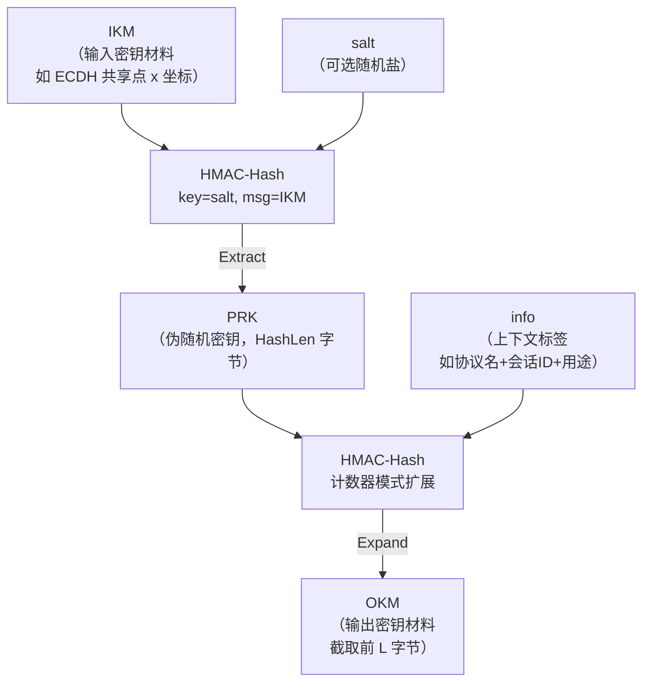
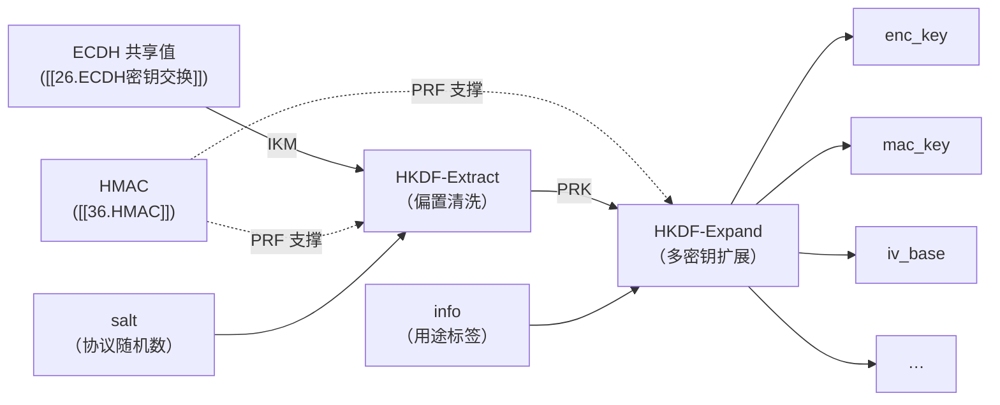

# 密码学（38）· HKDF

> [!abstract] TL;DR
> - **KDF（密钥派生函数）**：从一段密钥材料派生一条或多条密钥。按输入熵高低分两类：**高熵输入**（DH/ECDH 共享密钥）用 HKDF；**低熵口令**用 PBKDF2/bcrypt/Argon2，加盐迭代拉慢暴力破解——混淆两类是工程大忌。
> - **HKDF（RFC 5869）**实现"提取-扩展（Extract-then-Expand）"两阶段范式：先用 HMAC 把杂乱的输入密钥材料（IKM）"提取"成固定长伪随机密钥（PRK），再用 HMAC 计数器模式"扩展"成任意长输出密钥材料（OKM）。
> - **HKDF-Extract** 核心：`PRK = HMAC-Hash(salt, IKM)`，输出均匀分布的伪随机字节串。
> - **HKDF-Expand** 核心：`OKM = T(1) ‖ T(2) ‖ …`，每轮 `T(i) = HMAC-Hash(PRK, T(i-1) ‖ info ‖ i)`，`info` 做上下文绑定，防止不同场景密钥互换使用。
> - **典型应用**：TLS 1.3 密钥调度、Signal 协议、Noise 协议框架、将 ECDH 共享点 x 坐标派生为会话密钥（呼应 [[26.ECDH密钥交换]]）。
> - **两步的意义**：Extract 去偏（bias removal）、Expand 定长扩展，分工清晰；直接 `Hash(DH output)` 缺乏上下文绑定与域分离，容易导致密钥复用漏洞。

---

## 概述与定位

### KDF 总论：从密钥材料到可用密钥

现代密码协议里，"原始秘密"（raw secret）几乎从不直接当加密密钥用。原因有三：

1. **统计偏置**：DH/ECDH 共享点坐标、预共享秘密（PSK）等，虽然"很随机"，但未必均匀分布在整个字节串空间。直接截取前 N 字节会带着原始偏置进入密钥。
2. **多密钥需求**：一次握手往往需要多条密钥——加密密钥、MAC 密钥、IV 基、服务端/客户端各一套。必须有一种可控的方式从一个秘密源派生多条互相独立的密钥。
3. **上下文绑定**：同一个 DH 共享值若被复用于不同会话或不同用途，密钥材料可能隐式关联，带来降级或跨协议攻击。派生时绑定上下文信息（协议版本、会话 ID、密钥用途标签）可以防止这类滥用。

**KDF** 正是解决这三个问题的函数家族：给定一段"密钥材料"，输出一条（或多条）伪随机、均匀分布、适合直接用于密码操作的密钥。

| KDF 类别 | 适合的输入 | 典型场景 | 代表算法 |
|---|---|---|---|
| **通用 KDF**（不拉慢） | **高熵**：DH 共享密钥、随机字节串、PSK | 协议密钥调度、多密钥扩展 | HKDF、SP 800-56C、X9.63 KDF |
| **口令 KDF**（刻意慢） | **低熵**：人类口令（~30 bit） | 密钥存储、认证、口令哈希 | PBKDF2（[[39.PBKDF2]]）、bcrypt、Argon2（[[42.Argon2]]） |

> [!warning] 不要混用两类 KDF
> HKDF 对低熵口令**没有保护**——它不迭代、不消耗计算资源，攻击者可以用 GPU 暴力枚举口令后直接过一遍 HKDF。**口令必须用口令 KDF**（PBKDF2/Argon2），参见 [[39.PBKDF2]] 与 [[42.Argon2]]。反过来，对高熵输入（如 32 字节随机密钥）用 PBKDF2 的高迭代数属于资源浪费，且迭代并不增强熵。

### HKDF 的位置

HKDF（HMAC-based Extract-and-Expand Key Derivation Function）由 Hugo Krawczyk 和 Pasi Eronen 设计，2010 年发布为 **RFC 5869**。其设计原则是：**用一个成熟的 PRF（伪随机函数，即 HMAC）来构建 KDF**，使得安全归约清晰——只要 HMAC 是安全的 PRF，HKDF 就是安全的 KDF。

HKDF 直接建立在 [[36.HMAC]] 之上（HMAC 本身依赖 [[29.哈希函数原理]] 中的哈希函数），常见实例：
- **HKDF-SHA256**：HMAC-SHA256，PRK/OKM 单块 32 字节，最大 OKM 长度 32×255 = 8160 字节。
- **HKDF-SHA384** / **HKDF-SHA512**：输出更长，TLS 1.3 Cipher Suite 为 AES-256-GCM-SHA384 时使用。

---

## 原理与机制

### 提取-扩展（Extract-then-Expand）范式

HKDF 的核心思想来自信息论与密码学的一个重要区分：

- **提取（Extract）**：将"有熵但分布不均"的源，转化为"分布均匀的伪随机串"。这是随机性提取器（randomness extractor）的任务。
- **扩展（Expand）**：将一条"均匀伪随机"的短密钥，扩展为任意长度的输出，同时保持输出的伪随机性。这是 PRF 计数器模式（PRF-based counter mode）的任务。

二者必须分开，原因是：**同一个函数很难同时做好"把偏置输入变均匀"和"无限扩展均匀输出"这两件事**。HMAC 做 Expand 很理想（它是 PRF），但如果直接把偏置的 DH 输出当 HMAC-key 会带着偏置。Extract 先用 HMAC 的不同形式（以 salt 为 key、IKM 为消息）把偏置消除，再把均匀的 PRK 交给 Expand。



### HKDF-Extract

```
HKDF-Extract(salt, IKM) → PRK
```

**参数**：
- `IKM`（Input Keying Material）：原始密钥材料，如 ECDH `x` 坐标、Diffie-Hellman 共享值、随机字节串。长度任意。
- `salt`：可选随机值，长度建议等于 `HashLen`（如 SHA-256 时 32 字节）。若不提供，RFC 5869 规定以全零 `0x00...00`（HashLen 字节）替代。

**计算**：
```
PRK = HMAC-Hash(key=salt, msg=IKM)
```

**输出**：`PRK`，长度 = `HashLen`（SHA-256 时 32 字节）。

**直观解释**：HMAC(key=salt, msg=IKM) 利用 HMAC 的 PRF 性质对 IKM 进行"哈希提取"。即使 IKM 有统计偏置（如 x 坐标的高位更常为 0），salt 注入额外随机性，HMAC 的混合使输出 PRK 均匀分布——前提是 `IKM` 包含足够的熵（这正是"高熵输入"假设）。

**salt 的作用**：
- salt 本身**不需保密**（可公开传输，如在握手消息里明文携带），其作用是 domain separation 和增加随机性源。
- 不同用途/不同会话使用不同 salt，即使相同 IKM 也会产生不同 PRK，防止跨会话/跨协议关联。
- TLS 1.3 中用协议固定字符串、会话随机数等充当 salt 材料。

### HKDF-Expand

```
HKDF-Expand(PRK, info, L) → OKM
```

**参数**：
- `PRK`：来自 Extract 的伪随机密钥，长度 = HashLen。
- `info`：上下文绑定信息，可为空字节串，但**强烈建议**携带足以区分用途的信息（协议名、版本、密钥用途标签等）。
- `L`：期望输出字节数，≤ 255 × HashLen。

**计算**（T(0) = 空字节串）：
```
T(1) = HMAC-Hash(PRK, T(0) ‖ info ‖ 0x01)
T(2) = HMAC-Hash(PRK, T(1) ‖ info ‖ 0x02)
T(3) = HMAC-Hash(PRK, T(2) ‖ info ‖ 0x03)
…
T(N) = HMAC-Hash(PRK, T(N-1) ‖ info ‖ N)     其中 N = ceil(L / HashLen)

OKM = 前 L 字节 of (T(1) ‖ T(2) ‖ … ‖ T(N))
```

**直观解释**：这是以 PRK 为密钥的 HMAC 计数器模式（类似 CTR 模式但基于 HMAC）：每轮的输入包含上一轮输出、info 标签、单字节计数器——形成链式依赖，保证各段 OKM 之间具有密码学独立性。`info` 在每轮都混入，确保不同用途即使用同一 PRK 也会得到完全不同的输出流。

**info 的作用**：
- info 是**上下文绑定（context binding）**的核心手段：把密钥的"身份"编码进派生过程。
- 典型 info 内容：`"TLS 1.3, client write key"` / `"Signal X3DH session key, session_id=..."` / `"application data encryption, v2"` 等协议/用途/版本字符串。
- info **不需保密**，公开化 info 不减弱安全性（安全性由 PRK 的保密性保证）。
- 没有 info（空字节串）在功能上仍正确，但失去了上下文绑定保护——推荐总是提供有意义的 info。

---

## 算法流程与伪代码

### 完整 HKDF 伪代码（RFC 5869 style）

```
function HKDF(IKM, salt, info, L, Hash):
    # 步骤 1：Extract
    if salt == nil:
        salt = 0x00 * HashLen(Hash)
    PRK = HMAC-Hash(key=salt, msg=IKM)       # PRK 长 HashLen

    # 步骤 2：Expand
    N = ceil(L / HashLen(Hash))
    assert N <= 255
    T = b""                                   # T(0) = 空
    OKM = b""
    for i in 1..N:
        T = HMAC-Hash(key=PRK, msg=T ‖ info ‖ byte(i))
        OKM = OKM ‖ T
    return OKM[:L]                            # 截取前 L 字节
```

### 典型参数选择

| 参数 | 推荐做法 |
|---|---|
| `Hash` | SHA-256（128 位安全）或 SHA-384/SHA-512（更高安全级别）|
| `IKM` 长度 | 任意，但须含足够熵（≥128 bit 推荐）|
| `salt` 长度 | 建议等于 HashLen；可公开；若无真随机 salt 使用全零 |
| `info` | 携带协议名、版本、密钥用途、会话标识等；可为空但不推荐 |
| `L` | 按需，≤ 255 × HashLen（SHA-256 时 ≤ 8160 字节）|

### 与直接哈希派生的对比

| 方案 | 公式 | 问题 |
|---|---|---|
| 裸哈希 | `key = Hash(DH_output)` | 无 context binding、无 domain separation、无多密钥扩展 |
| 截取 DH 输出 | `key = DH_output[:32]` | 带偏置、无随机性处理 |
| Hash-counter | `key_i = Hash(DH_output ‖ i)` | 无统一标准、info 绑定弱 |
| **HKDF** | Extract + Expand | 安全归约清晰、标准化（RFC 5869）、context binding、可扩展 |

---

## 应用场景

### TLS 1.3 密钥调度

TLS 1.3（RFC 8446）彻底重构了密钥调度，其核心就是一张以 HKDF 为基础的"密钥派生树"。握手阶段主要步骤如下（简化）：

1. **Early Secret**：`HKDF-Extract(0, PSK or 0)` → Early Secret
2. **Handshake Secret**：`HKDF-Extract(Derived-from-Early, ECDHE-shared-secret)` → Handshake Secret
3. **Master Secret**：`HKDF-Extract(Derived-from-Handshake, 0)` → Master Secret
4. 各工作密钥（`client_write_key`、`server_write_key`、`finished_key` 等）：`HKDF-Expand-Label(secret, label, context, length)` 派生

`HKDF-Expand-Label` 是 TLS 1.3 对 HKDF-Expand 的封装，`info = len(label) ‖ "tls13 " ‖ label ‖ len(context) ‖ context`，做到**每个密钥有唯一的上下文标签**，不同用途密钥绝不相同。这与 [[71.详解网络协议/15.TLS协议.md]] 中 TLS 1.3 握手概述是同一套机制的密码学底层。

### Signal 协议与 Noise 框架

Signal 协议（用于 Signal/WhatsApp/Facebook Messenger）的双棘轮（Double Ratchet）算法中，HKDF 用于从棘轮状态派生每条消息的加密密钥和 MAC 密钥：

```
message_keys = HKDF(ratchet_state, message_salt, "WhisperMessageKeys", 80)
# 前 32 字节 → 加密密钥，后 32 字节 → MAC 密钥，再 16 字节 → IV
```

Noise 协议框架同样大量依赖 HKDF 做链式密钥派生。

### 从 ECDH 共享密钥派生会话密钥

这是 HKDF 最典型的使用场景，直接呼应 [[26.ECDH密钥交换]]：

ECDH 产出共享点 `P = d_A × Q_B`，取 x 坐标 `x_P` 作为 IKM。`x_P` 有熵，但有统计结构（椭圆曲线点的 x 坐标分布并非完全均匀）。

```
IKM   = x_P                       # ECDH 共享点 x 坐标（示例：32 字节，P-256）
salt  = client_random ‖ server_random    # 或握手阶段协商的随机值
info  = "session key, v1"

PRK   = HKDF-Extract(salt, IKM)
enc_key   = HKDF-Expand(PRK, info ‖ "enc",  32)   # 32 字节加密密钥
mac_key   = HKDF-Expand(PRK, info ‖ "mac",  32)   # 32 字节 MAC 密钥
iv_base   = HKDF-Expand(PRK, info ‖ "iv",   12)   # 12 字节 IV 基
```

> [!warning] 示例输出为示意
> 以上参数仅用于说明用法，实际协议（如 TLS 1.3）有规范化的 info 格式，不可随意替换。

---

## 安全性与正确使用

### 高熵 vs 低熵：HKDF 的边界

HKDF 安全性证明依赖一个核心假设：**IKM 包含足够的熵**（通常 ≥ 128 bit）。

- **正确场景**：ECDH/DH 共享值（~256 bit 熵 for P-256/X25519）、32 字节随机 PSK、系统 PRNG 输出。
- **错误场景**：人类口令（~30 bit 熵）、低熵种子。对低熵输入，HKDF-Extract 的 HMAC 无法"制造"熵，只能传播已有的熵——攻击者枚举口令空间后过一遍 HKDF 即可暴力破解。

> [!danger] 不要对口令使用 HKDF
> 口令场景必须使用 **PBKDF2**（[[39.PBKDF2]]）或 **Argon2**（[[42.Argon2]]）等口令 KDF，依靠高迭代/内存硬化来对抗暴力破解。HKDF 对口令零保护。

### salt 的正确使用

- salt **不需保密**，但应尽量随机或协议唯一（如双方 nonce 的异或/拼接）。
- 完全没有 salt 时（全零替代），安全性依然成立，但失去了利用环境随机性的机会——当 IKM 有些弱点时，好的 salt 是额外保险。
- **不要把 salt 当秘密**来增强安全性——安全性应完全由 IKM 的熵保证。

### info 的正确使用与域分离

- 不同的密钥用途**必须使用不同的 info**：同一 PRK 用于"enc"和"mac"应携带不同 info，避免两条密钥相等（如果 info 为空且只取不同偏移，则两段 OKM 确实不同，但缺少语义约束）。
- info 可以包含：协议名、版本号、会话标识符、密钥用途字符串、参与者身份信息。
- 这确保了**域分离（domain separation）**：即使有人设法混淆"用于 A 场景的 OKM"和"用于 B 场景的 OKM"，不同 info 保证派生值完全不同。

### 已知攻击与限制

| 向量 | 描述 | 缓解 |
|---|---|---|
| IKM 熵不足 | 口令或弱密钥输入，暴力枚举可行 | 换用 PBKDF2/Argon2 |
| info 为空或冲突 | 不同用途密钥相同，引发密钥复用 | 强制携带用途标签 |
| OKM 超长 | L > 255×HashLen 被规范禁止 | 实现需检查边界 |
| 底层 HMAC 弱化 | 如使用 HMAC-MD5（已不推荐）| 选 HMAC-SHA256 及以上 |
| salt 可预测 | 当 IKM 偏弱时，可预测 salt 减少随机性 | 使用协议层随机 nonce 作 salt |

### 推荐做法

1. **默认选 HKDF-SHA256**；需要 256 位安全强度选 HKDF-SHA384 或 HKDF-SHA512。
2. **总是提供有意义的 info**，哪怕一个简短的 ASCII 字符串也好过空字节串。
3. **salt 来自协议层随机**（如握手 nonce），不要硬编码固定 salt。
4. **IKM 来自高熵源**（CSPRNG 或 ECDH 共享值），绝不是口令。
5. **不要截取 OKM 的子集当"多条密钥"用**——正确做法是多次调用 Expand 并传入不同 info，或将 OKM 按协议规定偏移分割（需确保每段 info 不同）。

---

## 小结

HKDF 是现代密码工程的"密钥调度瑞士军刀"：

- 从 **HMAC**（[[36.HMAC]]）出发，利用其 PRF 性质，分两步解决"偏置输入 → 均匀可用密钥"的问题。
- **Extract** 消除偏置、**Expand** 做上下文绑定扩展——两步分工正是其设计精髓。
- 正确使用时，安全性严格归约到 HMAC-PRF 假设，无额外弱点。
- TLS 1.3、Signal、Noise、X25519（[[26.ECDH密钥交换]]）等现代协议都依赖 HKDF 做密钥调度的骨干。
- 其安全边界清晰：**高熵输入**才能保证安全，口令必须走 **PBKDF2/Argon2**（[[39.PBKDF2]]、[[42.Argon2]]）。



---

## 相关阅读

- [[36.HMAC]]——HKDF 的 PRF 底层；HMAC 安全性与嵌套结构
- [[29.哈希函数原理]]——HKDF 使用的哈希函数基础；PRF/PRG 概念
- [[26.ECDH密钥交换]]——最典型的 HKDF 上游：共享点 → IKM
- [[39.PBKDF2]]——低熵口令场景的正确 KDF，与 HKDF 互补
- [[42.Argon2]]——现代口令哈希冠军，内存硬化抗 GPU
- [[71.详解网络协议/15.TLS协议.md]]——TLS 1.3 密钥调度的协议视角
- RFC 5869——HKDF 规范原文（Hugo Krawczyk, Pasi Eronen, 2010）

---

⬅️ 上一篇 [[37.Poly1305与GMAC]] ｜ 🏠 [[00.密码学总览]] ｜ 下一篇 [[39.PBKDF2]] ➡️
