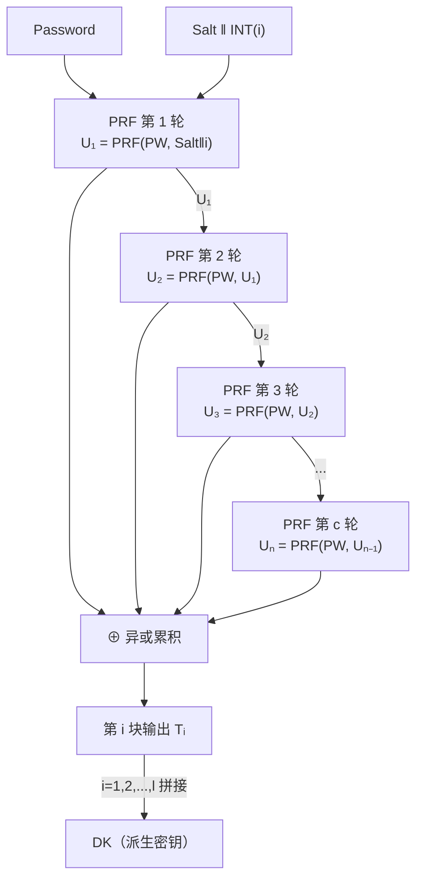
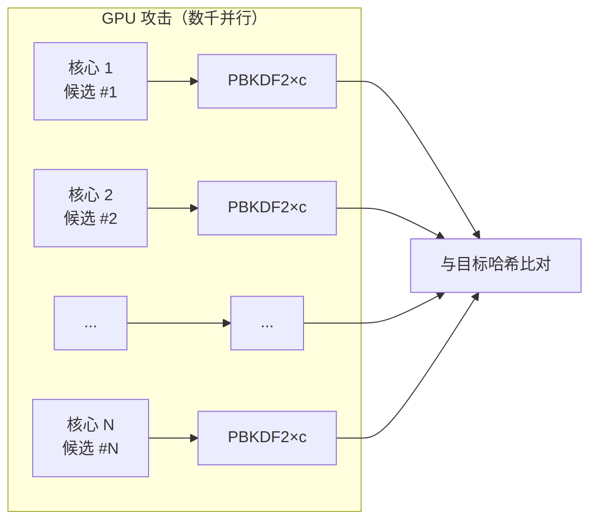
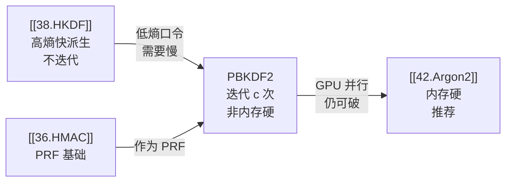

# 密码学（39）· PBKDF2

> [!abstract] TL;DR
> - **口令 vs 密钥**：人类口令熵极低（~30 bit），攻击者可用 GPU 暴力枚举；对口令做 KDF，**必须人为拉慢**，让每次猜测耗费大量算力——这与 [[38.HKDF]] 的"高熵快派生"理念恰好相反。
> - **PBKDF2（RFC 8018 / PKCS#5 v2.1）**：`DK = PBKDF2(PRF, Password, Salt, c, dkLen)`，对每个输出块将 PRF 迭代 **c 次**并异或累积，让单次口令哈希代价可随算力线性调整。
> - **salt**：每个账户独立随机生成，防止彩虹表与多账户同时攻击。
> - **迭代次数 c**：OWASP 2023 建议 PBKDF2-HMAC-SHA256 ≥ **600,000**；随 GPU 算力增长须定期上调。
> - **致命弱点**：PBKDF2 **不是内存硬（memory-hard）**——并行化廉价，GPU/ASIC/FPGA 可大规模加速破解。新系统优先选用内存硬算法 [[42.Argon2]]（Argon2id）或 scrypt；PBKDF2 仍广泛存在于 WPA2、LUKS、iOS 加密、1Password/LastPass 历史版本，理解其优劣是必修课。

---

## 概述与定位

### 口令的本质困境

密码学中的"秘密"分两类：

| 类型 | 代表 | 典型熵 | KDF 策略 |
|---|---|---|---|
| **高熵密钥材料** | ECDH 共享点、随机 AES 密钥 | 128–256 bit | HKDF：快速派生，不需迭代 |
| **低熵人类口令** | 用户登录密码、磁盘加密口令 | 20–40 bit | 口令 KDF：**故意拉慢**，让暴力代价不可承受 |

人类记忆的口令（`P@ssw0rd123`、`正确马电池订书机`）远不如随机字节串。研究表明常用英文口令的有效熵约 30 bit——也就是说，若无额外保护，攻击者只需枚举 2³⁰ ≈ 10 亿个候选，在现代 GPU 上不过数秒。

> [!warning] 混用两类 KDF 是工程大忌
> - 用 HKDF 存储口令：攻击者暴力枚举口令 → 跑一遍 HKDF → 立即验证，无任何保护。
> - 用 PBKDF2 派生协议密钥（如 TLS 会话密钥）：迭代浪费算力，高熵输入本不需要。
> 口令 KDF 的"慢"是目的，不是缺点。

### PBKDF2 的来历

**PBKDF2**（Password-Based Key Derivation Function 2）源自 RSA 实验室 1999 年发布的 **PKCS#5 v2.0**，后收入 **RFC 2898**，再更新至 **RFC 8018**（2017）。它是业界第一个广泛标准化的口令 KDF，设计目标：

1. **可调代价**：迭代次数 `c` 可随算力提升而上调，算法本身无需修改。
2. **基于成熟 PRF**：通常选 HMAC-SHA1 或 HMAC-SHA256，安全性归约清晰（呼应 [[36.HMAC]]）。
3. **任意输出长度**：通过多块输出满足不同 `dkLen` 需求。

---

## 原理与机制

### 接口定义

```
DK = PBKDF2(PRF, Password, Salt, c, dkLen)
```

| 参数 | 说明 |
|---|---|
| `PRF` | 伪随机函数，通常 HMAC-SHA256 或 HMAC-SHA512；输出长度记为 `hLen` |
| `Password` | 原始口令字节串 |
| `Salt` | 随机盐，推荐 ≥ 16 字节（128 bit） |
| `c` | 迭代次数（cost factor），≥ 1 |
| `dkLen` | 派生密钥字节数，≤ (2³² − 1) × hLen |
| `DK` | 派生密钥（Derived Key） |

### 单块迭代：F 函数

PBKDF2 按块生成输出，每块独立迭代。第 `i` 块（1-indexed）由函数 `F` 生成：

```
F(Password, Salt, c, i) =
    U₁  = PRF(Password, Salt ‖ INT(i))
    U₂  = PRF(Password, U₁)
    U₃  = PRF(Password, U₂)
    …
    Uₙ  = PRF(Password, Uₙ₋₁)   // n = c 轮

    F   = U₁ ⊕ U₂ ⊕ … ⊕ Uₙ
```

其中 `INT(i)` 是块编号 `i` 的 4 字节大端序整数。每轮 `Uₙ` 的结果既作为下一轮 PRF 的输入，也参与最终异或累积。

### 多块拼接

需要多于 `hLen` 字节时，生成若干块拼接：

```
块数 l = ⌈dkLen / hLen⌉

T₁ = F(Password, Salt, c, 1)
T₂ = F(Password, Salt, c, 2)
…
Tₗ = F(Password, Salt, c, l)

DK = T₁ ‖ T₂ ‖ … ‖ Tₗ  (截取前 dkLen 字节)
```

### Mermaid：PBKDF2 迭代结构



> [!note] 为何选异或累积而非简单链接？
> 若只取最后一轮 `Uₙ`，攻击者可以跳过中间轮次直接验证部分候选；异或所有中间值使得每一轮 PRF 的输出都影响最终结果，无法"跳过"任何一轮，从而保证整个迭代链都是必须计算的代价。

---

## Salt 的作用与重要性

### 彩虹表的克星

**彩虹表**（Rainbow Table）是预计算所有常见口令哈希值的查找表——攻击者只需把数据库里的哈希去表里一查，立即还原口令。Salt 的引入使彩虹表完全失效：

```
无 salt：hash("password") = 5f4dcc3b...（全库共享同一哈希，一查即得）
有 salt：DK = PBKDF2(PRF, "password", random_salt_A, c, 32)
         每个账户 salt 不同 → 哈希值完全不同 → 彩虹表无法预计算
```

### 防止多账户同时攻击

若所有账户共用同一 salt（或无 salt），攻击者只需对每个口令候选计算**一次**，就能同时检验数据库中**所有账户**——效率随账户数线性放大。每账户唯一 salt 使这种放大失效：攻击者若想破解 N 个账户，代价乘以 N。

### Salt 推荐规格

| 参数 | 推荐值 | 说明 |
|---|---|---|
| 长度 | ≥ 16 字节（128 bit） | 保证唯一性，碰撞概率可忽略 |
| 生成方式 | CSPRNG（如 `/dev/urandom`） | 见 [[43.随机数与熵]] |
| 存储位置 | 与哈希值一起明文存储 | salt 不是秘密，保密无意义 |

---

## 迭代次数 c：代价调节旋钮

### 原理

每次验证口令需要执行 `c` 次 PRF。对于合法服务器，每次登录多花几百毫秒完全可接受；但攻击者每猜一个口令候选也要花同样代价，暴力破解的时间成本放大 `c` 倍。

- 合法用户：感知延迟约 0.1–0.5 秒，完全可接受。
- 攻击者（1080 Ti GPU）：若每次 PBKDF2-SHA256 需 1 ms，则每秒只能尝试 1000 个候选 vs 无 KDF 时的数十亿/秒。

### OWASP 推荐参数（2023）

| 算法 | 最低迭代次数 | 备注 |
|---|---|---|
| PBKDF2-HMAC-SHA256 | **600,000** | 当前主流推荐 |
| PBKDF2-HMAC-SHA512 | **210,000** | SHA-512 每轮耗时约 3× SHA-256 |
| PBKDF2-HMAC-SHA1 | **1,300,000** | 遗留系统兼容 |

> [!warning] 迭代次数须定期审查
> GPU 算力每隔 18 个月翻倍（类摩尔定律），2020 年设定的 100,000 次今日已不够。新系统落地后，应每 2–3 年重新评估并提高 `c`，或在用户下次登录时透明升级哈希。

---

## 算法流程：伪代码

```
function PBKDF2(PRF, Password, Salt, c, dkLen):
    hLen = PRF.output_length
    assert dkLen <= (2^32 - 1) * hLen, "输出长度超限"

    l = ceil(dkLen / hLen)
    r = dkLen - (l - 1) * hLen   // 最后一块取 r 字节

    DK = []
    for i = 1 to l:
        // F(Password, Salt, c, i)
        U = PRF(Password, Salt ‖ INT32_BE(i))  // U₁
        F = U
        for j = 2 to c:
            U = PRF(Password, U)               // Uⱼ
            F = F ⊕ U                          // 异或累积
        DK.append(F)

    return DK[0..dkLen-1]   // 截取 dkLen 字节
```

---

## 代码示例

### Python（hashlib 内置）

```python
import hashlib, os, secrets

password = b"my_passphrase"
salt = secrets.token_bytes(16)          # 16 字节随机 salt
iterations = 600_000
dk = hashlib.pbkdf2_hmac(
    "sha256",                           # PRF = HMAC-SHA256
    password,
    salt,
    iterations,
    dklen=32                            # 256 bit 派生密钥
)
```

> [!warning] 示例输出为示意
> 实际 `dk` 随 `salt` 随机变化，上述参数仅为演示。

### OpenSSL 命令行

```bash
openssl kdf -keylen 32 -kdfopt digest:SHA256 \
    -kdfopt pass:my_passphrase \
    -kdfopt salt:deadbeefdeadbeef \
    -kdfopt iter:600000 PBKDF2
```

> [!warning] 示例输出为示意
> 命令行 salt 应使用随机字节的十六进制表示，此处仅作格式示意。

---

## 致命弱点：非内存硬

### 并行化的代价

PBKDF2 的 `c` 次迭代在计算上是**纯 CPU/PRF 密集型**，完全不涉及内存访问瓶颈。这意味着：

- **GPU**：数千个 CUDA 核心可同时并行运算数千个口令候选，各自独立且不争抢内存带宽。
- **ASIC/FPGA**：专用硬件可把每次 HMAC 的代价压低一个数量级，使 `c=600000` 的保护大打折扣。



每个候选只需少量寄存器和片上缓存，GPU 的高度并行恰好完美匹配 PBKDF2 的计算模式。

### 与内存硬算法的对比

| 算法 | 内存硬 | GPU 抵抗 | ASIC 抵抗 | 标准化 |
|---|---|---|---|---|
| PBKDF2 | 否 | 弱 | 弱 | RFC 8018，广泛兼容 |
| bcrypt | 部分（2KB 内存） | 中 | 中 | 非正式标准 |
| scrypt | 是 | 较强 | 较强 | RFC 7914 |
| **Argon2id** | **是** | **强** | **强** | **RFC 9106（推荐）** |

内存硬算法（Memory-Hard）通过强制算法占用大量 RAM，使 GPU/ASIC 并行的优势被内存带宽瓶颈抵消——见 [[42.Argon2]]。PBKDF2 的这一设计不足，直接催生了 scrypt 与 Argon2 的诞生。

---

## 实际应用

### 协议与标准

| 场景 | 具体用法 |
|---|---|
| **WPA2/WPA3-Personal** | `DK = PBKDF2(HMAC-SHA1, 口令, SSID, 4096, 32)` 生成 PMK |
| **PKCS#8 加密私钥** | PEM 文件中 `PBES2 + PBKDF2` 保护私钥字节串 |
| **LUKS1（Linux 磁盘加密）** | 口令 → PBKDF2 → 卷主密钥加密密钥（LUKS2 已迁移至 Argon2） |
| **iOS 数据保护** | Passcode → PBKDF2 → 文件加密密钥层次 |
| **ZIP AES 加密（WinZip）** | AES 密钥由 PBKDF2 从口令派生 |

### 历史口令管理器

- **1Password（早期版本）**：PBKDF2-HMAC-SHA256，c=25,000（已升级至更高迭代数）。
- **LastPass**：PBKDF2-SHA256，c=100,100（早期）；2022 泄露事件后被迫审查迭代数。
- **KeePass 2.x**：支持 PBKDF2 及 Argon2（用户可选）。

> [!info] LastPass 2022 泄露教训
> 攻击者获取了含 PBKDF2 哈希的数据库；部分老账户迭代数仅 1–5k，GPU 破解轻而易举。事后 LastPass 承认对老账户未强制升级 c 值。这印证了两点：迭代数必须定期审查；内存硬算法（Argon2）在离线攻击场景下更具优势。

---

## 安全性与正确使用

### 必须遵守的参数规范

```
DO:
  ✓ PRF = HMAC-SHA256 或 HMAC-SHA512（遗留系统可接受 HMAC-SHA1）
  ✓ salt ≥ 16 字节，CSPRNG 生成，每账户唯一
  ✓ c ≥ 600,000（HMAC-SHA256）；根据服务器算力每 2–3 年重估
  ✓ dkLen ≥ 16 字节（128 bit），通常 32 字节
  ✓ 存储格式：salt ‖ c ‖ DK（或 PHC/MCF 格式字符串）

DON'T:
  ✗ 固定 salt 或共享 salt
  ✗ c < 10,000（2023 年后完全不足）
  ✗ 用 MD5/SHA-1 作 PRF（SHA-1 虽已有碰撞攻击，但 HMAC-SHA1 在 KDF 场景尚属安全，仍优先升级）
  ✗ 新系统选 PBKDF2——请直接用 Argon2id
```

### 何时仍可使用 PBKDF2

1. **协议互操作要求**：WPA2、PKCS#8、TLS 1.2 PSK 等协议已固化 PBKDF2，别无选择。
2. **FIPS 140-2/3 合规**：Argon2 目前不在 FIPS 认可范围，部分政府/金融系统须用 PBKDF2。
3. **遗留系统维护**：已存在大量 PBKDF2 哈希值，迁移需用户下次登录时重新计算并替换。

### 已知安全分析

- **抗碰撞**：无需哈希函数抗碰撞性，只需 PRF 安全性（HMAC-SHA256 满足）。
- **并行代价为 O(c × p)**，其中 p 为并行度：GPU 拥有数千个 p，这正是弱点所在。
- **Biryukov-Peslyak 分析（2013）**：证明 PBKDF2 存在时间-内存折衷（TMTO），攻击者可用少量内存换取时间，进一步降低代价。
- **新系统结论**：优先 **Argon2id**（[[42.Argon2]]），其次 scrypt，最后才是 PBKDF2（仅合规或互操作情形）。

### 与前后篇的联系



---

## 小结

| 维度 | PBKDF2 |
|---|---|
| 标准 | RFC 8018 / PKCS#5 v2.1 |
| 核心思路 | 迭代 PRF c 次并异或累积，人为拉慢 |
| PRF | HMAC-SHA256（推荐）/ HMAC-SHA512 / HMAC-SHA1 |
| 迭代次数 | ≥ 600,000（HMAC-SHA256，OWASP 2023） |
| Salt | ≥ 16 字节随机，每账户唯一 |
| 输出长度 | 可变，推荐 32 字节 |
| 最大弱点 | **非内存硬**，GPU/ASIC 可高度并行 |
| 推荐场景 | 协议互操作（WPA2/PKCS#8）/ FIPS 合规 |
| 新系统推荐 | 改用 Argon2id（[[42.Argon2]]） |

PBKDF2 是口令 KDF 的历史起点，理解它的迭代结构与 salt 机制，就理解了"故意慢"这一核心设计哲学；而它的非内存硬缺陷，正是 bcrypt（[[40.bcrypt]]）、scrypt 与 Argon2 相继出现的动力。

---

## 相关阅读

- [[38.HKDF]] —— 高熵密钥材料的快速派生，PBKDF2 的反面教材
- [[36.HMAC]] —— PBKDF2 底层 PRF 的完整原理
- [[40.bcrypt]] —— 引入内存（2KB RAM）与 blowfish 慢密钥调度的口令哈希
- [[42.Argon2]] —— 口令哈希现代冠军，Argon2id 为当前首选
- [[43.随机数与熵]] —— salt 的正确生成方式（CSPRNG）
- RFC 8018：PKCS #5: Password-Based Cryptography Specification Version 2.1
- OWASP Password Storage Cheat Sheet：迭代次数持续更新的权威参考

---

⬅️ 上一篇 [[38.HKDF]] ｜ 🏠 [[00.密码学总览]] ｜ 下一篇 [[40.bcrypt]] ➡️
