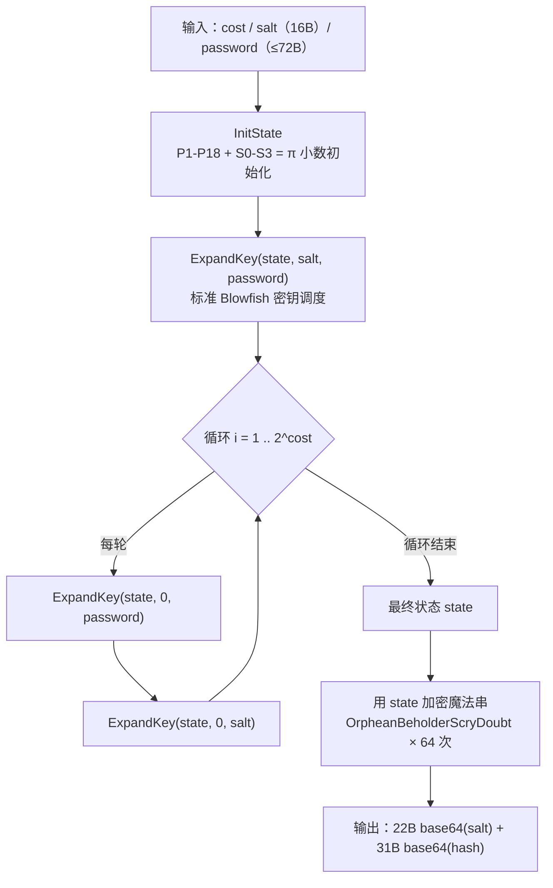

# 密码学（40）· bcrypt

> [!abstract] TL;DR
> - **bcrypt**（Provos & Mazières，1999）是目前部署最广的口令哈希算法，核心思想是把 [[05.Blowfish]] 本就昂贵的密钥调度进一步放大，形成 **EksBlowfish** 算法，使暴力破解在 CPU 和 GPU 上都代价高昂。
> - **cost 参数**：迭代次数为 `2^cost` 次密钥扩展（典型值 10–12），可随硬件升级随时调高，不必更换算法。
> - **输出格式** `$2b$cost$<22 字符 salt><31 字符 hash>`：salt **内置于输出串**，存储只需一列。
> - **72 字节口令上限**：Blowfish 密钥调度只读前 72 字节，更长的口令被静默截断。
> - **抗 GPU**：4 KB S 盒的频繁伪随机内存访问对 GPU 并行不友好；但 4 KB 仍非真正内存硬——需要更强的内存硬化时应选 [[41.scrypt]] 或 [[42.Argon2]]。

本篇承接 [[39.PBKDF2]]（迭代计数型 KDF）、深化 Blowfish 密钥调度在口令安全中的应用，是 KDF 子系列的第二站。后续 [[41.scrypt]] 在此基础上加入真正的内存硬化，[[42.Argon2]] 则成为现代推荐标准。

---

## 概述与定位

### 口令哈希的三重要求

直接将口令用 SHA-256 哈希后存储会带来三个缺陷：

1. **无 salt**：相同口令产生相同摘要，彩虹表一查即破。
2. **太快**：SHA-256 在现代硬件上每秒可计算数十亿次，离线暴力破解极便宜。
3. **GPU 友好**：SHA-256 计算完全并行，GPU 可将吞吐量再放大 1000 倍以上。

bcrypt 的设计针对性地解决了上述三点：**内置随机 salt**（自动 salting）、**可调计算成本**（work factor）、**S 盒访问模式对 GPU 不友好**（partial memory hardness）。

### 历史背景

Niels Provos 与 David Mazières 于 1999 年 USENIX 年会发表《A Future-Adaptable Password Scheme》，将 bcrypt 引入 OpenBSD 的 `passwd` 系统。此后被 Ruby on Rails、Spring Security、Django、PHP `password_hash()`、Node.js `bcryptjs` 等主流 Web 框架采纳为默认口令哈希方案，至今仍广泛部署。

---

## 原理与机制

### EksBlowfish：昂贵的密钥调度

bcrypt 的核心是 **EksBlowfish**（Expensive Key Schedule Blowfish）。正常的 Blowfish 密钥调度已经"慢"——需要约 521 次 Blowfish 加密才能生成 P 数组和 S 盒（见 [[05.Blowfish]] §密钥调度一节）。EksBlowfish 在此基础上**重复执行 `2^cost` 轮**：

```
EksBlowfishSetup(cost, salt, password):
    state ← InitState()                  // 用 π 小数初始化 P 数组 + 4 个 S 盒
    state ← ExpandKey(state, salt, password)   // 标准 Blowfish 密钥扩展（混入 salt+password）
    repeat 2^cost times:
        state ← ExpandKey(state, 0, password)  // 仅用 password 再次扩展
        state ← ExpandKey(state, 0, salt)      // 仅用 salt 再次扩展
    return state
```

> [!note] 为何交替扩展
> 两次子循环（先 password 再 salt）并非为了安全强度，而是保证 salt 和 password 对最终状态的独立影响都被完整"搅入"，同时维持密钥调度的数学对称性。实际上整个过程的安全性来源于**迭代次数 `2^cost`**，而非交替顺序本身。

### EksBlowfish 完整流程



### 最终加密步骤

循环结束后，算法用得到的 EksBlowfish 状态加密一个 192 位（24 字节）的"魔法常量"字符串：

```
OrpheanBeholderScryDoubt
```

对该字符串**连续加密 64 次**（CBC 模式）得到的结果即为原始哈希值，再经 bcrypt 专用 base64 编码后产生最终输出。

---

## 算法结构详解

### 输出格式

```
$2b$12$SaltBase64HereXXXXXXXXHashBase64HereXXXXXXXXXX.
│   │  │◄── 22 chars ──►│◄──────── 31 chars ───────►│
│   │  └── salt（Radix-64，11 字节 → 22 字符）
│   └── cost（十进制，00–31）
└── 版本标识
```

完整示例（示例值，非真实密码）：

```
$2b$12$tFB8H0mXV4tOovKO4d0GEuNR6.p0BYk/C.GHF7D6FVZpNvXg9wWqe
```

> [!warning] 示例输出为示意
> 上方字符串仅用于格式说明，并非真实 bcrypt 输出。

| 字段 | 长度 | 说明 |
|---|---|---|
| 版本前缀 | 4–5 字符 | `$2b$`、`$2a$`、`$2y$` 之一 |
| cost | 2 字符 | 十进制，如 `10`、`12` |
| salt | 22 字符 | 16 字节随机 salt 的 bcrypt-base64 编码 |
| hash | 31 字符 | 23 字节哈希的 bcrypt-base64 编码（最后 1 位填充丢弃） |
| 总计 | 60 字符 | 存入数据库的单列字符串 |

> [!note] bcrypt-base64 与标准 base64 的区别
> bcrypt 使用自定义的 Radix-64 字母表，与标准 RFC 4648 base64 不同（`./ABCDEFGHIJKLMNOPQRSTUVWXYZabcdefghijklmnopqrstuvwxyz0123456789`），且不带填充符 `=`。不可直接互换。

### 版本历史

| 版本 | 含义 |
|---|---|
| `$2$` | 1999 年原始版本，已废弃 |
| `$2a$` | 修正了多字节 Unicode 处理；2004 年前后成为事实标准；在 PHP 中有 null 字节截断 bug |
| `$2b$` | 2011 年修复 PHP 的 `\0` 字节截断问题；当前推荐版本 |
| `$2y$` | PHP 5.3.7 临时引入的修复版；与 `$2b$` 行为等价，今后应统一使用 `$2b$` |

### cost 与时间的关系

cost 每增加 1，计算时间**翻倍**（指数关系）：

| cost | 约耗时（现代服务器单核） |
|---|---|
| 10 | ≈ 100 ms |
| 12 | ≈ 400 ms |
| 14 | ≈ 1.6 s |
| 16 | ≈ 6 s |

> 攻击者每秒对一张被盗数据库可发起的尝试次数 = 服务器吞吐 / 2^cost。cost=12 时，单核每秒约 2–3 次尝试；GPU 群集因 S 盒访存瓶颈，提升幅度远低于 SHA 类。

---

## 代码与示例

### Python（bcrypt 库）

```python
import bcrypt

# 注册：生成哈希
password = b"correct horse battery staple"
hashed = bcrypt.hashpw(password, bcrypt.gensalt(rounds=12))
# hashed: b'$2b$12$...'（含 salt，直接存数据库）

# 登录：验证
bcrypt.checkpw(password, hashed)   # True / False
```

### Node.js（bcryptjs）

```js
import bcrypt from 'bcryptjs';

const hash = await bcrypt.hash('my-password', 12);          // cost=12
const ok   = await bcrypt.compare('my-password', hash);    // true
```

### PHP

```php
$hash = password_hash('my-password', PASSWORD_BCRYPT, ['cost' => 12]);
$ok   = password_verify('my-password', $hash);
```

### 命令行（htpasswd / OpenBSD htpasswd）

```bash
htpasswd -bnBC 12 "" "my-password" | tr -d ':\n'
```

> [!warning] 示例输出为示意
> 实际输出形如 `$2y$12$...`，每次因随机 salt 不同而不同。

---

## 72 字节口令上限

### 根本原因

Blowfish 密钥调度对密钥的处理方式是**循环读取**，直到填满所有 P 数组项。对于超过 448 位（56 字节）的密钥，多余部分被循环重复使用；但 EksBlowfish 实现中，密钥缓冲区硬编码为 72 字节（576 位），**第 73 字节起被截断**：

```
key_len = min(strlen(password) + 1, 72)   // +1 包含 null 终止符
```

### 实际影响

若两个口令的前 72 字节相同（而后续字符不同），bcrypt 会为它们产生**相同的哈希**——这在非英文口令（如中文、日文）下尤其危险，因为多字节字符可能使 72 字节边界落在意外位置。

### 推荐处理方式

对可能超过 72 字节的口令，先用快速哈希预处理：

```python
import hashlib, bcrypt, base64

def safe_bcrypt_hash(password: str) -> bytes:
    # SHA-256 → base64 → bcrypt（结果为 44 字节，远低于 72 字节上限）
    digest = hashlib.sha256(password.encode('utf-8')).digest()
    encoded = base64.b64encode(digest)        # 44 字节，安全
    return bcrypt.hashpw(encoded, bcrypt.gensalt(rounds=12))
```

> [!warning] 注意
> 直接截断 `password[:72]` 也能规避长度问题，但这等价于允许两个口令共享哈希，不推荐。先 SHA-256 再 bcrypt 是更干净的方案，且不引入可分析的截断边界。

---

## 为何比 PBKDF2 更抗 GPU

| 维度 | [[39.PBKDF2]] | bcrypt |
|---|---|---|
| 核心原语 | HMAC-SHA-256/512 | EksBlowfish（4 KB S 盒） |
| 内存占用 | 极小（仅寄存器+少量栈） | 4 KB S 盒（每实例独立） |
| GPU 并行 | 极易（SHA 纯算术，完美向量化） | 受限（4 KB 随机访存，缓存压力大） |
| ASIC 加速 | 容易（纯逻辑，布线即可） | 需片内 SRAM（4 KB/通道），面积受限 |
| 内存硬化级别 | 无 | 弱（4 KB，非真正内存硬） |

bcrypt 的 4 KB S 盒在每次 Feistel 轮函数中产生 **4 次伪随机内存访问**（S0[b3] + S1[b2] XOR S2[b1] + S3[b0]）。GPU 的每个 CUDA 核心 L1 缓存极小，无法同时在线缓存大量独立 bcrypt 实例的 S 盒——并行越高，缓存命中率越低，总吞吐受内存带宽瓶颈制约。

> [!note] 4 KB 并非真正"内存硬"
> 真正的内存硬 KDF（如 [[41.scrypt]] 和 [[42.Argon2]]）可将内存需求参数化到数十 MB 乃至 GB 级别，根本无法在 GPU 上大量并行。bcrypt 的 4 KB 对现代 GPU 的 VRAM 而言微不足道——抗 GPU 性来自**访存模式不规则**而非内存总量。这正是 scrypt 诞生的动机。

---

## 安全性与正确使用

### 已知弱点

| 问题 | 影响 | 缓解 |
|---|---|---|
| 72 字节上限 | 超长口令被截断，存在哈希碰撞 | 先 SHA-256 + base64 再 bcrypt |
| null 字节截断（`$2a$`） | `\0` 之后的字符被丢弃（PHP 历史 bug） | 始终使用 `$2b$` |
| 无真正内存硬化 | 4 KB 对 GPU 阻力有限，不及 scrypt/Argon2 | 高安全场景改用 [[42.Argon2]] |
| 64 位分组（Blowfish） | 密文层面潜在 Sweet32 风险 | bcrypt 不用于加密，此风险不适用 |
| 输出仅 184 位有效位 | 理论熵上限（23 字节哈希） | 实际已超所有常见口令的熵，不成问题 |

### 正确使用规范

1. **cost 选择**：最低 `10`，推荐 `12`；每 2–3 年评估一次，必要时按"重新登录时顺势升级"策略渐进迁移。
2. **存储**：存完整输出串（含 `$2b$12$...`），数据库列设为 `VARCHAR(60)`。
3. **验证**：使用库提供的 `checkpw`/`verify` 函数，**不得**手工比较字符串（防时序攻击）。
4. **绕过 72 字节上限**：对支持长口令的系统，先 SHA-256 + base64 预处理（如上节所示）。
5. **新系统选型**：bcrypt 经受了 25 年考验，仍然安全可靠；若对 GPU/ASIC 有更强抵抗需求，可直接选 [[42.Argon2]]id。
6. **禁止用于加密**：bcrypt 是单向口令哈希，不能用作对称加密密钥派生（用 [[38.HKDF]] 或 [[41.scrypt]] 代替）。

### 与周边算法横向对比

| 算法 | 内存硬 | 抗 GPU | 抗 ASIC | 并行参数 | 推荐场景 |
|---|---|---|---|---|---|
| [[39.PBKDF2]] | 否 | 弱 | 弱 | 否 | 合规要求 FIPS、密钥派生 |
| bcrypt | 弱（4 KB） | 中 | 中 | 否 | 遗留系统、Web 框架默认 |
| [[41.scrypt]] | 是（可调 MB） | 强 | 强 | 是（p） | 磁盘加密、加密货币钱包 |
| [[42.Argon2]]id | 是（可调 GB） | 最强 | 最强 | 是 | 新系统首选口令哈希 |

---

## 小结

bcrypt 的核心贡献是将 Blowfish 的昂贵密钥调度**制度化为可调参数**——cost 决定迭代次数，硬件加速多少倍就能把 cost 调高多少位，始终维持足够的防御代价。内置 salt 消除了彩虹表攻击，4 KB S 盒增加了 GPU 破解的现实阻力。25 年来，bcrypt 未被发现实质性密码学弱点，仍属**生产可用**级别。

唯一需要警惕的是：72 字节口令截断（先哈希规避）、`$2a$` 的 null 字节历史 bug（统一用 `$2b$`）、以及面对 GPU 集群时 4 KB 内存硬化的局限（此时应考虑 [[42.Argon2]]id）。

---

## 相关阅读

- [[05.Blowfish]] —— bcrypt 的密码学基础：Feistel 结构与密钥调度原理
- [[39.PBKDF2]] —— 上一代迭代型口令哈希，FIPS 合规场景常用
- [[41.scrypt]] —— 在 bcrypt 基础上引入真正内存硬化
- [[42.Argon2]] —— 2015 年密码哈希大赛冠军，现代首选

---

⬅️ 上一篇 [[39.PBKDF2]] ｜ 🏠 [[00.密码学总览]] ｜ 下一篇 [[41.scrypt]] ➡️
