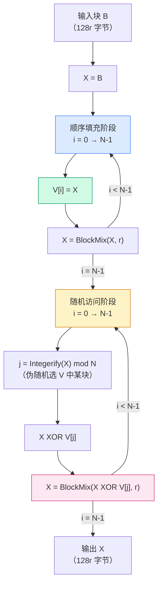
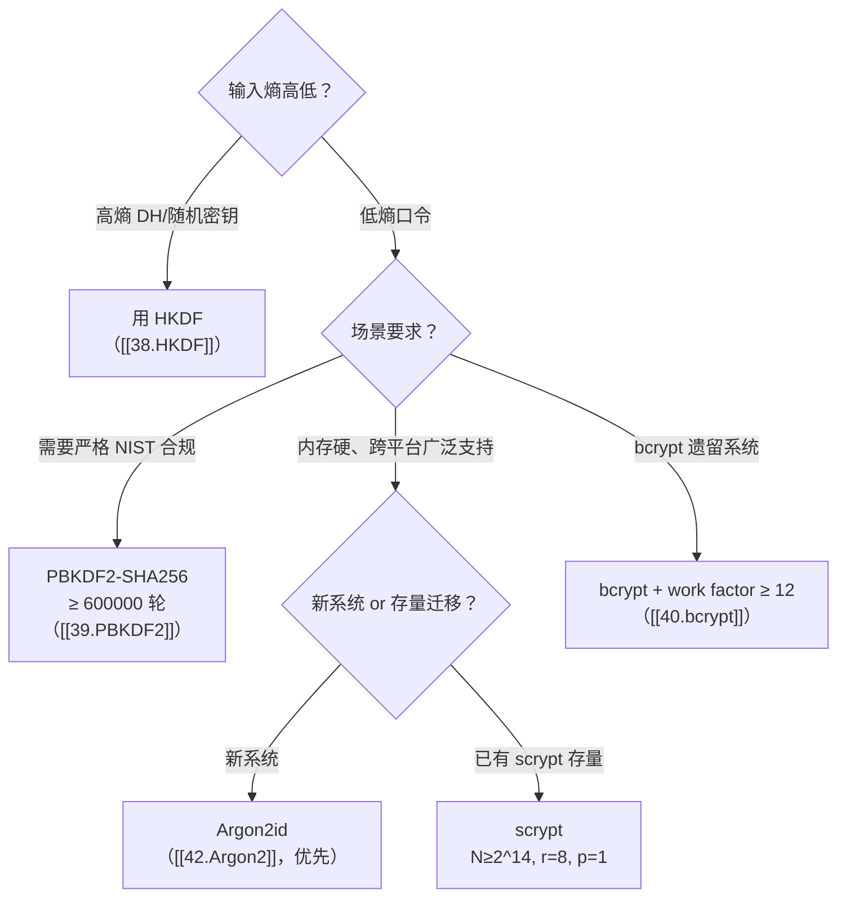

# 密码学（41）· scrypt

> [!abstract] TL;DR
> - **scrypt（Percival 2009，RFC 7914）** 是第一个实用的**内存硬（memory-hard）口令 KDF**：它强迫攻击者在破解时同时付出大量**内存**，使得 GPU/ASIC/FPGA 并行加速不再廉价——这是对 [[39.PBKDF2]] 和 [[40.bcrypt]] 的直接回应（两者内存占用很小，可被并行碾压）。
> - **核心构造**：外层用 PBKDF2-SHA256 做输入/输出扩展，中间核心是 **ROMix**——顺序填充 N 个 128r 字节大块到数组 V，然后伪随机访问 N 次并累积混合；**BlockMix** 是 ROMix 内层的块变换，以 **Salsa20/8**（半个 Salsa20）为核心伪随机置换。
> - **三参数**：**N**（内存/CPU 成本，必须为 2 的幂）、**r**（块大小因子）、**p**（并行度）；内存用量约为 `128 * r * N` 字节；时间正比于 `N * r * p`。
> - **时间-内存权衡（TMTO）**：理论上攻击者可以用 N/2 内存换取约 2× 时间，但比率是指数级的——scrypt 在 TMTO 上有强约束，使得"省内存攻击"代价急剧上升。
> - **典型应用**：Litecoin/Dogecoin PoW（`N=1024,r=1,p=1`）、口令存储、Tarsnap 备份服务（Percival 本人作品）。
> - **局限**：内存与时间参数耦合，不能独立调节；存在缓存时序侧信道；新系统推荐优先用 **[[42.Argon2]]id**（PHC 2015 冠军，三维独立调参、侧信道更友好）。

---

## 概述与定位

### 背景：为什么 PBKDF2 和 bcrypt 不够

[[39.PBKDF2]] 的防护思路是"反复迭代 PRF，让暴力破解更慢"；[[40.bcrypt]] 引入了 Blowfish 慢密钥调度，增加了 CPU 成本。但两者有一个共同弱点：**内存占用极小**（PBKDF2 仅保留迭代中间结果几十字节，bcrypt 固定 4 KiB 的 P/S 盒）。

这让它们面对 GPU 攻击时极为脆弱：

| 维度 | PBKDF2 | bcrypt | scrypt |
|---|---|---|---|
| 设计年代 | 2000（RFC 2898） | 1999 | 2009（RFC 7914） |
| 主防护手段 | 迭代次数（CPU） | 慢密钥调度（CPU） | 大内存 + 顺序-随机访问（内存） |
| GPU 并行性 | 高（SIMD 友好） | 中（数据依赖，但 4 KiB 内存 L1 全放） | 低（大内存 → 带宽瓶颈） |
| 内存用量 | 极小（O(1)） | 4 KiB（固定） | `128 × r × N` 字节（可配） |
| ASIC/FPGA 威胁 | 高 | 高 | 中（显著提高每核内存成本） |
| 独立调参 | 仅时间 | 仅时间 | 时间+内存（但耦合） |
| 标准 | RFC 2898、NIST SP 800-132 | 无正式标准（OpenBSD 事实标准） | RFC 7914 |

Colin Percival 在 2009 年的 BSDCan 论文 *Stronger Key Derivation via Sequential Memory-Hard Functions* 中提出 scrypt，核心命题是：

> 如果 KDF 必须占用大量**顺序可写再随机可读**的内存，那么攻击者无论用多少并行核，每个核都要独立付出同等的内存代价，总攻击成本正比于（核数 × 内存量），而非仅（核数 × 时间）。

### scrypt 在 KDF 谱系中的位置

```
口令 ─→ PBKDF2 ─→ [ROMix ─→ BlockMix ─→ Salsa20/8]×N ─→ PBKDF2 ─→ 输出
         (盐+1次)   ← 内存硬核心 (scrypt 新增) →           (1次收尾)
```

scrypt 本身调用 [[39.PBKDF2]]（用 SHA-256）做前后包装；中间核心 ROMix/BlockMix 以 [[20.ChaCha20与Salsa20]] 中介绍的 Salsa20 轮函数（裁剪为 8 轮的 Salsa20/8）为内层置换。因此 scrypt 是一个"站在 PBKDF2 肩膀上"的复合结构。

---

## 原理与机制

### 内存硬的直觉

设想攻击者暴力枚举口令时用 K 个并行核，每核要破解一个候选口令。

- 对 PBKDF2：每核仅需几十字节状态，K 个核可全部放入 GPU 寄存器 + 共享内存，几乎线性加速。
- 对 scrypt：每核必须占用 `128 × r × N` 字节的私有数组 V（无法跨候选口令共享）。若 N=2^20、r=8，V ≈ 1 GiB。K 个核 × 1 GiB = K GiB DRAM 需求——硬件成本呈线性增长，且内存带宽成为瓶颈。

更关键的是 scrypt 的**顺序写、随机读**模式：

1. **顺序填充阶段**：必须按 V[0], V[1], …, V[N-1] 顺序生成，每一块依赖前一块（不可并行预计算）。
2. **随机访问阶段**：伪随机选取 V 中的某块与当前块混合，访问地址依赖当前状态（不可预测，无法用流水线预取消除延迟）。

这两个性质结合，使得任何省内存的攻击策略都要付出指数级的时间代价——这就是**时间-内存权衡（TMTO）**约束。

### Salsa20/8 核函数

scrypt 的最内层是 Salsa20/8，即 Salsa20 的 8 轮版本（正式 Salsa20 用 20 轮，见 [[20.ChaCha20与Salsa20]]）。输入输出均为 64 字节（16 个 32 位整数）。

**Quarter-Round（四分之一轮）**，对 (a, b, c, d) 四个字（32 位）：

```
b ^= (a + d) <<< 7
c ^= (b + a) <<< 9
d ^= (c + b) <<< 13
a ^= (d + c) <<< 18
```

8 轮由 4 次列轮（column round）+ 4 次行轮（row round）交替组成。最后 64 字节输出 = 轮函数结果与输入按字相加（add-then-output，防止逆推）。

Salsa20/8 比完整 Salsa20 快约 2.5×，密码学强度在此场景下足够（它不直接作为流密码，而是用于伪随机置换大块内存）。

### BlockMix：块级混合

BlockMix 把一个 `128r` 字节的大块（`2r` 个 64 字节 Salsa 块）做一次全混合，输出同样大小：

**输入**：`B[0], B[1], …, B[2r-1]`（各 64 字节，共 `2r` 块）

```
伪代码 BlockMix(B, r):
    X = B[2r - 1]          // 初始化为末块
    for i = 0 to 2r-1:
        X = Salsa20/8(X XOR B[i])
        Y[i] = X
    // 奇偶交织输出（偶数块前，奇数块后）
    return Y[0], Y[2], Y[4], …, Y[2r-2],
           Y[1], Y[3], Y[5], …, Y[2r-1]
```

奇偶交织的目的是增强扩散：经过 BlockMix 后，每个输出块都间接依赖所有输入块，防止局部短路。

### ROMix：内存硬核心

ROMix 是 scrypt 真正实现内存硬性质的组件。输入一个 `128r` 字节块，返回同样大小的混合后块：

```
伪代码 ROMix(B, r, N):
    X = B
    // 第一阶段：顺序填充数组 V（共 N 个 128r 字节块）
    for i = 0 to N-1:
        V[i] = X
        X = BlockMix(X, r)
    // 第二阶段：随机访问 N 次
    for i = 0 to N-1:
        j = Integerify(X) mod N    // 取 X 末 64 字节解释为整数，模 N
        X = BlockMix(X XOR V[j], r)
    return X
```

- `Integerify(X)`：将 `X`（128r 字节块）的最后 64 字节解释为一个小端 64 位整数，取模 N 得随机索引 `j`。
- N 必须是 2 的幂（模操作退化为位掩码 `& (N-1)`，避免偏置）。
- **内存需求**：V 数组共 `N × 128r` 字节，全量驻留内存才能快速响应随机访问；否则每次缺页都要重新计算，代价指数级上升。

### scrypt 整体流程

```
伪代码 scrypt(P, S, N, r, p, dkLen):
    // 第一步：PBKDF2 将口令 P、盐 S 扩展为 p 个 128r 字节块
    B = PBKDF2-SHA256(P, S, 1, p × 128r)
    // B 拆分为 B[0], B[1], …, B[p-1]，各 128r 字节

    // 第二步：对每个并行块独立跑 ROMix
    for i = 0 to p-1:
        B[i] = ROMix(B[i], r, N)

    // 第三步：PBKDF2 收尾，将混合后的 B 压缩为目标长度
    DK = PBKDF2-SHA256(P, B[0] ‖ B[1] ‖ … ‖ B[p-1], 1, dkLen)
    return DK
```

- 第一步 PBKDF2 的迭代次数固定为 1（目的仅是把口令/盐扩展为足够长的 B，密码强度由 ROMix 提供）。
- 第三步 PBKDF2 同样迭代 1 次，目的是把 p 个块（可能很大）压缩为目标 `dkLen` 字节输出。
- 两次 PBKDF2 用同一口令 P 作为 HMAC 密钥，B 分别作为盐，形成"口令绑定"——即便攻击者知道 V 数组内容，也无法绕过 PBKDF2 的口令绑定反推输出。

### ROMix 顺序填充与随机访问流程



---

## 算法流程与参数详解

### 三个核心参数

| 参数 | 含义 | 典型值 | 影响 |
|---|---|---|---|
| **N** | 内存/CPU 成本因子，必须为 2 的幂 | 2^14（交互登录）～2^20（高安全离线） | V 数组大小 `= 128rN` 字节；时间 ∝ N |
| **r** | 块大小因子（Salsa20/8 块数 = 2r） | 8（RFC 7914 推荐默认） | 内存带宽敏感度；内存 ∝ r；Salsa 调用次数 ∝ r |
| **p** | 并行度（独立 ROMix 实例数） | 1～4 | 总时间 ∝ p；内存需求也 ∝ p（各实例独立 V 数组） |

**内存公式**（每个 ROMix 实例）：

```
V 数组大小 = N × 128 × r  字节
例：N=2^20, r=8  →  1048576 × 1024 = 1 GiB
    N=2^15, r=8  →  32768  × 1024 = 32 MiB
    N=2^14, r=8  →  16384  × 1024 = 16 MiB（OWASP 2023 最低建议）
```

p 个并行实例（通常在不同线程/进程上跑）各需独立 V 数组，总内存 = `p × N × 128r`。

### 时间-内存权衡（TMTO）

scrypt 的 TMTO 特性由 Percival 在原论文中给出分析，后续研究（Alwen & Serbinenko 2015 SCrypt ISOCHRONOUS analysis 等）进一步精化：

**攻击者策略**：只保留 V 中的每隔 k 块存储（内存降至 `N/k`），遇到随机访问命中未保存块时，从最近保存点**重新计算**那 k 步 BlockMix。

| 内存减少比 | 时间增加倍数（近似） |
|---|---|
| 1/2 | ~2× |
| 1/4 | ~4×（需 2 次重算） |
| 1/8 | ~8×（需 3 次重算） |
| 1/N（极端，仅保留起点） | ~N×（退化为纯 CPU 暴力） |

这个线性关系意味着：攻击者省内存的代价是**同等倍率的时间增加**，而不是常数代价——scrypt 让 TMTO 对攻击者不再划算（除非存储极端便宜而时间无限）。

相比之下，Argon2id（见 [[42.Argon2]]）在 TMTO 抵抗上有更严格的理论保证，且允许独立调节时间与内存参数。

### 盐的作用

scrypt 的盐通过第一步 PBKDF2 引入：

```
B = PBKDF2-SHA256(Password, Salt, 1, p × 128r)
```

盐防止彩虹表攻击——不同用户哪怕口令相同，B 不同 → V 数组不同 → 输出不同。盐应为至少 **16 字节**（128 位）的密码学随机数（见 [[43.随机数与熵]]），与输出 DK 一起存储，验证时重新运行 scrypt 比对。

---

## 代码与示例

### Python（hashlib，标准库）

Python 3.6+ 的 `hashlib.scrypt` 直接提供实现：

```python
import hashlib, os

password = b"hunter2"
salt = os.urandom(16)          # 示例：16 字节随机盐

# N=2^14, r=8, p=1 → 约 16 MiB，适合交互登录
dk = hashlib.scrypt(
    password,
    salt=salt,
    n=2**14,
    r=8,
    p=1,
    dklen=32          # 输出 32 字节（256 位）
)
print(dk.hex())       # 示例输出（每次不同）
```

> [!warning] 示例输出为示意
> 实际输出因盐随机而每次不同；上述参数仅供演示，生产环境应根据服务器性能测试选择 N（目标：验证耗时 100-500 ms）。

### libsodium / Python（pynacl）

libsodium 封装了 scrypt，接口更友好：

```python
from nacl.pwhash import scryptsalsa208sha256_str, scryptsalsa208sha256_str_verify

# 哈希（自动生成随机盐，opslimit/memlimit 映射到 N/r/p）
hashed = scryptsalsa208sha256_str(
    b"hunter2",
    opslimit=524288,     # 约 2^19 迭代
    memlimit=16777216    # 16 MiB
)

# 验证
ok = scryptsalsa208sha256_str_verify(hashed, b"hunter2")
```

### Node.js（crypto 模块，内置）

```javascript
const { scrypt } = require('crypto');
const { promisify } = require('util');
const scryptAsync = promisify(scrypt);

async function hashPassword(password) {
    const salt = require('crypto').randomBytes(16);
    // N=2^14, r=8, p=1（Node.js 默认 r=8, p=1）
    const key = await scryptAsync(password, salt, 32, { N: 16384 });
    return { salt: salt.toString('hex'), key: key.toString('hex') };
}
```

### 输出格式建议

生产存储建议用 MCF（Modular Crypt Format）或类似结构，含版本、参数、盐、哈希：

```
$scrypt$ln=14,r=8,p=1$<base64(salt)>$<base64(hash)>
```

libsodium 的 `scryptsalsa208sha256_str` 自动生成此格式。

---

## 应用场景

### 口令存储

这是 scrypt 的核心设计目标。步骤：

1. 注册：生成随机盐 → scrypt(口令, 盐, N, r, p) → 存储（盐 + 参数 + 哈希）。
2. 登录：取盐与参数 → scrypt(输入口令, 同盐, 同参数) → 常数时间比对（`hmac.compare_digest`）。
3. 不要存储口令明文或可逆加密形式；参数可随硬件升级而更新（再哈希时机：用户下次登录成功后）。

### 加密密钥派生

从口令派生磁盘加密密钥（如 LUKS2 支持 `argon2id` 与历史版本的 `scrypt`）：

```
disk_key = scrypt(passphrase, disk_uuid_as_salt, N=2^20, r=8, p=1, dkLen=32)
```

高 N 值在解密磁盘时可接受（解锁一次即可），但大大增加离线暴力攻击成本。

### Litecoin/Dogecoin 工作量证明

Litecoin（Charlie Lee，2011）选用 scrypt 作为 PoW 哈希，参数 N=1024, r=1, p=1（内存约 128 KiB），旨在降低 ASIC 优势（相比 Bitcoin SHA-256）。然而低 N 值最终使得 Litecoin 专用 ASIC 仍然出现——PoW 场景与口令场景参数需求不同，密码领域的内存硬设计不能简单移植到 PoW。

### Tarsnap 备份服务

Colin Percival 本人开发的 Tarsnap 在本地派生加密密钥时使用 scrypt，是 scrypt 的第一个生产应用（2008 年，论文发布前）。

---

## 安全性与正确使用

### 参数选择

**OWASP 2023 建议**（口令存储）：

| 安全等级 | N | r | p | 最小内存 |
|---|---|---|---|---|
| 最低可接受 | 2^14 (16384) | 8 | 1 | 16 MiB |
| 推荐（交互登录） | 2^15 (32768) | 8 | 1 | 32 MiB |
| 高安全（非交互，如磁盘加密） | 2^20 (1048576) | 8 | 1 | 1 GiB |

> [!tip] 参数调优原则
> 在目标服务器上测量 scrypt 执行时间，调整 N 使**总耗时在 100–500 ms 之间**（登录场景）。N 必须为 2 的幂。r=8、p=1 是大多数场景的合理默认。增大 p 可在多核机器上占用更多 CPU，但不增加每实例内存，对内存硬性质贡献有限。

### 已知弱点与局限

**1. 内存与时间参数耦合**

scrypt 的 N 同时控制内存大小和 BlockMix 调用次数（时间）。无法在保持内存不变的前提下只增加时间，反之亦然。这在需要"时间预算固定但想升内存"或"内存受限但想加强 CPU 成本"的场景里造成困难。

[[42.Argon2]]id 通过分离 `m`（内存）、`t`（迭代）、`p`（并行）三参数解决了这个问题。

**2. 缓存时序侧信道**

ROMix 的随机访问阶段基于当前块的值决定访问哪个 V[j]，访问地址（数组索引）在 CPU 缓存层面是数据依赖的，可能通过 Flush+Reload、Prime+Probe 等缓存侧信道攻击推测访问模式，进而推断部分中间状态。

Argon2id 引入了数据无关的内存访问模式（Argon2i 部分），以减弱此类侧信道（见 [[42.Argon2]]）。

**3. Salsa20/8 降轮风险**

scrypt 使用 8 轮 Salsa20（非完整 20 轮）。在 scrypt 场景下，Salsa20/8 不作为流密码使用，其安全性足够（仅需抵抗随机置换的区分攻击），但如遇未来 Salsa20/8 的密码分析突破，需评估影响。目前尚无实际威胁。

**4. p 参数与安全性**

p > 1 时，p 个 ROMix 实例**相互独立**运行（不是更强的混合），并行实例共享同一口令 P，V 数组各异。若攻击者有足够内存，p 个实例可以并行破解，攻击成本不随 p 增大。因此 p 不是独立的安全增益参数，主要用于充分利用多核 CPU。

### 推荐实践

1. **盐**：至少 16 字节（128 位）密码学随机数（`/dev/urandom` 或 `os.urandom()`），不要复用，不要用可预测值。
2. **输出长度**：至少 32 字节（256 位）；不要截断到 16 字节以下。
3. **常数时间比对**：验证时用 `hmac.compare_digest()` 或等价函数，避免时序泄露（口令哈希通常不是 MAC，逐字节比较会泄露匹配长度）。
4. **新系统优先 Argon2id**：PHC（Password Hashing Competition）2015 冠军 [[42.Argon2]]id 在侧信道抵抗、参数独立性、TMTO 理论保证上均优于 scrypt；若已有 scrypt 存量，迁移成本低，逐步替换即可。
5. **不要用于非口令场景（高熵密钥）**：从 DH 共享密钥派生子密钥用 [[38.HKDF]]，scrypt 的高成本在高熵输入场景是纯粹浪费。
6. **禁止 N=1 或极低参数**：`N=1` 退化为无循环的 BlockMix，完全失去内存硬性；任何 N < 2^14 在现代硬件上内存用量不足以形成有效防护。

### scrypt 与相邻 KDF 的选型决策树



---

## 小结

scrypt 是 KDF 史上第一个将"内存硬"思想实用化的口令哈希函数：通过 ROMix 的顺序写 + 伪随机读大数组 V，强迫破解者同时付出内存与时间，显著提高了 GPU/ASIC 并行攻击的门槛。其内部用 PBKDF2 做包装、Salsa20/8 做块置换，构造清晰且有 RFC 7914 标准背书。

核心要点回顾：

- **内存硬**是 scrypt 对 [[39.PBKDF2]] / [[40.bcrypt]] 的根本超越——强迫每破解实例独立占用大内存。
- **ROMix + BlockMix + Salsa20/8**：三层嵌套，每层各司其职（内存硬 / 块扩散 / 伪随机置换）。
- **N、r、p** 控制成本；N 是内存硬性的核心旋钮，选 2^14 及以上。
- **TMTO 约束**：省内存换时间的代价线性对等，不存在"省一半内存只多一点时间"的捷径。
- **局限**：参数耦合、侧信道、Argon2id 在理论与工程上均更优——新系统见 [[42.Argon2]]。

---

## 相关阅读

- [[39.PBKDF2]]——scrypt 的包装层；理解迭代 PRF 口令哈希基础
- [[40.bcrypt]]——前驱口令哈希；慢密钥调度的思路
- [[42.Argon2]]——PHC 冠军；scrypt 的继承者，参数更灵活、侧信道更强
- [[38.HKDF]]——高熵输入场景的 KDF；与 scrypt 定位互补
- [[20.ChaCha20与Salsa20]]——scrypt 内核 Salsa20/8 的来源与设计
- [[43.随机数与熵]]——盐生成；`/dev/urandom`、CSPRNG

---

⬅️ 上一篇 [[40.bcrypt]] ｜ 🏠 [[00.密码学总览]] ｜ 下一篇 [[42.Argon2]] ➡️
