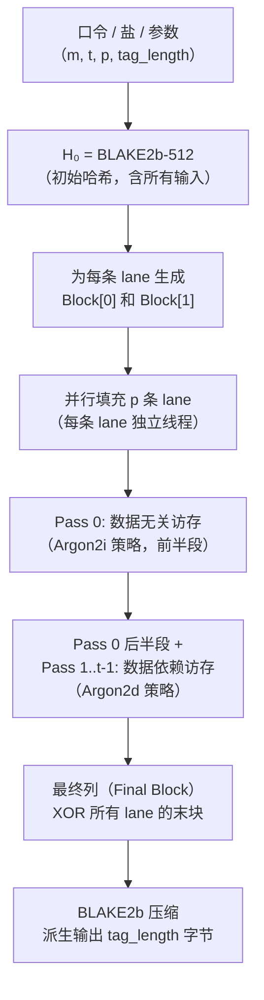

# 密码学（42）· Argon2

> [!abstract] TL;DR
> - **Argon2**（Biryukov、Dinu、Khovratovich，2015）是 PHC（Password Hashing Competition）竞赛冠军，当前口令哈希的**首选算法**，RFC 9106 标准化。
> - **三个变体**：Argon2d（数据依赖访存，抗 GPU 最强，适合无侧信道威胁的场景如加密货币）、Argon2i（数据无关访存，抗侧信道，原用于口令）、**Argon2id**（前半程 Argon2i + 后半程 Argon2d，**OWASP/RFC 双推荐通用默认**）。
> - **内存硬**：先填充大小为 `m` KiB 的矩阵（1 KiB/块），多遍（`t` 次）迭代访问并混合，内存无法折叠——ASIC/GPU 攻击者省不了 DRAM 成本。
> - **底层**：压缩函数 G 基于 [[34.BLAKE2与BLAKE3|BLAKE2b]] 的 G 函数（128 位宽），每块 1024 字节，通过 XOR 方式不断混合。
> - **三参数**：`m`（内存 KiB）、`t`（时间/迭代轮数）、`p`（并行度线程数），独立可调——这是相对 [[41.scrypt]] 和 [[40.bcrypt]] 的重要优势。
> - **OWASP 2024 推荐**：Argon2id，m=19456 KiB（19 MiB）或 m=47104 KiB（46 MiB），t=2 或 t=1，p=1。
> - **输出格式**（PHC string format）：`$argon2id$v=19$m=19456,t=2,p=1$<salt-base64>$<hash-base64>`。

---

## 概述与定位

### 背景：口令哈希的演进危机

口令存储不能用普通哈希（MD5、SHA-256）——现代 GPU 可以每秒计算数百亿次 SHA-256，暴力破解一个 8 位数字字母混合口令只需秒级。解决思路是"故意拖慢"：

| 世代 | 代表 | 核心手段 | 弱点 |
|---|---|---|---|
| 迭代型 | [[39.PBKDF2]] | 多次调用 HMAC，CPU 绑定 | GPU/ASIC 可完全并行，内存可忽略 |
| 内存型（早） | [[40.bcrypt]] | Blowfish 密钥扩展，内存 4 KiB | 固定内存，现代 FPGA 可做专用芯片 |
| 内存硬 | [[41.scrypt]] | 顺序填充大数组 + 随机访问，内存硬 | N/r/p 三参数耦合，调参不直观 |
| **PHC 冠军** | **Argon2** | 大内存矩阵 + 多遍迭代 + 三参数独立 | ——当前推荐 |

**PHC（Password Hashing Competition，2013–2015）**：仿 AES/SHA-3 竞赛模式，公开评审。Argon2 由卢森堡大学 Alex Biryukov 等人提交，2015 年 7 月获选冠军。2021 年 RFC 9106 正式标准化。

### 与同类算法的核心差异

与 [[41.scrypt]] 相比：

- scrypt 的 N（内存因子）和 r（块大小）在内部耦合；Argon2 的 `m`（内存总量）和 `t`（迭代次数）**完全解耦**，可以独立增大内存而不改变计算次数，或反之——更方便在不同威胁模型下调参。
- scrypt 默认单线程（p=1）；Argon2 原生支持多线程（`p > 1`），多核机器可成倍利用硬件而不给攻击者优势（因为攻击者需要攻击大量账户，不是单账户多线程）。
- scrypt 抗侧信道弱（数据依赖访存）；Argon2i/Argon2id 提供专门的侧信道防护模式。

---

## 原理与机制

### 三变体的访存策略

Argon2 填充内存矩阵时，每块的**参考块**（reference block）选取方式决定了安全属性：

**Argon2d**：参考块地址由当前块的内容（数据）决定——攻击者必须顺序计算，无法跳过；抗 GPU 效果最强，但内存访问序列依赖中间值，存在侧信道（缓存/时序）风险。适合**没有侧信道威胁的场景**（服务器端加密货币钱包、磁盘加密密钥派生）。

**Argon2i**：参考块地址由计数器/伪随机流（仅依赖口令/盐/参数，不依赖中间块数据）决定——访存模式与数据无关，防御缓存侧信道；但由于访存序列可预测，存在 time-memory trade-off（TMTO）攻击空间，需要更大的 `t`（至少 3）来补偿。

**Argon2id**（**推荐**）：
- 第一遍（pass 0）：前半段（`lane_length/2` 列）按 Argon2i 方式（数据无关）访存；后半段按 Argon2d 方式（数据依赖）访存。
- 第二遍及之后：全部按 Argon2d 方式。
- 效果：既获得 Argon2i 的侧信道防护（攻击者在第一遍无法用侧信道提前知道要计算什么），又获得 Argon2d 的强 TMTO 抵抗。



> [!note] 为何是 XOR 而非拼接
> 各 lane 最终列 XOR 合并，保证并行安全：即使某条 lane 被侧信道泄露，攻击者也无法单独推导出其他 lane 的内容；XOR 使最终块依赖**全部** lane 的计算结果。

### 内存矩阵结构

内存被组织为 `p × q` 的矩阵，`p` 为并行度（lane 数），`q` 为每条 lane 的列数（`q = m / (p × blocksize)`，`blocksize = 1 KiB`）：

```
内存矩阵（p 行 × q 列，每格 1 KiB）
┌─────────────────────────────────────────────────────────────┐
│ Lane 0: [B[0][0]] [B[0][1]] [B[0][2]] ... [B[0][q-1]]      │
│ Lane 1: [B[1][0]] [B[1][1]] [B[1][2]] ... [B[1][q-1]]      │
│  ...                                                         │
│ Lane p-1: [B[p-1][0]] ... [B[p-1][q-1]]                    │
└─────────────────────────────────────────────────────────────┘
          ← Pass 0 →  ← Pass 1 →  ← ... →  ← Pass t-1 →
每遍重新混合整张矩阵；最终列 XOR 后输出
```

矩阵分为 **4 个段（segment）**，每段长 `lane_length/4` 列；每遍迭代内，同一段的所有 lane 并行计算（无跨 lane 依赖），不同段之间串行，保证可并行又可重现。

### 压缩函数 G

每个 1 KiB 块的混合通过压缩函数 G 完成，G 直接复用 **BLAKE2b 的 G 混合函数**（见 [[34.BLAKE2与BLAKE3]]）：

```
G(X, Y) → Z

输入：X（1024 字节，参考块），Y（1024 字节，当前前驱块）
中间：R = X XOR Y
将 R 视为 8×8 的 64 位字矩阵
对每行执行 BLAKE2b-G（行混合）
对每列执行 BLAKE2b-G（列混合）
输出：Z = R XOR (行列混合后的矩阵)
```

BLAKE2b 的 G 函数（ARX 结构，加-旋转-异或）：

```
G(a, b, c, d):
  a = a + b + 2·(low32(a) · low32(b))   // 模 2^64 乘加
  d = (d XOR a) >>> 32
  c = c + d + 2·(low32(c) · low32(d))
  b = (b XOR c) >>> 24
  a = a + b + 2·(low32(a) · low32(b))
  d = (d XOR a) >>> 16
  c = c + d + 2·(low32(c) · low32(d))
  b = (b XOR c) >>> 63
```

> [!note] "乘加"变体
> Argon2 的 G 函数在 BLAKE2b 原始 G 的加法上增加了 `2·(low32(x)·low32(y))` 项（即 `x + y + 2·trunc32(x)·trunc32(y)`），等效于将两个 32 位半字做无符号乘法后累加到 64 位结果，这使得压缩函数相对纯 ARX 更难被代数攻击逼近。

### 索引生成：如何选参考块

每条 lane 的每个块 `B[i][j]` 需要一个参考块 `B[l'][j']`：

1. 计算一个 64 位伪随机值 `J1 || J2`：
   - Argon2d：`J1 || J2 = low64(B[i][j-1])`（依赖当前前驱块内容，数据相关）
   - Argon2i：`J1 || J2` 由 `G(G(0, B_input_block))` 的计数器流产生（数据无关）
2. `l' = J2 mod p`（目标 lane 号）
3. `j'` 从**可引用的候选集**中用 J1 以幂分布（power-of-two distribution）采样——越新的块被引用概率越高，模拟"近期热数据"更难被 TMTO 折叠。

---

## 算法流程

### 完整流程（Argon2id，p=1 简化版）

```
输入：
  P       = 口令（bytes）
  S       = 随机盐（≥16 字节，推荐 16 字节）
  m       = 内存参数（KiB，例如 19456）
  t       = 迭代次数（例如 2）
  p       = 并行度（例如 1）
  τ       = 输出长度（字节，例如 32）
  K       = 可选密钥（bytes，可为空）
  X       = 可选关联数据（bytes，可为空）

步骤 1：生成初始哈希 H₀
  H₀ = BLAKE2b-512(p ‖ τ ‖ m ‖ t ‖ version ‖ type
                    ‖ len(P) ‖ P ‖ len(S) ‖ S
                    ‖ len(K) ‖ K ‖ len(X) ‖ X)
  （version = 0x13 = 19 for Argon2 v1.3）

步骤 2：初始化矩阵（p 行 × q 列，q = floor(m / (4p)) * 4）
  对每条 lane i ∈ [0, p-1]：
    B[i][0] = H'(H₀ ‖ 0 ‖ i)   // H' 为可变长 BLAKE2b 派生
    B[i][1] = H'(H₀ ‖ 1 ‖ i)

步骤 3：填充矩阵（t 遍迭代）
  对每遍 n ∈ [0, t-1]：
    对每条 lane i ∈ [0, p-1]（并行）：
      对每段 s ∈ [0, 3]：（串行，按段同步）
        对每列 j 从段起始到段结束：
          确定访存策略（Argon2id：pass 0 前半段用 i 模式，其余用 d 模式）
          计算参考块地址 (l', j')
          B[i][j] = G(B[i][j-1], B[l'][j'])  // 注意：第一遍 j>=2，否则用 B[i][0]

步骤 4：提取最终块
  C = XOR(B[0][q-1], B[1][q-1], ..., B[p-1][q-1])

步骤 5：输出
  output = H'(C, τ)   // H' 可变长输出，截取 τ 字节
```

> [!note] H' 可变长哈希
> Argon2 自定义了 H'（Variable-Length Hash）：当输出 ≤ 64 字节，直接 BLAKE2b；当输出 > 64 字节，先 BLAKE2b 得 64 字节，再循环 BLAKE2b 拼接（类似 HKDF-Expand），保证任意长度派生。

### 输出格式（PHC String Format）

标准实现序列化参数和结果为可读字符串：

```
$argon2id$v=19$m=19456,t=2,p=1$<salt-base64>$<hash-base64>
```

示例（示意值）：

```
$argon2id$v=19$m=19456,t=2,p=1$c29tZXNhbHRzb21lc2FsdA$WFzNu8...（base64 省略）
```

> [!warning] 示例输出为示意
> 上述 salt 和 hash 字段为示意占位，真实输出依赖具体口令和随机盐。

字段含义：

| 字段 | 含义 |
|---|---|
| `argon2id` | 变体（argon2d / argon2i / argon2id） |
| `v=19` | Argon2 规范版本 0x13（v1.3） |
| `m=19456` | 内存 19456 KiB ≈ 19 MiB |
| `t=2` | 2 次迭代 |
| `p=1` | 1 条 lane（单线程） |
| salt | 随机盐，Base64 无填充编码 |
| hash | 输出哈希，Base64 无填充编码，默认 32 字节 |

---

## 代码与示例

### Python（argon2-cffi）

```python
import argon2

# 推荐：使用 PasswordHasher 直接封装（Argon2id，OWASP 参数）
ph = argon2.PasswordHasher(
    time_cost=2,        # t=2 次迭代
    memory_cost=19456,  # m=19456 KiB (≈19 MiB)
    parallelism=1,      # p=1
    hash_len=32,        # 输出 32 字节
    salt_len=16,        # 随机 16 字节盐（自动生成）
    type=argon2.Type.ID  # Argon2id
)

# 哈希口令
hash_str = ph.hash("my_password")
# 验证
try:
    ph.verify(hash_str, "my_password")
    print("验证通过")
except argon2.exceptions.VerifyMismatchError:
    print("口令错误")
```

> [!warning] 示例输出为示意
> 实际 hash_str 取决于运行时随机盐，每次调用结果不同。

### Go（golang.org/x/crypto/argon2）

```go
package main

import (
    "crypto/rand"
    "golang.org/x/crypto/argon2"
    "encoding/base64"
    "fmt"
)

func hashPassword(password string) string {
    salt := make([]byte, 16)
    rand.Read(salt)

    // Argon2id：Key(password, salt, time, memory, threads, keyLen)
    hash := argon2.IDKey([]byte(password), salt, 2, 19456, 1, 32)
    return fmt.Sprintf("$argon2id$v=19$m=19456,t=2,p=1$%s$%s",
        base64.RawStdEncoding.EncodeToString(salt),
        base64.RawStdEncoding.EncodeToString(hash))
}
```

> [!warning] 示例输出为示意

### OpenSSL（命令行，仅参考，v3.2+）

```bash
# openssl 3.2+ 支持 argon2（实验性）
openssl kdf -keylen 32 -kdfopt digest:SHA256 \
    -kdfopt pass:mypassword -kdfopt salt:somesalt16bytes \
    -kdfopt iter:2 -kdfopt memcost:19456 -kdfopt threads:1 \
    ARGON2ID
```

> [!warning] 示例输出为示意
> OpenSSL 命令行 Argon2 接口版本间差异较大，生产环境建议用专用库（argon2-cffi、libargon2、go x/crypto）。

---

## 与 scrypt / bcrypt / PBKDF2 对比

| 特性 | PBKDF2 | bcrypt | scrypt | Argon2id |
|---|---|---|---|---|
| 标准化 | RFC 2898 | 无正式 RFC | Colin Percival 2009 | RFC 9106（2021） |
| 内存硬 | 否 | 4 KiB（固定） | 是（N·128r·p 字节） | 是（m KiB，独立可调） |
| 时间与内存解耦 | — | — | 部分解耦（r 影响二者） | 完全解耦 |
| 并行度参数 | 否 | 否 | 是（但 p 仅影响 CPU） | 是（p，影响内存带宽利用） |
| 抗 GPU | 弱 | 中（固定内存） | 强 | 强（内存带宽瓶颈） |
| 抗 ASIC | 弱 | 弱（FPGA 已实现） | 较强 | 强 |
| 抗侧信道 | — | — | 弱（数据依赖） | Argon2id 兼顾 |
| 调参直观性 | 高（迭代次数） | 中（cost factor） | 低（N/r/p 耦合） | 高（m/t/p 独立） |
| 当前推荐 | 遗留系统 | 遗留系统 | 次选 | **首选** |

> **关键洞察**：PBKDF2 的根本问题是"可以无限并行 + 零内存"——现代 GPU 每卡每秒 40 亿次 PBKDF2-SHA256，而 Argon2id m=19 MiB 时，每块 GPU 显存只能同时跑 ~4000 个实例（16 GB / 4 MB），将攻击者的并行度限制在内存容量内。

---

## 安全性与正确使用

### 参数选择：OWASP 2024 推荐

| 场景 | m（KiB） | t | p | 说明 |
|---|---|---|---|---|
| 最低安全（低内存机器） | 19456（19 MiB） | 2 | 1 | OWASP 最低推荐 |
| 标准（推荐） | 47104（46 MiB） | 1 | 1 | 较高内存，1 次迭代 |
| 高安全（敏感服务） | 65536（64 MiB） | 3 | 4 | 多核利用，延迟 ≈ 0.5~1 s |

**调参原则**：在目标机器上测量，使单次哈希耗时 **0.5–1 秒**（登录场景）或 **1–5 秒**（高价值密钥派生如磁盘加密）；优先增大 `m`（内存），次之增大 `t`（时间），`p` 根据多核可用性调整。

> [!warning] 参数太小等于没有保护
> 开发阶段常见错误：`m=65536, t=1, p=1`（64 MiB，貌似参数合理）却忘记容器内存限制 128 MiB——容器 OOM 后降级回 MD5。上线前务必在生产机器/容器配置下实测。

### 盐的要求

- 盐必须随机：`os.urandom(16)` / `crypto/rand`，**不要**用用户名、时间戳等可预测值。
- 盐长度：**16 字节（128 位）最小**，大多数库默认 16 字节。
- 盐存储：连同哈希一起存在 PHC string format 中（库自动处理），不需要单独字段。

### 版本与升级

Argon2 有两个规范版本：v1.0（早期实现）和 **v1.3（v=19，推荐）**。v1.3 修复了 v1.0 的一个多遍迭代 XOR 语义问题。PHC string 中的 `v=19` 字段确保可识别。旧哈希（v=16）验证时仍可用，但新哈希应始终生成 v1.3。

### 已知弱点与边界

- **纯内存时序侧信道（Argon2d）**：在共享硬件（虚拟机、共享内存）上，攻击者可用 Prime+Probe 等方式观察内存访问模式，推断中间块内容——这正是 Argon2id 存在的原因。**不要在侧信道环境下用 Argon2d 做口令哈希。**
- **TMTO 与 Argon2i**：理论上 Argon2i 可被 TMTO 攻击以 O(n^(1/3)) 内存完成计算（Biryukov 等的自攻击分析），需要 t≥3 缓解。Argon2id 仅在 pass 0 前半段用 Argon2i 模式，TMTO 收益大幅下降，t=2 即可安全。
- **并行度与 GPU 关系**：`p` 参数增大并**不能**阻止攻击者——攻击者可以用 `p=1` 顺序暴力，`p` 的作用是让防御方在多核机器上充分利用 CPU。`m` 才是对抗 GPU 的关键。
- **不要共享盐**：绝不重用盐，否则相同口令产生相同哈希，彩虹表攻击降级为可行。

### 正确使用清单

```
✅ 使用 Argon2id（默认变体）
✅ m ≥ 19456 KiB（≥19 MiB）
✅ t ≥ 2（Argon2id）
✅ 每次哈希生成 16 字节随机盐
✅ 使用经过审计的库（libargon2/argon2-cffi/x/crypto/argon2）
✅ 在生产配置下实测耗时，目标 0.5–1 秒/次
✅ 存储完整 PHC string（含盐和参数），方便未来在线参数升级
✅ 需要降级兼容时，验证通过后用新参数重新哈希并替换存储值

❌ 不要用 Argon2d 做口令哈希（侧信道风险）
❌ 不要在口令哈希中使用 Argon2i + t<3
❌ 不要把 m 设为 1024 KiB（1 MiB）以下——失去内存硬优势
❌ 不要用用户名或固定字符串做盐
❌ 不要自己实现 Argon2——用标准库
```

### 关联数据（AD）与密钥（Secret）

Argon2 输入还支持两个可选字段：

- **K（密钥）**：如果有硬件安全密钥（HSM 中的 pepper），可以注入 K，使得仅凭数据库泄露无法离线暴力——口令哈希 + pepper 的组合防御。
- **X（关联数据 AD）**：可绑定上下文（如"应用名+版本"），防止哈希在不同服务间交叉使用。多数口令存储场景不需要，但密钥派生（Argon2 用于磁盘加密密钥）时可利用。

---

## 小结

Argon2 以"**内存硬 + 三参数独立 + 侧信道防护**"三重特性登顶 PHC，成为 RFC 9106 标准与 OWASP 2024 首选：

1. **选变体**：口令哈希和通用场景一律选 **Argon2id**；磁盘加密 / 确认无侧信道时才考虑 Argon2d。
2. **选参数**：以 m=19456 KiB、t=2、p=1 为基线；在生产机器上实测延迟，尽量把 m 提到 46~64 MiB。
3. **盐**：每次随机 16 字节，绝不复用。
4. **底层**：压缩函数 G 复用 [[34.BLAKE2与BLAKE3|BLAKE2b]] 的 G 函数——Argon2 本质是"BLAKE2b 驱动的内存填充引擎"。
5. **横向对比**：在相同耗时预算下，Argon2id 能给攻击者设置的内存门槛远高于 [[41.scrypt]] 和 [[40.bcrypt]]，更高于 [[39.PBKDF2]]。

对于存量系统的口令迁移：验证通过后立即以新算法（Argon2id）重新哈希并替换，逐步淘汰旧哈希——PHC string format 的变体字段让这个在线迁移无需停机。

---

## 相关阅读

- [[39.PBKDF2]] — 基于迭代 HMAC 的口令 KDF，遗留系统主流，仍大量在用
- [[40.bcrypt]] — Blowfish 密钥扩展口令哈希，第一代"故意慢"算法
- [[41.scrypt]] — Colin Percival 的内存硬 KDF，Argon2 的直接前辈
- [[34.BLAKE2与BLAKE3]] — Argon2 底层压缩函数来源，BLAKE2b G 函数详解
- [[38.HKDF]] — 高熵材料（ECDH 共享密钥）的 KDF，与口令 KDF 场景不同，不要混用
- [[62.协议误用与密码工程]] — 密钥派生在工程实践中的常见误用，pepper/HSM 策略

---

⬅️ 上一篇 [[41.scrypt]] ｜ 🏠 [[00.密码学总览]] ｜ 下一篇 [[43.随机数与熵]] ➡️
