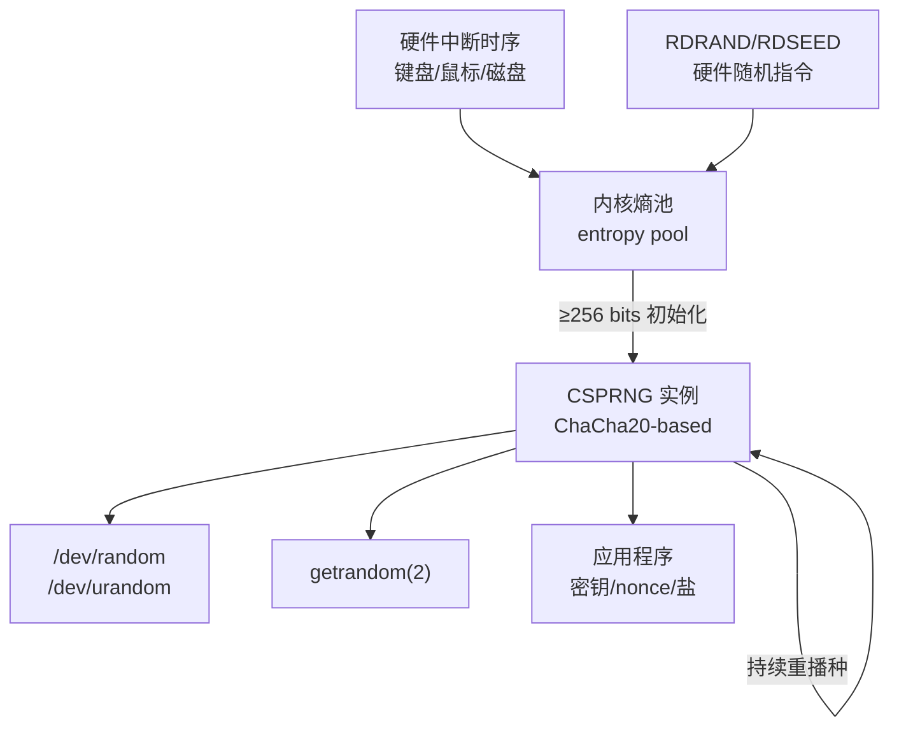
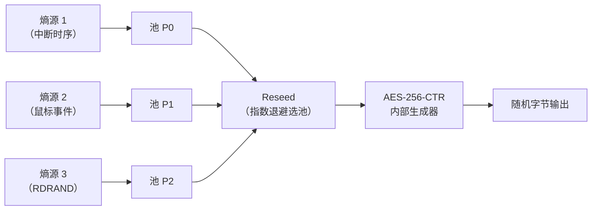

# 密码学（43）· 随机数与熵

> [!abstract] TL;DR
> - **随机数分三类**：TRNG（真随机，物理熵源，不可预测）、PRNG（伪随机，可预测，绝不用于密码）、**CSPRNG**（密码学安全伪随机，不可预测、前向后向安全，**所有密码操作的唯一合法来源**）。
> - **熵**是不确定性的度量：熵池聚合硬件中断时序、键盘鼠标、磁盘 I/O 等物理噪声；CSPRNG 用熵池播种，之后不断输出安全随机字节。
> - **CSPRNG 四大构造**：CTR-DRBG（AES 计数器）、HMAC-DRBG（RFC 6979 也用它）、Hash-DRBG、Fortuna（多池收集熵），现代 Linux 内核默认用 **ChaCha20-based** 生成器。
> - **OS 接口**：Linux/macOS 推荐 **`getrandom(2)`**（阻塞至熵足够，不受文件描述符限制）；Windows 用 **`BCryptGenRandom`**；`/dev/urandom` 在初始化后等价安全，现代内核已基本消除两者区别。**绝对不要用 `rand()` 或时间种子做密钥/nonce**。
> - **弱随机危害经典案例**：Debian OpenSSL 2008（熵被注释致私钥可枚举）、Dual_EC_DRBG 后门（NSA 可预测）、**ECDSA nonce 弱随机（呼应 [[27.ECDSA签名]] / [[54.ECDSA-nonce攻击]]）**、VM 启动早期熵不足。每个案例都造成了现实灾难。

本篇是「密码学」系列 KDF 与随机数子模块的收官篇，承接 [[38.HKDF]]（KDF 构建基础）与 [[36.HMAC]]（HMAC-DRBG 的底层构件），正式解答"密码操作的随机数从哪来、为何弱随机是灾难"，并为后续 [[44.国密SM体系概览]] 提供随机数安全的工程地基。nonce 弱随机的数学深度攻击见 [[54.ECDSA-nonce攻击]]；口令哈希的随机盐依赖本篇的 CSPRNG 保证。

---

## 概述与定位

### 为什么随机数是密码学的命脉

密码学的安全基础是**秘密不可预测**。无论是 AES 会话密钥、ECDSA 签名 nonce、RSA-OAEP 的随机填充，还是 PBKDF2/Argon2 的随机盐——这些"秘密"的不可预测性，全部最终依赖一个问题的答案：**生成它的随机数够好吗？**

若随机数可预测，攻击者即可枚举密钥、伪造签名、破解加密——算法本身再强都无济于事。密码史上最惨烈的真实漏洞中，**有相当一部分根因不是算法破解，而是随机数出了问题**：

- Debian OpenSSL 2008：一个注释掉两行代码的失误，使 SSL 私钥空间缩减为约 32767 个可枚举值。
- Dual_EC_DRBG 后门：NSA 埋入椭圆曲线后门，让自己能预测"随机"输出。
- ECDSA nonce 弱随机：同一私钥 + 同一 nonce 签两条消息，私钥立即暴露（[[27.ECDSA签名]]、[[54.ECDSA-nonce攻击]]）。

本篇从头讲清随机数的分类、熵的来源与收集、CSPRNG 的主要构造、OS 接口的正确用法，以及上述真实案例的根因与防御。

### 随机数三层分类总览

| 类别 | 英文 | 可预测性 | 实现来源 | 可否用于密码 |
|---|---|---|---|---|
| 真随机数生成器 | TRNG | 不可预测（物理随机） | 硬件物理噪声 / RDRAND / RDSEED | 可以（但吞吐有限） |
| 伪随机数生成器 | PRNG | **完全可预测**（给定种子） | 数学公式（LCG、MT19937 等） | **绝对不可以** |
| 密码学安全伪随机 | CSPRNG | 不可预测（计算安全） | 以 TRNG 种子驱动的密码算法 | **是唯一正确选择** |

---

## 熵：随机性的数学度量

### 熵的概念

**熵（Entropy）**源自信息论（Shannon，1948）：对于随机变量 X，若其取值 x_i 出现概率为 p_i，则熵定义为：

```
H(X) = -Σ p_i · log₂(p_i)  （单位：bits）
```

直觉理解：**结果越不确定，熵越高；完全均匀分布时熵最大**。一枚公平硬币的结果有 1 bit 熵；一个真正均匀的 256 位密钥有 256 bits 熵；若密钥用时间戳（精度 1 秒，范围 1 年 ≈ 3.15×10⁷ 个值）生成，则熵不超过 log₂(3.15×10⁷) ≈ 25 bits——攻击者轻松枚举。

密码上下文中，我们关心的是**最小熵（Min-entropy）**，即最坏情况下的不确定性：

```
H∞(X) = -log₂(max_i p_i)
```

一个 256 位密钥的最小熵要达到 256 bits，才能保证暴力搜索在计算上不可行。

### 熵源：物理世界的不确定性

TRNG 和 CSPRNG 的种子都来自**物理熵源（entropy source）**，典型来源：

| 熵源 | 原理 | 熵质量 |
|---|---|---|
| 硬件中断时序 | 网卡/磁盘/键盘中断的到达时刻抖动（纳秒级） | 高，且持续产生 |
| 键盘/鼠标事件 | 用户输入的时间间隔与键值 | 中，依赖用户交互 |
| 磁盘 I/O 时序 | 磁头寻道延迟的随机分量 | 中 |
| 热噪声 / 量子噪声 | CPU/GPU 内部热噪声、量子隧穿效应 | 高，硬件直接提供 |
| 硬件随机数指令 | Intel RDRAND（热噪声）、RDSEED（直接熵源） | 高 |
| 环境传感器 | 温度/气压/摄像头 | 应用场景特殊 |

> [!warning] 熵不足的高危场景
> - **虚拟机（VM）启动早期**：无物理硬件时序，vCPU 中断规律可预测；需要 `virtio-rng`（KVM）或 `hv_rng`（Hyper-V）将宿主机熵注入 guest。
> - **嵌入式/IoT 设备**：无键盘/磁盘，首次上电时熵极少；若直接生成 TLS 私钥可能产生弱密钥。
> - **容器化环境**：容器共享宿主内核熵池，多容器同时启动可能竞争，但现代内核已大幅缓解。

### 熵池：收集与积累

操作系统维护一个**熵池（entropy pool）**，持续聚合各熵源的样本，并用**熵估计算法**追踪"当前熵池里大约积累了多少 bits 的不确定性"。Linux 内核的熵池实现演化如下：

- 内核 < 5.17：维护两个独立池（`/dev/random` 用阻塞池，`/dev/urandom` 用非阻塞池），熵估计保守，启动早期 `/dev/random` 频繁阻塞。
- 内核 ≥ 5.17（Linus Torvalds commit，2022）：将两个池合并，CSPRNG 在积累 256 bits 熵后初始化，**之后 `/dev/random` 不再阻塞**，行为与 `/dev/urandom` 完全一致。



---

## 随机数分类详解

### TRNG（真随机数生成器）

TRNG 直接从物理过程采样：硬件噪声、放射性衰变、光子路径等。其输出**不依赖任何算法**，在物理学意义上不可预测（受量子力学支配）。

**硬件指令接口（x86）**：
- **`RDRAND`**：从 Intel Bull Mountain 热噪声处理器直接读 128 位随机数，经过内部 CSPRNG 调理（AES-CTR-DRBG），吞吐约 1 GB/s。
- **`RDSEED`**：直接读取未经 CSPRNG 调理的原始熵源，吞吐更低但更"原始"，适合为软件 CSPRNG 播种。

TRNG 的缺点是**吞吐有限**，且需要硬件支持。大批量密码操作不直接用 TRNG，而是用它为 CSPRNG 播种。

### PRNG（伪随机数生成器）

PRNG 以一个初始**种子（seed）**为出发点，通过确定性数学公式生成"看起来随机"的序列。典型代表：

| PRNG | 算法 | 典型应用 | 密码学可用？ |
|---|---|---|---|
| LCG（线性同余） | `X_{n+1} = (aX_n + c) mod m` | C 语言 `rand()`、Java `Math.random()` | **绝对不行** |
| MT19937（Mersenne Twister） | 624 维矩阵移位 | Python `random` 模块、NumPy、游戏模拟 | **不行**（624 个输出可恢复全状态） |
| Xorshift | XOR + 移位组合 | 游戏随机数、高性能模拟 | **不行** |

> [!danger] PRNG 的致命弱点
> PRNG 的状态有限且可被**完全恢复**：给定足够多输出样本，攻击者可以重建内部状态，从而预测所有未来（和过去）的输出。MT19937 只需观察 624 个连续 32 位输出即可重建状态——这是有公开工具的已知攻击。
>
> 用 `rand()` 或 `time(NULL)` 种子做密钥，是密码工程的原罪。

### CSPRNG（密码学安全伪随机数生成器）

CSPRNG 是一种特殊的 PRNG，额外满足**密码学安全性要求**：

1. **不可预测性（Next-bit unpredictability）**：给定所有已知输出，攻击者无法以超过 1/2 的概率预测下一个 bit（这正是 PRG 的形式安全定义）。
2. **前向安全（Forward secrecy）**：当前状态泄露，攻击者无法推算**过去**的输出。
3. **后向安全（Backward secrecy / Break-in recovery）**：CSPRNG 持续注入新熵；即使某时刻状态被泄露，新熵注入后攻击者**无法预测之后**的输出。

这三条性质使得 CSPRNG 在计算安全模型下等价于 TRNG，可安全用于所有密码操作。

---

## CSPRNG 构造详解

### CTR-DRBG

**CTR-DRBG**（Counter-mode Deterministic Random Bit Generator，NIST SP 800-90A）用 AES 分组密码的计数器模式（[[13.CTR模式]]）作为核心。

核心状态：`(Key, V)`，其中 `Key` 是 AES 密钥，`V` 是 128 位计数器。

**生成过程（伪代码）**：

```
生成 n 字节输出：
  output = []
  while len(output) < n:
    V = V + 1
    output.append(AES_K(V))
  return output[:n]

更新状态（reseed）：
  seed_material = entropy_input ‖ additional_input
  temp = CTR_generate(seed_material_len)
  Key = temp[0:32]   # 256 位新密钥
  V   = temp[32:48]  # 新计数器
```

CTR-DRBG 的安全性归约到 AES 的伪随机性。NIST 在 SP 800-90A 中给出了正式规范，Windows 的 `BCryptGenRandom` 在许多情况下底层即 CTR-DRBG（AES-256）。

> [!warning] Dual_EC_DRBG 的警示
> NIST SP 800-90A **曾同时收录** Dual_EC_DRBG（双椭圆曲线 DRBG）——2006 年由 NSA 主导提出。2013 年 Snowden 文件与 Bernstein 等人的密码分析共同揭示：其中的椭圆曲线点 P、Q 若由 NSA 自选（满足 `P = k·Q`，`k` 为秘密数），则知道 `k` 的人可以从有限输出位预测完整状态。RSA Security 在 BSAFE 库默认启用此 DRBG，Juniper 的 ScreenOS VPN 也暗中使用，造成国家级后门漏洞。2014 年 NIST 将其从标准中撤销。**根因：算法参数的不透明选择允许了后门嵌入。**

### HMAC-DRBG

**HMAC-DRBG**（NIST SP 800-90A）用 [[36.HMAC]] 作为 PRF 构建 DRBG，安全性归约到 HMAC 的伪随机性。

核心状态：`(K, V)`，初始 `K = 0x00...00`（32 字节），`V = 0x01...01`（32 字节）。

**生成过程（简化伪代码）**：

```
# 更新函数（内部）
HMAC_DRBG_Update(provided_data):
  K = HMAC(K, V ‖ 0x00 ‖ provided_data)
  V = HMAC(K, V)
  if provided_data != ∅:
    K = HMAC(K, V ‖ 0x01 ‖ provided_data)
    V = HMAC(K, V)

# 生成 n 字节
HMAC_DRBG_Generate(n):
  output = []
  while len(output) < n:
    V = HMAC(K, V)
    output.append(V)
  HMAC_DRBG_Update(additional_input)
  return concat(output)[:n]
```

**RFC 6979 确定性 ECDSA nonce**正是 HMAC-DRBG 的典型应用：用私钥 `d` 和消息哈希 `z` 作为种子材料，确定性地派生 nonce `k`，彻底消除 ECDSA 对外部随机数的依赖（呼应 [[27.ECDSA签名]] 中 nonce 的命门地位）。其伪代码：

```
RFC 6979 确定性 nonce 派生：
  h1 = H(message)          # 消息哈希
  V = 0x01...01 (hlen)
  K = 0x00...00 (hlen)
  K = HMAC_K(V ‖ 0x00 ‖ int2octets(x) ‖ bits2octets(h1))
  V = HMAC_K(V)
  K = HMAC_K(V ‖ 0x01 ‖ int2octets(x) ‖ bits2octets(h1))
  V = HMAC_K(V)
  loop:
    T = ∅
    while len(T) < qlen: T = T ‖ HMAC_K(V); V = HMAC_K(V)
    k = bits2int(T)
    if 1 ≤ k ≤ q-1: return k
    K = HMAC_K(V ‖ 0x00); V = HMAC_K(V)
```

### Hash-DRBG

**Hash-DRBG**（NIST SP 800-90A）用哈希函数直接构建，核心是 **Hashgen** 和 **Hash_df**（哈希派生函数）。状态为 `(V, C, reseed_counter)`，生成时 `V` 每步递增后哈希聚合。安全性归约到哈希函数的单向性与抗碰撞性。Hash-DRBG 在没有 AES 硬件加速的嵌入式场景中有时比 CTR-DRBG 更轻量。

### Fortuna

**Fortuna**（Ferguson & Schneier，2003）是一个工程上特别强健的 CSPRNG，核心设计亮点是**多熵池轮转**，以防止攻击者通过精心控制熵源注入来攻击种子：

- **32 个熵池** P0…P31，熵源向各池分散注入。
- 每次 reseed 时，将从 P0 开始，仅在"第 i 次 reseed 是 2^i 的倍数时"才包含 Pi（指数退避），使得攻击者即使污染了 P0 也无法持续影响更高编号的池。
- 内部生成器：AES-256 + CTR，每 1 MB 输出后强制 reseed（前向安全）。



macOS/iOS 的 `/dev/random` 实现（Yarrow）是 Fortuna 的前身；FreeBSD 已切换到 Fortuna。

### ChaCha20-based（现代 Linux 内核默认）

Linux 4.8+ 将内核 CSPRNG 切换为 **ChaCha20**（见 [[16.ChaCha20-Poly1305]] 中的流密码部分）：

- 内部状态为 256 位密钥 + 64 位计数器 + 96 位 nonce（ChaCha20 标准状态）。
- `crng_fast_key_erasure()`：每次从 crng 取随机字节时，**先生成一个新密钥替换当前密钥**，再用旧密钥输出数据——这实现了严格的前向安全（每次读取后旧密钥被覆盖擦除）。
- 定期从熵池 reseed（注入新熵），实现后向安全。
- 相比 AES-CTR-DRBG，ChaCha20 在无 AES-NI 的平台上纯软件实现性能更高，且无已知侧信道风险。

---

## OS 接口：正确调用方式

### Linux / macOS

| 接口 | 阻塞行为 | 推荐程度 | 说明 |
|---|---|---|---|
| `getrandom(2)` | 阻塞直至初始化完成，之后不阻塞 | **★★★★★ 首选** | Linux 3.17+，不受 fd 限制，信号中断可重试 |
| `/dev/urandom` | 初始化后不阻塞 | ★★★★ 可用 | 内核初始化后与 `getrandom` 等价安全 |
| `/dev/random` | 旧内核可能频繁阻塞 | ★★★ 不推荐阻塞 | 内核 ≥5.17 后行为与 urandom 一致 |
| `getentropy(3)` | 同 getrandom | ★★★★★ 用户空间封装 | glibc 2.25+ / OpenBSD，最多 256 字节/调用 |

**`getrandom(2)` 推荐用法（C 示例）**：

```c
#include <sys/random.h>
#include <stdint.h>
#include <errno.h>

int get_random_bytes(void *buf, size_t len) {
    ssize_t ret;
    uint8_t *p = buf;
    while (len > 0) {
        ret = getrandom(p, len, 0);   /* flags=0：阻塞等待初始化，之后立即返回 */
        if (ret < 0) {
            if (errno == EINTR) continue;   /* 信号中断，重试 */
            return -1;
        }
        p += ret;
        len -= ret;
    }
    return 0;
}
```

> [!warning] 示例输出为示意
> 上述代码仅展示接口用法，实际编译依赖 glibc ≥ 2.25 和 Linux 内核 ≥ 3.17。

### Windows

**`BCryptGenRandom`**（CNG，Windows Vista+）是 Windows 下的标准 CSPRNG 接口：

```c
#include <bcrypt.h>
#pragma comment(lib, "bcrypt.lib")

NTSTATUS status = BCryptGenRandom(
    NULL,                           /* 使用默认算法提供者 */
    (PUCHAR)buffer,
    (ULONG)length,
    BCRYPT_USE_SYSTEM_PREFERRED_RNG /* 使用系统首选 RNG */
);
if (!BCRYPT_SUCCESS(status)) { /* 错误处理 */ }
```

> [!warning] 避免使用 `CryptGenRandom`（CAPI）
> 旧版 `CryptGenRandom` 已废弃，在某些场景下有状态共享问题；现代代码统一用 CNG 的 `BCryptGenRandom`。

### 高层语言接口

| 语言 / 运行时 | 推荐接口 | 底层调用 |
|---|---|---|
| Python | `secrets` 模块（≥ 3.6） | `os.urandom` → `getrandom`/`BCryptGenRandom` |
| Go | `crypto/rand.Read` | `getrandom` / `CryptGenRandom` |
| Rust | `rand::rngs::OsRng` | OS CSPRNG |
| Java | `SecureRandom` | OS CSPRNG（自动选择） |
| Node.js | `crypto.randomBytes` | OpenSSL → OS CSPRNG |
| C++ | `std::random_device` | 实现定义，部分平台不安全，建议直接调系统接口 |

> [!danger] 绝对禁止
> `rand()`、`srand(time(NULL))`、`Math.random()`（JS）、`random.random()`（Python）用于密钥、nonce、盐、令牌——这些都是 PRNG，攻击者可预测。

---

## 弱随机危害：真实世界灾难

### 案例一：Debian OpenSSL 2008 ——熵被注释掉

**时间**：2006 年（引入）、2008 年 5 月（公开披露）。

**根因**：Debian 维护者在打包 OpenSSL 时，为了消除 Valgrind（内存分析工具）报告的"使用未初始化内存"警告，注释掉了 OpenSSL 熵收集代码中的两行：

```c
// MD_Update(&m, buf, j);   /* ← 这行被注释掉 */
// MD_Update(&m, (unsigned char *)&(md_c.c), sizeof(md_c.c));  /* ← 这行也被注释 */
```

这两行负责将进程 ID（PID）外的**实际熵**加入哈希。注释后，唯一的熵来源剩下 **PID**，而 Linux PID 上限仅为 32768——意味着任意 Debian/Ubuntu 系统上生成的 SSL 私钥、SSH 私钥最多只有 **32768** 种可能值。

**危害**：攻击者可在数秒内枚举全部可能密钥，匹配已知公钥。全球所有 2006-05-17 至 2008-05-13 期间在 Debian/Ubuntu 上生成的 RSA/DSA 密钥全部作废，涉及 SSL/TLS 证书、SSH 授权密钥等。

**教训**：熵收集代码绝对不能以任何理由删减；PRNG 的"警告"背后可能是正确行为（使用"未初始化内存"作为额外熵）。

### 案例二：Dual_EC_DRBG ——NSA 后门

**时间**：2006 年收录 NIST SP 800-90A，2013 年 Snowden 文件曝光，2014 年撤销。

**构造**：Dual_EC_DRBG 使用两个椭圆曲线点 P、Q 作为参数：

```
s_{i+1} = x(s_i · P)        # 更新状态
r_i     = x(s_i · Q) 截断   # 输出
```

若 `P = e·Q`（`e` 为秘密整数，即 ECDLP 解），则知道 `e` 的人可以从输出 `r_i` 反推 `s_i`，进而预测所有后续输出。Bernstein 等人证明 NSA 选择的 P、Q 对完全符合此结构。

**危害**：Juniper 的 ScreenOS VPN 设备（数百万台）暗中使用 Dual_EC_DRBG 作为默认 DRBG，NSA（及后来可能的第三方攻击者）可解密 VPN 流量。

**教训**：密码标准参数必须可验证来源（Nothing-Up-My-Sleeve 数字）；单一机构主导的标准需要独立审计。

### 案例三：ECDSA nonce 弱随机 ——私钥一步暴露

ECDSA 签名中，nonce `k` 必须每次独立均匀随机生成（见 [[27.ECDSA签名]]）。若 `k` 由弱 PRNG 生成或有偏置：

**nonce 重用（k 相同，两条签名）**：

```
s₁ = k⁻¹(z₁ + r·d) mod n
s₂ = k⁻¹(z₂ + r·d) mod n

s₁ - s₂ = k⁻¹(z₁ - z₂) mod n
k = (z₁ - z₂)(s₁ - s₂)⁻¹ mod n
d = (s₁·k - z₁)·r⁻¹ mod n    ← 私钥直接暴露
```

这不需要任何计算困难假设——代入两次签名数据，直接解线性方程即可。

**nonce 偏置（k 的高位为零）**：即便 k 不完全重用，只要其分布有系统偏置，格密码（LLL/BKZ）的隐藏数问题（HNP）可从少量签名恢复私钥，详见 [[54.ECDSA-nonce攻击]]。

**真实案例**：
- **Sony PS3**（2010）：用固定常数替代随机 nonce，全球逆向工程师通过两个签名直接提取了固件签名私钥。
- **比特币 Android 钱包**（2013）：Java `SecureRandom` 在特定 Android 版本存在种子缺陷，多个比特币地址私钥被盗。

**防御**：强制使用 RFC 6979（HMAC-DRBG 确定性 nonce），从根本上消除随机数依赖。

### 案例四：虚拟机启动早期熵不足

**场景**：云平台批量启动 VM，每个 VM 在启动几秒内就调用密钥生成（OpenSSH host key、TLS 证书等）。

**问题**：VM 内核刚启动时，物理熵源（中断时序等）几乎为零，熵池为空。若此时生成密钥，CSPRNG 尚未充分初始化，输出熵量不足——不同 VM 甚至可能生成近似相同的密钥（当 VM 镜像完全相同时更严重）。

**已知事件**：2012 年 Heninger 等人的研究（"Mining Your Ps and Qs"）分析公网 SSH/TLS 公钥，发现约 0.5% 的 RSA 公钥共享一个素因子——批量可因式分解，根因正是 VM/嵌入式启动早期熵不足。

**防御**：
- 使用 `virtio-rng`（KVM）或 `hv_rng`（Hyper-V）将宿主机 CSPRNG 注入 guest。
- 使用 `rngd`/`haveged` 向内核熵池注入软件熵（已过时，现代内核 jitter entropy 更可靠）。
- 等待 `getrandom(2)` 返回（默认阻塞至初始化完成），不要在 `/dev/urandom` 未初始化时强行读取。

---

## 安全性与正确使用

### 黄金法则

> [!tip] 正确使用随机数的四条铁律
> 1. **永远用 OS CSPRNG**：Linux/macOS 用 `getrandom(2)` 或 `getentropy(3)`；Windows 用 `BCryptGenRandom`；高层语言用 `secrets`/`crypto/rand`/`SecureRandom`。
> 2. **绝不用 `rand()`、`random()`、时间种子**：无论是生成密钥、nonce、盐、令牌，还是会话 ID。
> 3. **注意启动早期**：服务进程若在系统启动极早期运行，检查 `getrandom` 是否返回 `EAGAIN`（`GRND_NONBLOCK` 下）；或直接阻塞等待初始化完成。
> 4. **注意 VM/容器环境**：确保虚拟化平台有 virtio-rng 或等价机制；容器镜像不要预先生成密钥然后复制。

### CSPRNG 选型对比

| 构造 | 标准/来源 | 安全归约 | 典型平台 | 备注 |
|---|---|---|---|---|
| CTR-DRBG (AES-256) | NIST SP 800-90A | AES 伪随机性 | Windows CNG、部分 HSM | 需 AES-NI 加速 |
| HMAC-DRBG (SHA-256) | NIST SP 800-90A | HMAC PRF 安全性 | TLS、RFC 6979 | 通用性强 |
| Hash-DRBG (SHA-256) | NIST SP 800-90A | 哈希函数单向性 | 嵌入式轻量场景 | 无需对称密码 |
| Fortuna | Ferguson/Schneier | AES + 多池抗污染 | macOS (Yarrow 变种) | 复杂但极健壮 |
| ChaCha20-based | Linux kernel | ChaCha20 伪随机性 | Linux 4.8+ | 软件性能优，无侧信道 |

### `/dev/random` vs `/dev/urandom` 的历史争论

历史上有观点认为："/dev/urandom 在熵池耗尽时不安全"。这个观点在**现代内核（≥5.17）已不成立**：

- CSPRNG 一旦初始化（积累 256 bits 熵），其输出的安全性由密码算法保证，不依赖每次生成时的即时熵量。
- 只有 **CSPRNG 未初始化时**读 urandom 才有风险——这恰好是 `getrandom(2)` 解决的问题（它在初始化完成前阻塞）。
- 因此：**`getrandom(2)` = 阻塞等安全 + 之后性能与 urandom 相同**，是统一答案。

### 与 HKDF 的关系

[[38.HKDF]] 的 Extract 阶段可以把**低质量随机性**提炼为高质量伪随机密钥（PRK）：

```
PRK = HMAC-Hash(salt, IKM)
```

但这**不能替代 CSPRNG**：若 IKM 本身是 `rand()` 输出（可预测），HKDF 再怎么混合也无法提升熵；反之，若 IKM 来自 CSPRNG，HKDF 用于**扩展和上下文绑定**，不是用于"修复弱随机性"。

---

## 小结

随机数是密码学的地基：算法再强，若随机数可预测，一切安全保证都崩塌。三类随机数中，只有 CSPRNG 同时具备不可预测性、前向安全与后向安全，是所有密码操作的合法来源。

操作系统已提供成熟的 CSPRNG 接口（`getrandom`、`BCryptGenRandom`），密码工程师的职责是：**调用它们，而不是自己造轮子**。Debian 2008、Dual_EC_DRBG、ECDSA nonce 弱随机、VM 启动早期熵不足——这些案例反复证明，任何对随机数的妥协，都会把整个密码体系的安全性拱手相让。

CSPRNG 构造上，HMAC-DRBG 以 [[36.HMAC]] 为核心提供了良好的通用性（RFC 6979 确定性 nonce 即其应用），ChaCha20-based 在现代 Linux 内核中以前向安全的密钥擦除提供了最高性能。理解这些构造，有助于在 HSM 选型、嵌入式系统设计、云安全配置中做出正确决策。

---

## 相关阅读

- [[27.ECDSA签名]] — nonce 的命门：弱随机直接导致私钥暴露
- [[54.ECDSA-nonce攻击]] — nonce 偏置 lattice 攻击的数学深度展开
- [[36.HMAC]] — HMAC-DRBG 与 RFC 6979 的底层构件
- [[38.HKDF]] — 高熵 KDF，与 CSPRNG 正确配合
- [[16.ChaCha20-Poly1305]] — ChaCha20 流密码，Linux 内核 CSPRNG 的内部引擎
- [[13.CTR模式]] — CTR-DRBG 的分组密码基础
- [[44.国密SM体系概览]] — 下一篇，国密体系的随机数要求（GM/T 0005）

---

⬅️ 上一篇 [[42.Argon2]] ｜ 🏠 [[00.密码学总览]] ｜ 下一篇 [[44.国密SM体系概览]] ➡️
