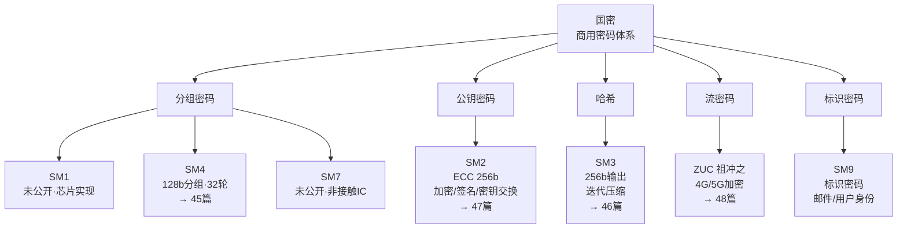
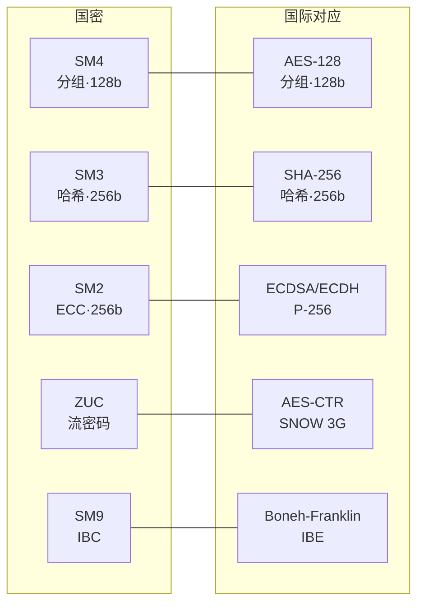

# 密码学（44）· 国密SM体系概览

> [!abstract] TL;DR
> - **国密（商用密码）** 是中国国家密码管理局（国家密码局，OSCCA）发布的一套自主可控密码标准，覆盖分组、公钥、哈希、流密码等全品类。
> - 核心算法：**SM1**（分组/未公开/芯片）、**SM2**（ECC 公钥）、**SM3**（哈希）、**SM4**（分组/公开）、**SM7**（分组/未公开）、**SM9**（标识密码 IBC）、**ZUC 祖冲之**（流密码）。
> - 与国际对标：SM2 ≈ ECDSA/ECDH（P-256 曲线换国密曲线）；SM3 ≈ SHA-256（同为 256 位输出）；SM4 ≈ AES（128 位分组/密钥）；ZUC ≈ AES/SNOW（流密码）。
> - 合规驱动：《密码法》（2020）、等保 2.0、"密评"（密码应用安全性评估）要求金融/政务/关基场景使用国密算法。
> - 国密 TLS：**TLCP**（GM/T 0024，双证书握手）是国密版 TLS，GmSSL、铜锁 Tongsuo 均支持。

---

## 概述与定位

### 什么是国密

"国密"即**商用密码**（Commercial Cryptography），指经国家密码局（OSCCA，国家密码管理局）批准或公告、用于商业应用的密码算法、协议与产品。中国从 20 世纪 90 年代开始推动自主密码体系，2010 年代 SM 系列算法陆续公开或进入国标，SM2、SM3、SM4 已于 2021 年被 ISO 采纳为国际标准（ISO/IEC 18033-3 AM1、ISO/IEC 10118-3 AM1 等）。

### 为什么需要独立体系

- **自主可控**：降低对 NIST 系曲线（P-256/P-384）或 AES 的单一依赖，规避潜在后门风险。
- **法律合规**：《中华人民共和国密码法》（2020 年 1 月施行）规定核心信息基础设施必须使用符合要求的密码产品，商用密码须经检测认证。
- **监管生态**：等保 2.0（GB/T 22239-2019）、金融行业标准（JR/T 系列）、政务系统均要求"密改"（密码改造，换用国密）。

### 本篇在系列中的位置

| 维度 | 本篇 | 相邻篇章 |
|---|---|---|
| 分组密码实现 | 提纲/概览 | [[45.SM4分组密码]] |
| 哈希算法实现 | 提纲/概览 | [[46.SM3哈希]] |
| 公钥/签名实现 | 提纲/概览 | [[47.SM2公钥密码]] |
| 流密码实现 | 提纲/概览 | [[48.ZUC流密码]] |
| 分组密码参照 | 国密 vs 国际 | [[04.AES详解]] |
| TLS 协议互动 | TLCP 握手 | [[71.详解网络协议/15.TLS协议.md]] |

---

## 原理与机制

### 国密算法体系全景



### 各算法速览

#### SM1 — 分组密码（未公开）

SM1 是国家密码局制定、**算法细节不公开**的 128 位分组密码，安全性与 AES-128 相当，密钥长度也为 128 位。SM1 只以 **IP 核/芯片**形式提供，应用于 USBKEY、IC 卡、智能门禁等场景。软件无法直接调用——必须通过内嵌 SM1 芯片的硬件密码设备（密码卡/密码机/USBKEY）的标准 API（SKF/PKCS#11）访问。

#### SM2 — 公钥密码（ECC）

基于椭圆曲线离散对数问题（ECDLP）的公钥密码，定义在国密推荐的 256 位素数域曲线 `sm2p256v1`（曲线参数由国家密码局发布）。SM2 涵盖三种功能：

- **SM2 加密**：类 ElGamal 的非对称加密（KDF + 对称加密 + 完整性）。
- **SM2 数字签名**：类 ECDSA 的签名，但引入用户身份信息（Z 值）预处理，强制绑定用户标识到签名，防止公钥替换攻击。
- **SM2 密钥交换**：类 ECDH 的双向密钥协商协议。

与国际算法对比：

| 维度 | SM2 | ECDSA / ECDH |
|---|---|---|
| 曲线 | sm2p256v1（国密） | P-256（NIST）/ secp256k1 |
| 签名特有 | Z 值绑定用户标识 | 无此机制 |
| 加密 | 内建非对称加密方案 | ECDH + KDF 另行组合 |
| 安全强度 | 128 位 | 128 位（P-256） |

详见 [[47.SM2公钥密码]]。

#### SM3 — 哈希

SM3 输出 256 位摘要，消息分组 512 位，迭代压缩结构。整体设计风格接近 SHA-256（Merkle-Damgård + 压缩函数），但使用了自有的消息扩展、布尔函数和常量，与 SHA-256 完全不同的内部状态更新路径。

| 维度 | SM3 | SHA-256 |
|---|---|---|
| 输出长度 | 256 位 | 256 位 |
| 分组大小 | 512 位 | 512 位 |
| 轮数 | 64 | 64 |
| 消息扩展 | 自有（W/W' 双序列） | 右移/旋转 σ 函数 |
| 标准 | GB/T 32905-2016 | FIPS 180-4 |

详见 [[46.SM3哈希]]。

#### SM4 — 分组密码（公开）

SM4 是国密体系里**唯一完全公开且广泛软件实现**的分组密码：128 位分组，128 位密钥，**32 轮** 非平衡 Feistel 结构（实为 SP 网络变体），采用 S 盒 + 线性变换（L 函数）。2006 年随 WLAN 安全标准一同公布，是最常用的国密对称算法，用于替代 AES 的所有场景（VPN、存储加密、TLS 等）。

| 维度 | SM4 | AES-128 |
|---|---|---|
| 分组 | 128 位 | 128 位 |
| 密钥 | 128 位 | 128 位 |
| 结构 | 32 轮 Feistel-SP | 10 轮 SPN |
| S 盒 | 8→8 bit（单一） | 8→8 bit（含 GF 逆） |
| 标准 | GB/T 32907-2016 | FIPS 197 |

详见 [[45.SM4分组密码]]。

#### SM7 — 分组密码（未公开）

SM7 为 128 位分组密码，算法细节不公开，主要用于**非接触式 IC 卡**（门禁、公交、园区管理）场景。与 SM1 类似，只通过芯片形式提供。

#### SM9 — 标识密码（IBC）

SM9 是基于**双线性配对**的标识密码（Identity-Based Cryptography，IBC），无需预先交换证书——直接用用户标识（邮件地址、手机号、企业 ID 等）作为公钥，由密钥生成中心（KGC，Key Generation Center）派生私钥下发给用户。

SM9 功能包括：标识加密、标识签名、标识密钥协商。典型场景：企业内部邮件加密、无 PKI 基础设施的端对端场景。安全基础：椭圆曲线双线性对（Weil/Tate/Ate Pairing）的计算困难性。标准：GM/T 0044-2016。

#### ZUC 祖冲之 — 流密码

ZUC 是面向**移动通信**的流密码，已被 3GPP 采纳为 LTE（4G）和 NR（5G）的加密算法（EEA3）和完整性保护算法（EIA3）。密钥 128 位（5G 扩展到 256 位），初始向量 128 位，生成 32 位字节序列的密钥流。

| 维度 | ZUC | AES-CTR（用于 EEA2） | SNOW 3G（用于 EEA1） |
|---|---|---|---|
| 类型 | 流密码 | 分组→流 | 流密码 |
| 密钥流单位 | 32 位字 | 任意 | 32 位字 |
| 标准 | GB/T 33133-2016 | 3GPP EEA2 | 3GPP EEA1 |

详见 [[48.ZUC流密码]]。

---

## 标准体系

### GM/T 系列与 GB/T 系列

国密标准分两类：**GM/T**（密码行业标准，由国家密码局制定）和 **GB/T**（国家推荐标准，由 SAC 发布，部分同时对应国际 ISO 标准）。

| 标准号 | 内容 | 算法 |
|---|---|---|
| GM/T 0002-2012 → GB/T 32907-2016 | 分组密码 | SM4 |
| GM/T 0003-2012 → GB/T 32918-2016 | 公钥密码 | SM2（五部分：总则/密钥交换/加密/签名/参数） |
| GM/T 0004-2012 → GB/T 32905-2016 | 密码杂凑 | SM3 |
| GM/T 0044-2016 | 标识密码 | SM9 |
| GM/T 0001-2012 → GB/T 33133-2016 | 流密码 | ZUC |
| GM/T 0024-2014 | SSL VPN 技术规范 | 国密 TLS（TLCP） |
| GM/T 0028-2014 | 密码模块安全技术要求 | 类 FIPS 140-2 |
| GM/T 0054-2018 | 信息系统密码应用基本要求 | "密评"基准 |
| GM/T 0086-2020 | TLCP 协议 | TLCP 双证书 |

---

## 合规背景

### 《密码法》与商用密码管理

2020 年 1 月 1 日施行的**《中华人民共和国密码法》**正式确立商用密码的法律地位：

- 核心信息基础设施（关基）必须使用**商用密码**保护。
- 商用密码产品须经国家密码局认定的机构**检测认证**。
- 商用密码服务提供者须具备相应资质。

### 等保 2.0 与密评

- **等保 2.0**（GB/T 22239-2019）在安全通信网络、安全计算环境中对加密算法作要求，三级及以上系统实际工作中应使用国密算法。
- **密评**（密码应用安全性评估，CACS）是《密码法》配套的合规验证机制，由具备密评资质的机构对信息系统密码应用情况出具评估报告，要求覆盖物理、网络、应用、数据等层次。
- **GM/T 0054-2018**《信息系统密码应用基本要求》是密评的核心技术依据，规定了身份认证、数据完整性、机密性等各层面使用国密的要求。

### 行业要求

| 行业 | 典型要求 |
|---|---|
| 金融 | JR/T 0025 系列（金融 CA、网上银行）；PBOC 应用（银行卡/网联）必须支持 SM2/SM3/SM4 |
| 政务 | 电子政务外网、统一身份认证须使用国密 CA |
| 关键基础设施 | 电力、能源、通信、交通调度等须通过密评 |
| 商密产品 | 密码机、VPN 网关、USBKEY 须通过 GM/T 0028 检测 |

---

## 国密 TLS（TLCP）

### 背景

标准 TLS 1.2/1.3（见 [[71.详解网络协议/15.TLS协议.md]]）使用 NIST 曲线（P-256/P-384）或 X25519，套件如 `TLS_AES_128_GCM_SHA256`。金融与政务场景需要全链路国密，于是出现了**TLCP**（Transport Layer Cryptography Protocol，GM/T 0024/0086）。

### 双证书机制

TLCP 最显著的特征是服务端须持有**两张证书**：

- **签名证书**（Sign Cert）：用于身份认证，对应 SM2 签名私钥。
- **加密证书**（Enc Cert）：用于密钥交换/加密，对应 SM2 加密私钥。

这与标准 TLS 单证书（同一密钥对既签名又用于密钥交换）不同，双证书拆分了签名与加密的密钥对，符合国密 CA 颁发体系要求，便于密钥托管与合规审计。

### TLCP 握手简图

```mermaid
graph LR
  C["客户端"] -->|ClientHello<br/>含国密套件| S["服务端"]
  S -->|ServerHello<br/>Certificate(签名证书)<br/>Certificate(加密证书)<br/>ServerHelloDone| C
  C -->|ClientKeyExchange<br/>用加密证书公钥<br/>加密预主密钥| S
  C -->|ChangeCipherSpec<br/>Finished| S
  S -->|ChangeCipherSpec<br/>Finished| C
```

### 典型套件

| 套件名称 | 密钥交换 | 对称加密 | MAC/完整性 |
|---|---|---|---|
| `ECC-SM4-CBC-SM3` | SM2（加密证书） | SM4-CBC | SM3-HMAC |
| `ECC-SM4-GCM-SM3` | SM2（加密证书） | SM4-GCM（AEAD） | SM3 |
| `ECDHE-SM4-CBC-SM3` | ECDHE（国密曲线） | SM4-CBC | SM3-HMAC |

### 开源实现

| 项目 | 说明 |
|---|---|
| **GmSSL**（北大王磊） | 最活跃的国密开源 SSL 库，基于 OpenSSL 深度改造，完整支持 SM1/2/3/4/9/ZUC、TLCP |
| **铜锁 Tongsuo**（阿里巴巴） | 基于 OpenSSL 3 分支，upstream 持续同步，支持 TLCP，已进入 OpenSSL 社区贡献 |
| **BouncyCastle（Java）** | 从 1.71 起内置 SM2/SM3/SM4，支持国密 JCE Provider |
| **OpenSSL 主线** | 原生支持 SM3/SM4（engine 形式），SM2 也已在主线引入（3.x），但 TLCP 需 Tongsuo 补丁 |

> [!warning] 示例输出为示意
> 以下命令为示意，实际输出取决于 GmSSL 版本与环境：
> ```bash
> # GmSSL 生成 SM2 密钥对（示意）
> gmssl genpkey -algorithm sm2 -out sm2key.pem
> # 生成 SM3 哈希（示意）
> echo -n "hello" | gmssl sm3
> # TLCP 服务端测试（示意，需签名+加密双证书）
> gmssl s_server -cert sign.crt -key sign.key -enc_cert enc.crt -enc_key enc.key -port 443 -tlcp
> ```

---

## 算法流程 / 结构详解

### 国密算法与国际算法对应速查



### 各算法核心参数汇总

| 算法 | 类型 | 分组/密钥/输出 | 结构 | 公开 | 主要标准 |
|---|---|---|---|---|---|
| SM1 | 分组 | 128b / 128b / 128b | 未公开 | 否 | GM/T（内部） |
| SM2 | 公钥（ECC） | 256b 曲线 | ECC（Weierstrass） | 是 | GB/T 32918 |
| SM3 | 哈希 | — / — / 256b | Merkle-Damgård 变体 | 是 | GB/T 32905 |
| SM4 | 分组 | 128b / 128b / 128b | 32 轮 Feistel-SP | 是 | GB/T 32907 |
| SM7 | 分组 | 128b / 128b / 128b | 未公开 | 否 | GM/T（内部） |
| SM9 | 标识密码（IBC） | 256b 双线性对 | 配对 | 是 | GM/T 0044 |
| ZUC | 流密码 | — / 128b+IV128b / — | LFSR + 非线性 | 是 | GB/T 33133 |

---

## 安全性与正确使用

### 算法本身的安全性

已公开的国密算法（SM2/SM3/SM4/SM9/ZUC）经过国际密码学界的公开分析，**目前无已知实用攻击**，安全性与同等级国际算法相当：

- **SM4**：128 位安全强度，无已知弱密钥，差分/线性分析均有 32 轮的充分冗余。
- **SM3**：设计参考 SHA-2 但作了改进，目前无碰撞攻击，256 位输出提供 128 位抗碰撞强度。
- **SM2**：安全性依赖 sm2p256v1 曲线上的 ECDLP，128 位强度，曲线参数由国密局发布，无官方后门证据。
- **ZUC**：通过了 3GPP SAGE 安全评估，无已知实用弱点。

> [!important] 注意：算法安全 ≠ 实现安全
> 国密算法的安全性前提是**正规认证的实现**。使用未通过 GM/T 0028 检测的自研实现，存在旁路攻击（时序、功耗）、侧信道等实现层风险——与使用非认证 AES 实现一样危险。

### 正确使用建议

1. **合规场景务必使用国密**：等保三级及以上、金融、政务系统不要因"AES 也很安全"而忽略合规要求，密评不过门会直接影响系统上线资质。
2. **区分公开与未公开算法**：SM1/SM7 只通过硬件 API 调用，软件层无法直接使用；SM2/SM3/SM4/ZUC/SM9 可用软件库实现，但生产环境推荐使用通过认证的密码库（GmSSL、铜锁 Tongsuo）。
3. **SM2 私钥安全**：与 ECDSA 一样，SM2 签名的随机数（k 值）一旦泄露或重用，私钥即可恢复（参见 [[47.SM2公钥密码]]）。
4. **SM4 工作模式**：裸 SM4 同 AES-ECB，禁止直接用于多分组数据；应配合 CBC/CTR/GCM（SM4-GCM 是 TLCP 推荐的 AEAD 模式）。
5. **证书链合规**：TLCP 双证书须向国密 CA（如 CFCA、天威诚信等通过认证的 CA）申请，不能用普通 TLS CA 签发的证书凑数。
6. **国际/国密并存场景**：可在同一服务端同时支持 TLS 1.3（国际套件）和 TLCP（国密套件），按客户端 Hello 协商，铜锁 Tongsuo 提供这种双栈能力。

### 常见误用

| 误用 | 问题 | 正确做法 |
|---|---|---|
| SM3 直接哈希口令存储 | 无盐可被彩虹表攻击 | SM3 + PBKDF2/scrypt/Argon2（见 [[41.scrypt]]） |
| SM4-ECB 加密文件 | 暴露数据块模式（企鹅图问题） | SM4-CBC（随机 IV）或 SM4-GCM |
| SM2 签名 k 值复用 | 私钥可恢复 | 使用 RFC 6979 风格确定性 k（GmSSL 已实现） |
| 混用国密/非国密 CA | 双证书链不一致，密评不通过 | 签名证书与加密证书统一向国密 CA 申请 |

---

## 小结

国密 SM 体系是一套**完整且自洽**的密码标准族：分组（SM4）、哈希（SM3）、公钥/ECC（SM2）、标识密码（SM9）、流密码（ZUC）覆盖现代密码应用所有基本需求，已公开算法安全强度与 NIST 同级对应物相当。合规背景（《密码法》+密评+等保 2.0）使得国密在国内关键系统中已从"可选"变为"必选"。国密 TLS（TLCP）通过双证书机制在 TLS 握手框架内嵌入国密算法，GmSSL 与铜锁 Tongsuo 提供了生产可用的开源实现。

后续各篇分别深入 SM4（分组原理）、SM3（哈希压缩）、SM2（ECC 数学）、ZUC（流密码设计）的实现细节。

---

## 相关阅读

- [[45.SM4分组密码]]：32 轮非平衡 Feistel-SP 结构详解
- [[46.SM3哈希]]：与 SHA-256 逐步对比，压缩函数内幕
- [[47.SM2公钥密码]]：ECC 数学 + 签名/加密/密钥交换协议
- [[48.ZUC流密码]]：LFSR + 非线性函数 + 移动通信部署
- [[04.AES详解]]：国密 SM4 的国际对标，理解分组密码参照基准
- [[71.详解网络协议/15.TLS协议.md]]：TLS 握手与 TLCP 双证书机制对比
- [[43.随机数与熵]]：CSPRNG 对 SM2 签名 k 值安全的支撑

---

⬅️ 上一篇 [[43.随机数与熵]] ｜ 🏠 [[00.密码学总览]] ｜ 下一篇 [[45.SM4分组密码]] ➡️
